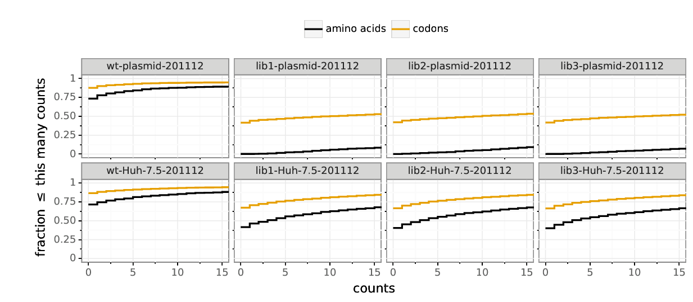

```python

######## snakemake preamble start (automatically inserted, do not edit) ########
import sys; sys.path.extend(['/fh/fast/bloom_j/software/miniconda3/envs/ZIKV_DMS_NS5_EvansLab/lib/python3.8/site-packages', '/fh/fast/bloom_j/computational_notebooks/jbloom/2021/ZIKV_DMS_NS5_EvansLab']); import pickle; snakemake = pickle.loads(b'\x80\x04\x95Y\x05\x00\x00\x00\x00\x00\x00\x8c\x10snakemake.script\x94\x8c\tSnakemake\x94\x93\x94)\x81\x94}\x94(\x8c\x05input\x94\x8c\x0csnakemake.io\x94\x8c\nInputFiles\x94\x93\x94)\x81\x94(\x8c\x1adata/tile_1_amplicon.fasta\x94\x8c&data/tile_1_subamplicon_alignspecs.txt\x94\x8c\x1adata/tile_1_samplelist.csv\x94e}\x94(\x8c\x06_names\x94}\x94(\x8c\x08amplicon\x94K\x00N\x86\x94\x8c\nalignspecs\x94K\x01N\x86\x94\x8c\nsamplelist\x94K\x02N\x86\x94u\x8c\x12_allowed_overrides\x94]\x94(\x8c\x05index\x94\x8c\x04sort\x94eh\x18\x8c\tfunctools\x94\x8c\x07partial\x94\x93\x94h\x06\x8c\x19Namedlist._used_attribute\x94\x93\x94\x85\x94R\x94(h\x1e)}\x94\x8c\x05_name\x94h\x18sNt\x94bh\x19h\x1ch\x1e\x85\x94R\x94(h\x1e)}\x94h"h\x19sNt\x94bh\x10h\nh\x12h\x0bh\x14h\x0cub\x8c\x06output\x94h\x06\x8c\x0bOutputFiles\x94\x93\x94)\x81\x94\x8c\x0eresults/tile_1\x94a}\x94(h\x0e}\x94\x8c\nresultsdir\x94K\x00N\x86\x94sh\x16]\x94(h\x18h\x19eh\x18h\x1ch\x1e\x85\x94R\x94(h\x1e)}\x94h"h\x18sNt\x94bh\x19h\x1ch\x1e\x85\x94R\x94(h\x1e)}\x94h"h\x19sNt\x94bh/h,ub\x8c\x06params\x94h\x06\x8c\x06Params\x94\x93\x94)\x81\x94\x8c\x11wt-plasmid-201112\x94a}\x94(h\x0e}\x94\x8c\x06errpre\x94K\x00N\x86\x94sh\x16]\x94(h\x18h\x19eh\x18h\x1ch\x1e\x85\x94R\x94(h\x1e)}\x94h"h\x18sNt\x94bh\x19h\x1ch\x1e\x85\x94R\x94(h\x1e)}\x94h"h\x19sNt\x94bhAh>ub\x8c\twildcards\x94h\x06\x8c\tWildcards\x94\x93\x94)\x81\x94\x8c\x06tile_1\x94a}\x94(h\x0e}\x94\x8c\x04tile\x94K\x00N\x86\x94sh\x16]\x94(h\x18h\x19eh\x18h\x1ch\x1e\x85\x94R\x94(h\x1e)}\x94h"h\x18sNt\x94bh\x19h\x1ch\x1e\x85\x94R\x94(h\x1e)}\x94h"h\x19sNt\x94b\x8c\x04tile\x94hPub\x8c\x07threads\x94K$\x8c\tresources\x94h\x06\x8c\tResources\x94\x93\x94)\x81\x94(K$K\x01\x8c\x15/loc/scratch/32364393\x94e}\x94(h\x0e}\x94(\x8c\x06_cores\x94K\x00N\x86\x94\x8c\x06_nodes\x94K\x01N\x86\x94\x8c\x06tmpdir\x94K\x02N\x86\x94uh\x16]\x94(h\x18h\x19eh\x18h\x1ch\x1e\x85\x94R\x94(h\x1e)}\x94h"h\x18sNt\x94bh\x19h\x1ch\x1e\x85\x94R\x94(h\x1e)}\x94h"h\x19sNt\x94bhgK$hiK\x01hkhdub\x8c\x03log\x94h\x06\x8c\x03Log\x94\x93\x94)\x81\x94\x8c+results/notebooks/dms_tile_1_analysis.ipynb\x94a}\x94(h\x0e}\x94\x8c\x08notebook\x94K\x00N\x86\x94sh\x16]\x94(h\x18h\x19eh\x18h\x1ch\x1e\x85\x94R\x94(h\x1e)}\x94h"h\x18sNt\x94bh\x19h\x1ch\x1e\x85\x94R\x94(h\x1e)}\x94h"h\x19sNt\x94bh}hzub\x8c\x06config\x94}\x94(\x8c\x08max_cpus\x94K$\x8c\x05tiles\x94}\x94\x8c\x06tile_1\x94}\x94\x8c\x06errpre\x94h>ssu\x8c\x04rule\x94\x8c\x11dms_tile_analysis\x94\x8c\x0fbench_iteration\x94N\x8c\tscriptdir\x94\x8cJ/fh/fast/bloom_j/computational_notebooks/jbloom/2021/ZIKV_DMS_NS5_EvansLab\x94ub.'); from snakemake.logging import logger; logger.printshellcmds = False; import os; os.chdir(r'/fh/fast/bloom_j/computational_notebooks/jbloom/2021/ZIKV_DMS_NS5_EvansLab');
######## snakemake preamble end #########

```

# Deep mutational scanning of ZIKV E protein NS5
Mutational antigenic profiling of ZIKV E from the MR766 strain.
Experiments performed by Blake Richardson and Matt Evans.
Analysis by [Jesse Bloom](https://research.fhcrc.org/bloom/en.html).

The NS5 mutagensis was performed in "tiles" along the length of the gene.
The generated virus was then grown +/- IFN.

## Set up for analysis
Import Python packages and modules:


```python
import glob
import os
import shutil

import Bio.SeqIO

import dms_tools2
from dms_tools2 import AAS
from dms_tools2.ipython_utils import showPDF
from dms_tools2.plot import COLOR_BLIND_PALETTE_GRAY as CBPALETTE
import dms_tools2.prefs
print(f"Using dms_tools2 {dms_tools2.__version__}")

from IPython.display import display, HTML

import pandas as pd
```

    Using dms_tools2 2.6.10


Get variables from `snakemake`:


```python
ncpus = snakemake.threads
refseqfile = snakemake.input.amplicon
samplelist = snakemake.input.samplelist
alignspecsfile = snakemake.input.alignspecs
resultsdir = snakemake.output.resultsdir
errpre = snakemake.params.errpre
```

Some additional configuration for analysis:


```python
use_existing = 'yes' # use existing output

os.makedirs(resultsdir, exist_ok=True)
```

Read in the wildtype (reference) sequence and its protein translation:


```python
refseqrecord = Bio.SeqIO.read(refseqfile, 'fasta')
refprot = str(refseqrecord.seq.translate())
refseq = str(refseqrecord.seq)

print(f"Read wildtype (reference) sequence of {len(refseq)} nucleotides "
      f"that translates to protein of {len(refprot)} amino acids.")
```

    Read wildtype (reference) sequence of 333 nucleotides that translates to protein of 111 amino acids.


## Process deep sequencing data
We process the data from the [barcoded subamplicon deep sequencing](https://jbloomlab.github.io/dms_tools2/bcsubamp.html) to count the frequency of each codon in each sample.

First, we read in the samples:


```python
samples = (pd.read_csv(samplelist)
           .assign(name=lambda x: x.library + '-' + x.selection + '-' + x.date.astype(str))
           )

display(HTML(samples.to_html(index=False)))
```


<table border="1" class="dataframe">
  <thead>
    <tr style="text-align: right;">
      <th>library</th>
      <th>selection</th>
      <th>date</th>
      <th>R1</th>
      <th>SRA_accession</th>
      <th>name</th>
    </tr>
  </thead>
  <tbody>
    <tr>
      <td>wt</td>
      <td>plasmid</td>
      <td>201112</td>
      <td>/shared/ngs/illumina/bloom_lab/201112_M04866_0426_000000000-JBYVJ_new-demux/Data/Intensities/BaseCalls/BR-WT-plasmid_S5_L001_R1_001.fastq.gz</td>
      <td>NaN</td>
      <td>wt-plasmid-201112</td>
    </tr>
    <tr>
      <td>lib1</td>
      <td>plasmid</td>
      <td>201112</td>
      <td>/shared/ngs/illumina/bloom_lab/201112_M04866_0426_000000000-JBYVJ_new-demux/Data/Intensities/BaseCalls/BR-Lib1-plasmid_S6_L001_R1_001.fastq.gz</td>
      <td>NaN</td>
      <td>lib1-plasmid-201112</td>
    </tr>
    <tr>
      <td>lib2</td>
      <td>plasmid</td>
      <td>201112</td>
      <td>/shared/ngs/illumina/bloom_lab/201112_M04866_0426_000000000-JBYVJ_new-demux/Data/Intensities/BaseCalls/BR-Lib2-plasmid_S7_L001_R1_001.fastq.gz</td>
      <td>NaN</td>
      <td>lib2-plasmid-201112</td>
    </tr>
    <tr>
      <td>lib3</td>
      <td>plasmid</td>
      <td>201112</td>
      <td>/shared/ngs/illumina/bloom_lab/201112_M04866_0426_000000000-JBYVJ_new-demux/Data/Intensities/BaseCalls/BR-Lib3-plasmid_S8_L001_R1_001.fastq.gz</td>
      <td>NaN</td>
      <td>lib3-plasmid-201112</td>
    </tr>
    <tr>
      <td>wt</td>
      <td>no-IFN</td>
      <td>201112</td>
      <td>/shared/ngs/illumina/bloom_lab/201112_M04866_0426_000000000-JBYVJ_new-demux/Data/Intensities/BaseCalls/BR-WT-No-IFN_S9_L001_R1_001.fastq.gz</td>
      <td>NaN</td>
      <td>wt-no-IFN-201112</td>
    </tr>
    <tr>
      <td>lib1</td>
      <td>no-IFN</td>
      <td>201112</td>
      <td>/shared/ngs/illumina/bloom_lab/201112_M04866_0426_000000000-JBYVJ_new-demux/Data/Intensities/BaseCalls/BR-Lib1-No-IFN_S10_L001_R1_001.fastq.gz</td>
      <td>NaN</td>
      <td>lib1-no-IFN-201112</td>
    </tr>
    <tr>
      <td>lib2</td>
      <td>no-IFN</td>
      <td>201112</td>
      <td>/shared/ngs/illumina/bloom_lab/201112_M04866_0426_000000000-JBYVJ_new-demux/Data/Intensities/BaseCalls/BR-Lib2-No-IFN_S11_L001_R1_001.fastq.gz</td>
      <td>NaN</td>
      <td>lib2-no-IFN-201112</td>
    </tr>
    <tr>
      <td>lib3</td>
      <td>no-IFN</td>
      <td>201112</td>
      <td>/shared/ngs/illumina/bloom_lab/201112_M04866_0426_000000000-JBYVJ_new-demux/Data/Intensities/BaseCalls/BR-Lib3-No-IFN_S12_L001_R1_001.fastq.gz</td>
      <td>NaN</td>
      <td>lib3-no-IFN-201112</td>
    </tr>
    <tr>
      <td>wt</td>
      <td>IFN-20-U-ml</td>
      <td>201112</td>
      <td>/shared/ngs/illumina/bloom_lab/201112_M04866_0426_000000000-JBYVJ_new-demux/Data/Intensities/BaseCalls/BR-WT-Yes-IFN_S13_L001_R1_001.fastq.gz</td>
      <td>NaN</td>
      <td>wt-IFN-20-U-ml-201112</td>
    </tr>
    <tr>
      <td>lib1</td>
      <td>IFN-20-U-ml</td>
      <td>201112</td>
      <td>/shared/ngs/illumina/bloom_lab/201112_M04866_0426_000000000-JBYVJ_new-demux/Data/Intensities/BaseCalls/BR-Lib1-Yes-IFN_S14_L001_R1_001.fastq.gz</td>
      <td>NaN</td>
      <td>lib1-IFN-20-U-ml-201112</td>
    </tr>
    <tr>
      <td>lib2</td>
      <td>IFN-20-U-ml</td>
      <td>201112</td>
      <td>/shared/ngs/illumina/bloom_lab/201112_M04866_0426_000000000-JBYVJ_new-demux/Data/Intensities/BaseCalls/BR-Lib2-Yes-IFN_S15_L001_R1_001.fastq.gz</td>
      <td>NaN</td>
      <td>lib2-IFN-20-U-ml-201112</td>
    </tr>
    <tr>
      <td>lib3</td>
      <td>IFN-20-U-ml</td>
      <td>201112</td>
      <td>/shared/ngs/illumina/bloom_lab/201112_M04866_0426_000000000-JBYVJ_new-demux/Data/Intensities/BaseCalls/BR-Lib3-Yes-IFN_S16_L001_R1_001.fastq.gz</td>
      <td>NaN</td>
      <td>lib3-IFN-20-U-ml-201112</td>
    </tr>
    <tr>
      <td>lib1</td>
      <td>IFN-500-U-ml-12hr</td>
      <td>210313</td>
      <td>/shared/ngs/illumina/bloom_lab/210312_D00300_1192_BHKHNYBCX3/Unaligned/Project_dbacsik/BR_12h_500_Lib1_S18_R1_001.fastq.gz</td>
      <td>NaN</td>
      <td>lib1-IFN-500-U-ml-12hr-210313</td>
    </tr>
    <tr>
      <td>lib1</td>
      <td>no-IFN</td>
      <td>210313</td>
      <td>/shared/ngs/illumina/bloom_lab/210312_D00300_1192_BHKHNYBCX3/Unaligned/Project_dbacsik/BR_0_IFN_Lib1_S2_R1_001.fastq.gz</td>
      <td>NaN</td>
      <td>lib1-no-IFN-210313</td>
    </tr>
    <tr>
      <td>wt</td>
      <td>IFN-12-U-ml-6hr</td>
      <td>210313</td>
      <td>/shared/ngs/illumina/bloom_lab/210312_D00300_1192_BHKHNYBCX3/Unaligned/Project_dbacsik/BR_6h_12_WT_S5_R1_001.fastq.gz</td>
      <td>NaN</td>
      <td>wt-IFN-12-U-ml-6hr-210313</td>
    </tr>
    <tr>
      <td>lib3</td>
      <td>IFN-42-U-ml-12hr</td>
      <td>210313</td>
      <td>/shared/ngs/illumina/bloom_lab/210312_D00300_1192_BHKHNYBCX3/Unaligned/Project_dbacsik/BR_12h_42_Lib3_S16_R1_001.fastq.gz</td>
      <td>NaN</td>
      <td>lib3-IFN-42-U-ml-12hr-210313</td>
    </tr>
    <tr>
      <td>lib2</td>
      <td>no-IFN</td>
      <td>210313</td>
      <td>/shared/ngs/illumina/bloom_lab/210312_D00300_1192_BHKHNYBCX3/Unaligned/Project_dbacsik/BR_0_IFN_Lib2_S3_R1_001.fastq.gz</td>
      <td>NaN</td>
      <td>lib2-no-IFN-210313</td>
    </tr>
    <tr>
      <td>lib3</td>
      <td>no-IFN</td>
      <td>210313</td>
      <td>/shared/ngs/illumina/bloom_lab/210312_D00300_1192_BHKHNYBCX3/Unaligned/Project_dbacsik/BR_0_IFN_Lib3_S4_R1_001.fastq.gz</td>
      <td>NaN</td>
      <td>lib3-no-IFN-210313</td>
    </tr>
    <tr>
      <td>lib2</td>
      <td>IFN-42-U-ml-12hr</td>
      <td>210313</td>
      <td>/shared/ngs/illumina/bloom_lab/210312_D00300_1192_BHKHNYBCX3/Unaligned/Project_dbacsik/BR_12h_42_Lib2_S15_R1_001.fastq.gz</td>
      <td>NaN</td>
      <td>lib2-IFN-42-U-ml-12hr-210313</td>
    </tr>
    <tr>
      <td>lib3</td>
      <td>IFN-12-U-ml-6hr</td>
      <td>210313</td>
      <td>/shared/ngs/illumina/bloom_lab/210312_D00300_1192_BHKHNYBCX3/Unaligned/Project_dbacsik/BR_6h_12_Lib3_S8_R1_001.fastq.gz</td>
      <td>NaN</td>
      <td>lib3-IFN-12-U-ml-6hr-210313</td>
    </tr>
    <tr>
      <td>lib1</td>
      <td>IFN-145-U-ml-18hr</td>
      <td>210313</td>
      <td>/shared/ngs/illumina/bloom_lab/210312_D00300_1192_BHKHNYBCX3/Unaligned/Project_dbacsik/BR_18h_145_Lib1_S22_R1_001.fastq.gz</td>
      <td>NaN</td>
      <td>lib1-IFN-145-U-ml-18hr-210313</td>
    </tr>
    <tr>
      <td>lib1</td>
      <td>IFN-12-U-ml-6hr</td>
      <td>210313</td>
      <td>/shared/ngs/illumina/bloom_lab/210312_D00300_1192_BHKHNYBCX3/Unaligned/Project_dbacsik/BR_6h_12_Lib1_S6_R1_001.fastq.gz</td>
      <td>NaN</td>
      <td>lib1-IFN-12-U-ml-6hr-210313</td>
    </tr>
    <tr>
      <td>lib2</td>
      <td>IFN-145-U-ml-6hr</td>
      <td>210313</td>
      <td>/shared/ngs/illumina/bloom_lab/210312_D00300_1192_BHKHNYBCX3/Unaligned/Project_dbacsik/BR_6h_145_Lib2_S11_R1_001.fastq.gz</td>
      <td>NaN</td>
      <td>lib2-IFN-145-U-ml-6hr-210313</td>
    </tr>
    <tr>
      <td>lib1</td>
      <td>IFN-145-U-ml-6hr</td>
      <td>210313</td>
      <td>/shared/ngs/illumina/bloom_lab/210312_D00300_1192_BHKHNYBCX3/Unaligned/Project_dbacsik/BR_6h_145_Lib1_S10_R1_001.fastq.gz</td>
      <td>NaN</td>
      <td>lib1-IFN-145-U-ml-6hr-210313</td>
    </tr>
    <tr>
      <td>lib2</td>
      <td>IFN-500-U-ml-12hr</td>
      <td>210313</td>
      <td>/shared/ngs/illumina/bloom_lab/210312_D00300_1192_BHKHNYBCX3/Unaligned/Project_dbacsik/BR_12h_500_Lib2_S19_R1_001.fastq.gz</td>
      <td>NaN</td>
      <td>lib2-IFN-500-U-ml-12hr-210313</td>
    </tr>
    <tr>
      <td>lib3</td>
      <td>IFN-145-U-ml-18hr</td>
      <td>210313</td>
      <td>/shared/ngs/illumina/bloom_lab/210312_D00300_1192_BHKHNYBCX3/Unaligned/Project_dbacsik/BR_18h_145_Lib3_S24_R1_001.fastq.gz</td>
      <td>NaN</td>
      <td>lib3-IFN-145-U-ml-18hr-210313</td>
    </tr>
    <tr>
      <td>lib1</td>
      <td>IFN-42-U-ml-12hr</td>
      <td>210313</td>
      <td>/shared/ngs/illumina/bloom_lab/210312_D00300_1192_BHKHNYBCX3/Unaligned/Project_dbacsik/BR_12h_42_Lib1_S14_R1_001.fastq.gz</td>
      <td>NaN</td>
      <td>lib1-IFN-42-U-ml-12hr-210313</td>
    </tr>
    <tr>
      <td>wt</td>
      <td>IFN-145-U-ml-6hr</td>
      <td>210313</td>
      <td>/shared/ngs/illumina/bloom_lab/210312_D00300_1192_BHKHNYBCX3/Unaligned/Project_dbacsik/BR_6h_145_WT_S9_R1_001.fastq.gz</td>
      <td>NaN</td>
      <td>wt-IFN-145-U-ml-6hr-210313</td>
    </tr>
    <tr>
      <td>wt</td>
      <td>IFN-500-U-ml-12hr</td>
      <td>210313</td>
      <td>/shared/ngs/illumina/bloom_lab/210312_D00300_1192_BHKHNYBCX3/Unaligned/Project_dbacsik/BR_12h_500_WT_S17_R1_001.fastq.gz</td>
      <td>NaN</td>
      <td>wt-IFN-500-U-ml-12hr-210313</td>
    </tr>
    <tr>
      <td>wt</td>
      <td>IFN-145-U-ml-18hr</td>
      <td>210313</td>
      <td>/shared/ngs/illumina/bloom_lab/210312_D00300_1192_BHKHNYBCX3/Unaligned/Project_dbacsik/BR_18h_145_WT_S21_R1_001.fastq.gz</td>
      <td>NaN</td>
      <td>wt-IFN-145-U-ml-18hr-210313</td>
    </tr>
    <tr>
      <td>lib3</td>
      <td>IFN-145-U-ml-6hr</td>
      <td>210313</td>
      <td>/shared/ngs/illumina/bloom_lab/210312_D00300_1192_BHKHNYBCX3/Unaligned/Project_dbacsik/BR_6h_145_Lib3_S12_R1_001.fastq.gz</td>
      <td>NaN</td>
      <td>lib3-IFN-145-U-ml-6hr-210313</td>
    </tr>
    <tr>
      <td>wt</td>
      <td>IFN-42-U-ml-12hr</td>
      <td>210313</td>
      <td>/shared/ngs/illumina/bloom_lab/210312_D00300_1192_BHKHNYBCX3/Unaligned/Project_dbacsik/BR_12h_42_WT_S13_R1_001.fastq.gz</td>
      <td>NaN</td>
      <td>wt-IFN-42-U-ml-12hr-210313</td>
    </tr>
    <tr>
      <td>lib3</td>
      <td>IFN-500-U-ml-12hr</td>
      <td>210313</td>
      <td>/shared/ngs/illumina/bloom_lab/210312_D00300_1192_BHKHNYBCX3/Unaligned/Project_dbacsik/BR_12h_500_Lib3_S20_R1_001.fastq.gz</td>
      <td>NaN</td>
      <td>lib3-IFN-500-U-ml-12hr-210313</td>
    </tr>
    <tr>
      <td>wt</td>
      <td>no-IFN</td>
      <td>210313</td>
      <td>/shared/ngs/illumina/bloom_lab/210312_D00300_1192_BHKHNYBCX3/Unaligned/Project_dbacsik/BR_0_IFN_WT_S1_R1_001.fastq.gz</td>
      <td>NaN</td>
      <td>wt-no-IFN-210313</td>
    </tr>
    <tr>
      <td>lib2</td>
      <td>IFN-12-U-ml-6hr</td>
      <td>210313</td>
      <td>/shared/ngs/illumina/bloom_lab/210312_D00300_1192_BHKHNYBCX3/Unaligned/Project_dbacsik/BR_6h_12_Lib2_S7_R1_001.fastq.gz</td>
      <td>NaN</td>
      <td>lib2-IFN-12-U-ml-6hr-210313</td>
    </tr>
    <tr>
      <td>lib2</td>
      <td>IFN-145-U-ml-18hr</td>
      <td>210313</td>
      <td>/shared/ngs/illumina/bloom_lab/210312_D00300_1192_BHKHNYBCX3/Unaligned/Project_dbacsik/BR_18h_145_Lib2_S23_R1_001.fastq.gz</td>
      <td>NaN</td>
      <td>lib2-IFN-145-U-ml-18hr-210313</td>
    </tr>
  </tbody>
</table>


Now we read in the alignment specs for the [barcoded subamplicon sequencing](https://jbloomlab.github.io/dms_tools2/bcsubamp.html):


```python
with open(alignspecsfile) as f:
    alignspecs = f.read().strip()
print(alignspecs)
```

    1,333,30,30


Now we use the [dms2_batch_bcsubamp](https://jbloomlab.github.io/dms_tools2/dms2_batch_bcsubamp.html) program to process the deep sequencing data to obtain codon counts:


```python
countsdir = os.path.join(resultsdir, 'codoncounts')
os.makedirs(countsdir, exist_ok=True)

bcsubamp_batchfile = os.path.join(countsdir, 'batch.csv')
samples[['name', 'R1']].to_csv(bcsubamp_batchfile, index=False)

log = ! dms2_batch_bcsubamp \
        --batchfile {bcsubamp_batchfile} \
        --refseq {refseqfile} \
        --alignspecs {alignspecs} \
        --outdir {countsdir} \
        --summaryprefix summary \
        --R1trim 200 \
        --R2trim 200 \
        --ncpus {ncpus} \
        --use_existing {use_existing}

samples['codoncounts'] = countsdir + '/' + samples['name'] + '_codoncounts.csv'

# check that expected codon counts files created
assert all(map(os.path.isfile, samples.codoncounts)), '\n'.join(log)

print(f"Processed sequencing data to create codon counts files in {countsdir}")
```

    Processed sequencing data to create codon counts files in results/tile_1/codoncounts


Now we look at the plots.
They will all have the following prefix:


```python
bcsubamp_plot_prefix = os.path.join(countsdir, 'summary_')
```

First, we look at the number of reads and barcodes per sample.
Most reads align with high quality, but many of the barcodes don't have too few reads.
This indicates we need more sequencing depth given the number of unique molecules (barcodes) that were retained going from round 1 to round 2 of the [barcoded subamplicon sequencing](https://jbloomlab.github.io/dms_tools2/bcsubamp.html).


```python
showPDF(bcsubamp_plot_prefix + 'readstats.pdf')
showPDF(bcsubamp_plot_prefix + 'bcstats.pdf')
```


    

    


    

    


Next we look at number of reads per barcode.
Again, this shows that we need more sequencing depth, as most barcodes only have a single read, which prevents error correction using multiple reads per barcode:


```python
showPDF(bcsubamp_plot_prefix + 'readsperbc.pdf')
```


    

    


Now we look at the depth across the gene.
The depth is not uniform, suggesting that some subamplicons (particularly the second and third ones) were under-loaded relative to the other subamplicons:


```python
showPDF(bcsubamp_plot_prefix + 'depth.pdf')
```


    

    


Here are the mutation frequencies across the gene.
As expected, the library plasmids have higher mutation rates than the wildtype control:


```python
showPDF(bcsubamp_plot_prefix + 'mutfreq.pdf')
```


    

    


Here are the overall per-codon mutation rate averages:


```python
showPDF(bcsubamp_plot_prefix + 'codonmuttypes.pdf')
```


    

    


We have single and multi-nucleotide changes in the libraries, although the single nucleotide changes are perhaps over-represented:


```python
showPDF(bcsubamp_plot_prefix + 'codonntchanges.pdf')
```


    

    


Here are the frequencies of different types of mutations among single-nucleotide codon changes.
There is no massive over-representation of any class as would be expected if oxidative damage, which leads to `C->A` or `G->T` mutations:


```python
showPDF(bcsubamp_plot_prefix + 'singlentchanges.pdf')
```


    

    


Finally, we look at mutation sampling.
We can see that most possible mutations are sampled very well in the plasmid samples, although the overall coverage is still pretty low so some are missed:


```python
showPDF(bcsubamp_plot_prefix + 'cumulmutcounts.pdf')
```


    

    


## Functional effects of mutations of viral growth
Compute the functional effects of mutations on viral growth by comparing the passaged virus to the original plasmid, for both the +IFN and -IFN conditions.

To do this, we compute the [amino-acid preferences](https://jbloomlab.github.io/dms_tools2/prefs.html#prefs) under selection for viral growth.
We do this using [dms2_batch_prefs](https://jbloomlab.github.io/dms_tools2/dms2_batch_prefs.html).

First, make a data frame with the batch file:


```python
prefs_batch = (
    samples
    .query('library != "wt"')
    .query('selection != "plasmid"')
    .assign(post=lambda x: x['name'])
    .merge(samples.query('selection == "plasmid"')
                  .assign(pre=lambda x: x['name'])
                  [['library', 'pre']],
           on=['library'], how='left', validate='many_to_one',
           )
    [['name', 'selection', 'library', 'pre', 'post', 'date']]
    .assign(errpre=errpre)
    .merge(samples.query('library == "wt"')
                  .assign(errpost=lambda x: x['name'])
                  [['selection', 'errpost', 'date']],
           on=['selection', 'date'], how='left'
           )
    )
assert prefs_batch.notnull().all().all()

prefs_batch
```


<div>
<style scoped>
    .dataframe tbody tr th:only-of-type {
        vertical-align: middle;
    }

    .dataframe tbody tr th {
        vertical-align: top;
    }

    .dataframe thead th {
        text-align: right;
    }
</style>
<table border="1" class="dataframe">
  <thead>
    <tr style="text-align: right;">
      <th></th>
      <th>name</th>
      <th>selection</th>
      <th>library</th>
      <th>pre</th>
      <th>post</th>
      <th>date</th>
      <th>errpre</th>
      <th>errpost</th>
    </tr>
  </thead>
  <tbody>
    <tr>
      <th>0</th>
      <td>lib1-no-IFN-201112</td>
      <td>no-IFN</td>
      <td>lib1</td>
      <td>lib1-plasmid-201112</td>
      <td>lib1-no-IFN-201112</td>
      <td>201112</td>
      <td>wt-plasmid-201112</td>
      <td>wt-no-IFN-201112</td>
    </tr>
    <tr>
      <th>1</th>
      <td>lib2-no-IFN-201112</td>
      <td>no-IFN</td>
      <td>lib2</td>
      <td>lib2-plasmid-201112</td>
      <td>lib2-no-IFN-201112</td>
      <td>201112</td>
      <td>wt-plasmid-201112</td>
      <td>wt-no-IFN-201112</td>
    </tr>
    <tr>
      <th>2</th>
      <td>lib3-no-IFN-201112</td>
      <td>no-IFN</td>
      <td>lib3</td>
      <td>lib3-plasmid-201112</td>
      <td>lib3-no-IFN-201112</td>
      <td>201112</td>
      <td>wt-plasmid-201112</td>
      <td>wt-no-IFN-201112</td>
    </tr>
    <tr>
      <th>3</th>
      <td>lib1-IFN-20-U-ml-201112</td>
      <td>IFN-20-U-ml</td>
      <td>lib1</td>
      <td>lib1-plasmid-201112</td>
      <td>lib1-IFN-20-U-ml-201112</td>
      <td>201112</td>
      <td>wt-plasmid-201112</td>
      <td>wt-IFN-20-U-ml-201112</td>
    </tr>
    <tr>
      <th>4</th>
      <td>lib2-IFN-20-U-ml-201112</td>
      <td>IFN-20-U-ml</td>
      <td>lib2</td>
      <td>lib2-plasmid-201112</td>
      <td>lib2-IFN-20-U-ml-201112</td>
      <td>201112</td>
      <td>wt-plasmid-201112</td>
      <td>wt-IFN-20-U-ml-201112</td>
    </tr>
    <tr>
      <th>5</th>
      <td>lib3-IFN-20-U-ml-201112</td>
      <td>IFN-20-U-ml</td>
      <td>lib3</td>
      <td>lib3-plasmid-201112</td>
      <td>lib3-IFN-20-U-ml-201112</td>
      <td>201112</td>
      <td>wt-plasmid-201112</td>
      <td>wt-IFN-20-U-ml-201112</td>
    </tr>
    <tr>
      <th>6</th>
      <td>lib1-IFN-500-U-ml-12hr-210313</td>
      <td>IFN-500-U-ml-12hr</td>
      <td>lib1</td>
      <td>lib1-plasmid-201112</td>
      <td>lib1-IFN-500-U-ml-12hr-210313</td>
      <td>210313</td>
      <td>wt-plasmid-201112</td>
      <td>wt-IFN-500-U-ml-12hr-210313</td>
    </tr>
    <tr>
      <th>7</th>
      <td>lib1-no-IFN-210313</td>
      <td>no-IFN</td>
      <td>lib1</td>
      <td>lib1-plasmid-201112</td>
      <td>lib1-no-IFN-210313</td>
      <td>210313</td>
      <td>wt-plasmid-201112</td>
      <td>wt-no-IFN-210313</td>
    </tr>
    <tr>
      <th>8</th>
      <td>lib3-IFN-42-U-ml-12hr-210313</td>
      <td>IFN-42-U-ml-12hr</td>
      <td>lib3</td>
      <td>lib3-plasmid-201112</td>
      <td>lib3-IFN-42-U-ml-12hr-210313</td>
      <td>210313</td>
      <td>wt-plasmid-201112</td>
      <td>wt-IFN-42-U-ml-12hr-210313</td>
    </tr>
    <tr>
      <th>9</th>
      <td>lib2-no-IFN-210313</td>
      <td>no-IFN</td>
      <td>lib2</td>
      <td>lib2-plasmid-201112</td>
      <td>lib2-no-IFN-210313</td>
      <td>210313</td>
      <td>wt-plasmid-201112</td>
      <td>wt-no-IFN-210313</td>
    </tr>
    <tr>
      <th>10</th>
      <td>lib3-no-IFN-210313</td>
      <td>no-IFN</td>
      <td>lib3</td>
      <td>lib3-plasmid-201112</td>
      <td>lib3-no-IFN-210313</td>
      <td>210313</td>
      <td>wt-plasmid-201112</td>
      <td>wt-no-IFN-210313</td>
    </tr>
    <tr>
      <th>11</th>
      <td>lib2-IFN-42-U-ml-12hr-210313</td>
      <td>IFN-42-U-ml-12hr</td>
      <td>lib2</td>
      <td>lib2-plasmid-201112</td>
      <td>lib2-IFN-42-U-ml-12hr-210313</td>
      <td>210313</td>
      <td>wt-plasmid-201112</td>
      <td>wt-IFN-42-U-ml-12hr-210313</td>
    </tr>
    <tr>
      <th>12</th>
      <td>lib3-IFN-12-U-ml-6hr-210313</td>
      <td>IFN-12-U-ml-6hr</td>
      <td>lib3</td>
      <td>lib3-plasmid-201112</td>
      <td>lib3-IFN-12-U-ml-6hr-210313</td>
      <td>210313</td>
      <td>wt-plasmid-201112</td>
      <td>wt-IFN-12-U-ml-6hr-210313</td>
    </tr>
    <tr>
      <th>13</th>
      <td>lib1-IFN-145-U-ml-18hr-210313</td>
      <td>IFN-145-U-ml-18hr</td>
      <td>lib1</td>
      <td>lib1-plasmid-201112</td>
      <td>lib1-IFN-145-U-ml-18hr-210313</td>
      <td>210313</td>
      <td>wt-plasmid-201112</td>
      <td>wt-IFN-145-U-ml-18hr-210313</td>
    </tr>
    <tr>
      <th>14</th>
      <td>lib1-IFN-12-U-ml-6hr-210313</td>
      <td>IFN-12-U-ml-6hr</td>
      <td>lib1</td>
      <td>lib1-plasmid-201112</td>
      <td>lib1-IFN-12-U-ml-6hr-210313</td>
      <td>210313</td>
      <td>wt-plasmid-201112</td>
      <td>wt-IFN-12-U-ml-6hr-210313</td>
    </tr>
    <tr>
      <th>15</th>
      <td>lib2-IFN-145-U-ml-6hr-210313</td>
      <td>IFN-145-U-ml-6hr</td>
      <td>lib2</td>
      <td>lib2-plasmid-201112</td>
      <td>lib2-IFN-145-U-ml-6hr-210313</td>
      <td>210313</td>
      <td>wt-plasmid-201112</td>
      <td>wt-IFN-145-U-ml-6hr-210313</td>
    </tr>
    <tr>
      <th>16</th>
      <td>lib1-IFN-145-U-ml-6hr-210313</td>
      <td>IFN-145-U-ml-6hr</td>
      <td>lib1</td>
      <td>lib1-plasmid-201112</td>
      <td>lib1-IFN-145-U-ml-6hr-210313</td>
      <td>210313</td>
      <td>wt-plasmid-201112</td>
      <td>wt-IFN-145-U-ml-6hr-210313</td>
    </tr>
    <tr>
      <th>17</th>
      <td>lib2-IFN-500-U-ml-12hr-210313</td>
      <td>IFN-500-U-ml-12hr</td>
      <td>lib2</td>
      <td>lib2-plasmid-201112</td>
      <td>lib2-IFN-500-U-ml-12hr-210313</td>
      <td>210313</td>
      <td>wt-plasmid-201112</td>
      <td>wt-IFN-500-U-ml-12hr-210313</td>
    </tr>
    <tr>
      <th>18</th>
      <td>lib3-IFN-145-U-ml-18hr-210313</td>
      <td>IFN-145-U-ml-18hr</td>
      <td>lib3</td>
      <td>lib3-plasmid-201112</td>
      <td>lib3-IFN-145-U-ml-18hr-210313</td>
      <td>210313</td>
      <td>wt-plasmid-201112</td>
      <td>wt-IFN-145-U-ml-18hr-210313</td>
    </tr>
    <tr>
      <th>19</th>
      <td>lib1-IFN-42-U-ml-12hr-210313</td>
      <td>IFN-42-U-ml-12hr</td>
      <td>lib1</td>
      <td>lib1-plasmid-201112</td>
      <td>lib1-IFN-42-U-ml-12hr-210313</td>
      <td>210313</td>
      <td>wt-plasmid-201112</td>
      <td>wt-IFN-42-U-ml-12hr-210313</td>
    </tr>
    <tr>
      <th>20</th>
      <td>lib3-IFN-145-U-ml-6hr-210313</td>
      <td>IFN-145-U-ml-6hr</td>
      <td>lib3</td>
      <td>lib3-plasmid-201112</td>
      <td>lib3-IFN-145-U-ml-6hr-210313</td>
      <td>210313</td>
      <td>wt-plasmid-201112</td>
      <td>wt-IFN-145-U-ml-6hr-210313</td>
    </tr>
    <tr>
      <th>21</th>
      <td>lib3-IFN-500-U-ml-12hr-210313</td>
      <td>IFN-500-U-ml-12hr</td>
      <td>lib3</td>
      <td>lib3-plasmid-201112</td>
      <td>lib3-IFN-500-U-ml-12hr-210313</td>
      <td>210313</td>
      <td>wt-plasmid-201112</td>
      <td>wt-IFN-500-U-ml-12hr-210313</td>
    </tr>
    <tr>
      <th>22</th>
      <td>lib2-IFN-12-U-ml-6hr-210313</td>
      <td>IFN-12-U-ml-6hr</td>
      <td>lib2</td>
      <td>lib2-plasmid-201112</td>
      <td>lib2-IFN-12-U-ml-6hr-210313</td>
      <td>210313</td>
      <td>wt-plasmid-201112</td>
      <td>wt-IFN-12-U-ml-6hr-210313</td>
    </tr>
    <tr>
      <th>23</th>
      <td>lib2-IFN-145-U-ml-18hr-210313</td>
      <td>IFN-145-U-ml-18hr</td>
      <td>lib2</td>
      <td>lib2-plasmid-201112</td>
      <td>lib2-IFN-145-U-ml-18hr-210313</td>
      <td>210313</td>
      <td>wt-plasmid-201112</td>
      <td>wt-IFN-145-U-ml-18hr-210313</td>
    </tr>
  </tbody>
</table>
</div>


Now run [dms2_batch_prefs](https://jbloomlab.github.io/dms_tools2/dms2_batch_prefs.html):


```python
prefsdir = os.path.join(resultsdir, 'prefs')
os.makedirs(prefsdir, exist_ok=True)

prefs_batchfile = os.path.join(prefsdir, 'batch.csv')
prefs_batch.to_csv(prefs_batchfile, index=False)

log = ! dms2_batch_prefs \
        --indir {countsdir} \
        --batchfile {prefs_batchfile} \
        --outdir {prefsdir} \
        --summaryprefix summary \
        --use_existing {use_existing} \
        --ncpus {ncpus}

assert all(map(os.path.isfile, [os.path.join(prefsdir, name + '_prefs.csv') 
                                for name in prefs_batch.name])), '\n'.join(log)

print("Amino-acid preferences calculated for all samples.")
```

    Amino-acid preferences calculated for all samples.


Look at correlation among the amino-acid preferences for the individual libraries:


```python
showPDF(os.path.join(prefsdir, 'summary_prefscorr.pdf'))
```


    

    


Now let's get the amino-acid preferences for **all** samples (with and without IFN), and for the IFN+ and IFN- ones separately:


```python
# file with preferences for all samples
prefs_files = {'all': os.path.join(prefsdir, 'prefs_all.csv')}
pd.read_csv(os.path.join(prefsdir, 'summary_avgprefs.csv')).to_csv(prefs_files['all'],
                                                                   index=False,
                                                                   float_format='%.5f')

# file with preferences for each condition
for selection, df in prefs_batch.groupby('selection'):
    selection_prefsfiles = [os.path.join(prefsdir, f"{name}_prefs.csv") for name in df['name']]
    assert all(map(os.path.isfile, selection_prefsfiles)), selection_prefsfiles
    prefs_files[selection] = os.path.join(prefsdir, f"prefs_{selection}.csv")
    dms_tools2.prefs.avgPrefs(selection_prefsfiles).to_csv(prefs_files[selection],
                                                           index=False,
                                                           float_format='%.5f')
    
print('Average preferences across conditions are in the following files:')
display(HTML(pd.Series(prefs_files).rename('file').to_frame().to_html()))
```

    Average preferences across conditions are in the following files:


<table border="1" class="dataframe">
  <thead>
    <tr style="text-align: right;">
      <th></th>
      <th>file</th>
    </tr>
  </thead>
  <tbody>
    <tr>
      <th>all</th>
      <td>results/tile_1/prefs/prefs_all.csv</td>
    </tr>
    <tr>
      <th>IFN-12-U-ml-6hr</th>
      <td>results/tile_1/prefs/prefs_IFN-12-U-ml-6hr.csv</td>
    </tr>
    <tr>
      <th>IFN-145-U-ml-18hr</th>
      <td>results/tile_1/prefs/prefs_IFN-145-U-ml-18hr.csv</td>
    </tr>
    <tr>
      <th>IFN-145-U-ml-6hr</th>
      <td>results/tile_1/prefs/prefs_IFN-145-U-ml-6hr.csv</td>
    </tr>
    <tr>
      <th>IFN-20-U-ml</th>
      <td>results/tile_1/prefs/prefs_IFN-20-U-ml.csv</td>
    </tr>
    <tr>
      <th>IFN-42-U-ml-12hr</th>
      <td>results/tile_1/prefs/prefs_IFN-42-U-ml-12hr.csv</td>
    </tr>
    <tr>
      <th>IFN-500-U-ml-12hr</th>
      <td>results/tile_1/prefs/prefs_IFN-500-U-ml-12hr.csv</td>
    </tr>
    <tr>
      <th>no-IFN</th>
      <td>results/tile_1/prefs/prefs_no-IFN.csv</td>
    </tr>
  </tbody>
</table>


Now we will make a logo plot of the average of the amino-acid preferences across all samples, for IFN+ samples, and for IFN- samples.
We do this using [dms2_logoplot](https://jbloomlab.github.io/dms_tools2/dms2_logoplot.html).
Note that this logo plot shows the raw unscaled (not re-scaled) preferences.
In this plot, the height of each letter is proportional to the "preference" for that amino acid at that site, so taller letters are more preferred at a site.
If the site tolerates everything, there will just be lots of small letters as all amino acids equally tolerated:


```python
logodir = os.path.join(resultsdir, 'logoplots')
os.makedirs(logodir, exist_ok=True)

# get wildtype amino acids to use as overlay
wt_aas = pd.DataFrame.from_records(
            [(r + 1, a) for r, a in enumerate(refprot)],
            columns=['site', 'wildtype'])
wtoverlayfile = os.path.join(logodir, 'wt_overlay.csv')
wt_aas.to_csv(wtoverlayfile, index=False)

for selection, prefs_csv in prefs_files.items():

    logoplot = os.path.join(logodir, f"{selection}_prefs.pdf")

    log = ! dms2_logoplot \
            --prefs {prefs_csv} \
            --name {selection} \
            --outdir {logodir} \
            --nperline 56 \
            --overlay1 {wtoverlayfile} wildtype wildtype \
            --letterheight 1.2 \
            --use_existing {use_existing}

    assert os.path.isfile(logoplot), '\n'.join(log)

    print(f"\n\nPreferences for {selection} samples:")
    showPDF(logoplot)
```

    
    
    Preferences for all samples:


    

    


    
    
    Preferences for IFN-12-U-ml-6hr samples:


    

    


    
    
    Preferences for IFN-145-U-ml-18hr samples:


    

    


    
    
    Preferences for IFN-145-U-ml-6hr samples:


    

    


    
    
    Preferences for IFN-20-U-ml samples:


    

    


    
    
    Preferences for IFN-42-U-ml-12hr samples:


    

    


    
    
    Preferences for IFN-500-U-ml-12hr samples:


    

    


    
    
    Preferences for no-IFN samples:


    

    


We can also represent the effects of mutations in a different way than the amino acid preferences.
Specifically, the ratio of the preference for the mutant amino-acid to the wildtype amino-acid is a measure of its enrichment (this is just the ratio of letter heights in the plot above).
If we take the log of this mutational effect, negative values indicate deleterious mutations and positive values indicate favorable mutations
The potential advantage of this representation is that it better shows the detailed differences between mutations to amino acids with small preferences, which can be useful for figuring out if we think a mutation is just very mildly deleterious or highly deleterious.

Here we calculate the mutational effects and then plot their log2 values on a logo plot.

First, create a subdirectory for these analyses:


```python
muteffectsdir = os.path.join(resultsdir, 'muteffects/')
os.makedirs(muteffectsdir, exist_ok=True)
```

Convert the amino-acid preferences into mutational effects:


```python
muteffects_files = {}
for selection, prefs_csv in prefs_files.items():
    muteffects = dms_tools2.prefs.prefsToMutFromWtEffects(
                    prefs=pd.read_csv(prefs_csv),
                    charlist=AAS,
                    wts=wt_aas)
    muteffects_files[selection] = os.path.join(muteffectsdir, f"{selection}_muteffects.csv")
    print(f"Writing mutational effects for {selection} to {muteffects_files[selection]}")
    muteffects.to_csv(muteffects_files[selection], index=False, float_format='%.5g')
```

    Writing mutational effects for all to results/tile_1/muteffects/all_muteffects.csv
    Writing mutational effects for IFN-12-U-ml-6hr to results/tile_1/muteffects/IFN-12-U-ml-6hr_muteffects.csv
    Writing mutational effects for IFN-145-U-ml-18hr to results/tile_1/muteffects/IFN-145-U-ml-18hr_muteffects.csv
    Writing mutational effects for IFN-145-U-ml-6hr to results/tile_1/muteffects/IFN-145-U-ml-6hr_muteffects.csv
    Writing mutational effects for IFN-20-U-ml to results/tile_1/muteffects/IFN-20-U-ml_muteffects.csv
    Writing mutational effects for IFN-42-U-ml-12hr to results/tile_1/muteffects/IFN-42-U-ml-12hr_muteffects.csv
    Writing mutational effects for IFN-500-U-ml-12hr to results/tile_1/muteffects/IFN-500-U-ml-12hr_muteffects.csv
    Writing mutational effects for no-IFN to results/tile_1/muteffects/no-IFN_muteffects.csv


Now make a logo plots showing the mutational effects for all samples, the IFN+ ones, and the IFN- ones.
Letters below the line indicate deleterious mutations, and letters above the line indicate beneficial ones.
We include a scale bar indicating the fold-enrichment implied by each letter height:


```python
for selection, muteffects_csv in muteffects_files.items():

    logoplot = os.path.join(logodir, f"{selection}_muteffects.pdf")

    log = ! dms2_logoplot \
            --muteffects {muteffects_csv} \
            --name {selection} \
            --outdir {logodir} \
            --nperline 56 \
            --overlay1 {wtoverlayfile} wildtype wildtype \
            --scalebar 6.64 "100-fold change (log scale)" \
            --use_existing {use_existing}

    assert os.path.isfile(logoplot), '\n'.join(log)

    print(f"\n\nMutational effects for {selection} samples:")
    showPDF(logoplot)
```

    
    
    Mutational effects for all samples:


    

    


    
    
    Mutational effects for IFN-12-U-ml-6hr samples:


    

    


    
    
    Mutational effects for IFN-145-U-ml-18hr samples:


    

    


    
    
    Mutational effects for IFN-145-U-ml-6hr samples:


    

    


    
    
    Mutational effects for IFN-20-U-ml samples:


    

    


    
    
    Mutational effects for IFN-42-U-ml-12hr samples:


    

    


    
    
    Mutational effects for IFN-500-U-ml-12hr samples:


    

    


    
    
    Mutational effects for no-IFN samples:


    

    


## Differential selection between IFN+ and IFN- conditions
We now compute the [differential selection](https://jbloomlab.github.io/dms_tools2/diffsel.html) from each antibody selection.
We do this using [dms2_batch_diffsel](https://jbloomlab.github.io/dms_tools2/dms2_batch_diffsel.html).


```python
diffseldir = os.path.join(resultsdir, 'diffsel')
os.makedirs(diffseldir, exist_ok=True)
```

Now we create a batch file for running [dms2_batch_diffsel](https://jbloomlab.github.io/dms_tools2/dms2_batch_diffsel.html).
Note that we use the IFN- condition as our mock selection and the wildtype virus with no IFN as the error control:


```python
diffsel_batch = (
    samples
    .assign(sel=lambda x: x['name'],
            mock=lambda x: x['library'] + '-no-IFN' + '-' + x['date'].astype(str),
            err=lambda x: 'wt-no-IFN-' + x['date'].astype(str),
            )
    .query('selection not in ["plasmid", "no-IFN"]')
    .query('library != "wt"')
    .drop(columns=['name'])
    .rename(columns={'selection':'group', 'library':'name'})
    [['group', 'name', 'sel', 'mock', 'err']]
    .reset_index(drop=True)
    )

display(HTML(diffsel_batch.to_html(index=False)))
```


<table border="1" class="dataframe">
  <thead>
    <tr style="text-align: right;">
      <th>group</th>
      <th>name</th>
      <th>sel</th>
      <th>mock</th>
      <th>err</th>
    </tr>
  </thead>
  <tbody>
    <tr>
      <td>IFN-20-U-ml</td>
      <td>lib1</td>
      <td>lib1-IFN-20-U-ml-201112</td>
      <td>lib1-no-IFN-201112</td>
      <td>wt-no-IFN-201112</td>
    </tr>
    <tr>
      <td>IFN-20-U-ml</td>
      <td>lib2</td>
      <td>lib2-IFN-20-U-ml-201112</td>
      <td>lib2-no-IFN-201112</td>
      <td>wt-no-IFN-201112</td>
    </tr>
    <tr>
      <td>IFN-20-U-ml</td>
      <td>lib3</td>
      <td>lib3-IFN-20-U-ml-201112</td>
      <td>lib3-no-IFN-201112</td>
      <td>wt-no-IFN-201112</td>
    </tr>
    <tr>
      <td>IFN-500-U-ml-12hr</td>
      <td>lib1</td>
      <td>lib1-IFN-500-U-ml-12hr-210313</td>
      <td>lib1-no-IFN-210313</td>
      <td>wt-no-IFN-210313</td>
    </tr>
    <tr>
      <td>IFN-42-U-ml-12hr</td>
      <td>lib3</td>
      <td>lib3-IFN-42-U-ml-12hr-210313</td>
      <td>lib3-no-IFN-210313</td>
      <td>wt-no-IFN-210313</td>
    </tr>
    <tr>
      <td>IFN-42-U-ml-12hr</td>
      <td>lib2</td>
      <td>lib2-IFN-42-U-ml-12hr-210313</td>
      <td>lib2-no-IFN-210313</td>
      <td>wt-no-IFN-210313</td>
    </tr>
    <tr>
      <td>IFN-12-U-ml-6hr</td>
      <td>lib3</td>
      <td>lib3-IFN-12-U-ml-6hr-210313</td>
      <td>lib3-no-IFN-210313</td>
      <td>wt-no-IFN-210313</td>
    </tr>
    <tr>
      <td>IFN-145-U-ml-18hr</td>
      <td>lib1</td>
      <td>lib1-IFN-145-U-ml-18hr-210313</td>
      <td>lib1-no-IFN-210313</td>
      <td>wt-no-IFN-210313</td>
    </tr>
    <tr>
      <td>IFN-12-U-ml-6hr</td>
      <td>lib1</td>
      <td>lib1-IFN-12-U-ml-6hr-210313</td>
      <td>lib1-no-IFN-210313</td>
      <td>wt-no-IFN-210313</td>
    </tr>
    <tr>
      <td>IFN-145-U-ml-6hr</td>
      <td>lib2</td>
      <td>lib2-IFN-145-U-ml-6hr-210313</td>
      <td>lib2-no-IFN-210313</td>
      <td>wt-no-IFN-210313</td>
    </tr>
    <tr>
      <td>IFN-145-U-ml-6hr</td>
      <td>lib1</td>
      <td>lib1-IFN-145-U-ml-6hr-210313</td>
      <td>lib1-no-IFN-210313</td>
      <td>wt-no-IFN-210313</td>
    </tr>
    <tr>
      <td>IFN-500-U-ml-12hr</td>
      <td>lib2</td>
      <td>lib2-IFN-500-U-ml-12hr-210313</td>
      <td>lib2-no-IFN-210313</td>
      <td>wt-no-IFN-210313</td>
    </tr>
    <tr>
      <td>IFN-145-U-ml-18hr</td>
      <td>lib3</td>
      <td>lib3-IFN-145-U-ml-18hr-210313</td>
      <td>lib3-no-IFN-210313</td>
      <td>wt-no-IFN-210313</td>
    </tr>
    <tr>
      <td>IFN-42-U-ml-12hr</td>
      <td>lib1</td>
      <td>lib1-IFN-42-U-ml-12hr-210313</td>
      <td>lib1-no-IFN-210313</td>
      <td>wt-no-IFN-210313</td>
    </tr>
    <tr>
      <td>IFN-145-U-ml-6hr</td>
      <td>lib3</td>
      <td>lib3-IFN-145-U-ml-6hr-210313</td>
      <td>lib3-no-IFN-210313</td>
      <td>wt-no-IFN-210313</td>
    </tr>
    <tr>
      <td>IFN-500-U-ml-12hr</td>
      <td>lib3</td>
      <td>lib3-IFN-500-U-ml-12hr-210313</td>
      <td>lib3-no-IFN-210313</td>
      <td>wt-no-IFN-210313</td>
    </tr>
    <tr>
      <td>IFN-12-U-ml-6hr</td>
      <td>lib2</td>
      <td>lib2-IFN-12-U-ml-6hr-210313</td>
      <td>lib2-no-IFN-210313</td>
      <td>wt-no-IFN-210313</td>
    </tr>
    <tr>
      <td>IFN-145-U-ml-18hr</td>
      <td>lib2</td>
      <td>lib2-IFN-145-U-ml-18hr-210313</td>
      <td>lib2-no-IFN-210313</td>
      <td>wt-no-IFN-210313</td>
    </tr>
  </tbody>
</table>


Write the batch file and run [dms2_batch_diffsel](https://jbloomlab.github.io/dms_tools2/dms2_batch_diffsel.html):


```python
diffsel_batchfile = os.path.join(diffseldir, 'batch.csv')
diffsel_batch.to_csv(diffsel_batchfile, index=False)

log = ! dms2_batch_diffsel \
        --batchfile {diffsel_batchfile} \
        --summaryprefix summary \
        --indir {countsdir} \
        --outdir {diffseldir} \
        --ncpus {ncpus} \
        --use_existing {use_existing}
```

Now look at the correlation among the replicates.
In each case, we are looking at the differential selection of mutations in +IFN versus -IFN condition.
We look at:
 - total positive selection at a site
 - absolute selection at a site (positive or negative)
 - selection at individual mutation level


```python
diffsel_groups = diffsel_batch['group'].unique().tolist()

for plot_type, desc in [('positivesite', 'positive site'),
                        ('absolutesite', 'absolute site'),
                        ('mut', 'mutation-level')]:
    print(f"\n\nCorrelations of {desc} selection among replicates:")
    showPDF([os.path.join(diffseldir, f"summary_{group}-{plot_type}diffselcorr.pdf")
             for group in diffsel_groups], width=350 * len(diffsel_groups))
```

    
    
    Correlations of positive site selection among replicates:


    

    


    
    
    Correlations of absolute site selection among replicates:


    

    


    
    
    Correlations of mutation-level selection among replicates:


    

    


Now make logo plots showing differential selection for each mutation.
Letters above the line indicate mutations differentially selected (favored)in the +IFN condition, and letters below the line indicates mutations differentially selected in the -IFN condition.
We plot the **medians** of the replicates:


```python
for group in diffsel_groups:
    
    diffsel_csv = os.path.join(diffseldir, f"summary_{group}-medianmutdiffsel.csv")
    print(f"\n\nPlotting differential selection for {group} in {diffsel_csv}")

    logoplot = os.path.join(logodir, f"{group}_diffsel.pdf")

    log = ! dms2_logoplot \
            --diffsel {diffsel_csv} \
            --name {group} \
            --outdir {logodir} \
            --nperline 56 \
            --overlay1 {wtoverlayfile} wildtype wildtype \
            --use_existing {use_existing}

    assert os.path.isfile(logoplot), '\n'.join(log)

    print(f"\n\nDifferential selection for {group}:")
    showPDF(logoplot)
```

    
    
    Plotting differential selection for IFN-20-U-ml in results/tile_1/diffsel/summary_IFN-20-U-ml-medianmutdiffsel.csv
    
    
    Differential selection for IFN-20-U-ml:


    

    


    
    
    Plotting differential selection for IFN-500-U-ml-12hr in results/tile_1/diffsel/summary_IFN-500-U-ml-12hr-medianmutdiffsel.csv
    
    
    Differential selection for IFN-500-U-ml-12hr:


    

    


    
    
    Plotting differential selection for IFN-42-U-ml-12hr in results/tile_1/diffsel/summary_IFN-42-U-ml-12hr-medianmutdiffsel.csv
    
    
    Differential selection for IFN-42-U-ml-12hr:


    

    


    
    
    Plotting differential selection for IFN-12-U-ml-6hr in results/tile_1/diffsel/summary_IFN-12-U-ml-6hr-medianmutdiffsel.csv
    
    
    Differential selection for IFN-12-U-ml-6hr:


    

    


    
    
    Plotting differential selection for IFN-145-U-ml-18hr in results/tile_1/diffsel/summary_IFN-145-U-ml-18hr-medianmutdiffsel.csv
    
    
    Differential selection for IFN-145-U-ml-18hr:


    

    


    
    
    Plotting differential selection for IFN-145-U-ml-6hr in results/tile_1/diffsel/summary_IFN-145-U-ml-6hr-medianmutdiffsel.csv
    
    
    Differential selection for IFN-145-U-ml-6hr:


    

    


## Create `dms-view` input files
Now we create a file to visualize the results of the deep mutational scanning using [dms-view](https://dms-view.github.io), setting up the mapping for the [6WCZ](https://www.rcsb.org/structure/6wcz) PDB file.
In this PDB file, chain A is human STAT2 and chain B is ZIKV NS5.
The number is shifted such that sequential numbering of the sequence used in the deep mutational scanning is one greater than PDB numbering.
In other words, residue 6 in the PDB is residue 7 in the sequence used for the DMS.


```python
offset_to_pdb = -1
pdb_chain = 'B'
```


```python
dms_view_data = pd.DataFrame()

# preferences for all conditions
for condition, csvfile in prefs_files.items():
    prefs = pd.read_csv(csvfile)
    dms_view_data = dms_view_data.append(
        prefs
        .melt(id_vars='site',
              var_name='mutation',
              value_name='mut_preference',
              )
        .merge(dms_tools2.prefs.prefsEntropy(prefs, prefs.columns[1:].tolist())
               [['site', 'entropy', 'neffective']],
               on='site', validate='many_to_one')
        .assign(condition=condition)
        )
    
# diffsel for IFN+ versus IFN-
dms_view_data = (
    dms_view_data
    .merge(pd.read_csv(diffsel_csv).fillna(0),
           on=['site', 'mutation'], validate='many_to_one')
    .rename(columns={'mutdiffsel': 'mut_diffsel',
                     'entropy': 'site_entropy',
                     'neffective': 'site_neffective'})
    .assign(site_max_diffsel=lambda x: x.groupby('site')['mut_diffsel'].transform('max'),
            site_positive_diffsel=lambda x: x.groupby('site')['mut_diffsel'].transform(lambda s: s.clip(lower=0).sum())
            )
    )

# add PDB information
dms_view_data = dms_view_data.assign(label_site=lambda x: x['site'] + offset_to_pdb,
                                     protein_site=lambda x: x['label_site'],
                                     protein_chain=pdb_chain)

# display and print
dms_view_dir = os.path.join(resultsdir, 'dms_view')
os.makedirs(dms_view_dir, exist_ok=True)
dms_view_csv = os.path.join(dms_view_dir, 'data.csv')
print(f"Writing CSV to {dms_view_csv}; here are first few lines:")
dms_view_data.to_csv(dms_view_csv)
display(HTML(dms_view_data.head().to_html()))
```

    Writing CSV to results/tile_1/dms_view/data.csv; here are first few lines:


<table border="1" class="dataframe">
  <thead>
    <tr style="text-align: right;">
      <th></th>
      <th>site</th>
      <th>mutation</th>
      <th>mut_preference</th>
      <th>site_entropy</th>
      <th>site_neffective</th>
      <th>condition</th>
      <th>wildtype</th>
      <th>mut_diffsel</th>
      <th>site_max_diffsel</th>
      <th>site_positive_diffsel</th>
      <th>label_site</th>
      <th>protein_site</th>
      <th>protein_chain</th>
    </tr>
  </thead>
  <tbody>
    <tr>
      <th>0</th>
      <td>1</td>
      <td>A</td>
      <td>0.01506</td>
      <td>2.163344</td>
      <td>8.700179</td>
      <td>all</td>
      <td>R</td>
      <td>-0.000004</td>
      <td>0.140516</td>
      <td>1.124125</td>
      <td>0</td>
      <td>0</td>
      <td>B</td>
    </tr>
    <tr>
      <th>1</th>
      <td>1</td>
      <td>A</td>
      <td>0.01736</td>
      <td>2.260977</td>
      <td>9.592452</td>
      <td>IFN-12-U-ml-6hr</td>
      <td>R</td>
      <td>-0.000004</td>
      <td>0.140516</td>
      <td>1.124125</td>
      <td>0</td>
      <td>0</td>
      <td>B</td>
    </tr>
    <tr>
      <th>2</th>
      <td>1</td>
      <td>A</td>
      <td>0.01937</td>
      <td>2.336533</td>
      <td>10.345304</td>
      <td>IFN-145-U-ml-18hr</td>
      <td>R</td>
      <td>-0.000004</td>
      <td>0.140516</td>
      <td>1.124125</td>
      <td>0</td>
      <td>0</td>
      <td>B</td>
    </tr>
    <tr>
      <th>3</th>
      <td>1</td>
      <td>A</td>
      <td>0.01688</td>
      <td>2.095551</td>
      <td>8.129922</td>
      <td>IFN-145-U-ml-6hr</td>
      <td>R</td>
      <td>-0.000004</td>
      <td>0.140516</td>
      <td>1.124125</td>
      <td>0</td>
      <td>0</td>
      <td>B</td>
    </tr>
    <tr>
      <th>4</th>
      <td>1</td>
      <td>A</td>
      <td>0.00954</td>
      <td>1.979059</td>
      <td>7.235932</td>
      <td>IFN-20-U-ml</td>
      <td>R</td>
      <td>-0.000004</td>
      <td>0.140516</td>
      <td>1.124125</td>
      <td>0</td>
      <td>0</td>
      <td>B</td>
    </tr>
  </tbody>
</table>


```python

```
