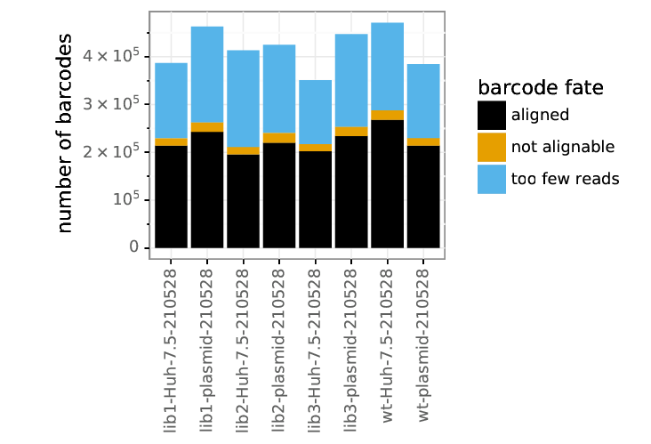
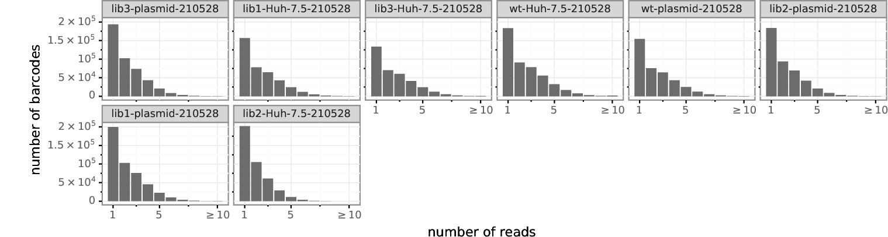
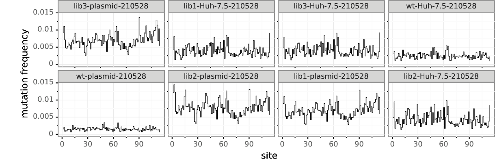
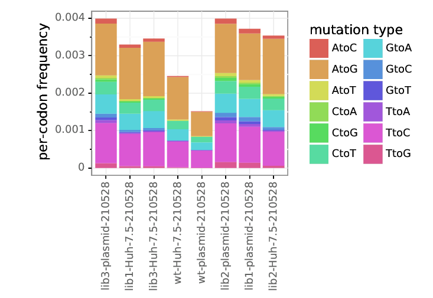
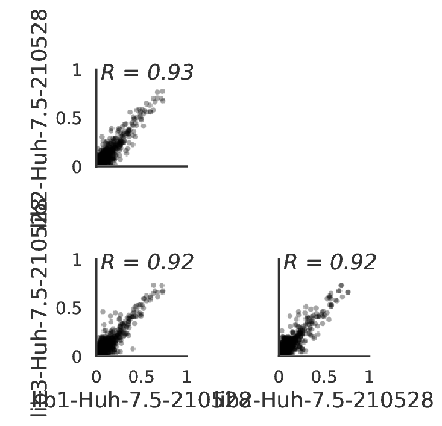

```python

######## snakemake preamble start (automatically inserted, do not edit) ########
import sys; sys.path.extend(['/home/ckikawa/.conda/envs/ZIKV_host_adaptation_NS5_DMS_EvansLab/lib/python3.8/site-packages', '/fh/fast/bloom_j/computational_notebooks/ckikawa/2022/ZIKV_DMS_NS5_EvansLab']); import pickle; snakemake = pickle.loads(b'\x80\x04\x95\x9d\x07\x00\x00\x00\x00\x00\x00\x8c\x10snakemake.script\x94\x8c\tSnakemake\x94\x93\x94)\x81\x94}\x94(\x8c\x05input\x94\x8c\x0csnakemake.io\x94\x8c\nInputFiles\x94\x93\x94)\x81\x94(\x8c\x1adata/tile_2_amplicon.fasta\x94\x8c&data/tile_2_subamplicon_alignspecs.txt\x94\x8c\x1adata/tile_2_samplelist.csv\x94e}\x94(\x8c\x06_names\x94}\x94(\x8c\x08amplicon\x94K\x00N\x86\x94\x8c\nalignspecs\x94K\x01N\x86\x94\x8c\nsamplelist\x94K\x02N\x86\x94u\x8c\x12_allowed_overrides\x94]\x94(\x8c\x05index\x94\x8c\x04sort\x94eh\x18\x8c\tfunctools\x94\x8c\x07partial\x94\x93\x94h\x06\x8c\x19Namedlist._used_attribute\x94\x93\x94\x85\x94R\x94(h\x1e)}\x94\x8c\x05_name\x94h\x18sNt\x94bh\x19h\x1ch\x1e\x85\x94R\x94(h\x1e)}\x94h"h\x19sNt\x94bh\x10h\nh\x12h\x0bh\x14h\x0cub\x8c\x06output\x94h\x06\x8c\x0bOutputFiles\x94\x93\x94)\x81\x94(\x8c\x0eresults/tile_2\x94\x8c results/tile_2/dms_view/data.csv\x94e}\x94(h\x0e}\x94(\x8c\nresultsdir\x94K\x00N\x86\x94\x8c\x08dms_view\x94K\x01N\x86\x94uh\x16]\x94(h\x18h\x19eh\x18h\x1ch\x1e\x85\x94R\x94(h\x1e)}\x94h"h\x18sNt\x94bh\x19h\x1ch\x1e\x85\x94R\x94(h\x1e)}\x94h"h\x19sNt\x94bh0h,h2h-ub\x8c\x06params\x94h\x06\x8c\x06Params\x94\x93\x94)\x81\x94(\x8c\x11wt-plasmid-210528\x94Kne}\x94(h\x0e}\x94(\x8c\x06errpre\x94K\x00N\x86\x94\x8c\x12site_number_offset\x94K\x01N\x86\x94uh\x16]\x94(h\x18h\x19eh\x18h\x1ch\x1e\x85\x94R\x94(h\x1e)}\x94h"h\x18sNt\x94bh\x19h\x1ch\x1e\x85\x94R\x94(h\x1e)}\x94h"h\x19sNt\x94bhDhAhFKnub\x8c\twildcards\x94h\x06\x8c\tWildcards\x94\x93\x94)\x81\x94\x8c\x06tile_2\x94a}\x94(h\x0e}\x94\x8c\x04tile\x94K\x00N\x86\x94sh\x16]\x94(h\x18h\x19eh\x18h\x1ch\x1e\x85\x94R\x94(h\x1e)}\x94h"h\x18sNt\x94bh\x19h\x1ch\x1e\x85\x94R\x94(h\x1e)}\x94h"h\x19sNt\x94b\x8c\x04tile\x94hUub\x8c\x07threads\x94KH\x8c\tresources\x94h\x06\x8c\tResources\x94\x93\x94)\x81\x94(KHK\x01\x8c\x15/loc/scratch/61776980\x94e}\x94(h\x0e}\x94(\x8c\x06_cores\x94K\x00N\x86\x94\x8c\x06_nodes\x94K\x01N\x86\x94\x8c\x06tmpdir\x94K\x02N\x86\x94uh\x16]\x94(h\x18h\x19eh\x18h\x1ch\x1e\x85\x94R\x94(h\x1e)}\x94h"h\x18sNt\x94bh\x19h\x1ch\x1e\x85\x94R\x94(h\x1e)}\x94h"h\x19sNt\x94bhlKHhnK\x01hphiub\x8c\x03log\x94h\x06\x8c\x03Log\x94\x93\x94)\x81\x94\x8c+results/notebooks/dms_tile_2_analysis.ipynb\x94a}\x94(h\x0e}\x94\x8c\x08notebook\x94K\x00N\x86\x94sh\x16]\x94(h\x18h\x19eh\x18h\x1ch\x1e\x85\x94R\x94(h\x1e)}\x94h"h\x18sNt\x94bh\x19h\x1ch\x1e\x85\x94R\x94(h\x1e)}\x94h"h\x19sNt\x94bh\x82h\x7fub\x8c\x06config\x94}\x94(\x8c\x08max_cpus\x94KH\x8c\x05tiles\x94}\x94(\x8c\x06tile_1\x94}\x94(\x8c\x06errpre\x94\x8c\x11wt-plasmid-201112\x94\x8c\x12site_number_offset\x94J\xff\xff\xff\xffu\x8c\x06tile_2\x94}\x94(\x8c\x06errpre\x94hA\x8c\x12site_number_offset\x94Knu\x8c\x06tile_3\x94}\x94(\x8c\x06errpre\x94\x8c\x11wt-plasmid-210921\x94\x8c\x12site_number_offset\x94K\xe0u\x8c\x06tile_4\x94}\x94(\x8c\x06errpre\x94\x8c\x11wt-plasmid-210921\x94\x8c\x12site_number_offset\x94MQ\x01u\x8c\x06tile_5\x94}\x94(\x8c\x06errpre\x94\x8c\x11wt-plasmid-210921\x94\x8c\x12site_number_offset\x94M\xc2\x01u\x8c\x06tile_6\x94}\x94(\x8c\x06errpre\x94\x8c\x11wt-plasmid-210921\x94\x8c\x12site_number_offset\x94M3\x02u\x8c\x06tile_7\x94}\x94(\x8c\x06errpre\x94\x8c\x11wt-plasmid-210702\x94\x8c\x12site_number_offset\x94M\xa4\x02u\x8c\x06tile_8\x94}\x94(\x8c\x06errpre\x94\x8c\x11wt-plasmid-210702\x94\x8c\x12site_number_offset\x94M\x15\x03uuu\x8c\x04rule\x94\x8c\x11dms_tile_analysis\x94\x8c\x0fbench_iteration\x94N\x8c\tscriptdir\x94\x8cK/fh/fast/bloom_j/computational_notebooks/ckikawa/2022/ZIKV_DMS_NS5_EvansLab\x94ub.'); from snakemake.logging import logger; logger.printshellcmds = False; import os; os.chdir(r'/fh/fast/bloom_j/computational_notebooks/ckikawa/2022/ZIKV_DMS_NS5_EvansLab');
######## snakemake preamble end #########

```

# Deep mutational scanning of ZIKV E protein NS5
Mutational antigenic profiling of ZIKV E from the MR766 strain.
Experiments performed by Blake Richardson and Matt Evans.
Analysis by [Jesse Bloom](https://research.fhcrc.org/bloom/en.html).

The NS5 mutagensis was performed in "tiles" along the length of the gene.

## Set up for analysis
Import Python packages and modules:


```python
import glob
import os
import subprocess
import shutil

import Bio.SeqIO

import dms_tools2
from dms_tools2 import AAS
from dms_tools2.ipython_utils import showPDF
from dms_tools2.plot import COLOR_BLIND_PALETTE_GRAY as CBPALETTE
import dms_tools2.prefs
import dms_tools2.utils
print(f"Using dms_tools2 {dms_tools2.__version__}")

from IPython.display import display, HTML

import pandas as pd

import altair as alt
from plotnine import *

import numpy

import dms_variants.plotnine_themes
```

    Using dms_tools2 2.6.10


Get variables from `snakemake`:


```python
ncpus = snakemake.threads
refseqfile = snakemake.input.amplicon
samplelist = snakemake.input.samplelist
alignspecsfile = snakemake.input.alignspecs
resultsdir = snakemake.output.resultsdir
errpre = snakemake.params.errpre
site_number_offset = snakemake.params.site_number_offset
```

Some additional configuration for analysis:


```python
use_existing = 'yes' # use existing output

os.makedirs(resultsdir, exist_ok=True)
```

Read in the wildtype (reference) sequence and its protein translation:


```python
refseqrecord = Bio.SeqIO.read(refseqfile, 'fasta')
refprot = str(refseqrecord.seq.translate())
refseq = str(refseqrecord.seq)

print(f"Read reference sequence of {len(refseq)} nucleotides from {refseqfile} "
      f"that translates to protein of {len(refprot)} amino acids.")
```

    Read reference sequence of 342 nucleotides from data/tile_2_amplicon.fasta that translates to protein of 114 amino acids.


## Process deep sequencing data
We process the data from the [barcoded subamplicon deep sequencing](https://jbloomlab.github.io/dms_tools2/bcsubamp.html) to count the frequency of each codon in each sample.

First, we read in the samples:


```python
samples = (pd.read_csv(samplelist)
           .assign(name=lambda x: x.library + '-' + x.selection + '-' + x.date.astype(str))
           )

display(HTML(samples.to_html(index=False)))
```


<table border="1" class="dataframe">
  <thead>
    <tr style="text-align: right;">
      <th>library</th>
      <th>selection</th>
      <th>date</th>
      <th>R1</th>
      <th>SRA_accession</th>
      <th>name</th>
    </tr>
  </thead>
  <tbody>
    <tr>
      <td>lib3</td>
      <td>plasmid</td>
      <td>210528</td>
      <td>/shared/ngs/illumina/bloom_lab/210528_M03100_0686_000000000-JNHMH/Data/Intensities/BaseCalls/lib-3-plasmid_S3_L001_R1_001.fastq.gz</td>
      <td>NaN</td>
      <td>lib3-plasmid-210528</td>
    </tr>
    <tr>
      <td>lib1</td>
      <td>Huh-7.5</td>
      <td>210528</td>
      <td>/shared/ngs/illumina/bloom_lab/210528_M03100_0686_000000000-JNHMH/Data/Intensities/BaseCalls/tile-2-lib-1_S5_L001_R1_001.fastq.gz</td>
      <td>NaN</td>
      <td>lib1-Huh-7.5-210528</td>
    </tr>
    <tr>
      <td>lib3</td>
      <td>Huh-7.5</td>
      <td>210528</td>
      <td>/shared/ngs/illumina/bloom_lab/210528_M03100_0686_000000000-JNHMH/Data/Intensities/BaseCalls/tile-2-lib-3_S7_L001_R1_001.fastq.gz</td>
      <td>NaN</td>
      <td>lib3-Huh-7.5-210528</td>
    </tr>
    <tr>
      <td>wt</td>
      <td>Huh-7.5</td>
      <td>210528</td>
      <td>/shared/ngs/illumina/bloom_lab/210528_M03100_0686_000000000-JNHMH/Data/Intensities/BaseCalls/tile-2-wt_S8_L001_R1_001.fastq.gz</td>
      <td>NaN</td>
      <td>wt-Huh-7.5-210528</td>
    </tr>
    <tr>
      <td>wt</td>
      <td>plasmid</td>
      <td>210528</td>
      <td>/shared/ngs/illumina/bloom_lab/210528_M03100_0686_000000000-JNHMH/Data/Intensities/BaseCalls/WT-plasmid_S4_L001_R1_001.fastq.gz</td>
      <td>NaN</td>
      <td>wt-plasmid-210528</td>
    </tr>
    <tr>
      <td>lib2</td>
      <td>plasmid</td>
      <td>210528</td>
      <td>/shared/ngs/illumina/bloom_lab/210528_M03100_0686_000000000-JNHMH/Data/Intensities/BaseCalls/lib-2-plasmid_S2_L001_R1_001.fastq.gz</td>
      <td>NaN</td>
      <td>lib2-plasmid-210528</td>
    </tr>
    <tr>
      <td>lib1</td>
      <td>plasmid</td>
      <td>210528</td>
      <td>/shared/ngs/illumina/bloom_lab/210528_M03100_0686_000000000-JNHMH/Data/Intensities/BaseCalls/lib-1-plasmid_S1_L001_R1_001.fastq.gz</td>
      <td>NaN</td>
      <td>lib1-plasmid-210528</td>
    </tr>
    <tr>
      <td>lib2</td>
      <td>Huh-7.5</td>
      <td>210528</td>
      <td>/shared/ngs/illumina/bloom_lab/210528_M03100_0686_000000000-JNHMH/Data/Intensities/BaseCalls/tile-2-lib-2_S6_L001_R1_001.fastq.gz</td>
      <td>NaN</td>
      <td>lib2-Huh-7.5-210528</td>
    </tr>
    <tr>
      <td>lib1</td>
      <td>C6-36</td>
      <td>multi</td>
      <td>/fh/fast/bloom_j/computational_notebooks/dbacsik/2022/ZIKV_DMS_NS5_EvansLab/data/concat_fastqs/concat_fastq_out/lib1_C636_R1.fastq.gz</td>
      <td>NaN</td>
      <td>lib1-C6-36-multi</td>
    </tr>
    <tr>
      <td>lib2</td>
      <td>C6-36</td>
      <td>multi</td>
      <td>/fh/fast/bloom_j/computational_notebooks/dbacsik/2022/ZIKV_DMS_NS5_EvansLab/data/concat_fastqs/concat_fastq_out/lib2_C636_R1.fastq.gz</td>
      <td>NaN</td>
      <td>lib2-C6-36-multi</td>
    </tr>
    <tr>
      <td>lib3</td>
      <td>C6-36</td>
      <td>multi</td>
      <td>/fh/fast/bloom_j/computational_notebooks/dbacsik/2022/ZIKV_DMS_NS5_EvansLab/data/concat_fastqs/concat_fastq_out/lib3_C636_R1.fastq.gz</td>
      <td>NaN</td>
      <td>lib3-C6-36-multi</td>
    </tr>
    <tr>
      <td>wt</td>
      <td>C6-36</td>
      <td>multi</td>
      <td>/fh/fast/bloom_j/computational_notebooks/dbacsik/2022/ZIKV_DMS_NS5_EvansLab/data/concat_fastqs/concat_fastq_out/wt_C636_R1.fastq.gz</td>
      <td>NaN</td>
      <td>wt-C6-36-multi</td>
    </tr>
  </tbody>
</table>


Now we read in the alignment specs for the [barcoded subamplicon sequencing](https://jbloomlab.github.io/dms_tools2/bcsubamp.html):


```python
with open(alignspecsfile) as f:
    alignspecs = f.read().strip()
print(alignspecs)
```

    1,342,30,30


Now we use the [dms2_batch_bcsubamp](https://jbloomlab.github.io/dms_tools2/dms2_batch_bcsubamp.html) program to process the deep sequencing data to obtain codon counts:


```python
countsdir = os.path.join(resultsdir, 'codoncounts')
os.makedirs(countsdir, exist_ok=True)

bcsubamp_batchfile = os.path.join(countsdir, 'batch.csv')
samples[['name', 'R1']].to_csv(bcsubamp_batchfile, index=False)

log = ! dms2_batch_bcsubamp \
        --batchfile {bcsubamp_batchfile} \
        --refseq {refseqfile} \
        --alignspecs {alignspecs} \
        --outdir {countsdir} \
        --summaryprefix summary \
        --R1trim 210 \
        --R2trim 210 \
        --ncpus {ncpus} \
        --use_existing {use_existing}

samples['codoncounts'] = countsdir + '/' + samples['name'] + '_codoncounts.csv'

# check that expected codon counts files created
assert all(map(os.path.isfile, samples.codoncounts)), '\n'.join(log)

print(f"Processed sequencing data to create codon counts files in {countsdir}")
```

    Processed sequencing data to create codon counts files in results/tile_2/codoncounts


Now we look at the plots.
They will all have the following prefix:


```python
bcsubamp_plot_prefix = os.path.join(countsdir, 'summary_')
print(f"Plots prefix is {bcsubamp_plot_prefix}")
```

    Plots prefix is results/tile_2/codoncounts/summary_


First, we look at the number of reads and barcodes per sample.


```python
showPDF(bcsubamp_plot_prefix + 'readstats.pdf')
showPDF(bcsubamp_plot_prefix + 'bcstats.pdf')
```


    

    


    

    


Next we look at number of reads per barcode.


```python
showPDF(bcsubamp_plot_prefix + 'readsperbc.pdf')
```


    

    


Now we look at the depth across the gene.
Note that this is still 1, 2, ... numbering of the reference sequence for this tile alone.


```python
showPDF(bcsubamp_plot_prefix + 'depth.pdf')
```


    

    


Here are the mutation frequencies across the gene.
As expected, the library plasmids have higher mutation rates than the wildtype control:


```python
showPDF(bcsubamp_plot_prefix + 'mutfreq.pdf')
```


    

    


Here are the overall per-codon mutation rate averages:


```python
showPDF(bcsubamp_plot_prefix + 'codonmuttypes.pdf')
```


    

    


We have single and multi-nucleotide changes in the libraries, although the single nucleotide changes are perhaps over-represented:


```python
showPDF(bcsubamp_plot_prefix + 'codonntchanges.pdf')
```


    

    


Here are the frequencies of different types of mutations among single-nucleotide codon changes.
There is no massive over-representation of any class as would be expected if oxidative damage, which leads to `C->A` or `G->T` mutations:


```python
showPDF(bcsubamp_plot_prefix + 'singlentchanges.pdf')
```


    

    


Finally, we look at mutation sampling.
We can see that most possible mutations are sampled very well in the plasmid samples, although the overall coverage is still pretty low so some are missed:


```python
showPDF(bcsubamp_plot_prefix + 'cumulmutcounts.pdf')
```


    

    


## Now re-number the sites
Above everything is numbered 1, 2, ... for that tile.
We want to renumber for the whole gene:


```python
print(f"Renumbering by adding an offset of {site_number_offset}")
```

    Renumbering by adding an offset of 110


Create a directory for the re-numbered codon counts:


```python
renumb_countsdir = os.path.join(resultsdir, 'renumbered_codoncounts')
os.makedirs(renumb_countsdir, exist_ok=True)
print(f"Putting renumbered codon counts in {renumb_countsdir}")
```

    Putting renumbered codon counts in results/tile_2/renumbered_codoncounts


Create a renumbering file:


```python
ncodons = len(refseq)
assert 0 == ncodons % 3, f"invalid {ncodons=}"

renumbfile = os.path.join(renumb_countsdir, 'renumbering.csv')
with open(renumbfile, 'w') as f:
    f.write('original,new\n')
    for orig in range(1, ncodons + 1):
        f.write(f"{orig},{orig + site_number_offset}\n")
```

Renumber all CSVs:


```python
counts_files = glob.glob(f"{countsdir}/*_codoncounts.csv")
print(f"Renumbering {len(counts_files)} files")

dms_tools2.utils.renumberSites(renumbfile, counts_files, outdir=renumb_countsdir)
```

    Renumbering 12 files


Correct our 'samples' file to include renumb_codoncounts


```python
samples['renumb_codoncounts'] = renumb_countsdir + '/' + samples['name'] + '_codoncounts.csv'
```

## Functional effects of mutations of viral growth
Compute the functional effects of mutations on viral growth by comparing the passaged virus to the original plasmid.

To do this, we compute the [amino-acid preferences](https://jbloomlab.github.io/dms_tools2/prefs.html#prefs) under selection for viral growth.
We do this using [dms2_batch_prefs](https://jbloomlab.github.io/dms_tools2/dms2_batch_prefs.html).

First, make a data frame with the batch file:


```python
prefs_batch = (
    samples
    .query('library != "wt"')
    .query('selection != "plasmid"')
    .assign(post=lambda x: x['name'])
    .merge(samples.query('selection == "plasmid"')
                  .assign(pre=lambda x: x['name'])
                  [['library', 'pre']],
           on=['library'], how='left', validate='many_to_one',
           )
    [['name', 'selection', 'library', 'pre', 'post', 'date']]
    .assign(errpre=errpre)
    .merge(samples.query('library == "wt"')
                  .assign(errpost=lambda x: x['name'])
                  [['selection', 'errpost', 'date']],
           on=['selection', 'date'], how='left'
           )
    )
assert prefs_batch.notnull().all().all()

display(prefs_batch)
```


<div>
<style scoped>
    .dataframe tbody tr th:only-of-type {
        vertical-align: middle;
    }

    .dataframe tbody tr th {
        vertical-align: top;
    }

    .dataframe thead th {
        text-align: right;
    }
</style>
<table border="1" class="dataframe">
  <thead>
    <tr style="text-align: right;">
      <th></th>
      <th>name</th>
      <th>selection</th>
      <th>library</th>
      <th>pre</th>
      <th>post</th>
      <th>date</th>
      <th>errpre</th>
      <th>errpost</th>
    </tr>
  </thead>
  <tbody>
    <tr>
      <th>0</th>
      <td>lib1-Huh-7.5-210528</td>
      <td>Huh-7.5</td>
      <td>lib1</td>
      <td>lib1-plasmid-210528</td>
      <td>lib1-Huh-7.5-210528</td>
      <td>210528</td>
      <td>wt-plasmid-210528</td>
      <td>wt-Huh-7.5-210528</td>
    </tr>
    <tr>
      <th>1</th>
      <td>lib3-Huh-7.5-210528</td>
      <td>Huh-7.5</td>
      <td>lib3</td>
      <td>lib3-plasmid-210528</td>
      <td>lib3-Huh-7.5-210528</td>
      <td>210528</td>
      <td>wt-plasmid-210528</td>
      <td>wt-Huh-7.5-210528</td>
    </tr>
    <tr>
      <th>2</th>
      <td>lib2-Huh-7.5-210528</td>
      <td>Huh-7.5</td>
      <td>lib2</td>
      <td>lib2-plasmid-210528</td>
      <td>lib2-Huh-7.5-210528</td>
      <td>210528</td>
      <td>wt-plasmid-210528</td>
      <td>wt-Huh-7.5-210528</td>
    </tr>
    <tr>
      <th>3</th>
      <td>lib1-C6-36-multi</td>
      <td>C6-36</td>
      <td>lib1</td>
      <td>lib1-plasmid-210528</td>
      <td>lib1-C6-36-multi</td>
      <td>multi</td>
      <td>wt-plasmid-210528</td>
      <td>wt-C6-36-multi</td>
    </tr>
    <tr>
      <th>4</th>
      <td>lib2-C6-36-multi</td>
      <td>C6-36</td>
      <td>lib2</td>
      <td>lib2-plasmid-210528</td>
      <td>lib2-C6-36-multi</td>
      <td>multi</td>
      <td>wt-plasmid-210528</td>
      <td>wt-C6-36-multi</td>
    </tr>
    <tr>
      <th>5</th>
      <td>lib3-C6-36-multi</td>
      <td>C6-36</td>
      <td>lib3</td>
      <td>lib3-plasmid-210528</td>
      <td>lib3-C6-36-multi</td>
      <td>multi</td>
      <td>wt-plasmid-210528</td>
      <td>wt-C6-36-multi</td>
    </tr>
  </tbody>
</table>
</div>


Now run [dms2_batch_prefs](https://jbloomlab.github.io/dms_tools2/dms2_batch_prefs.html):


```python
prefsdir = os.path.join(resultsdir, 'prefs')
os.makedirs(prefsdir, exist_ok=True)

prefs_batchfile = os.path.join(prefsdir, 'batch.csv')
prefs_batch.to_csv(prefs_batchfile, index=False)

log = ! dms2_batch_prefs \
        --indir {renumb_countsdir} \
        --batchfile {prefs_batchfile} \
        --outdir {prefsdir} \
        --summaryprefix summary \
        --method ratio \
        --use_existing {use_existing} \
        --ncpus {ncpus}

assert all(map(os.path.isfile, [os.path.join(prefsdir, name + '_prefs.csv') 
                                for name in prefs_batch.name])), '\n'.join(log)

print("Amino-acid preferences calculated for all samples.")
```

    Amino-acid preferences calculated for all samples.


Look at correlation among the amino-acid preferences for the individual libraries:


```python
showPDF(os.path.join(prefsdir, 'summary_prefscorr.pdf'))
```


    

    


Now let's get the amino-acid preferences for **all** samples, and for each condition separately:


```python
# file with preferences for all samples
prefs_files = {'all': os.path.join(prefsdir, 'prefs_all.csv')}
pd.read_csv(os.path.join(prefsdir, 'summary_avgprefs.csv')).to_csv(prefs_files['all'],
                                                                   index=False,
                                                                   float_format='%.5f')

# file with preferences for each condition
for selection, df in prefs_batch.groupby('selection'):
    selection_prefsfiles = [os.path.join(prefsdir, f"{name}_prefs.csv") for name in df['name']]
    assert all(map(os.path.isfile, selection_prefsfiles)), selection_prefsfiles
    prefs_files[selection] = os.path.join(prefsdir, f"prefs_{selection}.csv")
    dms_tools2.prefs.avgPrefs(selection_prefsfiles).to_csv(prefs_files[selection],
                                                           index=False,
                                                           float_format='%.5f')
    
print('Average preferences across conditions are in the following files:')
display(HTML(pd.Series(prefs_files).rename('file').to_frame().to_html()))
```

    Average preferences across conditions are in the following files:


<table border="1" class="dataframe">
  <thead>
    <tr style="text-align: right;">
      <th></th>
      <th>file</th>
    </tr>
  </thead>
  <tbody>
    <tr>
      <th>all</th>
      <td>results/tile_2/prefs/prefs_all.csv</td>
    </tr>
    <tr>
      <th>C6-36</th>
      <td>results/tile_2/prefs/prefs_C6-36.csv</td>
    </tr>
    <tr>
      <th>Huh-7.5</th>
      <td>results/tile_2/prefs/prefs_Huh-7.5.csv</td>
    </tr>
  </tbody>
</table>


Now we will make a logo plot of the average of the amino-acid preferences across all samples, and each group of samples.
We do this using [dms2_logoplot](https://jbloomlab.github.io/dms_tools2/dms2_logoplot.html).
Note that this logo plot shows the raw unscaled (not re-scaled) preferences.
In this plot, the height of each letter is proportional to the "preference" for that amino acid at that site, so taller letters are more preferred at a site.
If the site tolerates everything, there will just be lots of small letters as all amino acids equally tolerated:


```python
logodir = os.path.join(resultsdir, 'logoplots')
os.makedirs(logodir, exist_ok=True)

# get wildtype amino acids to use as overlay
wt_aas = pd.DataFrame.from_records(
            [(r + 1 + site_number_offset, a) for r, a in enumerate(refprot) if a != '*'],
            columns=['site', 'wildtype'])
wtoverlayfile = os.path.join(logodir, 'wt_overlay.csv')
wt_aas.to_csv(wtoverlayfile, index=False)

for selection, prefs_csv in prefs_files.items():

    logoplot = os.path.join(logodir, f"{selection}_prefs.pdf")

    log = ! dms2_logoplot \
            --prefs {prefs_csv} \
            --name {selection} \
            --outdir {logodir} \
            --nperline 56 \
            --overlay1 {wtoverlayfile} wildtype wildtype \
            --letterheight 1.2 \
            --use_existing {use_existing}

    assert os.path.isfile(logoplot), '\n'.join(log)

    print(f"\n\nPreferences for {selection} samples:")
    showPDF(logoplot)
```

    
    
    Preferences for all samples:


    

    


    
    
    Preferences for C6-36 samples:


    

    


    
    
    Preferences for Huh-7.5 samples:


    

    


We can also represent the effects of mutations in a different way than the amino acid preferences.
Specifically, the ratio of the preference for the mutant amino-acid to the wildtype amino-acid is a measure of its enrichment (this is just the ratio of letter heights in the plot above).
If we take the log of this mutational effect, negative values indicate deleterious mutations and positive values indicate favorable mutations
The potential advantage of this representation is that it better shows the detailed differences between mutations to amino acids with small preferences, which can be useful for figuring out if we think a mutation is just very mildly deleterious or highly deleterious.

Here we calculate the mutational effects and then plot their log2 values on a logo plot.

First, create a subdirectory for these analyses:


```python
muteffectsdir = os.path.join(resultsdir, 'muteffects')
os.makedirs(muteffectsdir, exist_ok=True)
```

Convert the amino-acid preferences into mutational effects:


```python
muteffects_files = {}
for selection, prefs_csv in prefs_files.items():
    muteffects = dms_tools2.prefs.prefsToMutFromWtEffects(
                    prefs=pd.read_csv(prefs_csv),
                    charlist=AAS,
                    wts=wt_aas)
    muteffects_files[selection] = os.path.join(muteffectsdir, f"{selection}_muteffects.csv")
    print(f"Writing mutational effects for {selection} to {muteffects_files[selection]}")
    muteffects.to_csv(muteffects_files[selection], index=False, float_format='%.5g')
```

    Writing mutational effects for all to results/tile_2/muteffects/all_muteffects.csv
    Writing mutational effects for C6-36 to results/tile_2/muteffects/C6-36_muteffects.csv
    Writing mutational effects for Huh-7.5 to results/tile_2/muteffects/Huh-7.5_muteffects.csv


Now make a logo plots showing the mutational effects for all samples, and for each condition.
Letters below the line indicate deleterious mutations, and letters above the line indicate beneficial ones.
We include a scale bar indicating the fold-enrichment implied by each letter height:


```python
for selection, muteffects_csv in muteffects_files.items():

    logoplot = os.path.join(logodir, f"{selection}_muteffects.pdf")

    log = ! dms2_logoplot \
            --muteffects {muteffects_csv} \
            --name {selection} \
            --outdir {logodir} \
            --nperline 56 \
            --overlay1 {wtoverlayfile} wildtype wildtype \
            --scalebar 6.64 "100-fold change (log scale)" \
            --use_existing {use_existing}

    assert os.path.isfile(logoplot), '\n'.join(log)

    print(f"\n\nMutational effects for {selection} samples:")
    showPDF(logoplot)
```

    
    
    Mutational effects for all samples:


    

    


    
    
    Mutational effects for C6-36 samples:


    

    


    
    
    Mutational effects for Huh-7.5 samples:


    

    


## Differential selection
Now we compute the differential selection between the human and mosquito viruses.
We will compute Huh7.5 relative to C636, so positive values indicate favored in Huh7.5, and negative values indicate favored in C636.

First, set up a data frame indicating the comparisons that we will make:


```python
# We need to avoid using the IFN pilot samples in tile 1

diffsel_samples = (
    samples
    .query('library.str.contains("lib") and selection != "Huh-7.5IFNPilot"')
    [['library', 'selection', 'renumb_codoncounts']]
    .pivot(index='library',
           columns='selection',
           values='renumb_codoncounts',
           )
    .rename_axis(columns=None)
    .reset_index()
    .rename(columns={'library': 'name',
                     'Huh-7.5': 'sel',
                     'C6-36': 'mock'})
    .assign(err=samples.query('selection == "plasmid"').set_index('library').at['wt', 'renumb_codoncounts'])
    [['name', 'mock', 'sel', 'err']]
    )

display(HTML(diffsel_samples.to_html(index=False)))
```


<table border="1" class="dataframe">
  <thead>
    <tr style="text-align: right;">
      <th>name</th>
      <th>mock</th>
      <th>sel</th>
      <th>err</th>
    </tr>
  </thead>
  <tbody>
    <tr>
      <td>lib1</td>
      <td>results/tile_2/renumbered_codoncounts/lib1-C6-36-multi_codoncounts.csv</td>
      <td>results/tile_2/renumbered_codoncounts/lib1-Huh-7.5-210528_codoncounts.csv</td>
      <td>results/tile_2/renumbered_codoncounts/wt-plasmid-210528_codoncounts.csv</td>
    </tr>
    <tr>
      <td>lib2</td>
      <td>results/tile_2/renumbered_codoncounts/lib2-C6-36-multi_codoncounts.csv</td>
      <td>results/tile_2/renumbered_codoncounts/lib2-Huh-7.5-210528_codoncounts.csv</td>
      <td>results/tile_2/renumbered_codoncounts/wt-plasmid-210528_codoncounts.csv</td>
    </tr>
    <tr>
      <td>lib3</td>
      <td>results/tile_2/renumbered_codoncounts/lib3-C6-36-multi_codoncounts.csv</td>
      <td>results/tile_2/renumbered_codoncounts/lib3-Huh-7.5-210528_codoncounts.csv</td>
      <td>results/tile_2/renumbered_codoncounts/wt-plasmid-210528_codoncounts.csv</td>
    </tr>
  </tbody>
</table>


Now we compute the differential selection.
We then get the files with the average values across replicates, using the **median** as our measure of average so it is not overly affected by outliers in any given replicate:


```python
diffseldir = os.path.join(resultsdir, 'diffsel')
os.makedirs(diffseldir, exist_ok=True)

diffsel_batchfile = os.path.join(diffseldir, 'batch.csv')
diffsel_samples.to_csv(diffsel_batchfile, index=False)
    
print(f"Computing differential selection...")
diffsel_prefix = 'Huh7.5-vs-C636'
subprocess.check_output([
        'dms2_batch_diffsel',
        '--batchfile', diffsel_batchfile,
        '--outdir', diffseldir,
        '--summaryprefix', diffsel_prefix,
        '--use_existing', 'yes',
        '--ncpus', str(ncpus),
        ])
    
avgmutdiffsel_file = os.path.join(diffseldir, 
                                  f"{diffsel_prefix}_medianmutdiffsel.csv")
avgsitediffsel_file = os.path.join(diffseldir, 
                                   f"{diffsel_prefix}_mediansitediffsel.csv")
```

    Computing differential selection...


    INFO:dms2_batch_diffsel:Beginning execution of dms2_batch_diffsel in directory /fh/fast/bloom_j/computational_notebooks/ckikawa/2022/ZIKV_DMS_NS5_EvansLab
    
    INFO:dms2_batch_diffsel:Progress is being logged to results/tile_2/diffsel/Huh7.5-vs-C636.log
    INFO:dms2_batch_diffsel:Version information:
    	Time and date: Wed Jun 29 12:13:08 2022
    	Platform: Linux-4.15.0-118-generic-x86_64-with-glibc2.10
    	Python version: 3.8.13 | packaged by conda-forge | (default, Mar 25 2022, 06:04:10)  [GCC 10.3.0]
    	dms_tools2 version: 2.6.10
    	Bio version: 1.79
    	pandas version: 0.25.3
    	numpy version: 1.19.5
    	IPython version: 8.3.0
    	jupyter version: 1.0.0
    	matplotlib version: 3.2.2
    	plotnine version: 0.6.0
    	natsort version: 8.1.0
    	pystan version: 2.19.1.1
    	scipy version: 1.5.2
    	seaborn version: 0.10.1
    	phydmslib version: 2.4.1
    	statsmodels version: 0.11.1
    	rpy2 cannot be imported
    	regex version: 2.5.114
    	umi_tools version: 1.1.2
    
    INFO:dms2_batch_diffsel:Parsed the following arguments:
    	outdir = results/tile_2/diffsel
    	ncpus = 72
    	use_existing = yes
    	indir = None
    	chartype = codon_to_aa
    	excludestop = yes
    	pseudocount = 5
    	mincount = 0
    	batchfile = results/tile_2/diffsel/batch.csv
    	summaryprefix = Huh7.5-vs-C636
    
    INFO:dms2_batch_diffsel:Parsing info from results/tile_2/diffsel/batch.csv
    INFO:dms2_batch_diffsel:Read the following sample information:
    name,mock,sel,err
    lib1,results/tile_2/renumbered_codoncounts/lib1-C6-36-multi_codoncounts.csv,results/tile_2/renumbered_codoncounts/lib1-Huh-7.5-210528_codoncounts.csv,results/tile_2/renumbered_codoncounts/wt-plasmid-210528_codoncounts.csv
    lib2,results/tile_2/renumbered_codoncounts/lib2-C6-36-multi_codoncounts.csv,results/tile_2/renumbered_codoncounts/lib2-Huh-7.5-210528_codoncounts.csv,results/tile_2/renumbered_codoncounts/wt-plasmid-210528_codoncounts.csv
    lib3,results/tile_2/renumbered_codoncounts/lib3-C6-36-multi_codoncounts.csv,results/tile_2/renumbered_codoncounts/lib3-Huh-7.5-210528_codoncounts.csv,results/tile_2/renumbered_codoncounts/wt-plasmid-210528_codoncounts.csv
    
    
    INFO:dms2_batch_diffsel:Running dms2_diffsel on all samples...
    INFO:dms2_batch_diffsel:Completed runs of dms2_diffsel.
    
    INFO:dms2_batch_diffsel:Analyzing the diffsel values for the 3 samples.
    INFO:dms2_batch_diffsel:Plotting mutdiffsel correlations to results/tile_2/diffsel/Huh7.5-vs-C636_mutdiffselcorr.pdf
    INFO:dms2_batch_diffsel:Plotting absolutesitediffsel correlations to results/tile_2/diffsel/Huh7.5-vs-C636_absolutesitediffselcorr.pdf
    INFO:dms2_batch_diffsel:Plotting positivesitediffsel correlations to results/tile_2/diffsel/Huh7.5-vs-C636_positivesitediffselcorr.pdf
    INFO:dms2_batch_diffsel:Plotting maxmutdiffsel correlations to results/tile_2/diffsel/Huh7.5-vs-C636_maxmutdiffselcorr.pdf
    INFO:dms2_batch_diffsel:Writing mean mutdiffsel to results/tile_2/diffsel/Huh7.5-vs-C636_meanmutdiffsel.csv
    INFO:dms2_batch_diffsel:Writing mean sitediffsel to results/tile_2/diffsel/Huh7.5-vs-C636_meansitediffsel.csv
    INFO:dms2_batch_diffsel:Writing median mutdiffsel to results/tile_2/diffsel/Huh7.5-vs-C636_medianmutdiffsel.csv
    INFO:dms2_batch_diffsel:Writing median sitediffsel to results/tile_2/diffsel/Huh7.5-vs-C636_mediansitediffsel.csv
    INFO:dms2_batch_diffsel:Plotting mean positive diffsel to results/tile_2/diffsel/Huh7.5-vs-C636_meanpositivediffsel.pdf
    INFO:dms2_batch_diffsel:Plotting mean total diffsel to results/tile_2/diffsel/Huh7.5-vs-C636_meantotaldiffsel.pdf
    INFO:dms2_batch_diffsel:Plotting mean max diffsel to results/tile_2/diffsel/Huh7.5-vs-C636_meanmaxdiffsel.pdf
    INFO:dms2_batch_diffsel:Plotting mean minmax diffsel to results/tile_2/diffsel/Huh7.5-vs-C636_meanminmaxdiffsel.pdf
    INFO:dms2_batch_diffsel:Plotting median positive diffsel to results/tile_2/diffsel/Huh7.5-vs-C636_medianpositivediffsel.pdf
    INFO:dms2_batch_diffsel:Plotting median total diffsel to results/tile_2/diffsel/Huh7.5-vs-C636_mediantotaldiffsel.pdf
    INFO:dms2_batch_diffsel:Plotting median max diffsel to results/tile_2/diffsel/Huh7.5-vs-C636_medianmaxdiffsel.pdf
    INFO:dms2_batch_diffsel:Plotting median minmax diffsel to results/tile_2/diffsel/Huh7.5-vs-C636_medianminmaxdiffsel.pdf
    INFO:dms2_batch_diffsel:Successful completion of dms2_batch_diffsel


We read this across-replicates average (median) differential selection into a data frame:


```python
diffsel = (dms_tools2.diffsel.df_read_filecols(
             df=pd.DataFrame({'name': [diffsel_prefix],
                             'mutdiffselfile': [avgmutdiffsel_file],
                             'sitediffselfile': [avgsitediffsel_file],
                             }),
             filecols=['mutdiffselfile', 'sitediffselfile'])
           .drop(columns=['mutdiffselfile', 'sitediffselfile'])
           )
print('Here are the first few lines of the `diffsel` data frame:')
display(HTML(diffsel.head().to_html(index=False)))
```

    Here are the first few lines of the `diffsel` data frame:


<table border="1" class="dataframe">
  <thead>
    <tr style="text-align: right;">
      <th>name</th>
      <th>site</th>
      <th>wildtype</th>
      <th>mutation</th>
      <th>mutdiffsel</th>
      <th>abs_diffsel</th>
      <th>positive_diffsel</th>
      <th>negative_diffsel</th>
      <th>max_diffsel</th>
      <th>min_diffsel</th>
      <th>isite</th>
    </tr>
  </thead>
  <tbody>
    <tr>
      <td>Huh7.5-vs-C636</td>
      <td>179</td>
      <td>F</td>
      <td>S</td>
      <td>2.963258</td>
      <td>4.591142</td>
      <td>3.755635</td>
      <td>-0.835507</td>
      <td>2.963258</td>
      <td>-0.409079</td>
      <td>68</td>
    </tr>
    <tr>
      <td>Huh7.5-vs-C636</td>
      <td>179</td>
      <td>F</td>
      <td>L</td>
      <td>0.680523</td>
      <td>4.591142</td>
      <td>3.755635</td>
      <td>-0.835507</td>
      <td>2.963258</td>
      <td>-0.409079</td>
      <td>68</td>
    </tr>
    <tr>
      <td>Huh7.5-vs-C636</td>
      <td>179</td>
      <td>F</td>
      <td>I</td>
      <td>0.101565</td>
      <td>4.591142</td>
      <td>3.755635</td>
      <td>-0.835507</td>
      <td>2.963258</td>
      <td>-0.409079</td>
      <td>68</td>
    </tr>
    <tr>
      <td>Huh7.5-vs-C636</td>
      <td>179</td>
      <td>F</td>
      <td>D</td>
      <td>0.000857</td>
      <td>4.591142</td>
      <td>3.755635</td>
      <td>-0.835507</td>
      <td>2.963258</td>
      <td>-0.409079</td>
      <td>68</td>
    </tr>
    <tr>
      <td>Huh7.5-vs-C636</td>
      <td>179</td>
      <td>F</td>
      <td>E</td>
      <td>0.000857</td>
      <td>4.591142</td>
      <td>3.755635</td>
      <td>-0.835507</td>
      <td>2.963258</td>
      <td>-0.409079</td>
      <td>68</td>
    </tr>
  </tbody>
</table>


Here is the correlation in the absolute site-level selection among replicates:


```python
showPDF(os.path.join(diffseldir,
                     f"{diffsel_prefix}_absolutesitediffselcorr.pdf"),
        width=350)
```


    

    


## Create `dms-view` input files
Now we create a file to visualize the results of the deep mutational scanning using [dms-view](https://dms-view.github.io), setting up the mapping for the [6WCZ](https://www.rcsb.org/structure/6wcz) PDB file.
In this PDB file, chain A is human STAT2 and chain B is ZIKV NS5.


```python
offset_to_pdb = 0
pdb_chain = 'B'
```


```python
dms_view_data = pd.DataFrame()

# preferences for all conditions
for condition, csvfile in prefs_files.items():
    prefs = pd.read_csv(csvfile)
    dms_view_data = dms_view_data.append(
        prefs
        .melt(id_vars='site',
              var_name='mutation',
              value_name='mut_preference',
              )
        .merge(dms_tools2.prefs.prefsEntropy(prefs, prefs.columns[1:].tolist())
               [['site', 'entropy', 'neffective']],
               on='site', validate='many_to_one')
        .rename(columns={'entropy': 'site_entropy', 'neffective': 'site_neffective'})
        .assign(condition=condition)
        )

# add PDB information
dms_view_data = dms_view_data.assign(label_site=lambda x: x['site'] + offset_to_pdb,
                                     protein_site=lambda x: x['label_site'],
                                     protein_chain=pdb_chain)

# display and print
dms_view_dir = os.path.join(resultsdir, 'dms_view')
os.makedirs(dms_view_dir, exist_ok=True)
dms_view_csv = os.path.join(dms_view_dir, 'data.csv')
print(f"Writing CSV to {dms_view_csv}; here are first few lines:")
dms_view_data.to_csv(dms_view_csv, index=False, float_format='%.3g')
display(HTML(dms_view_data.head().to_html()))
```

    Writing CSV to results/tile_2/dms_view/data.csv; here are first few lines:


<table border="1" class="dataframe">
  <thead>
    <tr style="text-align: right;">
      <th></th>
      <th>site</th>
      <th>mutation</th>
      <th>mut_preference</th>
      <th>site_entropy</th>
      <th>site_neffective</th>
      <th>condition</th>
      <th>label_site</th>
      <th>protein_site</th>
      <th>protein_chain</th>
    </tr>
  </thead>
  <tbody>
    <tr>
      <th>0</th>
      <td>111</td>
      <td>A</td>
      <td>0.02054</td>
      <td>1.913708</td>
      <td>6.778177</td>
      <td>all</td>
      <td>111</td>
      <td>111</td>
      <td>B</td>
    </tr>
    <tr>
      <th>1</th>
      <td>111</td>
      <td>C</td>
      <td>0.20682</td>
      <td>1.913708</td>
      <td>6.778177</td>
      <td>all</td>
      <td>111</td>
      <td>111</td>
      <td>B</td>
    </tr>
    <tr>
      <th>2</th>
      <td>111</td>
      <td>D</td>
      <td>0.08498</td>
      <td>1.913708</td>
      <td>6.778177</td>
      <td>all</td>
      <td>111</td>
      <td>111</td>
      <td>B</td>
    </tr>
    <tr>
      <th>3</th>
      <td>111</td>
      <td>E</td>
      <td>0.43051</td>
      <td>1.913708</td>
      <td>6.778177</td>
      <td>all</td>
      <td>111</td>
      <td>111</td>
      <td>B</td>
    </tr>
    <tr>
      <th>4</th>
      <td>111</td>
      <td>F</td>
      <td>0.01423</td>
      <td>1.913708</td>
      <td>6.778177</td>
      <td>all</td>
      <td>111</td>
      <td>111</td>
      <td>B</td>
    </tr>
  </tbody>
</table>


## Create interactive visualization for selection of host-specific mutations
This additional analysis is based on Jesse Bloom's 2019 notebook. 
I have made edits to incorporate into Snakemake pipeline, but mostly left code blocks untouched. 

Info from Jesse's notebook:
Following the logic of [Soh et al](https://elifesciences.org/articles/45079), we want to identify host-specific mutations on two criteria:

  1. They have strong differential selection for that host (positive values for Huh-7.5-specific mutations, negative values for C636-specific mutations).
     The rationale here is that we want mutations that are clearly better in one host than another.
  
  2. They have a positive mutational effect relative to wildtype in that host.
     The logic here is that we want to identify mutations that are beneficial overall.
     

First, we need to calculate the average effects (across replicates) of each mutation in each cell line.  


```python
for selection, prefs_csv in prefs_files.items():
    muteffects = dms_tools2.prefs.prefsToMutFromWtEffects(
                    prefs=pd.read_csv(prefs_csv),
                    charlist=AAS,
                    wts=wt_aas)
    muteffects_files[selection] = os.path.join(muteffectsdir, f"{selection}_muteffects.csv")
    
    # We need to add selection labels to our muteffects dataset
    selections = ["Huh-7.5_", "C6-36"]
    
    for s in selections:
        if s in muteffects_files[selection]:
            sel_muteffects = pd.read_csv(muteffects_files[selection])
            sel_muteffects = sel_muteffects.assign(selection = lambda x: s.split("_", 1)[0])  
            print(f"Writing new Huh-7.5-selected CSV to {muteffects_files[selection]}; here are first few lines:")
            sel_muteffects.to_csv(muteffects_files[selection], index=False)
            print(sel_muteffects.head())
            

# Now we can create a new dataframe that contains both selected conditions
df1 = pd.read_csv(muteffects_files['C6-36'])
df2 = pd.read_csv(muteffects_files['Huh-7.5'])
selection_muteffects = pd.concat([df1, df2])

selection_muteffects_file = os.path.join(muteffectsdir, f"C636_Huh7.5_combo_avg_muteffects.csv")
print(f"Writing new average mut effects for both C6-36- and Huh-7.5-selected CSV to {selection_muteffects_file}; here are first few lines:")
selection_muteffects.to_csv(selection_muteffects_file, index=False)
print(selection_muteffects.head())
```

    Writing new Huh-7.5-selected CSV to results/tile_2/muteffects/C6-36_muteffects.csv; here are first few lines:
       site wildtype mutant mutation    effect  log2effect selection
    0   111        E      A    E111A  0.074323     -3.7500     C6-36
    1   111        E      C    E111C  0.383570     -1.3824     C6-36
    2   111        E      D    E111D  0.226870     -2.1401     C6-36
    3   111        E      E    E111E  1.000000      0.0000     C6-36
    4   111        E      F    E111F  0.032578     -4.9399     C6-36
    Writing new Huh-7.5-selected CSV to results/tile_2/muteffects/Huh-7.5_muteffects.csv; here are first few lines:
       site wildtype mutant mutation    effect  log2effect selection
    0   111        E      A    E111A  0.020799    -5.58740   Huh-7.5
    1   111        E      C    E111C  0.578420    -0.78982   Huh-7.5
    2   111        E      D    E111D  0.167560    -2.57730   Huh-7.5
    3   111        E      E    E111E  1.000000     0.00000   Huh-7.5
    4   111        E      F    E111F  0.033535    -4.89820   Huh-7.5
    Writing new average mut effects for both C6-36- and Huh-7.5-selected CSV to results/tile_2/muteffects/C636_Huh7.5_combo_avg_muteffects.csv; here are first few lines:
       site wildtype mutant mutation    effect  log2effect selection
    0   111        E      A    E111A  0.074323     -3.7500     C6-36
    1   111        E      C    E111C  0.383570     -1.3824     C6-36
    2   111        E      D    E111D  0.226870     -2.1401     C6-36
    3   111        E      E    E111E  1.000000      0.0000     C6-36
    4   111        E      F    E111F  0.032578     -4.9399     C6-36


```python
muteffects_avg = (
    selection_muteffects
    .groupby(['selection', 'site', 'wildtype', 'mutant', 'mutation'])
    [['log2effect']]
    .aggregate('mean')
    .reset_index()
    )
print('Here are the first few lines of `muteffects_avg`:')
display(HTML(muteffects_avg.head().to_html(index=False)))
```

    Here are the first few lines of `muteffects_avg`:


<table border="1" class="dataframe">
  <thead>
    <tr style="text-align: right;">
      <th>selection</th>
      <th>site</th>
      <th>wildtype</th>
      <th>mutant</th>
      <th>mutation</th>
      <th>log2effect</th>
    </tr>
  </thead>
  <tbody>
    <tr>
      <td>C6-36</td>
      <td>111</td>
      <td>E</td>
      <td>A</td>
      <td>E111A</td>
      <td>-3.7500</td>
    </tr>
    <tr>
      <td>C6-36</td>
      <td>111</td>
      <td>E</td>
      <td>C</td>
      <td>E111C</td>
      <td>-1.3824</td>
    </tr>
    <tr>
      <td>C6-36</td>
      <td>111</td>
      <td>E</td>
      <td>D</td>
      <td>E111D</td>
      <td>-2.1401</td>
    </tr>
    <tr>
      <td>C6-36</td>
      <td>111</td>
      <td>E</td>
      <td>E</td>
      <td>E111E</td>
      <td>0.0000</td>
    </tr>
    <tr>
      <td>C6-36</td>
      <td>111</td>
      <td>E</td>
      <td>F</td>
      <td>E111F</td>
      <td>-4.9399</td>
    </tr>
  </tbody>
</table>


Then, combine data frames that have the effect of each mutation in the *Huh-7.5* cells (average across replicates), the effect of each mutation in *C636-2x* cells (average across replicates), and the differential selection in *Huh-7.5* versus *C636-2x* (average across replicates).


```python
hostadapt = (
 muteffects_avg
 .query('selection in ["C6-36", "Huh-7.5"]')
 [['site', 'wildtype', 'mutant', 'mutation', 'selection', 'log2effect']]
 .pivot_table(index=['site', 'wildtype', 'mutant', 'mutation'],
              columns='selection',
              values='log2effect')
 .reset_index()
 .rename_axis(columns=None)
 .rename(columns={'C6-36': 'muteffect_C636',
                  'Huh-7.5': 'muteffect_Huh75'})
 .assign(foldchange_C636=lambda x: 2**x['muteffect_C636'],
         foldchange_Huh75=lambda x: 2**x['muteffect_Huh75'])
 .merge(diffsel
        .assign(mutation=lambda x: x['wildtype'] + x['site'].astype(str) + x['mutation'])
        [['mutation', 'mutdiffsel']]
        .rename(columns={'mutdiffsel': 'diffsel_Huh75_vs_C636'})
        )
 )

display(HTML(hostadapt.head().to_html(index=False)))
```


<table border="1" class="dataframe">
  <thead>
    <tr style="text-align: right;">
      <th>site</th>
      <th>wildtype</th>
      <th>mutant</th>
      <th>mutation</th>
      <th>muteffect_C636</th>
      <th>muteffect_Huh75</th>
      <th>foldchange_C636</th>
      <th>foldchange_Huh75</th>
      <th>diffsel_Huh75_vs_C636</th>
    </tr>
  </thead>
  <tbody>
    <tr>
      <td>111</td>
      <td>E</td>
      <td>A</td>
      <td>E111A</td>
      <td>-3.7500</td>
      <td>-5.58740</td>
      <td>0.074325</td>
      <td>0.020798</td>
      <td>-0.458198</td>
    </tr>
    <tr>
      <td>111</td>
      <td>E</td>
      <td>C</td>
      <td>E111C</td>
      <td>-1.3824</td>
      <td>-0.78982</td>
      <td>0.383580</td>
      <td>0.578416</td>
      <td>0.738358</td>
    </tr>
    <tr>
      <td>111</td>
      <td>E</td>
      <td>D</td>
      <td>E111D</td>
      <td>-2.1401</td>
      <td>-2.57730</td>
      <td>0.226864</td>
      <td>0.167554</td>
      <td>-0.356074</td>
    </tr>
    <tr>
      <td>111</td>
      <td>E</td>
      <td>E</td>
      <td>E111E</td>
      <td>0.0000</td>
      <td>0.00000</td>
      <td>1.000000</td>
      <td>1.000000</td>
      <td>NaN</td>
    </tr>
    <tr>
      <td>111</td>
      <td>E</td>
      <td>F</td>
      <td>E111F</td>
      <td>-4.9399</td>
      <td>-4.89820</td>
      <td>0.032579</td>
      <td>0.033535</td>
      <td>0.000279</td>
    </tr>
  </tbody>
</table>


In the above data frame, positive mutational effects mean the mutation is favorable in that cell type, and negative mutational effects mean the mutation is unfavorable in that cell type.
Positive differential selection values mean the mutation is more favorable in Huh-7.5 cells than C636 cells, and negative values mean it is more favorable in C636 than Huh-7.5 cells.
This data frame captures the key measurements; we write it to a file:


```python
hostadapt_dir = os.path.join(resultsdir, 'host_adaptation')
os.makedirs(hostadapt_dir, exist_ok=True)

hostadapt_file = os.path.join(hostadapt_dir, 'host_adaptation.csv')
print(f"Writing data frame to {hostadapt_file}")
hostadapt.to_csv(hostadapt_file, index=False, float_format='%.4f')
```

    Writing data frame to results/tile_2/host_adaptation/host_adaptation.csv


Now we make an interactive plot to select mutations to validate.
Look at the text below the next cell for more information:


```python
# select point nearest mouse
nearest = alt.selection(type='single', empty='none', nearest=True, on='mouseover')

# create the basic chart
basechart = (
 alt.Chart(hostadapt
           .rename(columns={'muteffect_C636': 'effect C636',
                            'muteffect_Huh75': 'effect Huh75',
                            'diffsel_Huh75_vs_C636': 'Huh75 vs C636',
                            })
           .assign(dummy=0)
           )
 .add_selection(nearest)
 .encode(fill=alt.condition(nearest, alt.value('orange'), alt.value('gray')),
         opacity=alt.condition(nearest, alt.value(1), alt.value(0.4)),
         tooltip=['mutation', 'effect C636', 'effect Huh75', 'Huh75 vs C636'],
         )
 .interactive()
 )

# side-by-side interactive plots to select mutations
chart = (
 basechart.encode(x='effect C636:Q',
              y='effect Huh75:Q'
              )
      .mark_point()
      .properties(width=500,
                  height=500)
 |
 basechart.encode(x=alt.X('dummy:O', title=None),
              y='Huh75 vs C636:Q',           
              )
      .properties(width=50,
                  height=500)
      .mark_tick()
 )

# save the interactive plot
plotfile = os.path.join(hostadapt_dir, 'select_muts_chart.html')
print(f"Saving interactive plot to {plotfile}")
chart.save(plotfile)

# show the chart
chart
```

    Saving interactive plot to results/tile_2/host_adaptation/select_muts_chart.html


<div id="altair-viz-b887826b502d430c87eae858743273c9"></div>
<script type="text/javascript">
  var VEGA_DEBUG = (typeof VEGA_DEBUG == "undefined") ? {} : VEGA_DEBUG;
  (function(spec, embedOpt){
    let outputDiv = document.currentScript.previousElementSibling;
    if (outputDiv.id !== "altair-viz-b887826b502d430c87eae858743273c9") {
      outputDiv = document.getElementById("altair-viz-b887826b502d430c87eae858743273c9");
    }
    const paths = {
      "vega": "https://cdn.jsdelivr.net/npm//vega@5?noext",
      "vega-lib": "https://cdn.jsdelivr.net/npm//vega-lib?noext",
      "vega-lite": "https://cdn.jsdelivr.net/npm//vega-lite@4.17.0?noext",
      "vega-embed": "https://cdn.jsdelivr.net/npm//vega-embed@6?noext",
    };

    function maybeLoadScript(lib, version) {
      var key = `${lib.replace("-", "")}_version`;
      return (VEGA_DEBUG[key] == version) ?
        Promise.resolve(paths[lib]) :
        new Promise(function(resolve, reject) {
          var s = document.createElement('script');
          document.getElementsByTagName("head")[0].appendChild(s);
          s.async = true;
          s.onload = () => {
            VEGA_DEBUG[key] = version;
            return resolve(paths[lib]);
          };
          s.onerror = () => reject(`Error loading script: ${paths[lib]}`);
          s.src = paths[lib];
        });
    }

    function showError(err) {
      outputDiv.innerHTML = `<div class="error" style="color:red;">${err}</div>`;
      throw err;
    }

    function displayChart(vegaEmbed) {
      vegaEmbed(outputDiv, spec, embedOpt)
        .catch(err => showError(`Javascript Error: ${err.message}<br>This usually means there's a typo in your chart specification. See the javascript console for the full traceback.`));
    }

    if(typeof define === "function" && define.amd) {
      requirejs.config({paths});
      require(["vega-embed"], displayChart, err => showError(`Error loading script: ${err.message}`));
    } else {
      maybeLoadScript("vega", "5")
        .then(() => maybeLoadScript("vega-lite", "4.17.0"))
        .then(() => maybeLoadScript("vega-embed", "6"))
        .catch(showError)
        .then(() => displayChart(vegaEmbed));
    }
  })({"config": {"view": {"continuousWidth": 400, "continuousHeight": 300}}, "hconcat": [{"mark": "point", "encoding": {"fill": {"condition": {"value": "orange", "selection": "selector001"}, "value": "gray"}, "opacity": {"condition": {"value": 1, "selection": "selector001"}, "value": 0.4}, "tooltip": [{"field": "mutation", "type": "nominal"}, {"field": "effect C636", "type": "quantitative"}, {"field": "effect Huh75", "type": "quantitative"}, {"field": "Huh75 vs C636", "type": "quantitative"}], "x": {"field": "effect C636", "type": "quantitative"}, "y": {"field": "effect Huh75", "type": "quantitative"}}, "height": 500, "selection": {"selector001": {"type": "single", "empty": "none", "nearest": true, "on": "mouseover"}, "selector002": {"type": "interval", "bind": "scales", "encodings": ["x", "y"]}}, "width": 500}, {"mark": "tick", "encoding": {"fill": {"condition": {"value": "orange", "selection": "selector001"}, "value": "gray"}, "opacity": {"condition": {"value": 1, "selection": "selector001"}, "value": 0.4}, "tooltip": [{"field": "mutation", "type": "nominal"}, {"field": "effect C636", "type": "quantitative"}, {"field": "effect Huh75", "type": "quantitative"}, {"field": "Huh75 vs C636", "type": "quantitative"}], "x": {"field": "dummy", "title": null, "type": "ordinal"}, "y": {"field": "Huh75 vs C636", "type": "quantitative"}}, "height": 500, "selection": {"selector001": {"type": "single", "empty": "none", "nearest": true, "on": "mouseover"}, "selector002": {"type": "interval", "bind": "scales", "encodings": ["x", "y"]}}, "width": 50}], "data": {"name": "data-29840b9524654f93462878f03f563509"}, "$schema": "https://vega.github.io/schema/vega-lite/v4.17.0.json", "datasets": {"data-29840b9524654f93462878f03f563509": [{"site": 111, "wildtype": "E", "mutant": "A", "mutation": "E111A", "effect C636": -3.75, "effect Huh75": -5.5874, "foldchange_C636": 0.07432544468767006, "foldchange_Huh75": 0.020798164181795788, "Huh75 vs C636": -0.4581984833730875, "dummy": 0}, {"site": 111, "wildtype": "E", "mutant": "C", "mutation": "E111C", "effect C636": -1.3824, "effect Huh75": -0.78982, "foldchange_C636": 0.3835801582533947, "foldchange_Huh75": 0.5784162544180904, "Huh75 vs C636": 0.7383580249324306, "dummy": 0}, {"site": 111, "wildtype": "E", "mutant": "D", "mutation": "E111D", "effect C636": -2.1401, "effect Huh75": -2.5773, "foldchange_C636": 0.22686406326570774, "foldchange_Huh75": 0.16755422840240136, "Huh75 vs C636": -0.3560743072809132, "dummy": 0}, {"site": 111, "wildtype": "E", "mutant": "E", "mutation": "E111E", "effect C636": 0.0, "effect Huh75": 0.0, "foldchange_C636": 1.0, "foldchange_Huh75": 1.0, "Huh75 vs C636": null, "dummy": 0}, {"site": 111, "wildtype": "E", "mutant": "F", "mutation": "E111F", "effect C636": -4.9399, "effect Huh75": -4.8982, "foldchange_C636": 0.03257931317392982, "foldchange_Huh75": 0.03353473472617798, "Huh75 vs C636": 0.0002793539929531845, "dummy": 0}, {"site": 111, "wildtype": "E", "mutant": "G", "mutation": "E111G", "effect C636": -6.1857, "effect Huh75": -7.9093, "foldchange_C636": 0.013737849547753951, "foldchange_Huh75": 0.004159713841388358, "Huh75 vs C636": 0.4935405242516285, "dummy": 0}, {"site": 111, "wildtype": "E", "mutant": "H", "mutation": "E111H", "effect C636": -5.2887, "effect Huh75": -5.1866, "foldchange_C636": 0.025582481099041505, "foldchange_Huh75": 0.02745856420768745, "Huh75 vs C636": 0.0002793539929531845, "dummy": 0}, {"site": 111, "wildtype": "E", "mutant": "I", "mutation": "E111I", "effect C636": -5.2629, "effect Huh75": -5.2051, "foldchange_C636": 0.026044092900118603, "foldchange_Huh75": 0.027108704876142975, "Huh75 vs C636": 0.0002793539929531845, "dummy": 0}, {"site": 111, "wildtype": "E", "mutant": "K", "mutation": "E111K", "effect C636": -6.2992, "effect Huh75": -2.7912, "foldchange_C636": 0.012698483275402924, "foldchange_Huh75": 0.14446580971736644, "Huh75 vs C636": 0.3263713525092393, "dummy": 0}, {"site": 111, "wildtype": "E", "mutant": "L", "mutation": "E111L", "effect C636": -6.6677, "effect Huh75": -6.6102, "foldchange_C636": 0.00983608556185396, "foldchange_Huh75": 0.010236029354302883, "Huh75 vs C636": 0.0002793539929531845, "dummy": 0}, {"site": 111, "wildtype": "E", "mutant": "M", "mutation": "E111M", "effect C636": -5.022, "effect Huh75": -4.9514, "foldchange_C636": 0.030777076340485952, "foldchange_Huh75": 0.03232064949323878, "Huh75 vs C636": 0.0002793539929531845, "dummy": 0}, {"site": 111, "wildtype": "E", "mutant": "N", "mutation": "E111N", "effect C636": -4.8536, "effect Huh75": -4.7722, "foldchange_C636": 0.03458763068231372, "foldchange_Huh75": 0.03659524463329776, "Huh75 vs C636": 0.0002793539929531845, "dummy": 0}, {"site": 111, "wildtype": "E", "mutant": "P", "mutation": "E111P", "effect C636": -5.8364, "effect Huh75": -5.7888, "foldchange_C636": 0.017501228428183857, "foldchange_Huh75": 0.01808829203639244, "Huh75 vs C636": 0.0002793539929531845, "dummy": 0}, {"site": 111, "wildtype": "E", "mutant": "Q", "mutation": "E111Q", "effect C636": -5.3337, "effect Huh75": -5.2596, "foldchange_C636": 0.0247968384212347, "foldchange_Huh75": 0.026103733970741415, "Huh75 vs C636": -0.0002837872177046147, "dummy": 0}, {"site": 111, "wildtype": "E", "mutant": "R", "mutation": "E111R", "effect C636": -6.5198, "effect Huh75": -6.4454, "foldchange_C636": 0.010897945564696778, "foldchange_Huh75": 0.011474698044562815, "Huh75 vs C636": 0.0003231663230249928, "dummy": 0}, {"site": 111, "wildtype": "E", "mutant": "S", "mutation": "E111S", "effect C636": -1.6831, "effect Huh75": -3.0967, "foldchange_C636": 0.31141276765606607, "foldchange_Huh75": 0.1168962050742557, "Huh75 vs C636": -1.0325903980764235, "dummy": 0}, {"site": 111, "wildtype": "E", "mutant": "T", "mutation": "E111T", "effect C636": -5.8081, "effect Huh75": -5.7575, "foldchange_C636": 0.017847922940385594, "foldchange_Huh75": 0.018485014686701686, "Huh75 vs C636": 0.0002793539929531845, "dummy": 0}, {"site": 111, "wildtype": "E", "mutant": "V", "mutation": "E111V", "effect C636": -6.7841, "effect Huh75": -6.079, "foldchange_C636": 0.009073658008325287, "foldchange_Huh75": 0.014792400488073659, "Huh75 vs C636": 0.10307702694033832, "dummy": 0}, {"site": 111, "wildtype": "E", "mutant": "W", "mutation": "E111W", "effect C636": -5.3512, "effect Huh75": -5.2989, "foldchange_C636": 0.024497867828851397, "foldchange_Huh75": 0.025402248250663964, "Huh75 vs C636": 0.0002793539929531845, "dummy": 0}, {"site": 111, "wildtype": "E", "mutant": "Y", "mutation": "E111Y", "effect C636": -5.4926, "effect Huh75": -5.4367, "foldchange_C636": 0.022210720440391612, "foldchange_Huh75": 0.02308820780217883, "Huh75 vs C636": 0.0002793539929531845, "dummy": 0}, {"site": 112, "wildtype": "E", "mutant": "A", "mutation": "E112A", "effect C636": -3.6062, "effect Huh75": -0.80925, "foldchange_C636": 0.08211559226949323, "foldchange_Huh75": 0.570678453954295, "Huh75 vs C636": 1.8554636513861251, "dummy": 0}, {"site": 112, "wildtype": "E", "mutant": "C", "mutation": "E112C", "effect C636": -2.449, "effect Huh75": -0.93, "foldchange_C636": 0.18313760932641723, "foldchange_Huh75": 0.5248583418115336, "Huh75 vs C636": 1.8053204322288918, "dummy": 0}, {"site": 112, "wildtype": "E", "mutant": "D", "mutation": "E112D", "effect C636": -1.3730000000000002, "effect Huh75": -0.52395, "foldchange_C636": 0.38608756654589244, "foldchange_Huh75": 0.6954650884205869, "Huh75 vs C636": 0.7136996373798188, "dummy": 0}, {"site": 112, "wildtype": "E", "mutant": "E", "mutation": "E112E", "effect C636": 0.0, "effect Huh75": 0.0, "foldchange_C636": 1.0, "foldchange_Huh75": 1.0, "Huh75 vs C636": null, "dummy": 0}, {"site": 112, "wildtype": "E", "mutant": "F", "mutation": "E112F", "effect C636": -5.1531, "effect Huh75": -5.0777, "foldchange_C636": 0.028103624192316087, "foldchange_Huh75": 0.029611471598475266, "Huh75 vs C636": 0.2667686884323037, "dummy": 0}, {"site": 112, "wildtype": "E", "mutant": "G", "mutation": "E112G", "effect C636": -3.2647, "effect Huh75": -2.1588, "foldchange_C636": 0.10404647544590233, "foldchange_Huh75": 0.22394246038794027, "Huh75 vs C636": 0.8789810251675676, "dummy": 0}, {"site": 112, "wildtype": "E", "mutant": "H", "mutation": "E112H", "effect C636": -4.5647, "effect Huh75": -3.1996, "foldchange_C636": 0.04225599950667718, "foldchange_Huh75": 0.10884899557841268, "Huh75 vs C636": 0.6566168966170114, "dummy": 0}, {"site": 112, "wildtype": "E", "mutant": "I", "mutation": "E112I", "effect C636": -3.7152, "effect Huh75": -1.0802, "foldchange_C636": 0.07614008549091386, "foldchange_Huh75": 0.4729632521889029, "Huh75 vs C636": 1.5536314071818254, "dummy": 0}, {"site": 112, "wildtype": "E", "mutant": "K", "mutation": "E112K", "effect C636": -3.3352, "effect Huh75": -0.93799, "foldchange_C636": 0.09908428012625328, "foldchange_Huh75": 0.5219595816464445, "Huh75 vs C636": 0.7915073754133057, "dummy": 0}, {"site": 112, "wildtype": "E", "mutant": "L", "mutation": "E112L", "effect C636": -3.7417, "effect Huh75": -1.2153, "foldchange_C636": 0.07475428039801121, "foldchange_Huh75": 0.43068351242511416, "Huh75 vs C636": 2.1759411246388267, "dummy": 0}, {"site": 112, "wildtype": "E", "mutant": "M", "mutation": "E112M", "effect C636": -2.4478, "effect Huh75": -0.028099, "foldchange_C636": 0.1832900022771485, "foldchange_Huh75": 0.9807117037017681, "Huh75 vs C636": 1.0693681687034806, "dummy": 0}, {"site": 112, "wildtype": "E", "mutant": "N", "mutation": "E112N", "effect C636": -3.5281, "effect Huh75": -0.93274, "foldchange_C636": 0.08668342692517275, "foldchange_Huh75": 0.5238624646287371, "Huh75 vs C636": 1.3517026809951431, "dummy": 0}, {"site": 112, "wildtype": "E", "mutant": "P", "mutation": "E112P", "effect C636": -5.6799, "effect Huh75": -2.2572, "foldchange_C636": 0.019506516868445935, "foldchange_Huh75": 0.20917756049349667, "Huh75 vs C636": 1.7346194086182845, "dummy": 0}, {"site": 112, "wildtype": "E", "mutant": "Q", "mutation": "E112Q", "effect C636": -3.3209, "effect Huh75": -0.90508, "foldchange_C636": 0.10007128750472455, "foldchange_Huh75": 0.5340030917839094, "Huh75 vs C636": 1.5530038773494232, "dummy": 0}, {"site": 112, "wildtype": "E", "mutant": "R", "mutation": "E112R", "effect C636": -7.0431, "effect Huh75": -2.0716, "foldchange_C636": 0.0075825561941141135, "foldchange_Huh75": 0.2378955185831748, "Huh75 vs C636": 2.769269028961487, "dummy": 0}, {"site": 112, "wildtype": "E", "mutant": "S", "mutation": "E112S", "effect C636": -2.7592, "effect Huh75": -0.57481, "foldchange_C636": 0.14770596555269963, "foldchange_Huh75": 0.6713746642446753, "Huh75 vs C636": 2.1417302987389126, "dummy": 0}, {"site": 112, "wildtype": "E", "mutant": "T", "mutation": "E112T", "effect C636": -3.5418, "effect Huh75": -0.40813, "foldchange_C636": 0.08586416706537808, "foldchange_Huh75": 0.753599545517582, "Huh75 vs C636": 2.535031741052293, "dummy": 0}, {"site": 112, "wildtype": "E", "mutant": "V", "mutation": "E112V", "effect C636": -3.8113, "effect Huh75": -1.205, "foldchange_C636": 0.07123351541002812, "foldchange_Huh75": 0.43376934357603397, "Huh75 vs C636": 2.586994719170588, "dummy": 0}, {"site": 112, "wildtype": "E", "mutant": "W", "mutation": "E112W", "effect C636": -5.5696, "effect Huh75": -5.7029, "foldchange_C636": 0.02105636189242523, "foldchange_Huh75": 0.019198002227457295, "Huh75 vs C636": 0.0034354687498951266, "dummy": 0}, {"site": 112, "wildtype": "E", "mutant": "Y", "mutation": "E112Y", "effect C636": -5.6287, "effect Huh75": -3.1466, "foldchange_C636": 0.020211216928206804, "foldchange_Huh75": 0.11292211808818742, "Huh75 vs C636": 0.6828339592921757, "dummy": 0}, {"site": 113, "wildtype": "P", "mutant": "A", "mutation": "P113A", "effect C636": -7.0096, "effect Huh75": -6.841, "foldchange_C636": 0.007760686541535981, "foldchange_Huh75": 0.008722757515488847, "Huh75 vs C636": 0.2627424842184601, "dummy": 0}, {"site": 113, "wildtype": "P", "mutant": "C", "mutation": "P113C", "effect C636": -5.5522, "effect Huh75": -5.5177, "foldchange_C636": 0.021311855264715702, "foldchange_Huh75": 0.02182764052816091, "Huh75 vs C636": 0.05809501638864886, "dummy": 0}, {"site": 113, "wildtype": "P", "mutant": "D", "mutation": "P113D", "effect C636": -5.5908, "effect Huh75": -5.5559, "foldchange_C636": 0.02074920685119998, "foldchange_Huh75": 0.02125726795931387, "Huh75 vs C636": -0.00012920436177111798, "dummy": 0}, {"site": 113, "wildtype": "P", "mutant": "E", "mutation": "P113E", "effect C636": -5.1859, "effect Huh75": -5.1525, "foldchange_C636": 0.027471890418838952, "foldchange_Huh75": 0.028115314591821282, "Huh75 vs C636": -0.00012920436177111798, "dummy": 0}, {"site": 113, "wildtype": "P", "mutant": "F", "mutation": "P113F", "effect C636": -4.9864, "effect Huh75": -4.9628, "foldchange_C636": 0.03154598043431704, "foldchange_Huh75": 0.032066262061501045, "Huh75 vs C636": -0.00012920436177111798, "dummy": 0}, {"site": 113, "wildtype": "P", "mutant": "G", "mutation": "P113G", "effect C636": -6.9556, "effect Huh75": -6.9337, "foldchange_C636": 0.008056673465143487, "foldchange_Huh75": 0.00817990611474411, "Huh75 vs C636": -0.00012920436177111798, "dummy": 0}, {"site": 113, "wildtype": "P", "mutant": "H", "mutation": "P113H", "effect C636": -3.5957, "effect Huh75": -5.2265, "foldchange_C636": 0.08271541339271693, "foldchange_Huh75": 0.02670955962687809, "Huh75 vs C636": -0.00012920436177111798, "dummy": 0}, {"site": 113, "wildtype": "P", "mutant": "I", "mutation": "P113I", "effect C636": -4.9817, "effect Huh75": -4.9622, "foldchange_C636": 0.03164891825302497, "foldchange_Huh75": 0.03207960081850873, "Huh75 vs C636": -0.00012920436177111798, "dummy": 0}, {"site": 113, "wildtype": "P", "mutant": "K", "mutation": "P113K", "effect C636": -5.1913, "effect Huh75": -5.1661, "foldchange_C636": 0.02736925547739235, "foldchange_Huh75": 0.027851522409448822, "Huh75 vs C636": -0.00012920436177111798, "dummy": 0}, {"site": 113, "wildtype": "P", "mutant": "L", "mutation": "P113L", "effect C636": -5.0494, "effect Huh75": -5.5606, "foldchange_C636": 0.030198066690558984, "foldchange_Huh75": 0.02118812888865345, "Huh75 vs C636": 0.09676685338194163, "dummy": 0}, {"site": 113, "wildtype": "P", "mutant": "M", "mutation": "P113M", "effect C636": -4.9623, "effect Huh75": -4.9423, "foldchange_C636": 0.03207737730708458, "foldchange_Huh75": 0.03252516080731996, "Huh75 vs C636": -0.00012920436177111798, "dummy": 0}, {"site": 113, "wildtype": "P", "mutant": "N", "mutation": "P113N", "effect C636": -5.5254, "effect Huh75": -5.4832, "foldchange_C636": 0.02171145165785179, "foldchange_Huh75": 0.02235590872350869, "Huh75 vs C636": -0.00012920436177111798, "dummy": 0}, {"site": 113, "wildtype": "P", "mutant": "P", "mutation": "P113P", "effect C636": 0.0, "effect Huh75": 0.0, "foldchange_C636": 1.0, "foldchange_Huh75": 1.0, "Huh75 vs C636": null, "dummy": 0}, {"site": 113, "wildtype": "P", "mutant": "Q", "mutation": "P113Q", "effect C636": -5.0795, "effect Huh75": -5.0679, "foldchange_C636": 0.02957454944201339, "foldchange_Huh75": 0.029813302383642434, "Huh75 vs C636": -0.00012920436177111798, "dummy": 0}, {"site": 113, "wildtype": "P", "mutant": "R", "mutation": "P113R", "effect C636": -7.0124, "effect Huh75": -6.9938, "foldchange_C636": 0.007745639113986747, "foldchange_Huh75": 0.00784614656303755, "Huh75 vs C636": 8.944183691409822e-05, "dummy": 0}, {"site": 113, "wildtype": "P", "mutant": "S", "mutation": "P113S", "effect C636": -5.0601, "effect Huh75": -7.5409, "foldchange_C636": 0.02997492595336392, "foldchange_Huh75": 0.005369859289461361, "Huh75 vs C636": -1.124698528850142, "dummy": 0}, {"site": 113, "wildtype": "P", "mutant": "T", "mutation": "P113T", "effect C636": -5.8263, "effect Huh75": -6.5845, "foldchange_C636": 0.01762418067134739, "foldchange_Huh75": 0.010420006588150826, "Huh75 vs C636": -0.1948272465960897, "dummy": 0}, {"site": 113, "wildtype": "P", "mutant": "V", "mutation": "P113V", "effect C636": -6.46, "effect Huh75": -6.4381, "foldchange_C636": 0.011359160291564927, "foldchange_Huh75": 0.011532906866503573, "Huh75 vs C636": 8.944183691409822e-05, "dummy": 0}, {"site": 113, "wildtype": "P", "mutant": "W", "mutation": "P113W", "effect C636": -5.7635, "effect Huh75": -5.7144, "foldchange_C636": 0.018408297311699313, "foldchange_Huh75": 0.01904557955692528, "Huh75 vs C636": -0.00012920436177111798, "dummy": 0}, {"site": 113, "wildtype": "P", "mutant": "Y", "mutation": "P113Y", "effect C636": -5.3983, "effect Huh75": -5.3668, "foldchange_C636": 0.02371099475229496, "foldchange_Huh75": 0.024234397066284698, "Huh75 vs C636": -0.00012920436177111798, "dummy": 0}, {"site": 114, "wildtype": "M", "mutant": "A", "mutation": "M114A", "effect C636": -1.0669, "effect Huh75": -0.94421, "foldchange_C636": 0.477343592859734, "foldchange_Huh75": 0.5197140620308004, "Huh75 vs C636": 0.06645656781924711, "dummy": 0}, {"site": 114, "wildtype": "M", "mutant": "C", "mutation": "M114C", "effect C636": -1.0205, "effect Huh75": -0.8270299999999999, "foldchange_C636": 0.49294548075353944, "foldchange_Huh75": 0.5636884843783285, "Huh75 vs C636": 0.1392173819855062, "dummy": 0}, {"site": 114, "wildtype": "M", "mutant": "D", "mutation": "M114D", "effect C636": -4.0162, "effect Huh75": -3.9884, "foldchange_C636": 0.06180211408769401, "foldchange_Huh75": 0.0630045574364902, "Huh75 vs C636": 0.0012754076615555635, "dummy": 0}, {"site": 114, "wildtype": "M", "mutant": "E", "mutation": "M114E", "effect C636": -2.4752, "effect Huh75": -1.6641, "foldchange_C636": 0.17984176441077263, "foldchange_Huh75": 0.315541135625147, "Huh75 vs C636": 0.32951805234681, "dummy": 0}, {"site": 114, "wildtype": "M", "mutant": "F", "mutation": "M114F", "effect C636": -3.3982, "effect Huh75": -1.6831, "foldchange_C636": 0.09485055332068981, "foldchange_Huh75": 0.31141276765606607, "Huh75 vs C636": 0.7532214067332068, "dummy": 0}, {"site": 114, "wildtype": "M", "mutant": "G", "mutation": "M114G", "effect C636": -6.1044, "effect Huh75": -6.0922, "foldchange_C636": 0.014534245594374091, "foldchange_Huh75": 0.014657674069379052, "Huh75 vs C636": 0.26281410589431303, "dummy": 0}, {"site": 114, "wildtype": "M", "mutant": "H", "mutation": "M114H", "effect C636": -2.829, "effect Huh75": -1.9213, "foldchange_C636": 0.1407298232670953, "foldchange_Huh75": 0.2640164999416633, "Huh75 vs C636": -0.05830548661944635, "dummy": 0}, {"site": 114, "wildtype": "M", "mutant": "I", "mutation": "M114I", "effect C636": -0.31738, "effect Huh75": -0.26596, "foldchange_C636": 0.8025259787994983, "foldchange_Huh75": 0.8316451561550648, "Huh75 vs C636": 0.29241916346364033, "dummy": 0}, {"site": 114, "wildtype": "M", "mutant": "K", "mutation": "M114K", "effect C636": -1.4325, "effect Huh75": -1.3885, "foldchange_C636": 0.37048832872761484, "foldchange_Huh75": 0.38196172940140016, "Huh75 vs C636": 0.8782514593949804, "dummy": 0}, {"site": 114, "wildtype": "M", "mutant": "L", "mutation": "M114L", "effect C636": -0.57787, "effect Huh75": -0.089667, "foldchange_C636": 0.6699521673033756, "foldchange_Huh75": 0.9397396330157743, "Huh75 vs C636": -0.07801707654880785, "dummy": 0}, {"site": 114, "wildtype": "M", "mutant": "M", "mutation": "M114M", "effect C636": 0.0, "effect Huh75": 0.0, "foldchange_C636": 1.0, "foldchange_Huh75": 1.0, "Huh75 vs C636": null, "dummy": 0}, {"site": 114, "wildtype": "M", "mutant": "N", "mutation": "M114N", "effect C636": -4.1539, "effect Huh75": -2.6906, "foldchange_C636": 0.056176089108020626, "foldchange_Huh75": 0.1548990283997251, "Huh75 vs C636": 0.2918961081177742, "dummy": 0}, {"site": 114, "wildtype": "M", "mutant": "P", "mutation": "M114P", "effect C636": -5.3537, "effect Huh75": -5.4015, "foldchange_C636": 0.024455453019059145, "foldchange_Huh75": 0.023658460367016368, "Huh75 vs C636": 0.0020464968105163165, "dummy": 0}, {"site": 114, "wildtype": "M", "mutant": "Q", "mutation": "M114Q", "effect C636": -1.8582, "effect Huh75": -1.4571, "foldchange_C636": 0.2758201955618154, "foldchange_Huh75": 0.3642245314788101, "Huh75 vs C636": -0.07167155160001447, "dummy": 0}, {"site": 114, "wildtype": "M", "mutant": "R", "mutation": "M114R", "effect C636": -3.5142, "effect Huh75": -2.2148, "foldchange_C636": 0.08752263600072531, "foldchange_Huh75": 0.21541640091233852, "Huh75 vs C636": 0.9729213816917596, "dummy": 0}, {"site": 114, "wildtype": "M", "mutant": "S", "mutation": "M114S", "effect C636": -2.4011, "effect Huh75": -0.77383, "foldchange_C636": 0.18932016635586096, "foldchange_Huh75": 0.5848627452793904, "Huh75 vs C636": 1.3890978608220457, "dummy": 0}, {"site": 114, "wildtype": "M", "mutant": "T", "mutation": "M114T", "effect C636": -1.3512, "effect Huh75": -0.46734, "foldchange_C636": 0.39196588526162246, "foldchange_Huh75": 0.7232969634222878, "Huh75 vs C636": 0.5359231642434994, "dummy": 0}, {"site": 114, "wildtype": "M", "mutant": "V", "mutation": "M114V", "effect C636": -0.55787, "effect Huh75": -0.46563, "foldchange_C636": 0.6793043510431332, "foldchange_Huh75": 0.7241547823394276, "Huh75 vs C636": 0.514903319162344, "dummy": 0}, {"site": 114, "wildtype": "M", "mutant": "W", "mutation": "M114W", "effect C636": -3.6056, "effect Huh75": -2.0318, "foldchange_C636": 0.08214975028671785, "foldchange_Huh75": 0.24454976780846255, "Huh75 vs C636": 0.6801184019231539, "dummy": 0}, {"site": 114, "wildtype": "M", "mutant": "Y", "mutation": "M114Y", "effect C636": -2.1373, "effect Huh75": -1.5930000000000002, "foldchange_C636": 0.2273047913328533, "foldchange_Huh75": 0.33148144007466446, "Huh75 vs C636": 0.061965406779845626, "dummy": 0}, {"site": 115, "wildtype": "L", "mutant": "A", "mutation": "L115A", "effect C636": -1.4580000000000002, "effect Huh75": -0.29261, "foldchange_C636": 0.3639973872497716, "foldchange_Huh75": 0.8164237180240642, "Huh75 vs C636": 0.5596322327276928, "dummy": 0}, {"site": 115, "wildtype": "L", "mutant": "C", "mutation": "L115C", "effect C636": -1.1897, "effect Huh75": 0.48803, "foldchange_C636": 0.4383940126525802, "foldchange_Huh75": 1.4025284150976687, "Huh75 vs C636": 1.1067290052662089, "dummy": 0}, {"site": 115, "wildtype": "L", "mutant": "D", "mutation": "L115D", "effect C636": -4.0006, "effect Huh75": -3.3947, "foldchange_C636": 0.06247401238507617, "foldchange_Huh75": 0.09508094154798664, "Huh75 vs C636": 0.2641837168826229, "dummy": 0}, {"site": 115, "wildtype": "L", "mutant": "E", "mutation": "L115E", "effect C636": -3.9366, "effect Huh75": -3.8763, "foldchange_C636": 0.06530783984708195, "foldchange_Huh75": 0.06809534551195806, "Huh75 vs C636": 0.0013156259305294026, "dummy": 0}, {"site": 115, "wildtype": "L", "mutant": "F", "mutation": "L115F", "effect C636": -1.3444, "effect Huh75": -1.7895, "foldchange_C636": 0.39381773842438317, "foldchange_Huh75": 0.2892722827392085, "Huh75 vs C636": -0.02941460284057035, "dummy": 0}, {"site": 115, "wildtype": "L", "mutant": "G", "mutation": "L115G", "effect C636": -1.7872, "effect Huh75": -0.92402, "foldchange_C636": 0.289733819555888, "foldchange_Huh75": 0.5270384052910319, "Huh75 vs C636": 1.1981023732184362, "dummy": 0}, {"site": 115, "wildtype": "L", "mutant": "H", "mutation": "L115H", "effect C636": -0.4332, "effect Huh75": -0.6521, "foldchange_C636": 0.7406172205455365, "foldchange_Huh75": 0.6363533574556907, "Huh75 vs C636": -0.12873072279579664, "dummy": 0}, {"site": 115, "wildtype": "L", "mutant": "I", "mutation": "L115I", "effect C636": -2.3406, "effect Huh75": -0.71109, "foldchange_C636": 0.19742820280829787, "foldchange_Huh75": 0.6108584423154649, "Huh75 vs C636": 1.1844896969562104, "dummy": 0}, {"site": 115, "wildtype": "L", "mutant": "K", "mutation": "L115K", "effect C636": -3.5882, "effect Huh75": -3.0815, "foldchange_C636": 0.08314653771090834, "foldchange_Huh75": 0.11813431526449832, "Huh75 vs C636": 0.26435003176432315, "dummy": 0}, {"site": 115, "wildtype": "L", "mutant": "L", "mutation": "L115L", "effect C636": 0.0, "effect Huh75": 0.0, "foldchange_C636": 1.0, "foldchange_Huh75": 1.0, "Huh75 vs C636": null, "dummy": 0}, {"site": 115, "wildtype": "L", "mutant": "M", "mutation": "L115M", "effect C636": -0.65153, "effect Huh75": -0.89039, "foldchange_C636": 0.6366048264546217, "foldchange_Huh75": 0.5394682654852853, "Huh75 vs C636": -0.9277144136405476, "dummy": 0}, {"site": 115, "wildtype": "L", "mutant": "N", "mutation": "L115N", "effect C636": -0.77482, "effect Huh75": -0.3043, "foldchange_C636": 0.5844615409482155, "foldchange_Huh75": 0.8098350556562219, "Huh75 vs C636": 0.2078928527036273, "dummy": 0}, {"site": 115, "wildtype": "L", "mutant": "P", "mutation": "L115P", "effect C636": -3.5655, "effect Huh75": -1.0783, "foldchange_C636": 0.08446514860117564, "foldchange_Huh75": 0.47358654550616974, "Huh75 vs C636": 0.9644845059496424, "dummy": 0}, {"site": 115, "wildtype": "L", "mutant": "Q", "mutation": "L115Q", "effect C636": -1.0653, "effect Huh75": -0.22262, "foldchange_C636": 0.4778732775098591, "foldchange_Huh75": 0.857007657370433, "Huh75 vs C636": 1.062133428359828, "dummy": 0}, {"site": 115, "wildtype": "L", "mutant": "R", "mutation": "L115R", "effect C636": -3.0747, "effect Huh75": -1.5629, "foldchange_C636": 0.11869244395268023, "foldchange_Huh75": 0.3384700299047321, "Huh75 vs C636": 0.590183267825375, "dummy": 0}, {"site": 115, "wildtype": "L", "mutant": "S", "mutation": "L115S", "effect C636": -2.2497, "effect Huh75": -1.2253, "foldchange_C636": 0.21026782323232313, "foldchange_Huh75": 0.42770856409784425, "Huh75 vs C636": 0.7735722966781107, "dummy": 0}, {"site": 115, "wildtype": "L", "mutant": "T", "mutation": "L115T", "effect C636": -2.8383, "effect Huh75": -2.1836, "foldchange_C636": 0.13982555869863722, "foldchange_Huh75": 0.2201257767553728, "Huh75 vs C636": 0.7715948588963706, "dummy": 0}, {"site": 115, "wildtype": "L", "mutant": "V", "mutation": "L115V", "effect C636": -1.8786, "effect Huh75": -0.25628, "foldchange_C636": 0.2719474871156293, "foldchange_Huh75": 0.8372439784140938, "Huh75 vs C636": 1.6264530861990676, "dummy": 0}, {"site": 115, "wildtype": "L", "mutant": "W", "mutation": "L115W", "effect C636": -1.9806, "effect Huh75": -2.3417, "foldchange_C636": 0.25338446839347073, "foldchange_Huh75": 0.19727772869862178, "Huh75 vs C636": 0.019807940688790243, "dummy": 0}, {"site": 115, "wildtype": "L", "mutant": "Y", "mutation": "L115Y", "effect C636": -2.5488, "effect Huh75": -1.4776, "foldchange_C636": 0.17089712122218953, "foldchange_Huh75": 0.3590856735441094, "Huh75 vs C636": 0.2638193779581529, "dummy": 0}, {"site": 116, "wildtype": "V", "mutant": "A", "mutation": "V116A", "effect C636": -2.2733, "effect Huh75": -3.5064, "foldchange_C636": 0.20685618501250402, "foldchange_Huh75": 0.08799711281915497, "Huh75 vs C636": 0.6682484817579011, "dummy": 0}, {"site": 116, "wildtype": "V", "mutant": "C", "mutation": "V116C", "effect C636": -3.5009, "effect Huh75": -1.8041, "foldchange_C636": 0.08833322532308392, "foldchange_Huh75": 0.2863596248703511, "Huh75 vs C636": 0.4855736848556072, "dummy": 0}, {"site": 116, "wildtype": "V", "mutant": "D", "mutation": "V116D", "effect C636": -3.9561, "effect Huh75": -3.8727, "foldchange_C636": 0.06443105374956554, "foldchange_Huh75": 0.06826547804036956, "Huh75 vs C636": 0.0005490259108623081, "dummy": 0}, {"site": 116, "wildtype": "V", "mutant": "E", "mutation": "V116E", "effect C636": -3.878, "effect Huh75": -4.5261, "foldchange_C636": 0.06801515260442523, "foldchange_Huh75": 0.04340183950212638, "Huh75 vs C636": 0.3027023027465438, "dummy": 0}, {"site": 116, "wildtype": "V", "mutant": "F", "mutation": "V116F", "effect C636": -2.4899, "effect Huh75": -2.3196, "foldchange_C636": 0.1780186133319878, "foldchange_Huh75": 0.200323003028354, "Huh75 vs C636": 0.0005490259108623081, "dummy": 0}, {"site": 116, "wildtype": "V", "mutant": "G", "mutation": "V116G", "effect C636": -6.0954, "effect Huh75": -6.4265, "foldchange_C636": 0.014625198337977098, "foldchange_Huh75": 0.011626011089285068, "Huh75 vs C636": 0.4861607175065947, "dummy": 0}, {"site": 116, "wildtype": "V", "mutant": "H", "mutation": "V116H", "effect C636": -2.8111, "effect Huh75": -2.2802, "foldchange_C636": 0.14248678231324094, "foldchange_Huh75": 0.20586921280570813, "Huh75 vs C636": 0.2635834317446561, "dummy": 0}, {"site": 116, "wildtype": "V", "mutant": "I", "mutation": "V116I", "effect C636": -2.945, "effect Huh75": -0.91556, "foldchange_C636": 0.12985738791220805, "foldchange_Huh75": 0.5301380510715448, "Huh75 vs C636": 0.6786209310234999, "dummy": 0}, {"site": 116, "wildtype": "V", "mutant": "K", "mutation": "V116K", "effect C636": -4.279, "effect Huh75": -4.127, "foldchange_C636": 0.05151013030957753, "foldchange_Huh75": 0.0572333554011329, "Huh75 vs C636": 0.0005490259108623081, "dummy": 0}, {"site": 116, "wildtype": "V", "mutant": "L", "mutation": "V116L", "effect C636": -2.094, "effect Huh75": -5.4489, "foldchange_C636": 0.2342303617181064, "foldchange_Huh75": 0.022893787987266045, "Huh75 vs C636": -0.2827111224418512, "dummy": 0}, {"site": 116, "wildtype": "V", "mutant": "M", "mutation": "V116M", "effect C636": -0.90713, "effect Huh75": -0.5429999999999999, "foldchange_C636": 0.533244838020652, "foldchange_Huh75": 0.6863422156274553, "Huh75 vs C636": 0.615378430958791, "dummy": 0}, {"site": 116, "wildtype": "V", "mutant": "N", "mutation": "V116N", "effect C636": -3.3039, "effect Huh75": -2.9718, "foldchange_C636": 0.10125745259254162, "foldchange_Huh75": 0.12746737988098425, "Huh75 vs C636": 0.00014685768536578712, "dummy": 0}, {"site": 116, "wildtype": "V", "mutant": "P", "mutation": "V116P", "effect C636": -4.8558, "effect Huh75": -4.7097, "foldchange_C636": 0.034534927375672625, "foldchange_Huh75": 0.03821545453207037, "Huh75 vs C636": 0.2635834317446561, "dummy": 0}, {"site": 116, "wildtype": "V", "mutant": "Q", "mutation": "V116Q", "effect C636": -2.7223, "effect Huh75": -0.65299, "foldchange_C636": 0.15153258879029213, "foldchange_Huh75": 0.635960911501637, "Huh75 vs C636": 0.9416903871652054, "dummy": 0}, {"site": 116, "wildtype": "V", "mutant": "R", "mutation": "V116R", "effect C636": -5.8218, "effect Huh75": -4.1195, "foldchange_C636": 0.0176792391750519, "foldchange_Huh75": 0.057531663664527145, "Huh75 vs C636": 1.0005490259108625, "dummy": 0}, {"site": 116, "wildtype": "V", "mutant": "S", "mutation": "V116S", "effect C636": -5.1576, "effect Huh75": -3.9759, "foldchange_C636": 0.02801610099737644, "foldchange_Huh75": 0.06355282207402378, "Huh75 vs C636": 0.05851291869323084, "dummy": 0}, {"site": 116, "wildtype": "V", "mutant": "T", "mutation": "V116T", "effect C636": 1.3713, "effect Huh75": 0.29958, "foldchange_C636": 2.5870357668104713, "foldchange_Huh75": 1.230786052513607, "Huh75 vs C636": -0.7590386227183502, "dummy": 0}, {"site": 116, "wildtype": "V", "mutant": "V", "mutation": "V116V", "effect C636": 0.0, "effect Huh75": 0.0, "foldchange_C636": 1.0, "foldchange_Huh75": 1.0, "Huh75 vs C636": null, "dummy": 0}, {"site": 116, "wildtype": "V", "mutant": "W", "mutation": "V116W", "effect C636": -2.6266, "effect Huh75": -0.93631, "foldchange_C636": 0.16192526384961933, "foldchange_Huh75": 0.5225677509652386, "Huh75 vs C636": 0.7564289771638899, "dummy": 0}, {"site": 116, "wildtype": "V", "mutant": "Y", "mutation": "V116Y", "effect C636": -3.6471, "effect Huh75": -3.549, "foldchange_C636": 0.07982032703449432, "foldchange_Huh75": 0.08543671574636309, "Huh75 vs C636": 0.0005994079876662717, "dummy": 0}, {"site": 117, "wildtype": "Q", "mutant": "A", "mutation": "Q117A", "effect C636": -5.3821, "effect Huh75": -4.9709, "foldchange_C636": 0.023978745612417755, "foldchange_Huh75": 0.03188673074466698, "Huh75 vs C636": 0.0008155453111065152, "dummy": 0}, {"site": 117, "wildtype": "Q", "mutant": "C", "mutation": "Q117C", "effect C636": -3.6091, "effect Huh75": -2.9463, "foldchange_C636": 0.08195069530226672, "foldchange_Huh75": 0.1297404272492439, "Huh75 vs C636": 0.00047583019208408085, "dummy": 0}, {"site": 117, "wildtype": "Q", "mutant": "D", "mutation": "Q117D", "effect C636": -4.3185, "effect Huh75": -4.2997, "foldchange_C636": 0.05011894998227114, "foldchange_Huh75": 0.05077633231601214, "Huh75 vs C636": 0.00044510152367139677, "dummy": 0}, {"site": 117, "wildtype": "Q", "mutant": "E", "mutation": "Q117E", "effect C636": -1.1825, "effect Huh75": -0.33734000000000003, "foldchange_C636": 0.4405873565483466, "foldchange_Huh75": 0.7914993112140289, "Huh75 vs C636": 0.6932916659866115, "dummy": 0}, {"site": 117, "wildtype": "Q", "mutant": "F", "mutation": "Q117F", "effect C636": -3.4811, "effect Huh75": -3.4704, "foldchange_C636": 0.08955389553016208, "foldchange_Huh75": 0.090220556802266, "Huh75 vs C636": 0.0008155453111065152, "dummy": 0}, {"site": 117, "wildtype": "Q", "mutant": "G", "mutation": "Q117G", "effect C636": -6.2162, "effect Huh75": -6.1852, "foldchange_C636": 0.013450466307983345, "foldchange_Huh75": 0.013742611548738664, "Huh75 vs C636": 0.00047583019208408085, "dummy": 0}, {"site": 117, "wildtype": "Q", "mutant": "H", "mutation": "Q117H", "effect C636": -4.9832, "effect Huh75": -3.88, "foldchange_C636": 0.03161602931596098, "foldchange_Huh75": 0.06792092890787864, "Huh75 vs C636": 0.1120130193141973, "dummy": 0}, {"site": 117, "wildtype": "Q", "mutant": "I", "mutation": "Q117I", "effect C636": -3.1764, "effect Huh75": -3.1302, "foldchange_C636": 0.11061354773298404, "foldchange_Huh75": 0.11421309688392621, "Huh75 vs C636": 0.00047583019208408085, "dummy": 0}, {"site": 117, "wildtype": "Q", "mutant": "K", "mutation": "Q117K", "effect C636": -1.3701, "effect Huh75": -2.1104, "foldchange_C636": 0.3868644320571911, "foldchange_Huh75": 0.2315827981851465, "Huh75 vs C636": -0.06568888093103094, "dummy": 0}, {"site": 117, "wildtype": "Q", "mutant": "L", "mutation": "Q117L", "effect C636": -3.128, "effect Huh75": -2.5772, "foldchange_C636": 0.11438739601599104, "foldchange_Huh75": 0.16756584277902117, "Huh75 vs C636": 0.4952778643052518, "dummy": 0}, {"site": 117, "wildtype": "Q", "mutant": "M", "mutation": "Q117M", "effect C636": -4.1369, "effect Huh75": -3.7542, "foldchange_C636": 0.05684195558512467, "foldchange_Huh75": 0.07410938175922593, "Huh75 vs C636": 0.26384995114490023, "dummy": 0}, {"site": 117, "wildtype": "Q", "mutant": "N", "mutation": "Q117N", "effect C636": -2.1822, "effect Huh75": -0.9194, "foldchange_C636": 0.22033949181993503, "foldchange_Huh75": 0.5287288667156872, "Huh75 vs C636": 0.6675735193781404, "dummy": 0}, {"site": 117, "wildtype": "Q", "mutant": "P", "mutation": "Q117P", "effect C636": -3.6873, "effect Huh75": -4.6794, "foldchange_C636": 0.07762687387845882, "foldchange_Huh75": 0.039026556967323676, "Huh75 vs C636": -0.3926319712161643, "dummy": 0}, {"site": 117, "wildtype": "Q", "mutant": "Q", "mutation": "Q117Q", "effect C636": 0.0, "effect Huh75": 0.0, "foldchange_C636": 1.0, "foldchange_Huh75": 1.0, "Huh75 vs C636": null, "dummy": 0}, {"site": 117, "wildtype": "Q", "mutant": "R", "mutation": "Q117R", "effect C636": -2.9773, "effect Huh75": -1.6193, "foldchange_C636": 0.12698235988919343, "foldchange_Huh75": 0.3254933559138946, "Huh75 vs C636": 0.3717955340035097, "dummy": 0}, {"site": 117, "wildtype": "Q", "mutant": "S", "mutation": "Q117S", "effect C636": -4.3168, "effect Huh75": -1.9391, "foldchange_C636": 0.050178042466337856, "foldchange_Huh75": 0.26077907192814404, "Huh75 vs C636": 0.9908650190966232, "dummy": 0}, {"site": 117, "wildtype": "Q", "mutant": "T", "mutation": "Q117T", "effect C636": -4.721, "effect Huh75": -3.3044, "foldchange_C636": 0.037917298757771646, "foldchange_Huh75": 0.10122236551413262, "Huh75 vs C636": 0.4735437226468194, "dummy": 0}, {"site": 117, "wildtype": "Q", "mutant": "V", "mutation": "Q117V", "effect C636": -5.4419, "effect Huh75": -5.3935, "foldchange_C636": 0.02300513926085632, "foldchange_Huh75": 0.023790015137991134, "Huh75 vs C636": 0.0008155453111065152, "dummy": 0}, {"site": 117, "wildtype": "Q", "mutant": "W", "mutation": "Q117W", "effect C636": -4.7072, "effect Huh75": -4.6825, "foldchange_C636": 0.03828173427891615, "foldchange_Huh75": 0.03894278844004889, "Huh75 vs C636": 0.00047583019208408085, "dummy": 0}, {"site": 117, "wildtype": "Q", "mutant": "Y", "mutation": "Q117Y", "effect C636": -3.8646, "effect Huh75": -3.8254, "foldchange_C636": 0.06864983199829118, "foldchange_Huh75": 0.07054071454985072, "Huh75 vs C636": 0.00047583019208408085, "dummy": 0}, {"site": 118, "wildtype": "S", "mutant": "A", "mutation": "S118A", "effect C636": -5.5635, "effect Huh75": -5.1692, "foldchange_C636": 0.021145580840245332, "foldchange_Huh75": 0.027791740527676526, "Huh75 vs C636": 0.0003584587948924753, "dummy": 0}, {"site": 118, "wildtype": "S", "mutant": "C", "mutation": "S118C", "effect C636": -3.563, "effect Huh75": -4.6289, "foldchange_C636": 0.08461164244077868, "foldchange_Huh75": 0.04041683050560549, "Huh75 vs C636": 0.058887872360118436, "dummy": 0}, {"site": 118, "wildtype": "S", "mutant": "D", "mutation": "S118D", "effect C636": -4.2686, "effect Huh75": -4.2809, "foldchange_C636": 0.05188279457048903, "foldchange_Huh75": 0.051442337167440885, "Huh75 vs C636": 0.2627104799112526, "dummy": 0}, {"site": 118, "wildtype": "S", "mutant": "E", "mutation": "S118E", "effect C636": -4.1646, "effect Huh75": -4.1094, "foldchange_C636": 0.05576099055006498, "foldchange_Huh75": 0.05793584369848935, "Huh75 vs C636": 0.00027776656731408675, "dummy": 0}, {"site": 118, "wildtype": "S", "mutant": "F", "mutation": "S118F", "effect C636": -3.9513, "effect Huh75": -3.8102, "foldchange_C636": 0.0646457797351807, "foldchange_Huh75": 0.07128784896243229, "Huh75 vs C636": 0.00027776656731408675, "dummy": 0}, {"site": 118, "wildtype": "S", "mutant": "G", "mutation": "S118G", "effect C636": -2.1051, "effect Huh75": -3.4372, "foldchange_C636": 0.23243512391982593, "foldchange_Huh75": 0.09232082970218963, "Huh75 vs C636": 0.2061389666993481, "dummy": 0}, {"site": 118, "wildtype": "S", "mutant": "H", "mutation": "S118H", "effect C636": -4.4768, "effect Huh75": -4.485, "foldchange_C636": 0.04491060601746085, "foldchange_Huh75": 0.04465606686690915, "Huh75 vs C636": 0.00027776656731408675, "dummy": 0}, {"site": 118, "wildtype": "S", "mutant": "I", "mutation": "S118I", "effect C636": -2.028, "effect Huh75": -4.6728, "foldchange_C636": 0.24519475099713783, "foldchange_Huh75": 0.03920550355142028, "Huh75 vs C636": -0.8465488829400201, "dummy": 0}, {"site": 118, "wildtype": "S", "mutant": "K", "mutation": "S118K", "effect C636": -3.9569, "effect Huh75": -3.9502, "foldchange_C636": 0.06439533549108725, "foldchange_Huh75": 0.06469508847476388, "Huh75 vs C636": 0.00027776656731408675, "dummy": 0}, {"site": 118, "wildtype": "S", "mutant": "L", "mutation": "S118L", "effect C636": -5.5062, "effect Huh75": -5.4748, "foldchange_C636": 0.02200232816372331, "foldchange_Huh75": 0.02248645425607903, "Huh75 vs C636": 0.00027776656731408675, "dummy": 0}, {"site": 118, "wildtype": "S", "mutant": "M", "mutation": "S118M", "effect C636": -4.392, "effect Huh75": -4.3677, "foldchange_C636": 0.04762952594811778, "foldchange_Huh75": 0.04843856715463638, "Huh75 vs C636": 0.00027776656731408675, "dummy": 0}, {"site": 118, "wildtype": "S", "mutant": "N", "mutation": "S118N", "effect C636": -4.9038, "effect Huh75": -3.3808, "foldchange_C636": 0.03340481779542432, "foldchange_Huh75": 0.09600144956075861, "Huh75 vs C636": 0.07421297275350049, "dummy": 0}, {"site": 118, "wildtype": "S", "mutant": "P", "mutation": "S118P", "effect C636": -5.0793, "effect Huh75": -5.0462, "foldchange_C636": 0.029578649629322572, "foldchange_Huh75": 0.03026512248563525, "Huh75 vs C636": 0.2633121724011081, "dummy": 0}, {"site": 118, "wildtype": "S", "mutant": "Q", "mutation": "S118Q", "effect C636": -2.9923, "effect Huh75": -2.9813, "foldchange_C636": 0.12566893771165163, "foldchange_Huh75": 0.1266307776519392, "Huh75 vs C636": 0.00027776656731408675, "dummy": 0}, {"site": 118, "wildtype": "S", "mutant": "R", "mutation": "S118R", "effect C636": -4.2326, "effect Huh75": -6.5779, "foldchange_C636": 0.05319372948322664, "foldchange_Huh75": 0.01046778494038351, "Huh75 vs C636": 0.4970324871574668, "dummy": 0}, {"site": 118, "wildtype": "S", "mutant": "S", "mutation": "S118S", "effect C636": 0.0, "effect Huh75": 0.0, "foldchange_C636": 1.0, "foldchange_Huh75": 1.0, "Huh75 vs C636": null, "dummy": 0}, {"site": 118, "wildtype": "S", "mutant": "T", "mutation": "S118T", "effect C636": -2.1858, "effect Huh75": -1.0709, "foldchange_C636": 0.21979035752939272, "foldchange_Huh75": 0.4760219484324053, "Huh75 vs C636": 1.0080512881903991, "dummy": 0}, {"site": 118, "wildtype": "S", "mutant": "V", "mutation": "S118V", "effect C636": -5.6106, "effect Huh75": -5.6446, "foldchange_C636": 0.020466383435492383, "foldchange_Huh75": 0.019989691258456666, "Huh75 vs C636": 0.00027776656731408675, "dummy": 0}, {"site": 118, "wildtype": "S", "mutant": "W", "mutation": "S118W", "effect C636": -4.6475, "effect Huh75": -4.6463, "foldchange_C636": 0.039899099604175, "foldchange_Huh75": 0.03993230054822229, "Huh75 vs C636": 0.00027776656731408675, "dummy": 0}, {"site": 118, "wildtype": "S", "mutant": "Y", "mutation": "S118Y", "effect C636": -4.0387, "effect Huh75": -3.9857, "foldchange_C636": 0.060845737084805576, "foldchange_Huh75": 0.06312258070680689, "Huh75 vs C636": 0.00027776656731408675, "dummy": 0}, {"site": 119, "wildtype": "Y", "mutant": "A", "mutation": "Y119A", "effect C636": -4.7617, "effect Huh75": -4.7416, "foldchange_C636": 0.03686255806469274, "foldchange_Huh75": 0.03737973107473211, "Huh75 vs C636": 0.00013117365647719758, "dummy": 0}, {"site": 119, "wildtype": "Y", "mutant": "C", "mutation": "Y119C", "effect C636": -3.8464, "effect Huh75": -3.2337, "foldchange_C636": 0.0695213544518348, "foldchange_Huh75": 0.10630637349871887, "Huh75 vs C636": 0.1689794300604224, "dummy": 0}, {"site": 119, "wildtype": "Y", "mutant": "D", "mutation": "Y119D", "effect C636": -4.8496, "effect Huh75": -4.8092, "foldchange_C636": 0.03468366102187333, "foldchange_Huh75": 0.0356686395315686, "Huh75 vs C636": 0.0738265275474253, "dummy": 0}, {"site": 119, "wildtype": "Y", "mutant": "E", "mutation": "Y119E", "effect C636": -4.382, "effect Huh75": -4.3306, "foldchange_C636": 0.047960815500027724, "foldchange_Huh75": 0.04970035613888476, "Huh75 vs C636": 0.00013117365647719758, "dummy": 0}, {"site": 119, "wildtype": "Y", "mutant": "F", "mutation": "Y119F", "effect C636": -3.6348, "effect Huh75": -3.8446, "foldchange_C636": 0.08050376126186298, "foldchange_Huh75": 0.06960814794066023, "Huh75 vs C636": 0.06949193878789865, "dummy": 0}, {"site": 119, "wildtype": "Y", "mutant": "G", "mutation": "Y119G", "effect C636": -5.3797, "effect Huh75": -5.3339, "foldchange_C636": 0.024018668730121637, "foldchange_Huh75": 0.02479340108777032, "Huh75 vs C636": 0.00013117365647719758, "dummy": 0}, {"site": 119, "wildtype": "Y", "mutant": "H", "mutation": "Y119H", "effect C636": -4.7225, "effect Huh75": -6.2860000000000005, "foldchange_C636": 0.03787789584224351, "foldchange_Huh75": 0.012815201737448843, "Huh75 vs C636": 0.9988560729129716, "dummy": 0}, {"site": 119, "wildtype": "Y", "mutant": "I", "mutation": "Y119I", "effect C636": -3.8125, "effect Huh75": -3.7526, "foldchange_C636": 0.07117428967229322, "foldchange_Huh75": 0.07419161728628715, "Huh75 vs C636": 0.00013117365647719758, "dummy": 0}, {"site": 119, "wildtype": "Y", "mutant": "K", "mutation": "Y119K", "effect C636": -4.4111, "effect Huh75": -4.3703, "foldchange_C636": 0.047003109110724174, "foldchange_Huh75": 0.04835135062204438, "Huh75 vs C636": 0.00013117365647719758, "dummy": 0}, {"site": 119, "wildtype": "Y", "mutant": "L", "mutation": "Y119L", "effect C636": -6.0001, "effect Huh75": -5.9649, "foldchange_C636": 0.015623916995064902, "foldchange_Huh75": 0.01600981003689744, "Huh75 vs C636": 0.00013117365647719758, "dummy": 0}, {"site": 119, "wildtype": "Y", "mutant": "M", "mutation": "Y119M", "effect C636": -4.1221, "effect Huh75": -4.0406, "foldchange_C636": 0.057428074468689694, "foldchange_Huh75": 0.06076565723104073, "Huh75 vs C636": 0.00013117365647719758, "dummy": 0}, {"site": 119, "wildtype": "Y", "mutant": "N", "mutation": "Y119N", "effect C636": -3.4317, "effect Huh75": -3.8324, "foldchange_C636": 0.09267345701281253, "foldchange_Huh75": 0.07019927786841933, "Huh75 vs C636": 9.424501798551128e-05, "dummy": 0}, {"site": 119, "wildtype": "Y", "mutant": "P", "mutation": "Y119P", "effect C636": -4.8503, "effect Huh75": -4.8184, "foldchange_C636": 0.03466683648656695, "foldchange_Huh75": 0.03544190595899337, "Huh75 vs C636": 9.424501798551128e-05, "dummy": 0}, {"site": 119, "wildtype": "Y", "mutant": "Q", "mutation": "Y119Q", "effect C636": -4.3893, "effect Huh75": -4.3223, "foldchange_C636": 0.04771874794482329, "foldchange_Huh75": 0.049987112412171616, "Huh75 vs C636": 0.00013117365647719758, "dummy": 0}, {"site": 119, "wildtype": "Y", "mutant": "R", "mutation": "Y119R", "effect C636": -5.8916, "effect Huh75": -5.8324, "foldchange_C636": 0.016844249961685365, "foldchange_Huh75": 0.01754981946710483, "Huh75 vs C636": 0.0004172814683020946, "dummy": 0}, {"site": 119, "wildtype": "Y", "mutant": "S", "mutation": "Y119S", "effect C636": -5.3168, "effect Huh75": -4.3411, "foldchange_C636": 0.025089021233168928, "foldchange_Huh75": 0.04933994781568257, "Huh75 vs C636": -0.08064553090136832, "dummy": 0}, {"site": 119, "wildtype": "Y", "mutant": "T", "mutation": "Y119T", "effect C636": -3.6595, "effect Huh75": -3.6152, "foldchange_C636": 0.07913720923770792, "foldchange_Huh75": 0.0816049230644061, "Huh75 vs C636": 0.00013117365647719758, "dummy": 0}, {"site": 119, "wildtype": "Y", "mutant": "V", "mutation": "Y119V", "effect C636": -5.6823, "effect Huh75": -5.6125, "foldchange_C636": 0.019474093715535934, "foldchange_Huh75": 0.020439447366161424, "Huh75 vs C636": 0.00013117365647719758, "dummy": 0}, {"site": 119, "wildtype": "Y", "mutant": "W", "mutation": "Y119W", "effect C636": -4.6568, "effect Huh75": -4.6005, "foldchange_C636": 0.039642726496841814, "foldchange_Huh75": 0.04122033385671546, "Huh75 vs C636": 0.00013117365647719758, "dummy": 0}, {"site": 119, "wildtype": "Y", "mutant": "Y", "mutation": "Y119Y", "effect C636": 0.0, "effect Huh75": 0.0, "foldchange_C636": 1.0, "foldchange_Huh75": 1.0, "Huh75 vs C636": null, "dummy": 0}, {"site": 120, "wildtype": "G", "mutant": "A", "mutation": "G120A", "effect C636": -4.5036, "effect Huh75": -5.6853, "foldchange_C636": 0.044084032259936755, "foldchange_Huh75": 0.01943364055064994, "Huh75 vs C636": 0.00011414209448426929, "dummy": 0}, {"site": 120, "wildtype": "G", "mutant": "C", "mutation": "G120C", "effect C636": -3.9883, "effect Huh75": -3.9677, "foldchange_C636": 0.06300892473098228, "foldchange_Huh75": 0.0639150725470468, "Huh75 vs C636": 5.0809992833699545e-06, "dummy": 0}, {"site": 120, "wildtype": "G", "mutant": "D", "mutation": "G120D", "effect C636": -4.3109, "effect Huh75": -4.3053, "foldchange_C636": 0.05038366917710197, "foldchange_Huh75": 0.05057961970434879, "Huh75 vs C636": 5.0809992833699545e-06, "dummy": 0}, {"site": 120, "wildtype": "G", "mutant": "E", "mutation": "G120E", "effect C636": -4.2205, "effect Huh75": -3.6891, "foldchange_C636": 0.05364174574303405, "foldchange_Huh75": 0.07753008194518882, "Huh75 vs C636": -0.4835874285457848, "dummy": 0}, {"site": 120, "wildtype": "G", "mutant": "F", "mutation": "G120F", "effect C636": -3.8744, "effect Huh75": -3.8013, "foldchange_C636": 0.06818508477520557, "foldchange_Huh75": 0.07172898369217864, "Huh75 vs C636": 5.0809992833699545e-06, "dummy": 0}, {"site": 120, "wildtype": "G", "mutant": "G", "mutation": "G120G", "effect C636": 0.0, "effect Huh75": 0.0, "foldchange_C636": 1.0, "foldchange_Huh75": 1.0, "Huh75 vs C636": null, "dummy": 0}, {"site": 120, "wildtype": "G", "mutant": "H", "mutation": "G120H", "effect C636": -3.7988, "effect Huh75": -3.7464, "foldchange_C636": 0.07185338830645933, "foldchange_Huh75": 0.07451114278105593, "Huh75 vs C636": 5.0809992833699545e-06, "dummy": 0}, {"site": 120, "wildtype": "G", "mutant": "I", "mutation": "G120I", "effect C636": -3.909, "effect Huh75": -3.8946, "foldchange_C636": 0.06656926271208861, "foldchange_Huh75": 0.06723703888505887, "Huh75 vs C636": 5.0809992833699545e-06, "dummy": 0}, {"site": 120, "wildtype": "G", "mutant": "K", "mutation": "G120K", "effect C636": -4.4564, "effect Huh75": -4.3289, "foldchange_C636": 0.045550162150491784, "foldchange_Huh75": 0.049758955082084576, "Huh75 vs C636": -0.0008053164848800793, "dummy": 0}, {"site": 120, "wildtype": "G", "mutant": "L", "mutation": "G120L", "effect C636": -5.8909, "effect Huh75": -5.8823, "foldchange_C636": 0.01685242482581811, "foldchange_Huh75": 0.016953183253741316, "Huh75 vs C636": 5.0809992833699545e-06, "dummy": 0}, {"site": 120, "wildtype": "G", "mutant": "M", "mutation": "G120M", "effect C636": -3.9943, "effect Huh75": -4.0048, "foldchange_C636": 0.062747422136096, "foldchange_Huh75": 0.06229240138867652, "Huh75 vs C636": 5.0809992833699545e-06, "dummy": 0}, {"site": 120, "wildtype": "G", "mutant": "N", "mutation": "G120N", "effect C636": -4.3371, "effect Huh75": -4.2989, "foldchange_C636": 0.049476937018155316, "foldchange_Huh75": 0.05080449650132793, "Huh75 vs C636": 5.0809992833699545e-06, "dummy": 0}, {"site": 120, "wildtype": "G", "mutant": "P", "mutation": "G120P", "effect C636": -5.2641, "effect Huh75": -5.2716, "foldchange_C636": 0.026022439039477763, "foldchange_Huh75": 0.025887509713525794, "Huh75 vs C636": 5.0809992833699545e-06, "dummy": 0}, {"site": 120, "wildtype": "G", "mutant": "Q", "mutation": "G120Q", "effect C636": -4.1431, "effect Huh75": -4.2191, "foldchange_C636": 0.056598200714321936, "foldchange_Huh75": 0.05369382528284843, "Huh75 vs C636": 5.0809992833699545e-06, "dummy": 0}, {"site": 120, "wildtype": "G", "mutant": "R", "mutation": "G120R", "effect C636": -4.1121, "effect Huh75": -6.6633, "foldchange_C636": 0.05782751831531763, "foldchange_Huh75": 0.009866129915805735, "Huh75 vs C636": 0.2927442789802372, "dummy": 0}, {"site": 120, "wildtype": "G", "mutant": "S", "mutation": "G120S", "effect C636": -5.6783, "effect Huh75": -5.6784, "foldchange_C636": 0.01952816228846869, "foldchange_Huh75": 0.01952680874631626, "Huh75 vs C636": 5.0809992833699545e-06, "dummy": 0}, {"site": 120, "wildtype": "G", "mutant": "T", "mutation": "G120T", "effect C636": -5.0376, "effect Huh75": -5.0792, "foldchange_C636": 0.030446073665900047, "foldchange_Huh75": 0.029580699936139498, "Huh75 vs C636": 5.0809992833699545e-06, "dummy": 0}, {"site": 120, "wildtype": "G", "mutant": "V", "mutation": "G120V", "effect C636": -2.9111, "effect Huh75": -4.664, "foldchange_C636": 0.1329448687561771, "foldchange_Huh75": 0.03944537600350362, "Huh75 vs C636": -0.3306847796080223, "dummy": 0}, {"site": 120, "wildtype": "G", "mutant": "W", "mutation": "G120W", "effect C636": -2.4538, "effect Huh75": -5.4273, "foldchange_C636": 0.18252930351238097, "foldchange_Huh75": 0.023239132093898458, "Huh75 vs C636": -1.4877700223819503, "dummy": 0}, {"site": 120, "wildtype": "G", "mutant": "Y", "mutation": "G120Y", "effect C636": -4.0702, "effect Huh75": -4.081, "foldchange_C636": 0.05953162147056142, "foldchange_Huh75": 0.05908763229692147, "Huh75 vs C636": 5.0809992833699545e-06, "dummy": 0}, {"site": 121, "wildtype": "W", "mutant": "A", "mutation": "W121A", "effect C636": -5.2163, "effect Huh75": -5.1691, "foldchange_C636": 0.026899068050028636, "foldchange_Huh75": 0.027793666971100153, "Huh75 vs C636": 0.0003451049965136383, "dummy": 0}, {"site": 121, "wildtype": "W", "mutant": "C", "mutation": "W121C", "effect C636": -2.3792, "effect Huh75": -4.8123, "foldchange_C636": 0.19221595527219243, "foldchange_Huh75": 0.035592078603942916, "Huh75 vs C636": -1.0984381343230851, "dummy": 0}, {"site": 121, "wildtype": "W", "mutant": "D", "mutation": "W121D", "effect C636": -4.3379, "effect Huh75": -4.2535, "foldchange_C636": 0.049449508784061895, "foldchange_Huh75": 0.052428678774668905, "Huh75 vs C636": 0.0003451049965136383, "dummy": 0}, {"site": 121, "wildtype": "W", "mutant": "E", "mutation": "W121E", "effect C636": -4.727, "effect Huh75": -4.6755, "foldchange_C636": 0.037759932605935694, "foldchange_Huh75": 0.039132199169822746, "Huh75 vs C636": 0.0003451049965136383, "dummy": 0}, {"site": 121, "wildtype": "W", "mutant": "F", "mutation": "W121F", "effect C636": -3.6359, "effect Huh75": -3.0932, "foldchange_C636": 0.08044240360561558, "foldchange_Huh75": 0.11718014131418174, "Huh75 vs C636": 0.640606614852796, "dummy": 0}, {"site": 121, "wildtype": "W", "mutant": "G", "mutation": "W121G", "effect C636": -5.9701, "effect Huh75": -6.6425, "foldchange_C636": 0.015952208703003953, "foldchange_Huh75": 0.010009404810939074, "Huh75 vs C636": 0.33208098322590063, "dummy": 0}, {"site": 121, "wildtype": "W", "mutant": "H", "mutation": "W121H", "effect C636": -4.1605, "effect Huh75": -2.8458, "foldchange_C636": 0.05591968328885799, "foldchange_Huh75": 0.13910054716695708, "Huh75 vs C636": 0.06713131666264281, "dummy": 0}, {"site": 121, "wildtype": "W", "mutant": "I", "mutation": "W121I", "effect C636": -4.2010000000000005, "effect Huh75": -4.1372, "foldchange_C636": 0.05437170954429065, "foldchange_Huh75": 0.05683013686160908, "Huh75 vs C636": 0.0003451049965136383, "dummy": 0}, {"site": 121, "wildtype": "W", "mutant": "K", "mutation": "W121K", "effect C636": -3.8273, "effect Huh75": -3.7241, "foldchange_C636": 0.07044787501209072, "foldchange_Huh75": 0.07567182239408762, "Huh75 vs C636": 0.0003451049965136383, "dummy": 0}, {"site": 121, "wildtype": "W", "mutant": "L", "mutation": "W121L", "effect C636": -3.6386, "effect Huh75": -6.0505, "foldchange_C636": 0.08029199664444002, "foldchange_Huh75": 0.015087525295430068, "Huh75 vs C636": -0.7495529051978382, "dummy": 0}, {"site": 121, "wildtype": "W", "mutant": "M", "mutation": "W121M", "effect C636": -3.676, "effect Huh75": -3.6391, "foldchange_C636": 0.07823727866587464, "foldchange_Huh75": 0.08026417438040165, "Huh75 vs C636": 0.0003451049965136383, "dummy": 0}, {"site": 121, "wildtype": "W", "mutant": "N", "mutation": "W121N", "effect C636": -4.0189, "effect Huh75": -4.0083, "foldchange_C636": 0.0616865597561784, "foldchange_Huh75": 0.06214146224465516, "Huh75 vs C636": 0.0003451049965136383, "dummy": 0}, {"site": 121, "wildtype": "W", "mutant": "P", "mutation": "W121P", "effect C636": -5.341, "effect Huh75": -5.2923, "foldchange_C636": 0.02467168395939234, "foldchange_Huh75": 0.02551872395095789, "Huh75 vs C636": 0.0003451049965136383, "dummy": 0}, {"site": 121, "wildtype": "W", "mutant": "Q", "mutation": "W121Q", "effect C636": -4.0479, "effect Huh75": -4.0, "foldchange_C636": 0.06045896115148182, "foldchange_Huh75": 0.0625, "Huh75 vs C636": 0.0003451049965136383, "dummy": 0}, {"site": 121, "wildtype": "W", "mutant": "R", "mutation": "W121R", "effect C636": -3.747, "effect Huh75": -4.4317, "foldchange_C636": 0.07448016091087789, "foldchange_Huh75": 0.046336728506406265, "Huh75 vs C636": 0.6054054389743448, "dummy": 0}, {"site": 121, "wildtype": "W", "mutant": "S", "mutation": "W121S", "effect C636": -4.5360000000000005, "effect Huh75": -5.692, "foldchange_C636": 0.04310502880709563, "foldchange_Huh75": 0.019343598294335084, "Huh75 vs C636": 0.0003451049965136383, "dummy": 0}, {"site": 121, "wildtype": "W", "mutant": "T", "mutation": "W121T", "effect C636": -4.7278, "effect Huh75": -4.6748, "foldchange_C636": 0.03773899985760312, "foldchange_Huh75": 0.03915119083832425, "Huh75 vs C636": 0.0003451049965136383, "dummy": 0}, {"site": 121, "wildtype": "W", "mutant": "V", "mutation": "W121V", "effect C636": -5.7335, "effect Huh75": -5.6998, "foldchange_C636": 0.01879509476886812, "foldchange_Huh75": 0.0192392984067406, "Huh75 vs C636": 0.0003451049965136383, "dummy": 0}, {"site": 121, "wildtype": "W", "mutant": "W", "mutation": "W121W", "effect C636": 0.0, "effect Huh75": 0.0, "foldchange_C636": 1.0, "foldchange_Huh75": 1.0, "Huh75 vs C636": null, "dummy": 0}, {"site": 121, "wildtype": "W", "mutant": "Y", "mutation": "W121Y", "effect C636": -4.0979, "effect Huh75": -2.443, "foldchange_C636": 0.05839950698527221, "foldchange_Huh75": 0.18390084323196723, "Huh75 vs C636": 0.6784170101091512, "dummy": 0}, {"site": 122, "wildtype": "N", "mutant": "A", "mutation": "N122A", "effect C636": -4.9060000000000015, "effect Huh75": -4.8516, "foldchange_C636": 0.03335391681374872, "foldchange_Huh75": 0.03463561257051929, "Huh75 vs C636": 0.0004140364334783542, "dummy": 0}, {"site": 122, "wildtype": "N", "mutant": "C", "mutation": "N122C", "effect C636": -3.9304, "effect Huh75": -3.9226, "foldchange_C636": 0.06558910504391538, "foldchange_Huh75": 0.06594467602882753, "Huh75 vs C636": 0.0004140364334783542, "dummy": 0}, {"site": 122, "wildtype": "N", "mutant": "D", "mutation": "N122D", "effect C636": -6.9786, "effect Huh75": -3.5591, "foldchange_C636": 0.007929249295137906, "foldchange_Huh75": 0.0848406803308491, "Huh75 vs C636": 0.3137945046390633, "dummy": 0}, {"site": 122, "wildtype": "N", "mutant": "E", "mutation": "N122E", "effect C636": -4.3505, "effect Huh75": -4.3421, "foldchange_C636": 0.04901951430519358, "foldchange_Huh75": 0.049305759819990365, "Huh75 vs C636": 0.0004140364334783542, "dummy": 0}, {"site": 122, "wildtype": "N", "mutant": "F", "mutation": "N122F", "effect C636": -3.8183, "effect Huh75": -3.7988, "foldchange_C636": 0.0708887253797102, "foldchange_Huh75": 0.07185338830645933, "Huh75 vs C636": 0.0004140364334783542, "dummy": 0}, {"site": 122, "wildtype": "N", "mutant": "G", "mutation": "N122G", "effect C636": -6.2734, "effect Huh75": -6.2291, "foldchange_C636": 0.012927615458204604, "foldchange_Huh75": 0.013330733734926043, "Huh75 vs C636": 0.0006865567011786217, "dummy": 0}, {"site": 122, "wildtype": "N", "mutant": "H", "mutation": "N122H", "effect C636": -4.7094, "effect Huh75": -4.6812, "foldchange_C636": 0.03822340203872932, "foldchange_Huh75": 0.03897789526411439, "Huh75 vs C636": -0.07761755115812773, "dummy": 0}, {"site": 122, "wildtype": "N", "mutant": "I", "mutation": "N122I", "effect C636": -2.9326, "effect Huh75": -4.077, "foldchange_C636": 0.13097832575651044, "foldchange_Huh75": 0.059251685320540336, "Huh75 vs C636": -0.05772464188192405, "dummy": 0}, {"site": 122, "wildtype": "N", "mutant": "K", "mutation": "N122K", "effect C636": -2.5989, "effect Huh75": -4.0719, "foldchange_C636": 0.16506429611550236, "foldchange_Huh75": 0.059461513685954745, "Huh75 vs C636": 0.0004140364334783542, "dummy": 0}, {"site": 122, "wildtype": "N", "mutant": "L", "mutation": "N122L", "effect C636": -5.2519, "effect Huh75": -5.2333, "foldchange_C636": 0.026243428147285024, "foldchange_Huh75": 0.026583962992585097, "Huh75 vs C636": 0.0004140364334783542, "dummy": 0}, {"site": 122, "wildtype": "N", "mutant": "M", "mutation": "N122M", "effect C636": -3.9314, "effect Huh75": -3.8773, "foldchange_C636": 0.06554365789328051, "foldchange_Huh75": 0.06804816176973527, "Huh75 vs C636": 0.0004140364334783542, "dummy": 0}, {"site": 122, "wildtype": "N", "mutant": "N", "mutation": "N122N", "effect C636": 0.0, "effect Huh75": 0.0, "foldchange_C636": 1.0, "foldchange_Huh75": 1.0, "Huh75 vs C636": null, "dummy": 0}, {"site": 122, "wildtype": "N", "mutant": "P", "mutation": "N122P", "effect C636": -4.9116, "effect Huh75": -4.8413, "foldchange_C636": 0.03322470038975025, "foldchange_Huh75": 0.034883775430526336, "Huh75 vs C636": 0.0004140364334783542, "dummy": 0}, {"site": 122, "wildtype": "N", "mutant": "Q", "mutation": "N122Q", "effect C636": -3.7815, "effect Huh75": -3.7044, "foldchange_C636": 0.0727202011311071, "foldchange_Huh75": 0.0767122081555708, "Huh75 vs C636": 0.0004140364334783542, "dummy": 0}, {"site": 122, "wildtype": "N", "mutant": "R", "mutation": "N122R", "effect C636": -5.8245, "effect Huh75": -5.8023, "foldchange_C636": 0.01764618346660673, "foldchange_Huh75": 0.017919820544147654, "Huh75 vs C636": 0.0004140364334783542, "dummy": 0}, {"site": 122, "wildtype": "N", "mutant": "S", "mutation": "N122S", "effect C636": -3.7978, "effect Huh75": -7.9947, "foldchange_C636": 0.07190321054505497, "foldchange_Huh75": 0.003920626704259485, "Huh75 vs C636": 0.2142746931037095, "dummy": 0}, {"site": 122, "wildtype": "N", "mutant": "T", "mutation": "N122T", "effect C636": -3.1394, "effect Huh75": -5.3761, "foldchange_C636": 0.11348708255224822, "foldchange_Huh75": 0.024078678071573847, "Huh75 vs C636": 0.06398755192626539, "dummy": 0}, {"site": 122, "wildtype": "N", "mutant": "V", "mutation": "N122V", "effect C636": -5.2377, "effect Huh75": -5.2395, "foldchange_C636": 0.026503009467706964, "foldchange_Huh75": 0.026469963212000874, "Huh75 vs C636": 0.0004140364334783542, "dummy": 0}, {"site": 122, "wildtype": "N", "mutant": "W", "mutation": "N122W", "effect C636": -4.5371, "effect Huh75": -4.5074, "foldchange_C636": 0.043072175391321986, "foldchange_Huh75": 0.04396806950143134, "Huh75 vs C636": 0.0004140364334783542, "dummy": 0}, {"site": 122, "wildtype": "N", "mutant": "Y", "mutation": "N122Y", "effect C636": -3.18, "effect Huh75": -3.1543, "foldchange_C636": 0.11033787453633184, "foldchange_Huh75": 0.11232103189581351, "Huh75 vs C636": 0.4864247725844829, "dummy": 0}, {"site": 123, "wildtype": "I", "mutant": "A", "mutation": "I123A", "effect C636": -4.9439, "effect Huh75": -1.8543, "foldchange_C636": 0.032489109244628986, "foldchange_Huh75": 0.2765668218393339, "Huh75 vs C636": 1.1378752164564905, "dummy": 0}, {"site": 123, "wildtype": "I", "mutant": "C", "mutation": "I123C", "effect C636": -4.2729, "effect Huh75": -0.93911, "foldchange_C636": 0.051728386419145546, "foldchange_Huh75": 0.5215545287032481, "Huh75 vs C636": 1.5706484061959864, "dummy": 0}, {"site": 123, "wildtype": "I", "mutant": "D", "mutation": "I123D", "effect C636": -4.043, "effect Huh75": -3.9767, "foldchange_C636": 0.060664654360596655, "foldchange_Huh75": 0.06351759067559457, "Huh75 vs C636": 0.0005008418506079322, "dummy": 0}, {"site": 123, "wildtype": "I", "mutant": "E", "mutation": "I123E", "effect C636": -4.407, "effect Huh75": -4.3476, "foldchange_C636": 0.04713687739645559, "foldchange_Huh75": 0.04911814884653615, "Huh75 vs C636": 0.0005008418506079322, "dummy": 0}, {"site": 123, "wildtype": "I", "mutant": "F", "mutation": "I123F", "effect C636": -4.5529, "effect Huh75": -4.4953, "foldchange_C636": 0.04260303439255419, "foldchange_Huh75": 0.044338384014821396, "Huh75 vs C636": 0.0005008418506079322, "dummy": 0}, {"site": 123, "wildtype": "I", "mutant": "G", "mutation": "I123G", "effect C636": -5.5662, "effect Huh75": -5.5044, "foldchange_C636": 0.021106043949079493, "foldchange_Huh75": 0.02202979682912357, "Huh75 vs C636": 0.0005008418506079322, "dummy": 0}, {"site": 123, "wildtype": "I", "mutant": "H", "mutation": "I123H", "effect C636": -4.4208, "effect Huh75": -4.3633, "foldchange_C636": 0.04668814243701142, "foldchange_Huh75": 0.04858652290871751, "Huh75 vs C636": 0.0005008418506079322, "dummy": 0}, {"site": 123, "wildtype": "I", "mutant": "I", "mutation": "I123I", "effect C636": 0.0, "effect Huh75": 0.0, "foldchange_C636": 1.0, "foldchange_Huh75": 1.0, "Huh75 vs C636": null, "dummy": 0}, {"site": 123, "wildtype": "I", "mutant": "K", "mutation": "I123K", "effect C636": -4.5155, "effect Huh75": -4.4417, "foldchange_C636": 0.04372190281692336, "foldchange_Huh75": 0.046016657342815445, "Huh75 vs C636": 0.2634060985403497, "dummy": 0}, {"site": 123, "wildtype": "I", "mutant": "L", "mutation": "I123L", "effect C636": -2.7752, "effect Huh75": -3.1339, "foldchange_C636": 0.14607690410758364, "foldchange_Huh75": 0.11392055617721383, "Huh75 vs C636": -0.16205494498404535, "dummy": 0}, {"site": 123, "wildtype": "I", "mutant": "M", "mutation": "I123M", "effect C636": -3.9315, "effect Huh75": -5.8785, "foldchange_C636": 0.06553911491056287, "foldchange_Huh75": 0.016997896108270617, "Huh75 vs C636": -0.009021243488830872, "dummy": 0}, {"site": 123, "wildtype": "I", "mutant": "N", "mutation": "I123N", "effect C636": -4.4225, "effect Huh75": -4.3599, "foldchange_C636": 0.04663315985543873, "foldchange_Huh75": 0.04870116181909134, "Huh75 vs C636": 0.0005008418506079322, "dummy": 0}, {"site": 123, "wildtype": "I", "mutant": "P", "mutation": "I123P", "effect C636": -5.0977, "effect Huh75": -5.0297, "foldchange_C636": 0.029203801718592565, "foldchange_Huh75": 0.03061324948403737, "Huh75 vs C636": 0.0005008418506079322, "dummy": 0}, {"site": 123, "wildtype": "I", "mutant": "Q", "mutation": "I123Q", "effect C636": -4.2053, "effect Huh75": -4.1774, "foldchange_C636": 0.054209894144298804, "foldchange_Huh75": 0.05526845141520449, "Huh75 vs C636": 0.0005008418506079322, "dummy": 0}, {"site": 123, "wildtype": "I", "mutant": "R", "mutation": "I123R", "effect C636": -4.847, "effect Huh75": -5.0958, "foldchange_C636": 0.03474622367240958, "foldchange_Huh75": 0.02924228786813112, "Huh75 vs C636": 0.03248155286655853, "dummy": 0}, {"site": 123, "wildtype": "I", "mutant": "S", "mutation": "I123S", "effect C636": -5.8783, "effect Huh75": -5.8227, "foldchange_C636": 0.017000252680364546, "foldchange_Huh75": 0.017668213731114605, "Huh75 vs C636": 0.0005008418506079322, "dummy": 0}, {"site": 123, "wildtype": "I", "mutant": "T", "mutation": "I123T", "effect C636": -6.9348, "effect Huh75": -6.8691, "foldchange_C636": 0.00817367162507981, "foldchange_Huh75": 0.008554504454459768, "Huh75 vs C636": 1.1573351587328862, "dummy": 0}, {"site": 123, "wildtype": "I", "mutant": "V", "mutation": "I123V", "effect C636": -4.8524, "effect Huh75": -1.6659, "foldchange_C636": 0.034616411832825995, "foldchange_Huh75": 0.3151476915120788, "Huh75 vs C636": 0.4789824649442172, "dummy": 0}, {"site": 123, "wildtype": "I", "mutant": "W", "mutation": "I123W", "effect C636": -4.6235, "effect Huh75": -4.5528, "foldchange_C636": 0.040568393964678255, "foldchange_Huh75": 0.04260598751221758, "Huh75 vs C636": 0.0005008418506079322, "dummy": 0}, {"site": 123, "wildtype": "I", "mutant": "Y", "mutation": "I123Y", "effect C636": -4.5328, "effect Huh75": -4.4691, "foldchange_C636": 0.043200744933828625, "foldchange_Huh75": 0.045150945201606514, "Huh75 vs C636": 0.0005008418506079322, "dummy": 0}, {"site": 124, "wildtype": "V", "mutant": "A", "mutation": "V124A", "effect C636": -1.1476, "effect Huh75": -1.9344, "foldchange_C636": 0.45137549424412465, "foldchange_Huh75": 0.26163002119202433, "Huh75 vs C636": 0.2886710254781098, "dummy": 0}, {"site": 124, "wildtype": "V", "mutant": "C", "mutation": "V124C", "effect C636": -0.016107, "effect Huh75": -0.39426, "foldchange_C636": 0.9888975703438327, "foldchange_Huh75": 0.76087955366826, "Huh75 vs C636": -0.5308824529063856, "dummy": 0}, {"site": 124, "wildtype": "V", "mutant": "D", "mutation": "V124D", "effect C636": -4.378, "effect Huh75": -4.7834, "foldchange_C636": 0.048093975630026944, "foldchange_Huh75": 0.03631224657157354, "Huh75 vs C636": -9.610458985354456e-05, "dummy": 0}, {"site": 124, "wildtype": "V", "mutant": "E", "mutation": "V124E", "effect C636": -5.3425, "effect Huh75": -5.3317, "foldchange_C636": 0.024646045627790734, "foldchange_Huh75": 0.02483123797695761, "Huh75 vs C636": -9.610458985354456e-05, "dummy": 0}, {"site": 124, "wildtype": "V", "mutant": "F", "mutation": "V124F", "effect C636": -3.0443, "effect Huh75": -4.9571, "foldchange_C636": 0.12122002917527636, "foldchange_Huh75": 0.03219320451039498, "Huh75 vs C636": -0.34479028673772605, "dummy": 0}, {"site": 124, "wildtype": "V", "mutant": "G", "mutation": "V124G", "effect C636": -6.8752, "effect Huh75": -7.2604, "foldchange_C636": 0.008518410677120879, "foldchange_Huh75": 0.006522315749908557, "Huh75 vs C636": -0.0054561557509442025, "dummy": 0}, {"site": 124, "wildtype": "V", "mutant": "H", "mutation": "V124H", "effect C636": -4.8313, "effect Huh75": -4.791, "foldchange_C636": 0.035126411276700714, "foldchange_Huh75": 0.03612145957983745, "Huh75 vs C636": -9.610458985354456e-05, "dummy": 0}, {"site": 124, "wildtype": "V", "mutant": "I", "mutation": "V124I", "effect C636": -1.0912, "effect Huh75": -0.4991600000000001, "foldchange_C636": 0.4693708005378993, "foldchange_Huh75": 0.7075186094873726, "Huh75 vs C636": -0.2789529066883411, "dummy": 0}, {"site": 124, "wildtype": "V", "mutant": "K", "mutation": "V124K", "effect C636": -4.6732, "effect Huh75": -4.6684, "foldchange_C636": 0.03919463498449357, "foldchange_Huh75": 0.03932525688399847, "Huh75 vs C636": -9.610458985354456e-05, "dummy": 0}, {"site": 124, "wildtype": "V", "mutant": "L", "mutation": "V124L", "effect C636": -4.4261, "effect Huh75": -3.7721, "foldchange_C636": 0.04651693980363845, "foldchange_Huh75": 0.07319556262055042, "Huh75 vs C636": 0.37356161369375424, "dummy": 0}, {"site": 124, "wildtype": "V", "mutant": "M", "mutation": "V124M", "effect C636": -2.7307, "effect Huh75": -2.5262, "foldchange_C636": 0.15065286349967444, "foldchange_Huh75": 0.17359532488047397, "Huh75 vs C636": 0.5738234087480771, "dummy": 0}, {"site": 124, "wildtype": "V", "mutant": "N", "mutation": "V124N", "effect C636": -4.9868, "effect Huh75": -4.9795, "foldchange_C636": 0.03153723524375548, "foldchange_Huh75": 0.0316972172584175, "Huh75 vs C636": -9.610458985354456e-05, "dummy": 0}, {"site": 124, "wildtype": "V", "mutant": "P", "mutation": "V124P", "effect C636": -5.7773, "effect Huh75": -5.7594, "foldchange_C636": 0.018233053489794742, "foldchange_Huh75": 0.01846068632215432, "Huh75 vs C636": -9.610458985354456e-05, "dummy": 0}, {"site": 124, "wildtype": "V", "mutant": "Q", "mutation": "V124Q", "effect C636": -4.6557, "effect Huh75": -4.6712, "foldchange_C636": 0.03967296409139488, "foldchange_Huh75": 0.03924900796572948, "Huh75 vs C636": -9.610458985354456e-05, "dummy": 0}, {"site": 124, "wildtype": "V", "mutant": "R", "mutation": "V124R", "effect C636": -6.4806, "effect Huh75": -6.4736, "foldchange_C636": 0.011198117240523223, "foldchange_Huh75": 0.011252582871865622, "Huh75 vs C636": -9.610458985354456e-05, "dummy": 0}, {"site": 124, "wildtype": "V", "mutant": "S", "mutation": "V124S", "effect C636": -3.7008, "effect Huh75": -5.8422, "foldchange_C636": 0.07690386944806317, "foldchange_Huh75": 0.017431010292696458, "Huh75 vs C636": -0.8424201016450764, "dummy": 0}, {"site": 124, "wildtype": "V", "mutant": "T", "mutation": "V124T", "effect C636": 0.21434, "effect Huh75": -1.061, "foldchange_C636": 1.160173040318178, "foldchange_Huh75": 0.4792997192464883, "Huh75 vs C636": -1.07670013068644, "dummy": 0}, {"site": 124, "wildtype": "V", "mutant": "V", "mutation": "V124V", "effect C636": 0.0, "effect Huh75": 0.0, "foldchange_C636": 1.0, "foldchange_Huh75": 1.0, "Huh75 vs C636": null, "dummy": 0}, {"site": 124, "wildtype": "V", "mutant": "W", "mutation": "V124W", "effect C636": -5.0426, "effect Huh75": -5.038, "foldchange_C636": 0.03034073825309266, "foldchange_Huh75": 0.030437633391976276, "Huh75 vs C636": -9.610458985354456e-05, "dummy": 0}, {"site": 124, "wildtype": "V", "mutant": "Y", "mutation": "V124Y", "effect C636": -4.8813, "effect Huh75": -4.8580000000000005, "foldchange_C636": 0.03392987675692057, "foldchange_Huh75": 0.03448230437631122, "Huh75 vs C636": -9.610458985354456e-05, "dummy": 0}, {"site": 125, "wildtype": "R", "mutant": "A", "mutation": "R125A", "effect C636": -6.3707, "effect Huh75": -4.1012, "foldchange_C636": 0.01208448665984321, "foldchange_Huh75": 0.05826607744893269, "Huh75 vs C636": 1.1379082193558412, "dummy": 0}, {"site": 125, "wildtype": "R", "mutant": "C", "mutation": "R125C", "effect C636": -4.7857, "effect Huh75": -3.7505, "foldchange_C636": 0.03625440231053832, "foldchange_Huh75": 0.07429968991467537, "Huh75 vs C636": 0.6576037372088012, "dummy": 0}, {"site": 125, "wildtype": "R", "mutant": "D", "mutation": "R125D", "effect C636": -5.0778, "effect Huh75": -5.0242, "foldchange_C636": 0.02960941915880316, "foldchange_Huh75": 0.03073017941057515, "Huh75 vs C636": 0.00042877777852137685, "dummy": 0}, {"site": 125, "wildtype": "R", "mutant": "E", "mutation": "R125E", "effect C636": -5.1256, "effect Huh75": -5.0867, "foldchange_C636": 0.028644460976166776, "foldchange_Huh75": 0.029427320620022523, "Huh75 vs C636": 0.00042877777852137685, "dummy": 0}, {"site": 125, "wildtype": "R", "mutant": "F", "mutation": "R125F", "effect C636": -4.6544, "effect Huh75": -4.6141, "foldchange_C636": 0.03970872916694045, "foldchange_Huh75": 0.04083358371772371, "Huh75 vs C636": 0.00042877777852137685, "dummy": 0}, {"site": 125, "wildtype": "R", "mutant": "G", "mutation": "R125G", "effect C636": -6.926, "effect Huh75": -3.292, "foldchange_C636": 0.008223680896167488, "foldchange_Huh75": 0.10209612388875286, "Huh75 vs C636": 2.1841785115934425, "dummy": 0}, {"site": 125, "wildtype": "R", "mutant": "H", "mutation": "R125H", "effect C636": -3.3654, "effect Huh75": -3.5688, "foldchange_C636": 0.09703170274477833, "foldchange_Huh75": 0.08427216502654471, "Huh75 vs C636": 0.1628673145663723, "dummy": 0}, {"site": 125, "wildtype": "R", "mutant": "I", "mutation": "R125I", "effect C636": -4.3879, "effect Huh75": -4.37, "foldchange_C636": 0.047765076982013654, "foldchange_Huh75": 0.04836140604819968, "Huh75 vs C636": 0.00042877777852137685, "dummy": 0}, {"site": 125, "wildtype": "R", "mutant": "K", "mutation": "R125K", "effect C636": -2.2253, "effect Huh75": 0.31406, "foldchange_C636": 0.21385428204892215, "foldchange_Huh75": 1.2432013711203305, "Huh75 vs C636": 1.7674044520329166, "dummy": 0}, {"site": 125, "wildtype": "R", "mutant": "L", "mutation": "R125L", "effect C636": -4.4621, "effect Huh75": -6.2293, "foldchange_C636": 0.0453705512910313, "foldchange_Huh75": 0.013328885830915313, "Huh75 vs C636": -0.11728643118022428, "dummy": 0}, {"site": 125, "wildtype": "R", "mutant": "M", "mutation": "R125M", "effect C636": -4.8772, "effect Huh75": -4.7442, "foldchange_C636": 0.03402643933617803, "foldchange_Huh75": 0.03731242663686235, "Huh75 vs C636": 0.00042877777852137685, "dummy": 0}, {"site": 125, "wildtype": "R", "mutant": "N", "mutation": "R125N", "effect C636": -4.7256, "effect Huh75": -4.1117, "foldchange_C636": 0.03779659285787753, "foldchange_Huh75": 0.05784355373070711, "Huh75 vs C636": 0.00042877777852137685, "dummy": 0}, {"site": 125, "wildtype": "R", "mutant": "P", "mutation": "R125P", "effect C636": -4.9374, "effect Huh75": -5.3798, "foldchange_C636": 0.03263581776496551, "foldchange_Huh75": 0.024017003940568393, "Huh75 vs C636": -0.3383786526256077, "dummy": 0}, {"site": 125, "wildtype": "R", "mutant": "Q", "mutation": "R125Q", "effect C636": -4.9506, "effect Huh75": -2.787, "foldchange_C636": 0.03233857683695059, "foldchange_Huh75": 0.144886993988057, "Huh75 vs C636": 0.8487716848937568, "dummy": 0}, {"site": 125, "wildtype": "R", "mutant": "R", "mutation": "R125R", "effect C636": 0.0, "effect Huh75": 0.0, "foldchange_C636": 1.0, "foldchange_Huh75": 1.0, "Huh75 vs C636": null, "dummy": 0}, {"site": 125, "wildtype": "R", "mutant": "S", "mutation": "R125S", "effect C636": -3.7481, "effect Huh75": -2.8046, "foldchange_C636": 0.07442339426993108, "foldchange_Huh75": 0.1431301986914275, "Huh75 vs C636": 0.05841071832316895, "dummy": 0}, {"site": 125, "wildtype": "R", "mutant": "T", "mutation": "R125T", "effect C636": -5.9114, "effect Huh75": -4.1859, "foldchange_C636": 0.016614653315251582, "foldchange_Huh75": 0.054943780837677904, "Huh75 vs C636": 0.8487716848937568, "dummy": 0}, {"site": 125, "wildtype": "R", "mutant": "V", "mutation": "R125V", "effect C636": -6.4387, "effect Huh75": -6.4134, "foldchange_C636": 0.011528111462621993, "foldchange_Huh75": 0.01173205866089491, "Huh75 vs C636": 0.2634391014397001, "dummy": 0}, {"site": 125, "wildtype": "R", "mutant": "W", "mutation": "R125W", "effect C636": -5.8906, "effect Huh75": -5.8664, "foldchange_C636": 0.016855929553425377, "foldchange_Huh75": 0.017141058355268624, "Huh75 vs C636": 0.0007747783388069437, "dummy": 0}, {"site": 125, "wildtype": "R", "mutant": "Y", "mutation": "R125Y", "effect C636": -4.5866, "effect Huh75": -4.5412, "foldchange_C636": 0.041619400662181345, "foldchange_Huh75": 0.042949942197630354, "Huh75 vs C636": 0.2634391014397001, "dummy": 0}, {"site": 126, "wildtype": "L", "mutant": "A", "mutation": "L126A", "effect C636": -4.9574, "effect Huh75": -5.2895, "foldchange_C636": 0.03218651081769436, "foldchange_Huh75": 0.025568299091775826, "Huh75 vs C636": -0.36702879623478746, "dummy": 0}, {"site": 126, "wildtype": "L", "mutant": "C", "mutation": "L126C", "effect C636": -3.2188, "effect Huh75": -0.8559399999999999, "foldchange_C636": 0.10740998352178521, "foldchange_Huh75": 0.5525052199682754, "Huh75 vs C636": 1.5408077836893073, "dummy": 0}, {"site": 126, "wildtype": "L", "mutant": "D", "mutation": "L126D", "effect C636": -4.6009, "effect Huh75": -4.5169, "foldchange_C636": 0.04120890673764593, "foldchange_Huh75": 0.043679495397326816, "Huh75 vs C636": 0.0001262858648406055, "dummy": 0}, {"site": 126, "wildtype": "L", "mutant": "E", "mutation": "L126E", "effect C636": -4.7213, "effect Huh75": -4.6696, "foldchange_C636": 0.037909414896882924, "foldchange_Huh75": 0.03929256065474229, "Huh75 vs C636": 0.0001262858648406055, "dummy": 0}, {"site": 126, "wildtype": "L", "mutant": "F", "mutation": "L126F", "effect C636": -3.9467, "effect Huh75": -3.4819, "foldchange_C636": 0.06485223027548821, "foldchange_Huh75": 0.08950425007192206, "Huh75 vs C636": -0.4550458134582238, "dummy": 0}, {"site": 126, "wildtype": "L", "mutant": "G", "mutation": "L126G", "effect C636": -6.1638, "effect Huh75": -6.1227, "foldchange_C636": 0.013947979895832333, "foldchange_Huh75": 0.014351048942431985, "Huh75 vs C636": 0.0001262858648406055, "dummy": 0}, {"site": 126, "wildtype": "L", "mutant": "H", "mutation": "L126H", "effect C636": -5.1618, "effect Huh75": -5.1013, "foldchange_C636": 0.027934658621208808, "foldchange_Huh75": 0.029131019446084712, "Huh75 vs C636": 0.20537392901995846, "dummy": 0}, {"site": 126, "wildtype": "L", "mutant": "I", "mutation": "L126I", "effect C636": -2.6606, "effect Huh75": -3.7531, "foldchange_C636": 0.1581537862563822, "foldchange_Huh75": 0.07416590888629915, "Huh75 vs C636": -0.5874989111451232, "dummy": 0}, {"site": 126, "wildtype": "L", "mutant": "K", "mutation": "L126K", "effect C636": -3.7619, "effect Huh75": -3.6781, "foldchange_C636": 0.07371489636650555, "foldchange_Huh75": 0.07812347861700403, "Huh75 vs C636": 0.0001262858648406055, "dummy": 0}, {"site": 126, "wildtype": "L", "mutant": "L", "mutation": "L126L", "effect C636": 0.0, "effect Huh75": 0.0, "foldchange_C636": 1.0, "foldchange_Huh75": 1.0, "Huh75 vs C636": null, "dummy": 0}, {"site": 126, "wildtype": "L", "mutant": "M", "mutation": "L126M", "effect C636": 0.7346699999999999, "effect Huh75": -0.056544, "foldchange_C636": 1.6640168010651002, "foldchange_Huh75": 0.9615648070683223, "Huh75 vs C636": -0.6531462545838624, "dummy": 0}, {"site": 126, "wildtype": "L", "mutant": "N", "mutation": "L126N", "effect C636": -4.553, "effect Huh75": -4.551, "foldchange_C636": 0.042600081477578364, "foldchange_Huh75": 0.04265917868391145, "Huh75 vs C636": 0.0001262858648406055, "dummy": 0}, {"site": 126, "wildtype": "L", "mutant": "P", "mutation": "L126P", "effect C636": -5.0398, "effect Huh75": -6.2046, "foldchange_C636": 0.030399681105184657, "foldchange_Huh75": 0.013559050832782601, "Huh75 vs C636": 0.6026908744416188, "dummy": 0}, {"site": 126, "wildtype": "L", "mutant": "Q", "mutation": "L126Q", "effect C636": -4.3855, "effect Huh75": -4.2867, "foldchange_C636": 0.047844602859693414, "foldchange_Huh75": 0.05123594108411254, "Huh75 vs C636": -0.0003564681054456801, "dummy": 0}, {"site": 126, "wildtype": "L", "mutant": "R", "mutation": "L126R", "effect C636": -5.9291, "effect Huh75": -6.5477, "foldchange_C636": 0.016412058363542807, "foldchange_Huh75": 0.01068921709085591, "Huh75 vs C636": -0.2490504500159963, "dummy": 0}, {"site": 126, "wildtype": "L", "mutant": "S", "mutation": "L126S", "effect C636": -5.8476, "effect Huh75": -5.7895, "foldchange_C636": 0.017365888064357952, "foldchange_Huh75": 0.018079517671200532, "Huh75 vs C636": -0.0003564681054456801, "dummy": 0}, {"site": 126, "wildtype": "L", "mutant": "T", "mutation": "L126T", "effect C636": -3.497, "effect Huh75": -4.4488, "foldchange_C636": 0.08857233728176353, "foldchange_Huh75": 0.045790749837447665, "Huh75 vs C636": -0.15377674552039353, "dummy": 0}, {"site": 126, "wildtype": "L", "mutant": "V", "mutation": "L126V", "effect C636": -4.8844, "effect Huh75": -3.2664, "foldchange_C636": 0.033857047995497366, "foldchange_Huh75": 0.1039239444664085, "Huh75 vs C636": 0.8573979190637613, "dummy": 0}, {"site": 126, "wildtype": "L", "mutant": "W", "mutation": "L126W", "effect C636": -3.2832, "effect Huh75": -4.551, "foldchange_C636": 0.10272078230063321, "foldchange_Huh75": 0.04265917868391145, "Huh75 vs C636": -0.5206332042986431, "dummy": 0}, {"site": 126, "wildtype": "L", "mutant": "Y", "mutation": "L126Y", "effect C636": -1.4242, "effect Huh75": -3.9973, "foldchange_C636": 0.3726259361955641, "foldchange_Huh75": 0.06261707810823414, "Huh75 vs C636": -0.9379205462808587, "dummy": 0}, {"site": 127, "wildtype": "K", "mutant": "A", "mutation": "K127A", "effect C636": -5.6703, "effect Huh75": -1.7418, "foldchange_C636": 0.019636750204908057, "foldchange_Huh75": 0.29899639602286954, "Huh75 vs C636": 2.06902703136195, "dummy": 0}, {"site": 127, "wildtype": "K", "mutant": "C", "mutation": "K127C", "effect C636": -4.5579, "effect Huh75": -3.1022, "foldchange_C636": 0.042455639090820646, "foldchange_Huh75": 0.11645140895089902, "Huh75 vs C636": 0.7528690853437079, "dummy": 0}, {"site": 127, "wildtype": "K", "mutant": "D", "mutation": "K127D", "effect C636": -4.4193, "effect Huh75": -3.9491, "foldchange_C636": 0.0467367103125944, "foldchange_Huh75": 0.0647444348247187, "Huh75 vs C636": 0.000839212538347123, "dummy": 0}, {"site": 127, "wildtype": "K", "mutant": "E", "mutation": "K127E", "effect C636": -7.0139999999999985, "effect Huh75": -5.2119, "foldchange_C636": 0.0077370536869767635, "foldchange_Huh75": 0.02698123133707873, "Huh75 vs C636": 0.2608277028700926, "dummy": 0}, {"site": 127, "wildtype": "K", "mutant": "F", "mutation": "K127F", "effect C636": -3.782, "effect Huh75": -3.7519, "foldchange_C636": 0.07269500259674068, "foldchange_Huh75": 0.0742276240181086, "Huh75 vs C636": 0.001295856914119039, "dummy": 0}, {"site": 127, "wildtype": "K", "mutant": "G", "mutation": "K127G", "effect C636": -3.1135, "effect Huh75": -2.8176, "foldchange_C636": 0.11554285872091825, "foldchange_Huh75": 0.1418462582990663, "Huh75 vs C636": 0.4084380915868831, "dummy": 0}, {"site": 127, "wildtype": "K", "mutant": "H", "mutation": "K127H", "effect C636": -4.1243, "effect Huh75": -1.9394, "foldchange_C636": 0.05734056776878501, "foldchange_Huh75": 0.2607248500823605, "Huh75 vs C636": 0.6785014909057474, "dummy": 0}, {"site": 127, "wildtype": "K", "mutant": "I", "mutation": "K127I", "effect C636": -2.6681, "effect Huh75": -1.6693, "foldchange_C636": 0.15733374076625922, "foldchange_Huh75": 0.31440585730089554, "Huh75 vs C636": 0.18092950839201066, "dummy": 0}, {"site": 127, "wildtype": "K", "mutant": "K", "mutation": "K127K", "effect C636": 0.0, "effect Huh75": 0.0, "foldchange_C636": 1.0, "foldchange_Huh75": 1.0, "Huh75 vs C636": null, "dummy": 0}, {"site": 127, "wildtype": "K", "mutant": "L", "mutation": "K127L", "effect C636": -3.9513, "effect Huh75": -2.6554, "foldchange_C636": 0.0646457797351807, "foldchange_Huh75": 0.1587248588406418, "Huh75 vs C636": 0.7632801926305387, "dummy": 0}, {"site": 127, "wildtype": "K", "mutant": "M", "mutation": "K127M", "effect C636": -2.5616, "effect Huh75": -3.5804, "foldchange_C636": 0.16938757988501846, "foldchange_Huh75": 0.08359729087008178, "Huh75 vs C636": 0.3913114152435807, "dummy": 0}, {"site": 127, "wildtype": "K", "mutant": "N", "mutation": "K127N", "effect C636": -1.849, "effect Huh75": -1.0408, "foldchange_C636": 0.27758470840715976, "foldchange_Huh75": 0.48605787124894173, "Huh75 vs C636": 0.9004296930472497, "dummy": 0}, {"site": 127, "wildtype": "K", "mutant": "P", "mutation": "K127P", "effect C636": -5.4487, "effect Huh75": -5.3917, "foldchange_C636": 0.02289696196018315, "foldchange_Huh75": 0.023819715629722293, "Huh75 vs C636": 0.000839212538347123, "dummy": 0}, {"site": 127, "wildtype": "K", "mutant": "Q", "mutation": "K127Q", "effect C636": -1.4149, "effect Huh75": -1.0116, "foldchange_C636": 0.375035741917252, "foldchange_Huh75": 0.4959958655610049, "Huh75 vs C636": 0.8405963782573338, "dummy": 0}, {"site": 127, "wildtype": "K", "mutant": "R", "mutation": "K127R", "effect C636": -0.17081, "effect Huh75": -0.23108, "foldchange_C636": 0.8883437812064578, "foldchange_Huh75": 0.8519968490278396, "Huh75 vs C636": 0.07245988912422989, "dummy": 0}, {"site": 127, "wildtype": "K", "mutant": "S", "mutation": "K127S", "effect C636": -2.4838, "effect Huh75": -1.1124, "foldchange_C636": 0.1787729047644307, "foldchange_Huh75": 0.462523957368804, "Huh75 vs C636": 1.2146869998196343, "dummy": 0}, {"site": 127, "wildtype": "K", "mutant": "T", "mutation": "K127T", "effect C636": -1.7779, "effect Huh75": -1.3294, "foldchange_C636": 0.2916075544420335, "foldchange_Huh75": 0.39793370344306395, "Huh75 vs C636": 0.2835889287593512, "dummy": 0}, {"site": 127, "wildtype": "K", "mutant": "V", "mutation": "K127V", "effect C636": -4.0786, "effect Huh75": -2.1946, "foldchange_C636": 0.059186009523869154, "foldchange_Huh75": 0.21845378383314587, "Huh75 vs C636": 1.1519364703411583, "dummy": 0}, {"site": 127, "wildtype": "K", "mutant": "W", "mutation": "K127W", "effect C636": -4.84, "effect Huh75": -3.5147, "foldchange_C636": 0.034915223064756876, "foldchange_Huh75": 0.0874923082222429, "Huh75 vs C636": 0.2638736183721411, "dummy": 0}, {"site": 127, "wildtype": "K", "mutant": "Y", "mutation": "K127Y", "effect C636": -4.4561, "effect Huh75": -3.6513, "foldchange_C636": 0.045559635025312725, "foldchange_Huh75": 0.0795882905672937, "Huh75 vs C636": 0.28051536489376744, "dummy": 0}, {"site": 128, "wildtype": "S", "mutant": "A", "mutation": "S128A", "effect C636": -0.16057000000000002, "effect Huh75": 0.04177, "foldchange_C636": 0.894671521835582, "foldchange_Huh75": 1.0293759632712747, "Huh75 vs C636": 0.2474012810271836, "dummy": 0}, {"site": 128, "wildtype": "S", "mutant": "C", "mutation": "S128C", "effect C636": -2.7406, "effect Huh75": -1.1442, "foldchange_C636": 0.14962259884645585, "foldchange_Huh75": 0.452440505521569, "Huh75 vs C636": 0.39184096254884143, "dummy": 0}, {"site": 128, "wildtype": "S", "mutant": "D", "mutation": "S128D", "effect C636": -3.0997, "effect Huh75": -0.9641, "foldchange_C636": 0.11665337880837186, "foldchange_Huh75": 0.5125980871209872, "Huh75 vs C636": 0.9435955464415916, "dummy": 0}, {"site": 128, "wildtype": "S", "mutant": "E", "mutation": "S128E", "effect C636": -2.7295, "effect Huh75": -1.4366, "foldchange_C636": 0.15077822515798853, "foldchange_Huh75": 0.3694369313641333, "Huh75 vs C636": 0.2604948470056718, "dummy": 0}, {"site": 128, "wildtype": "S", "mutant": "F", "mutation": "S128F", "effect C636": -3.9009, "effect Huh75": -3.8616, "foldchange_C636": 0.06694406649774706, "foldchange_Huh75": 0.06879273383729474, "Huh75 vs C636": 0.00174415658187354, "dummy": 0}, {"site": 128, "wildtype": "S", "mutant": "G", "mutation": "S128G", "effect C636": -0.84991, "effect Huh75": -0.24276, "foldchange_C636": 0.5548193463862683, "foldchange_Huh75": 0.8451269640884701, "Huh75 vs C636": 0.504654029648389, "dummy": 0}, {"site": 128, "wildtype": "S", "mutant": "H", "mutation": "S128H", "effect C636": -4.6066, "effect Huh75": -4.41, "foldchange_C636": 0.0410464140744558, "foldchange_Huh75": 0.04703896085659585, "Huh75 vs C636": 0.26477856241566744, "dummy": 0}, {"site": 128, "wildtype": "S", "mutant": "I", "mutation": "S128I", "effect C636": -2.0336, "effect Huh75": -4.1546, "foldchange_C636": 0.24424484190298335, "foldchange_Huh75": 0.056148838911048174, "Huh75 vs C636": -0.8775918355038923, "dummy": 0}, {"site": 128, "wildtype": "S", "mutant": "K", "mutation": "S128K", "effect C636": -3.1428, "effect Huh75": -0.14343, "foldchange_C636": 0.11321994240611329, "foldchange_Huh75": 0.9053640960541316, "Huh75 vs C636": 1.5100272635423857, "dummy": 0}, {"site": 128, "wildtype": "S", "mutant": "L", "mutation": "S128L", "effect C636": -5.6942, "effect Huh75": -4.5633, "foldchange_C636": 0.01931412326027414, "foldchange_Huh75": 0.042297024886784065, "Huh75 vs C636": 0.26472363144654515, "dummy": 0}, {"site": 128, "wildtype": "S", "mutant": "M", "mutation": "S128M", "effect C636": -3.2915, "effect Huh75": -1.3401, "foldchange_C636": 0.10213151384121985, "foldchange_Huh75": 0.3949932761352188, "Huh75 vs C636": 0.8591073967211281, "dummy": 0}, {"site": 128, "wildtype": "S", "mutant": "N", "mutation": "S128N", "effect C636": -1.8349, "effect Huh75": -0.81721, "foldchange_C636": 0.28031094850812543, "foldchange_Huh75": 0.5675384336505643, "Huh75 vs C636": 1.008047516096604, "dummy": 0}, {"site": 128, "wildtype": "S", "mutant": "P", "mutation": "S128P", "effect C636": -2.5052, "effect Huh75": -0.9441, "foldchange_C636": 0.17614067441775694, "foldchange_Huh75": 0.5197536897585602, "Huh75 vs C636": 1.3954207566721266, "dummy": 0}, {"site": 128, "wildtype": "S", "mutant": "Q", "mutation": "S128Q", "effect C636": -3.6194, "effect Huh75": -1.0998, "foldchange_C636": 0.08136769880390089, "foldchange_Huh75": 0.46658117317014125, "Huh75 vs C636": 0.8496861321677014, "dummy": 0}, {"site": 128, "wildtype": "S", "mutant": "R", "mutation": "S128R", "effect C636": -3.9454, "effect Huh75": -0.95888, "foldchange_C636": 0.0649106943950271, "foldchange_Huh75": 0.5144561434262392, "Huh75 vs C636": 1.5349344618117775, "dummy": 0}, {"site": 128, "wildtype": "S", "mutant": "S", "mutation": "S128S", "effect C636": 0.0, "effect Huh75": 0.0, "foldchange_C636": 1.0, "foldchange_Huh75": 1.0, "Huh75 vs C636": null, "dummy": 0}, {"site": 128, "wildtype": "S", "mutant": "T", "mutation": "S128T", "effect C636": -0.71312, "effect Huh75": 0.10137, "foldchange_C636": 0.6099995146926549, "foldchange_Huh75": 1.0727917144843704, "Huh75 vs C636": 0.6039108889161988, "dummy": 0}, {"site": 128, "wildtype": "S", "mutant": "V", "mutation": "S128V", "effect C636": -3.5597, "effect Huh75": -1.5752, "foldchange_C636": 0.08480540341996409, "foldchange_Huh75": 0.3355965989028819, "Huh75 vs C636": 1.274837972150056, "dummy": 0}, {"site": 128, "wildtype": "S", "mutant": "W", "mutation": "S128W", "effect C636": -4.6816, "effect Huh75": -4.5601, "foldchange_C636": 0.03896708979485711, "foldchange_Huh75": 0.04239094681437653, "Huh75 vs C636": 0.00174415658187354, "dummy": 0}, {"site": 128, "wildtype": "S", "mutant": "Y", "mutation": "S128Y", "effect C636": -4.3038, "effect Huh75": -4.2256, "foldchange_C636": 0.050632235733786016, "foldchange_Huh75": 0.053452454231104465, "Huh75 vs C636": 0.00174415658187354, "dummy": 0}, {"site": 129, "wildtype": "G", "mutant": "A", "mutation": "G129A", "effect C636": -0.51234, "effect Huh75": -0.11519, "foldchange_C636": 0.7010843812652777, "foldchange_Huh75": 0.9232607111661785, "Huh75 vs C636": 0.7698352004130598, "dummy": 0}, {"site": 129, "wildtype": "G", "mutant": "C", "mutation": "G129C", "effect C636": -1.9184, "effect Huh75": -0.40233, "foldchange_C636": 0.26454774034148615, "foldchange_Huh75": 0.7566353050118305, "Huh75 vs C636": 1.0958760633572129, "dummy": 0}, {"site": 129, "wildtype": "G", "mutant": "D", "mutation": "G129D", "effect C636": -0.44284, "effect Huh75": -0.036594, "foldchange_C636": 0.7356849584764816, "foldchange_Huh75": 0.9749539616443801, "Huh75 vs C636": 0.3546156996616624, "dummy": 0}, {"site": 129, "wildtype": "G", "mutant": "E", "mutation": "G129E", "effect C636": -0.35765, "effect Huh75": -0.60323, "foldchange_C636": 0.7804347918705815, "foldchange_Huh75": 0.6582785073687621, "Huh75 vs C636": -1.0116845491626996, "dummy": 0}, {"site": 129, "wildtype": "G", "mutant": "F", "mutation": "G129F", "effect C636": -0.7738, "effect Huh75": -2.1857, "foldchange_C636": 0.584874907284728, "foldchange_Huh75": 0.21980559276406314, "Huh75 vs C636": -0.6911328038936755, "dummy": 0}, {"site": 129, "wildtype": "G", "mutant": "G", "mutation": "G129G", "effect C636": 0.0, "effect Huh75": 0.0, "foldchange_C636": 1.0, "foldchange_Huh75": 1.0, "Huh75 vs C636": null, "dummy": 0}, {"site": 129, "wildtype": "G", "mutant": "H", "mutation": "G129H", "effect C636": -0.25338, "effect Huh75": -0.7294, "foldchange_C636": 0.8389286376150916, "foldchange_Huh75": 0.6031547066814879, "Huh75 vs C636": -0.12454792707083474, "dummy": 0}, {"site": 129, "wildtype": "G", "mutant": "I", "mutation": "G129I", "effect C636": -3.7206, "effect Huh75": -3.6511, "foldchange_C636": 0.07585562624559229, "foldchange_Huh75": 0.07959932461194019, "Huh75 vs C636": -0.00014105967712887895, "dummy": 0}, {"site": 129, "wildtype": "G", "mutant": "K", "mutation": "G129K", "effect C636": -1.5096, "effect Huh75": -0.099194, "foldchange_C636": 0.35120858113172904, "foldchange_Huh75": 0.9335544008979445, "Huh75 vs C636": 1.0843872786261999, "dummy": 0}, {"site": 129, "wildtype": "G", "mutant": "L", "mutation": "G129L", "effect C636": -0.62821, "effect Huh75": -2.5328, "foldchange_C636": 0.6469786455879545, "foldchange_Huh75": 0.1728029797353145, "Huh75 vs C636": -0.6464355368072578, "dummy": 0}, {"site": 129, "wildtype": "G", "mutant": "M", "mutation": "G129M", "effect C636": -0.90833, "effect Huh75": -1.7949, "foldchange_C636": 0.5328014818456365, "foldchange_Huh75": 0.28819156192428047, "Huh75 vs C636": -0.8567056683890197, "dummy": 0}, {"site": 129, "wildtype": "G", "mutant": "N", "mutation": "G129N", "effect C636": -0.96086, "effect Huh75": -0.33982, "foldchange_C636": 0.5137505719370595, "foldchange_Huh75": 0.790139888696204, "Huh75 vs C636": 0.8950144464666936, "dummy": 0}, {"site": 129, "wildtype": "G", "mutant": "P", "mutation": "G129P", "effect C636": -0.33327, "effect Huh75": -0.78318, "foldchange_C636": 0.7937353696634147, "foldchange_Huh75": 0.5810845493550232, "Huh75 vs C636": -0.4149077443485165, "dummy": 0}, {"site": 129, "wildtype": "G", "mutant": "Q", "mutation": "G129Q", "effect C636": -0.18191, "effect Huh75": 0.30467, "foldchange_C636": 0.881535149216176, "foldchange_Huh75": 1.2351360815519454, "Huh75 vs C636": 0.4107403197435572, "dummy": 0}, {"site": 129, "wildtype": "G", "mutant": "R", "mutation": "G129R", "effect C636": -0.4008, "effect Huh75": -0.32631, "foldchange_C636": 0.7574381538847181, "foldchange_Huh75": 0.7975738422165035, "Huh75 vs C636": 0.18796296034414184, "dummy": 0}, {"site": 129, "wildtype": "G", "mutant": "S", "mutation": "G129S", "effect C636": -0.45929, "effect Huh75": -0.20629, "foldchange_C636": 0.7273441217289156, "foldchange_Huh75": 0.8667633155832126, "Huh75 vs C636": 0.23797648586012565, "dummy": 0}, {"site": 129, "wildtype": "G", "mutant": "T", "mutation": "G129T", "effect C636": -1.5466, "effect Huh75": -3.8629, "foldchange_C636": 0.34231585022341826, "foldchange_Huh75": 0.06873077322122134, "Huh75 vs C636": -1.2870527392231947, "dummy": 0}, {"site": 129, "wildtype": "G", "mutant": "V", "mutation": "G129V", "effect C636": -3.4730000000000003, "effect Huh75": -4.2237, "foldchange_C636": 0.09005810930237004, "foldchange_Huh75": 0.053522896400468714, "Huh75 vs C636": 0.00010844274904111062, "dummy": 0}, {"site": 129, "wildtype": "G", "mutant": "W", "mutation": "G129W", "effect C636": -2.8886, "effect Huh75": -4.7812, "foldchange_C636": 0.13503450430374578, "foldchange_Huh75": 0.036367662222085, "Huh75 vs C636": -1.0119436088495526, "dummy": 0}, {"site": 129, "wildtype": "G", "mutant": "Y", "mutation": "G129Y", "effect C636": -0.94888, "effect Huh75": -1.3325, "foldchange_C636": 0.518034468883827, "foldchange_Huh75": 0.3970795589096802, "Huh75 vs C636": 0.8429260175488185, "dummy": 0}, {"site": 130, "wildtype": "V", "mutant": "A", "mutation": "V130A", "effect C636": -0.45792, "effect Huh75": -0.64286, "foldchange_C636": 0.7280351442208518, "foldchange_Huh75": 0.6404420765362527, "Huh75 vs C636": 0.12087564708147155, "dummy": 0}, {"site": 130, "wildtype": "V", "mutant": "C", "mutation": "V130C", "effect C636": 0.6061300000000001, "effect Huh75": 0.024516, "foldchange_C636": 1.5221705361278015, "foldchange_Huh75": 1.0171384019753942, "Huh75 vs C636": -0.22150718353191745, "dummy": 0}, {"site": 130, "wildtype": "V", "mutant": "D", "mutation": "V130D", "effect C636": -3.4015, "effect Huh75": -3.3443, "foldchange_C636": 0.0946338414680655, "foldchange_Huh75": 0.09846125918399098, "Huh75 vs C636": -0.00047832924514681945, "dummy": 0}, {"site": 130, "wildtype": "V", "mutant": "E", "mutation": "V130E", "effect C636": -2.9822, "effect Huh75": -1.2035, "foldchange_C636": 0.12655180589722098, "foldchange_Huh75": 0.43422057711009315, "Huh75 vs C636": 0.6882996190656353, "dummy": 0}, {"site": 130, "wildtype": "V", "mutant": "F", "mutation": "V130F", "effect C636": -1.7454, "effect Huh75": -1.2865, "foldchange_C636": 0.2982512314931315, "foldchange_Huh75": 0.4099443550886855, "Huh75 vs C636": 0.4304152048256986, "dummy": 0}, {"site": 130, "wildtype": "V", "mutant": "G", "mutation": "V130G", "effect C636": -3.1830000000000003, "effect Huh75": -6.3993, "foldchange_C636": 0.11010867176587237, "foldchange_Huh75": 0.011847282618913874, "Huh75 vs C636": -0.8830976295307517, "dummy": 0}, {"site": 130, "wildtype": "V", "mutant": "H", "mutation": "V130H", "effect C636": 1.3317, "effect Huh75": -0.096587, "foldchange_C636": 2.516990899044079, "foldchange_Huh75": 0.9352428912152773, "Huh75 vs C636": -0.9378445260901579, "dummy": 0}, {"site": 130, "wildtype": "V", "mutant": "I", "mutation": "V130I", "effect C636": 0.99382, "effect Huh75": 0.5258, "foldchange_C636": 1.991451024328841, "foldchange_Huh75": 1.4397317154837077, "Huh75 vs C636": -0.425787018933894, "dummy": 0}, {"site": 130, "wildtype": "V", "mutant": "K", "mutation": "V130K", "effect C636": -0.70053, "effect Huh75": -1.1606, "foldchange_C636": 0.6153461066720265, "foldchange_Huh75": 0.4473264589288627, "Huh75 vs C636": -0.3279339611022215, "dummy": 0}, {"site": 130, "wildtype": "V", "mutant": "L", "mutation": "V130L", "effect C636": -1.0152, "effect Huh75": -0.77604, "foldchange_C636": 0.4947597351901073, "foldchange_Huh75": 0.583967506064887, "Huh75 vs C636": 0.3124544917670031, "dummy": 0}, {"site": 130, "wildtype": "V", "mutant": "M", "mutation": "V130M", "effect C636": -0.98819, "effect Huh75": -0.43027, "foldchange_C636": 0.5041098328366045, "foldchange_Huh75": 0.7421228842133758, "Huh75 vs C636": 0.16564574769596946, "dummy": 0}, {"site": 130, "wildtype": "V", "mutant": "N", "mutation": "V130N", "effect C636": -0.91181, "effect Huh75": -3.2263, "foldchange_C636": 0.5315178323865801, "foldchange_Huh75": 0.10685305045893434, "Huh75 vs C636": -0.36785017502758377, "dummy": 0}, {"site": 130, "wildtype": "V", "mutant": "P", "mutation": "V130P", "effect C636": -4.4288, "effect Huh75": -5.5389, "foldchange_C636": 0.04642996488437381, "foldchange_Huh75": 0.021509234629718915, "Huh75 vs C636": -0.6604041615368521, "dummy": 0}, {"site": 130, "wildtype": "V", "mutant": "Q", "mutation": "V130Q", "effect C636": -0.060076, "effect Huh75": -0.67297, "foldchange_C636": 0.9592135874035674, "foldchange_Huh75": 0.6272141446763719, "Huh75 vs C636": -0.5277131021996275, "dummy": 0}, {"site": 130, "wildtype": "V", "mutant": "R", "mutation": "V130R", "effect C636": -1.463, "effect Huh75": -1.6005, "foldchange_C636": 0.3627380519585446, "foldchange_Huh75": 0.32976267085372374, "Huh75 vs C636": -0.159018074260794, "dummy": 0}, {"site": 130, "wildtype": "V", "mutant": "S", "mutation": "V130S", "effect C636": -0.013084, "effect Huh75": -0.88859, "foldchange_C636": 0.9909718628786788, "foldchange_Huh75": 0.540141761179396, "Huh75 vs C636": -0.4235109069810499, "dummy": 0}, {"site": 130, "wildtype": "V", "mutant": "T", "mutation": "V130T", "effect C636": 0.34303, "effect Huh75": 0.16435, "foldchange_C636": 1.268417775057769, "foldchange_Huh75": 1.120661055286105, "Huh75 vs C636": -0.4438293835623344, "dummy": 0}, {"site": 130, "wildtype": "V", "mutant": "V", "mutation": "V130V", "effect C636": 0.0, "effect Huh75": 0.0, "foldchange_C636": 1.0, "foldchange_Huh75": 1.0, "Huh75 vs C636": null, "dummy": 0}, {"site": 130, "wildtype": "V", "mutant": "W", "mutation": "V130W", "effect C636": 0.29758, "effect Huh75": -1.1331, "foldchange_C636": 1.229081002872679, "foldchange_Huh75": 0.4559349786600848, "Huh75 vs C636": -1.0992154155057436, "dummy": 0}, {"site": 130, "wildtype": "V", "mutant": "Y", "mutation": "V130Y", "effect C636": -0.45314, "effect Huh75": -0.89012, "foldchange_C636": 0.7304513023969299, "foldchange_Huh75": 0.5395692362782695, "Huh75 vs C636": 0.6668119890728533, "dummy": 0}, {"site": 131, "wildtype": "D", "mutant": "A", "mutation": "D131A", "effect C636": -5.7558, "effect Huh75": -5.7551, "foldchange_C636": 0.018506809345932042, "foldchange_Huh75": 0.018515791084642744, "Huh75 vs C636": 0.3455810833068678, "dummy": 0}, {"site": 131, "wildtype": "D", "mutant": "C", "mutation": "D131C", "effect C636": -4.6637, "effect Huh75": -4.724, "foldchange_C636": 0.039453579291735846, "foldchange_Huh75": 0.0378385338734548, "Huh75 vs C636": 0.0005276291219753002, "dummy": 0}, {"site": 131, "wildtype": "D", "mutant": "D", "mutation": "D131D", "effect C636": 0.0, "effect Huh75": 0.0, "foldchange_C636": 1.0, "foldchange_Huh75": 1.0, "Huh75 vs C636": null, "dummy": 0}, {"site": 131, "wildtype": "D", "mutant": "E", "mutation": "D131E", "effect C636": -1.8681, "effect Huh75": -3.4937, "foldchange_C636": 0.27393395329910664, "foldchange_Huh75": 0.08877516826702027, "Huh75 vs C636": 0.06375432244727462, "dummy": 0}, {"site": 131, "wildtype": "D", "mutant": "F", "mutation": "D131F", "effect C636": -4.0247, "effect Huh75": -4.0002, "foldchange_C636": 0.06143906197460922, "foldchange_Huh75": 0.0624913362607815, "Huh75 vs C636": 0.0004654213045877113, "dummy": 0}, {"site": 131, "wildtype": "D", "mutant": "G", "mutation": "D131G", "effect C636": -4.709, "effect Huh75": -8.1005, "foldchange_C636": 0.038234001285370835, "foldchange_Huh75": 0.003643397199107117, "Huh75 vs C636": 0.12609505875191396, "dummy": 0}, {"site": 131, "wildtype": "D", "mutant": "H", "mutation": "D131H", "effect C636": -4.1668, "effect Huh75": -4.9306, "foldchange_C636": 0.05567602408877238, "foldchange_Huh75": 0.0327900065467443, "Huh75 vs C636": -0.12405575904264035, "dummy": 0}, {"site": 131, "wildtype": "D", "mutant": "I", "mutation": "D131I", "effect C636": -4.0637, "effect Huh75": -3.988, "foldchange_C636": 0.05980044374061562, "foldchange_Huh75": 0.06302202843091219, "Huh75 vs C636": -0.0002969911641137267, "dummy": 0}, {"site": 131, "wildtype": "D", "mutant": "K", "mutation": "D131K", "effect C636": -4.1016, "effect Huh75": -4.1206, "foldchange_C636": 0.05824992490133232, "foldchange_Huh75": 0.05748781468173261, "Huh75 vs C636": 0.0004654213045877113, "dummy": 0}, {"site": 131, "wildtype": "D", "mutant": "L", "mutation": "D131L", "effect C636": -5.654, "effect Huh75": -5.6411, "foldchange_C636": 0.01985987014540104, "foldchange_Huh75": 0.02003824542468989, "Huh75 vs C636": 0.0004654213045877113, "dummy": 0}, {"site": 131, "wildtype": "D", "mutant": "M", "mutation": "D131M", "effect C636": -3.6163, "effect Huh75": -3.6436, "foldchange_C636": 0.08154272613423794, "foldchange_Huh75": 0.08001420743902452, "Huh75 vs C636": 0.0004654213045877113, "dummy": 0}, {"site": 131, "wildtype": "D", "mutant": "N", "mutation": "D131N", "effect C636": -2.2236, "effect Huh75": -0.7798, "foldchange_C636": 0.21410642581408568, "foldchange_Huh75": 0.5824475320106405, "Huh75 vs C636": 1.2529622972521874, "dummy": 0}, {"site": 131, "wildtype": "D", "mutant": "P", "mutation": "D131P", "effect C636": -5.7082, "effect Huh75": -5.7039, "foldchange_C636": 0.019127604298448335, "foldchange_Huh75": 0.019184699797144576, "Huh75 vs C636": 0.0004654213045877113, "dummy": 0}, {"site": 131, "wildtype": "D", "mutant": "Q", "mutation": "D131Q", "effect C636": -4.4081, "effect Huh75": -4.4156, "foldchange_C636": 0.0471009510214076, "foldchange_Huh75": 0.04685672719736966, "Huh75 vs C636": 0.0004654213045877113, "dummy": 0}, {"site": 131, "wildtype": "D", "mutant": "R", "mutation": "D131R", "effect C636": -6.0499, "effect Huh75": -6.0534, "foldchange_C636": 0.015093801325775527, "foldchange_Huh75": 0.015057227917119697, "Huh75 vs C636": 0.0004654213045877113, "dummy": 0}, {"site": 131, "wildtype": "D", "mutant": "S", "mutation": "D131S", "effect C636": -5.605, "effect Huh75": -5.1108, "foldchange_C636": 0.020545980628204227, "foldchange_Huh75": 0.028939824837505602, "Huh75 vs C636": 0.15725298283189204, "dummy": 0}, {"site": 131, "wildtype": "D", "mutant": "T", "mutation": "D131T", "effect C636": -5.1383, "effect Huh75": -5.1282, "foldchange_C636": 0.028393411281204383, "foldchange_Huh75": 0.028592884913721913, "Huh75 vs C636": 0.0004654213045877113, "dummy": 0}, {"site": 131, "wildtype": "D", "mutant": "V", "mutation": "D131V", "effect C636": -5.7662, "effect Huh75": -5.8729, "foldchange_C636": 0.018373878448823905, "foldchange_Huh75": 0.01706400377289493, "Huh75 vs C636": 0.13661092927962049, "dummy": 0}, {"site": 131, "wildtype": "D", "mutant": "W", "mutation": "D131W", "effect C636": -4.082, "effect Huh75": -3.9986, "foldchange_C636": 0.05904669006232539, "foldchange_Huh75": 0.06256067981556736, "Huh75 vs C636": 0.0004654213045877113, "dummy": 0}, {"site": 131, "wildtype": "D", "mutant": "Y", "mutation": "D131Y", "effect C636": -3.5061, "effect Huh75": -4.623, "foldchange_C636": 0.08801541320701278, "foldchange_Huh75": 0.04058245633530886, "Huh75 vs C636": -0.4444845194919521, "dummy": 0}, {"site": 132, "wildtype": "V", "mutant": "A", "mutation": "V132A", "effect C636": -0.22846, "effect Huh75": -0.70134, "foldchange_C636": 0.8535455199707703, "foldchange_Huh75": 0.6150007180508691, "Huh75 vs C636": 0.005610595819905743, "dummy": 0}, {"site": 132, "wildtype": "V", "mutant": "C", "mutation": "V132C", "effect C636": 0.16044, "effect Huh75": 0.036605, "foldchange_C636": 1.1176279455891651, "foldchange_Huh75": 1.0256972780144589, "Huh75 vs C636": -0.2407541665023385, "dummy": 0}, {"site": 132, "wildtype": "V", "mutant": "D", "mutation": "V132D", "effect C636": -5.1966, "effect Huh75": -5.1325, "foldchange_C636": 0.02726889405013041, "foldchange_Huh75": 0.028507789757656114, "Huh75 vs C636": 0.2842018764980032, "dummy": 0}, {"site": 132, "wildtype": "V", "mutant": "E", "mutation": "V132E", "effect C636": -4.6891, "effect Huh75": -4.6218, "foldchange_C636": 0.03876504097259441, "foldchange_Huh75": 0.040616225915962485, "Huh75 vs C636": 0.00014847556196343156, "dummy": 0}, {"site": 132, "wildtype": "V", "mutant": "F", "mutation": "V132F", "effect C636": -1.6068, "effect Huh75": -3.7272, "foldchange_C636": 0.3283257938209399, "foldchange_Huh75": 0.07550939666118324, "Huh75 vs C636": -0.9349888600738616, "dummy": 0}, {"site": 132, "wildtype": "V", "mutant": "G", "mutation": "V132G", "effect C636": -6.6363, "effect Huh75": -7.3259, "foldchange_C636": 0.010052512915891347, "foldchange_Huh75": 0.006232816696967584, "Huh75 vs C636": -0.087645608921964, "dummy": 0}, {"site": 132, "wildtype": "V", "mutant": "H", "mutation": "V132H", "effect C636": -3.8468, "effect Huh75": -3.7799, "foldchange_C636": 0.06950208171139662, "foldchange_Huh75": 0.07280089515291722, "Huh75 vs C636": 0.00014847556196343156, "dummy": 0}, {"site": 132, "wildtype": "V", "mutant": "I", "mutation": "V132I", "effect C636": -1.3018, "effect Huh75": -0.18326, "foldchange_C636": 0.4056198047358827, "foldchange_Huh75": 0.8807106396788218, "Huh75 vs C636": 1.0921976008523229, "dummy": 0}, {"site": 132, "wildtype": "V", "mutant": "K", "mutation": "V132K", "effect C636": -3.654, "effect Huh75": -3.5993, "foldchange_C636": 0.07943948058160416, "foldchange_Huh75": 0.08250926845939084, "Huh75 vs C636": 0.00014847556196343156, "dummy": 0}, {"site": 132, "wildtype": "V", "mutant": "L", "mutation": "V132L", "effect C636": -1.3469, "effect Huh75": -0.94235, "foldchange_C636": 0.3931358952295066, "foldchange_Huh75": 0.5203845374508433, "Huh75 vs C636": 0.2613866019299395, "dummy": 0}, {"site": 132, "wildtype": "V", "mutant": "M", "mutation": "V132M", "effect C636": -2.9455, "effect Huh75": -2.8065, "foldchange_C636": 0.12981239056895072, "foldchange_Huh75": 0.1429418232040114, "Huh75 vs C636": 0.09803082566692999, "dummy": 0}, {"site": 132, "wildtype": "V", "mutant": "N", "mutation": "V132N", "effect C636": -4.0458, "effect Huh75": -3.9829, "foldchange_C636": 0.0605470298454968, "foldchange_Huh75": 0.06324520873606675, "Huh75 vs C636": -0.00020726824650447792, "dummy": 0}, {"site": 132, "wildtype": "V", "mutant": "P", "mutation": "V132P", "effect C636": -5.6157, "effect Huh75": -5.5493, "foldchange_C636": 0.020394161463396353, "foldchange_Huh75": 0.021354737881954765, "Huh75 vs C636": 0.00014847556196343156, "dummy": 0}, {"site": 132, "wildtype": "V", "mutant": "Q", "mutation": "V132Q", "effect C636": -3.2971, "effect Huh75": -3.2329, "foldchange_C636": 0.10173584609791375, "foldchange_Huh75": 0.10636533861626286, "Huh75 vs C636": 0.00014847556196343156, "dummy": 0}, {"site": 132, "wildtype": "V", "mutant": "R", "mutation": "V132R", "effect C636": -5.9865, "effect Huh75": -5.9213, "foldchange_C636": 0.01577189695467874, "foldchange_Huh75": 0.016501031246353964, "Huh75 vs C636": 0.00014847556196343156, "dummy": 0}, {"site": 132, "wildtype": "V", "mutant": "S", "mutation": "V132S", "effect C636": -2.029, "effect Huh75": -5.4984, "foldchange_C636": 0.24502485383546768, "foldchange_Huh75": 0.02212160695995474, "Huh75 vs C636": -1.3954614632821551, "dummy": 0}, {"site": 132, "wildtype": "V", "mutant": "T", "mutation": "V132T", "effect C636": -0.3762, "effect Huh75": -1.8724, "foldchange_C636": 0.770464291924294, "foldchange_Huh75": 0.27311869969395125, "Huh75 vs C636": -1.1236352102900862, "dummy": 0}, {"site": 132, "wildtype": "V", "mutant": "V", "mutation": "V132V", "effect C636": 0.0, "effect Huh75": 0.0, "foldchange_C636": 1.0, "foldchange_Huh75": 1.0, "Huh75 vs C636": null, "dummy": 0}, {"site": 132, "wildtype": "V", "mutant": "W", "mutation": "V132W", "effect C636": -4.3547, "effect Huh75": -4.2938, "foldchange_C636": 0.04887701532848115, "foldchange_Huh75": 0.05098441078391594, "Huh75 vs C636": 0.00014847556196343156, "dummy": 0}, {"site": 132, "wildtype": "V", "mutant": "Y", "mutation": "V132Y", "effect C636": -4.0253, "effect Huh75": -3.9609, "foldchange_C636": 0.06141351549966722, "foldchange_Huh75": 0.06421704099301327, "Huh75 vs C636": 0.00014847556196343156, "dummy": 0}, {"site": 133, "wildtype": "F", "mutant": "A", "mutation": "F133A", "effect C636": -3.4313, "effect Huh75": -2.7548, "foldchange_C636": 0.0926991551133376, "foldchange_Huh75": 0.14815713388403903, "Huh75 vs C636": 0.4258310167424592, "dummy": 0}, {"site": 133, "wildtype": "F", "mutant": "C", "mutation": "F133C", "effect C636": -0.66359, "effect Huh75": -1.7269, "foldchange_C636": 0.6313054014642799, "foldchange_Huh75": 0.30210040012583644, "Huh75 vs C636": -0.8275018388421376, "dummy": 0}, {"site": 133, "wildtype": "F", "mutant": "D", "mutation": "F133D", "effect C636": -4.6872, "effect Huh75": -3.9783, "foldchange_C636": 0.038816127374909956, "foldchange_Huh75": 0.06344718646096867, "Huh75 vs C636": 0.2646635666661657, "dummy": 0}, {"site": 133, "wildtype": "F", "mutant": "E", "mutation": "F133E", "effect C636": -5.2368, "effect Huh75": -3.4766, "foldchange_C636": 0.026519548063487088, "foldchange_Huh75": 0.08983366476203432, "Huh75 vs C636": 0.6801316626501414, "dummy": 0}, {"site": 133, "wildtype": "F", "mutant": "F", "mutation": "F133F", "effect C636": 0.0, "effect Huh75": 0.0, "foldchange_C636": 1.0, "foldchange_Huh75": 1.0, "Huh75 vs C636": null, "dummy": 0}, {"site": 133, "wildtype": "F", "mutant": "G", "mutation": "F133G", "effect C636": -3.4025, "effect Huh75": -4.8933, "foldchange_C636": 0.09456826901597187, "foldchange_Huh75": 0.03364882645172648, "Huh75 vs C636": -0.7417487589192259, "dummy": 0}, {"site": 133, "wildtype": "F", "mutant": "H", "mutation": "F133H", "effect C636": -0.20303, "effect Huh75": -0.49386, "foldchange_C636": 0.8687241203525593, "foldchange_Huh75": 0.7101225866538832, "Huh75 vs C636": -0.1969057301806252, "dummy": 0}, {"site": 133, "wildtype": "F", "mutant": "I", "mutation": "F133I", "effect C636": -4.2566, "effect Huh75": -4.5349, "foldchange_C636": 0.052316143271944594, "foldchange_Huh75": 0.043137907281899125, "Huh75 vs C636": 0.001629160832371663, "dummy": 0}, {"site": 133, "wildtype": "F", "mutant": "K", "mutation": "F133K", "effect C636": -4.1995, "effect Huh75": -4.1519, "foldchange_C636": 0.05442827033867105, "foldchange_Huh75": 0.056254019708476155, "Huh75 vs C636": 0.001629160832371663, "dummy": 0}, {"site": 133, "wildtype": "F", "mutant": "L", "mutation": "F133L", "effect C636": -1.735, "effect Huh75": -0.5857100000000001, "foldchange_C636": 0.3004090123817127, "foldchange_Huh75": 0.6663213381246818, "Huh75 vs C636": 0.9941565515472056, "dummy": 0}, {"site": 133, "wildtype": "F", "mutant": "M", "mutation": "F133M", "effect C636": -1.1178, "effect Huh75": -0.63468, "foldchange_C636": 0.4607959685570241, "foldchange_Huh75": 0.6440836612397716, "Huh75 vs C636": 0.4870559880026135, "dummy": 0}, {"site": 133, "wildtype": "F", "mutant": "N", "mutation": "F133N", "effect C636": -0.038152, "effect Huh75": -0.21103, "foldchange_C636": 0.9739016544454487, "foldchange_Huh75": 0.8639202224974994, "Huh75 vs C636": 0.6573334544595689, "dummy": 0}, {"site": 133, "wildtype": "F", "mutant": "P", "mutation": "F133P", "effect C636": -5.5918, "effect Huh75": -5.5055, "foldchange_C636": 0.020734829580330228, "foldchange_Huh75": 0.022013006350270745, "Huh75 vs C636": 0.001629160832371663, "dummy": 0}, {"site": 133, "wildtype": "F", "mutant": "Q", "mutation": "F133Q", "effect C636": -1.907, "effect Huh75": -1.5034, "foldchange_C636": 0.2666464452079411, "foldchange_Huh75": 0.3527211522247694, "Huh75 vs C636": 0.2703103313503218, "dummy": 0}, {"site": 133, "wildtype": "F", "mutant": "R", "mutation": "F133R", "effect C636": -5.6606, "effect Huh75": -5.4484, "foldchange_C636": 0.019769223282047783, "foldchange_Huh75": 0.022901723744646427, "Huh75 vs C636": 0.0020597575375036867, "dummy": 0}, {"site": 133, "wildtype": "F", "mutant": "S", "mutation": "F133S", "effect C636": -3.4965, "effect Huh75": -2.3372, "foldchange_C636": 0.08860303943466512, "foldchange_Huh75": 0.19789403062827843, "Huh75 vs C636": 0.4422654046354709, "dummy": 0}, {"site": 133, "wildtype": "F", "mutant": "T", "mutation": "F133T", "effect C636": -1.3373, "effect Huh75": -0.6029899999999999, "foldchange_C636": 0.39576062826944686, "foldchange_Huh75": 0.6583880246118352, "Huh75 vs C636": 0.4822440738462654, "dummy": 0}, {"site": 133, "wildtype": "F", "mutant": "V", "mutation": "F133V", "effect C636": -4.8811, "effect Huh75": -4.3557, "foldchange_C636": 0.03393458076265204, "foldchange_Huh75": 0.0488431481019543, "Huh75 vs C636": 0.639493203343884, "dummy": 0}, {"site": 133, "wildtype": "F", "mutant": "W", "mutation": "F133W", "effect C636": -3.0632, "effect Huh75": -1.7483, "foldchange_C636": 0.11964234517386198, "foldchange_Huh75": 0.29765231084742294, "Huh75 vs C636": 0.6764913405590072, "dummy": 0}, {"site": 133, "wildtype": "F", "mutant": "Y", "mutation": "F133Y", "effect C636": -1.0355, "effect Huh75": 0.25137, "foldchange_C636": 0.48784677627753453, "foldchange_Huh75": 1.1903369362791811, "Huh75 vs C636": 0.9119451587614148, "dummy": 0}, {"site": 134, "wildtype": "H", "mutant": "A", "mutation": "H134A", "effect C636": -4.8585, "effect Huh75": -2.382, "foldchange_C636": 0.03447035579093406, "foldchange_Huh75": 0.19184326200011081, "Huh75 vs C636": 1.1389335455080174, "dummy": 0}, {"site": 134, "wildtype": "H", "mutant": "C", "mutation": "H134C", "effect C636": -4.0954, "effect Huh75": -1.3036, "foldchange_C636": 0.058500793351908394, "foldchange_Huh75": 0.4051140427090045, "Huh75 vs C636": 1.2619604641895734, "dummy": 0}, {"site": 134, "wildtype": "H", "mutant": "D", "mutation": "H134D", "effect C636": -3.4852, "effect Huh75": -4.3352, "foldchange_C636": 0.08929975330124687, "foldchange_Huh75": 0.04954214006312663, "Huh75 vs C636": -0.3660723949871453, "dummy": 0}, {"site": 134, "wildtype": "H", "mutant": "E", "mutation": "H134E", "effect C636": -3.4652, "effect Huh75": -3.4036, "foldchange_C636": 0.0905463314027102, "foldchange_Huh75": 0.0944961917955881, "Huh75 vs C636": 0.0013495744968903395, "dummy": 0}, {"site": 134, "wildtype": "H", "mutant": "F", "mutation": "H134F", "effect C636": -2.542, "effect Huh75": -1.7577, "foldchange_C636": 0.17170452917870282, "foldchange_Huh75": 0.295719236754473, "Huh75 vs C636": 0.29140012803762644, "dummy": 0}, {"site": 134, "wildtype": "H", "mutant": "G", "mutation": "H134G", "effect C636": -5.2401, "effect Huh75": -2.3875, "foldchange_C636": 0.02645895695262485, "foldchange_Huh75": 0.19111328843787634, "Huh75 vs C636": 1.2644644275918764, "dummy": 0}, {"site": 134, "wildtype": "H", "mutant": "H", "mutation": "H134H", "effect C636": 0.0, "effect Huh75": 0.0, "foldchange_C636": 1.0, "foldchange_Huh75": 1.0, "Huh75 vs C636": null, "dummy": 0}, {"site": 134, "wildtype": "H", "mutant": "I", "mutation": "H134I", "effect C636": -4.376, "effect Huh75": -2.7209, "foldchange_C636": 0.04816069427240048, "foldchange_Huh75": 0.151679708302936, "Huh75 vs C636": 0.0013495744968903395, "dummy": 0}, {"site": 134, "wildtype": "H", "mutant": "K", "mutation": "H134K", "effect C636": -3.838, "effect Huh75": -1.6329, "foldchange_C636": 0.06992731881473195, "foldchange_Huh75": 0.32243941168631557, "Huh75 vs C636": 0.4868568489283245, "dummy": 0}, {"site": 134, "wildtype": "H", "mutant": "L", "mutation": "H134L", "effect C636": -4.1369, "effect Huh75": -2.3285, "foldchange_C636": 0.05684195558512467, "foldchange_Huh75": 0.19909101242631058, "Huh75 vs C636": 0.6333177548213293, "dummy": 0}, {"site": 134, "wildtype": "H", "mutant": "M", "mutation": "H134M", "effect C636": -3.9914, "effect Huh75": -2.051, "foldchange_C636": 0.06287367926635413, "foldchange_Huh75": 0.24131675621793922, "Huh75 vs C636": 0.4864645962741917, "dummy": 0}, {"site": 134, "wildtype": "H", "mutant": "N", "mutation": "H134N", "effect C636": -2.0525, "effect Huh75": -0.94633, "foldchange_C636": 0.24106598456298764, "foldchange_Huh75": 0.5189509176038141, "Huh75 vs C636": 1.8605004209104117, "dummy": 0}, {"site": 134, "wildtype": "H", "mutant": "P", "mutation": "H134P", "effect C636": -5.4335, "effect Huh75": -5.0121, "foldchange_C636": 0.02313947592298024, "foldchange_Huh75": 0.030988999767344434, "Huh75 vs C636": 0.003199046848355641, "dummy": 0}, {"site": 134, "wildtype": "H", "mutant": "Q", "mutation": "H134Q", "effect C636": -2.1308, "effect Huh75": -1.0426, "foldchange_C636": 0.22833121373645798, "foldchange_Huh75": 0.4854518120494826, "Huh75 vs C636": 1.3413933018296484, "dummy": 0}, {"site": 134, "wildtype": "H", "mutant": "R", "mutation": "H134R", "effect C636": -1.2511, "effect Huh75": -0.5080899999999999, "foldchange_C636": 0.4201277540705385, "foldchange_Huh75": 0.703152733638178, "Huh75 vs C636": 0.4968957608887034, "dummy": 0}, {"site": 134, "wildtype": "H", "mutant": "S", "mutation": "H134S", "effect C636": -5.7704, "effect Huh75": -1.5947, "foldchange_C636": 0.018320465865808603, "foldchange_Huh75": 0.3310910688933025, "Huh75 vs C636": 2.210565639358812, "dummy": 0}, {"site": 134, "wildtype": "H", "mutant": "T", "mutation": "H134T", "effect C636": -5.4276, "effect Huh75": -1.6496, "foldchange_C636": 0.023234300154635762, "foldchange_Huh75": 0.3187285148888053, "Huh75 vs C636": 1.7668843208598672, "dummy": 0}, {"site": 134, "wildtype": "H", "mutant": "V", "mutation": "H134V", "effect C636": -4.4586, "effect Huh75": -2.0446, "foldchange_C636": 0.04548075455835522, "foldchange_Huh75": 0.24238964959896678, "Huh75 vs C636": 1.0014300217580825, "dummy": 0}, {"site": 134, "wildtype": "H", "mutant": "W", "mutation": "H134W", "effect C636": -2.834, "effect Huh75": -1.239, "foldchange_C636": 0.14024293506631055, "foldchange_Huh75": 0.4236662174730591, "Huh75 vs C636": 0.1340656695983713, "dummy": 0}, {"site": 134, "wildtype": "H", "mutant": "Y", "mutation": "H134Y", "effect C636": -1.5438, "effect Huh75": -1.1427, "foldchange_C636": 0.3429808660961419, "foldchange_Huh75": 0.45291116194596026, "Huh75 vs C636": -0.1752478333746562, "dummy": 0}, {"site": 135, "wildtype": "M", "mutant": "A", "mutation": "M135A", "effect C636": -0.0071806, "effect Huh75": -0.60832, "foldchange_C636": 0.9950351531538838, "foldchange_Huh75": 0.6559601145494299, "Huh75 vs C636": -0.5635538934857949, "dummy": 0}, {"site": 135, "wildtype": "M", "mutant": "C", "mutation": "M135C", "effect C636": 0.37586, "effect Huh75": 0.35731, "foldchange_C636": 1.2976128396938733, "foldchange_Huh75": 1.2810350949761375, "Huh75 vs C636": 0.5763914625716045, "dummy": 0}, {"site": 135, "wildtype": "M", "mutant": "D", "mutation": "M135D", "effect C636": -3.2259, "effect Huh75": -3.194, "foldchange_C636": 0.10688268052260748, "foldchange_Huh75": 0.10927232755129665, "Huh75 vs C636": 1.4637871316971475e-05, "dummy": 0}, {"site": 135, "wildtype": "M", "mutant": "E", "mutation": "M135E", "effect C636": -3.1063, "effect Huh75": -3.2268, "foldchange_C636": 0.11612093510097997, "foldchange_Huh75": 0.10681602443009693, "Huh75 vs C636": 0.2789926692608137, "dummy": 0}, {"site": 135, "wildtype": "M", "mutant": "F", "mutation": "M135F", "effect C636": -0.11833, "effect Huh75": -0.7774, "foldchange_C636": 0.9212534359031087, "foldchange_Huh75": 0.5834172708682374, "Huh75 vs C636": 0.06157894152390728, "dummy": 0}, {"site": 135, "wildtype": "M", "mutant": "G", "mutation": "M135G", "effect C636": -1.8332, "effect Huh75": -5.9019, "foldchange_C636": 0.28064144765593874, "foldchange_Huh75": 0.016724420121205785, "Huh75 vs C636": -2.1778464781276465, "dummy": 0}, {"site": 135, "wildtype": "M", "mutant": "H", "mutation": "M135H", "effect C636": -0.11423, "effect Huh75": -1.2906, "foldchange_C636": 0.9238752729512628, "foldchange_Huh75": 0.40878098668894497, "Huh75 vs C636": -0.8128884217769203, "dummy": 0}, {"site": 135, "wildtype": "M", "mutant": "I", "mutation": "M135I", "effect C636": 0.082363, "effect Huh75": -0.2676, "foldchange_C636": 1.0587507562106913, "foldchange_Huh75": 0.8307003111962857, "Huh75 vs C636": -0.4976943490574393, "dummy": 0}, {"site": 135, "wildtype": "M", "mutant": "K", "mutation": "M135K", "effect C636": -1.0467, "effect Huh75": -0.7044199999999999, "foldchange_C636": 0.4840741633741814, "foldchange_Huh75": 0.6136891576474091, "Huh75 vs C636": 0.20200238159837414, "dummy": 0}, {"site": 135, "wildtype": "M", "mutant": "L", "mutation": "M135L", "effect C636": -0.87815, "effect Huh75": -0.21408, "foldchange_C636": 0.5440646503628118, "foldchange_Huh75": 0.8620957389536764, "Huh75 vs C636": 0.5957628201252231, "dummy": 0}, {"site": 135, "wildtype": "M", "mutant": "M", "mutation": "M135M", "effect C636": 0.0, "effect Huh75": 0.0, "foldchange_C636": 1.0, "foldchange_Huh75": 1.0, "Huh75 vs C636": null, "dummy": 0}, {"site": 135, "wildtype": "M", "mutant": "N", "mutation": "M135N", "effect C636": -0.09732, "effect Huh75": -3.3081, "foldchange_C636": 0.9347678366142829, "foldchange_Huh75": 0.10096309872993275, "Huh75 vs C636": -2.0158317428690697, "dummy": 0}, {"site": 135, "wildtype": "M", "mutant": "P", "mutation": "M135P", "effect C636": -5.5202, "effect Huh75": -5.4497, "foldchange_C636": 0.021789848862874613, "foldchange_Huh75": 0.02288109649474359, "Huh75 vs C636": 1.4637871316971475e-05, "dummy": 0}, {"site": 135, "wildtype": "M", "mutant": "Q", "mutation": "M135Q", "effect C636": 0.06401799999999999, "effect Huh75": 0.083958, "foldchange_C636": 1.0453731428778394, "foldchange_Huh75": 1.0599219263085424, "Huh75 vs C636": 0.3656987470358315, "dummy": 0}, {"site": 135, "wildtype": "M", "mutant": "R", "mutation": "M135R", "effect C636": -0.8201, "effect Huh75": -1.4236, "foldchange_C636": 0.5664026812450618, "foldchange_Huh75": 0.37278093919554417, "Huh75 vs C636": -0.3937735238133376, "dummy": 0}, {"site": 135, "wildtype": "M", "mutant": "S", "mutation": "M135S", "effect C636": 0.19771, "effect Huh75": -1.0134, "foldchange_C636": 1.1468764643397757, "foldchange_Huh75": 0.49537741480647945, "Huh75 vs C636": -1.176331424355499, "dummy": 0}, {"site": 135, "wildtype": "M", "mutant": "T", "mutation": "M135T", "effect C636": -0.30335, "effect Huh75": -0.50618, "foldchange_C636": 0.8103684994118576, "foldchange_Huh75": 0.7040842618519099, "Huh75 vs C636": 0.2734900263485162, "dummy": 0}, {"site": 135, "wildtype": "M", "mutant": "V", "mutation": "M135V", "effect C636": -0.5651, "effect Huh75": -0.90963, "foldchange_C636": 0.6759085644787354, "foldchange_Huh75": 0.5323215952904944, "Huh75 vs C636": 0.3235002626592347, "dummy": 0}, {"site": 135, "wildtype": "M", "mutant": "W", "mutation": "M135W", "effect C636": -2.7728, "effect Huh75": -4.5193, "foldchange_C636": 0.14632011305315432, "foldchange_Huh75": 0.0436068926375491, "Huh75 vs C636": -0.4778627909236459, "dummy": 0}, {"site": 135, "wildtype": "M", "mutant": "Y", "mutation": "M135Y", "effect C636": -0.48411, "effect Huh75": -1.1191, "foldchange_C636": 0.7149379798057056, "foldchange_Huh75": 0.4603809363217379, "Huh75 vs C636": 0.2580455857968577, "dummy": 0}, {"site": 136, "wildtype": "A", "mutant": "A", "mutation": "A136A", "effect C636": 0.0, "effect Huh75": 0.0, "foldchange_C636": 1.0, "foldchange_Huh75": 1.0, "Huh75 vs C636": null, "dummy": 0}, {"site": 136, "wildtype": "A", "mutant": "C", "mutation": "A136C", "effect C636": -1.6161, "effect Huh75": -1.1431, "foldchange_C636": 0.3262161245598645, "foldchange_Huh75": 0.4527856057145753, "Huh75 vs C636": 0.2905327663055646, "dummy": 0}, {"site": 136, "wildtype": "A", "mutant": "D", "mutation": "A136D", "effect C636": -2.4651, "effect Huh75": -2.4756, "foldchange_C636": 0.1811052156273274, "foldchange_Huh75": 0.17979190859779595, "Huh75 vs C636": 0.0003563125044456291, "dummy": 0}, {"site": 136, "wildtype": "A", "mutant": "E", "mutation": "A136E", "effect C636": -1.7337, "effect Huh75": -4.3022, "foldchange_C636": 0.30067983033717594, "foldchange_Huh75": 0.05068841982941622, "Huh75 vs C636": 0.0003563125044456291, "dummy": 0}, {"site": 136, "wildtype": "A", "mutant": "F", "mutation": "A136F", "effect C636": -2.0757, "effect Huh75": -2.5102, "foldchange_C636": 0.2372204022525702, "foldchange_Huh75": 0.17553127397894935, "Huh75 vs C636": 0.0003563125044456291, "dummy": 0}, {"site": 136, "wildtype": "A", "mutant": "G", "mutation": "A136G", "effect C636": -1.084, "effect Huh75": -0.12095, "foldchange_C636": 0.47171912544768, "foldchange_Huh75": 0.9195819158800089, "Huh75 vs C636": 1.0210086672782244, "dummy": 0}, {"site": 136, "wildtype": "A", "mutant": "H", "mutation": "A136H", "effect C636": -1.3236, "effect Huh75": 1.3323, "foldchange_C636": 0.3995367179691397, "foldchange_Huh75": 2.518037903834614, "Huh75 vs C636": 1.3788679357581757, "dummy": 0}, {"site": 136, "wildtype": "A", "mutant": "I", "mutation": "A136I", "effect C636": -2.6147, "effect Huh75": -2.55, "foldchange_C636": 0.16326642015411938, "foldchange_Huh75": 0.17075503209429946, "Huh75 vs C636": 0.0003563125044456291, "dummy": 0}, {"site": 136, "wildtype": "A", "mutant": "K", "mutation": "A136K", "effect C636": -2.1573, "effect Huh75": -2.1778, "foldchange_C636": 0.22417541910049857, "foldchange_Huh75": 0.22101251948324296, "Huh75 vs C636": 0.0003563125044456291, "dummy": 0}, {"site": 136, "wildtype": "A", "mutant": "L", "mutation": "A136L", "effect C636": -4.107, "effect Huh75": -4.0159, "foldchange_C636": 0.058032303269170554, "foldchange_Huh75": 0.06181496681231194, "Huh75 vs C636": 0.0006194848550693508, "dummy": 0}, {"site": 136, "wildtype": "A", "mutant": "M", "mutation": "A136M", "effect C636": -2.7313, "effect Huh75": -2.7305, "foldchange_C636": 0.15059022176201364, "foldchange_Huh75": 0.1506737498688894, "Huh75 vs C636": 0.0003563125044456291, "dummy": 0}, {"site": 136, "wildtype": "A", "mutant": "N", "mutation": "A136N", "effect C636": -1.6434, "effect Huh75": -2.1315, "foldchange_C636": 0.3201012021295185, "foldchange_Huh75": 0.22822045361327972, "Huh75 vs C636": -0.03540162600807889, "dummy": 0}, {"site": 136, "wildtype": "A", "mutant": "P", "mutation": "A136P", "effect C636": -0.04092, "effect Huh75": -0.68345, "foldchange_C636": 0.9720348875462621, "foldchange_Huh75": 0.6226744552216785, "Huh75 vs C636": -0.5104641530354919, "dummy": 0}, {"site": 136, "wildtype": "A", "mutant": "Q", "mutation": "A136Q", "effect C636": -2.5326, "effect Huh75": -2.4693, "foldchange_C636": 0.17282693697550466, "foldchange_Huh75": 0.1805787455414856, "Huh75 vs C636": 0.0003563125044456291, "dummy": 0}, {"site": 136, "wildtype": "A", "mutant": "R", "mutation": "A136R", "effect C636": -4.9525, "effect Huh75": -4.9389, "foldchange_C636": 0.03229601562184924, "foldchange_Huh75": 0.0326019032612241, "Huh75 vs C636": 0.0003563125044456291, "dummy": 0}, {"site": 136, "wildtype": "A", "mutant": "S", "mutation": "A136S", "effect C636": -1.3062, "effect Huh75": -0.57353, "foldchange_C636": 0.4043846106843823, "foldchange_Huh75": 0.6719705912304486, "Huh75 vs C636": -0.05342899880150162, "dummy": 0}, {"site": 136, "wildtype": "A", "mutant": "T", "mutation": "A136T", "effect C636": -3.9411, "effect Huh75": -2.7987, "foldchange_C636": 0.06510445145991493, "foldchange_Huh75": 0.14371673795285206, "Huh75 vs C636": 0.3696057631205981, "dummy": 0}, {"site": 136, "wildtype": "A", "mutant": "V", "mutation": "A136V", "effect C636": -1.4055, "effect Huh75": -2.0973, "foldchange_C636": 0.3774872965898093, "foldchange_Huh75": 0.2336951988344785, "Huh75 vs C636": 0.3786667360705384, "dummy": 0}, {"site": 136, "wildtype": "A", "mutant": "W", "mutation": "A136W", "effect C636": -2.738, "effect Huh75": -2.6607, "foldchange_C636": 0.1498924892238891, "foldchange_Huh75": 0.15814282425119694, "Huh75 vs C636": 0.0003563125044456291, "dummy": 0}, {"site": 136, "wildtype": "A", "mutant": "Y", "mutation": "A136Y", "effect C636": -1.46, "effect Huh75": -0.93813, "foldchange_C636": 0.36349312933007766, "foldchange_Huh75": 0.5219089328302463, "Huh75 vs C636": 0.4857831396746871, "dummy": 0}, {"site": 137, "wildtype": "A", "mutant": "A", "mutation": "A137A", "effect C636": 0.0, "effect Huh75": 0.0, "foldchange_C636": 1.0, "foldchange_Huh75": 1.0, "Huh75 vs C636": null, "dummy": 0}, {"site": 137, "wildtype": "A", "mutant": "C", "mutation": "A137C", "effect C636": 0.20693000000000006, "effect Huh75": -0.1751, "foldchange_C636": 1.1542294125977473, "foldchange_Huh75": 0.8857061245043101, "Huh75 vs C636": -0.0904225343235992, "dummy": 0}, {"site": 137, "wildtype": "A", "mutant": "D", "mutation": "A137D", "effect C636": 0.24263, "effect Huh75": -2.5626, "foldchange_C636": 1.1831475475459567, "foldchange_Huh75": 0.1692702100435858, "Huh75 vs C636": 0.0004176988317414835, "dummy": 0}, {"site": 137, "wildtype": "A", "mutant": "E", "mutation": "A137E", "effect C636": -2.3032, "effect Huh75": -2.3306, "foldchange_C636": 0.20261318987205415, "foldchange_Huh75": 0.19880142455553898, "Huh75 vs C636": 0.00012520584149454945, "dummy": 0}, {"site": 137, "wildtype": "A", "mutant": "F", "mutation": "A137F", "effect C636": -0.00038467, "effect Huh75": -0.00055096, "foldchange_C636": 0.9997334026174535, "foldchange_Huh75": 0.9996181765425356, "Huh75 vs C636": 0.00012520584149454945, "dummy": 0}, {"site": 137, "wildtype": "A", "mutant": "G", "mutation": "A137G", "effect C636": -1.3252, "effect Huh75": -3.3852, "foldchange_C636": 0.3990938631860215, "foldchange_Huh75": 0.0957091057993141, "Huh75 vs C636": -0.7425110425115693, "dummy": 0}, {"site": 137, "wildtype": "A", "mutant": "H", "mutation": "A137H", "effect C636": -1.9542, "effect Huh75": -1.9553, "foldchange_C636": 0.25806385614408656, "foldchange_Huh75": 0.257867167279778, "Huh75 vs C636": 0.00012520584149454945, "dummy": 0}, {"site": 137, "wildtype": "A", "mutant": "I", "mutation": "A137I", "effect C636": -0.26735, "effect Huh75": -0.23846, "foldchange_C636": 0.8308442730639198, "foldchange_Huh75": 0.8476496503968747, "Huh75 vs C636": 0.00012520584149454945, "dummy": 0}, {"site": 137, "wildtype": "A", "mutant": "K", "mutation": "A137K", "effect C636": -1.0827, "effect Huh75": -0.99213, "foldchange_C636": 0.4721443790314318, "foldchange_Huh75": 0.5027349871440973, "Huh75 vs C636": 0.00012520584149454945, "dummy": 0}, {"site": 137, "wildtype": "A", "mutant": "L", "mutation": "A137L", "effect C636": -1.3539, "effect Huh75": -1.2225, "foldchange_C636": 0.39123300813408496, "foldchange_Huh75": 0.42853947211405, "Huh75 vs C636": 0.0004176988317414835, "dummy": 0}, {"site": 137, "wildtype": "A", "mutant": "M", "mutation": "A137M", "effect C636": -0.26735, "effect Huh75": -0.23846, "foldchange_C636": 0.8308442730639198, "foldchange_Huh75": 0.8476496503968747, "Huh75 vs C636": 0.00012520584149454945, "dummy": 0}, {"site": 137, "wildtype": "A", "mutant": "N", "mutation": "A137N", "effect C636": -0.8296899999999999, "effect Huh75": -0.8656200000000001, "foldchange_C636": 0.5626501291548314, "foldchange_Huh75": 0.5488105042061535, "Huh75 vs C636": 0.00012520584149454945, "dummy": 0}, {"site": 137, "wildtype": "A", "mutant": "P", "mutation": "A137P", "effect C636": -3.0151, "effect Huh75": -1.1912, "foldchange_C636": 0.12369850762755726, "foldchange_Huh75": 0.43793844216590233, "Huh75 vs C636": 0.7709212280950071, "dummy": 0}, {"site": 137, "wildtype": "A", "mutant": "Q", "mutation": "A137Q", "effect C636": -1.4317, "effect Huh75": -1.4499, "foldchange_C636": 0.3706938280512502, "foldchange_Huh75": 0.36604679553751324, "Huh75 vs C636": 0.0004176988317414835, "dummy": 0}, {"site": 137, "wildtype": "A", "mutant": "R", "mutation": "A137R", "effect C636": -2.4044, "effect Huh75": -0.61474, "foldchange_C636": 0.18888761301216664, "foldchange_Huh75": 0.6530475740420796, "Huh75 vs C636": 0.9323287718559212, "dummy": 0}, {"site": 137, "wildtype": "A", "mutant": "S", "mutation": "A137S", "effect C636": 0.38786, "effect Huh75": -0.024817, "foldchange_C636": 1.3084510924080637, "foldchange_Huh75": 0.9829452732491422, "Huh75 vs C636": -0.4194250063383117, "dummy": 0}, {"site": 137, "wildtype": "A", "mutant": "T", "mutation": "A137T", "effect C636": 0.47512, "effect Huh75": 0.85749, "foldchange_C636": 1.3900338347979964, "foldchange_Huh75": 1.8118832534075933, "Huh75 vs C636": 0.35321901274795714, "dummy": 0}, {"site": 137, "wildtype": "A", "mutant": "V", "mutation": "A137V", "effect C636": -3.0917, "effect Huh75": -3.16, "foldchange_C636": 0.11730203929998877, "foldchange_Huh75": 0.11187813386599654, "Huh75 vs C636": -0.18493627215807812, "dummy": 0}, {"site": 137, "wildtype": "A", "mutant": "W", "mutation": "A137W", "effect C636": -0.26619, "effect Huh75": -0.21674, "foldchange_C636": 0.8315125826491355, "foldchange_Huh75": 0.8605076958438647, "Huh75 vs C636": 0.00012520584149454945, "dummy": 0}, {"site": 137, "wildtype": "A", "mutant": "Y", "mutation": "A137Y", "effect C636": -0.48504, "effect Huh75": -0.47165, "foldchange_C636": 0.7144772600799898, "foldchange_Huh75": 0.7211393640112559, "Huh75 vs C636": 0.00012520584149454945, "dummy": 0}, {"site": 138, "wildtype": "E", "mutant": "A", "mutation": "E138A", "effect C636": -1.4657, "effect Huh75": -2.2715, "foldchange_C636": 0.36205982349131344, "foldchange_Huh75": 0.20711443328922288, "Huh75 vs C636": -0.39585905559735535, "dummy": 0}, {"site": 138, "wildtype": "E", "mutant": "C", "mutation": "E138C", "effect C636": -3.4299, "effect Huh75": -2.7784, "foldchange_C636": 0.09278915459550602, "foldchange_Huh75": 0.14575325423794042, "Huh75 vs C636": 0.12700651091119608, "dummy": 0}, {"site": 138, "wildtype": "E", "mutant": "D", "mutation": "E138D", "effect C636": -0.53408, "effect Huh75": -1.8793, "foldchange_C636": 0.6905989280741563, "foldchange_Huh75": 0.271815569377892, "Huh75 vs C636": -0.6795910730735014, "dummy": 0}, {"site": 138, "wildtype": "E", "mutant": "E", "mutation": "E138E", "effect C636": 0.0, "effect Huh75": 0.0, "foldchange_C636": 1.0, "foldchange_Huh75": 1.0, "Huh75 vs C636": null, "dummy": 0}, {"site": 138, "wildtype": "E", "mutant": "F", "mutation": "E138F", "effect C636": -2.8997, "effect Huh75": -2.8776, "foldchange_C636": 0.13399954434202271, "foldchange_Huh75": 0.1360680260468378, "Huh75 vs C636": 0.0549157204217549, "dummy": 0}, {"site": 138, "wildtype": "E", "mutant": "G", "mutation": "E138G", "effect C636": -1.9635, "effect Huh75": -1.6793, "foldchange_C636": 0.2564056575043578, "foldchange_Huh75": 0.31223409740696695, "Huh75 vs C636": 0.035152511846263286, "dummy": 0}, {"site": 138, "wildtype": "E", "mutant": "H", "mutation": "E138H", "effect C636": -3.1167, "effect Huh75": -3.4725, "foldchange_C636": 0.11528686047539353, "foldchange_Huh75": 0.09008932647385594, "Huh75 vs C636": -0.0002705909673879292, "dummy": 0}, {"site": 138, "wildtype": "E", "mutant": "I", "mutation": "E138I", "effect C636": -2.5101, "effect Huh75": -2.0157, "foldchange_C636": 0.17554344130139765, "foldchange_Huh75": 0.24729414712126246, "Huh75 vs C636": 0.2629893465074423, "dummy": 0}, {"site": 138, "wildtype": "E", "mutant": "K", "mutation": "E138K", "effect C636": -4.2133, "effect Huh75": -3.304, "foldchange_C636": 0.05391012257343793, "foldchange_Huh75": 0.10125043420400574, "Huh75 vs C636": -0.18990611739422128, "dummy": 0}, {"site": 138, "wildtype": "E", "mutant": "L", "mutation": "E138L", "effect C636": -3.1921, "effect Huh75": -2.4446, "foldchange_C636": 0.10941633178674139, "foldchange_Huh75": 0.1836970037239022, "Huh75 vs C636": 0.4748592395009539, "dummy": 0}, {"site": 138, "wildtype": "E", "mutant": "M", "mutation": "E138M", "effect C636": -1.2867, "effect Huh75": -3.4117, "foldchange_C636": 0.40988752867290024, "foldchange_Huh75": 0.09396713026305502, "Huh75 vs C636": -0.6856763176849389, "dummy": 0}, {"site": 138, "wildtype": "E", "mutant": "N", "mutation": "E138N", "effect C636": -2.4832, "effect Huh75": -3.1031, "foldchange_C636": 0.17884726978806953, "foldchange_Huh75": 0.11637878543649925, "Huh75 vs C636": -4.718178149960531e-05, "dummy": 0}, {"site": 138, "wildtype": "E", "mutant": "P", "mutation": "E138P", "effect C636": -4.3795, "effect Huh75": -4.3143, "foldchange_C636": 0.048043997310862695, "foldchange_Huh75": 0.05026506976962676, "Huh75 vs C636": -4.718178149960531e-05, "dummy": 0}, {"site": 138, "wildtype": "E", "mutant": "Q", "mutation": "E138Q", "effect C636": -1.3804, "effect Huh75": -1.2048, "foldchange_C636": 0.38411228201868636, "foldchange_Huh75": 0.43382948094384494, "Huh75 vs C636": -0.11823308766098208, "dummy": 0}, {"site": 138, "wildtype": "E", "mutant": "R", "mutation": "E138R", "effect C636": -5.6563, "effect Huh75": -5.6117, "foldchange_C636": 0.0198282339999879, "foldchange_Huh75": 0.02045078454545571, "Huh75 vs C636": -4.718178149960531e-05, "dummy": 0}, {"site": 138, "wildtype": "E", "mutant": "S", "mutation": "E138S", "effect C636": -1.8984, "effect Huh75": -3.1332, "foldchange_C636": 0.268240689176281, "foldchange_Huh75": 0.11397584418770962, "Huh75 vs C636": -0.6922434367278094, "dummy": 0}, {"site": 138, "wildtype": "E", "mutant": "T", "mutation": "E138T", "effect C636": -3.4923, "effect Huh75": -3.0893, "foldchange_C636": 0.08886135804041873, "foldchange_Huh75": 0.11749733988816682, "Huh75 vs C636": 0.15293114461359164, "dummy": 0}, {"site": 138, "wildtype": "E", "mutant": "V", "mutation": "E138V", "effect C636": -3.465, "effect Huh75": -2.6259, "foldchange_C636": 0.09055888465967994, "foldchange_Huh75": 0.1620038495411544, "Huh75 vs C636": 0.4622296914274746, "dummy": 0}, {"site": 138, "wildtype": "E", "mutant": "W", "mutation": "E138W", "effect C636": -3.9292, "effect Huh75": -3.8964, "foldchange_C636": 0.0656436832230793, "foldchange_Huh75": 0.06715320190108828, "Huh75 vs C636": -4.718178149960531e-05, "dummy": 0}, {"site": 138, "wildtype": "E", "mutant": "Y", "mutation": "E138Y", "effect C636": -1.7182, "effect Huh75": -2.9303, "foldchange_C636": 0.30392768455165164, "foldchange_Huh75": 0.13118730298361023, "Huh75 vs C636": -0.595479241016107, "dummy": 0}, {"site": 139, "wildtype": "P", "mutant": "A", "mutation": "P139A", "effect C636": 0.34748, "effect Huh75": 0.091365, "foldchange_C636": 1.272336256148441, "foldchange_Huh75": 1.0653777084972866, "Huh75 vs C636": -0.2072292119157552, "dummy": 0}, {"site": 139, "wildtype": "P", "mutant": "C", "mutation": "P139C", "effect C636": -0.15925, "effect Huh75": 0.38583, "foldchange_C636": 0.8954904799696859, "foldchange_Huh75": 1.3066112802543588, "Huh75 vs C636": 0.2368848384235329, "dummy": 0}, {"site": 139, "wildtype": "P", "mutant": "D", "mutation": "P139D", "effect C636": -3.4362, "effect Huh75": -3.4289, "foldchange_C636": 0.09238484380804017, "foldchange_Huh75": 0.092853493431966, "Huh75 vs C636": 0.0013127631491374313, "dummy": 0}, {"site": 139, "wildtype": "P", "mutant": "E", "mutation": "P139E", "effect C636": -4.6138, "effect Huh75": -4.5263, "foldchange_C636": 0.04084207570565054, "foldchange_Huh75": 0.04339582314662159, "Huh75 vs C636": 0.0013127631491374313, "dummy": 0}, {"site": 139, "wildtype": "P", "mutant": "F", "mutation": "P139F", "effect C636": -1.2837, "effect Huh75": -1.5501, "foldchange_C636": 0.41074075263466386, "foldchange_Huh75": 0.3414863933351651, "Huh75 vs C636": -0.11103846499677393, "dummy": 0}, {"site": 139, "wildtype": "P", "mutant": "G", "mutation": "P139G", "effect C636": 0.30292, "effect Huh75": 0.5724199999999999, "foldchange_C636": 1.233638760454513, "foldchange_Huh75": 1.4870158241703206, "Huh75 vs C636": 0.27970780664048456, "dummy": 0}, {"site": 139, "wildtype": "P", "mutant": "H", "mutation": "P139H", "effect C636": -0.27279000000000003, "effect Huh75": -1.3204, "foldchange_C636": 0.8277172905901203, "foldchange_Huh75": 0.40042390232302927, "Huh75 vs C636": -0.81961923815094, "dummy": 0}, {"site": 139, "wildtype": "P", "mutant": "I", "mutation": "P139I", "effect C636": -2.355, "effect Huh75": -1.3733, "foldchange_C636": 0.19546741078214838, "foldchange_Huh75": 0.38600729024021585, "Huh75 vs C636": -0.12298134524369488, "dummy": 0}, {"site": 139, "wildtype": "P", "mutant": "K", "mutation": "P139K", "effect C636": -1.3923, "effect Huh75": 0.43398, "foldchange_C636": 0.3809569815706274, "foldchange_Huh75": 1.3509553561878986, "Huh75 vs C636": 1.4060755242525538, "dummy": 0}, {"site": 139, "wildtype": "P", "mutant": "L", "mutation": "P139L", "effect C636": -1.0521, "effect Huh75": -0.64783, "foldchange_C636": 0.48226566302505175, "foldchange_Huh75": 0.6382395869585805, "Huh75 vs C636": 0.5129800504296347, "dummy": 0}, {"site": 139, "wildtype": "P", "mutant": "M", "mutation": "P139M", "effect C636": 0.095327, "effect Huh75": 0.45348, "foldchange_C636": 1.0683075222595941, "foldchange_Huh75": 1.3693393310841475, "Huh75 vs C636": 1.1352285539674596, "dummy": 0}, {"site": 139, "wildtype": "P", "mutant": "N", "mutation": "P139N", "effect C636": 0.42963, "effect Huh75": 0.33645, "foldchange_C636": 1.3468881036409022, "foldchange_Huh75": 1.2626458104185923, "Huh75 vs C636": -0.0369897802589061, "dummy": 0}, {"site": 139, "wildtype": "P", "mutant": "P", "mutation": "P139P", "effect C636": 0.0, "effect Huh75": 0.0, "foldchange_C636": 1.0, "foldchange_Huh75": 1.0, "Huh75 vs C636": null, "dummy": 0}, {"site": 139, "wildtype": "P", "mutant": "Q", "mutation": "P139Q", "effect C636": 0.64666, "effect Huh75": 0.64607, "foldchange_C636": 1.5655395982524287, "foldchange_Huh75": 1.5648994910278984, "Huh75 vs C636": -0.1440884907939952, "dummy": 0}, {"site": 139, "wildtype": "P", "mutant": "R", "mutation": "P139R", "effect C636": 0.7737, "effect Huh75": 1.0925, "foldchange_C636": 1.7096488073429497, "foldchange_Huh75": 2.13243238883301, "Huh75 vs C636": 0.14215182503564838, "dummy": 0}, {"site": 139, "wildtype": "P", "mutant": "S", "mutation": "P139S", "effect C636": 1.1037, "effect Huh75": 0.8732, "foldchange_C636": 2.14905141656538, "foldchange_Huh75": 1.8317212857249, "Huh75 vs C636": 0.042334333246352704, "dummy": 0}, {"site": 139, "wildtype": "P", "mutant": "T", "mutation": "P139T", "effect C636": 0.5113300000000001, "effect Huh75": -0.036827, "foldchange_C636": 1.4253636124970257, "foldchange_Huh75": 0.9747965160833129, "Huh75 vs C636": -0.13332425477748142, "dummy": 0}, {"site": 139, "wildtype": "P", "mutant": "V", "mutation": "P139V", "effect C636": -0.33245, "effect Huh75": -0.5714899999999999, "foldchange_C636": 0.7941866417539827, "foldchange_Huh75": 0.6729214433563866, "Huh75 vs C636": 0.15206364222928034, "dummy": 0}, {"site": 139, "wildtype": "P", "mutant": "W", "mutation": "P139W", "effect C636": -2.1266, "effect Huh75": -2.9861, "foldchange_C636": 0.22899690422697352, "foldchange_Huh75": 0.12621016367447754, "Huh75 vs C636": -0.2608070385051039, "dummy": 0}, {"site": 139, "wildtype": "P", "mutant": "Y", "mutation": "P139Y", "effect C636": -0.48435, "effect Huh75": -0.14785, "foldchange_C636": 0.7148190559589928, "foldchange_Huh75": 0.9025945672159066, "Huh75 vs C636": 0.17587053846480544, "dummy": 0}, {"site": 140, "wildtype": "C", "mutant": "A", "mutation": "C140A", "effect C636": -0.063907, "effect Huh75": -0.77399, "foldchange_C636": 0.9566698256125145, "foldchange_Huh75": 0.5847978855219809, "Huh75 vs C636": -0.717117877817864, "dummy": 0}, {"site": 140, "wildtype": "C", "mutant": "C", "mutation": "C140C", "effect C636": 0.0, "effect Huh75": 0.0, "foldchange_C636": 1.0, "foldchange_Huh75": 1.0, "Huh75 vs C636": null, "dummy": 0}, {"site": 140, "wildtype": "C", "mutant": "D", "mutation": "C140D", "effect C636": -3.7298, "effect Huh75": -3.6794, "foldchange_C636": 0.07537343748357425, "foldchange_Huh75": 0.07805311393464738, "Huh75 vs C636": -0.00016230913391755602, "dummy": 0}, {"site": 140, "wildtype": "C", "mutant": "E", "mutation": "C140E", "effect C636": -3.5674, "effect Huh75": -3.5103, "foldchange_C636": 0.08435398293744507, "foldchange_Huh75": 0.08775955374992322, "Huh75 vs C636": -0.00016230913391755602, "dummy": 0}, {"site": 140, "wildtype": "C", "mutant": "F", "mutation": "C140F", "effect C636": -2.3191, "effect Huh75": -4.0755, "foldchange_C636": 0.20039244172284296, "foldchange_Huh75": 0.059313322565684806, "Huh75 vs C636": -1.0738742627958788, "dummy": 0}, {"site": 140, "wildtype": "C", "mutant": "G", "mutation": "C140G", "effect C636": -5.4308, "effect Huh75": -5.4663, "foldchange_C636": 0.023182821940045728, "foldchange_Huh75": 0.022619329896934805, "Huh75 vs C636": 0.4870834977228961, "dummy": 0}, {"site": 140, "wildtype": "C", "mutant": "H", "mutation": "C140H", "effect C636": 1.6035, "effect Huh75": 0.99066, "foldchange_C636": 3.0387963637161843, "foldchange_Huh75": 1.9870938329729495, "Huh75 vs C636": -0.5022695718714612, "dummy": 0}, {"site": 140, "wildtype": "C", "mutant": "I", "mutation": "C140I", "effect C636": -1.3358, "effect Huh75": -0.90292, "foldchange_C636": 0.39617232280152986, "foldchange_Huh75": 0.5348031989067628, "Huh75 vs C636": 0.2598673866164025, "dummy": 0}, {"site": 140, "wildtype": "C", "mutant": "K", "mutation": "C140K", "effect C636": -3.2122, "effect Huh75": -3.1419, "foldchange_C636": 0.10790248532421648, "foldchange_Huh75": 0.11329059471690024, "Huh75 vs C636": -0.00016230913391755602, "dummy": 0}, {"site": 140, "wildtype": "C", "mutant": "L", "mutation": "C140L", "effect C636": 0.67595, "effect Huh75": 0.051587, "foldchange_C636": 1.5976484616624547, "foldchange_Huh75": 1.036404367292807, "Huh75 vs C636": -0.0069202403924901144, "dummy": 0}, {"site": 140, "wildtype": "C", "mutant": "M", "mutation": "C140M", "effect C636": 0.043635, "effect Huh75": -0.92376, "foldchange_C636": 1.0307075181213503, "foldchange_Huh75": 0.5271333957983023, "Huh75 vs C636": -0.8967791960059368, "dummy": 0}, {"site": 140, "wildtype": "C", "mutant": "N", "mutation": "C140N", "effect C636": -1.5427, "effect Huh75": -3.0142, "foldchange_C636": 0.3432424756594829, "foldchange_Huh75": 0.12377569884686944, "Huh75 vs C636": -0.0005808303562489268, "dummy": 0}, {"site": 140, "wildtype": "C", "mutant": "P", "mutation": "C140P", "effect C636": -4.3253, "effect Huh75": -4.2564, "foldchange_C636": 0.04988327513326549, "foldchange_Huh75": 0.052323396332118126, "Huh75 vs C636": -0.00016230913391755602, "dummy": 0}, {"site": 140, "wildtype": "C", "mutant": "Q", "mutation": "C140Q", "effect C636": -3.076, "effect Huh75": -2.9818, "foldchange_C636": 0.11858553939255674, "foldchange_Huh75": 0.1265868983728273, "Huh75 vs C636": -0.00016230913391755602, "dummy": 0}, {"site": 140, "wildtype": "C", "mutant": "R", "mutation": "C140R", "effect C636": -2.6321, "effect Huh75": -5.4913, "foldchange_C636": 0.16130912982210266, "foldchange_Huh75": 0.022230743347997965, "Huh75 vs C636": 0.12708900337836382, "dummy": 0}, {"site": 140, "wildtype": "C", "mutant": "S", "mutation": "C140S", "effect C636": -0.24816, "effect Huh75": -0.18552, "foldchange_C636": 0.8419695710167985, "foldchange_Huh75": 0.8793320753911879, "Huh75 vs C636": -0.08124393778901964, "dummy": 0}, {"site": 140, "wildtype": "C", "mutant": "T", "mutation": "C140T", "effect C636": -0.5483100000000001, "effect Huh75": -0.34501, "foldchange_C636": 0.6838206997626739, "foldchange_Huh75": 0.7873025193850747, "Huh75 vs C636": -0.5312539176278375, "dummy": 0}, {"site": 140, "wildtype": "C", "mutant": "V", "mutation": "C140V", "effect C636": 0.43236, "effect Huh75": 0.71253, "foldchange_C636": 1.3494392219277482, "foldchange_Huh75": 1.6386752820263426, "Huh75 vs C636": -0.07534352431426536, "dummy": 0}, {"site": 140, "wildtype": "C", "mutant": "W", "mutation": "C140W", "effect C636": -6.0196, "effect Huh75": -5.3532, "foldchange_C636": 0.015414159127677176, "foldchange_Huh75": 0.02446393010209558, "Huh75 vs C636": 0.3138136569588722, "dummy": 0}, {"site": 140, "wildtype": "C", "mutant": "Y", "mutation": "C140Y", "effect C636": -3.9942, "effect Huh75": -5.5103, "foldchange_C636": 0.06275177160670953, "foldchange_Huh75": 0.021939888437480806, "Huh75 vs C636": -0.5662457296580924, "dummy": 0}, {"site": 141, "wildtype": "D", "mutant": "A", "mutation": "D141A", "effect C636": -4.5705, "effect Huh75": -4.8716, "foldchange_C636": 0.04208646069340525, "foldchange_Huh75": 0.03415877385720743, "Huh75 vs C636": -0.48247898780593296, "dummy": 0}, {"site": 141, "wildtype": "D", "mutant": "C", "mutation": "D141C", "effect C636": -4.151, "effect Huh75": -4.1528, "foldchange_C636": 0.05628912374049559, "foldchange_Huh75": 0.05621893756866225, "Huh75 vs C636": -0.0003325887022868599, "dummy": 0}, {"site": 141, "wildtype": "D", "mutant": "D", "mutation": "D141D", "effect C636": 0.0, "effect Huh75": 0.0, "foldchange_C636": 1.0, "foldchange_Huh75": 1.0, "Huh75 vs C636": null, "dummy": 0}, {"site": 141, "wildtype": "D", "mutant": "E", "mutation": "D141E", "effect C636": -3.1129, "effect Huh75": -3.7626, "foldchange_C636": 0.11559092163868205, "foldchange_Huh75": 0.07367913835134846, "Huh75 vs C636": -0.7002840846990566, "dummy": 0}, {"site": 141, "wildtype": "D", "mutant": "F", "mutation": "D141F", "effect C636": -4.2988, "effect Huh75": -4.3071, "foldchange_C636": 0.050808018122727575, "foldchange_Huh75": 0.05051655263838769, "Huh75 vs C636": -0.0003325887022868599, "dummy": 0}, {"site": 141, "wildtype": "D", "mutant": "G", "mutation": "D141G", "effect C636": -3.6185, "effect Huh75": -6.9283, "foldchange_C636": 0.08141847445191609, "foldchange_Huh75": 0.00821058083243305, "Huh75 vs C636": -0.11418959583070172, "dummy": 0}, {"site": 141, "wildtype": "D", "mutant": "H", "mutation": "D141H", "effect C636": -4.0427, "effect Huh75": -4.5682, "foldchange_C636": 0.06067727053251971, "foldchange_Huh75": 0.04215361006184733, "Huh75 vs C636": -0.0004805105882268199, "dummy": 0}, {"site": 141, "wildtype": "D", "mutant": "I", "mutation": "D141I", "effect C636": -3.9483, "effect Huh75": -3.9658, "foldchange_C636": 0.06478034671865426, "foldchange_Huh75": 0.06399930284909842, "Huh75 vs C636": -0.0003325887022868599, "dummy": 0}, {"site": 141, "wildtype": "D", "mutant": "K", "mutation": "D141K", "effect C636": -3.4066, "effect Huh75": -3.4535, "foldchange_C636": 0.09429989665170906, "foldchange_Huh75": 0.09128363168031911, "Huh75 vs C636": -0.0003325887022868599, "dummy": 0}, {"site": 141, "wildtype": "D", "mutant": "L", "mutation": "D141L", "effect C636": -5.4327, "effect Huh75": -5.4121, "foldchange_C636": 0.023152310731212346, "foldchange_Huh75": 0.023485270163475423, "Huh75 vs C636": -0.0003325887022868599, "dummy": 0}, {"site": 141, "wildtype": "D", "mutant": "M", "mutation": "D141M", "effect C636": -3.5963, "effect Huh75": -3.6015, "foldchange_C636": 0.0826810201717327, "foldchange_Huh75": 0.08238354399690052, "Huh75 vs C636": -0.0003325887022868599, "dummy": 0}, {"site": 141, "wildtype": "D", "mutant": "N", "mutation": "D141N", "effect C636": -3.9931, "effect Huh75": -2.8095, "foldchange_C636": 0.06279963568658009, "foldchange_Huh75": 0.14264489287042867, "Huh75 vs C636": 0.06005005548396219, "dummy": 0}, {"site": 141, "wildtype": "D", "mutant": "P", "mutation": "D141P", "effect C636": -5.3094, "effect Huh75": -5.3208, "foldchange_C636": 0.02521804068337805, "foldchange_Huh75": 0.025019556039551683, "Huh75 vs C636": -0.0003325887022868599, "dummy": 0}, {"site": 141, "wildtype": "D", "mutant": "Q", "mutation": "D141Q", "effect C636": -3.3481, "effect Huh75": -3.3825, "foldchange_C636": 0.09820225748574414, "foldchange_Huh75": 0.09588839285607838, "Huh75 vs C636": -0.0003325887022868599, "dummy": 0}, {"site": 141, "wildtype": "D", "mutant": "R", "mutation": "D141R", "effect C636": -4.7448, "effect Huh75": -4.7754, "foldchange_C636": 0.03729691206125737, "foldchange_Huh75": 0.03651416373808378, "Huh75 vs C636": -0.0003325887022868599, "dummy": 0}, {"site": 141, "wildtype": "D", "mutant": "S", "mutation": "D141S", "effect C636": -5.2915, "effect Huh75": -5.6925, "foldchange_C636": 0.025532878460304963, "foldchange_Huh75": 0.019336895475602356, "Huh75 vs C636": -0.0003325887022868599, "dummy": 0}, {"site": 141, "wildtype": "D", "mutant": "T", "mutation": "D141T", "effect C636": -5.2483, "effect Huh75": -5.1406, "foldchange_C636": 0.026308995929507355, "foldchange_Huh75": 0.02834818147448909, "Huh75 vs C636": -0.0003325887022868599, "dummy": 0}, {"site": 141, "wildtype": "D", "mutant": "V", "mutation": "D141V", "effect C636": -6.1262, "effect Huh75": -5.6186, "foldchange_C636": 0.014316275278311, "foldchange_Huh75": 0.02035320778722479, "Huh75 vs C636": -0.04139734052267089, "dummy": 0}, {"site": 141, "wildtype": "D", "mutant": "W", "mutation": "D141W", "effect C636": -3.1466, "effect Huh75": -3.2221, "foldchange_C636": 0.11292211808818742, "foldchange_Huh75": 0.10716457623944015, "Huh75 vs C636": -0.0003325887022868599, "dummy": 0}, {"site": 141, "wildtype": "D", "mutant": "Y", "mutation": "D141Y", "effect C636": -0.33183, "effect Huh75": -2.6507, "foldchange_C636": 0.794528017805695, "foldchange_Huh75": 0.159242794581387, "Huh75 vs C636": -1.7082155112793722, "dummy": 0}, {"site": 142, "wildtype": "T", "mutant": "A", "mutation": "T142A", "effect C636": -3.4122, "effect Huh75": -7.7897, "foldchange_C636": 0.09393456938004845, "foldchange_Huh75": 0.004519252872894937, "Huh75 vs C636": 0.2875481416069513, "dummy": 0}, {"site": 142, "wildtype": "T", "mutant": "C", "mutation": "T142C", "effect C636": 0.050172, "effect Huh75": -0.42029, "foldchange_C636": 1.035388356844806, "foldchange_Huh75": 0.7472743975881162, "Huh75 vs C636": 1.0671487716845152, "dummy": 0}, {"site": 142, "wildtype": "T", "mutant": "D", "mutation": "T142D", "effect C636": -3.8355, "effect Huh75": -3.7264, "foldchange_C636": 0.0700485986750763, "foldchange_Huh75": 0.07555127957284007, "Huh75 vs C636": -1.0427625642154492e-05, "dummy": 0}, {"site": 142, "wildtype": "T", "mutant": "E", "mutation": "T142E", "effect C636": -3.6058, "effect Huh75": -3.4615, "foldchange_C636": 0.0821383627025043, "foldchange_Huh75": 0.09077884859423054, "Huh75 vs C636": -1.0427625642154492e-05, "dummy": 0}, {"site": 142, "wildtype": "T", "mutant": "F", "mutation": "T142F", "effect C636": -3.5556, "effect Huh75": -3.4835, "foldchange_C636": 0.08504675497416714, "foldchange_Huh75": 0.08940504170515359, "Huh75 vs C636": -1.0427625642154492e-05, "dummy": 0}, {"site": 142, "wildtype": "T", "mutant": "G", "mutation": "T142G", "effect C636": -5.0017, "effect Huh75": -4.862, "foldchange_C636": 0.031213198242970065, "foldchange_Huh75": 0.03438683154269179, "Huh75 vs C636": -1.0427625642154492e-05, "dummy": 0}, {"site": 142, "wildtype": "T", "mutant": "H", "mutation": "T142H", "effect C636": -4.0694, "effect Huh75": -3.9996, "foldchange_C636": 0.05956464196540164, "foldchange_Huh75": 0.0625173310820011, "Huh75 vs C636": -1.0427625642154492e-05, "dummy": 0}, {"site": 142, "wildtype": "T", "mutant": "I", "mutation": "T142I", "effect C636": -1.5626, "effect Huh75": -2.82, "foldchange_C636": 0.33854042008717167, "foldchange_Huh75": 0.14161048566197484, "Huh75 vs C636": 0.08233270832778772, "dummy": 0}, {"site": 142, "wildtype": "T", "mutant": "K", "mutation": "T142K", "effect C636": -4.127, "effect Huh75": -4.0194, "foldchange_C636": 0.0572333554011329, "foldchange_Huh75": 0.061665184527950445, "Huh75 vs C636": -1.0427625642154492e-05, "dummy": 0}, {"site": 142, "wildtype": "T", "mutant": "L", "mutation": "T142L", "effect C636": -5.7416, "effect Huh75": -5.6526, "foldchange_C636": 0.018689865537366054, "foldchange_Huh75": 0.01987915163752288, "Huh75 vs C636": -1.0427625642154492e-05, "dummy": 0}, {"site": 142, "wildtype": "T", "mutant": "M", "mutation": "T142M", "effect C636": -3.7941, "effect Huh75": -3.758, "foldchange_C636": 0.07208785339384002, "foldchange_Huh75": 0.07391443751525892, "Huh75 vs C636": -1.0427625642154492e-05, "dummy": 0}, {"site": 142, "wildtype": "T", "mutant": "N", "mutation": "T142N", "effect C636": -2.3417, "effect Huh75": -4.0201, "foldchange_C636": 0.19727772869862178, "foldchange_Huh75": 0.061635271651290444, "Huh75 vs C636": -0.5904749409952208, "dummy": 0}, {"site": 142, "wildtype": "T", "mutant": "P", "mutation": "T142P", "effect C636": -5.4755, "effect Huh75": -3.3668, "foldchange_C636": 0.022475546406895867, "foldchange_Huh75": 0.09693758826513876, "Huh75 vs C636": -0.07346920860721239, "dummy": 0}, {"site": 142, "wildtype": "T", "mutant": "Q", "mutation": "T142Q", "effect C636": -3.6196, "effect Huh75": -3.534, "foldchange_C636": 0.08135641962752897, "foldchange_Huh75": 0.08632965300899106, "Huh75 vs C636": -1.0427625642154492e-05, "dummy": 0}, {"site": 142, "wildtype": "T", "mutant": "R", "mutation": "T142R", "effect C636": -4.9883, "effect Huh75": -4.8842, "foldchange_C636": 0.03150446236549115, "foldchange_Huh75": 0.033861741904318864, "Huh75 vs C636": -1.0427625642154492e-05, "dummy": 0}, {"site": 142, "wildtype": "T", "mutant": "S", "mutation": "T142S", "effect C636": -5.4508, "effect Huh75": -5.3610000000000015, "foldchange_C636": 0.022863657179719273, "foldchange_Huh75": 0.02433202159567691, "Huh75 vs C636": -0.2951700604320101, "dummy": 0}, {"site": 142, "wildtype": "T", "mutant": "T", "mutation": "T142T", "effect C636": 0.0, "effect Huh75": 0.0, "foldchange_C636": 1.0, "foldchange_Huh75": 1.0, "Huh75 vs C636": null, "dummy": 0}, {"site": 142, "wildtype": "T", "mutant": "V", "mutation": "T142V", "effect C636": 0.4554, "effect Huh75": -1.3951, "foldchange_C636": 1.3711629193668842, "foldchange_Huh75": 0.38021833267031724, "Huh75 vs C636": -1.6767573258302644, "dummy": 0}, {"site": 142, "wildtype": "T", "mutant": "W", "mutation": "T142W", "effect C636": -3.0771, "effect Huh75": -3.0594, "foldchange_C636": 0.11849515689802591, "foldchange_Huh75": 0.11995789362840503, "Huh75 vs C636": -1.0427625642154492e-05, "dummy": 0}, {"site": 142, "wildtype": "T", "mutant": "Y", "mutation": "T142Y", "effect C636": -3.9359, "effect Huh75": -3.8328, "foldchange_C636": 0.06533953509731673, "foldchange_Huh75": 0.0701798171937536, "Huh75 vs C636": -1.0427625642154492e-05, "dummy": 0}, {"site": 143, "wildtype": "L", "mutant": "A", "mutation": "L143A", "effect C636": -4.3496, "effect Huh75": -4.3495, "foldchange_C636": 0.04905010380988434, "foldchange_Huh75": 0.049053503821834606, "Huh75 vs C636": 0.00023652812479007282, "dummy": 0}, {"site": 143, "wildtype": "L", "mutant": "C", "mutation": "L143C", "effect C636": -3.7572, "effect Huh75": -3.6963, "foldchange_C636": 0.07395543574850538, "foldchange_Huh75": 0.07714411959414688, "Huh75 vs C636": 0.00023652812479007282, "dummy": 0}, {"site": 143, "wildtype": "L", "mutant": "D", "mutation": "L143D", "effect C636": -3.5855, "effect Huh75": -3.5106, "foldchange_C636": 0.08330229194037092, "foldchange_Huh75": 0.08774130656101241, "Huh75 vs C636": 0.00023652812479007282, "dummy": 0}, {"site": 143, "wildtype": "L", "mutant": "E", "mutation": "L143E", "effect C636": -4.0548, "effect Huh75": -4.0103, "foldchange_C636": 0.06017049351729115, "foldchange_Huh75": 0.06205537557047602, "Huh75 vs C636": 0.00023652812479007282, "dummy": 0}, {"site": 143, "wildtype": "L", "mutant": "F", "mutation": "L143F", "effect C636": -1.348, "effect Huh75": -0.53879, "foldchange_C636": 0.3928362583337901, "foldchange_Huh75": 0.6883479900617481, "Huh75 vs C636": 0.02621152194389159, "dummy": 0}, {"site": 143, "wildtype": "L", "mutant": "G", "mutation": "L143G", "effect C636": -5.2098, "effect Huh75": -5.1396, "foldchange_C636": 0.027020534060141037, "foldchange_Huh75": 0.028367837748110466, "Huh75 vs C636": 0.00023784254192698887, "dummy": 0}, {"site": 143, "wildtype": "L", "mutant": "H", "mutation": "L143H", "effect C636": -3.46, "effect Huh75": -3.4117, "foldchange_C636": 0.09087328233251941, "foldchange_Huh75": 0.09396713026305502, "Huh75 vs C636": 0.00023652812479007282, "dummy": 0}, {"site": 143, "wildtype": "L", "mutant": "I", "mutation": "L143I", "effect C636": -0.54891, "effect Huh75": -1.6181, "foldchange_C636": 0.683536365858316, "foldchange_Huh75": 0.32576420630412073, "Huh75 vs C636": -0.3673426959526672, "dummy": 0}, {"site": 143, "wildtype": "L", "mutant": "K", "mutation": "L143K", "effect C636": -3.6599, "effect Huh75": -3.5898, "foldchange_C636": 0.07911527078577948, "foldchange_Huh75": 0.08305437636435638, "Huh75 vs C636": 0.00023652812479007282, "dummy": 0}, {"site": 143, "wildtype": "L", "mutant": "L", "mutation": "L143L", "effect C636": 0.0, "effect Huh75": 0.0, "foldchange_C636": 1.0, "foldchange_Huh75": 1.0, "Huh75 vs C636": null, "dummy": 0}, {"site": 143, "wildtype": "L", "mutant": "M", "mutation": "L143M", "effect C636": -2.2249, "effect Huh75": -4.583, "foldchange_C636": 0.2139135832664978, "foldchange_Huh75": 0.04172338447799712, "Huh75 vs C636": -0.4781615120715698, "dummy": 0}, {"site": 143, "wildtype": "L", "mutant": "N", "mutation": "L143N", "effect C636": -3.2875, "effect Huh75": -3.2608, "foldchange_C636": 0.10241507544288002, "foldchange_Huh75": 0.10432812209071328, "Huh75 vs C636": 0.00023652812479007282, "dummy": 0}, {"site": 143, "wildtype": "L", "mutant": "P", "mutation": "L143P", "effect C636": -7.3397, "effect Huh75": -3.5789, "foldchange_C636": 0.006173481354827441, "foldchange_Huh75": 0.08368425391059105, "Huh75 vs C636": 1.6606617446841636, "dummy": 0}, {"site": 143, "wildtype": "L", "mutant": "Q", "mutation": "L143Q", "effect C636": -4.0773, "effect Huh75": -3.9241, "foldchange_C636": 0.059239365559908816, "foldchange_Huh75": 0.06587614761081723, "Huh75 vs C636": 0.19695074742127167, "dummy": 0}, {"site": 143, "wildtype": "L", "mutant": "R", "mutation": "L143R", "effect C636": -5.8325, "effect Huh75": -3.7268, "foldchange_C636": 0.017548603048474883, "foldchange_Huh75": 0.07553033521390946, "Huh75 vs C636": 0.9176592407283723, "dummy": 0}, {"site": 143, "wildtype": "L", "mutant": "S", "mutation": "L143S", "effect C636": -4.9521, "effect Huh75": -4.9241, "foldchange_C636": 0.032304971220170065, "foldchange_Huh75": 0.03293807380540861, "Huh75 vs C636": 0.00023652812479007282, "dummy": 0}, {"site": 143, "wildtype": "L", "mutant": "T", "mutation": "L143T", "effect C636": -4.5594, "effect Huh75": -4.4766, "foldchange_C636": 0.042411520020749875, "foldchange_Huh75": 0.044916832381017145, "Huh75 vs C636": 0.00023652812479007282, "dummy": 0}, {"site": 143, "wildtype": "L", "mutant": "V", "mutation": "L143V", "effect C636": 0.014024000000000002, "effect Huh75": -0.35004, "foldchange_C636": 1.009768095486766, "foldchange_Huh75": 0.7845623449080978, "Huh75 vs C636": 0.102346617996857, "dummy": 0}, {"site": 143, "wildtype": "L", "mutant": "W", "mutation": "L143W", "effect C636": -4.0366, "effect Huh75": -3.9957, "foldchange_C636": 0.06093436918332959, "foldchange_Huh75": 0.06268656119254856, "Huh75 vs C636": 0.00023652812479007282, "dummy": 0}, {"site": 143, "wildtype": "L", "mutant": "Y", "mutation": "L143Y", "effect C636": -2.7969, "effect Huh75": -2.7534, "foldchange_C636": 0.14389616019207466, "foldchange_Huh75": 0.14830097624498417, "Huh75 vs C636": 0.00023652812479007282, "dummy": 0}, {"site": 144, "wildtype": "L", "mutant": "A", "mutation": "L144A", "effect C636": -5.5748, "effect Huh75": -5.5261, "foldchange_C636": 0.020980603683604996, "foldchange_Huh75": 0.02170091975106319, "Huh75 vs C636": 3.41659572181087e-05, "dummy": 0}, {"site": 144, "wildtype": "L", "mutant": "C", "mutation": "L144C", "effect C636": -4.8418, "effect Huh75": -4.7909, "foldchange_C636": 0.034871687729992745, "foldchange_Huh75": 0.03612396341539934, "Huh75 vs C636": 3.41659572181087e-05, "dummy": 0}, {"site": 144, "wildtype": "L", "mutant": "D", "mutation": "L144D", "effect C636": -4.0684, "effect Huh75": -4.0197, "foldchange_C636": 0.05960594334135357, "foldchange_Huh75": 0.06165236294644482, "Huh75 vs C636": 3.41659572181087e-05, "dummy": 0}, {"site": 144, "wildtype": "L", "mutant": "E", "mutation": "L144E", "effect C636": -4.5529, "effect Huh75": -4.4993, "foldchange_C636": 0.04260303439255419, "foldchange_Huh75": 0.04421562217402895, "Huh75 vs C636": 3.41659572181087e-05, "dummy": 0}, {"site": 144, "wildtype": "L", "mutant": "F", "mutation": "L144F", "effect C636": -0.43914, "effect Huh75": -0.1499, "foldchange_C636": 0.737574150426489, "foldchange_Huh75": 0.9013129346976365, "Huh75 vs C636": 0.19259735294259486, "dummy": 0}, {"site": 144, "wildtype": "L", "mutant": "G", "mutation": "L144G", "effect C636": -5.9708, "effect Huh75": -5.9165, "foldchange_C636": 0.01594447052051022, "foldchange_Huh75": 0.01655602336571012, "Huh75 vs C636": 3.41659572181087e-05, "dummy": 0}, {"site": 144, "wildtype": "L", "mutant": "H", "mutation": "L144H", "effect C636": -4.5496, "effect Huh75": -4.4839, "foldchange_C636": 0.04270059550142817, "foldchange_Huh75": 0.044690128400097714, "Huh75 vs C636": 7.347551913743409e-05, "dummy": 0}, {"site": 144, "wildtype": "L", "mutant": "I", "mutation": "L144I", "effect C636": -2.7577, "effect Huh75": -0.91719, "foldchange_C636": 0.14785961837723652, "foldchange_Huh75": 0.5295394234853841, "Huh75 vs C636": 1.0665255594286485, "dummy": 0}, {"site": 144, "wildtype": "L", "mutant": "K", "mutation": "L144K", "effect C636": -4.3868, "effect Huh75": -4.3336, "foldchange_C636": 0.04780150992089576, "foldchange_Huh75": 0.04959711453333703, "Huh75 vs C636": 3.41659572181087e-05, "dummy": 0}, {"site": 144, "wildtype": "L", "mutant": "L", "mutation": "L144L", "effect C636": 0.0, "effect Huh75": 0.0, "foldchange_C636": 1.0, "foldchange_Huh75": 1.0, "Huh75 vs C636": null, "dummy": 0}, {"site": 144, "wildtype": "L", "mutant": "M", "mutation": "L144M", "effect C636": -2.035, "effect Huh75": -2.0666, "foldchange_C636": 0.24400794019405614, "foldchange_Huh75": 0.2387214319952333, "Huh75 vs C636": 0.24505384822434634, "dummy": 0}, {"site": 144, "wildtype": "L", "mutant": "N", "mutation": "L144N", "effect C636": -4.1957, "effect Huh75": -4.1343, "foldchange_C636": 0.05457182115727008, "foldchange_Huh75": 0.056944487535279184, "Huh75 vs C636": 3.41659572181087e-05, "dummy": 0}, {"site": 144, "wildtype": "L", "mutant": "P", "mutation": "L144P", "effect C636": -4.9407, "effect Huh75": -7.8058, "foldchange_C636": 0.032561252374652586, "foldchange_Huh75": 0.004469099869930405, "Huh75 vs C636": 0.6466201510750815, "dummy": 0}, {"site": 144, "wildtype": "L", "mutant": "Q", "mutation": "L144Q", "effect C636": -4.8365, "effect Huh75": -3.6457, "foldchange_C636": 0.035000030755022685, "foldchange_Huh75": 0.07989782275806198, "Huh75 vs C636": 7.347551913743409e-05, "dummy": 0}, {"site": 144, "wildtype": "L", "mutant": "R", "mutation": "L144R", "effect C636": -5.9478, "effect Huh75": -6.7005, "foldchange_C636": 0.01620070044173368, "foldchange_Huh75": 0.009614982852619296, "Huh75 vs C636": -0.6605524330014393, "dummy": 0}, {"site": 144, "wildtype": "L", "mutant": "S", "mutation": "L144S", "effect C636": -5.9167, "effect Huh75": -5.8616, "foldchange_C636": 0.016553728372607157, "foldchange_Huh75": 0.017198183459323686, "Huh75 vs C636": -0.00022006183236846343, "dummy": 0}, {"site": 144, "wildtype": "L", "mutant": "T", "mutation": "L144T", "effect C636": -5.2913, "effect Huh75": -5.23, "foldchange_C636": 0.025536418314206544, "foldchange_Huh75": 0.02664484036774864, "Huh75 vs C636": 3.41659572181087e-05, "dummy": 0}, {"site": 144, "wildtype": "L", "mutant": "V", "mutation": "L144V", "effect C636": -0.8422799999999999, "effect Huh75": -2.5779, "foldchange_C636": 0.5577613996494134, "foldchange_Huh75": 0.1674845590461361, "Huh75 vs C636": -1.0878890703194215, "dummy": 0}, {"site": 144, "wildtype": "L", "mutant": "W", "mutation": "L144W", "effect C636": -4.8498, "effect Huh75": -4.8045, "foldchange_C636": 0.03467885317876555, "foldchange_Huh75": 0.03578503001615994, "Huh75 vs C636": 3.41659572181087e-05, "dummy": 0}, {"site": 144, "wildtype": "L", "mutant": "Y", "mutation": "L144Y", "effect C636": -4.597, "effect Huh75": -4.5249, "foldchange_C636": 0.04132045641070545, "foldchange_Huh75": 0.04343795515534049, "Huh75 vs C636": 3.41659572181087e-05, "dummy": 0}, {"site": 145, "wildtype": "C", "mutant": "A", "mutation": "C145A", "effect C636": -1.0334, "effect Huh75": -0.51285, "foldchange_C636": 0.48855740754952287, "foldchange_Huh75": 0.7008365881881853, "Huh75 vs C636": 0.9646374047513752, "dummy": 0}, {"site": 145, "wildtype": "C", "mutant": "C", "mutation": "C145C", "effect C636": 0.0, "effect Huh75": 0.0, "foldchange_C636": 1.0, "foldchange_Huh75": 1.0, "Huh75 vs C636": null, "dummy": 0}, {"site": 145, "wildtype": "C", "mutant": "D", "mutation": "C145D", "effect C636": -4.7089, "effect Huh75": -4.6737, "foldchange_C636": 0.038236651556240404, "foldchange_Huh75": 0.03918105351275292, "Huh75 vs C636": 0.0003552497843545337, "dummy": 0}, {"site": 145, "wildtype": "C", "mutant": "E", "mutation": "C145E", "effect C636": -4.7659, "effect Huh75": -4.7124, "foldchange_C636": 0.036755399173429217, "foldchange_Huh75": 0.03814400129188262, "Huh75 vs C636": 0.0003552497843545337, "dummy": 0}, {"site": 145, "wildtype": "C", "mutant": "F", "mutation": "C145F", "effect C636": -2.8341, "effect Huh75": -4.0114, "foldchange_C636": 0.14023321450370002, "foldchange_Huh75": 0.06200807874430449, "Huh75 vs C636": -0.304744847064976, "dummy": 0}, {"site": 145, "wildtype": "C", "mutant": "G", "mutation": "C145G", "effect C636": -6.7551, "effect Huh75": -6.3072, "foldchange_C636": 0.009257895542321372, "foldchange_Huh75": 0.012628262804783939, "Huh75 vs C636": -0.04060376668793862, "dummy": 0}, {"site": 145, "wildtype": "C", "mutant": "H", "mutation": "C145H", "effect C636": -4.4236, "effect Huh75": -3.9698, "foldchange_C636": 0.046597617399443, "foldchange_Huh75": 0.0638221048658665, "Huh75 vs C636": -7.342774851884246e-05, "dummy": 0}, {"site": 145, "wildtype": "C", "mutant": "I", "mutation": "C145I", "effect C636": -4.4036, "effect Huh75": -4.3725, "foldchange_C636": 0.04724809589779405, "foldchange_Huh75": 0.04827767468622358, "Huh75 vs C636": 0.0003552497843545337, "dummy": 0}, {"site": 145, "wildtype": "C", "mutant": "K", "mutation": "C145K", "effect C636": -4.5031, "effect Huh75": -4.4327, "foldchange_C636": 0.044099313269115245, "foldchange_Huh75": 0.04630462146242469, "Huh75 vs C636": 0.0003552497843545337, "dummy": 0}, {"site": 145, "wildtype": "C", "mutant": "L", "mutation": "C145L", "effect C636": -5.8885, "effect Huh75": -5.8086, "foldchange_C636": 0.01688048306334195, "foldchange_Huh75": 0.017841738393415324, "Huh75 vs C636": -7.342774851884246e-05, "dummy": 0}, {"site": 145, "wildtype": "C", "mutant": "M", "mutation": "C145M", "effect C636": -4.4131, "effect Huh75": -4.2989, "foldchange_C636": 0.04693799411031606, "foldchange_Huh75": 0.05080449650132793, "Huh75 vs C636": 0.0003552497843545337, "dummy": 0}, {"site": 145, "wildtype": "C", "mutant": "N", "mutation": "C145N", "effect C636": -3.8121, "effect Huh75": -3.749, "foldchange_C636": 0.07119402611150412, "foldchange_Huh75": 0.07437698101916722, "Huh75 vs C636": 0.0003552497843545337, "dummy": 0}, {"site": 145, "wildtype": "C", "mutant": "P", "mutation": "C145P", "effect C636": -5.4682, "effect Huh75": -5.3949, "foldchange_C636": 0.022589560307195413, "foldchange_Huh75": 0.023766940361067784, "Huh75 vs C636": 0.0003552497843545337, "dummy": 0}, {"site": 145, "wildtype": "C", "mutant": "Q", "mutation": "C145Q", "effect C636": -3.7342, "effect Huh75": -3.7167, "foldchange_C636": 0.0751439101761454, "foldchange_Huh75": 0.07606096220272633, "Huh75 vs C636": 0.0003552497843545337, "dummy": 0}, {"site": 145, "wildtype": "C", "mutant": "R", "mutation": "C145R", "effect C636": -4.2157, "effect Huh75": -5.8139, "foldchange_C636": 0.053820514769062404, "foldchange_Huh75": 0.01777631380298478, "Huh75 vs C636": 0.7101661721859033, "dummy": 0}, {"site": 145, "wildtype": "C", "mutant": "S", "mutation": "C145S", "effect C636": -2.9245, "effect Huh75": -1.6863, "foldchange_C636": 0.1317157707924434, "foldchange_Huh75": 0.3107227975182619, "Huh75 vs C636": 0.3179522295045788, "dummy": 0}, {"site": 145, "wildtype": "C", "mutant": "T", "mutation": "C145T", "effect C636": -5.2834, "effect Huh75": -5.2298, "foldchange_C636": 0.02567663579087761, "foldchange_Huh75": 0.02664853438298783, "Huh75 vs C636": 0.0003552497843545337, "dummy": 0}, {"site": 145, "wildtype": "C", "mutant": "V", "mutation": "C145V", "effect C636": -0.68225, "effect Huh75": -0.8418100000000001, "foldchange_C636": 0.6231925967324542, "foldchange_Huh75": 0.5579431362993622, "Huh75 vs C636": 0.2289555666948574, "dummy": 0}, {"site": 145, "wildtype": "C", "mutant": "W", "mutation": "C145W", "effect C636": -5.2679, "effect Huh75": -4.1323, "foldchange_C636": 0.0259539871837976, "foldchange_Huh75": 0.05702348410084151, "Huh75 vs C636": -0.04069537862233925, "dummy": 0}, {"site": 145, "wildtype": "C", "mutant": "Y", "mutation": "C145Y", "effect C636": -2.8165, "effect Huh75": -6.1764, "foldchange_C636": 0.1419544519079913, "foldchange_Huh75": 0.013826693466623005, "Huh75 vs C636": -0.3588448815769248, "dummy": 0}, {"site": 146, "wildtype": "D", "mutant": "A", "mutation": "D146A", "effect C636": -5.7604, "effect Huh75": -4.3848, "foldchange_C636": 0.01844789478320065, "foldchange_Huh75": 0.04786782283854393, "Huh75 vs C636": 0.20805289099567412, "dummy": 0}, {"site": 146, "wildtype": "D", "mutant": "C", "mutation": "D146C", "effect C636": -4.3499, "effect Huh75": -4.3599, "foldchange_C636": 0.04903990518794439, "foldchange_Huh75": 0.04870116181909134, "Huh75 vs C636": -0.000214113790800343, "dummy": 0}, {"site": 146, "wildtype": "D", "mutant": "D", "mutation": "D146D", "effect C636": 0.0, "effect Huh75": 0.0, "foldchange_C636": 1.0, "foldchange_Huh75": 1.0, "Huh75 vs C636": null, "dummy": 0}, {"site": 146, "wildtype": "D", "mutant": "E", "mutation": "D146E", "effect C636": -3.9655, "effect Huh75": -4.6962, "foldchange_C636": 0.06401261251378225, "foldchange_Huh75": 0.03857473350118556, "Huh75 vs C636": 0.08939640036621613, "dummy": 0}, {"site": 146, "wildtype": "D", "mutant": "F", "mutation": "D146F", "effect C636": -3.5134, "effect Huh75": -3.5737, "foldchange_C636": 0.08757118231408073, "foldchange_Huh75": 0.08398642677836599, "Huh75 vs C636": -0.000214113790800343, "dummy": 0}, {"site": 146, "wildtype": "D", "mutant": "G", "mutation": "D146G", "effect C636": -6.2993, "effect Huh75": -8.4062, "foldchange_C636": 0.012697603114119372, "foldchange_Huh75": 0.002947688929986691, "Huh75 vs C636": -0.10543619686426216, "dummy": 0}, {"site": 146, "wildtype": "D", "mutant": "H", "mutation": "D146H", "effect C636": -1.2386, "effect Huh75": -2.8357, "foldchange_C636": 0.4237836989763571, "foldchange_Huh75": 0.1400777771008233, "Huh75 vs C636": -0.000214113790800343, "dummy": 0}, {"site": 146, "wildtype": "D", "mutant": "I", "mutation": "D146I", "effect C636": -3.3367, "effect Huh75": -3.3099, "foldchange_C636": 0.09898131367959466, "foldchange_Huh75": 0.10083720916325639, "Huh75 vs C636": -0.000214113790800343, "dummy": 0}, {"site": 146, "wildtype": "D", "mutant": "K", "mutation": "D146K", "effect C636": -3.3193, "effect Huh75": -3.2468, "foldchange_C636": 0.10018233167856995, "foldchange_Huh75": 0.10534545665692321, "Huh75 vs C636": -0.000214113790800343, "dummy": 0}, {"site": 146, "wildtype": "D", "mutant": "L", "mutation": "D146L", "effect C636": -5.4403, "effect Huh75": -5.4326, "foldchange_C636": 0.023030666929652433, "foldchange_Huh75": 0.023153915582722295, "Huh75 vs C636": -0.000214113790800343, "dummy": 0}, {"site": 146, "wildtype": "D", "mutant": "M", "mutation": "D146M", "effect C636": -3.9774, "effect Huh75": -3.9766, "foldchange_C636": 0.06348677922387894, "foldchange_Huh75": 0.06352199353207347, "Huh75 vs C636": -0.000214113790800343, "dummy": 0}, {"site": 146, "wildtype": "D", "mutant": "N", "mutation": "D146N", "effect C636": -1.1855, "effect Huh75": -2.9988, "foldchange_C636": 0.43967213280333023, "foldchange_Huh75": 0.1251040153298466, "Huh75 vs C636": -0.11593141137514645, "dummy": 0}, {"site": 146, "wildtype": "D", "mutant": "P", "mutation": "D146P", "effect C636": -4.8474, "effect Huh75": -4.8397, "foldchange_C636": 0.03473659130901094, "foldchange_Huh75": 0.034922484236217584, "Huh75 vs C636": -0.000214113790800343, "dummy": 0}, {"site": 146, "wildtype": "D", "mutant": "Q", "mutation": "D146Q", "effect C636": -3.0536, "effect Huh75": -3.0898, "foldchange_C636": 0.1204411254942661, "foldchange_Huh75": 0.11745662546891221, "Huh75 vs C636": -0.000214113790800343, "dummy": 0}, {"site": 146, "wildtype": "D", "mutant": "R", "mutation": "D146R", "effect C636": -5.6233, "effect Huh75": -5.649, "foldchange_C636": 0.02028700916404985, "foldchange_Huh75": 0.019928818619977254, "Huh75 vs C636": -0.000214113790800343, "dummy": 0}, {"site": 146, "wildtype": "D", "mutant": "S", "mutation": "D146S", "effect C636": -5.7695, "effect Huh75": -5.8039, "foldchange_C636": 0.018331898332745136, "foldchange_Huh75": 0.017899957843465392, "Huh75 vs C636": -0.000214113790800343, "dummy": 0}, {"site": 146, "wildtype": "D", "mutant": "T", "mutation": "D146T", "effect C636": -5.0225, "effect Huh75": -4.9307, "foldchange_C636": 0.030766411666794186, "foldchange_Huh75": 0.03278773379545393, "Huh75 vs C636": -0.000214113790800343, "dummy": 0}, {"site": 146, "wildtype": "D", "mutant": "V", "mutation": "D146V", "effect C636": -3.2564, "effect Huh75": -3.9568, "foldchange_C636": 0.10464679266423625, "foldchange_Huh75": 0.06439979919030918, "Huh75 vs C636": -0.33278293462222525, "dummy": 0}, {"site": 146, "wildtype": "D", "mutant": "W", "mutation": "D146W", "effect C636": -5.0446, "effect Huh75": -5.0708, "foldchange_C636": 0.030298706199870847, "foldchange_Huh75": 0.029753434056444164, "Huh75 vs C636": -0.000214113790800343, "dummy": 0}, {"site": 146, "wildtype": "D", "mutant": "Y", "mutation": "D146Y", "effect C636": -2.4853, "effect Huh75": -4.6898, "foldchange_C636": 0.17858712745708205, "foldchange_Huh75": 0.03874623661972967, "Huh75 vs C636": -0.8345387030297066, "dummy": 0}, {"site": 147, "wildtype": "I", "mutant": "A", "mutation": "I147A", "effect C636": -5.3839, "effect Huh75": -5.2026, "foldchange_C636": 0.023948846828282137, "foldchange_Huh75": 0.027155721406981304, "Huh75 vs C636": -0.20286327044134805, "dummy": 0}, {"site": 147, "wildtype": "I", "mutant": "C", "mutation": "I147C", "effect C636": -4.6707, "effect Huh75": -4.6059, "foldchange_C636": 0.03926261299277043, "foldchange_Huh75": 0.04106633475118277, "Huh75 vs C636": 0.0025918318322445608, "dummy": 0}, {"site": 147, "wildtype": "I", "mutant": "D", "mutation": "I147D", "effect C636": -3.9578, "effect Huh75": -3.89, "foldchange_C636": 0.06435517611803675, "foldchange_Huh75": 0.06745176478152669, "Huh75 vs C636": 0.0025918318322445608, "dummy": 0}, {"site": 147, "wildtype": "I", "mutant": "E", "mutation": "I147E", "effect C636": -4.2924, "effect Huh75": -4.2219, "foldchange_C636": 0.05103391037820681, "foldchange_Huh75": 0.05358971671700695, "Huh75 vs C636": 0.0025918318322445608, "dummy": 0}, {"site": 147, "wildtype": "I", "mutant": "F", "mutation": "I147F", "effect C636": -4.1433, "effect Huh75": -4.0933, "foldchange_C636": 0.05659035508150233, "foldchange_Huh75": 0.058586009643608015, "Huh75 vs C636": 0.0025918318322445608, "dummy": 0}, {"site": 147, "wildtype": "I", "mutant": "G", "mutation": "I147G", "effect C636": -5.7994, "effect Huh75": -5.7484, "foldchange_C636": 0.01795587788386971, "foldchange_Huh75": 0.018601979992277563, "Huh75 vs C636": 0.0025918318322445608, "dummy": 0}, {"site": 147, "wildtype": "I", "mutant": "H", "mutation": "I147H", "effect C636": -4.4553, "effect Huh75": -4.3739, "foldchange_C636": 0.045584905657224194, "foldchange_Huh75": 0.04823084846239388, "Huh75 vs C636": 0.0025918318322445608, "dummy": 0}, {"site": 147, "wildtype": "I", "mutant": "I", "mutation": "I147I", "effect C636": 0.0, "effect Huh75": 0.0, "foldchange_C636": 1.0, "foldchange_Huh75": 1.0, "Huh75 vs C636": null, "dummy": 0}, {"site": 147, "wildtype": "I", "mutant": "K", "mutation": "I147K", "effect C636": -4.0336, "effect Huh75": -4.03, "foldchange_C636": 0.061061210475745836, "foldchange_Huh75": 0.06121376859918292, "Huh75 vs C636": 0.06964074848528905, "dummy": 0}, {"site": 147, "wildtype": "I", "mutant": "L", "mutation": "I147L", "effect C636": -1.6363, "effect Huh75": 0.20325, "foldchange_C636": 0.32168041330852315, "foldchange_Huh75": 1.1512889772202706, "Huh75 vs C636": 1.6692563148657469, "dummy": 0}, {"site": 147, "wildtype": "I", "mutant": "M", "mutation": "I147M", "effect C636": -1.9057, "effect Huh75": 0.5756899999999999, "foldchange_C636": 0.26688682629554644, "foldchange_Huh75": 1.49039010388314, "Huh75 vs C636": 1.4312806510999458, "dummy": 0}, {"site": 147, "wildtype": "I", "mutant": "N", "mutation": "I147N", "effect C636": -4.2484, "effect Huh75": -4.1782, "foldchange_C636": 0.052614344784143785, "foldchange_Huh75": 0.05523781257386226, "Huh75 vs C636": 0.0025918318322445608, "dummy": 0}, {"site": 147, "wildtype": "I", "mutant": "P", "mutation": "I147P", "effect C636": -5.2703, "effect Huh75": -5.2109, "foldchange_C636": 0.02591084723724744, "foldchange_Huh75": 0.026999939784612854, "Huh75 vs C636": 0.0025918318322445608, "dummy": 0}, {"site": 147, "wildtype": "I", "mutant": "Q", "mutation": "I147Q", "effect C636": -4.5985, "effect Huh75": -4.5352, "foldchange_C636": 0.04127751700028132, "foldchange_Huh75": 0.043128937938850385, "Huh75 vs C636": 0.0025918318322445608, "dummy": 0}, {"site": 147, "wildtype": "I", "mutant": "R", "mutation": "I147R", "effect C636": -5.9737, "effect Huh75": -6.3314, "foldchange_C636": 0.015912452303747732, "foldchange_Huh75": 0.012418201012316908, "Huh75 vs C636": 0.0025918318322445608, "dummy": 0}, {"site": 147, "wildtype": "I", "mutant": "S", "mutation": "I147S", "effect C636": -5.182, "effect Huh75": -5.1253, "foldchange_C636": 0.027546254934599057, "foldchange_Huh75": 0.028650418043723286, "Huh75 vs C636": 0.0025918318322445608, "dummy": 0}, {"site": 147, "wildtype": "I", "mutant": "T", "mutation": "I147T", "effect C636": -5.1029, "effect Huh75": -6.4894, "foldchange_C636": 0.029098730020060536, "foldchange_Huh75": 0.01113002003589872, "Huh75 vs C636": 0.4069106831055931, "dummy": 0}, {"site": 147, "wildtype": "I", "mutant": "V", "mutation": "I147V", "effect C636": -1.0205, "effect Huh75": -0.21388, "foldchange_C636": 0.49294548075353944, "foldchange_Huh75": 0.8622152590841549, "Huh75 vs C636": 0.5503787714445003, "dummy": 0}, {"site": 147, "wildtype": "I", "mutant": "W", "mutation": "I147W", "effect C636": -4.8712, "effect Huh75": -4.7993, "foldchange_C636": 0.03416824599337986, "foldchange_Huh75": 0.03591424506723692, "Huh75 vs C636": 0.0025918318322445608, "dummy": 0}, {"site": 147, "wildtype": "I", "mutant": "Y", "mutation": "I147Y", "effect C636": -4.1364, "effect Huh75": -4.0706, "foldchange_C636": 0.05686165891988085, "foldchange_Huh75": 0.05951511808829113, "Huh75 vs C636": 0.0025918318322445608, "dummy": 0}, {"site": 148, "wildtype": "G", "mutant": "A", "mutation": "G148A", "effect C636": -4.5396, "effect Huh75": -4.9088, "foldchange_C636": 0.04299760163089005, "foldchange_Huh75": 0.03328924590556919, "Huh75 vs C636": 0.00019255938403624925, "dummy": 0}, {"site": 148, "wildtype": "G", "mutant": "C", "mutation": "G148C", "effect C636": -2.2975, "effect Huh75": -4.9855, "foldchange_C636": 0.20341528568388406, "foldchange_Huh75": 0.03156566598057646, "Huh75 vs C636": -1.0322867320655178, "dummy": 0}, {"site": 148, "wildtype": "G", "mutant": "D", "mutation": "G148D", "effect C636": -2.0302, "effect Huh75": -3.8789, "foldchange_C636": 0.24482113262855743, "foldchange_Huh75": 0.06797273577616125, "Huh75 vs C636": 0.01416471802383009, "dummy": 0}, {"site": 148, "wildtype": "G", "mutant": "E", "mutation": "G148E", "effect C636": -5.0051, "effect Huh75": -4.9514, "foldchange_C636": 0.031139724697325538, "foldchange_Huh75": 0.03232064949323878, "Huh75 vs C636": -3.7486959001147726e-05, "dummy": 0}, {"site": 148, "wildtype": "G", "mutant": "F", "mutation": "G148F", "effect C636": -5.6573, "effect Huh75": -5.6187, "foldchange_C636": 0.019814494877662354, "foldchange_Huh75": 0.02035179705925816, "Huh75 vs C636": -3.7486959001147726e-05, "dummy": 0}, {"site": 148, "wildtype": "G", "mutant": "G", "mutation": "G148G", "effect C636": 0.0, "effect Huh75": 0.0, "foldchange_C636": 1.0, "foldchange_Huh75": 1.0, "Huh75 vs C636": null, "dummy": 0}, {"site": 148, "wildtype": "G", "mutant": "H", "mutation": "G148H", "effect C636": -4.6029, "effect Huh75": -4.5947, "foldchange_C636": 0.041151818642202735, "foldchange_Huh75": 0.041386383611662816, "Huh75 vs C636": -3.7486959001147726e-05, "dummy": 0}, {"site": 148, "wildtype": "G", "mutant": "I", "mutation": "G148I", "effect C636": -5.2237, "effect Huh75": -5.1502, "foldchange_C636": 0.026761448200234357, "foldchange_Huh75": 0.02816017285709915, "Huh75 vs C636": -3.7486959001147726e-05, "dummy": 0}, {"site": 148, "wildtype": "G", "mutant": "K", "mutation": "G148K", "effect C636": -4.8834, "effect Huh75": -4.834, "foldchange_C636": 0.033880524048097445, "foldchange_Huh75": 0.03506073376657765, "Huh75 vs C636": -3.7486959001147726e-05, "dummy": 0}, {"site": 148, "wildtype": "G", "mutant": "L", "mutation": "G148L", "effect C636": -6.8609, "effect Huh75": -6.8198, "foldchange_C636": 0.008603265047364615, "foldchange_Huh75": 0.008851882400284767, "Huh75 vs C636": -3.7486959001147726e-05, "dummy": 0}, {"site": 148, "wildtype": "G", "mutant": "M", "mutation": "G148M", "effect C636": -5.3346, "effect Huh75": -5.3056, "foldchange_C636": 0.02478137417251177, "foldchange_Huh75": 0.025284551530793155, "Huh75 vs C636": -3.7486959001147726e-05, "dummy": 0}, {"site": 148, "wildtype": "G", "mutant": "N", "mutation": "G148N", "effect C636": -5.0849, "effect Huh75": -5.0703, "foldchange_C636": 0.0294640589696064, "foldchange_Huh75": 0.029763747598005607, "Huh75 vs C636": -3.7486959001147726e-05, "dummy": 0}, {"site": 148, "wildtype": "G", "mutant": "P", "mutation": "G148P", "effect C636": -5.6726, "effect Huh75": -5.6589, "foldchange_C636": 0.019605469482507774, "foldchange_Huh75": 0.01979253208066025, "Huh75 vs C636": -3.7486959001147726e-05, "dummy": 0}, {"site": 148, "wildtype": "G", "mutant": "Q", "mutation": "G148Q", "effect C636": -4.8665, "effect Huh75": -4.8687, "foldchange_C636": 0.03427974053763591, "foldchange_Huh75": 0.03422750638220255, "Huh75 vs C636": -3.7486959001147726e-05, "dummy": 0}, {"site": 148, "wildtype": "G", "mutant": "R", "mutation": "G148R", "effect C636": -6.2802, "effect Huh75": -6.6112, "foldchange_C636": 0.012866825800356758, "foldchange_Huh75": 0.01022893673781335, "Huh75 vs C636": -2.41597959201478e-05, "dummy": 0}, {"site": 148, "wildtype": "G", "mutant": "S", "mutation": "G148S", "effect C636": -5.1207, "effect Huh75": -7.0902, "foldchange_C636": 0.028741915034082025, "foldchange_Huh75": 0.007339004005723338, "Huh75 vs C636": -0.2141280269934956, "dummy": 0}, {"site": 148, "wildtype": "G", "mutant": "T", "mutation": "G148T", "effect C636": -5.834, "effect Huh75": -5.8063, "foldchange_C636": 0.017530366883288826, "foldchange_Huh75": 0.017870205065244883, "Huh75 vs C636": -3.7486959001147726e-05, "dummy": 0}, {"site": 148, "wildtype": "G", "mutant": "V", "mutation": "G148V", "effect C636": -5.006, "effect Huh75": -5.9460000000000015, "foldchange_C636": 0.031120304784201813, "foldchange_Huh75": 0.01622092610223525, "Huh75 vs C636": -0.3676936352419374, "dummy": 0}, {"site": 148, "wildtype": "G", "mutant": "W", "mutation": "G148W", "effect C636": -5.4178, "effect Huh75": -5.4131, "foldchange_C636": 0.023392664355733464, "foldchange_Huh75": 0.02346899705515803, "Huh75 vs C636": -3.7486959001147726e-05, "dummy": 0}, {"site": 148, "wildtype": "G", "mutant": "Y", "mutation": "G148Y", "effect C636": -5.1093, "effect Huh75": -5.0571, "foldchange_C636": 0.028969929822170552, "foldchange_Huh75": 0.03003732191149006, "Huh75 vs C636": -3.7486959001147726e-05, "dummy": 0}, {"site": 149, "wildtype": "E", "mutant": "A", "mutation": "E149A", "effect C636": -5.7742, "effect Huh75": -4.8691, "foldchange_C636": 0.018272274000183046, "foldchange_Huh75": 0.03421801781783907, "Huh75 vs C636": 0.5595004696612459, "dummy": 0}, {"site": 149, "wildtype": "E", "mutant": "C", "mutation": "E149C", "effect C636": -5.2901, "effect Huh75": -5.2429, "foldchange_C636": 0.02555766774599897, "foldchange_Huh75": 0.026407654888607458, "Huh75 vs C636": 8.575334486608928e-05, "dummy": 0}, {"site": 149, "wildtype": "E", "mutant": "D", "mutation": "E149D", "effect C636": -3.0592, "effect Huh75": -5.3014, "foldchange_C636": 0.11997452447629182, "foldchange_Huh75": 0.025358267626089816, "Huh75 vs C636": -0.6939412697326532, "dummy": 0}, {"site": 149, "wildtype": "E", "mutant": "E", "mutation": "E149E", "effect C636": 0.0, "effect Huh75": 0.0, "foldchange_C636": 1.0, "foldchange_Huh75": 1.0, "Huh75 vs C636": null, "dummy": 0}, {"site": 149, "wildtype": "E", "mutant": "F", "mutation": "E149F", "effect C636": -5.3888, "effect Huh75": -5.3262, "foldchange_C636": 0.023867644434390173, "foldchange_Huh75": 0.02492608301567203, "Huh75 vs C636": 8.575334486608928e-05, "dummy": 0}, {"site": 149, "wildtype": "E", "mutant": "G", "mutation": "E149G", "effect C636": -4.4205, "effect Huh75": -4.6935, "foldchange_C636": 0.04669785197278578, "foldchange_Huh75": 0.038646993610368836, "Huh75 vs C636": 0.059107248514470676, "dummy": 0}, {"site": 149, "wildtype": "E", "mutant": "H", "mutation": "E149H", "effect C636": -4.2963, "effect Huh75": -4.2771, "foldchange_C636": 0.050896138037043535, "foldchange_Huh75": 0.05157801279271954, "Huh75 vs C636": 8.575334486608928e-05, "dummy": 0}, {"site": 149, "wildtype": "E", "mutant": "I", "mutation": "E149I", "effect C636": -4.9902, "effect Huh75": -4.9885, "foldchange_C636": 0.031462998939127323, "foldchange_Huh75": 0.03150009522235269, "Huh75 vs C636": 8.575334486608928e-05, "dummy": 0}, {"site": 149, "wildtype": "E", "mutant": "K", "mutation": "E149K", "effect C636": -5.4181, "effect Huh75": -6.3472, "foldchange_C636": 0.023387800493653643, "foldchange_Huh75": 0.012282942294295641, "Huh75 vs C636": -0.03482001743643786, "dummy": 0}, {"site": 149, "wildtype": "E", "mutant": "L", "mutation": "E149L", "effect C636": -7.1446, "effect Huh75": -7.1195, "foldchange_C636": 0.007067423121340079, "foldchange_Huh75": 0.007191457958065893, "Huh75 vs C636": 8.575334486608928e-05, "dummy": 0}, {"site": 149, "wildtype": "E", "mutant": "M", "mutation": "E149M", "effect C636": -5.2235, "effect Huh75": -5.2126, "foldchange_C636": 0.026765158381872156, "foldchange_Huh75": 0.026968143137452, "Huh75 vs C636": 8.575334486608928e-05, "dummy": 0}, {"site": 149, "wildtype": "E", "mutant": "N", "mutation": "E149N", "effect C636": -5.1774, "effect Huh75": -5.0733, "foldchange_C636": 0.027634225707602246, "foldchange_Huh75": 0.029701919930603216, "Huh75 vs C636": 8.575334486608928e-05, "dummy": 0}, {"site": 149, "wildtype": "E", "mutant": "P", "mutation": "E149P", "effect C636": -6.2193, "effect Huh75": -6.1769, "foldchange_C636": 0.01342159556351254, "foldchange_Huh75": 0.013821902330115227, "Huh75 vs C636": 8.575334486608928e-05, "dummy": 0}, {"site": 149, "wildtype": "E", "mutant": "Q", "mutation": "E149Q", "effect C636": -4.8703, "effect Huh75": -5.0031, "foldchange_C636": 0.034189567904375974, "foldchange_Huh75": 0.031182923458261284, "Huh75 vs C636": 8.575334486608928e-05, "dummy": 0}, {"site": 149, "wildtype": "E", "mutant": "R", "mutation": "E149R", "effect C636": -6.7248, "effect Huh75": -6.7124, "foldchange_C636": 0.009454389387851744, "foldchange_Huh75": 0.009536000322970655, "Huh75 vs C636": 8.575334486608928e-05, "dummy": 0}, {"site": 149, "wildtype": "E", "mutant": "S", "mutation": "E149S", "effect C636": -6.8252, "effect Huh75": -6.7929, "foldchange_C636": 0.008818811780899128, "foldchange_Huh75": 0.009018479916078695, "Huh75 vs C636": 8.575334486608928e-05, "dummy": 0}, {"site": 149, "wildtype": "E", "mutant": "T", "mutation": "E149T", "effect C636": -6.2581, "effect Huh75": -6.2273, "foldchange_C636": 0.013065444339679167, "foldchange_Huh75": 0.013347376403909981, "Huh75 vs C636": 8.575334486608928e-05, "dummy": 0}, {"site": 149, "wildtype": "E", "mutant": "V", "mutation": "E149V", "effect C636": -5.2615, "effect Huh75": -6.9054, "foldchange_C636": 0.02606937851217938, "foldchange_Huh75": 0.008341947800671722, "Huh75 vs C636": -0.3195527037483872, "dummy": 0}, {"site": 149, "wildtype": "E", "mutant": "W", "mutation": "E149W", "effect C636": -5.9691, "effect Huh75": -5.9521, "foldchange_C636": 0.01596326976451909, "foldchange_Huh75": 0.016152485610085032, "Huh75 vs C636": 8.575334486608928e-05, "dummy": 0}, {"site": 149, "wildtype": "E", "mutant": "Y", "mutation": "E149Y", "effect C636": -5.1945, "effect Huh75": -5.1508, "foldchange_C636": 0.027308615802547072, "foldchange_Huh75": 0.028148463805444765, "Huh75 vs C636": 8.575334486608928e-05, "dummy": 0}, {"site": 150, "wildtype": "S", "mutant": "A", "mutation": "S150A", "effect C636": 0.27133, "effect Huh75": -0.11195, "foldchange_C636": 1.2069199572939742, "foldchange_Huh75": 0.925336497201338, "Huh75 vs C636": -0.6756669875344433, "dummy": 0}, {"site": 150, "wildtype": "S", "mutant": "C", "mutation": "S150C", "effect C636": 1.0615, "effect Huh75": -0.36358, "foldchange_C636": 2.087100395607367, "foldchange_Huh75": 0.7772335054806762, "Huh75 vs C636": -1.1056938531551972, "dummy": 0}, {"site": 150, "wildtype": "S", "mutant": "D", "mutation": "S150D", "effect C636": -0.8284, "effect Huh75": -1.0945, "foldchange_C636": 0.5631534533097834, "foldchange_Huh75": 0.4682983954523072, "Huh75 vs C636": -0.2236471584123261, "dummy": 0}, {"site": 150, "wildtype": "S", "mutant": "E", "mutation": "S150E", "effect C636": 1.4134, "effect Huh75": -0.5744199999999999, "foldchange_C636": 2.6636416423796057, "foldchange_Huh75": 0.6715561797455688, "Huh75 vs C636": -1.4092078615904389, "dummy": 0}, {"site": 150, "wildtype": "S", "mutant": "F", "mutation": "S150F", "effect C636": -4.9634, "effect Huh75": -4.9551, "foldchange_C636": 0.03205292885077303, "foldchange_Huh75": 0.032237864717218186, "Huh75 vs C636": -0.001627782196384417, "dummy": 0}, {"site": 150, "wildtype": "S", "mutant": "G", "mutation": "S150G", "effect C636": -0.017041, "effect Huh75": -0.59017, "foldchange_C636": 0.9882575657758891, "foldchange_Huh75": 0.6642646288001052, "Huh75 vs C636": -0.5680462084577242, "dummy": 0}, {"site": 150, "wildtype": "S", "mutant": "H", "mutation": "S150H", "effect C636": -0.4839600000000001, "effect Huh75": -1.261, "foldchange_C636": 0.7150123172568948, "foldchange_Huh75": 0.41725464057770456, "Huh75 vs C636": -0.8849213290986913, "dummy": 0}, {"site": 150, "wildtype": "S", "mutant": "I", "mutation": "S150I", "effect C636": -4.7207, "effect Huh75": -4.6771, "foldchange_C636": 0.03792518425823362, "foldchange_Huh75": 0.03908882422880512, "Huh75 vs C636": 0.04777227590376753, "dummy": 0}, {"site": 150, "wildtype": "S", "mutant": "K", "mutation": "S150K", "effect C636": 0.8379700000000001, "effect Huh75": -0.79304, "foldchange_C636": 1.787533153620132, "foldchange_Huh75": 0.5771267071865949, "Huh75 vs C636": -1.2111942035792052, "dummy": 0}, {"site": 150, "wildtype": "S", "mutant": "L", "mutation": "S150L", "effect C636": -3.2553, "effect Huh75": -2.2126, "foldchange_C636": 0.10472661228229695, "foldchange_Huh75": 0.215745145099616, "Huh75 vs C636": -0.01372179075294912, "dummy": 0}, {"site": 150, "wildtype": "S", "mutant": "M", "mutation": "S150M", "effect C636": -0.32554, "effect Huh75": -1.383, "foldchange_C636": 0.7979996396016107, "foldchange_Huh75": 0.38342066491827304, "Huh75 vs C636": -0.6382185657876369, "dummy": 0}, {"site": 150, "wildtype": "S", "mutant": "N", "mutation": "S150N", "effect C636": -0.93378, "effect Huh75": -0.48923, "foldchange_C636": 0.5234849623687179, "foldchange_Huh75": 0.7124052236360768, "Huh75 vs C636": 0.1552160293335848, "dummy": 0}, {"site": 150, "wildtype": "S", "mutant": "P", "mutation": "S150P", "effect C636": -5.5448, "effect Huh75": -5.3979, "foldchange_C636": 0.0214214507656177, "foldchange_Huh75": 0.023717569747405038, "Huh75 vs C636": 1.0710477381342145, "dummy": 0}, {"site": 150, "wildtype": "S", "mutant": "Q", "mutation": "S150Q", "effect C636": 0.88769, "effect Huh75": -0.53294, "foldchange_C636": 1.8502112480589885, "foldchange_Huh75": 0.6911448465726926, "Huh75 vs C636": -0.9783965305108802, "dummy": 0}, {"site": 150, "wildtype": "S", "mutant": "R", "mutation": "S150R", "effect C636": -0.4296100000000001, "effect Huh75": -1.9453, "foldchange_C636": 0.7424624661369189, "foldchange_Huh75": 0.25966077526977677, "Huh75 vs C636": -1.2669381558592612, "dummy": 0}, {"site": 150, "wildtype": "S", "mutant": "S", "mutation": "S150S", "effect C636": 0.0, "effect Huh75": 0.0, "foldchange_C636": 1.0, "foldchange_Huh75": 1.0, "Huh75 vs C636": null, "dummy": 0}, {"site": 150, "wildtype": "S", "mutant": "T", "mutation": "S150T", "effect C636": -1.2879, "effect Huh75": -0.6945899999999999, "foldchange_C636": 0.409546735562603, "foldchange_Huh75": 0.6178848905339651, "Huh75 vs C636": 0.419632245107201, "dummy": 0}, {"site": 150, "wildtype": "S", "mutant": "V", "mutation": "S150V", "effect C636": -1.8501, "effect Huh75": -2.023, "foldchange_C636": 0.27737314130953583, "foldchange_Huh75": 0.24604600550845002, "Huh75 vs C636": -0.5037550776050614, "dummy": 0}, {"site": 150, "wildtype": "S", "mutant": "W", "mutation": "S150W", "effect C636": -5.7887, "effect Huh75": -5.7674, "foldchange_C636": 0.018089545864708928, "foldchange_Huh75": 0.01835860184061611, "Huh75 vs C636": -0.001627782196384417, "dummy": 0}, {"site": 150, "wildtype": "S", "mutant": "Y", "mutation": "S150Y", "effect C636": -4.6048, "effect Huh75": -4.5234, "foldchange_C636": 0.041097658206699555, "foldchange_Huh75": 0.043483141986331034, "Huh75 vs C636": -0.001627782196384417, "dummy": 0}, {"site": 151, "wildtype": "S", "mutant": "A", "mutation": "S151A", "effect C636": 1.0892, "effect Huh75": 0.14223, "foldchange_C636": 2.127560267823682, "foldchange_Huh75": 1.1036096677218652, "Huh75 vs C636": -0.9516777354342868, "dummy": 0}, {"site": 151, "wildtype": "S", "mutant": "C", "mutation": "S151C", "effect C636": -2.1256, "effect Huh75": -1.1982, "foldchange_C636": 0.22915568780933426, "foldchange_Huh75": 0.4358186982801398, "Huh75 vs C636": 0.7417100393457596, "dummy": 0}, {"site": 151, "wildtype": "S", "mutant": "D", "mutation": "S151D", "effect C636": -4.3076, "effect Huh75": -4.21, "foldchange_C636": 0.050499047968874534, "foldchange_Huh75": 0.054033576956741575, "Huh75 vs C636": -0.000286795374507331, "dummy": 0}, {"site": 151, "wildtype": "S", "mutant": "E", "mutation": "S151E", "effect C636": -5.1226, "effect Huh75": -5.0324, "foldchange_C636": 0.02870408743163811, "foldchange_Huh75": 0.03055601044566679, "Huh75 vs C636": -0.000286795374507331, "dummy": 0}, {"site": 151, "wildtype": "S", "mutant": "F", "mutation": "S151F", "effect C636": -4.6797, "effect Huh75": -4.6317, "foldchange_C636": 0.03901844246665574, "foldchange_Huh75": 0.04033846510255154, "Huh75 vs C636": -0.00032732376505534023, "dummy": 0}, {"site": 151, "wildtype": "S", "mutant": "G", "mutation": "S151G", "effect C636": -0.60422, "effect Huh75": -0.15847999999999998, "foldchange_C636": 0.6578269412698656, "foldchange_Huh75": 0.8959685516974394, "Huh75 vs C636": 0.5677410225917403, "dummy": 0}, {"site": 151, "wildtype": "S", "mutant": "H", "mutation": "S151H", "effect C636": -4.8178, "effect Huh75": -4.7113, "foldchange_C636": 0.03545664889880249, "foldchange_Huh75": 0.03817309572981913, "Huh75 vs C636": -0.000286795374507331, "dummy": 0}, {"site": 151, "wildtype": "S", "mutant": "I", "mutation": "S151I", "effect C636": -4.4378, "effect Huh75": -4.3684, "foldchange_C636": 0.04614122126572082, "foldchange_Huh75": 0.04841507031608842, "Huh75 vs C636": -0.000286795374507331, "dummy": 0}, {"site": 151, "wildtype": "S", "mutant": "K", "mutation": "S151K", "effect C636": -4.5024, "effect Huh75": -4.3329, "foldchange_C636": 0.044120715581188644, "foldchange_Huh75": 0.0496211850424786, "Huh75 vs C636": 0.0001796441640491239, "dummy": 0}, {"site": 151, "wildtype": "S", "mutant": "L", "mutation": "S151L", "effect C636": -3.9814, "effect Huh75": -3.9624, "foldchange_C636": 0.06331100028974136, "foldchange_Huh75": 0.06415030789955428, "Huh75 vs C636": 0.4501274038683843, "dummy": 0}, {"site": 151, "wildtype": "S", "mutant": "M", "mutation": "S151M", "effect C636": -2.1587, "effect Huh75": -3.4573, "foldchange_C636": 0.22395798343442438, "foldchange_Huh75": 0.0910435106842717, "Huh75 vs C636": 0.4856064713342909, "dummy": 0}, {"site": 151, "wildtype": "S", "mutant": "N", "mutation": "S151N", "effect C636": -4.6505, "effect Huh75": -4.582, "foldchange_C636": 0.039816217962612255, "foldchange_Huh75": 0.04175231494969061, "Huh75 vs C636": -0.000286795374507331, "dummy": 0}, {"site": 151, "wildtype": "S", "mutant": "P", "mutation": "S151P", "effect C636": -2.7, "effect Huh75": -6.8174, "foldchange_C636": 0.1538930516681145, "foldchange_Huh75": 0.00886662023305882, "Huh75 vs C636": 1.2880276789325589, "dummy": 0}, {"site": 151, "wildtype": "S", "mutant": "Q", "mutation": "S151Q", "effect C636": -4.6955, "effect Huh75": -4.5906, "foldchange_C636": 0.038593454620027084, "foldchange_Huh75": 0.04150416700287024, "Huh75 vs C636": -0.000286795374507331, "dummy": 0}, {"site": 151, "wildtype": "S", "mutant": "R", "mutation": "S151R", "effect C636": -6.5995, "effect Huh75": -6.5297, "foldchange_C636": 0.010312228879853776, "foldchange_Huh75": 0.010823418152159201, "Huh75 vs C636": -0.000286795374507331, "dummy": 0}, {"site": 151, "wildtype": "S", "mutant": "S", "mutation": "S151S", "effect C636": 0.0, "effect Huh75": 0.0, "foldchange_C636": 1.0, "foldchange_Huh75": 1.0, "Huh75 vs C636": null, "dummy": 0}, {"site": 151, "wildtype": "S", "mutant": "T", "mutation": "S151T", "effect C636": -2.3352, "effect Huh75": -4.5805, "foldchange_C636": 0.19816856025250656, "foldchange_Huh75": 0.04179574827412655, "Huh75 vs C636": -0.11953888175883995, "dummy": 0}, {"site": 151, "wildtype": "S", "mutant": "V", "mutation": "S151V", "effect C636": -1.9224, "effect Huh75": -3.361, "foldchange_C636": 0.2638152741431026, "foldchange_Huh75": 0.09732808638270773, "Huh75 vs C636": -0.9166115344200368, "dummy": 0}, {"site": 151, "wildtype": "S", "mutant": "W", "mutation": "S151W", "effect C636": -5.5519, "effect Huh75": -5.4914, "foldchange_C636": 0.021316287401234944, "foldchange_Huh75": 0.02222920248369353, "Huh75 vs C636": -0.000286795374507331, "dummy": 0}, {"site": 151, "wildtype": "S", "mutant": "Y", "mutation": "S151Y", "effect C636": -4.5059, "effect Huh75": -4.4176, "foldchange_C636": 0.04401380778994968, "foldchange_Huh75": 0.046791814984788314, "Huh75 vs C636": -0.000286795374507331, "dummy": 0}, {"site": 152, "wildtype": "S", "mutant": "A", "mutation": "S152A", "effect C636": 0.16706, "effect Huh75": -0.33904, "foldchange_C636": 1.1227681157158644, "foldchange_Huh75": 0.7905671971231277, "Huh75 vs C636": -0.38518448283526746, "dummy": 0}, {"site": 152, "wildtype": "S", "mutant": "C", "mutation": "S152C", "effect C636": -0.98722, "effect Huh75": -1.2201, "foldchange_C636": 0.5044488864456912, "foldchange_Huh75": 0.4292529636395243, "Huh75 vs C636": 0.1067797681179874, "dummy": 0}, {"site": 152, "wildtype": "S", "mutant": "D", "mutation": "S152D", "effect C636": -4.5331, "effect Huh75": -4.4806, "foldchange_C636": 0.043191762525415955, "foldchange_Huh75": 0.04479246896209289, "Huh75 vs C636": 0.0002608585683263554, "dummy": 0}, {"site": 152, "wildtype": "S", "mutant": "E", "mutation": "S152E", "effect C636": -4.8423, "effect Huh75": -4.7863, "foldchange_C636": 0.034859604218011056, "foldchange_Huh75": 0.0362393276633937, "Huh75 vs C636": -8.844508161918553e-05, "dummy": 0}, {"site": 152, "wildtype": "S", "mutant": "F", "mutation": "S152F", "effect C636": -3.849, "effect Huh75": -1.2208, "foldchange_C636": 0.06939617710178993, "foldchange_Huh75": 0.4290447393220982, "Huh75 vs C636": 0.14710978760174906, "dummy": 0}, {"site": 152, "wildtype": "S", "mutant": "G", "mutation": "S152G", "effect C636": 0.060451, "effect Huh75": -0.64913, "foldchange_C636": 1.0427916963572503, "foldchange_Huh75": 0.6376647338337733, "Huh75 vs C636": -0.9376357142225829, "dummy": 0}, {"site": 152, "wildtype": "S", "mutant": "H", "mutation": "S152H", "effect C636": -0.92795, "effect Huh75": -1.61, "foldchange_C636": 0.5256046702979618, "foldchange_Huh75": 0.3275983509645908, "Huh75 vs C636": -0.20559884081309027, "dummy": 0}, {"site": 152, "wildtype": "S", "mutant": "I", "mutation": "S152I", "effect C636": -4.5765, "effect Huh75": -4.5432, "foldchange_C636": 0.041911791490147225, "foldchange_Huh75": 0.042890442186745134, "Huh75 vs C636": 0.0002608585683263554, "dummy": 0}, {"site": 152, "wildtype": "S", "mutant": "K", "mutation": "S152K", "effect C636": -3.6086, "effect Huh75": -4.4228, "foldchange_C636": 0.08197910217121451, "foldchange_Huh75": 0.046623463770613445, "Huh75 vs C636": -0.2840518705682761, "dummy": 0}, {"site": 152, "wildtype": "S", "mutant": "L", "mutation": "S152L", "effect C636": -5.8999, "effect Huh75": -5.8246, "foldchange_C636": 0.016747621168537695, "foldchange_Huh75": 0.0176449603687648, "Huh75 vs C636": 0.0010304932638443435, "dummy": 0}, {"site": 152, "wildtype": "S", "mutant": "M", "mutation": "S152M", "effect C636": -3.5277, "effect Huh75": -4.7411, "foldchange_C636": 0.08670746400645558, "foldchange_Huh75": 0.037392688147494295, "Huh75 vs C636": -0.19493782788010355, "dummy": 0}, {"site": 152, "wildtype": "S", "mutant": "N", "mutation": "S152N", "effect C636": 0.66388, "effect Huh75": -0.45827, "foldchange_C636": 1.5843378348527533, "foldchange_Huh75": 0.7278585432159057, "Huh75 vs C636": -0.7288417116243558, "dummy": 0}, {"site": 152, "wildtype": "S", "mutant": "P", "mutation": "S152P", "effect C636": -1.6146, "effect Huh75": -0.44675, "foldchange_C636": 0.32655547462443735, "foldchange_Huh75": 0.7336938005158098, "Huh75 vs C636": 1.2719698417224008, "dummy": 0}, {"site": 152, "wildtype": "S", "mutant": "Q", "mutation": "S152Q", "effect C636": -0.90245, "effect Huh75": -0.40479, "foldchange_C636": 0.5349774550345844, "foldchange_Huh75": 0.7553462336632355, "Huh75 vs C636": 0.4461284624057679, "dummy": 0}, {"site": 152, "wildtype": "S", "mutant": "R", "mutation": "S152R", "effect C636": -6.1643, "effect Huh75": -6.0921, "foldchange_C636": 0.013943146731934544, "foldchange_Huh75": 0.014658690097136957, "Huh75 vs C636": -0.19493782788010355, "dummy": 0}, {"site": 152, "wildtype": "S", "mutant": "S", "mutation": "S152S", "effect C636": 0.0, "effect Huh75": 0.0, "foldchange_C636": 1.0, "foldchange_Huh75": 1.0, "Huh75 vs C636": null, "dummy": 0}, {"site": 152, "wildtype": "S", "mutant": "T", "mutation": "S152T", "effect C636": -0.73936, "effect Huh75": -0.90408, "foldchange_C636": 0.5990050205083236, "foldchange_Huh75": 0.5343733628327316, "Huh75 vs C636": -0.5403640495971678, "dummy": 0}, {"site": 152, "wildtype": "S", "mutant": "V", "mutation": "S152V", "effect C636": -3.7966, "effect Huh75": -4.4333, "foldchange_C636": 0.07196304283434997, "foldchange_Huh75": 0.04628536791567654, "Huh75 vs C636": -0.01330315623152933, "dummy": 0}, {"site": 152, "wildtype": "S", "mutant": "W", "mutation": "S152W", "effect C636": -4.9925, "effect Huh75": -4.9735, "foldchange_C636": 0.03141287937629613, "foldchange_Huh75": 0.031829316781897085, "Huh75 vs C636": 0.0002608585683263554, "dummy": 0}, {"site": 152, "wildtype": "S", "mutant": "Y", "mutation": "S152Y", "effect C636": -1.8316, "effect Huh75": -3.2819, "foldchange_C636": 0.2809528616337019, "foldchange_Huh75": 0.10281338482286013, "Huh75 vs C636": -0.5545903351655128, "dummy": 0}, {"site": 153, "wildtype": "S", "mutant": "A", "mutation": "S153A", "effect C636": -2.4266, "effect Huh75": -0.89095, "foldchange_C636": 0.18600328421651857, "foldchange_Huh75": 0.539258904812842, "Huh75 vs C636": 1.1557172784506793, "dummy": 0}, {"site": 153, "wildtype": "S", "mutant": "C", "mutation": "S153C", "effect C636": -2.3342, "effect Huh75": -0.71345, "foldchange_C636": 0.19830596784766327, "foldchange_Huh75": 0.6098600002329939, "Huh75 vs C636": 0.6472266470841149, "dummy": 0}, {"site": 153, "wildtype": "S", "mutant": "D", "mutation": "S153D", "effect C636": -4.3891, "effect Huh75": -2.1161, "foldchange_C636": 0.04772536362649638, "foldchange_Huh75": 0.23066963380867567, "Huh75 vs C636": 0.6785641701774311, "dummy": 0}, {"site": 153, "wildtype": "S", "mutant": "E", "mutation": "S153E", "effect C636": -4.9786, "effect Huh75": -4.9060000000000015, "foldchange_C636": 0.031716997180551626, "foldchange_Huh75": 0.03335391681374872, "Huh75 vs C636": 0.001087329662629267, "dummy": 0}, {"site": 153, "wildtype": "S", "mutant": "F", "mutation": "S153F", "effect C636": -2.0726, "effect Huh75": -1.7123, "foldchange_C636": 0.23773067911080858, "foldchange_Huh75": 0.3051731625936945, "Huh75 vs C636": -0.11136919711299258, "dummy": 0}, {"site": 153, "wildtype": "S", "mutant": "G", "mutation": "S153G", "effect C636": -0.91661, "effect Huh75": -1.997, "foldchange_C636": 0.5297523545642263, "foldchange_Huh75": 0.25052040126990816, "Huh75 vs C636": -0.14924762330721691, "dummy": 0}, {"site": 153, "wildtype": "S", "mutant": "H", "mutation": "S153H", "effect C636": -1.8883, "effect Huh75": 0.21134, "foldchange_C636": 0.27012517371845424, "foldchange_Huh75": 1.1577630349037114, "Huh75 vs C636": 0.943036145274297, "dummy": 0}, {"site": 153, "wildtype": "S", "mutant": "I", "mutation": "S153I", "effect C636": 0.47631, "effect Huh75": 0.65996, "foldchange_C636": 1.391180870456192, "foldchange_Huh75": 1.5800388151414455, "Huh75 vs C636": 0.2254361500004053, "dummy": 0}, {"site": 153, "wildtype": "S", "mutant": "K", "mutation": "S153K", "effect C636": -4.5279, "effect Huh75": -3.362, "foldchange_C636": 0.04334772231637621, "foldchange_Huh75": 0.09726064706942732, "Huh75 vs C636": 0.0012562998519193337, "dummy": 0}, {"site": 153, "wildtype": "S", "mutant": "L", "mutation": "S153L", "effect C636": -0.54786, "effect Huh75": 0.16666, "foldchange_C636": 0.6840340278067062, "foldchange_Huh75": 1.12245686144533, "Huh75 vs C636": 0.6536578067920537, "dummy": 0}, {"site": 153, "wildtype": "S", "mutant": "M", "mutation": "S153M", "effect C636": 0.069445, "effect Huh75": 0.8643, "foldchange_C636": 1.0493129387591016, "foldchange_Huh75": 1.8204561620223736, "Huh75 vs C636": 0.8341381027884024, "dummy": 0}, {"site": 153, "wildtype": "S", "mutant": "N", "mutation": "S153N", "effect C636": -2.9777, "effect Huh75": -1.3976, "foldchange_C636": 0.12694715778357177, "foldchange_Huh75": 0.3795600350432581, "Huh75 vs C636": 1.3054037433755818, "dummy": 0}, {"site": 153, "wildtype": "S", "mutant": "P", "mutation": "S153P", "effect C636": -5.0598, "effect Huh75": -4.9872, "foldchange_C636": 0.029981159712101923, "foldchange_Huh75": 0.03152849247753949, "Huh75 vs C636": 0.001087329662629267, "dummy": 0}, {"site": 153, "wildtype": "S", "mutant": "Q", "mutation": "S153Q", "effect C636": -2.2952, "effect Huh75": -0.59148, "foldchange_C636": 0.2037398368041278, "foldchange_Huh75": 0.6636617351296066, "Huh75 vs C636": 0.6739618030309127, "dummy": 0}, {"site": 153, "wildtype": "S", "mutant": "R", "mutation": "S153R", "effect C636": -5.0098, "effect Huh75": -3.3857, "foldchange_C636": 0.03103844302602537, "foldchange_Huh75": 0.09567594129819684, "Huh75 vs C636": 0.9504855425684018, "dummy": 0}, {"site": 153, "wildtype": "S", "mutant": "S", "mutation": "S153S", "effect C636": 0.0, "effect Huh75": 0.0, "foldchange_C636": 1.0, "foldchange_Huh75": 1.0, "Huh75 vs C636": null, "dummy": 0}, {"site": 153, "wildtype": "S", "mutant": "T", "mutation": "S153T", "effect C636": -1.619, "effect Huh75": -0.55619, "foldchange_C636": 0.3255610473922571, "foldchange_Huh75": 0.6800958530654251, "Huh75 vs C636": 0.9922185461678, "dummy": 0}, {"site": 153, "wildtype": "S", "mutant": "V", "mutation": "S153V", "effect C636": -0.072728, "effect Huh75": 0.25776, "foldchange_C636": 0.9508383516226543, "foldchange_Huh75": 1.1956208823328787, "Huh75 vs C636": 0.3575314210364649, "dummy": 0}, {"site": 153, "wildtype": "S", "mutant": "W", "mutation": "S153W", "effect C636": -4.5179, "effect Huh75": -3.1337, "foldchange_C636": 0.043649229568792504, "foldchange_Huh75": 0.11393635001439832, "Huh75 vs C636": 0.6785641701774311, "dummy": 0}, {"site": 153, "wildtype": "S", "mutant": "Y", "mutation": "S153Y", "effect C636": -2.5501, "effect Huh75": -1.9106, "foldchange_C636": 0.17074319666758256, "foldchange_Huh75": 0.265981903843588, "Huh75 vs C636": 0.679328204964557, "dummy": 0}, {"site": 154, "wildtype": "P", "mutant": "A", "mutation": "P154A", "effect C636": -0.23326, "effect Huh75": -0.013171, "foldchange_C636": 0.8507104021364136, "foldchange_Huh75": 0.9909121053068105, "Huh75 vs C636": 0.2999538996913879, "dummy": 0}, {"site": 154, "wildtype": "P", "mutant": "C", "mutation": "P154C", "effect C636": -0.18071, "effect Huh75": -0.18015, "foldchange_C636": 0.8822686945707129, "foldchange_Huh75": 0.8826112245976117, "Huh75 vs C636": -0.18108912826969886, "dummy": 0}, {"site": 154, "wildtype": "P", "mutant": "D", "mutation": "P154D", "effect C636": -2.5351, "effect Huh75": -3.841, "foldchange_C636": 0.17252771005053277, "foldchange_Huh75": 0.06978206012391078, "Huh75 vs C636": -0.20546129716359784, "dummy": 0}, {"site": 154, "wildtype": "P", "mutant": "E", "mutation": "P154E", "effect C636": -2.7963, "effect Huh75": -4.5448, "foldchange_C636": 0.1439560173688002, "foldchange_Huh75": 0.0428429015312354, "Huh75 vs C636": -0.12276123497249887, "dummy": 0}, {"site": 154, "wildtype": "P", "mutant": "F", "mutation": "P154F", "effect C636": -1.5096, "effect Huh75": -0.19597, "foldchange_C636": 0.35120858113172904, "foldchange_Huh75": 0.8729857441732386, "Huh75 vs C636": 0.6475145611498863, "dummy": 0}, {"site": 154, "wildtype": "P", "mutant": "G", "mutation": "P154G", "effect C636": -0.8543200000000001, "effect Huh75": -0.9274, "foldchange_C636": 0.5531259756713067, "foldchange_Huh75": 0.5258050852651469, "Huh75 vs C636": -0.08822502394074334, "dummy": 0}, {"site": 154, "wildtype": "P", "mutant": "H", "mutation": "P154H", "effect C636": -0.2479, "effect Huh75": 0.35076, "foldchange_C636": 0.842121322987536, "foldchange_Huh75": 1.2752322323617766, "Huh75 vs C636": 0.11042350713848448, "dummy": 0}, {"site": 154, "wildtype": "P", "mutant": "I", "mutation": "P154I", "effect C636": -3.5396, "effect Huh75": -2.7637, "foldchange_C636": 0.0859952032617801, "foldchange_Huh75": 0.14724596445361177, "Huh75 vs C636": 0.6788220469392218, "dummy": 0}, {"site": 154, "wildtype": "P", "mutant": "K", "mutation": "P154K", "effect C636": -3.158, "effect Huh75": -1.8647, "foldchange_C636": 0.11203333744617561, "foldchange_Huh75": 0.2745802948778116, "Huh75 vs C636": 0.6158433807081911, "dummy": 0}, {"site": 154, "wildtype": "P", "mutant": "L", "mutation": "P154L", "effect C636": -2.3056, "effect Huh75": -3.6525, "foldchange_C636": 0.20227641224634524, "foldchange_Huh75": 0.07952211841227967, "Huh75 vs C636": -0.3325203718844618, "dummy": 0}, {"site": 154, "wildtype": "P", "mutant": "M", "mutation": "P154M", "effect C636": -2.3495, "effect Huh75": -3.4377, "foldchange_C636": 0.19621401528733842, "foldchange_Huh75": 0.09228883928461926, "Huh75 vs C636": -0.1096589490220444, "dummy": 0}, {"site": 154, "wildtype": "P", "mutant": "N", "mutation": "P154N", "effect C636": -0.96915, "effect Huh75": -1.2305, "foldchange_C636": 0.5108069289387037, "foldchange_Huh75": 0.42616972111638957, "Huh75 vs C636": 0.1585124854799039, "dummy": 0}, {"site": 154, "wildtype": "P", "mutant": "P", "mutation": "P154P", "effect C636": 0.0, "effect Huh75": 0.0, "foldchange_C636": 1.0, "foldchange_Huh75": 1.0, "Huh75 vs C636": null, "dummy": 0}, {"site": 154, "wildtype": "P", "mutant": "Q", "mutation": "P154Q", "effect C636": -3.6418, "effect Huh75": -2.9144, "foldchange_C636": 0.08011410066282591, "foldchange_Huh75": 0.1326411200926596, "Huh75 vs C636": -0.28303806208293025, "dummy": 0}, {"site": 154, "wildtype": "P", "mutant": "R", "mutation": "P154R", "effect C636": -3.7999, "effect Huh75": -2.2441, "foldchange_C636": 0.07179862371619904, "foldchange_Huh75": 0.21108559001069296, "Huh75 vs C636": 0.9087500117585, "dummy": 0}, {"site": 154, "wildtype": "P", "mutant": "S", "mutation": "P154S", "effect C636": 0.29477, "effect Huh75": 0.092202, "foldchange_C636": 1.2266893981157514, "foldchange_Huh75": 1.0659959818253986, "Huh75 vs C636": -0.058147475854673565, "dummy": 0}, {"site": 154, "wildtype": "P", "mutant": "T", "mutation": "P154T", "effect C636": -1.1195, "effect Huh75": -0.42386, "foldchange_C636": 0.4602533093162173, "foldchange_Huh75": 0.7454275266281485, "Huh75 vs C636": 0.6212291410727915, "dummy": 0}, {"site": 154, "wildtype": "P", "mutant": "V", "mutation": "P154V", "effect C636": -0.96864, "effect Huh75": -0.82045, "foldchange_C636": 0.5109875336942988, "foldchange_Huh75": 0.5662652877641206, "Huh75 vs C636": 0.5351158535605361, "dummy": 0}, {"site": 154, "wildtype": "P", "mutant": "W", "mutation": "P154W", "effect C636": -1.9371, "effect Huh75": -1.2684, "foldchange_C636": 0.26114083918507286, "foldchange_Huh75": 0.4151199004128976, "Huh75 vs C636": 0.2518789941420244, "dummy": 0}, {"site": 154, "wildtype": "P", "mutant": "Y", "mutation": "P154Y", "effect C636": -0.92069, "effect Huh75": 0.0037412, "foldchange_C636": 0.5282563098868612, "foldchange_Huh75": 1.0025965674891208, "Huh75 vs C636": 0.8656557072420666, "dummy": 0}, {"site": 155, "wildtype": "E", "mutant": "A", "mutation": "E155A", "effect C636": -1.5235, "effect Huh75": -0.28131, "foldchange_C636": 0.34784102455247734, "foldchange_Huh75": 0.8228435172655227, "Huh75 vs C636": 1.3066194375269673, "dummy": 0}, {"site": 155, "wildtype": "E", "mutant": "C", "mutation": "E155C", "effect C636": -1.5996, "effect Huh75": -0.93616, "foldchange_C636": 0.3299684516924344, "foldchange_Huh75": 0.5226220862443505, "Huh75 vs C636": 0.4689350747934818, "dummy": 0}, {"site": 155, "wildtype": "E", "mutant": "D", "mutation": "E155D", "effect C636": 0.031227, "effect Huh75": -1.7987, "foldchange_C636": 1.021880857306048, "foldchange_Huh75": 0.28743347590570417, "Huh75 vs C636": -0.07917388147337391, "dummy": 0}, {"site": 155, "wildtype": "E", "mutant": "E", "mutation": "E155E", "effect C636": 0.0, "effect Huh75": 0.0, "foldchange_C636": 1.0, "foldchange_Huh75": 1.0, "Huh75 vs C636": null, "dummy": 0}, {"site": 155, "wildtype": "E", "mutant": "F", "mutation": "E155F", "effect C636": -2.3443, "effect Huh75": -1.8324, "foldchange_C636": 0.19692251836798197, "foldchange_Huh75": 0.28079711147367725, "Huh75 vs C636": 0.3932738661480991, "dummy": 0}, {"site": 155, "wildtype": "E", "mutant": "G", "mutation": "E155G", "effect C636": -2.0754, "effect Huh75": -1.9481, "foldchange_C636": 0.23726973597762005, "foldchange_Huh75": 0.2591573112163921, "Huh75 vs C636": 0.6052133309350661, "dummy": 0}, {"site": 155, "wildtype": "E", "mutant": "H", "mutation": "E155H", "effect C636": -1.7463, "effect Huh75": -0.26353000000000004, "foldchange_C636": 0.29806523071563795, "foldchange_Huh75": 0.8330471160809403, "Huh75 vs C636": 0.8945505049680469, "dummy": 0}, {"site": 155, "wildtype": "E", "mutant": "I", "mutation": "E155I", "effect C636": 0.070194, "effect Huh75": -0.29083000000000003, "foldchange_C636": 1.0498578490971244, "foldchange_Huh75": 0.8174316448882415, "Huh75 vs C636": 0.2641381332043325, "dummy": 0}, {"site": 155, "wildtype": "E", "mutant": "K", "mutation": "E155K", "effect C636": -3.4183, "effect Huh75": -1.3253, "foldchange_C636": 0.09353823392313483, "foldchange_Huh75": 0.399066201066124, "Huh75 vs C636": 0.5958827639504929, "dummy": 0}, {"site": 155, "wildtype": "E", "mutant": "L", "mutation": "E155L", "effect C636": -1.3333, "effect Huh75": -0.58408, "foldchange_C636": 0.39685943228600723, "foldchange_Huh75": 0.667074593343384, "Huh75 vs C636": 0.4327874392408196, "dummy": 0}, {"site": 155, "wildtype": "E", "mutant": "M", "mutation": "E155M", "effect C636": -2.0398, "effect Huh75": -0.1308, "foldchange_C636": 0.24319744884147718, "foldchange_Huh75": 0.9133248549458318, "Huh75 vs C636": 1.5130319097603773, "dummy": 0}, {"site": 155, "wildtype": "E", "mutant": "N", "mutation": "E155N", "effect C636": -1.6102, "effect Huh75": -0.4974, "foldchange_C636": 0.3275529393376922, "foldchange_Huh75": 0.7083822657559332, "Huh75 vs C636": 0.5249959242350475, "dummy": 0}, {"site": 155, "wildtype": "E", "mutant": "P", "mutation": "E155P", "effect C636": -2.4755, "effect Huh75": -1.0568, "foldchange_C636": 0.179804371255167, "foldchange_Huh75": 0.4806970983432307, "Huh75 vs C636": 1.1960609919856224, "dummy": 0}, {"site": 155, "wildtype": "E", "mutant": "Q", "mutation": "E155Q", "effect C636": -0.80257, "effect Huh75": 0.30889, "foldchange_C636": 0.5733269493829072, "foldchange_Huh75": 1.2387542438918082, "Huh75 vs C636": -0.08512692507319032, "dummy": 0}, {"site": 155, "wildtype": "E", "mutant": "R", "mutation": "E155R", "effect C636": -6.2902, "effect Huh75": -1.9584, "foldchange_C636": 0.012777948142429933, "foldchange_Huh75": 0.25731366846988724, "Huh75 vs C636": 2.127017453939321, "dummy": 0}, {"site": 155, "wildtype": "E", "mutant": "S", "mutation": "E155S", "effect C636": -1.1824, "effect Huh75": -0.45011, "foldchange_C636": 0.44061789679517693, "foldchange_Huh75": 0.731987034622644, "Huh75 vs C636": 0.444265825762702, "dummy": 0}, {"site": 155, "wildtype": "E", "mutant": "T", "mutation": "E155T", "effect C636": -0.69704, "effect Huh75": -0.06921000000000001, "foldchange_C636": 0.6168364823289136, "foldchange_Huh75": 0.9531597923851346, "Huh75 vs C636": 0.6974741490603825, "dummy": 0}, {"site": 155, "wildtype": "E", "mutant": "V", "mutation": "E155V", "effect C636": -0.21894, "effect Huh75": -0.36655, "foldchange_C636": 0.8591964871815069, "foldchange_Huh75": 0.7756351017972644, "Huh75 vs C636": -0.3222806194458465, "dummy": 0}, {"site": 155, "wildtype": "E", "mutant": "W", "mutation": "E155W", "effect C636": -3.4788, "effect Huh75": -1.7442, "foldchange_C636": 0.08969677966504304, "foldchange_Huh75": 0.29849941309489886, "Huh75 vs C636": 1.1954096494828377, "dummy": 0}, {"site": 155, "wildtype": "E", "mutant": "Y", "mutation": "E155Y", "effect C636": -4.7861, "effect Huh75": -4.4123, "foldchange_C636": 0.036244351849194716, "foldchange_Huh75": 0.04696402927875333, "Huh75 vs C636": 0.4870777918019448, "dummy": 0}, {"site": 156, "wildtype": "V", "mutant": "A", "mutation": "V156A", "effect C636": -3.7608, "effect Huh75": -3.5548, "foldchange_C636": 0.07377112259880142, "foldchange_Huh75": 0.08509392798683554, "Huh75 vs C636": 1.5915559172517793, "dummy": 0}, {"site": 156, "wildtype": "V", "mutant": "C", "mutation": "V156C", "effect C636": -2.8612, "effect Huh75": -0.46492, "foldchange_C636": 0.13762361975494833, "foldchange_Huh75": 0.7245112515980668, "Huh75 vs C636": 1.3106449389405432, "dummy": 0}, {"site": 156, "wildtype": "V", "mutant": "D", "mutation": "V156D", "effect C636": -4.6033, "effect Huh75": -4.5135, "foldchange_C636": 0.04114041051695109, "foldchange_Huh75": 0.043782556276316574, "Huh75 vs C636": 0.0005751058469441906, "dummy": 0}, {"site": 156, "wildtype": "V", "mutant": "E", "mutation": "V156E", "effect C636": -4.4807, "effect Huh75": -3.4454, "foldchange_C636": 0.04478936429233666, "foldchange_Huh75": 0.09179758435650255, "Huh75 vs C636": 0.2009258589671799, "dummy": 0}, {"site": 156, "wildtype": "V", "mutant": "F", "mutation": "V156F", "effect C636": -4.0997, "effect Huh75": -3.3109, "foldchange_C636": 0.05832668940418591, "foldchange_Huh75": 0.10076733835420394, "Huh75 vs C636": 0.4860585566000226, "dummy": 0}, {"site": 156, "wildtype": "V", "mutant": "G", "mutation": "V156G", "effect C636": -4.6318, "effect Huh75": -3.838, "foldchange_C636": 0.0403356691501176, "foldchange_Huh75": 0.06992731881473195, "Huh75 vs C636": 0.6678409353403911, "dummy": 0}, {"site": 156, "wildtype": "V", "mutant": "H", "mutation": "V156H", "effect C636": -4.3928, "effect Huh75": -2.4824, "foldchange_C636": 0.047603121852266325, "foldchange_Huh75": 0.17894647127466343, "Huh75 vs C636": 0.8485720124018942, "dummy": 0}, {"site": 156, "wildtype": "V", "mutant": "I", "mutation": "V156I", "effect C636": 0.36048, "effect Huh75": 0.69276, "foldchange_C636": 1.2838529780664094, "foldchange_Huh75": 1.6163728230204648, "Huh75 vs C636": 0.35273823961755674, "dummy": 0}, {"site": 156, "wildtype": "V", "mutant": "K", "mutation": "V156K", "effect C636": -3.7628, "effect Huh75": -3.6885, "foldchange_C636": 0.07366892496190015, "foldchange_Huh75": 0.07756233250566483, "Huh75 vs C636": 0.0005751058469441906, "dummy": 0}, {"site": 156, "wildtype": "V", "mutant": "L", "mutation": "V156L", "effect C636": -3.2198, "effect Huh75": -2.8648, "foldchange_C636": 0.10733555839130757, "foldchange_Huh75": 0.13728063154084394, "Huh75 vs C636": 0.3923547592853279, "dummy": 0}, {"site": 156, "wildtype": "V", "mutant": "M", "mutation": "V156M", "effect C636": -4.3836, "effect Huh75": -1.362, "foldchange_C636": 0.04790765473759665, "foldchange_Huh75": 0.38904258827770927, "Huh75 vs C636": 0.34175333345971604, "dummy": 0}, {"site": 156, "wildtype": "V", "mutant": "N", "mutation": "V156N", "effect C636": -2.9748, "effect Huh75": -2.721, "foldchange_C636": 0.12720259431451666, "foldchange_Huh75": 0.15166919503108658, "Huh75 vs C636": 0.2633708277364113, "dummy": 0}, {"site": 156, "wildtype": "V", "mutant": "P", "mutation": "V156P", "effect C636": -5.6081, "effect Huh75": -5.5566, "foldchange_C636": 0.020501879721734766, "foldchange_Huh75": 0.02124695637037656, "Huh75 vs C636": 0.0005751058469441906, "dummy": 0}, {"site": 156, "wildtype": "V", "mutant": "Q", "mutation": "V156Q", "effect C636": -4.3547, "effect Huh75": -4.2291, "foldchange_C636": 0.04887701532848115, "foldchange_Huh75": 0.05332293493970417, "Huh75 vs C636": 0.0005751058469441906, "dummy": 0}, {"site": 156, "wildtype": "V", "mutant": "R", "mutation": "V156R", "effect C636": -5.7157, "effect Huh75": -5.4039, "foldchange_C636": 0.01902842548007738, "foldchange_Huh75": 0.023619135976953892, "Huh75 vs C636": 0.0005751058469441906, "dummy": 0}, {"site": 156, "wildtype": "V", "mutant": "S", "mutation": "V156S", "effect C636": -5.4184, "effect Huh75": -4.9787, "foldchange_C636": 0.023382937642880356, "foldchange_Huh75": 0.03171479880202535, "Huh75 vs C636": 0.2636095116807378, "dummy": 0}, {"site": 156, "wildtype": "V", "mutant": "T", "mutation": "V156T", "effect C636": -4.1469, "effect Huh75": -1.9427, "foldchange_C636": 0.05644931951755263, "foldchange_Huh75": 0.2601291533435601, "Huh75 vs C636": 1.3788480451563474, "dummy": 0}, {"site": 156, "wildtype": "V", "mutant": "V", "mutation": "V156V", "effect C636": 0.0, "effect Huh75": 0.0, "foldchange_C636": 1.0, "foldchange_Huh75": 1.0, "Huh75 vs C636": null, "dummy": 0}, {"site": 156, "wildtype": "V", "mutant": "W", "mutation": "V156W", "effect C636": -4.667, "effect Huh75": -4.6358, "foldchange_C636": 0.039363436873356236, "foldchange_Huh75": 0.040223989820694854, "Huh75 vs C636": 0.0005751058469441906, "dummy": 0}, {"site": 156, "wildtype": "V", "mutant": "Y", "mutation": "V156Y", "effect C636": -4.0865, "effect Huh75": -4.057, "foldchange_C636": 0.05886280079133668, "foldchange_Huh75": 0.06007880802429757, "Huh75 vs C636": 0.0005751058469441906, "dummy": 0}, {"site": 157, "wildtype": "E", "mutant": "A", "mutation": "E157A", "effect C636": -2.3294, "effect Huh75": -2.7502, "foldchange_C636": 0.19896685172153195, "foldchange_Huh75": 0.14863028341469783, "Huh75 vs C636": -0.3876031801241081, "dummy": 0}, {"site": 157, "wildtype": "E", "mutant": "C", "mutation": "E157C", "effect C636": -3.9635, "effect Huh75": -3.9118, "foldchange_C636": 0.06410141437608945, "foldchange_Huh75": 0.06644018957502726, "Huh75 vs C636": -2.425247026035181e-05, "dummy": 0}, {"site": 157, "wildtype": "E", "mutant": "D", "mutation": "E157D", "effect C636": -1.1456, "effect Huh75": -3.1710000000000003, "foldchange_C636": 0.45200166747647125, "foldchange_Huh75": 0.11102834948030059, "Huh75 vs C636": -1.0964937644557935, "dummy": 0}, {"site": 157, "wildtype": "E", "mutant": "E", "mutation": "E157E", "effect C636": 0.0, "effect Huh75": 0.0, "foldchange_C636": 1.0, "foldchange_Huh75": 1.0, "Huh75 vs C636": null, "dummy": 0}, {"site": 157, "wildtype": "E", "mutant": "F", "mutation": "E157F", "effect C636": -2.7443, "effect Huh75": -2.7147, "foldchange_C636": 0.14923936170464921, "foldchange_Huh75": 0.15233295641390332, "Huh75 vs C636": -2.425247026035181e-05, "dummy": 0}, {"site": 157, "wildtype": "E", "mutant": "G", "mutation": "E157G", "effect C636": -3.1753, "effect Huh75": -4.8412, "foldchange_C636": 0.11069791850926491, "foldchange_Huh75": 0.03488619347338706, "Huh75 vs C636": 0.15810878220779065, "dummy": 0}, {"site": 157, "wildtype": "E", "mutant": "H", "mutation": "E157H", "effect C636": -4.55, "effect Huh75": -4.4801, "foldchange_C636": 0.042688758023574865, "foldchange_Huh75": 0.04480799553927397, "Huh75 vs C636": -2.425247026035181e-05, "dummy": 0}, {"site": 157, "wildtype": "E", "mutant": "I", "mutation": "E157I", "effect C636": -3.1771, "effect Huh75": -3.1612, "foldchange_C636": 0.1105598907231885, "foldchange_Huh75": 0.11178511494117616, "Huh75 vs C636": -2.425247026035181e-05, "dummy": 0}, {"site": 157, "wildtype": "E", "mutant": "K", "mutation": "E157K", "effect C636": -4.2522, "effect Huh75": -3.2248, "foldchange_C636": 0.052475943094340345, "foldchange_Huh75": 0.1069642055700496, "Huh75 vs C636": 0.5824519596320041, "dummy": 0}, {"site": 157, "wildtype": "E", "mutant": "L", "mutation": "E157L", "effect C636": -5.2575, "effect Huh75": -5.2019, "foldchange_C636": 0.02614175847059937, "foldchange_Huh75": 0.027168900642235688, "Huh75 vs C636": -2.425247026035181e-05, "dummy": 0}, {"site": 157, "wildtype": "E", "mutant": "M", "mutation": "E157M", "effect C636": -3.4656, "effect Huh75": -3.3696, "foldchange_C636": 0.09052123010892048, "foldchange_Huh75": 0.09674963307220448, "Huh75 vs C636": -2.425247026035181e-05, "dummy": 0}, {"site": 157, "wildtype": "E", "mutant": "N", "mutation": "E157N", "effect C636": -4.0469, "effect Huh75": -3.8933, "foldchange_C636": 0.06050088263714492, "foldchange_Huh75": 0.06729765290345296, "Huh75 vs C636": -2.425247026035181e-05, "dummy": 0}, {"site": 157, "wildtype": "E", "mutant": "P", "mutation": "E157P", "effect C636": -5.4417, "effect Huh75": -5.4025, "foldchange_C636": 0.023008328671407723, "foldchange_Huh75": 0.02364206725399297, "Huh75 vs C636": -2.425247026035181e-05, "dummy": 0}, {"site": 157, "wildtype": "E", "mutant": "Q", "mutation": "E157Q", "effect C636": -3.148, "effect Huh75": -3.0226, "foldchange_C636": 0.11281259093280374, "foldchange_Huh75": 0.1230571167022051, "Huh75 vs C636": 3.12155099043761e-05, "dummy": 0}, {"site": 157, "wildtype": "E", "mutant": "R", "mutation": "E157R", "effect C636": -5.8221, "effect Huh75": -5.7934, "foldchange_C636": 0.01767556326282078, "foldchange_Huh75": 0.01803070978134446, "Huh75 vs C636": -2.425247026035181e-05, "dummy": 0}, {"site": 157, "wildtype": "E", "mutant": "S", "mutation": "E157S", "effect C636": -5.2774, "effect Huh75": -5.2268, "foldchange_C636": 0.025783644280767463, "foldchange_Huh75": 0.02670400610752423, "Huh75 vs C636": -0.00018082437677041183, "dummy": 0}, {"site": 157, "wildtype": "E", "mutant": "T", "mutation": "E157T", "effect C636": -4.9365, "effect Huh75": -4.8463, "foldchange_C636": 0.03265618339923909, "foldchange_Huh75": 0.03476308673596504, "Huh75 vs C636": -2.425247026035181e-05, "dummy": 0}, {"site": 157, "wildtype": "E", "mutant": "V", "mutation": "E157V", "effect C636": -4.8875, "effect Huh75": -3.1732, "foldchange_C636": 0.03378437555732074, "foldchange_Huh75": 0.11085916873466756, "Huh75 vs C636": -0.8379829938852431, "dummy": 0}, {"site": 157, "wildtype": "E", "mutant": "W", "mutation": "E157W", "effect C636": -3.7655, "effect Huh75": -3.7807, "foldchange_C636": 0.0735311826936443, "foldchange_Huh75": 0.07276053695544571, "Huh75 vs C636": -2.425247026035181e-05, "dummy": 0}, {"site": 157, "wildtype": "E", "mutant": "Y", "mutation": "E157Y", "effect C636": -3.801, "effect Huh75": -3.7958, "foldchange_C636": 0.07174390086593761, "foldchange_Huh75": 0.0720029586845469, "Huh75 vs C636": -2.425247026035181e-05, "dummy": 0}, {"site": 158, "wildtype": "E", "mutant": "A", "mutation": "E158A", "effect C636": -4.1638, "effect Huh75": -0.93925, "foldchange_C636": 0.05579191958332933, "foldchange_Huh75": 0.5215039191917256, "Huh75 vs C636": 1.6457452040308007, "dummy": 0}, {"site": 158, "wildtype": "E", "mutant": "C", "mutation": "E158C", "effect C636": -3.4384, "effect Huh75": -1.7598, "foldchange_C636": 0.09224407132214986, "foldchange_Huh75": 0.2952890982812477, "Huh75 vs C636": 0.8484725472591285, "dummy": 0}, {"site": 158, "wildtype": "E", "mutant": "D", "mutation": "E158D", "effect C636": -1.2141, "effect Huh75": -4.2684, "foldchange_C636": 0.4310418939259494, "foldchange_Huh75": 0.051889987551612206, "Huh75 vs C636": -1.4513332224151136, "dummy": 0}, {"site": 158, "wildtype": "E", "mutant": "E", "mutation": "E158E", "effect C636": 0.0, "effect Huh75": 0.0, "foldchange_C636": 1.0, "foldchange_Huh75": 1.0, "Huh75 vs C636": null, "dummy": 0}, {"site": 158, "wildtype": "E", "mutant": "F", "mutation": "E158F", "effect C636": -3.663, "effect Huh75": -3.6271, "foldchange_C636": 0.07894545386536245, "foldchange_Huh75": 0.08093457727656586, "Huh75 vs C636": 0.0004756407041785296, "dummy": 0}, {"site": 158, "wildtype": "E", "mutant": "G", "mutation": "E158G", "effect C636": -4.6384, "effect Huh75": -3.5935, "foldchange_C636": 0.04015156412511271, "foldchange_Huh75": 0.08284164431680602, "Huh75 vs C636": 0.1073836684227873, "dummy": 0}, {"site": 158, "wildtype": "E", "mutant": "H", "mutation": "E158H", "effect C636": -4.2682, "effect Huh75": -4.1930000000000005, "foldchange_C636": 0.051897181529963386, "foldchange_Huh75": 0.05467404780661384, "Huh75 vs C636": 0.0005450457733280576, "dummy": 0}, {"site": 158, "wildtype": "E", "mutant": "I", "mutation": "E158I", "effect C636": -3.8506, "effect Huh75": -3.8036, "foldchange_C636": 0.06931925694006899, "foldchange_Huh75": 0.07161472168835843, "Huh75 vs C636": 0.0004756407041785296, "dummy": 0}, {"site": 158, "wildtype": "E", "mutant": "K", "mutation": "E158K", "effect C636": -2.0924, "effect Huh75": -5.9603, "foldchange_C636": 0.23449027560204905, "foldchange_Huh75": 0.01606093841597923, "Huh75 vs C636": -0.3381164189850809, "dummy": 0}, {"site": 158, "wildtype": "E", "mutant": "L", "mutation": "E158L", "effect C636": -5.4292, "effect Huh75": -5.3479, "foldchange_C636": 0.023208546774550486, "foldchange_Huh75": 0.024553968038249833, "Huh75 vs C636": 0.0005450457733280576, "dummy": 0}, {"site": 158, "wildtype": "E", "mutant": "M", "mutation": "E158M", "effect C636": -2.7423, "effect Huh75": -2.6627, "foldchange_C636": 0.14944639486152989, "foldchange_Huh75": 0.1579237436358827, "Huh75 vs C636": 0.0004756407041785296, "dummy": 0}, {"site": 158, "wildtype": "E", "mutant": "N", "mutation": "E158N", "effect C636": -3.4961, "effect Huh75": -2.1095, "foldchange_C636": 0.08862760881933694, "foldchange_Huh75": 0.23172731212396833, "Huh75 vs C636": 0.678479148376294, "dummy": 0}, {"site": 158, "wildtype": "E", "mutant": "P", "mutation": "E158P", "effect C636": -5.0939999999999985, "effect Huh75": -4.9802, "foldchange_C636": 0.02927879521476333, "foldchange_Huh75": 0.031681841403182906, "Huh75 vs C636": 0.0004756407041785296, "dummy": 0}, {"site": 158, "wildtype": "E", "mutant": "Q", "mutation": "E158Q", "effect C636": -2.1368, "effect Huh75": 0.22684, "foldchange_C636": 0.22738358282320958, "foldchange_Huh75": 1.1702688473090848, "Huh75 vs C636": 1.4770142504383117, "dummy": 0}, {"site": 158, "wildtype": "E", "mutant": "R", "mutation": "E158R", "effect C636": -5.5769, "effect Huh75": -5.5214, "foldchange_C636": 0.020950086342444316, "foldchange_Huh75": 0.02177173211169917, "Huh75 vs C636": -0.2041387355796725, "dummy": 0}, {"site": 158, "wildtype": "E", "mutant": "S", "mutation": "E158S", "effect C636": -5.2888, "effect Huh75": -1.675, "foldchange_C636": 0.025580707918031437, "foldchange_Huh75": 0.313166109656032, "Huh75 vs C636": 2.1128588436194864, "dummy": 0}, {"site": 158, "wildtype": "E", "mutant": "T", "mutation": "E158T", "effect C636": -4.91, "effect Huh75": -0.94521, "foldchange_C636": 0.033261568201667494, "foldchange_Huh75": 0.5193539485142589, "Huh75 vs C636": 2.070796571155054, "dummy": 0}, {"site": 158, "wildtype": "E", "mutant": "V", "mutation": "E158V", "effect C636": -4.1572, "effect Huh75": -3.1159, "foldchange_C636": 0.05604773957375248, "foldchange_Huh75": 0.11535080681327978, "Huh75 vs C636": 0.6562965554616469, "dummy": 0}, {"site": 158, "wildtype": "E", "mutant": "W", "mutation": "E158W", "effect C636": -4.6517, "effect Huh75": -4.6063, "foldchange_C636": 0.03978311353320041, "foldchange_Huh75": 0.04105495032381296, "Huh75 vs C636": 0.0004756407041785296, "dummy": 0}, {"site": 158, "wildtype": "E", "mutant": "Y", "mutation": "E158Y", "effect C636": -3.7161, "effect Huh75": -3.6437, "foldchange_C636": 0.07609260164640855, "foldchange_Huh75": 0.08000866146900631, "Huh75 vs C636": 0.0005450457733280576, "dummy": 0}, {"site": 159, "wildtype": "T", "mutant": "A", "mutation": "T159A", "effect C636": -0.08571000000000001, "effect Huh75": -0.64853, "foldchange_C636": 0.9423206732745137, "foldchange_Huh75": 0.6379299862950883, "Huh75 vs C636": -0.13675415486667547, "dummy": 0}, {"site": 159, "wildtype": "T", "mutant": "C", "mutation": "T159C", "effect C636": 0.08014, "effect Huh75": 0.4229100000000001, "foldchange_C636": 1.057120619208893, "foldchange_Huh75": 1.3406289561853348, "Huh75 vs C636": 0.6735195691841378, "dummy": 0}, {"site": 159, "wildtype": "T", "mutant": "D", "mutation": "T159D", "effect C636": -2.7444, "effect Huh75": -0.29346, "foldchange_C636": 0.149229017578874, "foldchange_Huh75": 0.8159428431691738, "Huh75 vs C636": 0.9427868161154052, "dummy": 0}, {"site": 159, "wildtype": "T", "mutant": "E", "mutation": "T159E", "effect C636": -1.1871, "effect Huh75": 0.11207, "foldchange_C636": 0.439184791094149, "foldchange_Huh75": 1.0807778404350814, "Huh75 vs C636": 0.4855732911097045, "dummy": 0}, {"site": 159, "wildtype": "T", "mutant": "F", "mutation": "T159F", "effect C636": -0.8215399999999999, "effect Huh75": -0.8411299999999999, "foldchange_C636": 0.5658376186884116, "foldchange_Huh75": 0.5582061792498858, "Huh75 vs C636": 0.3416265777842586, "dummy": 0}, {"site": 159, "wildtype": "T", "mutant": "G", "mutation": "T159G", "effect C636": -1.2402, "effect Huh75": -0.77552, "foldchange_C636": 0.4233139683366973, "foldchange_Huh75": 0.5841780272261577, "Huh75 vs C636": 0.4147990908880963, "dummy": 0}, {"site": 159, "wildtype": "T", "mutant": "H", "mutation": "T159H", "effect C636": -3.4059, "effect Huh75": 0.10196, "foldchange_C636": 0.09434566234888246, "foldchange_Huh75": 1.0732305297123097, "Huh75 vs C636": 1.8180855016830688, "dummy": 0}, {"site": 159, "wildtype": "T", "mutant": "I", "mutation": "T159I", "effect C636": -2.0819, "effect Huh75": -1.091, "foldchange_C636": 0.23620313203539306, "foldchange_Huh75": 0.46943587365772604, "Huh75 vs C636": 0.5410875938823211, "dummy": 0}, {"site": 159, "wildtype": "T", "mutant": "K", "mutation": "T159K", "effect C636": -1.6059, "effect Huh75": -0.17732, "foldchange_C636": 0.3285306780094622, "foldchange_Huh75": 0.8843442597420847, "Huh75 vs C636": 1.0683176981992644, "dummy": 0}, {"site": 159, "wildtype": "T", "mutant": "L", "mutation": "T159L", "effect C636": -1.894, "effect Huh75": -1.3747, "foldchange_C636": 0.2690600311959493, "foldchange_Huh75": 0.38563288811977076, "Huh75 vs C636": 0.3525493378665017, "dummy": 0}, {"site": 159, "wildtype": "T", "mutant": "M", "mutation": "T159M", "effect C636": -1.0068, "effect Huh75": 0.31428, "foldchange_C636": 0.4976488449070759, "foldchange_Huh75": 1.2433909643112788, "Huh75 vs C636": 0.9991805718780656, "dummy": 0}, {"site": 159, "wildtype": "T", "mutant": "N", "mutation": "T159N", "effect C636": -0.90514, "effect Huh75": 0.23673, "foldchange_C636": 0.5339808836814682, "foldchange_Huh75": 1.1783188651073007, "Huh75 vs C636": 0.6160163853294638, "dummy": 0}, {"site": 159, "wildtype": "T", "mutant": "P", "mutation": "T159P", "effect C636": -2.9091, "effect Huh75": -4.3357, "foldchange_C636": 0.13312929728465167, "foldchange_Huh75": 0.04952497304076492, "Huh75 vs C636": -0.02123101052263371, "dummy": 0}, {"site": 159, "wildtype": "T", "mutant": "Q", "mutation": "T159Q", "effect C636": 1.0343, "effect Huh75": 0.47148, "foldchange_C636": 2.048119651087297, "foldchange_Huh75": 1.3865311225833619, "Huh75 vs C636": -0.4591031326394771, "dummy": 0}, {"site": 159, "wildtype": "T", "mutant": "R", "mutation": "T159R", "effect C636": -5.0502, "effect Huh75": -1.0952, "foldchange_C636": 0.030181325968673685, "foldchange_Huh75": 0.46807123076853197, "Huh75 vs C636": 1.6838511794542306, "dummy": 0}, {"site": 159, "wildtype": "T", "mutant": "S", "mutation": "T159S", "effect C636": 0.45311, "effect Huh75": -0.43647, "foldchange_C636": 1.3689881892460414, "foldchange_Huh75": 0.7389404450115736, "Huh75 vs C636": -0.03967058712367802, "dummy": 0}, {"site": 159, "wildtype": "T", "mutant": "T", "mutation": "T159T", "effect C636": 0.0, "effect Huh75": 0.0, "foldchange_C636": 1.0, "foldchange_Huh75": 1.0, "Huh75 vs C636": null, "dummy": 0}, {"site": 159, "wildtype": "T", "mutant": "V", "mutation": "T159V", "effect C636": -0.54394, "effect Huh75": -1.3759, "foldchange_C636": 0.685895169280299, "foldchange_Huh75": 0.38531226106434235, "Huh75 vs C636": -0.1299423740935112, "dummy": 0}, {"site": 159, "wildtype": "T", "mutant": "W", "mutation": "T159W", "effect C636": -2.2007, "effect Huh75": -1.2221, "foldchange_C636": 0.2175320679962454, "foldchange_Huh75": 0.42865830495776064, "Huh75 vs C636": 0.35266198724953496, "dummy": 0}, {"site": 159, "wildtype": "T", "mutant": "Y", "mutation": "T159Y", "effect C636": -2.6666, "effect Huh75": -1.3573, "foldchange_C636": 0.15749740899437195, "foldchange_Huh75": 0.39031207475016755, "Huh75 vs C636": 0.4545360332504384, "dummy": 0}, {"site": 160, "wildtype": "R", "mutant": "A", "mutation": "R160A", "effect C636": -5.8849, "effect Huh75": -5.8576, "foldchange_C636": 0.016922658034961253, "foldchange_Huh75": 0.017245933113313478, "Huh75 vs C636": -8.633888805332483e-05, "dummy": 0}, {"site": 160, "wildtype": "R", "mutant": "C", "mutation": "R160C", "effect C636": -4.2722, "effect Huh75": -4.1913, "foldchange_C636": 0.05175349127877091, "foldchange_Huh75": 0.0547385109547847, "Huh75 vs C636": -8.633888805332483e-05, "dummy": 0}, {"site": 160, "wildtype": "R", "mutant": "D", "mutation": "R160D", "effect C636": -4.0038, "effect Huh75": -3.9983, "foldchange_C636": 0.06233559415881348, "foldchange_Huh75": 0.06257369029589557, "Huh75 vs C636": -8.633888805332483e-05, "dummy": 0}, {"site": 160, "wildtype": "R", "mutant": "E", "mutation": "R160E", "effect C636": -4.1962, "effect Huh75": -4.1745, "foldchange_C636": 0.054552911282304405, "foldchange_Huh75": 0.05537965974587278, "Huh75 vs C636": -8.633888805332483e-05, "dummy": 0}, {"site": 160, "wildtype": "R", "mutant": "F", "mutation": "R160F", "effect C636": -4.1554, "effect Huh75": -4.1491, "foldchange_C636": 0.05611771201454767, "foldchange_Huh75": 0.05636330420694807, "Huh75 vs C636": -8.633888805332483e-05, "dummy": 0}, {"site": 160, "wildtype": "R", "mutant": "G", "mutation": "R160G", "effect C636": -5.5721, "effect Huh75": -6.1733, "foldchange_C636": 0.021019905593827184, "foldchange_Huh75": 0.013856435603618716, "Huh75 vs C636": -0.1733685550856747, "dummy": 0}, {"site": 160, "wildtype": "R", "mutant": "H", "mutation": "R160H", "effect C636": -4.5696, "effect Huh75": -4.5828, "foldchange_C636": 0.04211272378485046, "foldchange_Huh75": 0.04172916896820105, "Huh75 vs C636": -8.633888805332483e-05, "dummy": 0}, {"site": 160, "wildtype": "R", "mutant": "I", "mutation": "R160I", "effect C636": -3.3406, "effect Huh75": -3.324, "foldchange_C636": 0.09871410140414894, "foldchange_Huh75": 0.0998564895561435, "Huh75 vs C636": -8.633888805332483e-05, "dummy": 0}, {"site": 160, "wildtype": "R", "mutant": "K", "mutation": "R160K", "effect C636": -3.6085, "effect Huh75": -1.6665, "foldchange_C636": 0.0819847847265081, "foldchange_Huh75": 0.31501665252246036, "Huh75 vs C636": 0.8479105676668967, "dummy": 0}, {"site": 160, "wildtype": "R", "mutant": "L", "mutation": "R160L", "effect C636": -2.9968, "effect Huh75": -5.8866, "foldchange_C636": 0.12527756658962386, "foldchange_Huh75": 0.016902728961383548, "Huh75 vs C636": -1.6264961735241623, "dummy": 0}, {"site": 160, "wildtype": "R", "mutant": "M", "mutation": "R160M", "effect C636": -3.857, "effect Huh75": -3.8409, "foldchange_C636": 0.06901242794769329, "foldchange_Huh75": 0.06978689721537251, "Huh75 vs C636": -8.633888805332483e-05, "dummy": 0}, {"site": 160, "wildtype": "R", "mutant": "N", "mutation": "R160N", "effect C636": -3.373, "effect Huh75": -3.2147, "foldchange_C636": 0.09652189163647311, "foldchange_Huh75": 0.10771566647846581, "Huh75 vs C636": -7.257783803172917e-05, "dummy": 0}, {"site": 160, "wildtype": "R", "mutant": "P", "mutation": "R160P", "effect C636": -2.8514, "effect Huh75": -5.3056, "foldchange_C636": 0.13856165767516165, "foldchange_Huh75": 0.025284551530793155, "Huh75 vs C636": -7.257783803172917e-05, "dummy": 0}, {"site": 160, "wildtype": "R", "mutant": "Q", "mutation": "R160Q", "effect C636": -1.783, "effect Huh75": -2.8744, "foldchange_C636": 0.29057852687952934, "foldchange_Huh75": 0.13637016955041115, "Huh75 vs C636": 0.035823301336914665, "dummy": 0}, {"site": 160, "wildtype": "R", "mutant": "R", "mutation": "R160R", "effect C636": 0.0, "effect Huh75": 0.0, "foldchange_C636": 1.0, "foldchange_Huh75": 1.0, "Huh75 vs C636": null, "dummy": 0}, {"site": 160, "wildtype": "R", "mutant": "S", "mutation": "R160S", "effect C636": -5.4807, "effect Huh75": -5.4368, "foldchange_C636": 0.02239468214616833, "foldchange_Huh75": 0.02308660750502732, "Huh75 vs C636": -8.633888805332483e-05, "dummy": 0}, {"site": 160, "wildtype": "R", "mutant": "T", "mutation": "R160T", "effect C636": -4.8798, "effect Huh75": -4.849, "foldchange_C636": 0.03396517270031989, "foldchange_Huh75": 0.034698088550894964, "Huh75 vs C636": -8.633888805332483e-05, "dummy": 0}, {"site": 160, "wildtype": "R", "mutant": "V", "mutation": "R160V", "effect C636": -5.6928, "effect Huh75": -5.7085, "foldchange_C636": 0.019332874899270606, "foldchange_Huh75": 0.01912362723846875, "Huh75 vs C636": -8.633888805332483e-05, "dummy": 0}, {"site": 160, "wildtype": "R", "mutant": "W", "mutation": "R160W", "effect C636": -4.7064, "effect Huh75": -4.8788, "foldchange_C636": 0.03830296806657397, "foldchange_Huh75": 0.03398872372523468, "Huh75 vs C636": -0.19578121564429246, "dummy": 0}, {"site": 160, "wildtype": "R", "mutant": "Y", "mutation": "R160Y", "effect C636": -3.4553, "effect Huh75": -3.2295, "foldchange_C636": 0.09116981131444842, "foldchange_Huh75": 0.10661630546448579, "Huh75 vs C636": -8.633888805332483e-05, "dummy": 0}, {"site": 161, "wildtype": "T", "mutant": "A", "mutation": "T161A", "effect C636": -2.0723, "effect Huh75": -3.7549, "foldchange_C636": 0.23778011895598133, "foldchange_Huh75": 0.07407343238499017, "Huh75 vs C636": -0.3452346405571177, "dummy": 0}, {"site": 161, "wildtype": "T", "mutant": "C", "mutation": "T161C", "effect C636": -0.4411100000000001, "effect Huh75": 0.49519, "foldchange_C636": 0.7365676802879771, "foldchange_Huh75": 1.4095063720389418, "Huh75 vs C636": 0.7959797542368579, "dummy": 0}, {"site": 161, "wildtype": "T", "mutant": "D", "mutation": "T161D", "effect C636": -3.5151, "effect Huh75": -3.2715, "foldchange_C636": 0.0874680535661016, "foldchange_Huh75": 0.10355721664461144, "Huh75 vs C636": -0.0005324534796277644, "dummy": 0}, {"site": 161, "wildtype": "T", "mutant": "E", "mutation": "T161E", "effect C636": -0.2772, "effect Huh75": -0.36538, "foldchange_C636": 0.825191004819298, "foldchange_Huh75": 0.776264383193007, "Huh75 vs C636": -0.0005324534796277644, "dummy": 0}, {"site": 161, "wildtype": "T", "mutant": "F", "mutation": "T161F", "effect C636": -3.5292, "effect Huh75": -3.466, "foldchange_C636": 0.08661735930512304, "foldchange_Huh75": 0.09049613577372242, "Huh75 vs C636": -0.0005324534796277644, "dummy": 0}, {"site": 161, "wildtype": "T", "mutant": "G", "mutation": "T161G", "effect C636": -5.1787, "effect Huh75": -5.6196, "foldchange_C636": 0.02760933596192641, "foldchange_Huh75": 0.020339104906882243, "Huh75 vs C636": -0.3857287255966209, "dummy": 0}, {"site": 161, "wildtype": "T", "mutant": "H", "mutation": "T161H", "effect C636": -4.4048, "effect Huh75": -4.364, "foldchange_C636": 0.04720881237626618, "foldchange_Huh75": 0.0485629542990031, "Huh75 vs C636": -0.0005324534796277644, "dummy": 0}, {"site": 161, "wildtype": "T", "mutant": "I", "mutation": "T161I", "effect C636": -5.7537, "effect Huh75": -3.4612, "foldchange_C636": 0.018533767641252336, "foldchange_Huh75": 0.09079772748792757, "Huh75 vs C636": 0.3941789780907409, "dummy": 0}, {"site": 161, "wildtype": "T", "mutant": "K", "mutation": "T161K", "effect C636": -1.8949, "effect Huh75": -3.6814, "foldchange_C636": 0.26889223515787647, "foldchange_Huh75": 0.07794498430999344, "Huh75 vs C636": -0.1832643089297849, "dummy": 0}, {"site": 161, "wildtype": "T", "mutant": "L", "mutation": "T161L", "effect C636": -5.513, "effect Huh75": -5.4234, "foldchange_C636": 0.021898866391886658, "foldchange_Huh75": 0.023302038824323634, "Huh75 vs C636": -0.0005324534796277644, "dummy": 0}, {"site": 161, "wildtype": "T", "mutant": "M", "mutation": "T161M", "effect C636": -3.5271, "effect Huh75": -3.5948, "foldchange_C636": 0.08674353212661619, "foldchange_Huh75": 0.08276703005114033, "Huh75 vs C636": -0.0005324534796277644, "dummy": 0}, {"site": 161, "wildtype": "T", "mutant": "N", "mutation": "T161N", "effect C636": -3.9233, "effect Huh75": -3.8006, "foldchange_C636": 0.06591268723360162, "foldchange_Huh75": 0.07176379525680139, "Huh75 vs C636": -0.0005324534796277644, "dummy": 0}, {"site": 161, "wildtype": "T", "mutant": "P", "mutation": "T161P", "effect C636": -5.2012, "effect Huh75": -5.0358, "foldchange_C636": 0.027182086273646495, "foldchange_Huh75": 0.030484083871186396, "Huh75 vs C636": 0.2988208744181657, "dummy": 0}, {"site": 161, "wildtype": "T", "mutant": "Q", "mutation": "T161Q", "effect C636": -3.8874, "effect Huh75": -3.7637, "foldchange_C636": 0.0675734347858962, "foldchange_Huh75": 0.07362298222680588, "Huh75 vs C636": 0.262501952354166, "dummy": 0}, {"site": 161, "wildtype": "T", "mutant": "R", "mutation": "T161R", "effect C636": -4.5528, "effect Huh75": -5.3957, "foldchange_C636": 0.04260598751221758, "foldchange_Huh75": 0.02375376482427842, "Huh75 vs C636": -0.22489999878586708, "dummy": 0}, {"site": 161, "wildtype": "T", "mutant": "S", "mutation": "T161S", "effect C636": -1.279, "effect Huh75": -0.3021, "foldchange_C636": 0.41208104247662025, "foldchange_Huh75": 0.8110709344754438, "Huh75 vs C636": 0.22205371058054893, "dummy": 0}, {"site": 161, "wildtype": "T", "mutant": "T", "mutation": "T161T", "effect C636": 0.0, "effect Huh75": 0.0, "foldchange_C636": 1.0, "foldchange_Huh75": 1.0, "Huh75 vs C636": null, "dummy": 0}, {"site": 161, "wildtype": "T", "mutant": "V", "mutation": "T161V", "effect C636": -5.1327, "effect Huh75": -5.0549, "foldchange_C636": 0.028503838012757632, "foldchange_Huh75": 0.03008316148051993, "Huh75 vs C636": -0.0005391694650708778, "dummy": 0}, {"site": 161, "wildtype": "T", "mutant": "W", "mutation": "T161W", "effect C636": -3.6622, "effect Huh75": -3.6833, "foldchange_C636": 0.07898924266008407, "foldchange_Huh75": 0.0778423999179834, "Huh75 vs C636": -0.0005324534796277644, "dummy": 0}, {"site": 161, "wildtype": "T", "mutant": "Y", "mutation": "T161Y", "effect C636": -3.4232, "effect Huh75": -3.2411, "foldchange_C636": 0.09322107758698861, "foldchange_Huh75": 0.10576249342354825, "Huh75 vs C636": -0.0005324534796277644, "dummy": 0}, {"site": 162, "wildtype": "L", "mutant": "A", "mutation": "L162A", "effect C636": -0.27243, "effect Huh75": 0.53377, "foldchange_C636": 0.8279238591281388, "foldchange_Huh75": 1.4477073548987374, "Huh75 vs C636": 0.6950708696036662, "dummy": 0}, {"site": 162, "wildtype": "L", "mutant": "C", "mutation": "L162C", "effect C636": -2.2175, "effect Huh75": 0.32876, "foldchange_C636": 0.21501362669381255, "foldchange_Huh75": 1.2559334325518952, "Huh75 vs C636": 1.479169417188532, "dummy": 0}, {"site": 162, "wildtype": "L", "mutant": "D", "mutation": "L162D", "effect C636": -2.2705, "effect Huh75": -1.1879, "foldchange_C636": 0.2072580438405851, "foldchange_Huh75": 0.4389413228443667, "Huh75 vs C636": 0.4862210078781831, "dummy": 0}, {"site": 162, "wildtype": "L", "mutant": "E", "mutation": "L162E", "effect C636": -0.075534, "effect Huh75": 0.44447, "foldchange_C636": 0.948990795917403, "foldchange_Huh75": 1.3608141050970874, "Huh75 vs C636": 0.3846128451047184, "dummy": 0}, {"site": 162, "wildtype": "L", "mutant": "F", "mutation": "L162F", "effect C636": -1.8805, "effect Huh75": -1.0809, "foldchange_C636": 0.27158957354529023, "foldchange_Huh75": 0.4727338246515374, "Huh75 vs C636": 0.6330691226704758, "dummy": 0}, {"site": 162, "wildtype": "L", "mutant": "G", "mutation": "L162G", "effect C636": -2.7273, "effect Huh75": -0.94642, "foldchange_C636": 0.15100832586006496, "foldchange_Huh75": 0.518918544770701, "Huh75 vs C636": 1.1185195101483774, "dummy": 0}, {"site": 162, "wildtype": "L", "mutant": "H", "mutation": "L162H", "effect C636": -0.61247, "effect Huh75": -0.89225, "foldchange_C636": 0.6540759167020788, "foldchange_Huh75": 0.5387732021506348, "Huh75 vs C636": 0.20208139560123234, "dummy": 0}, {"site": 162, "wildtype": "L", "mutant": "I", "mutation": "L162I", "effect C636": -0.12052, "effect Huh75": -0.7199800000000001, "foldchange_C636": 0.9198560411432305, "foldchange_Huh75": 0.6071058584134678, "Huh75 vs C636": -0.3174839243972197, "dummy": 0}, {"site": 162, "wildtype": "L", "mutant": "K", "mutation": "L162K", "effect C636": -2.6189, "effect Huh75": -0.30562, "foldchange_C636": 0.16279180717328456, "foldchange_Huh75": 0.8090944324771406, "Huh75 vs C636": 1.001137221900399, "dummy": 0}, {"site": 162, "wildtype": "L", "mutant": "L", "mutation": "L162L", "effect C636": 0.0, "effect Huh75": 0.0, "foldchange_C636": 1.0, "foldchange_Huh75": 1.0, "Huh75 vs C636": null, "dummy": 0}, {"site": 162, "wildtype": "L", "mutant": "M", "mutation": "L162M", "effect C636": -0.56691, "effect Huh75": 1.0211, "foldchange_C636": 0.6750611037509122, "foldchange_Huh75": 2.0294657601335264, "Huh75 vs C636": 0.8872038193424454, "dummy": 0}, {"site": 162, "wildtype": "L", "mutant": "N", "mutation": "L162N", "effect C636": -1.2099, "effect Huh75": -0.50179, "foldchange_C636": 0.4322985792695989, "foldchange_Huh75": 0.7062299941901007, "Huh75 vs C636": 0.29084832653158005, "dummy": 0}, {"site": 162, "wildtype": "L", "mutant": "P", "mutation": "L162P", "effect C636": -7.0733, "effect Huh75": -3.0098, "foldchange_C636": 0.007425479982650804, "foldchange_Huh75": 0.12415377210410151, "Huh75 vs C636": 1.5225275861598746, "dummy": 0}, {"site": 162, "wildtype": "L", "mutant": "Q", "mutation": "L162Q", "effect C636": -2.067, "effect Huh75": -0.51775, "foldchange_C636": 0.2386552535349292, "foldchange_Huh75": 0.6984602896926457, "Huh75 vs C636": 0.5737792080746558, "dummy": 0}, {"site": 162, "wildtype": "L", "mutant": "R", "mutation": "L162R", "effect C636": -3.3313, "effect Huh75": -1.7722, "foldchange_C636": 0.09935249445001072, "foldchange_Huh75": 0.29276195706638203, "Huh75 vs C636": 0.501580308373007, "dummy": 0}, {"site": 162, "wildtype": "L", "mutant": "S", "mutation": "L162S", "effect C636": -3.5214, "effect Huh75": -0.7319899999999999, "foldchange_C636": 0.08708692844679668, "foldchange_Huh75": 0.6020728638523253, "Huh75 vs C636": 1.895743494359997, "dummy": 0}, {"site": 162, "wildtype": "L", "mutant": "T", "mutation": "L162T", "effect C636": -2.3011, "effect Huh75": -0.80917, "foldchange_C636": 0.20290833022316815, "foldchange_Huh75": 0.5707100999646098, "Huh75 vs C636": 1.1329824417641503, "dummy": 0}, {"site": 162, "wildtype": "L", "mutant": "V", "mutation": "L162V", "effect C636": -0.45846, "effect Huh75": -0.98411, "foldchange_C636": 0.7277626920393021, "foldchange_Huh75": 0.5055374936484254, "Huh75 vs C636": -0.7380356928012617, "dummy": 0}, {"site": 162, "wildtype": "L", "mutant": "W", "mutation": "L162W", "effect C636": -2.6333, "effect Huh75": -2.72, "foldchange_C636": 0.16117501244544225, "foldchange_Huh75": 0.15177436054938084, "Huh75 vs C636": 0.0011630934493934626, "dummy": 0}, {"site": 162, "wildtype": "L", "mutant": "Y", "mutation": "L162Y", "effect C636": -3.6311, "effect Huh75": -1.9702, "foldchange_C636": 0.08071048977516054, "foldchange_Huh75": 0.25521764829561416, "Huh75 vs C636": 0.8491341284553491, "dummy": 0}, {"site": 163, "wildtype": "R", "mutant": "A", "mutation": "R163A", "effect C636": -1.0679, "effect Huh75": -0.9505, "foldchange_C636": 0.4770128381382789, "foldchange_Huh75": 0.517453095263584, "Huh75 vs C636": 0.497723667920841, "dummy": 0}, {"site": 163, "wildtype": "R", "mutant": "C", "mutation": "R163C", "effect C636": -1.0817, "effect Huh75": -1.5692, "foldchange_C636": 0.4724717580243801, "foldchange_Huh75": 0.336995212239662, "Huh75 vs C636": -0.1828917297014004, "dummy": 0}, {"site": 163, "wildtype": "R", "mutant": "D", "mutation": "R163D", "effect C636": -4.5979, "effect Huh75": -3.5219, "foldchange_C636": 0.04129468740723713, "foldchange_Huh75": 0.0870567516468814, "Huh75 vs C636": 0.4856767390608476, "dummy": 0}, {"site": 163, "wildtype": "R", "mutant": "E", "mutation": "R163E", "effect C636": -5.3734, "effect Huh75": -5.292999999999998, "foldchange_C636": 0.024123783448812226, "foldchange_Huh75": 0.025506345192215705, "Huh75 vs C636": 0.0005832372320833658, "dummy": 0}, {"site": 163, "wildtype": "R", "mutant": "F", "mutation": "R163F", "effect C636": -2.6867, "effect Huh75": -3.8118, "foldchange_C636": 0.15531832940388016, "foldchange_Huh75": 0.0712088320323947, "Huh75 vs C636": -0.4187987437160071, "dummy": 0}, {"site": 163, "wildtype": "R", "mutant": "G", "mutation": "R163G", "effect C636": -1.9614, "effect Huh75": -1.0828, "foldchange_C636": 0.2567791556750901, "foldchange_Huh75": 0.47211165361110724, "Huh75 vs C636": 0.3276443100589035, "dummy": 0}, {"site": 163, "wildtype": "R", "mutant": "H", "mutation": "R163H", "effect C636": -0.41292, "effect Huh75": -0.053477, "foldchange_C636": 0.7511016122328917, "foldchange_Huh75": 0.9636111551478002, "Huh75 vs C636": 0.12486500621723973, "dummy": 0}, {"site": 163, "wildtype": "R", "mutant": "I", "mutation": "R163I", "effect C636": -2.1113, "effect Huh75": -2.7881, "foldchange_C636": 0.23143837437069673, "foldchange_Huh75": 0.1447765652797272, "Huh75 vs C636": -0.32968937426121697, "dummy": 0}, {"site": 163, "wildtype": "R", "mutant": "K", "mutation": "R163K", "effect C636": -0.29157, "effect Huh75": 0.30812, "foldchange_C636": 0.8170124680758188, "foldchange_Huh75": 1.2380932682576553, "Huh75 vs C636": 0.35181073960768633, "dummy": 0}, {"site": 163, "wildtype": "R", "mutant": "L", "mutation": "R163L", "effect C636": -2.7033, "effect Huh75": -2.204, "foldchange_C636": 0.15354144119073282, "foldchange_Huh75": 0.21703505690026068, "Huh75 vs C636": 0.4760028519242707, "dummy": 0}, {"site": 163, "wildtype": "R", "mutant": "M", "mutation": "R163M", "effect C636": -1.7587, "effect Huh75": -0.6332399999999999, "foldchange_C636": 0.2955143308224678, "foldchange_Huh75": 0.6447268626606322, "Huh75 vs C636": 0.4970076806113944, "dummy": 0}, {"site": 163, "wildtype": "R", "mutant": "N", "mutation": "R163N", "effect C636": -1.3362, "effect Huh75": -0.24305, "foldchange_C636": 0.3960624957360713, "foldchange_Huh75": 0.8449570999234797, "Huh75 vs C636": 0.6980971858265137, "dummy": 0}, {"site": 163, "wildtype": "R", "mutant": "P", "mutation": "R163P", "effect C636": -5.7275, "effect Huh75": -5.6422, "foldchange_C636": 0.018873424138997976, "foldchange_Huh75": 0.020022972849156807, "Huh75 vs C636": 0.0005832372320833658, "dummy": 0}, {"site": 163, "wildtype": "R", "mutant": "Q", "mutation": "R163Q", "effect C636": -0.7693, "effect Huh75": -1.1794, "foldchange_C636": 0.5867020751882983, "foldchange_Huh75": 0.4415350892473228, "Huh75 vs C636": -0.5264873469019529, "dummy": 0}, {"site": 163, "wildtype": "R", "mutant": "R", "mutation": "R163R", "effect C636": 0.0, "effect Huh75": 0.0, "foldchange_C636": 1.0, "foldchange_Huh75": 1.0, "Huh75 vs C636": null, "dummy": 0}, {"site": 163, "wildtype": "R", "mutant": "S", "mutation": "R163S", "effect C636": -0.74971, "effect Huh75": -0.4517100000000001, "foldchange_C636": 0.594723092371006, "foldchange_Huh75": 0.7311756850147509, "Huh75 vs C636": 0.3613542455500416, "dummy": 0}, {"site": 163, "wildtype": "R", "mutant": "T", "mutation": "R163T", "effect C636": -1.6529, "effect Huh75": -1.3357, "foldchange_C636": 0.31800029302264265, "foldchange_Huh75": 0.39619978432611935, "Huh75 vs C636": 0.4284849669493613, "dummy": 0}, {"site": 163, "wildtype": "R", "mutant": "V", "mutation": "R163V", "effect C636": -3.1525, "effect Huh75": -1.8707, "foldchange_C636": 0.11246125836728513, "foldchange_Huh75": 0.2734407188586722, "Huh75 vs C636": 1.038598441650645, "dummy": 0}, {"site": 163, "wildtype": "R", "mutant": "W", "mutation": "R163W", "effect C636": -4.1922, "effect Huh75": -3.1908, "foldchange_C636": 0.05470437394369692, "foldchange_Huh75": 0.10951497032968603, "Huh75 vs C636": 0.4291981628389432, "dummy": 0}, {"site": 163, "wildtype": "R", "mutant": "Y", "mutation": "R163Y", "effect C636": -1.5651, "effect Huh75": -2.5555, "foldchange_C636": 0.3379542822393677, "foldchange_Huh75": 0.17010530034063864, "Huh75 vs C636": -0.19516116726326802, "dummy": 0}, {"site": 164, "wildtype": "V", "mutant": "A", "mutation": "V164A", "effect C636": 0.38342, "effect Huh75": -0.58814, "foldchange_C636": 1.3044304281423091, "foldchange_Huh75": 0.6651999660008561, "Huh75 vs C636": -0.4917354039591813, "dummy": 0}, {"site": 164, "wildtype": "V", "mutant": "C", "mutation": "V164C", "effect C636": -0.0081036, "effect Huh75": -0.44633, "foldchange_C636": 0.9943987582867831, "foldchange_Huh75": 0.7339074258812763, "Huh75 vs C636": -0.22054978604849448, "dummy": 0}, {"site": 164, "wildtype": "V", "mutant": "D", "mutation": "V164D", "effect C636": -4.9492, "effect Huh75": -4.8993, "foldchange_C636": 0.03236997361900141, "foldchange_Huh75": 0.03350917551387008, "Huh75 vs C636": -0.0013858600018879655, "dummy": 0}, {"site": 164, "wildtype": "V", "mutant": "E", "mutation": "V164E", "effect C636": -4.822, "effect Huh75": -4.8516, "foldchange_C636": 0.03535357696393438, "foldchange_Huh75": 0.03463561257051929, "Huh75 vs C636": 0.15431360751848314, "dummy": 0}, {"site": 164, "wildtype": "V", "mutant": "F", "mutation": "V164F", "effect C636": -5.1544, "effect Huh75": -5.083, "foldchange_C636": 0.028078311666243642, "foldchange_Huh75": 0.029502888098445305, "Huh75 vs C636": -0.0013858600018879655, "dummy": 0}, {"site": 164, "wildtype": "V", "mutant": "G", "mutation": "V164G", "effect C636": -4.3417, "effect Huh75": -5.914, "foldchange_C636": 0.04931943217465543, "foldchange_Huh75": 0.016584737639840544, "Huh75 vs C636": -0.6807350801831575, "dummy": 0}, {"site": 164, "wildtype": "V", "mutant": "H", "mutation": "V164H", "effect C636": -4.8642, "effect Huh75": -4.8053, "foldchange_C636": 0.03433443420608737, "foldchange_Huh75": 0.03576519208278174, "Huh75 vs C636": -0.0013858600018879655, "dummy": 0}, {"site": 164, "wildtype": "V", "mutant": "I", "mutation": "V164I", "effect C636": -0.5384399999999999, "effect Huh75": -0.68021, "foldchange_C636": 0.6885150045839112, "foldchange_Huh75": 0.6240744269988455, "Huh75 vs C636": -0.1820612583522604, "dummy": 0}, {"site": 164, "wildtype": "V", "mutant": "K", "mutation": "V164K", "effect C636": -4.8765, "effect Huh75": -4.8213, "foldchange_C636": 0.034042953073454965, "foldchange_Huh75": 0.035370734788648696, "Huh75 vs C636": -0.0013858600018879655, "dummy": 0}, {"site": 164, "wildtype": "V", "mutant": "L", "mutation": "V164L", "effect C636": -0.94795, "effect Huh75": -0.96074, "foldchange_C636": 0.5183685154822992, "foldchange_Huh75": 0.5137933062855604, "Huh75 vs C636": 0.08432425994827898, "dummy": 0}, {"site": 164, "wildtype": "V", "mutant": "M", "mutation": "V164M", "effect C636": -1.245, "effect Huh75": -0.92786, "foldchange_C636": 0.4219078980650089, "foldchange_Huh75": 0.5256374602463004, "Huh75 vs C636": 0.10066067862893044, "dummy": 0}, {"site": 164, "wildtype": "V", "mutant": "N", "mutation": "V164N", "effect C636": -1.1581, "effect Huh75": -5.1653, "foldchange_C636": 0.44810228862442086, "foldchange_Huh75": 0.027866970855657668, "Huh75 vs C636": -1.6711275654796915, "dummy": 0}, {"site": 164, "wildtype": "V", "mutant": "P", "mutation": "V164P", "effect C636": -6.7134, "effect Huh75": -6.6461, "foldchange_C636": 0.00952939276150382, "foldchange_Huh75": 0.009984459181064893, "Huh75 vs C636": -0.0007168541451873867, "dummy": 0}, {"site": 164, "wildtype": "V", "mutant": "Q", "mutation": "V164Q", "effect C636": -3.5732, "effect Huh75": -5.3258, "foldchange_C636": 0.08401553930035359, "foldchange_Huh75": 0.024932994951491406, "Huh75 vs C636": -0.7441213275215548, "dummy": 0}, {"site": 164, "wildtype": "V", "mutant": "R", "mutation": "V164R", "effect C636": -7.1619, "effect Huh75": -7.1024, "foldchange_C636": 0.006983180601331849, "foldchange_Huh75": 0.007277204154792411, "Huh75 vs C636": -0.0013858600018879655, "dummy": 0}, {"site": 164, "wildtype": "V", "mutant": "S", "mutation": "V164S", "effect C636": -0.8416299999999999, "effect Huh75": -1.9983, "foldchange_C636": 0.5580127532503344, "foldchange_Huh75": 0.2502947611835823, "Huh75 vs C636": -1.0676850851760626, "dummy": 0}, {"site": 164, "wildtype": "V", "mutant": "T", "mutation": "V164T", "effect C636": -0.028296, "effect Huh75": 0.035769, "foldchange_C636": 0.9805777966666631, "foldchange_Huh75": 1.0251030883175072, "Huh75 vs C636": 0.028728207323856482, "dummy": 0}, {"site": 164, "wildtype": "V", "mutant": "V", "mutation": "V164V", "effect C636": 0.0, "effect Huh75": 0.0, "foldchange_C636": 1.0, "foldchange_Huh75": 1.0, "Huh75 vs C636": null, "dummy": 0}, {"site": 164, "wildtype": "V", "mutant": "W", "mutation": "V164W", "effect C636": -5.8642, "effect Huh75": -5.8008, "foldchange_C636": 0.017167217103043687, "foldchange_Huh75": 0.01793846184297062, "Huh75 vs C636": -0.0013858600018879655, "dummy": 0}, {"site": 164, "wildtype": "V", "mutant": "Y", "mutation": "V164Y", "effect C636": -5.1248, "effect Huh75": -5.0775, "foldchange_C636": 0.02866034924281399, "foldchange_Huh75": 0.02961557690463698, "Huh75 vs C636": -0.0013858600018879655, "dummy": 0}, {"site": 165, "wildtype": "L", "mutant": "A", "mutation": "L165A", "effect C636": -6.6631, "effect Huh75": -6.5869, "foldchange_C636": 0.009867497746641186, "foldchange_Huh75": 0.010402686762719698, "Huh75 vs C636": -0.00036108267076907845, "dummy": 0}, {"site": 165, "wildtype": "L", "mutant": "C", "mutation": "L165C", "effect C636": -2.2599, "effect Huh75": -3.819, "foldchange_C636": 0.20878645132955134, "foldchange_Huh75": 0.0708543382986514, "Huh75 vs C636": -0.6158219043699927, "dummy": 0}, {"site": 165, "wildtype": "L", "mutant": "D", "mutation": "L165D", "effect C636": -5.372000000000001, "effect Huh75": -5.2916, "foldchange_C636": 0.02414720467649959, "foldchange_Huh75": 0.025531108717368658, "Huh75 vs C636": -5.31770418163241e-05, "dummy": 0}, {"site": 165, "wildtype": "L", "mutant": "E", "mutation": "L165E", "effect C636": -4.9745, "effect Huh75": -4.8966, "foldchange_C636": 0.0318072620251898, "foldchange_Huh75": 0.03357194656791248, "Huh75 vs C636": -5.31770418163241e-05, "dummy": 0}, {"site": 165, "wildtype": "L", "mutant": "F", "mutation": "L165F", "effect C636": -1.6916, "effect Huh75": -6.5202, "foldchange_C636": 0.30958339555434966, "foldchange_Huh75": 0.010894924431437306, "Huh75 vs C636": -1.2281836973246103, "dummy": 0}, {"site": 165, "wildtype": "L", "mutant": "G", "mutation": "L165G", "effect C636": -6.513, "effect Huh75": -6.444, "foldchange_C636": 0.010949433195943329, "foldchange_Huh75": 0.011485838565539383, "Huh75 vs C636": -5.31770418163241e-05, "dummy": 0}, {"site": 165, "wildtype": "L", "mutant": "H", "mutation": "L165H", "effect C636": -5.9116, "effect Huh75": -4.4337, "foldchange_C636": 0.016612350194875124, "foldchange_Huh75": 0.04627253666563893, "Huh75 vs C636": 7.872403316224362e-05, "dummy": 0}, {"site": 165, "wildtype": "L", "mutant": "I", "mutation": "L165I", "effect C636": -0.72822, "effect Huh75": -1.5009, "foldchange_C636": 0.6036482369681248, "foldchange_Huh75": 0.35333290129233574, "Huh75 vs C636": -0.5620046524536422, "dummy": 0}, {"site": 165, "wildtype": "L", "mutant": "K", "mutation": "L165K", "effect C636": -5.1725, "effect Huh75": -5.1188, "foldchange_C636": 0.0277282427475735, "foldchange_Huh75": 0.028779792487527475, "Huh75 vs C636": -5.31770418163241e-05, "dummy": 0}, {"site": 165, "wildtype": "L", "mutant": "L", "mutation": "L165L", "effect C636": 0.0, "effect Huh75": 0.0, "foldchange_C636": 1.0, "foldchange_Huh75": 1.0, "Huh75 vs C636": null, "dummy": 0}, {"site": 165, "wildtype": "L", "mutant": "M", "mutation": "L165M", "effect C636": 0.54227, "effect Huh75": 0.44827, "foldchange_C636": 1.4562620625624318, "foldchange_Huh75": 1.3644031586814163, "Huh75 vs C636": -0.3044598406856261, "dummy": 0}, {"site": 165, "wildtype": "L", "mutant": "N", "mutation": "L165N", "effect C636": -5.4329, "effect Huh75": -5.3697, "foldchange_C636": 0.023149101361892653, "foldchange_Huh75": 0.02418573178276974, "Huh75 vs C636": -5.31770418163241e-05, "dummy": 0}, {"site": 165, "wildtype": "L", "mutant": "P", "mutation": "L165P", "effect C636": -2.8597, "effect Huh75": -5.9883, "foldchange_C636": 0.13776678430364622, "foldchange_Huh75": 0.015752231182745574, "Huh75 vs C636": 0.04795754023406136, "dummy": 0}, {"site": 165, "wildtype": "L", "mutant": "Q", "mutation": "L165Q", "effect C636": -5.8274, "effect Huh75": -5.7556, "foldchange_C636": 0.017610748026681795, "foldchange_Huh75": 0.01850937511231716, "Huh75 vs C636": -5.31770418163241e-05, "dummy": 0}, {"site": 165, "wildtype": "L", "mutant": "R", "mutation": "L165R", "effect C636": -5.7381, "effect Huh75": -7.332999999999998, "foldchange_C636": 0.018735262478541622, "foldchange_Huh75": 0.006202218210403542, "Huh75 vs C636": 0.07440467392149261, "dummy": 0}, {"site": 165, "wildtype": "L", "mutant": "S", "mutation": "L165S", "effect C636": -7.134, "effect Huh75": -7.0623, "foldchange_C636": 0.007119541254977667, "foldchange_Huh75": 0.007482312827371008, "Huh75 vs C636": -5.31770418163241e-05, "dummy": 0}, {"site": 165, "wildtype": "L", "mutant": "T", "mutation": "L165T", "effect C636": -6.524, "effect Huh75": -6.4481, "foldchange_C636": 0.010866265403984282, "foldchange_Huh75": 0.01145324325969896, "Huh75 vs C636": -5.31770418163241e-05, "dummy": 0}, {"site": 165, "wildtype": "L", "mutant": "V", "mutation": "L165V", "effect C636": -2.2966, "effect Huh75": -2.3558, "foldchange_C636": 0.20354222233194738, "foldchange_Huh75": 0.1953590506809845, "Huh75 vs C636": -0.2013786636867912, "dummy": 0}, {"site": 165, "wildtype": "L", "mutant": "W", "mutation": "L165W", "effect C636": -5.4724, "effect Huh75": -5.4053, "foldchange_C636": 0.02252389280163594, "foldchange_Huh75": 0.02359622694177129, "Huh75 vs C636": -5.31770418163241e-05, "dummy": 0}, {"site": 165, "wildtype": "L", "mutant": "Y", "mutation": "L165Y", "effect C636": -5.4697, "effect Huh75": -5.4033, "foldchange_C636": 0.0225660856777845, "foldchange_Huh75": 0.02362896094236222, "Huh75 vs C636": -5.31770418163241e-05, "dummy": 0}, {"site": 166, "wildtype": "S", "mutant": "A", "mutation": "S166A", "effect C636": 0.0010307, "effect Huh75": -0.36771, "foldchange_C636": 1.000714682062614, "foldchange_Huh75": 0.7750117024837995, "Huh75 vs C636": -0.17369814063430808, "dummy": 0}, {"site": 166, "wildtype": "S", "mutant": "C", "mutation": "S166C", "effect C636": -1.0161, "effect Huh75": -0.63548, "foldchange_C636": 0.49445118425820617, "foldchange_Huh75": 0.6437266044270236, "Huh75 vs C636": 0.3327977543955417, "dummy": 0}, {"site": 166, "wildtype": "S", "mutant": "D", "mutation": "S166D", "effect C636": -0.77713, "effect Huh75": 0.06496, "foldchange_C636": 0.5835264674758028, "foldchange_Huh75": 1.0460559365615356, "Huh75 vs C636": 0.963670811632265, "dummy": 0}, {"site": 166, "wildtype": "S", "mutant": "E", "mutation": "S166E", "effect C636": -0.34633, "effect Huh75": 0.27125, "foldchange_C636": 0.7865825030178735, "foldchange_Huh75": 1.2068530332962737, "Huh75 vs C636": 0.7352207318580076, "dummy": 0}, {"site": 166, "wildtype": "S", "mutant": "F", "mutation": "S166F", "effect C636": -5.2705, "effect Huh75": -4.0825, "foldchange_C636": 0.025907255480073138, "foldchange_Huh75": 0.059026229584691746, "Huh75 vs C636": 0.3500068442814106, "dummy": 0}, {"site": 166, "wildtype": "S", "mutant": "G", "mutation": "S166G", "effect C636": -0.33735, "effect Huh75": -0.40641, "foldchange_C636": 0.791493824977883, "foldchange_Huh75": 0.7544985325916295, "Huh75 vs C636": -0.006684856377368185, "dummy": 0}, {"site": 166, "wildtype": "S", "mutant": "H", "mutation": "S166H", "effect C636": -1.0937, "effect Huh75": 0.074602, "foldchange_C636": 0.4685581472341122, "foldchange_Huh75": 1.0530704826101196, "Huh75 vs C636": 0.9705020046544459, "dummy": 0}, {"site": 166, "wildtype": "S", "mutant": "I", "mutation": "S166I", "effect C636": -4.6560000000000015, "effect Huh75": -4.5615, "foldchange_C636": 0.039664715188118864, "foldchange_Huh75": 0.04234983033607092, "Huh75 vs C636": 0.0021005991808492764, "dummy": 0}, {"site": 166, "wildtype": "S", "mutant": "K", "mutation": "S166K", "effect C636": -3.2705, "effect Huh75": -0.37067, "foldchange_C636": 0.10362902192029255, "foldchange_Huh75": 0.7734232289466654, "Huh75 vs C636": 1.9152938192810496, "dummy": 0}, {"site": 166, "wildtype": "S", "mutant": "L", "mutation": "S166L", "effect C636": -4.6658, "effect Huh75": -4.1969, "foldchange_C636": 0.039396192080318464, "foldchange_Huh75": 0.054526448465090395, "Huh75 vs C636": 0.4649637444105765, "dummy": 0}, {"site": 166, "wildtype": "S", "mutant": "M", "mutation": "S166M", "effect C636": -1.7392, "effect Huh75": -1.5531, "foldchange_C636": 0.2995357279873985, "foldchange_Huh75": 0.34077703013820726, "Huh75 vs C636": 0.4555778623735479, "dummy": 0}, {"site": 166, "wildtype": "S", "mutant": "N", "mutation": "S166N", "effect C636": -0.50921, "effect Huh75": 0.17577, "foldchange_C636": 0.7026070705364904, "foldchange_Huh75": 1.1295671202739674, "Huh75 vs C636": 0.497347752959115, "dummy": 0}, {"site": 166, "wildtype": "S", "mutant": "P", "mutation": "S166P", "effect C636": -2.5405, "effect Huh75": -3.5842, "foldchange_C636": 0.17188314678426367, "foldchange_Huh75": 0.08337738874325921, "Huh75 vs C636": 0.6173523540803736, "dummy": 0}, {"site": 166, "wildtype": "S", "mutant": "Q", "mutation": "S166Q", "effect C636": -0.32632, "effect Huh75": 0.32924000000000003, "foldchange_C636": 0.7975683138750631, "foldchange_Huh75": 1.2563513644977613, "Huh75 vs C636": 0.5265426869448038, "dummy": 0}, {"site": 166, "wildtype": "S", "mutant": "R", "mutation": "S166R", "effect C636": -3.7958, "effect Huh75": -0.29774, "foldchange_C636": 0.0720029586845469, "foldchange_Huh75": 0.8135257971310949, "Huh75 vs C636": 2.874026353917277, "dummy": 0}, {"site": 166, "wildtype": "S", "mutant": "S", "mutation": "S166S", "effect C636": 0.0, "effect Huh75": 0.0, "foldchange_C636": 1.0, "foldchange_Huh75": 1.0, "Huh75 vs C636": null, "dummy": 0}, {"site": 166, "wildtype": "S", "mutant": "T", "mutation": "S166T", "effect C636": -0.33231, "effect Huh75": 0.53418, "foldchange_C636": 0.7942637138459033, "foldchange_Huh75": 1.448118837816947, "Huh75 vs C636": 0.8950087857265, "dummy": 0}, {"site": 166, "wildtype": "S", "mutant": "V", "mutation": "S166V", "effect C636": -3.379, "effect Huh75": -3.7854, "foldchange_C636": 0.0961213019543918, "foldchange_Huh75": 0.07252388397090029, "Huh75 vs C636": -0.2611765493960911, "dummy": 0}, {"site": 166, "wildtype": "S", "mutant": "W", "mutation": "S166W", "effect C636": -3.2594, "effect Huh75": -2.6534, "foldchange_C636": 0.10442941187002457, "foldchange_Huh75": 0.15894505080759927, "Huh75 vs C636": 0.4825247876185208, "dummy": 0}, {"site": 166, "wildtype": "S", "mutant": "Y", "mutation": "S166Y", "effect C636": -0.83435, "effect Huh75": -0.9354, "foldchange_C636": 0.5608356641789933, "foldchange_Huh75": 0.5228974718328646, "Huh75 vs C636": -0.56793574739735, "dummy": 0}, {"site": 167, "wildtype": "M", "mutant": "A", "mutation": "M167A", "effect C636": -0.16615, "effect Huh75": -0.3292, "foldchange_C636": 0.8912178293108383, "foldchange_Huh75": 0.7959777451838557, "Huh75 vs C636": 0.0036063034624595892, "dummy": 0}, {"site": 167, "wildtype": "M", "mutant": "C", "mutation": "M167C", "effect C636": -0.056124, "effect Huh75": 0.12997999999999998, "foldchange_C636": 0.9618447803121813, "foldchange_Huh75": 1.0942785312340157, "Huh75 vs C636": 0.5226024552946545, "dummy": 0}, {"site": 167, "wildtype": "M", "mutant": "D", "mutation": "M167D", "effect C636": -4.6523, "effect Huh75": -4.59, "foldchange_C636": 0.03976657164144086, "foldchange_Huh75": 0.04152143169051599, "Huh75 vs C636": -0.0003410081673367346, "dummy": 0}, {"site": 167, "wildtype": "M", "mutant": "E", "mutation": "M167E", "effect C636": -4.9866, "effect Huh75": -4.9466, "foldchange_C636": 0.03154160753595104, "foldchange_Huh75": 0.03242836282267045, "Huh75 vs C636": -0.0003410081673367346, "dummy": 0}, {"site": 167, "wildtype": "M", "mutant": "F", "mutation": "M167F", "effect C636": -1.3021, "effect Huh75": -3.6419, "foldchange_C636": 0.4055354672377219, "foldchange_Huh75": 0.08010854776897701, "Huh75 vs C636": -1.2281833378308755, "dummy": 0}, {"site": 167, "wildtype": "M", "mutant": "G", "mutation": "M167G", "effect C636": -4.0359, "effect Huh75": -5.9245, "foldchange_C636": 0.060963941897473665, "foldchange_Huh75": 0.016464471349055425, "Huh75 vs C636": -0.5501114327182379, "dummy": 0}, {"site": 167, "wildtype": "M", "mutant": "H", "mutation": "M167H", "effect C636": -4.012, "effect Huh75": -3.0782, "foldchange_C636": 0.06198229567114334, "foldchange_Huh75": 0.11840484329043834, "Huh75 vs C636": 0.2910666638172151, "dummy": 0}, {"site": 167, "wildtype": "M", "mutant": "I", "mutation": "M167I", "effect C636": -0.10344, "effect Huh75": -1.014, "foldchange_C636": 0.9308108933993993, "foldchange_Huh75": 0.4951714359665123, "Huh75 vs C636": -0.4846468887088586, "dummy": 0}, {"site": 167, "wildtype": "M", "mutant": "K", "mutation": "M167K", "effect C636": -3.3735, "effect Huh75": -2.3664, "foldchange_C636": 0.09648844549405766, "foldchange_Huh75": 0.19392893759559632, "Huh75 vs C636": 0.4139114089162855, "dummy": 0}, {"site": 167, "wildtype": "M", "mutant": "L", "mutation": "M167L", "effect C636": -0.43897, "effect Huh75": -0.19511, "foldchange_C636": 0.7376610676126124, "foldchange_Huh75": 0.8735062918509996, "Huh75 vs C636": 0.3505912598399676, "dummy": 0}, {"site": 167, "wildtype": "M", "mutant": "M", "mutation": "M167M", "effect C636": 0.0, "effect Huh75": 0.0, "foldchange_C636": 1.0, "foldchange_Huh75": 1.0, "Huh75 vs C636": null, "dummy": 0}, {"site": 167, "wildtype": "M", "mutant": "N", "mutation": "M167N", "effect C636": -2.3273, "effect Huh75": -4.1682, "foldchange_C636": 0.1992566805649267, "foldchange_Huh75": 0.05562202194424344, "Huh75 vs C636": -0.19569454068338, "dummy": 0}, {"site": 167, "wildtype": "M", "mutant": "P", "mutation": "M167P", "effect C636": -5.7576, "effect Huh75": -5.3187, "foldchange_C636": 0.018483733447525297, "foldchange_Huh75": 0.025056001251035173, "Huh75 vs C636": -0.0018844238972703055, "dummy": 0}, {"site": 167, "wildtype": "M", "mutant": "Q", "mutation": "M167Q", "effect C636": -4.8604, "effect Huh75": -4.35, "foldchange_C636": 0.03442498891425192, "foldchange_Huh75": 0.04903650611854693, "Huh75 vs C636": 0.11770421902709488, "dummy": 0}, {"site": 167, "wildtype": "M", "mutant": "R", "mutation": "M167R", "effect C636": -4.3913, "effect Huh75": -4.4753, "foldchange_C636": 0.04765264154567888, "foldchange_Huh75": 0.04495732479039886, "Huh75 vs C636": 0.31323353270801746, "dummy": 0}, {"site": 167, "wildtype": "M", "mutant": "S", "mutation": "M167S", "effect C636": -0.7260800000000001, "effect Huh75": -1.577, "foldchange_C636": 0.604544313932269, "foldchange_Huh75": 0.3351781478950839, "Huh75 vs C636": -0.4025778164083301, "dummy": 0}, {"site": 167, "wildtype": "M", "mutant": "T", "mutation": "M167T", "effect C636": 0.5685600000000001, "effect Huh75": 0.05889, "foldchange_C636": 1.4830425594827334, "foldchange_Huh75": 1.0416640030689472, "Huh75 vs C636": -0.3652628925886989, "dummy": 0}, {"site": 167, "wildtype": "M", "mutant": "V", "mutation": "M167V", "effect C636": -0.45632, "effect Huh75": -0.47217, "foldchange_C636": 0.7288430089254666, "foldchange_Huh75": 0.7208794858760398, "Huh75 vs C636": -0.15398504664153773, "dummy": 0}, {"site": 167, "wildtype": "M", "mutant": "W", "mutation": "M167W", "effect C636": -5.3913, "effect Huh75": -5.327000000000001, "foldchange_C636": 0.02382632077283944, "foldchange_Huh75": 0.024912264891891737, "Huh75 vs C636": -0.0018844238972703055, "dummy": 0}, {"site": 167, "wildtype": "M", "mutant": "Y", "mutation": "M167Y", "effect C636": -3.049, "effect Huh75": -3.0634, "foldchange_C636": 0.12082576213312166, "foldchange_Huh75": 0.1196257603726128, "Huh75 vs C636": 0.1785104354614192, "dummy": 0}, {"site": 168, "wildtype": "V", "mutant": "A", "mutation": "V168A", "effect C636": -0.89066, "effect Huh75": -0.5311899999999999, "foldchange_C636": 0.5393673135871905, "foldchange_Huh75": 0.6919837191773226, "Huh75 vs C636": 0.2708346096319506, "dummy": 0}, {"site": 168, "wildtype": "V", "mutant": "C", "mutation": "V168C", "effect C636": -0.47568, "effect Huh75": -0.73342, "foldchange_C636": 0.7191277563753972, "foldchange_Huh75": 0.6014763846118707, "Huh75 vs C636": -0.2366162430946025, "dummy": 0}, {"site": 168, "wildtype": "V", "mutant": "D", "mutation": "V168D", "effect C636": -4.8327, "effect Huh75": -4.7496, "foldchange_C636": 0.03509234092829502, "foldchange_Huh75": 0.03717302746684823, "Huh75 vs C636": 0.00034639610164070763, "dummy": 0}, {"site": 168, "wildtype": "V", "mutant": "E", "mutation": "V168E", "effect C636": -5.4283, "effect Huh75": -4.1747, "foldchange_C636": 0.02322302953637479, "foldchange_Huh75": 0.055371983026992054, "Huh75 vs C636": 0.9139204643740948, "dummy": 0}, {"site": 168, "wildtype": "V", "mutant": "F", "mutation": "V168F", "effect C636": -4.5243, "effect Huh75": -4.4089, "foldchange_C636": 0.043456024250129795, "foldchange_Huh75": 0.047074839948481564, "Huh75 vs C636": 0.00034639610164070763, "dummy": 0}, {"site": 168, "wildtype": "V", "mutant": "G", "mutation": "V168G", "effect C636": -4.5181, "effect Huh75": -6.7383, "foldchange_C636": 0.04364317892011937, "foldchange_Huh75": 0.009366332699844384, "Huh75 vs C636": -0.040587172158196884, "dummy": 0}, {"site": 168, "wildtype": "V", "mutant": "H", "mutation": "V168H", "effect C636": -4.713, "effect Huh75": -4.6478, "foldchange_C636": 0.03812814094600698, "foldchange_Huh75": 0.03989080368222987, "Huh75 vs C636": 0.00034639610164070763, "dummy": 0}, {"site": 168, "wildtype": "V", "mutant": "I", "mutation": "V168I", "effect C636": -0.22017, "effect Huh75": -0.17351, "foldchange_C636": 0.8584642733221789, "foldchange_Huh75": 0.8866828028838116, "Huh75 vs C636": -0.24124032331648465, "dummy": 0}, {"site": 168, "wildtype": "V", "mutant": "K", "mutation": "V168K", "effect C636": -4.7855, "effect Huh75": -4.6708, "foldchange_C636": 0.03625942858627405, "foldchange_Huh75": 0.03925989161013773, "Huh75 vs C636": 0.00034639610164070763, "dummy": 0}, {"site": 168, "wildtype": "V", "mutant": "L", "mutation": "V168L", "effect C636": -0.25048000000000004, "effect Huh75": 0.10944, "foldchange_C636": 0.840616686600545, "foldchange_Huh75": 1.0788094019523873, "Huh75 vs C636": 0.2656397014677199, "dummy": 0}, {"site": 168, "wildtype": "V", "mutant": "M", "mutation": "V168M", "effect C636": -1.8366, "effect Huh75": -2.9251, "foldchange_C636": 0.2799808385746909, "foldchange_Huh75": 0.13166100313275142, "Huh75 vs C636": 0.06012062579585833, "dummy": 0}, {"site": 168, "wildtype": "V", "mutant": "N", "mutation": "V168N", "effect C636": -4.8935, "effect Huh75": -4.8151, "foldchange_C636": 0.0336441620572083, "foldchange_Huh75": 0.035523068056840794, "Huh75 vs C636": 0.00034639610164070763, "dummy": 0}, {"site": 168, "wildtype": "V", "mutant": "P", "mutation": "V168P", "effect C636": -6.604, "effect Huh75": -6.5234, "foldchange_C636": 0.010280113476789126, "foldchange_Huh75": 0.010870785496582758, "Huh75 vs C636": 0.00034639610164070763, "dummy": 0}, {"site": 168, "wildtype": "V", "mutant": "Q", "mutation": "V168Q", "effect C636": -5.2664, "effect Huh75": -5.1709, "foldchange_C636": 0.025980986116602125, "foldchange_Huh75": 0.027759011411441697, "Huh75 vs C636": 0.00034639610164070763, "dummy": 0}, {"site": 168, "wildtype": "V", "mutant": "R", "mutation": "V168R", "effect C636": -6.4785, "effect Huh75": -6.3824, "foldchange_C636": 0.011214429190679432, "foldchange_Huh75": 0.011986879945418588, "Huh75 vs C636": 0.00034639610164070763, "dummy": 0}, {"site": 168, "wildtype": "V", "mutant": "S", "mutation": "V168S", "effect C636": -6.2561, "effect Huh75": -6.1559, "foldchange_C636": 0.013083569451960509, "foldchange_Huh75": 0.014024566616866919, "Huh75 vs C636": 0.00034639610164070763, "dummy": 0}, {"site": 168, "wildtype": "V", "mutant": "T", "mutation": "V168T", "effect C636": -4.2703, "effect Huh75": -4.0793, "foldchange_C636": 0.05182169447449488, "foldchange_Huh75": 0.059157299258645143, "Huh75 vs C636": 0.4308585391343615, "dummy": 0}, {"site": 168, "wildtype": "V", "mutant": "V", "mutation": "V168V", "effect C636": 0.0, "effect Huh75": 0.0, "foldchange_C636": 1.0, "foldchange_Huh75": 1.0, "Huh75 vs C636": null, "dummy": 0}, {"site": 168, "wildtype": "V", "mutant": "W", "mutation": "V168W", "effect C636": -4.9117, "effect Huh75": -4.7955, "foldchange_C636": 0.033222397508822936, "foldchange_Huh75": 0.0360089664178639, "Huh75 vs C636": 0.00034639610164070763, "dummy": 0}, {"site": 168, "wildtype": "V", "mutant": "Y", "mutation": "V168Y", "effect C636": -4.7948, "effect Huh75": -4.6869, "foldchange_C636": 0.03602644231668372, "foldchange_Huh75": 0.038824199800962834, "Huh75 vs C636": 0.00034639610164070763, "dummy": 0}, {"site": 169, "wildtype": "G", "mutant": "A", "mutation": "G169A", "effect C636": -0.253, "effect Huh75": -0.14159000000000002, "foldchange_C636": 0.8391496371065416, "foldchange_Huh75": 0.9065195257595569, "Huh75 vs C636": -0.0189189770690447, "dummy": 0}, {"site": 169, "wildtype": "G", "mutant": "C", "mutation": "G169C", "effect C636": -0.58738, "effect Huh75": -0.86526, "foldchange_C636": 0.6655504802422902, "foldchange_Huh75": 0.548947467617202, "Huh75 vs C636": -0.2959844996472626, "dummy": 0}, {"site": 169, "wildtype": "G", "mutant": "D", "mutation": "G169D", "effect C636": 0.35773, "effect Huh75": -0.60764, "foldchange_C636": 1.2814080865294903, "foldchange_Huh75": 0.6562693677201047, "Huh75 vs C636": -0.5396496595197753, "dummy": 0}, {"site": 169, "wildtype": "G", "mutant": "E", "mutation": "G169E", "effect C636": 0.22148, "effect Huh75": 0.18359, "foldchange_C636": 1.1659290506180575, "foldchange_Huh75": 1.1357064621099733, "Huh75 vs C636": -0.05059982636245658, "dummy": 0}, {"site": 169, "wildtype": "G", "mutant": "F", "mutation": "G169F", "effect C636": -3.3324, "effect Huh75": -3.2119, "foldchange_C636": 0.09927677083031607, "foldchange_Huh75": 0.10792492534831492, "Huh75 vs C636": 0.0003710943304037588, "dummy": 0}, {"site": 169, "wildtype": "G", "mutant": "G", "mutation": "G169G", "effect C636": 0.0, "effect Huh75": 0.0, "foldchange_C636": 1.0, "foldchange_Huh75": 1.0, "Huh75 vs C636": null, "dummy": 0}, {"site": 169, "wildtype": "G", "mutant": "H", "mutation": "G169H", "effect C636": -0.034541, "effect Huh75": -0.14783, "foldchange_C636": 0.9763423391309357, "foldchange_Huh75": 0.9026070799202269, "Huh75 vs C636": -0.00752996766854306, "dummy": 0}, {"site": 169, "wildtype": "G", "mutant": "I", "mutation": "G169I", "effect C636": -3.6084, "effect Huh75": -3.14, "foldchange_C636": 0.08199046767570002, "foldchange_Huh75": 0.1134398944146451, "Huh75 vs C636": 0.06804472411061639, "dummy": 0}, {"site": 169, "wildtype": "G", "mutant": "K", "mutation": "G169K", "effect C636": -2.9989, "effect Huh75": -1.5947, "foldchange_C636": 0.12509534408082243, "foldchange_Huh75": 0.3310910688933025, "Huh75 vs C636": 0.4712109152764205, "dummy": 0}, {"site": 169, "wildtype": "G", "mutant": "L", "mutation": "G169L", "effect C636": -5.1102, "effect Huh75": -3.6504, "foldchange_C636": 0.028951863075408504, "foldchange_Huh75": 0.07963795581637144, "Huh75 vs C636": 0.3160851010396137, "dummy": 0}, {"site": 169, "wildtype": "G", "mutant": "M", "mutation": "G169M", "effect C636": -4.1183, "effect Huh75": -3.6668, "foldchange_C636": 0.0575795370643087, "foldchange_Huh75": 0.07873778836535307, "Huh75 vs C636": 0.0003710943304037588, "dummy": 0}, {"site": 169, "wildtype": "G", "mutant": "N", "mutation": "G169N", "effect C636": -0.045758, "effect Huh75": -0.27916, "foldchange_C636": 0.968780680436506, "foldchange_Huh75": 0.8240706875214023, "Huh75 vs C636": -0.24581942416129016, "dummy": 0}, {"site": 169, "wildtype": "G", "mutant": "P", "mutation": "G169P", "effect C636": -5.5181, "effect Huh75": -5.3292, "foldchange_C636": 0.021821589460059684, "foldchange_Huh75": 0.024874304536995486, "Huh75 vs C636": 0.0003710943304037588, "dummy": 0}, {"site": 169, "wildtype": "G", "mutant": "Q", "mutation": "G169Q", "effect C636": -1.1756, "effect Huh75": -0.04363, "foldchange_C636": 0.44269960766959265, "foldchange_Huh75": 0.9702107029980673, "Huh75 vs C636": 0.7709828494794919, "dummy": 0}, {"site": 169, "wildtype": "G", "mutant": "R", "mutation": "G169R", "effect C636": -5.047, "effect Huh75": -4.6110000000000015, "foldchange_C636": 0.0302483445904293, "foldchange_Huh75": 0.04092141947136136, "Huh75 vs C636": 1.2293629854841264, "dummy": 0}, {"site": 169, "wildtype": "G", "mutant": "S", "mutation": "G169S", "effect C636": 0.31415, "effect Huh75": 0.23171, "foldchange_C636": 1.2432789284767185, "foldchange_Huh75": 1.1742259131886104, "Huh75 vs C636": -0.25270460675048906, "dummy": 0}, {"site": 169, "wildtype": "G", "mutant": "T", "mutation": "G169T", "effect C636": -0.20281, "effect Huh75": -0.44103, "foldchange_C636": 0.8688566042621314, "foldchange_Huh75": 0.7366085254053045, "Huh75 vs C636": 0.3142910625372192, "dummy": 0}, {"site": 169, "wildtype": "G", "mutant": "V", "mutation": "G169V", "effect C636": -0.79047, "effect Huh75": -1.8102, "foldchange_C636": 0.578155710178676, "foldchange_Huh75": 0.28515139584972915, "Huh75 vs C636": 0.5974021580227109, "dummy": 0}, {"site": 169, "wildtype": "G", "mutant": "W", "mutation": "G169W", "effect C636": -1.8398, "effect Huh75": -5.1801, "foldchange_C636": 0.2793605094236804, "foldchange_Huh75": 0.027582556690680535, "Huh75 vs C636": -0.11468102349270755, "dummy": 0}, {"site": 169, "wildtype": "G", "mutant": "Y", "mutation": "G169Y", "effect C636": -4.3754, "effect Huh75": -3.5436, "foldchange_C636": 0.04818072790765831, "foldchange_Huh75": 0.08575710415902053, "Huh75 vs C636": 0.2616902741318742, "dummy": 0}, {"site": 170, "wildtype": "D", "mutant": "A", "mutation": "D170A", "effect C636": -0.33078, "effect Huh75": 0.55997, "foldchange_C636": 0.7951064893854701, "foldchange_Huh75": 1.474238561043301, "Huh75 vs C636": 0.9005287055641374, "dummy": 0}, {"site": 170, "wildtype": "D", "mutant": "C", "mutation": "D170C", "effect C636": -1.2065, "effect Huh75": -0.13797, "foldchange_C636": 0.4333185789550411, "foldchange_Huh75": 0.9087970141546778, "Huh75 vs C636": 1.0306868777477591, "dummy": 0}, {"site": 170, "wildtype": "D", "mutant": "D", "mutation": "D170D", "effect C636": 0.0, "effect Huh75": 0.0, "foldchange_C636": 1.0, "foldchange_Huh75": 1.0, "Huh75 vs C636": null, "dummy": 0}, {"site": 170, "wildtype": "D", "mutant": "E", "mutation": "D170E", "effect C636": -1.0031, "effect Huh75": -0.74568, "foldchange_C636": 0.4989267753321805, "foldchange_Huh75": 0.5963867042998029, "Huh75 vs C636": 0.19949089736588985, "dummy": 0}, {"site": 170, "wildtype": "D", "mutant": "F", "mutation": "D170F", "effect C636": -3.0491, "effect Huh75": -1.3005, "foldchange_C636": 0.12081738741973429, "foldchange_Huh75": 0.40598546995126045, "Huh75 vs C636": 0.6820946253119696, "dummy": 0}, {"site": 170, "wildtype": "D", "mutant": "G", "mutation": "D170G", "effect C636": -1.1268, "effect Huh75": -0.040947, "foldchange_C636": 0.457930321431225, "foldchange_Huh75": 0.9720166961089627, "Huh75 vs C636": 0.4959395435631624, "dummy": 0}, {"site": 170, "wildtype": "D", "mutant": "H", "mutation": "D170H", "effect C636": -1.6707, "effect Huh75": -0.15785, "foldchange_C636": 0.31410090394216345, "foldchange_Huh75": 0.8963598911243561, "Huh75 vs C636": 1.3207297976010282, "dummy": 0}, {"site": 170, "wildtype": "D", "mutant": "I", "mutation": "D170I", "effect C636": -3.8711, "effect Huh75": -1.1309, "foldchange_C636": 0.06834122887560086, "foldchange_Huh75": 0.4566307751425077, "Huh75 vs C636": 0.8514672134946278, "dummy": 0}, {"site": 170, "wildtype": "D", "mutant": "K", "mutation": "D170K", "effect C636": -4.1043, "effect Huh75": -4.0073, "foldchange_C636": 0.05814101226570214, "foldchange_Huh75": 0.062184550355482045, "Huh75 vs C636": 0.004022720199332151, "dummy": 0}, {"site": 170, "wildtype": "D", "mutant": "L", "mutation": "D170L", "effect C636": -5.7076, "effect Huh75": -4.2869, "foldchange_C636": 0.0191355608998566, "foldchange_Huh75": 0.05122883876679787, "Huh75 vs C636": 0.6817876895496596, "dummy": 0}, {"site": 170, "wildtype": "D", "mutant": "M", "mutation": "D170M", "effect C636": -1.6588, "effect Huh75": -0.36041, "foldchange_C636": 0.3167024646718247, "foldchange_Huh75": 0.7789431800718533, "Huh75 vs C636": 1.6817876895496595, "dummy": 0}, {"site": 170, "wildtype": "D", "mutant": "N", "mutation": "D170N", "effect C636": -3.0098, "effect Huh75": 0.32218, "foldchange_C636": 0.12415377210410151, "foldchange_Huh75": 1.2502182782041733, "Huh75 vs C636": 1.469972282273964, "dummy": 0}, {"site": 170, "wildtype": "D", "mutant": "P", "mutation": "D170P", "effect C636": -1.8927, "effect Huh75": -0.1512, "foldchange_C636": 0.2693025881251428, "foldchange_Huh75": 0.9005011352299646, "Huh75 vs C636": 1.6317671635650848, "dummy": 0}, {"site": 170, "wildtype": "D", "mutant": "Q", "mutation": "D170Q", "effect C636": -2.4684, "effect Huh75": 0.13684000000000002, "foldchange_C636": 0.18069143156993947, "foldchange_Huh75": 1.0994942047433438, "Huh75 vs C636": 2.180928471730141, "dummy": 0}, {"site": 170, "wildtype": "D", "mutant": "R", "mutation": "D170R", "effect C636": -6.2652, "effect Huh75": -5.4177, "foldchange_C636": 0.013001302741663697, "foldchange_Huh75": 0.023394285867864534, "Huh75 vs C636": 0.2670571260331258, "dummy": 0}, {"site": 170, "wildtype": "D", "mutant": "S", "mutation": "D170S", "effect C636": -0.8175399999999999, "effect Huh75": 0.17934, "foldchange_C636": 0.5674086305671184, "foldchange_Huh75": 1.132365735346857, "Huh75 vs C636": 0.9010101350575094, "dummy": 0}, {"site": 170, "wildtype": "D", "mutant": "T", "mutation": "D170T", "effect C636": -1.0521, "effect Huh75": 0.14999, "foldchange_C636": 0.48226566302505175, "foldchange_Huh75": 1.1095617811449878, "Huh75 vs C636": 1.2100576862927872, "dummy": 0}, {"site": 170, "wildtype": "D", "mutant": "V", "mutation": "D170V", "effect C636": -2.6988, "effect Huh75": -0.52277, "foldchange_C636": 0.15402110956035744, "foldchange_Huh75": 0.6960341515160613, "Huh75 vs C636": 1.0452303978823343, "dummy": 0}, {"site": 170, "wildtype": "D", "mutant": "W", "mutation": "D170W", "effect C636": -4.6293, "effect Huh75": -1.6294, "foldchange_C636": 0.040405626134088116, "foldchange_Huh75": 0.3232226042125403, "Huh75 vs C636": 1.294147209166113, "dummy": 0}, {"site": 170, "wildtype": "D", "mutant": "Y", "mutation": "D170Y", "effect C636": -0.40768, "effect Huh75": -0.58134, "foldchange_C636": 0.7538346421110087, "foldchange_Huh75": 0.6683427207844382, "Huh75 vs C636": 0.2295516492380837, "dummy": 0}, {"site": 171, "wildtype": "W", "mutant": "A", "mutation": "W171A", "effect C636": -5.5652, "effect Huh75": -5.5086, "foldchange_C636": 0.021120678615338468, "foldchange_Huh75": 0.021965756547414776, "Huh75 vs C636": -4.638605562740392e-05, "dummy": 0}, {"site": 171, "wildtype": "W", "mutant": "C", "mutation": "W171C", "effect C636": -1.4968, "effect Huh75": -4.1079, "foldchange_C636": 0.35433846746428915, "foldchange_Huh75": 0.057996112124296596, "Huh75 vs C636": -0.8290861992852692, "dummy": 0}, {"site": 171, "wildtype": "W", "mutant": "D", "mutation": "W171D", "effect C636": -4.5857, "effect Huh75": -4.6076, "foldchange_C636": 0.04164537229551608, "foldchange_Huh75": 0.041017972726426835, "Huh75 vs C636": -0.00011768897548468664, "dummy": 0}, {"site": 171, "wildtype": "W", "mutant": "E", "mutation": "W171E", "effect C636": -4.7524, "effect Huh75": -4.6627, "foldchange_C636": 0.03710095157065024, "foldchange_Huh75": 0.03948093590897068, "Huh75 vs C636": -0.00011768897548468664, "dummy": 0}, {"site": 171, "wildtype": "W", "mutant": "F", "mutation": "W171F", "effect C636": 0.0215, "effect Huh75": -1.8953, "foldchange_C636": 1.0150142627668217, "foldchange_Huh75": 0.2688176927342585, "Huh75 vs C636": -1.5227565714097966, "dummy": 0}, {"site": 171, "wildtype": "W", "mutant": "G", "mutation": "W171G", "effect C636": -6.6964, "effect Huh75": -6.8044, "foldchange_C636": 0.009642346569570486, "foldchange_Huh75": 0.00894687763284831, "Huh75 vs C636": 0.4836433882937346, "dummy": 0}, {"site": 171, "wildtype": "W", "mutant": "H", "mutation": "W171H", "effect C636": -3.5809, "effect Huh75": -3.6139, "foldchange_C636": 0.08356832327683858, "foldchange_Huh75": 0.08167848969359882, "Huh75 vs C636": -0.00011768897548468664, "dummy": 0}, {"site": 171, "wildtype": "W", "mutant": "I", "mutation": "W171I", "effect C636": -4.1103, "effect Huh75": -3.8785, "foldchange_C636": 0.057899712709461364, "foldchange_Huh75": 0.06799158443308247, "Huh75 vs C636": -0.00011768897548468664, "dummy": 0}, {"site": 171, "wildtype": "W", "mutant": "K", "mutation": "W171K", "effect C636": -4.6098, "effect Huh75": -4.6202, "foldchange_C636": 0.04095547111091426, "foldchange_Huh75": 0.040661295739325615, "Huh75 vs C636": -0.00011768897548468664, "dummy": 0}, {"site": 171, "wildtype": "W", "mutant": "L", "mutation": "W171L", "effect C636": -4.2508, "effect Huh75": -6.2123, "foldchange_C636": 0.05252689078311937, "foldchange_Huh75": 0.013486875794134138, "Huh75 vs C636": -0.056239047922384884, "dummy": 0}, {"site": 171, "wildtype": "W", "mutant": "M", "mutation": "W171M", "effect C636": -4.8969, "effect Huh75": -4.899, "foldchange_C636": 0.03356496620366778, "foldchange_Huh75": 0.033516144275560704, "Huh75 vs C636": -0.00011768897548468664, "dummy": 0}, {"site": 171, "wildtype": "W", "mutant": "N", "mutation": "W171N", "effect C636": -4.6474, "effect Huh75": -4.5929, "foldchange_C636": 0.039901865294865176, "foldchange_Huh75": 0.041438052176693586, "Huh75 vs C636": -0.00011768897548468664, "dummy": 0}, {"site": 171, "wildtype": "W", "mutant": "P", "mutation": "W171P", "effect C636": -5.4918, "effect Huh75": -5.3921, "foldchange_C636": 0.022223040094410493, "foldchange_Huh75": 0.023813112317685826, "Huh75 vs C636": -4.638605562740392e-05, "dummy": 0}, {"site": 171, "wildtype": "W", "mutant": "Q", "mutation": "W171Q", "effect C636": -4.893, "effect Huh75": -4.8509, "foldchange_C636": 0.033655824256032765, "foldchange_Huh75": 0.034652421952211104, "Huh75 vs C636": 0.00040717809896867246, "dummy": 0}, {"site": 171, "wildtype": "W", "mutant": "R", "mutation": "W171R", "effect C636": -7.5158, "effect Huh75": -5.8408, "foldchange_C636": 0.005464101506005298, "foldchange_Huh75": 0.017447933660531878, "Huh75 vs C636": 1.1651347458425052, "dummy": 0}, {"site": 171, "wildtype": "W", "mutant": "S", "mutation": "W171S", "effect C636": -5.7777, "effect Huh75": -6.1655, "foldchange_C636": 0.018227998914692237, "foldchange_Huh75": 0.01393155397048242, "Huh75 vs C636": -0.19803312757356986, "dummy": 0}, {"site": 171, "wildtype": "W", "mutant": "T", "mutation": "W171T", "effect C636": -5.6001, "effect Huh75": -5.5652, "foldchange_C636": 0.020615882072247196, "foldchange_Huh75": 0.021120678615338468, "Huh75 vs C636": -0.00011768897548468664, "dummy": 0}, {"site": 171, "wildtype": "W", "mutant": "V", "mutation": "W171V", "effect C636": -5.6491, "effect Huh75": -5.7464, "foldchange_C636": 0.019927437307406624, "foldchange_Huh75": 0.01862778569526398, "Huh75 vs C636": -0.00011768897548468664, "dummy": 0}, {"site": 171, "wildtype": "W", "mutant": "W", "mutation": "W171W", "effect C636": 0.0, "effect Huh75": 0.0, "foldchange_C636": 1.0, "foldchange_Huh75": 1.0, "Huh75 vs C636": null, "dummy": 0}, {"site": 171, "wildtype": "W", "mutant": "Y", "mutation": "W171Y", "effect C636": 0.7520600000000001, "effect Huh75": -1.4, "foldchange_C636": 1.6841959495007681, "foldchange_Huh75": 0.37892914162759955, "Huh75 vs C636": -2.0508284677174533, "dummy": 0}, {"site": 172, "wildtype": "L", "mutant": "A", "mutation": "L172A", "effect C636": -7.4761, "effect Huh75": -7.404, "foldchange_C636": 0.00561655025834307, "foldchange_Huh75": 0.00590437471998526, "Huh75 vs C636": 0.6359338400634906, "dummy": 0}, {"site": 172, "wildtype": "L", "mutant": "C", "mutation": "L172C", "effect C636": -4.9644, "effect Huh75": -4.9685, "foldchange_C636": 0.032030719151695794, "foldchange_Huh75": 0.031939820164993124, "Huh75 vs C636": 0.0005268734208678416, "dummy": 0}, {"site": 172, "wildtype": "L", "mutant": "D", "mutation": "L172D", "effect C636": -4.5043, "effect Huh75": -4.4244, "foldchange_C636": 0.04406264774240451, "foldchange_Huh75": 0.04657178535657101, "Huh75 vs C636": 0.0005268734208678416, "dummy": 0}, {"site": 172, "wildtype": "L", "mutant": "E", "mutation": "L172E", "effect C636": -5.0893, "effect Huh75": -5.0146, "foldchange_C636": 0.029374334972041713, "foldchange_Huh75": 0.030935346423307853, "Huh75 vs C636": 0.0005268734208678416, "dummy": 0}, {"site": 172, "wildtype": "L", "mutant": "F", "mutation": "L172F", "effect C636": -3.1326, "effect Huh75": -3.4014, "foldchange_C636": 0.11402325526691341, "foldchange_Huh75": 0.09464040121344622, "Huh75 vs C636": -0.8690788522321616, "dummy": 0}, {"site": 172, "wildtype": "L", "mutant": "G", "mutation": "L172G", "effect C636": -6.3082, "effect Huh75": -6.3104, "foldchange_C636": 0.012619512592968092, "foldchange_Huh75": 0.012600283463110746, "Huh75 vs C636": 0.0167390507535904, "dummy": 0}, {"site": 172, "wildtype": "L", "mutant": "H", "mutation": "L172H", "effect C636": -4.7349, "effect Huh75": -3.9507, "foldchange_C636": 0.037553729483673276, "foldchange_Huh75": 0.06467267075059768, "Huh75 vs C636": 0.0006414039038397758, "dummy": 0}, {"site": 172, "wildtype": "L", "mutant": "I", "mutation": "L172I", "effect C636": -1.5978, "effect Huh75": -3.3248, "foldchange_C636": 0.3303803986884404, "foldchange_Huh75": 0.09980113271038142, "Huh75 vs C636": -0.060635670354875076, "dummy": 0}, {"site": 172, "wildtype": "L", "mutant": "K", "mutation": "L172K", "effect C636": -4.8922, "effect Huh75": -4.8777, "foldchange_C636": 0.03367449218315683, "foldchange_Huh75": 0.034014648714209963, "Huh75 vs C636": 0.0005268734208678416, "dummy": 0}, {"site": 172, "wildtype": "L", "mutant": "L", "mutation": "L172L", "effect C636": 0.0, "effect Huh75": 0.0, "foldchange_C636": 1.0, "foldchange_Huh75": 1.0, "Huh75 vs C636": null, "dummy": 0}, {"site": 172, "wildtype": "L", "mutant": "M", "mutation": "L172M", "effect C636": -1.0519, "effect Huh75": -1.1347, "foldchange_C636": 0.48233252387630704, "foldchange_Huh75": 0.4554296108753244, "Huh75 vs C636": 0.2348557216910257, "dummy": 0}, {"site": 172, "wildtype": "L", "mutant": "N", "mutation": "L172N", "effect C636": -4.2763, "effect Huh75": -4.3067, "foldchange_C636": 0.05160662164736216, "foldchange_Huh75": 0.05053056074264671, "Huh75 vs C636": 0.0005268734208678416, "dummy": 0}, {"site": 172, "wildtype": "L", "mutant": "P", "mutation": "L172P", "effect C636": -4.792, "effect Huh75": -3.9884, "foldchange_C636": 0.03609643076729951, "foldchange_Huh75": 0.0630045574364902, "Huh75 vs C636": 0.9799842637981658, "dummy": 0}, {"site": 172, "wildtype": "L", "mutant": "Q", "mutation": "L172Q", "effect C636": -5.1859, "effect Huh75": -5.2259, "foldchange_C636": 0.027471890418838952, "foldchange_Huh75": 0.02672067013065187, "Huh75 vs C636": 0.0005268734208678416, "dummy": 0}, {"site": 172, "wildtype": "L", "mutant": "R", "mutation": "L172R", "effect C636": -6.319, "effect Huh75": -6.5554, "foldchange_C636": 0.012525395771865528, "foldchange_Huh75": 0.010632318221888693, "Huh75 vs C636": 0.0006414039038397758, "dummy": 0}, {"site": 172, "wildtype": "L", "mutant": "S", "mutation": "L172S", "effect C636": -6.0801, "effect Huh75": -6.0347, "foldchange_C636": 0.014781126144987144, "foldchange_Huh75": 0.015253667843418847, "Huh75 vs C636": 0.2636758097376337, "dummy": 0}, {"site": 172, "wildtype": "L", "mutant": "T", "mutation": "L172T", "effect C636": -6.1102, "effect Huh75": -6.0186, "foldchange_C636": 0.014475931537704252, "foldchange_Huh75": 0.015424847112362524, "Huh75 vs C636": 0.0005268734208678416, "dummy": 0}, {"site": 172, "wildtype": "L", "mutant": "V", "mutation": "L172V", "effect C636": -6.2323, "effect Huh75": -6.2156, "foldchange_C636": 0.013301197989614927, "foldchange_Huh75": 0.013456061363040842, "Huh75 vs C636": 0.0008913314953467481, "dummy": 0}, {"site": 172, "wildtype": "L", "mutant": "W", "mutation": "L172W", "effect C636": -5.4611, "effect Huh75": -5.0551, "foldchange_C636": 0.02270100533123344, "foldchange_Huh75": 0.030078991357864963, "Huh75 vs C636": 0.0006414039038397758, "dummy": 0}, {"site": 172, "wildtype": "L", "mutant": "Y", "mutation": "L172Y", "effect C636": -4.8195, "effect Huh75": -4.7279, "foldchange_C636": 0.03541489315551067, "foldchange_Huh75": 0.03773638408012527, "Huh75 vs C636": 0.0005268734208678416, "dummy": 0}, {"site": 173, "wildtype": "E", "mutant": "A", "mutation": "E173A", "effect C636": -1.2399, "effect Huh75": -0.17624, "foldchange_C636": 0.4234020031546362, "foldchange_Huh75": 0.8850065267860727, "Huh75 vs C636": 1.049547488570089, "dummy": 0}, {"site": 173, "wildtype": "E", "mutant": "C", "mutation": "E173C", "effect C636": -2.6277, "effect Huh75": -1.7682, "foldchange_C636": 0.1618018490610266, "foldchange_Huh75": 0.2935747918744509, "Huh75 vs C636": 0.3336692772091154, "dummy": 0}, {"site": 173, "wildtype": "E", "mutant": "D", "mutation": "E173D", "effect C636": -1.1446, "effect Huh75": -0.47472, "foldchange_C636": 0.45231507976576496, "foldchange_Huh75": 0.7196064385421098, "Huh75 vs C636": 0.7181591832640033, "dummy": 0}, {"site": 173, "wildtype": "E", "mutant": "E", "mutation": "E173E", "effect C636": 0.0, "effect Huh75": 0.0, "foldchange_C636": 1.0, "foldchange_Huh75": 1.0, "Huh75 vs C636": null, "dummy": 0}, {"site": 173, "wildtype": "E", "mutant": "F", "mutation": "E173F", "effect C636": -5.4541, "effect Huh75": -5.3821, "foldchange_C636": 0.02281141894460395, "foldchange_Huh75": 0.023978745612417755, "Huh75 vs C636": 0.0023065109310167965, "dummy": 0}, {"site": 173, "wildtype": "E", "mutant": "G", "mutation": "E173G", "effect C636": -2.1258, "effect Huh75": -1.589, "foldchange_C636": 0.22912392228742048, "foldchange_Huh75": 0.3324017770454287, "Huh75 vs C636": 0.5902938403738159, "dummy": 0}, {"site": 173, "wildtype": "E", "mutant": "H", "mutation": "E173H", "effect C636": -1.8113, "effect Huh75": -1.1595, "foldchange_C636": 0.28493406164011253, "foldchange_Huh75": 0.4476676583692957, "Huh75 vs C636": 0.3451727051794371, "dummy": 0}, {"site": 173, "wildtype": "E", "mutant": "I", "mutation": "E173I", "effect C636": -4.8758, "effect Huh75": -5.5661, "foldchange_C636": 0.03405947482519137, "foldchange_Huh75": 0.021107506959268597, "Huh75 vs C636": 0.0023065109310167965, "dummy": 0}, {"site": 173, "wildtype": "E", "mutant": "K", "mutation": "E173K", "effect C636": -2.2076, "effect Huh75": -1.9329, "foldchange_C636": 0.2164941579855481, "foldchange_Huh75": 0.2619021848219046, "Huh75 vs C636": -0.3170518779224034, "dummy": 0}, {"site": 173, "wildtype": "E", "mutant": "L", "mutation": "E173L", "effect C636": -4.2307, "effect Huh75": -2.2569, "foldchange_C636": 0.05326383069289557, "foldchange_Huh75": 0.20922106226719747, "Huh75 vs C636": 1.2848592449289158, "dummy": 0}, {"site": 173, "wildtype": "E", "mutant": "M", "mutation": "E173M", "effect C636": -1.4252, "effect Huh75": -1.2436, "foldchange_C636": 0.372367741072435, "foldchange_Huh75": 0.4223175187600649, "Huh75 vs C636": -0.14516849445782845, "dummy": 0}, {"site": 173, "wildtype": "E", "mutant": "N", "mutation": "E173N", "effect C636": -1.1183, "effect Huh75": 0.037987, "foldchange_C636": 0.46063629651446947, "foldchange_Huh75": 1.0266802943511497, "Huh75 vs C636": 0.8610157241707914, "dummy": 0}, {"site": 173, "wildtype": "E", "mutant": "P", "mutation": "E173P", "effect C636": -6.6866, "effect Huh75": -6.6011, "foldchange_C636": 0.009708068476451007, "foldchange_Huh75": 0.01030079859152567, "Huh75 vs C636": 0.0023065109310167965, "dummy": 0}, {"site": 173, "wildtype": "E", "mutant": "Q", "mutation": "E173Q", "effect C636": -1.1198, "effect Huh75": -0.27478, "foldchange_C636": 0.46015761228127283, "foldchange_Huh75": 0.8265763551395457, "Huh75 vs C636": 0.6743691102292204, "dummy": 0}, {"site": 173, "wildtype": "E", "mutant": "R", "mutation": "E173R", "effect C636": -3.7542, "effect Huh75": -1.6868, "foldchange_C636": 0.07410938175922593, "foldchange_Huh75": 0.3106151278615516, "Huh75 vs C636": 1.5136563543293045, "dummy": 0}, {"site": 173, "wildtype": "E", "mutant": "S", "mutation": "E173S", "effect C636": -1.5101, "effect Huh75": -0.57114, "foldchange_C636": 0.3510868826027953, "foldchange_Huh75": 0.6730847149209704, "Huh75 vs C636": 0.7595728220664106, "dummy": 0}, {"site": 173, "wildtype": "E", "mutant": "T", "mutation": "E173T", "effect C636": -0.96896, "effect Huh75": -0.41228, "foldchange_C636": 0.510874205601401, "foldchange_Huh75": 0.7514348854872929, "Huh75 vs C636": 0.5907090587841684, "dummy": 0}, {"site": 173, "wildtype": "E", "mutant": "V", "mutation": "E173V", "effect C636": -2.9783, "effect Huh75": -2.4504, "foldchange_C636": 0.12689437292193734, "foldchange_Huh75": 0.1829599776831848, "Huh75 vs C636": 0.5670825297569712, "dummy": 0}, {"site": 173, "wildtype": "E", "mutant": "W", "mutation": "E173W", "effect C636": -5.7064, "effect Huh75": -5.6492, "foldchange_C636": 0.019151484033286984, "foldchange_Huh75": 0.019926056090577952, "Huh75 vs C636": 0.2651694618894838, "dummy": 0}, {"site": 173, "wildtype": "E", "mutant": "Y", "mutation": "E173Y", "effect C636": -4.5802, "effect Huh75": -5.3420000000000005, "foldchange_C636": 0.04180444035935207, "foldchange_Huh75": 0.02465458877663953, "Huh75 vs C636": 0.002135056055690114, "dummy": 0}, {"site": 174, "wildtype": "K", "mutant": "A", "mutation": "K174A", "effect C636": -5.3097, "effect Huh75": -5.2496, "foldchange_C636": 0.025212797284424344, "foldchange_Huh75": 0.026285299799042174, "Huh75 vs C636": 0.00037790395437835615, "dummy": 0}, {"site": 174, "wildtype": "K", "mutant": "C", "mutation": "K174C", "effect C636": -4.6036, "effect Huh75": -4.5332, "foldchange_C636": 0.0411318564984939, "foldchange_Huh75": 0.04318876880432984, "Huh75 vs C636": 0.00020502653493612727, "dummy": 0}, {"site": 174, "wildtype": "K", "mutant": "D", "mutation": "K174D", "effect C636": -4.4419, "effect Huh75": -4.3694, "foldchange_C636": 0.04601027852171264, "foldchange_Huh75": 0.04838152317449868, "Huh75 vs C636": 0.00037790395437835615, "dummy": 0}, {"site": 174, "wildtype": "K", "mutant": "E", "mutation": "K174E", "effect C636": -4.275, "effect Huh75": -2.9154, "foldchange_C636": 0.05165314488463822, "foldchange_Huh75": 0.13254921213079318, "Huh75 vs C636": 0.2957295157444065, "dummy": 0}, {"site": 174, "wildtype": "K", "mutant": "F", "mutation": "K174F", "effect C636": -4.3654, "effect Huh75": -4.2887, "foldchange_C636": 0.04851585137238917, "foldchange_Huh75": 0.05116496219808301, "Huh75 vs C636": 0.00037790395437835615, "dummy": 0}, {"site": 174, "wildtype": "K", "mutant": "G", "mutation": "K174G", "effect C636": -5.8707, "effect Huh75": -5.7008, "foldchange_C636": 0.01709004492866701, "foldchange_Huh75": 0.019225967362015792, "Huh75 vs C636": 0.00037790395437835615, "dummy": 0}, {"site": 174, "wildtype": "K", "mutant": "H", "mutation": "K174H", "effect C636": -4.7357, "effect Huh75": -3.9816, "foldchange_C636": 0.03753291104693413, "foldchange_Huh75": 0.06330222412980262, "Huh75 vs C636": 0.2773031671090159, "dummy": 0}, {"site": 174, "wildtype": "K", "mutant": "I", "mutation": "K174I", "effect C636": -3.6243, "effect Huh75": -2.8543, "foldchange_C636": 0.08109180861278932, "foldchange_Huh75": 0.13828341091966698, "Huh75 vs C636": 0.0006343989586001599, "dummy": 0}, {"site": 174, "wildtype": "K", "mutant": "K", "mutation": "K174K", "effect C636": 0.0, "effect Huh75": 0.0, "foldchange_C636": 1.0, "foldchange_Huh75": 1.0, "Huh75 vs C636": null, "dummy": 0}, {"site": 174, "wildtype": "K", "mutant": "L", "mutation": "K174L", "effect C636": -5.6572, "effect Huh75": -5.577000000000001, "foldchange_C636": 0.019815868361389, "foldchange_Huh75": 0.02094863424344273, "Huh75 vs C636": 0.00037790395437835615, "dummy": 0}, {"site": 174, "wildtype": "K", "mutant": "M", "mutation": "K174M", "effect C636": -3.9145, "effect Huh75": -3.8438, "foldchange_C636": 0.06631596321472477, "foldchange_Huh75": 0.06964675759773212, "Huh75 vs C636": 0.00037790395437835615, "dummy": 0}, {"site": 174, "wildtype": "K", "mutant": "N", "mutation": "K174N", "effect C636": -2.6351, "effect Huh75": -4.7214, "foldchange_C636": 0.1609740454314435, "foldchange_Huh75": 0.03790678730754404, "Huh75 vs C636": 0.1981210533847603, "dummy": 0}, {"site": 174, "wildtype": "K", "mutant": "P", "mutation": "K174P", "effect C636": -5.6832, "effect Huh75": -5.6131, "foldchange_C636": 0.019461948932247227, "foldchange_Huh75": 0.020430948606362898, "Huh75 vs C636": 0.00037790395437835615, "dummy": 0}, {"site": 174, "wildtype": "K", "mutant": "Q", "mutation": "K174Q", "effect C636": -4.2637, "effect Huh75": -3.2115, "foldchange_C636": 0.052059309983751106, "foldchange_Huh75": 0.10795485264001371, "Huh75 vs C636": 0.2437132741598928, "dummy": 0}, {"site": 174, "wildtype": "K", "mutant": "R", "mutation": "K174R", "effect C636": -0.14473, "effect Huh75": -0.10869, "foldchange_C636": 0.9045486477642737, "foldchange_Huh75": 0.9274298070869116, "Huh75 vs C636": 0.11863152702656013, "dummy": 0}, {"site": 174, "wildtype": "K", "mutant": "S", "mutation": "K174S", "effect C636": -5.8055, "effect Huh75": -5.7268, "foldchange_C636": 0.017880117159012433, "foldchange_Huh75": 0.018882583803477366, "Huh75 vs C636": 0.00037790395437835615, "dummy": 0}, {"site": 174, "wildtype": "K", "mutant": "T", "mutation": "K174T", "effect C636": -5.7558, "effect Huh75": -5.69, "foldchange_C636": 0.018506809345932042, "foldchange_Huh75": 0.01937043281154666, "Huh75 vs C636": 0.12327525471244405, "dummy": 0}, {"site": 174, "wildtype": "K", "mutant": "V", "mutation": "K174V", "effect C636": -5.2712, "effect Huh75": -5.1955, "foldchange_C636": 0.025894688250384185, "foldchange_Huh75": 0.027289693471236443, "Huh75 vs C636": 0.00037790395437835615, "dummy": 0}, {"site": 174, "wildtype": "K", "mutant": "W", "mutation": "K174W", "effect C636": -4.5201, "effect Huh75": -4.4324, "foldchange_C636": 0.04358271854490245, "foldchange_Huh75": 0.046314251238961913, "Huh75 vs C636": 0.00037790395437835615, "dummy": 0}, {"site": 174, "wildtype": "K", "mutant": "Y", "mutation": "K174Y", "effect C636": -4.3694, "effect Huh75": -4.2919, "foldchange_C636": 0.04838152317449868, "foldchange_Huh75": 0.05105160044903121, "Huh75 vs C636": 0.0006343989586001599, "dummy": 0}, {"site": 175, "wildtype": "R", "mutant": "A", "mutation": "R175A", "effect C636": -2.5071, "effect Huh75": -2.8755, "foldchange_C636": 0.17590885342050686, "foldchange_Huh75": 0.13626623212122127, "Huh75 vs C636": 0.07458121321887651, "dummy": 0}, {"site": 175, "wildtype": "R", "mutant": "C", "mutation": "R175C", "effect C636": -1.8742, "effect Huh75": -1.5758, "foldchange_C636": 0.27277815156113633, "foldchange_Huh75": 0.3354570572199694, "Huh75 vs C636": 0.4238108166487308, "dummy": 0}, {"site": 175, "wildtype": "R", "mutant": "D", "mutation": "R175D", "effect C636": -4.3477, "effect Huh75": -4.3124, "foldchange_C636": 0.04911474435388951, "foldchange_Huh75": 0.050331311453170595, "Huh75 vs C636": 0.26323137887908804, "dummy": 0}, {"site": 175, "wildtype": "R", "mutant": "E", "mutation": "R175E", "effect C636": -4.5426, "effect Huh75": -3.5789, "foldchange_C636": 0.04290828352993581, "foldchange_Huh75": 0.08368425391059105, "Huh75 vs C636": 0.6783059265852245, "dummy": 0}, {"site": 175, "wildtype": "R", "mutant": "F", "mutation": "R175F", "effect C636": -2.4043, "effect Huh75": -3.8405, "foldchange_C636": 0.18890070615757543, "foldchange_Huh75": 0.06980624893438439, "Huh75 vs C636": 0.2632684273063806, "dummy": 0}, {"site": 175, "wildtype": "R", "mutant": "G", "mutation": "R175G", "effect C636": -3.9609, "effect Huh75": -2.43, "foldchange_C636": 0.06421704099301327, "foldchange_Huh75": 0.18556544632863112, "Huh75 vs C636": 0.2441897567342336, "dummy": 0}, {"site": 175, "wildtype": "R", "mutant": "H", "mutation": "R175H", "effect C636": 0.11161, "effect Huh75": -0.012168, "foldchange_C636": 1.080433291835327, "foldchange_Huh75": 0.9916012533118447, "Huh75 vs C636": -0.25302385599039273, "dummy": 0}, {"site": 175, "wildtype": "R", "mutant": "I", "mutation": "R175I", "effect C636": -2.3146, "effect Huh75": -3.9207, "foldchange_C636": 0.2010184741155368, "foldchange_Huh75": 0.06603158103822915, "Huh75 vs C636": -1.0391673245023207, "dummy": 0}, {"site": 175, "wildtype": "R", "mutant": "K", "mutation": "R175K", "effect C636": -1.3505, "effect Huh75": -0.93922, "foldchange_C636": 0.3921561144415487, "foldchange_Huh75": 0.5215147636736147, "Huh75 vs C636": -0.06638446475797177, "dummy": 0}, {"site": 175, "wildtype": "R", "mutant": "L", "mutation": "R175L", "effect C636": -4.2971, "effect Huh75": -4.0912, "foldchange_C636": 0.050867923048956855, "foldchange_Huh75": 0.05867135006723742, "Huh75 vs C636": -0.11499367023920724, "dummy": 0}, {"site": 175, "wildtype": "R", "mutant": "M", "mutation": "R175M", "effect C636": -2.9622, "effect Huh75": -2.3607, "foldchange_C636": 0.12831840327403493, "foldchange_Huh75": 0.19469665458744803, "Huh75 vs C636": 0.27693812563451364, "dummy": 0}, {"site": 175, "wildtype": "R", "mutant": "N", "mutation": "R175N", "effect C636": -0.65993, "effect Huh75": -0.69026, "foldchange_C636": 0.6329090051766229, "foldchange_Huh75": 0.6197421510482876, "Huh75 vs C636": -0.15569620450438482, "dummy": 0}, {"site": 175, "wildtype": "R", "mutant": "P", "mutation": "R175P", "effect C636": -5.3121, "effect Huh75": -5.2694, "foldchange_C636": 0.025170889321708346, "foldchange_Huh75": 0.025927016307756175, "Huh75 vs C636": 0.0002340214725866228, "dummy": 0}, {"site": 175, "wildtype": "R", "mutant": "Q", "mutation": "R175Q", "effect C636": -1.4821, "effect Huh75": -0.6676300000000001, "foldchange_C636": 0.3579673720328678, "foldchange_Huh75": 0.6295400206899551, "Huh75 vs C636": 0.3215704739004344, "dummy": 0}, {"site": 175, "wildtype": "R", "mutant": "R", "mutation": "R175R", "effect C636": 0.0, "effect Huh75": 0.0, "foldchange_C636": 1.0, "foldchange_Huh75": 1.0, "Huh75 vs C636": null, "dummy": 0}, {"site": 175, "wildtype": "R", "mutant": "S", "mutation": "R175S", "effect C636": -0.93664, "effect Huh75": -0.8444200000000001, "foldchange_C636": 0.5224482332350501, "foldchange_Huh75": 0.5569346659754766, "Huh75 vs C636": -0.23981118965966594, "dummy": 0}, {"site": 175, "wildtype": "R", "mutant": "T", "mutation": "R175T", "effect C636": -2.3129, "effect Huh75": -2.5773, "foldchange_C636": 0.2012554838889456, "foldchange_Huh75": 0.16755422840240136, "Huh75 vs C636": -0.2992655960585349, "dummy": 0}, {"site": 175, "wildtype": "R", "mutant": "V", "mutation": "R175V", "effect C636": -4.1534, "effect Huh75": -3.2856, "foldchange_C636": 0.05619556163104687, "foldchange_Huh75": 0.10255004286754885, "Huh75 vs C636": 0.4505445430963697, "dummy": 0}, {"site": 175, "wildtype": "R", "mutant": "W", "mutation": "R175W", "effect C636": -3.7657, "effect Huh75": -3.6822, "foldchange_C636": 0.07352098981378376, "foldchange_Huh75": 0.07790177441453694, "Huh75 vs C636": 0.03550704381752585, "dummy": 0}, {"site": 175, "wildtype": "R", "mutant": "Y", "mutation": "R175Y", "effect C636": -1.5667, "effect Huh75": -2.2368, "foldchange_C636": 0.3375796867050055, "foldchange_Huh75": 0.21215638450789664, "Huh75 vs C636": -0.040074490988722136, "dummy": 0}, {"site": 176, "wildtype": "P", "mutant": "A", "mutation": "P176A", "effect C636": -4.6962, "effect Huh75": -5.2183, "foldchange_C636": 0.03857473350118556, "foldchange_Huh75": 0.026861803859208205, "Huh75 vs C636": -0.23047450629122185, "dummy": 0}, {"site": 176, "wildtype": "P", "mutant": "C", "mutation": "P176C", "effect C636": -3.8456, "effect Huh75": -3.425, "foldchange_C636": 0.06955991596703051, "foldchange_Huh75": 0.09310484144516891, "Huh75 vs C636": 0.25495232087902, "dummy": 0}, {"site": 176, "wildtype": "P", "mutant": "D", "mutation": "P176D", "effect C636": -3.8853, "effect Huh75": -3.8842, "foldchange_C636": 0.06767186691305081, "foldchange_Huh75": 0.06772348380863773, "Huh75 vs C636": 3.108206156479333e-05, "dummy": 0}, {"site": 176, "wildtype": "P", "mutant": "E", "mutation": "P176E", "effect C636": -3.4948, "effect Huh75": -3.4845, "foldchange_C636": 0.08870750638175612, "foldchange_Huh75": 0.08934309232506718, "Huh75 vs C636": 3.108206156479333e-05, "dummy": 0}, {"site": 176, "wildtype": "P", "mutant": "F", "mutation": "P176F", "effect C636": -3.98, "effect Huh75": -3.9054, "foldchange_C636": 0.06337246748687682, "foldchange_Huh75": 0.06673558240537378, "Huh75 vs C636": 3.108206156479333e-05, "dummy": 0}, {"site": 176, "wildtype": "P", "mutant": "G", "mutation": "P176G", "effect C636": -4.8383, "effect Huh75": -4.9157, "foldchange_C636": 0.03495638967465929, "foldchange_Huh75": 0.033130413040639364, "Huh75 vs C636": 3.108206156479333e-05, "dummy": 0}, {"site": 176, "wildtype": "P", "mutant": "H", "mutation": "P176H", "effect C636": -4.9662, "effect Huh75": -4.9657, "foldchange_C636": 0.03199078046711635, "foldchange_Huh75": 0.03200186954823902, "Huh75 vs C636": 3.108206156479333e-05, "dummy": 0}, {"site": 176, "wildtype": "P", "mutant": "I", "mutation": "P176I", "effect C636": -4.0341, "effect Huh75": -3.8957, "foldchange_C636": 0.06104005193951115, "foldchange_Huh75": 0.06718579274383098, "Huh75 vs C636": 3.108206156479333e-05, "dummy": 0}, {"site": 176, "wildtype": "P", "mutant": "K", "mutation": "P176K", "effect C636": -4.2119, "effect Huh75": -4.2953, "foldchange_C636": 0.05396246267415746, "foldchange_Huh75": 0.050931428781052175, "Huh75 vs C636": 3.108206156479333e-05, "dummy": 0}, {"site": 176, "wildtype": "P", "mutant": "L", "mutation": "P176L", "effect C636": -3.7858, "effect Huh75": -3.0377, "foldchange_C636": 0.07250377886790911, "foldchange_Huh75": 0.12177585351210335, "Huh75 vs C636": 0.29315199810384585, "dummy": 0}, {"site": 176, "wildtype": "P", "mutant": "M", "mutation": "P176M", "effect C636": -3.9034, "effect Huh75": -3.9391, "foldchange_C636": 0.06682816172321487, "foldchange_Huh75": 0.06519476798203601, "Huh75 vs C636": 3.108206156479333e-05, "dummy": 0}, {"site": 176, "wildtype": "P", "mutant": "N", "mutation": "P176N", "effect C636": -4.6944, "effect Huh75": -4.7154, "foldchange_C636": 0.038622891879679155, "foldchange_Huh75": 0.0380647654826988, "Huh75 vs C636": 3.108206156479333e-05, "dummy": 0}, {"site": 176, "wildtype": "P", "mutant": "P", "mutation": "P176P", "effect C636": 0.0, "effect Huh75": 0.0, "foldchange_C636": 1.0, "foldchange_Huh75": 1.0, "Huh75 vs C636": null, "dummy": 0}, {"site": 176, "wildtype": "P", "mutant": "Q", "mutation": "P176Q", "effect C636": -1.5476, "effect Huh75": -4.083, "foldchange_C636": 0.34207865717131924, "foldchange_Huh75": 0.05900577619689061, "Huh75 vs C636": -0.6039569028740601, "dummy": 0}, {"site": 176, "wildtype": "P", "mutant": "R", "mutation": "P176R", "effect C636": -5.2987, "effect Huh75": -5.7955, "foldchange_C636": 0.02540576999411794, "foldchange_Huh75": 0.01800448320893195, "Huh75 vs C636": 0.2630654878953588, "dummy": 0}, {"site": 176, "wildtype": "P", "mutant": "S", "mutation": "P176S", "effect C636": -5.4276, "effect Huh75": -6.4359, "foldchange_C636": 0.023234300154635762, "foldchange_Huh75": 0.01155050708672227, "Huh75 vs C636": -0.003441589854738986, "dummy": 0}, {"site": 176, "wildtype": "P", "mutant": "T", "mutation": "P176T", "effect C636": -3.2653, "effect Huh75": -4.4423, "foldchange_C636": 0.10400321273009323, "foldchange_Huh75": 0.04599752353207773, "Huh75 vs C636": -0.4109678662711039, "dummy": 0}, {"site": 176, "wildtype": "P", "mutant": "V", "mutation": "P176V", "effect C636": -5.1112, "effect Huh75": -4.5767, "foldchange_C636": 0.028931802126544087, "foldchange_Huh75": 0.04190598168484084, "Huh75 vs C636": 3.108206156479333e-05, "dummy": 0}, {"site": 176, "wildtype": "P", "mutant": "W", "mutation": "P176W", "effect C636": -4.2213, "effect Huh75": -4.1861, "foldchange_C636": 0.05361200868880048, "foldchange_Huh75": 0.05493616454025624, "Huh75 vs C636": 3.108206156479333e-05, "dummy": 0}, {"site": 176, "wildtype": "P", "mutant": "Y", "mutation": "P176Y", "effect C636": -3.8369, "effect Huh75": -3.7988, "foldchange_C636": 0.06998065606222609, "foldchange_Huh75": 0.07185338830645933, "Huh75 vs C636": 3.108206156479333e-05, "dummy": 0}, {"site": 177, "wildtype": "G", "mutant": "A", "mutation": "G177A", "effect C636": -0.6213, "effect Huh75": -0.25329, "foldchange_C636": 0.6500848778681145, "foldchange_Huh75": 0.8389809743393288, "Huh75 vs C636": 0.2491354682033724, "dummy": 0}, {"site": 177, "wildtype": "G", "mutant": "C", "mutation": "G177C", "effect C636": -1.8181, "effect Huh75": -1.2093, "foldchange_C636": 0.2835942132997671, "foldchange_Huh75": 0.4324784045854586, "Huh75 vs C636": 0.147786238669391, "dummy": 0}, {"site": 177, "wildtype": "G", "mutant": "D", "mutation": "G177D", "effect C636": -1.893, "effect Huh75": -1.9639, "foldchange_C636": 0.2692465940482621, "foldchange_Huh75": 0.2563345766152852, "Huh75 vs C636": -0.3653456092255383, "dummy": 0}, {"site": 177, "wildtype": "G", "mutant": "E", "mutation": "G177E", "effect C636": -1.2213, "effect Huh75": -0.57248, "foldchange_C636": 0.4288960695104039, "foldchange_Huh75": 0.6724598324916252, "Huh75 vs C636": 0.7993031677545871, "dummy": 0}, {"site": 177, "wildtype": "G", "mutant": "F", "mutation": "G177F", "effect C636": -1.9419, "effect Huh75": -2.4881, "foldchange_C636": 0.26027343957587823, "foldchange_Huh75": 0.1782408595274017, "Huh75 vs C636": -0.3943371003850922, "dummy": 0}, {"site": 177, "wildtype": "G", "mutant": "G", "mutation": "G177G", "effect C636": 0.0, "effect Huh75": 0.0, "foldchange_C636": 1.0, "foldchange_Huh75": 1.0, "Huh75 vs C636": null, "dummy": 0}, {"site": 177, "wildtype": "G", "mutant": "H", "mutation": "G177H", "effect C636": -0.96247, "effect Huh75": -1.4198, "foldchange_C636": 0.5131775630616907, "foldchange_Huh75": 0.37376412327702735, "Huh75 vs C636": -0.02420889786340764, "dummy": 0}, {"site": 177, "wildtype": "G", "mutant": "I", "mutation": "G177I", "effect C636": -3.1804, "effect Huh75": -2.8969, "foldchange_C636": 0.11030728662225554, "foldchange_Huh75": 0.13425986481467106, "Huh75 vs C636": 0.049823773464083065, "dummy": 0}, {"site": 177, "wildtype": "G", "mutant": "K", "mutation": "G177K", "effect C636": -4.8329, "effect Huh75": -4.7963, "foldchange_C636": 0.0350874764340491, "foldchange_Huh75": 0.035989004342200065, "Huh75 vs C636": 3.475120345993388e-05, "dummy": 0}, {"site": 177, "wildtype": "G", "mutant": "L", "mutation": "G177L", "effect C636": -1.4839, "effect Huh75": -1.4651, "foldchange_C636": 0.35752102720078177, "foldchange_Huh75": 0.3622104312546548, "Huh75 vs C636": -0.011927691866795015, "dummy": 0}, {"site": 177, "wildtype": "G", "mutant": "M", "mutation": "G177M", "effect C636": -0.4747, "effect Huh75": -1.9396, "foldchange_C636": 0.7196164144747373, "foldchange_Huh75": 0.26068870844861824, "Huh75 vs C636": -0.7350245157297417, "dummy": 0}, {"site": 177, "wildtype": "G", "mutant": "N", "mutation": "G177N", "effect C636": -2.7528, "effect Huh75": -1.7380000000000002, "foldchange_C636": 0.1483626657141946, "foldchange_Huh75": 0.2997849784477781, "Huh75 vs C636": 0.6784128972727634, "dummy": 0}, {"site": 177, "wildtype": "G", "mutant": "P", "mutation": "G177P", "effect C636": -3.8781, "effect Huh75": -3.8104, "foldchange_C636": 0.06801043831668557, "foldchange_Huh75": 0.07127796705310657, "Huh75 vs C636": 0.4209732353300367, "dummy": 0}, {"site": 177, "wildtype": "G", "mutant": "Q", "mutation": "G177Q", "effect C636": -0.91354, "effect Huh75": -0.4671, "foldchange_C636": 0.530880847630932, "foldchange_Huh75": 0.7234172977313535, "Huh75 vs C636": 1.0603233974190516, "dummy": 0}, {"site": 177, "wildtype": "G", "mutant": "R", "mutation": "G177R", "effect C636": -3.9055, "effect Huh75": -3.2858, "foldchange_C636": 0.0667309568076079, "foldchange_Huh75": 0.10253582739829686, "Huh75 vs C636": -0.2817089074139948, "dummy": 0}, {"site": 177, "wildtype": "G", "mutant": "S", "mutation": "G177S", "effect C636": -0.8977299999999999, "effect Huh75": -0.60752, "foldchange_C636": 0.5367305827861604, "foldchange_Huh75": 0.6563239569418059, "Huh75 vs C636": 0.01478207944054375, "dummy": 0}, {"site": 177, "wildtype": "G", "mutant": "T", "mutation": "G177T", "effect C636": -0.08521799999999999, "effect Huh75": -0.26588, "foldchange_C636": 0.9426420862004576, "foldchange_Huh75": 0.8316912736333182, "Huh75 vs C636": -0.1962828582300015, "dummy": 0}, {"site": 177, "wildtype": "G", "mutant": "V", "mutation": "G177V", "effect C636": -1.0286, "effect Huh75": -2.8198, "foldchange_C636": 0.4901855971376275, "foldchange_Huh75": 0.14163011840455628, "Huh75 vs C636": -0.7746115723917545, "dummy": 0}, {"site": 177, "wildtype": "G", "mutant": "W", "mutation": "G177W", "effect C636": -1.9059, "effect Huh75": -5.0286, "foldchange_C636": 0.2668498304897245, "foldchange_Huh75": 0.03063659982110172, "Huh75 vs C636": -0.0952613445536803, "dummy": 0}, {"site": 177, "wildtype": "G", "mutant": "Y", "mutation": "G177Y", "effect C636": -1.5877, "effect Huh75": -1.5007, "foldchange_C636": 0.33270143639631866, "foldchange_Huh75": 0.3533818870285558, "Huh75 vs C636": -0.011255883455267795, "dummy": 0}, {"site": 178, "wildtype": "A", "mutant": "A", "mutation": "A178A", "effect C636": 0.0, "effect Huh75": 0.0, "foldchange_C636": 1.0, "foldchange_Huh75": 1.0, "Huh75 vs C636": null, "dummy": 0}, {"site": 178, "wildtype": "A", "mutant": "C", "mutation": "A178C", "effect C636": -2.052, "effect Huh75": -0.20332, "foldchange_C636": 0.24114954614603457, "foldchange_Huh75": 0.8685495133365946, "Huh75 vs C636": 1.0564601476438085, "dummy": 0}, {"site": 178, "wildtype": "A", "mutant": "D", "mutation": "A178D", "effect C636": -1.4237, "effect Huh75": -2.6508, "foldchange_C636": 0.3727551008853451, "foldchange_Huh75": 0.15923175709451273, "Huh75 vs C636": -0.27248494414721736, "dummy": 0}, {"site": 178, "wildtype": "A", "mutant": "E", "mutation": "A178E", "effect C636": -0.22827, "effect Huh75": 0.6544300000000001, "foldchange_C636": 0.853657937580616, "foldchange_Huh75": 1.5739939548735777, "Huh75 vs C636": 0.6837252353322585, "dummy": 0}, {"site": 178, "wildtype": "A", "mutant": "F", "mutation": "A178F", "effect C636": -3.5144, "effect Huh75": -3.5207, "foldchange_C636": 0.08751050362802092, "foldchange_Huh75": 0.0871291935407848, "Huh75 vs C636": 0.0002041686882776528, "dummy": 0}, {"site": 178, "wildtype": "A", "mutant": "G", "mutation": "A178G", "effect C636": -0.44734, "effect Huh75": -0.8875299999999999, "foldchange_C636": 0.7333938127653706, "foldchange_Huh75": 0.5405387686125611, "Huh75 vs C636": -0.3865107568852936, "dummy": 0}, {"site": 178, "wildtype": "A", "mutant": "H", "mutation": "A178H", "effect C636": 0.57385, "effect Huh75": 0.30696, "foldchange_C636": 1.488490485673311, "foldchange_Huh75": 1.2370981785670923, "Huh75 vs C636": -0.5577741767285258, "dummy": 0}, {"site": 178, "wildtype": "A", "mutant": "I", "mutation": "A178I", "effect C636": -2.8399, "effect Huh75": -2.8379, "foldchange_C636": 0.1396705731499081, "foldchange_Huh75": 0.1398643319502157, "Huh75 vs C636": 0.0005545170509782182, "dummy": 0}, {"site": 178, "wildtype": "A", "mutant": "K", "mutation": "A178K", "effect C636": -3.6592, "effect Huh75": -3.6045, "foldchange_C636": 0.07915366706884167, "foldchange_Huh75": 0.08221241022616489, "Huh75 vs C636": 0.0002041686882776528, "dummy": 0}, {"site": 178, "wildtype": "A", "mutant": "L", "mutation": "A178L", "effect C636": -5.4757, "effect Huh75": -5.4386, "foldchange_C636": 0.02247243085053008, "foldchange_Huh75": 0.023057821116223922, "Huh75 vs C636": 0.0002041686882776528, "dummy": 0}, {"site": 178, "wildtype": "A", "mutant": "M", "mutation": "A178M", "effect C636": -2.7501, "effect Huh75": -0.70022, "foldchange_C636": 0.1486405860379449, "foldchange_Huh75": 0.6154783437586426, "Huh75 vs C636": 0.8160840506360741, "dummy": 0}, {"site": 178, "wildtype": "A", "mutant": "N", "mutation": "A178N", "effect C636": -1.2041, "effect Huh75": 0.05274, "foldchange_C636": 0.4340400273956942, "foldchange_Huh75": 1.0372329913885225, "Huh75 vs C636": 0.678626422163616, "dummy": 0}, {"site": 178, "wildtype": "A", "mutant": "P", "mutation": "A178P", "effect C636": -5.5515, "effect Huh75": -5.6279, "foldchange_C636": 0.021322198350433502, "foldchange_Huh75": 0.020222427514577652, "Huh75 vs C636": -0.21288834744943388, "dummy": 0}, {"site": 178, "wildtype": "A", "mutant": "Q", "mutation": "A178Q", "effect C636": -2.0484, "effect Huh75": -3.077, "foldchange_C636": 0.2417520452111712, "foldchange_Huh75": 0.11850337064108067, "Huh75 vs C636": -0.28789381314685625, "dummy": 0}, {"site": 178, "wildtype": "A", "mutant": "R", "mutation": "A178R", "effect C636": -5.9839, "effect Huh75": -5.9181, "foldchange_C636": 0.015800346421903304, "foldchange_Huh75": 0.016537672326100573, "Huh75 vs C636": 0.0002041686882776528, "dummy": 0}, {"site": 178, "wildtype": "A", "mutant": "S", "mutation": "A178S", "effect C636": -0.77979, "effect Huh75": -0.30627, "foldchange_C636": 0.5824515692432789, "foldchange_Huh75": 0.8087299805933734, "Huh75 vs C636": 0.6946038837579932, "dummy": 0}, {"site": 178, "wildtype": "A", "mutant": "T", "mutation": "A178T", "effect C636": -0.38301, "effect Huh75": -0.76084, "foldchange_C636": 0.7668360145159104, "foldchange_Huh75": 0.5901526180586445, "Huh75 vs C636": 0.2372813600117545, "dummy": 0}, {"site": 178, "wildtype": "A", "mutant": "V", "mutation": "A178V", "effect C636": -1.8463, "effect Huh75": -1.3637, "foldchange_C636": 0.27810469388772036, "foldchange_Huh75": 0.38858442985185027, "Huh75 vs C636": 0.7644217735041781, "dummy": 0}, {"site": 178, "wildtype": "A", "mutant": "W", "mutation": "A178W", "effect C636": -4.3943, "effect Huh75": -4.2819, "foldchange_C636": 0.04755365361875098, "foldchange_Huh75": 0.05140669241143005, "Huh75 vs C636": 0.0002041686882776528, "dummy": 0}, {"site": 178, "wildtype": "A", "mutant": "Y", "mutation": "A178Y", "effect C636": -3.1207, "effect Huh75": -3.4505, "foldchange_C636": 0.11496766013632813, "foldchange_Huh75": 0.0914736481517122, "Huh75 vs C636": -0.3750820864093613, "dummy": 0}, {"site": 179, "wildtype": "F", "mutant": "A", "mutation": "F179A", "effect C636": -5.1904, "effect Huh75": -5.0710000000000015, "foldchange_C636": 0.027386334634146026, "foldchange_Huh75": 0.029749309640547828, "Huh75 vs C636": 0.000857454427335047, "dummy": 0}, {"site": 179, "wildtype": "F", "mutant": "C", "mutation": "F179C", "effect C636": -3.8251, "effect Huh75": -3.6312, "foldchange_C636": 0.07055538460429538, "foldchange_Huh75": 0.08070489554420111, "Huh75 vs C636": 0.000857454427335047, "dummy": 0}, {"site": 179, "wildtype": "F", "mutant": "D", "mutation": "F179D", "effect C636": -3.944, "effect Huh75": -3.8553, "foldchange_C636": 0.06497371469845492, "foldchange_Huh75": 0.06909379668746829, "Huh75 vs C636": 0.000857454427335047, "dummy": 0}, {"site": 179, "wildtype": "F", "mutant": "E", "mutation": "F179E", "effect C636": -3.8737, "effect Huh75": -3.856, "foldchange_C636": 0.06821817641212528, "foldchange_Huh75": 0.06906028029999449, "Huh75 vs C636": 0.000857454427335047, "dummy": 0}, {"site": 179, "wildtype": "F", "mutant": "F", "mutation": "F179F", "effect C636": 0.0, "effect Huh75": 0.0, "foldchange_C636": 1.0, "foldchange_Huh75": 1.0, "Huh75 vs C636": null, "dummy": 0}, {"site": 179, "wildtype": "F", "mutant": "G", "mutation": "F179G", "effect C636": -5.5096, "effect Huh75": -5.3994, "foldchange_C636": 0.021950536320733068, "foldchange_Huh75": 0.023692922912638144, "Huh75 vs C636": 0.000857454427335047, "dummy": 0}, {"site": 179, "wildtype": "F", "mutant": "H", "mutation": "F179H", "effect C636": -3.6678, "effect Huh75": -3.6124, "foldchange_C636": 0.07868323039987843, "foldchange_Huh75": 0.08176345667917972, "Huh75 vs C636": 0.000857454427335047, "dummy": 0}, {"site": 179, "wildtype": "F", "mutant": "I", "mutation": "F179I", "effect C636": -4.3421, "effect Huh75": -4.3158, "foldchange_C636": 0.049305759819990365, "foldchange_Huh75": 0.050212835291880836, "Huh75 vs C636": 0.10156472415910127, "dummy": 0}, {"site": 179, "wildtype": "F", "mutant": "K", "mutation": "F179K", "effect C636": -3.1427, "effect Huh75": -3.02, "foldchange_C636": 0.11322779048649007, "foldchange_Huh75": 0.1232790880616699, "Huh75 vs C636": 0.000857454427335047, "dummy": 0}, {"site": 179, "wildtype": "F", "mutant": "L", "mutation": "F179L", "effect C636": -2.8568, "effect Huh75": -4.3984, "foldchange_C636": 0.13804399152967928, "foldchange_Huh75": 0.047418702576675326, "Huh75 vs C636": 0.680522614289937, "dummy": 0}, {"site": 179, "wildtype": "F", "mutant": "M", "mutation": "F179M", "effect C636": -3.6856, "effect Huh75": -3.619, "foldchange_C636": 0.07771839943534764, "foldchange_Huh75": 0.08139026184806426, "Huh75 vs C636": 0.000857454427335047, "dummy": 0}, {"site": 179, "wildtype": "F", "mutant": "N", "mutation": "F179N", "effect C636": -3.9132, "effect Huh75": -3.8599, "foldchange_C636": 0.06637574688576048, "foldchange_Huh75": 0.06887384354788571, "Huh75 vs C636": 0.000857454427335047, "dummy": 0}, {"site": 179, "wildtype": "F", "mutant": "P", "mutation": "F179P", "effect C636": -4.785, "effect Huh75": -4.7246, "foldchange_C636": 0.03627199732449125, "foldchange_Huh75": 0.03782280054149346, "Huh75 vs C636": -0.1989774184381905, "dummy": 0}, {"site": 179, "wildtype": "F", "mutant": "Q", "mutation": "F179Q", "effect C636": -3.8221, "effect Huh75": -3.7246, "foldchange_C636": 0.07070225305128312, "foldchange_Huh75": 0.07564560108298689, "Huh75 vs C636": 0.000857454427335047, "dummy": 0}, {"site": 179, "wildtype": "F", "mutant": "R", "mutation": "F179R", "effect C636": -5.2793, "effect Huh75": -5.2184, "foldchange_C636": 0.025749710096345454, "foldchange_Huh75": 0.026859942005374914, "Huh75 vs C636": 0.000857454427335047, "dummy": 0}, {"site": 179, "wildtype": "F", "mutant": "S", "mutation": "F179S", "effect C636": -5.2809, "effect Huh75": -4.1837, "foldchange_C636": 0.025721168583720443, "foldchange_Huh75": 0.0550276298320021, "Huh75 vs C636": 2.9632580596921896, "dummy": 0}, {"site": 179, "wildtype": "F", "mutant": "T", "mutation": "F179T", "effect C636": -4.6604, "effect Huh75": -4.5794, "foldchange_C636": 0.039543928136592355, "foldchange_Huh75": 0.04182762809173841, "Huh75 vs C636": 0.000857454427335047, "dummy": 0}, {"site": 179, "wildtype": "F", "mutant": "V", "mutation": "F179V", "effect C636": -5.6678, "effect Huh75": -5.5847, "foldchange_C636": 0.019670807599969614, "foldchange_Huh75": 0.02083712433727015, "Huh75 vs C636": -0.4090788285343237, "dummy": 0}, {"site": 179, "wildtype": "F", "mutant": "W", "mutation": "F179W", "effect C636": -0.3427, "effect Huh75": -0.41076, "foldchange_C636": 0.7885641343103156, "foldchange_Huh75": 0.7522270022525013, "Huh75 vs C636": -0.09716950944789733, "dummy": 0}, {"site": 179, "wildtype": "F", "mutant": "Y", "mutation": "F179Y", "effect C636": -2.835, "effect Huh75": -1.4349, "foldchange_C636": 0.1401457597535636, "foldchange_Huh75": 0.36987251403272486, "Huh75 vs C636": -0.1302810347529065, "dummy": 0}, {"site": 180, "wildtype": "C", "mutant": "A", "mutation": "C180A", "effect C636": -1.9236, "effect Huh75": -1.595, "foldchange_C636": 0.2635959300022593, "foldchange_Huh75": 0.3310222275988493, "Huh75 vs C636": 0.2449867142496221, "dummy": 0}, {"site": 180, "wildtype": "C", "mutant": "C", "mutation": "C180C", "effect C636": 0.0, "effect Huh75": 0.0, "foldchange_C636": 1.0, "foldchange_Huh75": 1.0, "Huh75 vs C636": null, "dummy": 0}, {"site": 180, "wildtype": "C", "mutant": "D", "mutation": "C180D", "effect C636": -4.8923, "effect Huh75": -4.8131, "foldchange_C636": 0.033672158126118665, "foldchange_Huh75": 0.035572347635886764, "Huh75 vs C636": 0.00044744191226811524, "dummy": 0}, {"site": 180, "wildtype": "C", "mutant": "E", "mutation": "C180E", "effect C636": -4.4746, "effect Huh75": -4.4271, "foldchange_C636": 0.044979143513272785, "foldchange_Huh75": 0.0464847078899858, "Huh75 vs C636": 0.00044744191226811524, "dummy": 0}, {"site": 180, "wildtype": "C", "mutant": "F", "mutation": "C180F", "effect C636": -3.3393, "effect Huh75": -4.5877, "foldchange_C636": 0.09880309191380676, "foldchange_Huh75": 0.04158767954953983, "Huh75 vs C636": -0.05638055636727578, "dummy": 0}, {"site": 180, "wildtype": "C", "mutant": "G", "mutation": "C180G", "effect C636": -5.3021, "effect Huh75": -5.2907, "foldchange_C636": 0.025345966702357614, "foldchange_Huh75": 0.02554704082075522, "Huh75 vs C636": -0.2010139840585628, "dummy": 0}, {"site": 180, "wildtype": "C", "mutant": "H", "mutation": "C180H", "effect C636": -4.0923, "effect Huh75": -4.0652, "foldchange_C636": 0.058626632448177535, "foldchange_Huh75": 0.059738300288670124, "Huh75 vs C636": 0.00044744191226811524, "dummy": 0}, {"site": 180, "wildtype": "C", "mutant": "I", "mutation": "C180I", "effect C636": -4.6367, "effect Huh75": -4.5967, "foldchange_C636": 0.04019890461536949, "foldchange_Huh75": 0.041329049651489744, "Huh75 vs C636": 0.00044744191226811524, "dummy": 0}, {"site": 180, "wildtype": "C", "mutant": "K", "mutation": "C180K", "effect C636": -4.8003, "effect Huh75": -4.7735, "foldchange_C636": 0.03588935983508722, "foldchange_Huh75": 0.03656228382804468, "Huh75 vs C636": 0.00044744191226811524, "dummy": 0}, {"site": 180, "wildtype": "C", "mutant": "L", "mutation": "C180L", "effect C636": -6.0635, "effect Huh75": -5.9952, "foldchange_C636": 0.014952183604265808, "foldchange_Huh75": 0.015677072616075434, "Huh75 vs C636": 0.00044744191226811524, "dummy": 0}, {"site": 180, "wildtype": "C", "mutant": "M", "mutation": "C180M", "effect C636": -4.9482, "effect Huh75": -4.8757, "foldchange_C636": 0.0323924185528729, "foldchange_Huh75": 0.034061835729907786, "Huh75 vs C636": 0.00044744191226811524, "dummy": 0}, {"site": 180, "wildtype": "C", "mutant": "N", "mutation": "C180N", "effect C636": -4.1921, "effect Huh75": -4.1041, "foldchange_C636": 0.05470816589337069, "foldchange_Huh75": 0.05814907288015384, "Huh75 vs C636": 0.00044744191226811524, "dummy": 0}, {"site": 180, "wildtype": "C", "mutant": "P", "mutation": "C180P", "effect C636": -5.1543, "effect Huh75": -5.0564, "foldchange_C636": 0.028080257973953377, "foldchange_Huh75": 0.030051899647280996, "Huh75 vs C636": 0.00044744191226811524, "dummy": 0}, {"site": 180, "wildtype": "C", "mutant": "Q", "mutation": "C180Q", "effect C636": -4.2196, "effect Huh75": -4.1567, "foldchange_C636": 0.05367521964534183, "foldchange_Huh75": 0.0560671676065107, "Huh75 vs C636": 0.00044744191226811524, "dummy": 0}, {"site": 180, "wildtype": "C", "mutant": "R", "mutation": "C180R", "effect C636": -7.7468, "effect Huh75": -3.7689, "foldchange_C636": 0.004655655423081494, "foldchange_Huh75": 0.07335809576208789, "Huh75 vs C636": 1.062911758277998, "dummy": 0}, {"site": 180, "wildtype": "C", "mutant": "S", "mutation": "C180S", "effect C636": -5.5409, "effect Huh75": -4.5715, "foldchange_C636": 0.021479437157845446, "foldchange_Huh75": 0.04205729868978373, "Huh75 vs C636": 0.3216946164808592, "dummy": 0}, {"site": 180, "wildtype": "C", "mutant": "T", "mutation": "C180T", "effect C636": -5.4636, "effect Huh75": -5.436, "foldchange_C636": 0.02266170155059653, "foldchange_Huh75": 0.02309941298865378, "Huh75 vs C636": 0.00044744191226811524, "dummy": 0}, {"site": 180, "wildtype": "C", "mutant": "V", "mutation": "C180V", "effect C636": -1.1635, "effect Huh75": -1.7928, "foldchange_C636": 0.44642817914546346, "foldchange_Huh75": 0.2886113616363729, "Huh75 vs C636": -0.5334394490016958, "dummy": 0}, {"site": 180, "wildtype": "C", "mutant": "W", "mutation": "C180W", "effect C636": -5.5294, "effect Huh75": -4.9365, "foldchange_C636": 0.021651338105429508, "foldchange_Huh75": 0.03265618339923909, "Huh75 vs C636": 0.0005137150127552917, "dummy": 0}, {"site": 180, "wildtype": "C", "mutant": "Y", "mutation": "C180Y", "effect C636": -2.6307, "effect Huh75": -1.5885, "foldchange_C636": 0.16146574115405363, "foldchange_Huh75": 0.33251699868795065, "Huh75 vs C636": 0.8021067124800554, "dummy": 0}, {"site": 181, "wildtype": "I", "mutant": "A", "mutation": "I181A", "effect C636": -5.4461, "effect Huh75": -5.3314, "foldchange_C636": 0.02293826367364856, "foldchange_Huh75": 0.024836402024633816, "Huh75 vs C636": 0.00022911206942693998, "dummy": 0}, {"site": 181, "wildtype": "I", "mutant": "C", "mutation": "I181C", "effect C636": -4.3014, "effect Huh75": -4.3175, "foldchange_C636": 0.05071653525217963, "foldchange_Huh75": 0.050153701833826565, "Huh75 vs C636": 0.00022911206942693998, "dummy": 0}, {"site": 181, "wildtype": "I", "mutant": "D", "mutation": "I181D", "effect C636": -4.3427, "effect Huh75": -4.2797, "foldchange_C636": 0.04928525839439473, "foldchange_Huh75": 0.0514851435007893, "Huh75 vs C636": 0.00022911206942693998, "dummy": 0}, {"site": 181, "wildtype": "I", "mutant": "E", "mutation": "I181E", "effect C636": -3.2069, "effect Huh75": -3.15, "foldchange_C636": 0.10829961354703113, "foldchange_Huh75": 0.11265630782635379, "Huh75 vs C636": 0.00022911206942693998, "dummy": 0}, {"site": 181, "wildtype": "I", "mutant": "F", "mutation": "I181F", "effect C636": -3.825, "effect Huh75": -3.7188, "foldchange_C636": 0.0705602753003832, "foldchange_Huh75": 0.07595032771538965, "Huh75 vs C636": 0.00022911206942693998, "dummy": 0}, {"site": 181, "wildtype": "I", "mutant": "G", "mutation": "I181G", "effect C636": -5.5268, "effect Huh75": -5.4144, "foldchange_C636": 0.02169039295314811, "foldchange_Huh75": 0.023447858870424717, "Huh75 vs C636": 0.00022911206942693998, "dummy": 0}, {"site": 181, "wildtype": "I", "mutant": "H", "mutation": "I181H", "effect C636": -4.5627, "effect Huh75": -4.559, "foldchange_C636": 0.04231461938333096, "foldchange_Huh75": 0.042423280621250205, "Huh75 vs C636": 0.00022911206942693998, "dummy": 0}, {"site": 181, "wildtype": "I", "mutant": "I", "mutation": "I181I", "effect C636": 0.0, "effect Huh75": 0.0, "foldchange_C636": 1.0, "foldchange_Huh75": 1.0, "Huh75 vs C636": null, "dummy": 0}, {"site": 181, "wildtype": "I", "mutant": "K", "mutation": "I181K", "effect C636": -2.8277, "effect Huh75": -2.8021, "foldchange_C636": 0.14085669084243113, "foldchange_Huh75": 0.14337843944772408, "Huh75 vs C636": -0.40436603424044265, "dummy": 0}, {"site": 181, "wildtype": "I", "mutant": "L", "mutation": "I181L", "effect C636": -4.3727, "effect Huh75": -5.5135, "foldchange_C636": 0.04827098244328667, "foldchange_Huh75": 0.021891278138158287, "Huh75 vs C636": 0.059426190478698473, "dummy": 0}, {"site": 181, "wildtype": "I", "mutant": "M", "mutation": "I181M", "effect C636": -4.216, "effect Huh75": -5.9205, "foldchange_C636": 0.05380932427118149, "foldchange_Huh75": 0.016510183898401212, "Huh75 vs C636": 0.07498886778647633, "dummy": 0}, {"site": 181, "wildtype": "I", "mutant": "N", "mutation": "I181N", "effect C636": -4.9488, "effect Huh75": -4.8851, "foldchange_C636": 0.03237894972567604, "foldchange_Huh75": 0.03384062443804735, "Huh75 vs C636": 0.00022911206942693998, "dummy": 0}, {"site": 181, "wildtype": "I", "mutant": "P", "mutation": "I181P", "effect C636": -5.166, "effect Huh75": -5.1192, "foldchange_C636": 0.027853452996780343, "foldchange_Huh75": 0.02877181414080436, "Huh75 vs C636": 0.00022911206942693998, "dummy": 0}, {"site": 181, "wildtype": "I", "mutant": "Q", "mutation": "I181Q", "effect C636": -3.6169, "effect Huh75": -3.5149, "foldchange_C636": 0.08150882051877209, "foldchange_Huh75": 0.08748018005356993, "Huh75 vs C636": 0.00022911206942693998, "dummy": 0}, {"site": 181, "wildtype": "I", "mutant": "R", "mutation": "I181R", "effect C636": -5.6896, "effect Huh75": -5.5687, "foldchange_C636": 0.01937580418049792, "foldchange_Huh75": 0.021069501632588066, "Huh75 vs C636": 0.015538304105319454, "dummy": 0}, {"site": 181, "wildtype": "I", "mutant": "S", "mutation": "I181S", "effect C636": -5.6457, "effect Huh75": -5.5882, "foldchange_C636": 0.019974455689515502, "foldchange_Huh75": 0.02078663442772709, "Huh75 vs C636": 0.00022911206942693998, "dummy": 0}, {"site": 181, "wildtype": "I", "mutant": "T", "mutation": "I181T", "effect C636": -5.8384, "effect Huh75": -6.2191, "foldchange_C636": 0.017476983383168658, "foldchange_Huh75": 0.013423456320712108, "Huh75 vs C636": 0.07495150174090551, "dummy": 0}, {"site": 181, "wildtype": "I", "mutant": "V", "mutation": "I181V", "effect C636": -0.6067, "effect Huh75": -0.11422, "foldchange_C636": 0.6566971048390258, "foldchange_Huh75": 0.9238816767888631, "Huh75 vs C636": 0.3288870881454923, "dummy": 0}, {"site": 181, "wildtype": "I", "mutant": "W", "mutation": "I181W", "effect C636": -3.5779, "effect Huh75": -3.549, "foldchange_C636": 0.08374227952306805, "foldchange_Huh75": 0.08543671574636309, "Huh75 vs C636": 0.00022911206942693998, "dummy": 0}, {"site": 181, "wildtype": "I", "mutant": "Y", "mutation": "I181Y", "effect C636": -4.2385, "effect Huh75": -4.198, "foldchange_C636": 0.052976634305254074, "foldchange_Huh75": 0.05448488997106637, "Huh75 vs C636": 0.00022911206942693998, "dummy": 0}, {"site": 182, "wildtype": "K", "mutant": "A", "mutation": "K182A", "effect C636": -5.3087, "effect Huh75": -5.194, "foldchange_C636": 0.025230279521957954, "foldchange_Huh75": 0.027318081887824162, "Huh75 vs C636": 0.00028256432662256023, "dummy": 0}, {"site": 182, "wildtype": "K", "mutant": "C", "mutation": "K182C", "effect C636": -3.9666, "effect Huh75": -3.9939, "foldchange_C636": 0.06396382393778836, "foldchange_Huh75": 0.06276482182759038, "Huh75 vs C636": 0.00028256432662256023, "dummy": 0}, {"site": 182, "wildtype": "K", "mutant": "D", "mutation": "K182D", "effect C636": -4.3503, "effect Huh75": -4.2638, "foldchange_C636": 0.04902631032387344, "foldchange_Huh75": 0.05205570163241477, "Huh75 vs C636": 0.00028256432662256023, "dummy": 0}, {"site": 182, "wildtype": "K", "mutant": "E", "mutation": "K182E", "effect C636": -4.0194, "effect Huh75": -6.2274, "foldchange_C636": 0.061665184527950445, "foldchange_Huh75": 0.013346451266340946, "Huh75 vs C636": -0.054564328634870735, "dummy": 0}, {"site": 182, "wildtype": "K", "mutant": "F", "mutation": "K182F", "effect C636": -3.5664, "effect Huh75": -3.6298, "foldchange_C636": 0.08441247293163265, "foldchange_Huh75": 0.08078325007503322, "Huh75 vs C636": 0.00028256432662256023, "dummy": 0}, {"site": 182, "wildtype": "K", "mutant": "G", "mutation": "K182G", "effect C636": -5.245, "effect Huh75": -5.2221, "foldchange_C636": 0.026369243629063056, "foldchange_Huh75": 0.026791144059860036, "Huh75 vs C636": 0.00028256432662256023, "dummy": 0}, {"site": 182, "wildtype": "K", "mutant": "H", "mutation": "K182H", "effect C636": -4.9028, "effect Huh75": -4.8071, "foldchange_C636": 0.033427980277273464, "foldchange_Huh75": 0.03572059693277111, "Huh75 vs C636": 0.00028256432662256023, "dummy": 0}, {"site": 182, "wildtype": "K", "mutant": "I", "mutation": "K182I", "effect C636": -4.0474, "effect Huh75": -3.9319, "foldchange_C636": 0.06047991826209348, "foldchange_Huh75": 0.06552094612832064, "Huh75 vs C636": 0.00028256432662256023, "dummy": 0}, {"site": 182, "wildtype": "K", "mutant": "K", "mutation": "K182K", "effect C636": 0.0, "effect Huh75": 0.0, "foldchange_C636": 1.0, "foldchange_Huh75": 1.0, "Huh75 vs C636": null, "dummy": 0}, {"site": 182, "wildtype": "K", "mutant": "L", "mutation": "K182L", "effect C636": -5.9671, "effect Huh75": -5.9444, "foldchange_C636": 0.015985414901671487, "foldchange_Huh75": 0.016238925664177, "Huh75 vs C636": 0.00028256432662256023, "dummy": 0}, {"site": 182, "wildtype": "K", "mutant": "M", "mutation": "K182M", "effect C636": -3.8318, "effect Huh75": -4.8286, "foldchange_C636": 0.07022847899912196, "foldchange_Huh75": 0.03519221181720201, "Huh75 vs C636": -0.6586283693755304, "dummy": 0}, {"site": 182, "wildtype": "K", "mutant": "N", "mutation": "K182N", "effect C636": -1.7509, "effect Huh75": -4.9858, "foldchange_C636": 0.2971163700879197, "foldchange_Huh75": 0.03155910276727794, "Huh75 vs C636": -0.061671915301141814, "dummy": 0}, {"site": 182, "wildtype": "K", "mutant": "P", "mutation": "K182P", "effect C636": -5.965, "effect Huh75": -5.9849, "foldchange_C636": 0.016008700359887523, "foldchange_Huh75": 0.015789398251114296, "Huh75 vs C636": 0.00028256432662256023, "dummy": 0}, {"site": 182, "wildtype": "K", "mutant": "Q", "mutation": "K182Q", "effect C636": -3.3382, "effect Huh75": -4.5281, "foldchange_C636": 0.09887845423365425, "foldchange_Huh75": 0.04334171346258636, "Huh75 vs C636": 0.0020494383125281407, "dummy": 0}, {"site": 182, "wildtype": "K", "mutant": "R", "mutation": "K182R", "effect C636": -7.1603, "effect Huh75": -3.2842, "foldchange_C636": 0.006990929492547538, "foldchange_Huh75": 0.10264960635055091, "Huh75 vs C636": 0.5005214490602444, "dummy": 0}, {"site": 182, "wildtype": "K", "mutant": "S", "mutation": "K182S", "effect C636": -5.5489, "effect Huh75": -5.4972, "foldchange_C636": 0.02136065949336827, "foldchange_Huh75": 0.022140014849912154, "Huh75 vs C636": 0.00028256432662256023, "dummy": 0}, {"site": 182, "wildtype": "K", "mutant": "T", "mutation": "K182T", "effect C636": -4.7447, "effect Huh75": -5.831, "foldchange_C636": 0.03729949737580039, "foldchange_Huh75": 0.017566858184040895, "Huh75 vs C636": -0.5126735895473857, "dummy": 0}, {"site": 182, "wildtype": "K", "mutant": "V", "mutation": "K182V", "effect C636": -5.0892, "effect Huh75": -5.0498, "foldchange_C636": 0.02937637111635495, "foldchange_Huh75": 0.030189695169237925, "Huh75 vs C636": 0.00028256432662256023, "dummy": 0}, {"site": 182, "wildtype": "K", "mutant": "W", "mutation": "K182W", "effect C636": -2.1153, "effect Huh75": -2.1529, "foldchange_C636": 0.23079757968457862, "foldchange_Huh75": 0.2248601636156198, "Huh75 vs C636": 0.00028256432662256023, "dummy": 0}, {"site": 182, "wildtype": "K", "mutant": "Y", "mutation": "K182Y", "effect C636": -4.3637, "effect Huh75": -4.3139, "foldchange_C636": 0.04857305373148129, "foldchange_Huh75": 0.05027900813836225, "Huh75 vs C636": 0.00028256432662256023, "dummy": 0}, {"site": 183, "wildtype": "V", "mutant": "A", "mutation": "V183A", "effect C636": -5.5442, "effect Huh75": -3.8264, "foldchange_C636": 0.02143036154935567, "foldchange_Huh75": 0.07049183639428065, "Huh75 vs C636": 1.3982402605269333, "dummy": 0}, {"site": 183, "wildtype": "V", "mutant": "C", "mutation": "V183C", "effect C636": -3.1814, "effect Huh75": -2.5395, "foldchange_C636": 0.11023085393015082, "foldchange_Huh75": 0.17200232840327284, "Huh75 vs C636": 0.4702110442408509, "dummy": 0}, {"site": 183, "wildtype": "V", "mutant": "D", "mutation": "V183D", "effect C636": -3.5023, "effect Huh75": -3.4424, "foldchange_C636": 0.08824754780428336, "foldchange_Huh75": 0.09198867067439705, "Huh75 vs C636": 0.0005196367871449287, "dummy": 0}, {"site": 183, "wildtype": "V", "mutant": "E", "mutation": "V183E", "effect C636": -3.5442, "effect Huh75": -3.6934, "foldchange_C636": 0.08572144619742268, "foldchange_Huh75": 0.07729934501735425, "Huh75 vs C636": -0.5508003876574395, "dummy": 0}, {"site": 183, "wildtype": "V", "mutant": "F", "mutation": "V183F", "effect C636": -3.0598, "effect Huh75": -2.9914, "foldchange_C636": 0.11992463884840769, "foldchange_Huh75": 0.12574735853270827, "Huh75 vs C636": 0.0005196367871449287, "dummy": 0}, {"site": 183, "wildtype": "V", "mutant": "G", "mutation": "V183G", "effect C636": -5.3918, "effect Huh75": -5.3917, "foldchange_C636": 0.023818064630069198, "foldchange_Huh75": 0.023819715629722293, "Huh75 vs C636": 0.09593018872262528, "dummy": 0}, {"site": 183, "wildtype": "V", "mutant": "H", "mutation": "V183H", "effect C636": -3.5518, "effect Huh75": -3.4699, "foldchange_C636": 0.08527105993957886, "foldchange_Huh75": 0.09025183028352234, "Huh75 vs C636": 0.0005196367871449287, "dummy": 0}, {"site": 183, "wildtype": "V", "mutant": "I", "mutation": "V183I", "effect C636": -0.093945, "effect Huh75": 0.090122, "foldchange_C636": 0.9369571658985429, "foldchange_Huh75": 1.064460193612463, "Huh75 vs C636": -0.07738621621261045, "dummy": 0}, {"site": 183, "wildtype": "V", "mutant": "K", "mutation": "V183K", "effect C636": -3.5666, "effect Huh75": -3.5049, "foldchange_C636": 0.08440077168919635, "foldchange_Huh75": 0.08808865282490329, "Huh75 vs C636": 0.0005196367871449287, "dummy": 0}, {"site": 183, "wildtype": "V", "mutant": "L", "mutation": "V183L", "effect C636": -2.0305, "effect Huh75": -1.0274, "foldchange_C636": 0.24477022879797092, "foldchange_Huh75": 0.4905934916702061, "Huh75 vs C636": 1.3522186997113113, "dummy": 0}, {"site": 183, "wildtype": "V", "mutant": "M", "mutation": "V183M", "effect C636": -2.6881, "effect Huh75": -3.1208, "foldchange_C636": 0.1551676806639649, "foldchange_Huh75": 0.11495969146155662, "Huh75 vs C636": -0.30754708390422675, "dummy": 0}, {"site": 183, "wildtype": "V", "mutant": "N", "mutation": "V183N", "effect C636": -3.655, "effect Huh75": -3.5810000000000004, "foldchange_C636": 0.07938443640867436, "foldchange_Huh75": 0.08356253096282085, "Huh75 vs C636": 0.0005196367871449287, "dummy": 0}, {"site": 183, "wildtype": "V", "mutant": "P", "mutation": "V183P", "effect C636": -5.3023, "effect Huh75": -5.2259, "foldchange_C636": 0.025342453248825628, "foldchange_Huh75": 0.02672067013065187, "Huh75 vs C636": 0.0005196367871449287, "dummy": 0}, {"site": 183, "wildtype": "V", "mutant": "Q", "mutation": "V183Q", "effect C636": -4.2886, "effect Huh75": -4.227, "foldchange_C636": 0.05116850880592678, "foldchange_Huh75": 0.053400608805608304, "Huh75 vs C636": 0.0005196367871449287, "dummy": 0}, {"site": 183, "wildtype": "V", "mutant": "R", "mutation": "V183R", "effect C636": -5.2984, "effect Huh75": -5.2322, "foldchange_C636": 0.025411053524790974, "foldchange_Huh75": 0.026604239980714265, "Huh75 vs C636": 0.0005196367871449287, "dummy": 0}, {"site": 183, "wildtype": "V", "mutant": "S", "mutation": "V183S", "effect C636": -4.8962, "effect Huh75": -4.824, "foldchange_C636": 0.03358125597845496, "foldchange_Huh75": 0.035304600455316366, "Huh75 vs C636": 0.0005196367871449287, "dummy": 0}, {"site": 183, "wildtype": "V", "mutant": "T", "mutation": "V183T", "effect C636": -3.1796, "effect Huh75": -4.6086, "foldchange_C636": 0.11036847093235451, "foldchange_Huh75": 0.040989551085607256, "Huh75 vs C636": 0.0005196367871449287, "dummy": 0}, {"site": 183, "wildtype": "V", "mutant": "V", "mutation": "V183V", "effect C636": 0.0, "effect Huh75": 0.0, "foldchange_C636": 1.0, "foldchange_Huh75": 1.0, "Huh75 vs C636": null, "dummy": 0}, {"site": 183, "wildtype": "V", "mutant": "W", "mutation": "V183W", "effect C636": -3.292, "effect Huh75": -3.2171, "foldchange_C636": 0.10209612388875286, "foldchange_Huh75": 0.10753662469727095, "Huh75 vs C636": 0.0005196367871449287, "dummy": 0}, {"site": 183, "wildtype": "V", "mutant": "Y", "mutation": "V183Y", "effect C636": -3.6683, "effect Huh75": -3.5911, "foldchange_C636": 0.07865596559512747, "foldchange_Huh75": 0.08297957049402563, "Huh75 vs C636": 0.0005196367871449287, "dummy": 0}, {"site": 184, "wildtype": "L", "mutant": "A", "mutation": "L184A", "effect C636": -0.8527299999999999, "effect Huh75": -3.4787, "foldchange_C636": 0.5537359140770971, "foldchange_Huh75": 0.08970299718751648, "Huh75 vs C636": -1.210015876618716, "dummy": 0}, {"site": 184, "wildtype": "L", "mutant": "C", "mutation": "L184C", "effect C636": -1.0667, "effect Huh75": -1.9893, "foldchange_C636": 0.47740977131987916, "foldchange_Huh75": 0.2518610616214885, "Huh75 vs C636": -0.4063701958708016, "dummy": 0}, {"site": 184, "wildtype": "L", "mutant": "D", "mutation": "L184D", "effect C636": -2.8482, "effect Huh75": -2.8518, "foldchange_C636": 0.1388693383693498, "foldchange_Huh75": 0.13852324555151826, "Huh75 vs C636": -6.541568497463053e-05, "dummy": 0}, {"site": 184, "wildtype": "L", "mutant": "E", "mutation": "L184E", "effect C636": -1.7128, "effect Huh75": -1.6815, "foldchange_C636": 0.3050674159606308, "foldchange_Huh75": 0.3117583270504892, "Huh75 vs C636": -6.541568497463053e-05, "dummy": 0}, {"site": 184, "wildtype": "L", "mutant": "F", "mutation": "L184F", "effect C636": -2.9116, "effect Huh75": -2.8467, "foldchange_C636": 0.132898801559001, "foldchange_Huh75": 0.13901379879112205, "Huh75 vs C636": -6.541568497463053e-05, "dummy": 0}, {"site": 184, "wildtype": "L", "mutant": "G", "mutation": "L184G", "effect C636": -0.91215, "effect Huh75": -2.3211, "foldchange_C636": 0.5313925843162105, "foldchange_Huh75": 0.20011483128022675, "Huh75 vs C636": -0.5413858323994318, "dummy": 0}, {"site": 184, "wildtype": "L", "mutant": "H", "mutation": "L184H", "effect C636": -1.5146, "effect Huh75": -1.0938, "foldchange_C636": 0.3499934917484158, "foldchange_Huh75": 0.46852567038381865, "Huh75 vs C636": 0.2367294983945585, "dummy": 0}, {"site": 184, "wildtype": "L", "mutant": "I", "mutation": "L184I", "effect C636": -2.2518, "effect Huh75": -2.4167, "foldchange_C636": 0.20996197812922404, "foldchange_Huh75": 0.1872840573790507, "Huh75 vs C636": 0.2629689901488192, "dummy": 0}, {"site": 184, "wildtype": "L", "mutant": "K", "mutation": "L184K", "effect C636": -3.8292, "effect Huh75": -3.7726, "foldchange_C636": 0.07035515766163526, "foldchange_Huh75": 0.07317019936699123, "Huh75 vs C636": -6.541568497463053e-05, "dummy": 0}, {"site": 184, "wildtype": "L", "mutant": "L", "mutation": "L184L", "effect C636": 0.0, "effect Huh75": 0.0, "foldchange_C636": 1.0, "foldchange_Huh75": 1.0, "Huh75 vs C636": null, "dummy": 0}, {"site": 184, "wildtype": "L", "mutant": "M", "mutation": "L184M", "effect C636": -0.8678799999999999, "effect Huh75": -0.066535, "foldchange_C636": 0.5479514586494282, "foldchange_Huh75": 0.9549287509128728, "Huh75 vs C636": 0.23436829922224736, "dummy": 0}, {"site": 184, "wildtype": "L", "mutant": "N", "mutation": "L184N", "effect C636": -1.1061, "effect Huh75": -1.6024, "foldchange_C636": 0.4645481359863937, "foldchange_Huh75": 0.3293286659796885, "Huh75 vs C636": -0.13403066881237347, "dummy": 0}, {"site": 184, "wildtype": "L", "mutant": "P", "mutation": "L184P", "effect C636": -6.3083, "effect Huh75": -7.5626, "foldchange_C636": 0.012618637905325423, "foldchange_Huh75": 0.005289694063862058, "Huh75 vs C636": 0.8768532531422065, "dummy": 0}, {"site": 184, "wildtype": "L", "mutant": "Q", "mutation": "L184Q", "effect C636": -1.4865, "effect Huh75": -1.2388, "foldchange_C636": 0.3568772892425215, "foldchange_Huh75": 0.4237249541531095, "Huh75 vs C636": -0.07320614468061744, "dummy": 0}, {"site": 184, "wildtype": "L", "mutant": "R", "mutation": "L184R", "effect C636": -5.6524, "effect Huh75": -6.1252, "foldchange_C636": 0.01988190766413356, "foldchange_Huh75": 0.01432620200409983, "Huh75 vs C636": 0.5415037461134786, "dummy": 0}, {"site": 184, "wildtype": "L", "mutant": "S", "mutation": "L184S", "effect C636": -1.7222, "effect Huh75": -3.1025, "foldchange_C636": 0.3030861851859806, "foldchange_Huh75": 0.11642719607871291, "Huh75 vs C636": -1.3365664235145396, "dummy": 0}, {"site": 184, "wildtype": "L", "mutant": "T", "mutation": "L184T", "effect C636": -3.7222, "effect Huh75": -3.4894, "foldchange_C636": 0.07577154629649516, "foldchange_Huh75": 0.08904016028718977, "Huh75 vs C636": 0.202529145105534, "dummy": 0}, {"site": 184, "wildtype": "L", "mutant": "V", "mutation": "L184V", "effect C636": -3.8819, "effect Huh75": -3.1232, "foldchange_C636": 0.06783153730355088, "foldchange_Huh75": 0.114768608877214, "Huh75 vs C636": -0.21269856420493205, "dummy": 0}, {"site": 184, "wildtype": "L", "mutant": "W", "mutation": "L184W", "effect C636": -3.479, "effect Huh75": -3.5001, "foldchange_C636": 0.08968434591291895, "foldchange_Huh75": 0.08838222124724908, "Huh75 vs C636": -6.541568497463053e-05, "dummy": 0}, {"site": 184, "wildtype": "L", "mutant": "Y", "mutation": "L184Y", "effect C636": -1.161, "effect Huh75": -0.96087, "foldchange_C636": 0.44720245089130284, "foldchange_Huh75": 0.5137470109017966, "Huh75 vs C636": -6.541568497463053e-05, "dummy": 0}, {"site": 185, "wildtype": "C", "mutant": "A", "mutation": "C185A", "effect C636": 0.5486300000000001, "effect Huh75": -1.0294, "foldchange_C636": 1.4626960430503615, "foldchange_Huh75": 0.4899138558755808, "Huh75 vs C636": -1.3476042991247874, "dummy": 0}, {"site": 185, "wildtype": "C", "mutant": "C", "mutation": "C185C", "effect C636": 0.0, "effect Huh75": 0.0, "foldchange_C636": 1.0, "foldchange_Huh75": 1.0, "Huh75 vs C636": null, "dummy": 0}, {"site": 185, "wildtype": "C", "mutant": "D", "mutation": "C185D", "effect C636": -2.1134, "effect Huh75": -1.9152, "foldchange_C636": 0.23110173563832978, "foldchange_Huh75": 0.2651351772541204, "Huh75 vs C636": -0.0002121812942487101, "dummy": 0}, {"site": 185, "wildtype": "C", "mutant": "E", "mutation": "C185E", "effect C636": -1.4575, "effect Huh75": -1.4027, "foldchange_C636": 0.3641235609941042, "foldchange_Huh75": 0.37822063991533716, "Huh75 vs C636": -0.0002121812942487101, "dummy": 0}, {"site": 185, "wildtype": "C", "mutant": "F", "mutation": "C185F", "effect C636": -0.60752, "effect Huh75": -2.9591, "foldchange_C636": 0.6563239569418059, "foldchange_Huh75": 0.12859442469148089, "Huh75 vs C636": -0.5620098141702909, "dummy": 0}, {"site": 185, "wildtype": "C", "mutant": "G", "mutation": "C185G", "effect C636": -1.7776, "effect Huh75": -5.2648, "foldchange_C636": 0.2916681988333958, "foldchange_Huh75": 0.026009815935933375, "Huh75 vs C636": -0.6910026229360481, "dummy": 0}, {"site": 185, "wildtype": "C", "mutant": "H", "mutation": "C185H", "effect C636": -4.1599, "effect Huh75": -4.0139, "foldchange_C636": 0.05594294446803461, "foldchange_Huh75": 0.0619007199780683, "Huh75 vs C636": -0.0008154955120680388, "dummy": 0}, {"site": 185, "wildtype": "C", "mutant": "I", "mutation": "C185I", "effect C636": -2.9448, "effect Huh75": -2.8523, "foldchange_C636": 0.12987539121653444, "foldchange_Huh75": 0.13847524537124808, "Huh75 vs C636": 0.2628222245395451, "dummy": 0}, {"site": 185, "wildtype": "C", "mutant": "K", "mutation": "C185K", "effect C636": -2.6916, "effect Huh75": -2.7281, "foldchange_C636": 0.15479169777717483, "foldchange_Huh75": 0.15092461227629508, "Huh75 vs C636": -0.0002121812942487101, "dummy": 0}, {"site": 185, "wildtype": "C", "mutant": "L", "mutation": "C185L", "effect C636": -4.0716, "effect Huh75": -3.621, "foldchange_C636": 0.0594738796457937, "foldchange_Huh75": 0.08127750915928002, "Huh75 vs C636": -0.0002121812942487101, "dummy": 0}, {"site": 185, "wildtype": "C", "mutant": "M", "mutation": "C185M", "effect C636": -2.4686, "effect Huh75": -2.0976, "foldchange_C636": 0.1806663841548653, "foldchange_Huh75": 0.23364660833625392, "Huh75 vs C636": -0.00010981253589511588, "dummy": 0}, {"site": 185, "wildtype": "C", "mutant": "N", "mutation": "C185N", "effect C636": -1.3975, "effect Huh75": -0.25651, "foldchange_C636": 0.3795863450518973, "foldchange_Huh75": 0.837110512393502, "Huh75 vs C636": 0.25828217806386605, "dummy": 0}, {"site": 185, "wildtype": "C", "mutant": "P", "mutation": "C185P", "effect C636": -4.5772, "effect Huh75": -4.6125, "foldchange_C636": 0.04189146069475528, "foldchange_Huh75": 0.04087889473232285, "Huh75 vs C636": -0.0002121812942487101, "dummy": 0}, {"site": 185, "wildtype": "C", "mutant": "Q", "mutation": "C185Q", "effect C636": -2.8233, "effect Huh75": -2.7481, "foldchange_C636": 0.14128693804285783, "foldchange_Huh75": 0.14884678853986216, "Huh75 vs C636": 0.2628222245395451, "dummy": 0}, {"site": 185, "wildtype": "C", "mutant": "R", "mutation": "C185R", "effect C636": -4.1616, "effect Huh75": -7.81, "foldchange_C636": 0.05587706291123935, "foldchange_Huh75": 0.004456108265111031, "Huh75 vs C636": 0.5342155636829535, "dummy": 0}, {"site": 185, "wildtype": "C", "mutant": "S", "mutation": "C185S", "effect C636": -0.5588, "effect Huh75": -2.2488, "foldchange_C636": 0.6788665943101992, "foldchange_Huh75": 0.21039903604942753, "Huh75 vs C636": -1.2116338859749014, "dummy": 0}, {"site": 185, "wildtype": "C", "mutant": "T", "mutation": "C185T", "effect C636": -3.287, "effect Huh75": -4.1636, "foldchange_C636": 0.10245057595468965, "foldchange_Huh75": 0.055799654521813485, "Huh75 vs C636": -0.0008154955120680388, "dummy": 0}, {"site": 185, "wildtype": "C", "mutant": "V", "mutation": "C185V", "effect C636": -1.0019, "effect Huh75": -0.95514, "foldchange_C636": 0.49934194359702444, "foldchange_Huh75": 0.5157915344993224, "Huh75 vs C636": -0.0002121812942487101, "dummy": 0}, {"site": 185, "wildtype": "C", "mutant": "W", "mutation": "C185W", "effect C636": -3.3737, "effect Huh75": -4.5118, "foldchange_C636": 0.09647507028238794, "foldchange_Huh75": 0.043834177868749616, "Huh75 vs C636": 0.28918619725130995, "dummy": 0}, {"site": 185, "wildtype": "C", "mutant": "Y", "mutation": "C185Y", "effect C636": -2.2732, "effect Huh75": -4.9542, "foldchange_C636": 0.20687052368758113, "foldchange_Huh75": 0.03225798201801082, "Huh75 vs C636": -0.860329380333804, "dummy": 0}, {"site": 186, "wildtype": "P", "mutant": "A", "mutation": "P186A", "effect C636": -0.63164, "effect Huh75": -3.4844, "foldchange_C636": 0.6454422842726176, "foldchange_Huh75": 0.08934928533095271, "Huh75 vs C636": -1.2605699347164174, "dummy": 0}, {"site": 186, "wildtype": "P", "mutant": "C", "mutation": "P186C", "effect C636": -2.2083, "effect Huh75": -2.3028, "foldchange_C636": 0.21638913984451755, "foldchange_Huh75": 0.20266937396498497, "Huh75 vs C636": -0.0002085739883783832, "dummy": 0}, {"site": 186, "wildtype": "P", "mutant": "D", "mutation": "P186D", "effect C636": -0.97601, "effect Huh75": -1.0319, "foldchange_C636": 0.5083838127857006, "foldchange_Huh75": 0.4890656349954321, "Huh75 vs C636": -0.0002085739883783832, "dummy": 0}, {"site": 186, "wildtype": "P", "mutant": "E", "mutation": "P186E", "effect C636": -2.9684, "effect Huh75": -3.0096, "foldchange_C636": 0.12776813656540922, "foldchange_Huh75": 0.1241709846645757, "Huh75 vs C636": -0.0002085739883783832, "dummy": 0}, {"site": 186, "wildtype": "P", "mutant": "F", "mutation": "P186F", "effect C636": -1.1226, "effect Huh75": -1.3999, "foldchange_C636": 0.4592653989062098, "foldchange_Huh75": 0.3789554079045239, "Huh75 vs C636": -0.0002085739883783832, "dummy": 0}, {"site": 186, "wildtype": "P", "mutant": "G", "mutation": "P186G", "effect C636": -3.7836, "effect Huh75": -3.9122, "foldchange_C636": 0.07261442594843563, "foldchange_Huh75": 0.06642177099647048, "Huh75 vs C636": -0.0002085739883783832, "dummy": 0}, {"site": 186, "wildtype": "P", "mutant": "H", "mutation": "P186H", "effect C636": -3.7658, "effect Huh75": -3.5996, "foldchange_C636": 0.07351589390371642, "foldchange_Huh75": 0.08249211292310858, "Huh75 vs C636": -0.0002085739883783832, "dummy": 0}, {"site": 186, "wildtype": "P", "mutant": "I", "mutation": "P186I", "effect C636": -1.606, "effect Huh75": -1.6565, "foldchange_C636": 0.3285079067873427, "foldchange_Huh75": 0.3172077666177804, "Huh75 vs C636": -0.0002085739883783832, "dummy": 0}, {"site": 186, "wildtype": "P", "mutant": "K", "mutation": "P186K", "effect C636": -2.184, "effect Huh75": -2.2623, "foldchange_C636": 0.2200647533907877, "foldchange_Huh75": 0.2084394126920206, "Huh75 vs C636": -0.0002085739883783832, "dummy": 0}, {"site": 186, "wildtype": "P", "mutant": "L", "mutation": "P186L", "effect C636": -4.6521, "effect Huh75": -4.3635, "foldchange_C636": 0.03977208484098067, "foldchange_Huh75": 0.048579787853293276, "Huh75 vs C636": 0.6563391984750171, "dummy": 0}, {"site": 186, "wildtype": "P", "mutant": "M", "mutation": "P186M", "effect C636": -1.0897, "effect Huh75": -1.3661, "foldchange_C636": 0.46985906889583545, "foldchange_Huh75": 0.38793853635520475, "Huh75 vs C636": -0.0002085739883783832, "dummy": 0}, {"site": 186, "wildtype": "P", "mutant": "N", "mutation": "P186N", "effect C636": -2.2334, "effect Huh75": -2.3528, "foldchange_C636": 0.21265696317236563, "foldchange_Huh75": 0.1957657110732343, "Huh75 vs C636": -0.0002085739883783832, "dummy": 0}, {"site": 186, "wildtype": "P", "mutant": "P", "mutation": "P186P", "effect C636": 0.0, "effect Huh75": 0.0, "foldchange_C636": 1.0, "foldchange_Huh75": 1.0, "Huh75 vs C636": null, "dummy": 0}, {"site": 186, "wildtype": "P", "mutant": "Q", "mutation": "P186Q", "effect C636": 0.15402000000000002, "effect Huh75": -3.5635, "foldchange_C636": 1.1126655452976304, "foldchange_Huh75": 0.08458232336098136, "Huh75 vs C636": -0.6822833671921539, "dummy": 0}, {"site": 186, "wildtype": "P", "mutant": "R", "mutation": "P186R", "effect C636": -2.4861, "effect Huh75": -4.4255, "foldchange_C636": 0.1784881251777743, "foldchange_Huh75": 0.046536289678456785, "Huh75 vs C636": -0.12432337971409127, "dummy": 0}, {"site": 186, "wildtype": "P", "mutant": "S", "mutation": "P186S", "effect C636": -2.7576, "effect Huh75": -6.4496, "foldchange_C636": 0.14786986758020237, "foldchange_Huh75": 0.01144134127323183, "Huh75 vs C636": -1.1551836756734943, "dummy": 0}, {"site": 186, "wildtype": "P", "mutant": "T", "mutation": "P186T", "effect C636": -1.4209, "effect Huh75": -2.8349, "foldchange_C636": 0.3734792509898923, "foldchange_Huh75": 0.1401554742540627, "Huh75 vs C636": -0.543135398063705, "dummy": 0}, {"site": 186, "wildtype": "P", "mutant": "V", "mutation": "P186V", "effect C636": -3.3524, "effect Huh75": -3.3086, "foldchange_C636": 0.09790999818935005, "foldchange_Huh75": 0.10092811364912284, "Huh75 vs C636": -0.0002085739883783832, "dummy": 0}, {"site": 186, "wildtype": "P", "mutant": "W", "mutation": "P186W", "effect C636": -1.0054, "effect Huh75": -1.3114, "foldchange_C636": 0.4981320007490962, "foldchange_Huh75": 0.4029296844280598, "Huh75 vs C636": -0.0002085739883783832, "dummy": 0}, {"site": 186, "wildtype": "P", "mutant": "Y", "mutation": "P186Y", "effect C636": -2.7746, "effect Huh75": -2.622, "foldchange_C636": 0.14613766841882736, "foldchange_Huh75": 0.16244238280693, "Huh75 vs C636": -0.0002085739883783832, "dummy": 0}, {"site": 187, "wildtype": "Y", "mutant": "A", "mutation": "Y187A", "effect C636": -1.9721, "effect Huh75": -1.8898, "foldchange_C636": 0.2548817530803876, "foldchange_Huh75": 0.2698444649192846, "Huh75 vs C636": -0.0001476831699848226, "dummy": 0}, {"site": 187, "wildtype": "Y", "mutant": "C", "mutation": "Y187C", "effect C636": -2.9728, "effect Huh75": -2.6845, "foldchange_C636": 0.12737905683997608, "foldchange_Huh75": 0.15555535870040973, "Huh75 vs C636": 0.15329307724632307, "dummy": 0}, {"site": 187, "wildtype": "Y", "mutant": "D", "mutation": "Y187D", "effect C636": -3.5357, "effect Huh75": -3.4337, "foldchange_C636": 0.08622798635572655, "foldchange_Huh75": 0.09254507333127786, "Huh75 vs C636": -0.03743541846382548, "dummy": 0}, {"site": 187, "wildtype": "Y", "mutant": "E", "mutation": "Y187E", "effect C636": -1.8838, "effect Huh75": -1.8079, "foldchange_C636": 0.2709690533946333, "foldchange_Huh75": 0.2856063577502124, "Huh75 vs C636": -0.0001476831699848226, "dummy": 0}, {"site": 187, "wildtype": "Y", "mutant": "F", "mutation": "Y187F", "effect C636": -0.16668, "effect Huh75": -2.4283, "foldchange_C636": 0.8908904845259248, "foldchange_Huh75": 0.18578423629099833, "Huh75 vs C636": -1.0700540647681465, "dummy": 0}, {"site": 187, "wildtype": "Y", "mutant": "G", "mutation": "Y187G", "effect C636": -2.3482, "effect Huh75": -2.2916, "foldchange_C636": 0.19639090171971293, "foldchange_Huh75": 0.20424886973894926, "Huh75 vs C636": -0.0001476831699848226, "dummy": 0}, {"site": 187, "wildtype": "Y", "mutant": "H", "mutation": "Y187H", "effect C636": -6.3994, "effect Huh75": -6.332999999999998, "foldchange_C636": 0.011846461456319072, "foldchange_Huh75": 0.012404436420807083, "Huh75 vs C636": -0.5064730297942655, "dummy": 0}, {"site": 187, "wildtype": "Y", "mutant": "I", "mutation": "Y187I", "effect C636": -1.2203, "effect Huh75": -1.1478, "foldchange_C636": 0.42919346066775255, "foldchange_Huh75": 0.4513129246509767, "Huh75 vs C636": -0.0001476831699848226, "dummy": 0}, {"site": 187, "wildtype": "Y", "mutant": "K", "mutation": "Y187K", "effect C636": -0.93966, "effect Huh75": -0.87231, "foldchange_C636": 0.5213557338709337, "foldchange_Huh75": 0.5462714765130094, "Huh75 vs C636": -0.0001476831699848226, "dummy": 0}, {"site": 187, "wildtype": "Y", "mutant": "L", "mutation": "Y187L", "effect C636": -3.3928, "effect Huh75": -3.3006, "foldchange_C636": 0.09520624370453268, "foldchange_Huh75": 0.10148933253953452, "Huh75 vs C636": -0.0001476831699848226, "dummy": 0}, {"site": 187, "wildtype": "Y", "mutant": "M", "mutation": "Y187M", "effect C636": -1.8266, "effect Huh75": -1.7391, "foldchange_C636": 0.28192825931231924, "foldchange_Huh75": 0.2995564909415125, "Huh75 vs C636": -0.0001476831699848226, "dummy": 0}, {"site": 187, "wildtype": "Y", "mutant": "N", "mutation": "Y187N", "effect C636": -3.0557, "effect Huh75": -2.9752, "foldchange_C636": 0.12026593783179877, "foldchange_Huh75": 0.12716733115541085, "Huh75 vs C636": -0.07303249177821487, "dummy": 0}, {"site": 187, "wildtype": "Y", "mutant": "P", "mutation": "Y187P", "effect C636": -2.1293, "effect Huh75": -2.0174, "foldchange_C636": 0.22856873790001667, "foldchange_Huh75": 0.2470029196295094, "Huh75 vs C636": -0.0001476831699848226, "dummy": 0}, {"site": 187, "wildtype": "Y", "mutant": "Q", "mutation": "Y187Q", "effect C636": -0.6379600000000001, "effect Huh75": -0.57931, "foldchange_C636": 0.6426209857246663, "foldchange_Huh75": 0.6692838002616489, "Huh75 vs C636": -0.0001476831699848226, "dummy": 0}, {"site": 187, "wildtype": "Y", "mutant": "R", "mutation": "Y187R", "effect C636": -1.5602, "effect Huh75": -1.4906, "foldchange_C636": 0.33910406879745525, "foldchange_Huh75": 0.3558645182268065, "Huh75 vs C636": -0.00045480889288063175, "dummy": 0}, {"site": 187, "wildtype": "Y", "mutant": "S", "mutation": "Y187S", "effect C636": -2.4277, "effect Huh75": -2.4423, "foldchange_C636": 0.18586151785187977, "foldchange_Huh75": 0.18399009412831097, "Huh75 vs C636": -0.0001476831699848226, "dummy": 0}, {"site": 187, "wildtype": "Y", "mutant": "T", "mutation": "Y187T", "effect C636": -2.6524, "effect Huh75": -2.5888, "foldchange_C636": 0.1590552613130685, "foldchange_Huh75": 0.16622393045527972, "Huh75 vs C636": -0.0001476831699848226, "dummy": 0}, {"site": 187, "wildtype": "Y", "mutant": "V", "mutation": "Y187V", "effect C636": -3.2986, "effect Huh75": -3.2349, "foldchange_C636": 0.10163012419573952, "foldchange_Huh75": 0.1062179871070022, "Huh75 vs C636": -0.0001476831699848226, "dummy": 0}, {"site": 187, "wildtype": "Y", "mutant": "W", "mutation": "Y187W", "effect C636": -1.7782, "effect Huh75": -1.6929, "foldchange_C636": 0.29154692266000687, "foldchange_Huh75": 0.30930455828702985, "Huh75 vs C636": -0.0001476831699848226, "dummy": 0}, {"site": 187, "wildtype": "Y", "mutant": "Y", "mutation": "Y187Y", "effect C636": 0.0, "effect Huh75": 0.0, "foldchange_C636": 1.0, "foldchange_Huh75": 1.0, "Huh75 vs C636": null, "dummy": 0}, {"site": 188, "wildtype": "T", "mutant": "A", "mutation": "T188A", "effect C636": -6.2844, "effect Huh75": -4.5208, "foldchange_C636": 0.012829422134978261, "foldchange_Huh75": 0.04356157720730132, "Huh75 vs C636": 0.22997065010297105, "dummy": 0}, {"site": 188, "wildtype": "T", "mutant": "C", "mutation": "T188C", "effect C636": -3.9746, "effect Huh75": -3.8922, "foldchange_C636": 0.06361011478039617, "foldchange_Huh75": 0.06734898436631366, "Huh75 vs C636": 3.160970622317075e-05, "dummy": 0}, {"site": 188, "wildtype": "T", "mutant": "D", "mutation": "T188D", "effect C636": -4.0982, "effect Huh75": -4.0538, "foldchange_C636": 0.05838736441172067, "foldchange_Huh75": 0.06021221498311335, "Huh75 vs C636": 3.160970622317075e-05, "dummy": 0}, {"site": 188, "wildtype": "T", "mutant": "E", "mutation": "T188E", "effect C636": -3.1224, "effect Huh75": -3.0927, "foldchange_C636": 0.11483226775569971, "foldchange_Huh75": 0.11722075989472361, "Huh75 vs C636": 3.160970622317075e-05, "dummy": 0}, {"site": 188, "wildtype": "T", "mutant": "F", "mutation": "T188F", "effect C636": -3.7499, "effect Huh75": -3.701, "foldchange_C636": 0.07433059671346653, "foldchange_Huh75": 0.07689320904694652, "Huh75 vs C636": 3.160970622317075e-05, "dummy": 0}, {"site": 188, "wildtype": "T", "mutant": "G", "mutation": "T188G", "effect C636": -5.1949, "effect Huh75": -5.1128, "foldchange_C636": 0.027301045296071202, "foldchange_Huh75": 0.028899733517127924, "Huh75 vs C636": 3.160970622317075e-05, "dummy": 0}, {"site": 188, "wildtype": "T", "mutant": "H", "mutation": "T188H", "effect C636": -1.3867, "effect Huh75": -1.3751, "foldchange_C636": 0.382438587071305, "foldchange_Huh75": 0.38552598280102707, "Huh75 vs C636": 3.160970622317075e-05, "dummy": 0}, {"site": 188, "wildtype": "T", "mutant": "I", "mutation": "T188I", "effect C636": -2.7941, "effect Huh75": -6.3784, "foldchange_C636": 0.14417570678768005, "foldchange_Huh75": 0.012020160749240952, "Huh75 vs C636": -0.5095230864253568, "dummy": 0}, {"site": 188, "wildtype": "T", "mutant": "K", "mutation": "T188K", "effect C636": -3.4062, "effect Huh75": -3.4129, "foldchange_C636": 0.09432604575957411, "foldchange_Huh75": 0.09388900309804532, "Huh75 vs C636": 3.160970622317075e-05, "dummy": 0}, {"site": 188, "wildtype": "T", "mutant": "L", "mutation": "T188L", "effect C636": -5.2882, "effect Huh75": -5.2434, "foldchange_C636": 0.025591348847939305, "foldchange_Huh75": 0.0263985042786133, "Huh75 vs C636": 3.160970622317075e-05, "dummy": 0}, {"site": 188, "wildtype": "T", "mutant": "M", "mutation": "T188M", "effect C636": -3.0929, "effect Huh75": -3.0548, "foldchange_C636": 0.11720451077320804, "foldchange_Huh75": 0.1203409870345823, "Huh75 vs C636": 3.160970622317075e-05, "dummy": 0}, {"site": 188, "wildtype": "T", "mutant": "N", "mutation": "T188N", "effect C636": -1.809, "effect Huh75": -4.5951, "foldchange_C636": 0.28538867678169344, "foldchange_Huh75": 0.041374910460207213, "Huh75 vs C636": -0.26230508882807835, "dummy": 0}, {"site": 188, "wildtype": "T", "mutant": "P", "mutation": "T188P", "effect C636": -4.0478, "effect Huh75": -4.7454, "foldchange_C636": 0.060463151992569825, "foldchange_Huh75": 0.037281403936641436, "Huh75 vs C636": 0.37736288256403605, "dummy": 0}, {"site": 188, "wildtype": "T", "mutant": "Q", "mutation": "T188Q", "effect C636": -3.7982, "effect Huh75": -3.7492, "foldchange_C636": 0.0718832775054237, "foldchange_Huh75": 0.07436667089488869, "Huh75 vs C636": 3.160970622317075e-05, "dummy": 0}, {"site": 188, "wildtype": "T", "mutant": "R", "mutation": "T188R", "effect C636": -2.9895, "effect Huh75": -4.8129, "foldchange_C636": 0.12591307434228685, "foldchange_Huh75": 0.035577279352213345, "Huh75 vs C636": -0.5253394946618721, "dummy": 0}, {"site": 188, "wildtype": "T", "mutant": "S", "mutation": "T188S", "effect C636": -1.0189, "effect Huh75": -1.2887, "foldchange_C636": 0.49349247804942736, "foldchange_Huh75": 0.4093196975846642, "Huh75 vs C636": -0.3424832155174209, "dummy": 0}, {"site": 188, "wildtype": "T", "mutant": "T", "mutation": "T188T", "effect C636": 0.0, "effect Huh75": 0.0, "foldchange_C636": 1.0, "foldchange_Huh75": 1.0, "Huh75 vs C636": null, "dummy": 0}, {"site": 188, "wildtype": "T", "mutant": "V", "mutation": "T188V", "effect C636": -5.3323, "effect Huh75": -5.259, "foldchange_C636": 0.024820913102547575, "foldchange_Huh75": 0.02611459246630792, "Huh75 vs C636": 3.160970622317075e-05, "dummy": 0}, {"site": 188, "wildtype": "T", "mutant": "W", "mutation": "T188W", "effect C636": -3.3509, "effect Huh75": -3.2372, "foldchange_C636": 0.09801185018778422, "foldchange_Huh75": 0.10604878521086662, "Huh75 vs C636": 3.160970622317075e-05, "dummy": 0}, {"site": 188, "wildtype": "T", "mutant": "Y", "mutation": "T188Y", "effect C636": -3.7428, "effect Huh75": -3.6589, "foldchange_C636": 0.07469730483105898, "foldchange_Huh75": 0.079170128322641, "Huh75 vs C636": 3.160970622317075e-05, "dummy": 0}, {"site": 189, "wildtype": "S", "mutant": "A", "mutation": "S189A", "effect C636": 0.001995, "effect Huh75": -1.1099, "foldchange_C636": 1.0013837851735838, "foldchange_Huh75": 0.4633261451532982, "Huh75 vs C636": -1.0597872138791329, "dummy": 0}, {"site": 189, "wildtype": "S", "mutant": "C", "mutation": "S189C", "effect C636": -0.33676, "effect Huh75": -1.0222, "foldchange_C636": 0.7918175779846699, "foldchange_Huh75": 0.49236496043956507, "Huh75 vs C636": -0.3735047248489749, "dummy": 0}, {"site": 189, "wildtype": "S", "mutant": "D", "mutation": "S189D", "effect C636": -4.4774, "effect Huh75": -4.3542, "foldchange_C636": 0.044891932104898, "foldchange_Huh75": 0.048893957746893535, "Huh75 vs C636": -0.0009548850826886016, "dummy": 0}, {"site": 189, "wildtype": "S", "mutant": "E", "mutation": "S189E", "effect C636": -4.4371, "effect Huh75": -4.3949, "foldchange_C636": 0.046163614558127675, "foldchange_Huh75": 0.04753388072213557, "Huh75 vs C636": -0.0009548850826886016, "dummy": 0}, {"site": 189, "wildtype": "S", "mutant": "F", "mutation": "S189F", "effect C636": -4.0966, "effect Huh75": -3.9447, "foldchange_C636": 0.058452153991287205, "foldchange_Huh75": 0.06494219690233066, "Huh75 vs C636": -0.0016655539262002241, "dummy": 0}, {"site": 189, "wildtype": "S", "mutant": "G", "mutation": "S189G", "effect C636": -0.17972, "effect Huh75": -1.1813, "foldchange_C636": 0.8828743289824273, "foldchange_Huh75": 0.4409539792620877, "Huh75 vs C636": -0.6049594392781403, "dummy": 0}, {"site": 189, "wildtype": "S", "mutant": "H", "mutation": "S189H", "effect C636": -4.4971, "effect Huh75": -4.4617, "foldchange_C636": 0.04428309906397331, "foldchange_Huh75": 0.04538313242294906, "Huh75 vs C636": -0.0009548850826886016, "dummy": 0}, {"site": 189, "wildtype": "S", "mutant": "I", "mutation": "S189I", "effect C636": -0.8695299999999999, "effect Huh75": -4.0912, "foldchange_C636": 0.5473251287179646, "foldchange_Huh75": 0.05867135006723742, "Huh75 vs C636": -0.2502611428567482, "dummy": 0}, {"site": 189, "wildtype": "S", "mutant": "K", "mutation": "S189K", "effect C636": -4.0002, "effect Huh75": -3.9439, "foldchange_C636": 0.0624913362607815, "foldchange_Huh75": 0.06497821848925797, "Huh75 vs C636": -0.0009548850826886016, "dummy": 0}, {"site": 189, "wildtype": "S", "mutant": "L", "mutation": "S189L", "effect C636": -5.8146, "effect Huh75": -5.7358, "foldchange_C636": 0.017767690773858563, "foldchange_Huh75": 0.018765154776974498, "Huh75 vs C636": -0.0009548850826886016, "dummy": 0}, {"site": 189, "wildtype": "S", "mutant": "M", "mutation": "S189M", "effect C636": -4.1882, "effect Huh75": -4.1136, "foldchange_C636": 0.05485625713146016, "foldchange_Huh75": 0.057767425088900405, "Huh75 vs C636": -0.0009548850826886016, "dummy": 0}, {"site": 189, "wildtype": "S", "mutant": "N", "mutation": "S189N", "effect C636": -2.5332, "effect Huh75": -2.905, "foldchange_C636": 0.17275507521731936, "foldchange_Huh75": 0.13350817600598147, "Huh75 vs C636": -0.3166583701124075, "dummy": 0}, {"site": 189, "wildtype": "S", "mutant": "P", "mutation": "S189P", "effect C636": -2.1385, "effect Huh75": -2.1319, "foldchange_C636": 0.22711580313144453, "foldchange_Huh75": 0.2281571862388182, "Huh75 vs C636": 0.3102246929235519, "dummy": 0}, {"site": 189, "wildtype": "S", "mutant": "Q", "mutation": "S189Q", "effect C636": -4.0911, "effect Huh75": -4.0527, "foldchange_C636": 0.058675416996272683, "foldchange_Huh75": 0.06025814200944813, "Huh75 vs C636": -0.0009548850826886016, "dummy": 0}, {"site": 189, "wildtype": "S", "mutant": "R", "mutation": "S189R", "effect C636": -3.0423, "effect Huh75": -6.6929, "foldchange_C636": 0.12138819235307788, "foldchange_Huh75": 0.009665767446469685, "Huh75 vs C636": -0.0793054104535813, "dummy": 0}, {"site": 189, "wildtype": "S", "mutant": "S", "mutation": "S189S", "effect C636": 0.0, "effect Huh75": 0.0, "foldchange_C636": 1.0, "foldchange_Huh75": 1.0, "Huh75 vs C636": null, "dummy": 0}, {"site": 189, "wildtype": "S", "mutant": "T", "mutation": "S189T", "effect C636": -1.9343, "effect Huh75": -1.3384, "foldchange_C636": 0.2616481566316974, "foldchange_Huh75": 0.3954589908775414, "Huh75 vs C636": 0.42454419952467903, "dummy": 0}, {"site": 189, "wildtype": "S", "mutant": "V", "mutation": "S189V", "effect C636": -5.3531, "effect Huh75": -5.3332, "foldchange_C636": 0.02446562587128335, "foldchange_Huh75": 0.024805433839940477, "Huh75 vs C636": -0.0009548850826886016, "dummy": 0}, {"site": 189, "wildtype": "S", "mutant": "W", "mutation": "S189W", "effect C636": -4.1354, "effect Huh75": -4.1297, "foldchange_C636": 0.05690108608127744, "foldchange_Huh75": 0.05712634349350804, "Huh75 vs C636": -0.0009548850826886016, "dummy": 0}, {"site": 189, "wildtype": "S", "mutant": "Y", "mutation": "S189Y", "effect C636": -4.0588, "effect Huh75": -3.9864, "foldchange_C636": 0.06000389654471986, "foldchange_Huh75": 0.06309196086863406, "Huh75 vs C636": -0.0009548850826886016, "dummy": 0}, {"site": 190, "wildtype": "T", "mutant": "A", "mutation": "T190A", "effect C636": -1.1291, "effect Huh75": -0.97631, "foldchange_C636": 0.4572008529033938, "foldchange_Huh75": 0.5082781083344504, "Huh75 vs C636": 0.49880119719463295, "dummy": 0}, {"site": 190, "wildtype": "T", "mutant": "C", "mutation": "T190C", "effect C636": -0.66995, "effect Huh75": -0.46714, "foldchange_C636": 0.6285284700202903, "foldchange_Huh75": 0.7233972406229938, "Huh75 vs C636": 0.07378933887346939, "dummy": 0}, {"site": 190, "wildtype": "T", "mutant": "D", "mutation": "T190D", "effect C636": -1.5827, "effect Huh75": -1.2694, "foldchange_C636": 0.333856492112237, "foldchange_Huh75": 0.4148322609240988, "Huh75 vs C636": 0.42863820669314695, "dummy": 0}, {"site": 190, "wildtype": "T", "mutant": "E", "mutation": "T190E", "effect C636": 0.68125, "effect Huh75": -0.69307, "foldchange_C636": 1.6035285050401038, "foldchange_Huh75": 0.6185362270505597, "Huh75 vs C636": -1.1026541460239654, "dummy": 0}, {"site": 190, "wildtype": "T", "mutant": "F", "mutation": "T190F", "effect C636": -1.3793, "effect Huh75": -3.8061, "foldchange_C636": 0.38440526467837977, "foldchange_Huh75": 0.0714907302936804, "Huh75 vs C636": -0.4851093454354447, "dummy": 0}, {"site": 190, "wildtype": "T", "mutant": "G", "mutation": "T190G", "effect C636": -0.6605, "effect Huh75": -0.8618399999999999, "foldchange_C636": 0.6326589960856887, "foldchange_Huh75": 0.5502503260131976, "Huh75 vs C636": -0.09332900287436494, "dummy": 0}, {"site": 190, "wildtype": "T", "mutant": "H", "mutation": "T190H", "effect C636": -0.41875, "effect Huh75": -0.53072, "foldchange_C636": 0.7480724990360563, "foldchange_Huh75": 0.6922091897871954, "Huh75 vs C636": 0.1321457672114589, "dummy": 0}, {"site": 190, "wildtype": "T", "mutant": "I", "mutation": "T190I", "effect C636": -0.58657, "effect Huh75": -0.7800699999999999, "foldchange_C636": 0.665924257956583, "foldchange_Huh75": 0.5823385373066718, "Huh75 vs C636": -0.3746772343476741, "dummy": 0}, {"site": 190, "wildtype": "T", "mutant": "K", "mutation": "T190K", "effect C636": -1.7552, "effect Huh75": 0.17044, "foldchange_C636": 0.29623212339652694, "foldchange_Huh75": 1.1254016627094983, "Huh75 vs C636": 1.4911952156026649, "dummy": 0}, {"site": 190, "wildtype": "T", "mutant": "L", "mutation": "T190L", "effect C636": -2.5755, "effect Huh75": -0.56455, "foldchange_C636": 0.16776341040360318, "foldchange_Huh75": 0.6761662908659332, "Huh75 vs C636": 1.8368187494519173, "dummy": 0}, {"site": 190, "wildtype": "T", "mutant": "M", "mutation": "T190M", "effect C636": -2.1376, "effect Huh75": -0.006123699999999999, "foldchange_C636": 0.22725752954435793, "foldchange_Huh75": 0.9957643703004752, "Huh75 vs C636": 1.4704934762781612, "dummy": 0}, {"site": 190, "wildtype": "T", "mutant": "N", "mutation": "T190N", "effect C636": 0.67592, "effect Huh75": 0.12038, "foldchange_C636": 1.5976152398420682, "foldchange_Huh75": 1.087021141765067, "Huh75 vs C636": -0.6506403461420486, "dummy": 0}, {"site": 190, "wildtype": "T", "mutant": "P", "mutation": "T190P", "effect C636": -1.3523, "effect Huh75": -1.109, "foldchange_C636": 0.3916671401139224, "foldchange_Huh75": 0.46361527321773127, "Huh75 vs C636": -0.043698623543540926, "dummy": 0}, {"site": 190, "wildtype": "T", "mutant": "Q", "mutation": "T190Q", "effect C636": -1.2962, "effect Huh75": -0.077601, "foldchange_C636": 0.40719732808616427, "foldchange_Huh75": 0.947632116924573, "Huh75 vs C636": 1.093742420290884, "dummy": 0}, {"site": 190, "wildtype": "T", "mutant": "R", "mutation": "T190R", "effect C636": -4.0496, "effect Huh75": -0.80218, "foldchange_C636": 0.06038776127952729, "foldchange_Huh75": 0.5734819563170904, "Huh75 vs C636": 2.3727487011640283, "dummy": 0}, {"site": 190, "wildtype": "T", "mutant": "S", "mutation": "T190S", "effect C636": -0.56307, "effect Huh75": -0.74768, "foldchange_C636": 0.6768602972630101, "foldchange_Huh75": 0.5955605095814407, "Huh75 vs C636": 0.1603712231472406, "dummy": 0}, {"site": 190, "wildtype": "T", "mutant": "T", "mutation": "T190T", "effect C636": 0.0, "effect Huh75": 0.0, "foldchange_C636": 1.0, "foldchange_Huh75": 1.0, "Huh75 vs C636": null, "dummy": 0}, {"site": 190, "wildtype": "T", "mutant": "V", "mutation": "T190V", "effect C636": -0.43825, "effect Huh75": 0.061092, "foldchange_C636": 0.7380293010275943, "foldchange_Huh75": 1.0432551193083754, "Huh75 vs C636": 0.389178957168726, "dummy": 0}, {"site": 190, "wildtype": "T", "mutant": "W", "mutation": "T190W", "effect C636": -3.7893, "effect Huh75": -3.8859, "foldchange_C636": 0.0723280967931027, "foldchange_Huh75": 0.06764372882635462, "Huh75 vs C636": 0.0009274689507755328, "dummy": 0}, {"site": 190, "wildtype": "T", "mutant": "Y", "mutation": "T190Y", "effect C636": -3.787, "effect Huh75": -3.3445, "foldchange_C636": 0.0724434969940285, "foldchange_Huh75": 0.09844761050122788, "Huh75 vs C636": 0.11519100378475075, "dummy": 0}, {"site": 191, "wildtype": "M", "mutant": "A", "mutation": "M191A", "effect C636": -1.2122, "effect Huh75": 0.67142, "foldchange_C636": 0.43160994129686603, "foldchange_Huh75": 1.5926397822598581, "Huh75 vs C636": 1.5513361517699478, "dummy": 0}, {"site": 191, "wildtype": "M", "mutant": "C", "mutation": "M191C", "effect C636": -1.5207, "effect Huh75": 0.96597, "foldchange_C636": 0.34851677416313925, "foldchange_Huh75": 1.9533764381810033, "Huh75 vs C636": 1.6716809421323149, "dummy": 0}, {"site": 191, "wildtype": "M", "mutant": "D", "mutation": "M191D", "effect C636": -3.8584, "effect Huh75": -3.7902, "foldchange_C636": 0.0689454903534717, "foldchange_Huh75": 0.072282990249298, "Huh75 vs C636": 0.0011652045326484154, "dummy": 0}, {"site": 191, "wildtype": "M", "mutant": "E", "mutation": "M191E", "effect C636": -3.9832, "effect Huh75": -3.9032, "foldchange_C636": 0.06323205863192197, "foldchange_Huh75": 0.06683742671577647, "Huh75 vs C636": 0.0011652045326484154, "dummy": 0}, {"site": 191, "wildtype": "M", "mutant": "F", "mutation": "M191F", "effect C636": -3.8194, "effect Huh75": -3.7608, "foldchange_C636": 0.0708346960278453, "foldchange_Huh75": 0.07377112259880142, "Huh75 vs C636": 0.0014212955018288323, "dummy": 0}, {"site": 191, "wildtype": "M", "mutant": "G", "mutation": "M191G", "effect C636": -2.0456, "effect Huh75": -2.888, "foldchange_C636": 0.24222169611171793, "foldchange_Huh75": 0.13509067525491894, "Huh75 vs C636": -0.5754202536012543, "dummy": 0}, {"site": 191, "wildtype": "M", "mutant": "H", "mutation": "M191H", "effect C636": -3.6876, "effect Huh75": -3.5774, "foldchange_C636": 0.07761073350203607, "foldchange_Huh75": 0.08377130741540048, "Huh75 vs C636": 0.0011652045326484154, "dummy": 0}, {"site": 191, "wildtype": "M", "mutant": "I", "mutation": "M191I", "effect C636": -3.1433, "effect Huh75": -1.9912, "foldchange_C636": 0.11318071016300466, "foldchange_Huh75": 0.25152958405296805, "Huh75 vs C636": -0.2826668564747075, "dummy": 0}, {"site": 191, "wildtype": "M", "mutant": "K", "mutation": "M191K", "effect C636": -4.8317, "effect Huh75": -4.7362, "foldchange_C636": 0.03511667351752731, "foldchange_Huh75": 0.03751990538503857, "Huh75 vs C636": 0.17052270366341793, "dummy": 0}, {"site": 191, "wildtype": "M", "mutant": "L", "mutation": "M191L", "effect C636": -0.7840600000000001, "effect Huh75": -0.2049, "foldchange_C636": 0.5807302135700174, "foldchange_Huh75": 0.8675988224356765, "Huh75 vs C636": 0.5215897078920508, "dummy": 0}, {"site": 191, "wildtype": "M", "mutant": "M", "mutation": "M191M", "effect C636": 0.0, "effect Huh75": 0.0, "foldchange_C636": 1.0, "foldchange_Huh75": 1.0, "Huh75 vs C636": null, "dummy": 0}, {"site": 191, "wildtype": "M", "mutant": "N", "mutation": "M191N", "effect C636": -3.3349, "effect Huh75": -3.8371, "foldchange_C636": 0.0991048862654643, "foldchange_Huh75": 0.0699709553557547, "Huh75 vs C636": -0.20598111940712027, "dummy": 0}, {"site": 191, "wildtype": "M", "mutant": "P", "mutation": "M191P", "effect C636": -4.7211, "effect Huh75": -4.658, "foldchange_C636": 0.037914670621984115, "foldchange_Huh75": 0.03960976631357576, "Huh75 vs C636": 0.0011652045326484154, "dummy": 0}, {"site": 191, "wildtype": "M", "mutant": "Q", "mutation": "M191Q", "effect C636": -4.1294, "effect Huh75": -4.0542, "foldchange_C636": 0.05713822381786567, "foldchange_Huh75": 0.06019552292641036, "Huh75 vs C636": 0.0011652045326484154, "dummy": 0}, {"site": 191, "wildtype": "M", "mutant": "R", "mutation": "M191R", "effect C636": -5.7239, "effect Huh75": -5.5407, "foldchange_C636": 0.018920578365831088, "foldchange_Huh75": 0.021482415046513378, "Huh75 vs C636": 0.0014212955018288323, "dummy": 0}, {"site": 191, "wildtype": "M", "mutant": "S", "mutation": "M191S", "effect C636": -4.0861, "effect Huh75": -1.5039, "foldchange_C636": 0.05887912328777394, "foldchange_Huh75": 0.3525989295694708, "Huh75 vs C636": 1.5409675609246167, "dummy": 0}, {"site": 191, "wildtype": "M", "mutant": "T", "mutation": "M191T", "effect C636": -1.5292, "effect Huh75": -1.0996, "foldchange_C636": 0.34646943722049217, "foldchange_Huh75": 0.4666458595386922, "Huh75 vs C636": 0.5647818139227273, "dummy": 0}, {"site": 191, "wildtype": "M", "mutant": "V", "mutation": "M191V", "effect C636": -6.9824, "effect Huh75": -2.4467, "foldchange_C636": 0.00790839145673239, "foldchange_Huh75": 0.18342980721147695, "Huh75 vs C636": 0.6437047495120038, "dummy": 0}, {"site": 191, "wildtype": "M", "mutant": "W", "mutation": "M191W", "effect C636": -4.2437, "effect Huh75": -4.1637, "foldchange_C636": 0.05278603086935216, "foldchange_Huh75": 0.05579578691853512, "Huh75 vs C636": 0.0011652045326484154, "dummy": 0}, {"site": 191, "wildtype": "M", "mutant": "Y", "mutation": "M191Y", "effect C636": -3.7761, "effect Huh75": -3.7333, "foldchange_C636": 0.07299290250551026, "foldchange_Huh75": 0.0751908020114766, "Huh75 vs C636": 0.0011652045326484154, "dummy": 0}, {"site": 192, "wildtype": "M", "mutant": "A", "mutation": "M192A", "effect C636": -4.8206, "effect Huh75": -4.7639, "foldchange_C636": 0.03538790094041148, "foldchange_Huh75": 0.03680638831085495, "Huh75 vs C636": 0.0007568775515268372, "dummy": 0}, {"site": 192, "wildtype": "M", "mutant": "C", "mutation": "M192C", "effect C636": -3.522, "effect Huh75": -3.411, "foldchange_C636": 0.0870507175418147, "foldchange_Huh75": 0.09401273446179297, "Huh75 vs C636": 0.0003452262445625053, "dummy": 0}, {"site": 192, "wildtype": "M", "mutant": "D", "mutation": "M192D", "effect C636": -3.1967, "effect Huh75": -2.9317, "foldchange_C636": 0.10906801591973292, "foldchange_Huh75": 0.1310600597795195, "Huh75 vs C636": 0.0003452262445625053, "dummy": 0}, {"site": 192, "wildtype": "M", "mutant": "E", "mutation": "M192E", "effect C636": -3.8049, "effect Huh75": -3.8356, "foldchange_C636": 0.07155021934882018, "foldchange_Huh75": 0.07004374344448035, "Huh75 vs C636": 0.0003452262445625053, "dummy": 0}, {"site": 192, "wildtype": "M", "mutant": "F", "mutation": "M192F", "effect C636": -3.4063, "effect Huh75": -1.4134, "foldchange_C636": 0.09431950780289788, "foldchange_Huh75": 0.3754258771486372, "Huh75 vs C636": 0.4784809765982194, "dummy": 0}, {"site": 192, "wildtype": "M", "mutant": "G", "mutation": "M192G", "effect C636": -5.1591, "effect Huh75": -5.1653, "foldchange_C636": 0.02798698721297743, "foldchange_Huh75": 0.027866970855657668, "Huh75 vs C636": 0.0003452262445625053, "dummy": 0}, {"site": 192, "wildtype": "M", "mutant": "H", "mutation": "M192H", "effect C636": -2.7043, "effect Huh75": -2.7948, "foldchange_C636": 0.15343505124987575, "foldchange_Huh75": 0.14410576926673493, "Huh75 vs C636": 0.0834801237538027, "dummy": 0}, {"site": 192, "wildtype": "M", "mutant": "I", "mutation": "M192I", "effect C636": -1.0284, "effect Huh75": -2.0386, "foldchange_C636": 0.4902535560009895, "foldchange_Huh75": 0.24339981894434998, "Huh75 vs C636": -0.3746901359564756, "dummy": 0}, {"site": 192, "wildtype": "M", "mutant": "K", "mutation": "M192K", "effect C636": -4.2331, "effect Huh75": -3.6234, "foldchange_C636": 0.05317529713568616, "foldchange_Huh75": 0.08114241209785236, "Huh75 vs C636": 0.2773409896626013, "dummy": 0}, {"site": 192, "wildtype": "M", "mutant": "L", "mutation": "M192L", "effect C636": -3.6349, "effect Huh75": -3.0059, "foldchange_C636": 0.08049818135973556, "foldchange_Huh75": 0.12448984781645879, "Huh75 vs C636": 0.4457259091809744, "dummy": 0}, {"site": 192, "wildtype": "M", "mutant": "M", "mutation": "M192M", "effect C636": 0.0, "effect Huh75": 0.0, "foldchange_C636": 1.0, "foldchange_Huh75": 1.0, "Huh75 vs C636": null, "dummy": 0}, {"site": 192, "wildtype": "M", "mutant": "N", "mutation": "M192N", "effect C636": -3.1105, "effect Huh75": -3.113, "foldchange_C636": 0.11578337332254703, "foldchange_Huh75": 0.11558290976421244, "Huh75 vs C636": 0.0003452262445625053, "dummy": 0}, {"site": 192, "wildtype": "M", "mutant": "P", "mutation": "M192P", "effect C636": -5.2868, "effect Huh75": -5.2583, "foldchange_C636": 0.025616194901190704, "foldchange_Huh75": 0.02612726642007728, "Huh75 vs C636": 0.0003452262445625053, "dummy": 0}, {"site": 192, "wildtype": "M", "mutant": "Q", "mutation": "M192Q", "effect C636": -3.5926, "effect Huh75": -3.395, "foldchange_C636": 0.08289333974674523, "foldchange_Huh75": 0.09506117207756308, "Huh75 vs C636": -0.22633043081701154, "dummy": 0}, {"site": 192, "wildtype": "M", "mutant": "R", "mutation": "M192R", "effect C636": -5.6789999999999985, "effect Huh75": -5.9997, "foldchange_C636": 0.01951868946333403, "foldchange_Huh75": 0.01562824946525082, "Huh75 vs C636": 0.0003452262445625053, "dummy": 0}, {"site": 192, "wildtype": "M", "mutant": "S", "mutation": "M192S", "effect C636": -5.4620000000000015, "effect Huh75": -5.4361, "foldchange_C636": 0.022686848123498325, "foldchange_Huh75": 0.02309781191484485, "Huh75 vs C636": 0.0003452262445625053, "dummy": 0}, {"site": 192, "wildtype": "M", "mutant": "T", "mutation": "M192T", "effect C636": -6.4552, "effect Huh75": -2.4307, "foldchange_C636": 0.011397016367904253, "foldchange_Huh75": 0.1854754312520385, "Huh75 vs C636": 1.9443637039904083, "dummy": 0}, {"site": 192, "wildtype": "M", "mutant": "V", "mutation": "M192V", "effect C636": -3.9811, "effect Huh75": -4.2699, "foldchange_C636": 0.06332416681104926, "foldchange_Huh75": 0.051836064491076854, "Huh75 vs C636": 0.30449506946222393, "dummy": 0}, {"site": 192, "wildtype": "M", "mutant": "W", "mutation": "M192W", "effect C636": -4.8658, "effect Huh75": -4.7325, "foldchange_C636": 0.03429637720724354, "foldchange_Huh75": 0.03761625410387774, "Huh75 vs C636": 0.0003452262445625053, "dummy": 0}, {"site": 192, "wildtype": "M", "mutant": "Y", "mutation": "M192Y", "effect C636": -3.5632, "effect Huh75": -3.0472, "foldchange_C636": 0.08459991358949942, "foldchange_Huh75": 0.12097660628048053, "Huh75 vs C636": 0.26337963207835635, "dummy": 0}, {"site": 193, "wildtype": "E", "mutant": "A", "mutation": "E193A", "effect C636": -3.5778, "effect Huh75": -5.3695, "foldchange_C636": 0.08374808429673837, "foldchange_Huh75": 0.02418908486954163, "Huh75 vs C636": 0.6416625534096485, "dummy": 0}, {"site": 193, "wildtype": "E", "mutant": "C", "mutation": "E193C", "effect C636": -3.9401, "effect Huh75": -3.9138, "foldchange_C636": 0.06514959407031543, "foldchange_Huh75": 0.0663481477281549, "Huh75 vs C636": 0.00037980334052473965, "dummy": 0}, {"site": 193, "wildtype": "E", "mutant": "D", "mutation": "E193D", "effect C636": -4.7695, "effect Huh75": -3.52, "foldchange_C636": 0.03666379666549027, "foldchange_Huh75": 0.08717147914690034, "Huh75 vs C636": -0.08148313809355053, "dummy": 0}, {"site": 193, "wildtype": "E", "mutant": "E", "mutation": "E193E", "effect C636": 0.0, "effect Huh75": 0.0, "foldchange_C636": 1.0, "foldchange_Huh75": 1.0, "Huh75 vs C636": null, "dummy": 0}, {"site": 193, "wildtype": "E", "mutant": "F", "mutation": "E193F", "effect C636": -4.0599, "effect Huh75": -3.9796, "foldchange_C636": 0.059958163296981046, "foldchange_Huh75": 0.06339004050176686, "Huh75 vs C636": 0.00037980334052473965, "dummy": 0}, {"site": 193, "wildtype": "E", "mutant": "G", "mutation": "E193G", "effect C636": -8.05, "effect Huh75": -3.1642, "foldchange_C636": 0.003773188784862676, "foldchange_Huh75": 0.1115529058457199, "Huh75 vs C636": 0.6307898743567022, "dummy": 0}, {"site": 193, "wildtype": "E", "mutant": "H", "mutation": "E193H", "effect C636": -3.8313, "effect Huh75": -3.7744, "foldchange_C636": 0.07025282255340141, "foldchange_Huh75": 0.07307896440285278, "Huh75 vs C636": 0.00037980334052473965, "dummy": 0}, {"site": 193, "wildtype": "E", "mutant": "I", "mutation": "E193I", "effect C636": -3.5405, "effect Huh75": -3.4902, "foldchange_C636": 0.08594157339213183, "foldchange_Huh75": 0.08899079962528829, "Huh75 vs C636": 0.00037980334052473965, "dummy": 0}, {"site": 193, "wildtype": "E", "mutant": "K", "mutation": "E193K", "effect C636": -3.812, "effect Huh75": -3.6885, "foldchange_C636": 0.07119896107638218, "foldchange_Huh75": 0.07756233250566483, "Huh75 vs C636": -0.16817204344606604, "dummy": 0}, {"site": 193, "wildtype": "E", "mutant": "L", "mutation": "E193L", "effect C636": -5.561, "effect Huh75": -5.4647, "foldchange_C636": 0.021182255106250016, "foldchange_Huh75": 0.02264442945210166, "Huh75 vs C636": 0.00037980334052473965, "dummy": 0}, {"site": 193, "wildtype": "E", "mutant": "M", "mutation": "E193M", "effect C636": -3.9397, "effect Huh75": -3.8693, "foldchange_C636": 0.06516765987763015, "foldchange_Huh75": 0.06842654904422385, "Huh75 vs C636": 0.26322138736468514, "dummy": 0}, {"site": 193, "wildtype": "E", "mutant": "N", "mutation": "E193N", "effect C636": -3.8758, "effect Huh75": -3.8173, "foldchange_C636": 0.06811894965038275, "foldchange_Huh75": 0.07093787873312679, "Huh75 vs C636": 0.00037980334052473965, "dummy": 0}, {"site": 193, "wildtype": "E", "mutant": "P", "mutation": "E193P", "effect C636": -5.3813, "effect Huh75": -5.296, "foldchange_C636": 0.02399204593964236, "foldchange_Huh75": 0.025453361345944225, "Huh75 vs C636": 0.00037980334052473965, "dummy": 0}, {"site": 193, "wildtype": "E", "mutant": "Q", "mutation": "E193Q", "effect C636": -2.8156, "effect Huh75": -3.9762, "foldchange_C636": 0.14204303533102314, "foldchange_Huh75": 0.0635396080101339, "Huh75 vs C636": -0.1304284733526493, "dummy": 0}, {"site": 193, "wildtype": "E", "mutant": "R", "mutation": "E193R", "effect C636": -5.7094, "effect Huh75": -5.6264, "foldchange_C636": 0.01911170101936466, "foldchange_Huh75": 0.02024346412670757, "Huh75 vs C636": 0.00037980334052473965, "dummy": 0}, {"site": 193, "wildtype": "E", "mutant": "S", "mutation": "E193S", "effect C636": -5.415, "effect Huh75": -5.3267, "foldchange_C636": 0.02343810920759091, "foldchange_Huh75": 0.02491744579039322, "Huh75 vs C636": 0.0005195168410515538, "dummy": 0}, {"site": 193, "wildtype": "E", "mutant": "T", "mutation": "E193T", "effect C636": -5.2371, "effect Huh75": -5.1883, "foldchange_C636": 0.02651403405181922, "foldchange_Huh75": 0.027426227458619862, "Huh75 vs C636": 0.00037980334052473965, "dummy": 0}, {"site": 193, "wildtype": "E", "mutant": "V", "mutation": "E193V", "effect C636": -4.1188, "effect Huh75": -3.382, "foldchange_C636": 0.05755958497505495, "foldchange_Huh75": 0.09592163100005541, "Huh75 vs C636": -0.06127982605662384, "dummy": 0}, {"site": 193, "wildtype": "E", "mutant": "W", "mutation": "E193W", "effect C636": -4.1224, "effect Huh75": -4.0635, "foldchange_C636": 0.057416133877849856, "foldchange_Huh75": 0.05980873441706323, "Huh75 vs C636": 0.00037980334052473965, "dummy": 0}, {"site": 193, "wildtype": "E", "mutant": "Y", "mutation": "E193Y", "effect C636": -3.8499, "effect Huh75": -3.7794, "foldchange_C636": 0.06935289901428167, "foldchange_Huh75": 0.0728261303932073, "Huh75 vs C636": 0.00037980334052473965, "dummy": 0}, {"site": 194, "wildtype": "T", "mutant": "A", "mutation": "T194A", "effect C636": 0.041815, "effect Huh75": -0.18551, "foldchange_C636": 1.0294080716791292, "foldchange_Huh75": 0.8793381704778002, "Huh75 vs C636": -0.08568663836162631, "dummy": 0}, {"site": 194, "wildtype": "T", "mutant": "C", "mutation": "T194C", "effect C636": -0.052724, "effect Huh75": -0.61807, "foldchange_C636": 0.9641142334642603, "foldchange_Huh75": 0.651541960901573, "Huh75 vs C636": -0.8555898911036202, "dummy": 0}, {"site": 194, "wildtype": "T", "mutant": "D", "mutation": "T194D", "effect C636": -4.0939999999999985, "effect Huh75": -3.9671, "foldchange_C636": 0.05855759042952666, "foldchange_Huh75": 0.06394165960668598, "Huh75 vs C636": 0.00018726204127867863, "dummy": 0}, {"site": 194, "wildtype": "T", "mutant": "E", "mutation": "T194E", "effect C636": -0.64449, "effect Huh75": -1.0651, "foldchange_C636": 0.6397188945394545, "foldchange_Huh75": 0.47793952940497864, "Huh75 vs C636": -0.3784699200679197, "dummy": 0}, {"site": 194, "wildtype": "T", "mutant": "F", "mutation": "T194F", "effect C636": 0.70934, "effect Huh75": 0.084124, "foldchange_C636": 1.6350559452766271, "foldchange_Huh75": 1.0600438905196996, "Huh75 vs C636": -0.1789507998269874, "dummy": 0}, {"site": 194, "wildtype": "T", "mutant": "G", "mutation": "T194G", "effect C636": -3.5219, "effect Huh75": -4.7784, "foldchange_C636": 0.0870567516468814, "foldchange_Huh75": 0.0364383135594851, "Huh75 vs C636": -0.6634382820721679, "dummy": 0}, {"site": 194, "wildtype": "T", "mutant": "H", "mutation": "T194H", "effect C636": -0.71299, "effect Huh75": -0.8001, "foldchange_C636": 0.6100544836969102, "foldchange_Huh75": 0.5743093680269206, "Huh75 vs C636": 0.004603666477408268, "dummy": 0}, {"site": 194, "wildtype": "T", "mutant": "I", "mutation": "T194I", "effect C636": -3.8946, "effect Huh75": -2.6745, "foldchange_C636": 0.06723703888505887, "foldchange_Huh75": 0.15663733178444128, "Huh75 vs C636": 0.4373283082967165, "dummy": 0}, {"site": 194, "wildtype": "T", "mutant": "K", "mutation": "T194K", "effect C636": -2.4942, "effect Huh75": -0.78037, "foldchange_C636": 0.17748881293829502, "foldchange_Huh75": 0.5822174560016032, "Huh75 vs C636": 0.5995961237616257, "dummy": 0}, {"site": 194, "wildtype": "T", "mutant": "L", "mutation": "T194L", "effect C636": -0.97132, "effect Huh75": -0.5768, "foldchange_C636": 0.5100391867649782, "foldchange_Huh75": 0.670449233347239, "Huh75 vs C636": 0.12793654428990256, "dummy": 0}, {"site": 194, "wildtype": "T", "mutant": "M", "mutation": "T194M", "effect C636": -0.4494, "effect Huh75": 0.08848400000000001, "foldchange_C636": 0.7323473593514576, "foldchange_Huh75": 1.0632523178588829, "Huh75 vs C636": 0.4975746273254024, "dummy": 0}, {"site": 194, "wildtype": "T", "mutant": "N", "mutation": "T194N", "effect C636": -0.12242, "effect Huh75": -2.2201, "foldchange_C636": 0.9186454068278505, "foldchange_Huh75": 0.21462648181976215, "Huh75 vs C636": -1.1561716167531435, "dummy": 0}, {"site": 194, "wildtype": "T", "mutant": "P", "mutation": "T194P", "effect C636": -5.5479, "effect Huh75": -4.5795, "foldchange_C636": 0.021375470706853417, "foldchange_Huh75": 0.041824728921968986, "Huh75 vs C636": 0.33644125506893485, "dummy": 0}, {"site": 194, "wildtype": "T", "mutant": "Q", "mutation": "T194Q", "effect C636": 1.55, "effect Huh75": 0.5391100000000001, "foldchange_C636": 2.928171391891251, "foldchange_Huh75": 1.4530758368439018, "Huh75 vs C636": -1.0623005040280948, "dummy": 0}, {"site": 194, "wildtype": "T", "mutant": "R", "mutation": "T194R", "effect C636": -2.5979, "effect Huh75": -1.0603, "foldchange_C636": 0.16517874962894852, "foldchange_Huh75": 0.47953233334878514, "Huh75 vs C636": 1.4143881392884832, "dummy": 0}, {"site": 194, "wildtype": "T", "mutant": "S", "mutation": "T194S", "effect C636": -1.8461, "effect Huh75": -0.39713, "foldchange_C636": 0.27814325005706236, "foldchange_Huh75": 0.7593674158844383, "Huh75 vs C636": 0.6814161234218774, "dummy": 0}, {"site": 194, "wildtype": "T", "mutant": "T", "mutation": "T194T", "effect C636": 0.0, "effect Huh75": 0.0, "foldchange_C636": 1.0, "foldchange_Huh75": 1.0, "Huh75 vs C636": null, "dummy": 0}, {"site": 194, "wildtype": "T", "mutant": "V", "mutation": "T194V", "effect C636": -1.6932, "effect Huh75": -1.0537, "foldchange_C636": 0.3092402468990969, "foldchange_Huh75": 0.4817311097637397, "Huh75 vs C636": 0.374678947624178, "dummy": 0}, {"site": 194, "wildtype": "T", "mutant": "W", "mutation": "T194W", "effect C636": -2.7632, "effect Huh75": -3.1502, "foldchange_C636": 0.14729700486028433, "foldchange_Huh75": 0.1126406914283966, "Huh75 vs C636": 0.0005375385930719207, "dummy": 0}, {"site": 194, "wildtype": "T", "mutant": "Y", "mutation": "T194Y", "effect C636": -0.56492, "effect Huh75": -0.51502, "foldchange_C636": 0.6759929004806208, "foldchange_Huh75": 0.6997832316748742, "Huh75 vs C636": 0.149291675807324, "dummy": 0}, {"site": 195, "wildtype": "M", "mutant": "A", "mutation": "M195A", "effect C636": -4.4466, "effect Huh75": -4.5706, "foldchange_C636": 0.04586063050937601, "foldchange_Huh75": 0.042083543583348815, "Huh75 vs C636": -0.206671884215612, "dummy": 0}, {"site": 195, "wildtype": "M", "mutant": "C", "mutation": "M195C", "effect C636": -2.4394, "effect Huh75": -2.1576, "foldchange_C636": 0.1843603095170831, "foldchange_Huh75": 0.22412880797901158, "Huh75 vs C636": 0.26272710358709056, "dummy": 0}, {"site": 195, "wildtype": "M", "mutant": "D", "mutation": "M195D", "effect C636": -3.3139, "effect Huh75": -3.2474, "foldchange_C636": 0.10055801627672455, "foldchange_Huh75": 0.10530165382233803, "Huh75 vs C636": -0.00030730224670341336, "dummy": 0}, {"site": 195, "wildtype": "M", "mutant": "E", "mutation": "M195E", "effect C636": -3.928, "effect Huh75": -3.8562, "foldchange_C636": 0.06569830681798167, "foldchange_Huh75": 0.0690507071758525, "Huh75 vs C636": -0.00030730224670341336, "dummy": 0}, {"site": 195, "wildtype": "M", "mutant": "F", "mutation": "M195F", "effect C636": -0.98792, "effect Huh75": -0.72213, "foldchange_C636": 0.5042041856889022, "foldchange_Huh75": 0.6062017827523662, "Huh75 vs C636": 0.3800141802882814, "dummy": 0}, {"site": 195, "wildtype": "M", "mutant": "G", "mutation": "M195G", "effect C636": -5.4428, "effect Huh75": -5.3758, "foldchange_C636": 0.022990792383670116, "foldchange_Huh75": 0.024083685612545317, "Huh75 vs C636": -0.00030730224670341336, "dummy": 0}, {"site": 195, "wildtype": "M", "mutant": "H", "mutation": "M195H", "effect C636": -3.1973, "effect Huh75": -3.1262, "foldchange_C636": 0.10902266523816129, "foldchange_Huh75": 0.114530202226488, "Huh75 vs C636": -0.00030730224670341336, "dummy": 0}, {"site": 195, "wildtype": "M", "mutant": "I", "mutation": "M195I", "effect C636": 0.59432, "effect Huh75": 0.37776, "foldchange_C636": 1.5097608070473578, "foldchange_Huh75": 1.2993228951953053, "Huh75 vs C636": -0.3060254943051946, "dummy": 0}, {"site": 195, "wildtype": "M", "mutant": "K", "mutation": "M195K", "effect C636": -3.876, "effect Huh75": -3.5532, "foldchange_C636": 0.06810950701333301, "foldchange_Huh75": 0.08518835252326527, "Huh75 vs C636": -0.5938530889208022, "dummy": 0}, {"site": 195, "wildtype": "M", "mutant": "L", "mutation": "M195L", "effect C636": 0.12218, "effect Huh75": 0.56486, "foldchange_C636": 1.0883782263337534, "foldchange_Huh75": 1.47924395555488, "Huh75 vs C636": 0.3952532433137501, "dummy": 0}, {"site": 195, "wildtype": "M", "mutant": "M", "mutation": "M195M", "effect C636": 0.0, "effect Huh75": 0.0, "foldchange_C636": 1.0, "foldchange_Huh75": 1.0, "Huh75 vs C636": null, "dummy": 0}, {"site": 195, "wildtype": "M", "mutant": "N", "mutation": "M195N", "effect C636": -3.5939, "effect Huh75": -3.5210000000000004, "foldchange_C636": 0.08281867891975672, "foldchange_Huh75": 0.08711107741796681, "Huh75 vs C636": -0.00030730224670341336, "dummy": 0}, {"site": 195, "wildtype": "M", "mutant": "P", "mutation": "M195P", "effect C636": -5.2438, "effect Huh75": -5.1721, "foldchange_C636": 0.026391186073654118, "foldchange_Huh75": 0.027735931714754372, "Huh75 vs C636": -0.00030730224670341336, "dummy": 0}, {"site": 195, "wildtype": "M", "mutant": "Q", "mutation": "M195Q", "effect C636": -3.6544, "effect Huh75": -3.5827, "foldchange_C636": 0.0794174583338809, "foldchange_Huh75": 0.08346412302805925, "Huh75 vs C636": -0.00030730224670341336, "dummy": 0}, {"site": 195, "wildtype": "M", "mutant": "R", "mutation": "M195R", "effect C636": -5.8322, "effect Huh75": -4.8192, "foldchange_C636": 0.017552252557326484, "foldchange_Huh75": 0.035422258241249546, "Huh75 vs C636": -0.10564830782991906, "dummy": 0}, {"site": 195, "wildtype": "M", "mutant": "S", "mutation": "M195S", "effect C636": -5.0932, "effect Huh75": -5.0235, "foldchange_C636": 0.029295035328545427, "foldchange_Huh75": 0.030745093404491636, "Huh75 vs C636": -0.00030730224670341336, "dummy": 0}, {"site": 195, "wildtype": "M", "mutant": "T", "mutation": "M195T", "effect C636": -3.5599, "effect Huh75": -6.7405, "foldchange_C636": 0.08479364770957132, "foldchange_Huh75": 0.009352060640884449, "Huh75 vs C636": 2.1674679790250315, "dummy": 0}, {"site": 195, "wildtype": "M", "mutant": "V", "mutation": "M195V", "effect C636": 0.036363, "effect Huh75": -0.089688, "foldchange_C636": 1.0255252403231225, "foldchange_Huh75": 0.939725954179911, "Huh75 vs C636": -0.31941259905670843, "dummy": 0}, {"site": 195, "wildtype": "M", "mutant": "W", "mutation": "M195W", "effect C636": -4.4235, "effect Huh75": -4.3548, "foldchange_C636": 0.046600847412097565, "foldchange_Huh75": 0.048873627549357083, "Huh75 vs C636": -0.00030730224670341336, "dummy": 0}, {"site": 195, "wildtype": "M", "mutant": "Y", "mutation": "M195Y", "effect C636": -3.4881, "effect Huh75": -3.4147, "foldchange_C636": 0.08912042976370085, "foldchange_Huh75": 0.09377193412864586, "Huh75 vs C636": -0.00030730224670341336, "dummy": 0}, {"site": 196, "wildtype": "E", "mutant": "A", "mutation": "E196A", "effect C636": -0.70639, "effect Huh75": -1.3785, "foldchange_C636": 0.6128517370149975, "foldchange_Huh75": 0.3846184833300025, "Huh75 vs C636": -0.5248166468634161, "dummy": 0}, {"site": 196, "wildtype": "E", "mutant": "C", "mutation": "E196C", "effect C636": -0.53205, "effect Huh75": -0.21301, "foldchange_C636": 0.6915713460537095, "foldchange_Huh75": 0.862735364496076, "Huh75 vs C636": 0.3438766756332685, "dummy": 0}, {"site": 196, "wildtype": "E", "mutant": "D", "mutation": "E196D", "effect C636": -0.11267, "effect Huh75": 0.48926, "foldchange_C636": 0.9248748084609351, "foldchange_Huh75": 1.4037246800740335, "Huh75 vs C636": 0.5656654910914491, "dummy": 0}, {"site": 196, "wildtype": "E", "mutant": "E", "mutation": "E196E", "effect C636": 0.0, "effect Huh75": 0.0, "foldchange_C636": 1.0, "foldchange_Huh75": 1.0, "Huh75 vs C636": null, "dummy": 0}, {"site": 196, "wildtype": "E", "mutant": "F", "mutation": "E196F", "effect C636": -1.0092, "effect Huh75": -0.68234, "foldchange_C636": 0.49682166777941494, "foldchange_Huh75": 0.6231537211678354, "Huh75 vs C636": 0.3306757150453664, "dummy": 0}, {"site": 196, "wildtype": "E", "mutant": "G", "mutation": "E196G", "effect C636": -2.7614, "effect Huh75": -3.1619, "foldchange_C636": 0.14748089686075178, "foldchange_Huh75": 0.11173088962130959, "Huh75 vs C636": -0.0009298156115544119, "dummy": 0}, {"site": 196, "wildtype": "E", "mutant": "H", "mutation": "E196H", "effect C636": -1.3581, "effect Huh75": -1.4339, "foldchange_C636": 0.39009569977627195, "foldchange_Huh75": 0.3701289789967084, "Huh75 vs C636": -0.20701526002168416, "dummy": 0}, {"site": 196, "wildtype": "E", "mutant": "I", "mutation": "E196I", "effect C636": -3.8589, "effect Huh75": -3.4279, "foldchange_C636": 0.06892159980750155, "foldchange_Huh75": 0.09291787688016852, "Huh75 vs C636": 0.2632855231779982, "dummy": 0}, {"site": 196, "wildtype": "E", "mutant": "K", "mutation": "E196K", "effect C636": -4.0822, "effect Huh75": -1.8615, "foldchange_C636": 0.05903850502033474, "foldchange_Huh75": 0.2751900094060288, "Huh75 vs C636": 0.2846609142765865, "dummy": 0}, {"site": 196, "wildtype": "E", "mutant": "L", "mutation": "E196L", "effect C636": -1.0489, "effect Huh75": 0.15704, "foldchange_C636": 0.4833365497080801, "foldchange_Huh75": 1.1149971325838897, "Huh75 vs C636": 1.1813380734077434, "dummy": 0}, {"site": 196, "wildtype": "E", "mutant": "M", "mutation": "E196M", "effect C636": -1.4873, "effect Huh75": -1.1171, "foldchange_C636": 0.35667944931099177, "foldchange_Huh75": 0.46101960240503975, "Huh75 vs C636": 0.4199926896871226, "dummy": 0}, {"site": 196, "wildtype": "E", "mutant": "N", "mutation": "E196N", "effect C636": -1.5449, "effect Huh75": -0.8896700000000001, "foldchange_C636": 0.3427194559241016, "foldchange_Huh75": 0.5397375629314918, "Huh75 vs C636": 0.1765438001674278, "dummy": 0}, {"site": 196, "wildtype": "E", "mutant": "P", "mutation": "E196P", "effect C636": -6.0643, "effect Huh75": -5.9718, "foldchange_C636": 0.014943894651537082, "foldchange_Huh75": 0.01593342248512303, "Huh75 vs C636": 0.000251117344204407, "dummy": 0}, {"site": 196, "wildtype": "E", "mutant": "Q", "mutation": "E196Q", "effect C636": -0.90164, "effect Huh75": -0.3997, "foldchange_C636": 0.535277902042403, "foldchange_Huh75": 0.7580158918412139, "Huh75 vs C636": 0.258419461614296, "dummy": 0}, {"site": 196, "wildtype": "E", "mutant": "R", "mutation": "E196R", "effect C636": -6.3512, "effect Huh75": -6.2915, "foldchange_C636": 0.012248933914425698, "foldchange_Huh75": 0.012766439230152481, "Huh75 vs C636": 0.056655196177454265, "dummy": 0}, {"site": 196, "wildtype": "E", "mutant": "S", "mutation": "E196S", "effect C636": 0.026729000000000003, "effect Huh75": -0.69776, "foldchange_C636": 1.0186998231285367, "foldchange_Huh75": 0.6165287170355069, "Huh75 vs C636": -0.5525073913134634, "dummy": 0}, {"site": 196, "wildtype": "E", "mutant": "T", "mutation": "E196T", "effect C636": -5.4001, "effect Huh75": -5.233, "foldchange_C636": 0.023681429823203225, "foldchange_Huh75": 0.0265894915470794, "Huh75 vs C636": 0.000251117344204407, "dummy": 0}, {"site": 196, "wildtype": "E", "mutant": "V", "mutation": "E196V", "effect C636": -5.2626, "effect Huh75": -6.2383, "foldchange_C636": 0.026049509180110154, "foldchange_Huh75": 0.013245994733818534, "Huh75 vs C636": -0.44393048810506697, "dummy": 0}, {"site": 196, "wildtype": "E", "mutant": "W", "mutation": "E196W", "effect C636": -2.3494, "effect Huh75": -2.1894, "foldchange_C636": 0.19622761627785562, "foldchange_Huh75": 0.2192425918018191, "Huh75 vs C636": 0.2990908856986701, "dummy": 0}, {"site": 196, "wildtype": "E", "mutant": "Y", "mutation": "E196Y", "effect C636": -0.38773, "effect Huh75": -0.52203, "foldchange_C636": 0.7643312913995619, "foldchange_Huh75": 0.6963912591348189, "Huh75 vs C636": -0.7536160314091488, "dummy": 0}, {"site": 197, "wildtype": "R", "mutant": "A", "mutation": "R197A", "effect C636": -3.0984, "effect Huh75": -4.3785, "foldchange_C636": 0.11675854153067601, "foldchange_Huh75": 0.04807731041625032, "Huh75 vs C636": -0.7318769360565753, "dummy": 0}, {"site": 197, "wildtype": "R", "mutant": "C", "mutation": "R197C", "effect C636": -3.7278, "effect Huh75": -4.0318, "foldchange_C636": 0.07547799971520627, "foldchange_Huh75": 0.06113744195211566, "Huh75 vs C636": -0.3670176754360587, "dummy": 0}, {"site": 197, "wildtype": "R", "mutant": "D", "mutation": "R197D", "effect C636": -4.5034, "effect Huh75": -4.4643, "foldchange_C636": 0.044090144028096176, "foldchange_Huh75": 0.045301417383041796, "Huh75 vs C636": 0.00018905513993547416, "dummy": 0}, {"site": 197, "wildtype": "R", "mutant": "E", "mutation": "R197E", "effect C636": -4.6237, "effect Huh75": -4.5583, "foldchange_C636": 0.04056277038090508, "foldchange_Huh75": 0.04244386951989116, "Huh75 vs C636": 0.00031306475556629627, "dummy": 0}, {"site": 197, "wildtype": "R", "mutant": "F", "mutation": "R197F", "effect C636": -2.9123, "effect Huh75": -2.94, "foldchange_C636": 0.13283433429940017, "foldchange_Huh75": 0.13030822010514018, "Huh75 vs C636": 0.0675236254312438, "dummy": 0}, {"site": 197, "wildtype": "R", "mutant": "G", "mutation": "R197G", "effect C636": -3.7993, "effect Huh75": -4.8889, "foldchange_C636": 0.07182849013447382, "foldchange_Huh75": 0.03375160689681514, "Huh75 vs C636": 0.4481440506187808, "dummy": 0}, {"site": 197, "wildtype": "R", "mutant": "H", "mutation": "R197H", "effect C636": -5.2014, "effect Huh75": -4.8994, "foldchange_C636": 0.027178318297536277, "foldchange_Huh75": 0.033506852915313114, "Huh75 vs C636": 0.2633474705893601, "dummy": 0}, {"site": 197, "wildtype": "R", "mutant": "I", "mutation": "R197I", "effect C636": -2.3509, "effect Huh75": -1.7476, "foldchange_C636": 0.19602370037556843, "foldchange_Huh75": 0.2977967676920737, "Huh75 vs C636": 0.2349944240042036, "dummy": 0}, {"site": 197, "wildtype": "R", "mutant": "K", "mutation": "R197K", "effect C636": -1.035, "effect Huh75": 0.026313, "foldchange_C636": 0.48801588038811233, "foldchange_Huh75": 1.0184061241678466, "Huh75 vs C636": 0.5613709543662937, "dummy": 0}, {"site": 197, "wildtype": "R", "mutant": "L", "mutation": "R197L", "effect C636": -1.7084, "effect Huh75": -1.1483, "foldchange_C636": 0.3059992453318412, "foldchange_Huh75": 0.45115653861154154, "Huh75 vs C636": 0.08983052947023082, "dummy": 0}, {"site": 197, "wildtype": "R", "mutant": "M", "mutation": "R197M", "effect C636": -2.4783, "effect Huh75": -2.7657, "foldchange_C636": 0.179455743175033, "foldchange_Huh75": 0.14704197962756752, "Huh75 vs C636": -0.006037481123328733, "dummy": 0}, {"site": 197, "wildtype": "R", "mutant": "N", "mutation": "R197N", "effect C636": -3.9484, "effect Huh75": -3.8141, "foldchange_C636": 0.06477585664280186, "foldchange_Huh75": 0.07109539861372763, "Huh75 vs C636": 0.00018905513993547416, "dummy": 0}, {"site": 197, "wildtype": "R", "mutant": "P", "mutation": "R197P", "effect C636": -6.2779, "effect Huh75": -6.6265, "foldchange_C636": 0.012887354949449205, "foldchange_Huh75": 0.0101210305026641, "Huh75 vs C636": -0.2238966525260011, "dummy": 0}, {"site": 197, "wildtype": "R", "mutant": "Q", "mutation": "R197Q", "effect C636": -3.6337, "effect Huh75": -1.2846, "foldchange_C636": 0.08056516571882505, "foldchange_Huh75": 0.41048459912624125, "Huh75 vs C636": 0.5000290790212063, "dummy": 0}, {"site": 197, "wildtype": "R", "mutant": "R", "mutation": "R197R", "effect C636": 0.0, "effect Huh75": 0.0, "foldchange_C636": 1.0, "foldchange_Huh75": 1.0, "Huh75 vs C636": null, "dummy": 0}, {"site": 197, "wildtype": "R", "mutant": "S", "mutation": "R197S", "effect C636": -4.9127, "effect Huh75": -5.8026, "foldchange_C636": 0.03319937747671509, "foldchange_Huh75": 0.017916094609628334, "Huh75 vs C636": -0.15486879590520405, "dummy": 0}, {"site": 197, "wildtype": "R", "mutant": "T", "mutation": "R197T", "effect C636": -5.2181, "effect Huh75": -5.146, "foldchange_C636": 0.026865527954058787, "foldchange_Huh75": 0.028242272710971433, "Huh75 vs C636": 0.05732782408469344, "dummy": 0}, {"site": 197, "wildtype": "R", "mutant": "V", "mutation": "R197V", "effect C636": -3.0524, "effect Huh75": -3.2111, "foldchange_C636": 0.12054134728142916, "foldchange_Huh75": 0.10798478823047003, "Huh75 vs C636": -0.1080281512851022, "dummy": 0}, {"site": 197, "wildtype": "R", "mutant": "W", "mutation": "R197W", "effect C636": -4.7943, "effect Huh75": -4.6843, "foldchange_C636": 0.036038930294019014, "foldchange_Huh75": 0.038894231186720106, "Huh75 vs C636": 0.00031306475556629627, "dummy": 0}, {"site": 197, "wildtype": "R", "mutant": "Y", "mutation": "R197Y", "effect C636": -3.8945, "effect Huh75": -3.5153, "foldchange_C636": 0.06724169956297704, "foldchange_Huh75": 0.08745592875960488, "Huh75 vs C636": 0.26269465195961433, "dummy": 0}, {"site": 198, "wildtype": "L", "mutant": "A", "mutation": "L198A", "effect C636": -5.792000000000002, "effect Huh75": -5.4012, "foldchange_C636": 0.018048215383649733, "foldchange_Huh75": 0.023663380517086798, "Huh75 vs C636": 0.2633844327749161, "dummy": 0}, {"site": 198, "wildtype": "L", "mutant": "C", "mutation": "L198C", "effect C636": -3.98, "effect Huh75": -3.006, "foldchange_C636": 0.06337246748687682, "foldchange_Huh75": 0.12448121913680728, "Huh75 vs C636": 0.4602533476657559, "dummy": 0}, {"site": 198, "wildtype": "L", "mutant": "D", "mutation": "L198D", "effect C636": -4.2694, "effect Huh75": -4.1958, "foldchange_C636": 0.05185403261551235, "foldchange_Huh75": 0.05456803865796572, "Huh75 vs C636": 0.0003500269411224584, "dummy": 0}, {"site": 198, "wildtype": "L", "mutant": "E", "mutation": "L198E", "effect C636": -4.5909, "effect Huh75": -4.5184, "foldchange_C636": 0.04149553735124228, "foldchange_Huh75": 0.04363410451971057, "Huh75 vs C636": 0.0003500269411224584, "dummy": 0}, {"site": 198, "wildtype": "L", "mutant": "F", "mutation": "L198F", "effect C636": -2.9038, "effect Huh75": -0.7604, "foldchange_C636": 0.1336192711816973, "foldchange_Huh75": 0.5903326330624208, "Huh75 vs C636": 0.7921077337682407, "dummy": 0}, {"site": 198, "wildtype": "L", "mutant": "G", "mutation": "L198G", "effect C636": -6.5458, "effect Huh75": -6.4683, "foldchange_C636": 0.010703303846113767, "foldchange_Huh75": 0.011293997286228288, "Huh75 vs C636": 0.0003500269411224584, "dummy": 0}, {"site": 198, "wildtype": "L", "mutant": "H", "mutation": "L198H", "effect C636": -4.7330000000000005, "effect Huh75": -4.6616, "foldchange_C636": 0.037603219562484434, "foldchange_Huh75": 0.039511050097324675, "Huh75 vs C636": 0.0003500269411224584, "dummy": 0}, {"site": 198, "wildtype": "L", "mutant": "I", "mutation": "L198I", "effect C636": -3.9857, "effect Huh75": -3.9088, "foldchange_C636": 0.06312258070680689, "foldchange_Huh75": 0.0665784918111384, "Huh75 vs C636": 0.0003500269411224584, "dummy": 0}, {"site": 198, "wildtype": "L", "mutant": "K", "mutation": "L198K", "effect C636": -4.5154, "effect Huh75": -4.44, "foldchange_C636": 0.043724933493324035, "foldchange_Huh75": 0.0460709130403469, "Huh75 vs C636": 0.0003500269411224584, "dummy": 0}, {"site": 198, "wildtype": "L", "mutant": "L", "mutation": "L198L", "effect C636": 0.0, "effect Huh75": 0.0, "foldchange_C636": 1.0, "foldchange_Huh75": 1.0, "Huh75 vs C636": null, "dummy": 0}, {"site": 198, "wildtype": "L", "mutant": "M", "mutation": "L198M", "effect C636": -0.33359, "effect Huh75": -0.3797, "foldchange_C636": 0.793559333048472, "foldchange_Huh75": 0.7685973993638923, "Huh75 vs C636": -0.05987803983650253, "dummy": 0}, {"site": 198, "wildtype": "L", "mutant": "N", "mutation": "L198N", "effect C636": -4.0722, "effect Huh75": -4.001, "foldchange_C636": 0.05944915029727755, "foldchange_Huh75": 0.06245669331190327, "Huh75 vs C636": 0.0003500269411224584, "dummy": 0}, {"site": 198, "wildtype": "L", "mutant": "P", "mutation": "L198P", "effect C636": -6.1715, "effect Huh75": -4.5839, "foldchange_C636": 0.013873734581727033, "foldchange_Huh75": 0.04169736419330722, "Huh75 vs C636": 1.3267655160260556, "dummy": 0}, {"site": 198, "wildtype": "L", "mutant": "Q", "mutation": "L198Q", "effect C636": -3.1537, "effect Huh75": -4.8061, "foldchange_C636": 0.11236775461480204, "foldchange_Huh75": 0.0357453651468402, "Huh75 vs C636": 0.00799991201787803, "dummy": 0}, {"site": 198, "wildtype": "L", "mutant": "R", "mutation": "L198R", "effect C636": -6.0406, "effect Huh75": -6.8606, "foldchange_C636": 0.015191414307760182, "foldchange_Huh75": 0.008605054232056774, "Huh75 vs C636": -0.3890601649091261, "dummy": 0}, {"site": 198, "wildtype": "L", "mutant": "S", "mutation": "L198S", "effect C636": -6.0198, "effect Huh75": -5.941, "foldchange_C636": 0.0154120224195979, "foldchange_Huh75": 0.01627724107825346, "Huh75 vs C636": 0.0003500269411224584, "dummy": 0}, {"site": 198, "wildtype": "L", "mutant": "T", "mutation": "L198T", "effect C636": -5.5185, "effect Huh75": -5.4433, "foldchange_C636": 0.021815540069438203, "foldchange_Huh75": 0.022982825762800273, "Huh75 vs C636": 0.0003500269411224584, "dummy": 0}, {"site": 198, "wildtype": "L", "mutant": "V", "mutation": "L198V", "effect C636": -4.8199, "effect Huh75": -3.7739, "foldchange_C636": 0.03540507542326402, "foldchange_Huh75": 0.07310429603130297, "Huh75 vs C636": 0.4629316473031035, "dummy": 0}, {"site": 198, "wildtype": "L", "mutant": "W", "mutation": "L198W", "effect C636": -3.7939, "effect Huh75": -2.9275, "foldchange_C636": 0.07209784758503507, "foldchange_Huh75": 0.13144216012425083, "Huh75 vs C636": 0.5888968267462531, "dummy": 0}, {"site": 198, "wildtype": "L", "mutant": "Y", "mutation": "L198Y", "effect C636": -0.89948, "effect Huh75": -1.2365, "foldchange_C636": 0.5360799192380328, "foldchange_Huh75": 0.42440101155009063, "Huh75 vs C636": -0.015247188289363497, "dummy": 0}, {"site": 199, "wildtype": "Q", "mutant": "A", "mutation": "Q199A", "effect C636": -0.78259, "effect Huh75": -0.4423, "foldchange_C636": 0.5813222364526531, "foldchange_Huh75": 0.7359603765132439, "Huh75 vs C636": 0.16086453460772396, "dummy": 0}, {"site": 199, "wildtype": "Q", "mutant": "C", "mutation": "Q199C", "effect C636": 0.2968, "effect Huh75": 2.5588, "foldchange_C636": 1.228416673930357, "foldchange_Huh75": 5.8921738579056555, "Huh75 vs C636": 1.9996312474108133, "dummy": 0}, {"site": 199, "wildtype": "Q", "mutant": "D", "mutation": "Q199D", "effect C636": -4.873, "effect Huh75": -4.7904, "foldchange_C636": 0.03412564205455162, "foldchange_Huh75": 0.03613648519682939, "Huh75 vs C636": 0.0018446244811125359, "dummy": 0}, {"site": 199, "wildtype": "Q", "mutant": "E", "mutation": "Q199E", "effect C636": -4.0502, "effect Huh75": -4.2527, "foldchange_C636": 0.06036265193734737, "foldchange_Huh75": 0.0524577594695029, "Huh75 vs C636": 0.06953244428917582, "dummy": 0}, {"site": 199, "wildtype": "Q", "mutant": "F", "mutation": "Q199F", "effect C636": -4.4785, "effect Huh75": -4.4107, "foldchange_C636": 0.04485771676271773, "foldchange_Huh75": 0.04701614294653705, "Huh75 vs C636": 0.0018446244811125359, "dummy": 0}, {"site": 199, "wildtype": "Q", "mutant": "G", "mutation": "Q199G", "effect C636": -5.6506, "effect Huh75": -5.2315, "foldchange_C636": 0.019906729104168516, "foldchange_Huh75": 0.026617151570585702, "Huh75 vs C636": 0.0021984517089207647, "dummy": 0}, {"site": 199, "wildtype": "Q", "mutant": "H", "mutation": "Q199H", "effect C636": -4.8614, "effect Huh75": -2.9075, "foldchange_C636": 0.034401135598129656, "foldchange_Huh75": 0.1332770243020631, "Huh75 vs C636": 0.4285823598831565, "dummy": 0}, {"site": 199, "wildtype": "Q", "mutant": "I", "mutation": "Q199I", "effect C636": 0.034264, "effect Huh75": 1.6954, "foldchange_C636": 1.0240342721919613, "foldchange_Huh75": 3.2386666907931625, "Huh75 vs C636": 1.448926620044466, "dummy": 0}, {"site": 199, "wildtype": "Q", "mutant": "K", "mutation": "Q199K", "effect C636": -0.96845, "effect Huh75": -3.6571, "foldchange_C636": 0.5110548341438411, "foldchange_Huh75": 0.07926896776128628, "Huh75 vs C636": -0.3450473203833952, "dummy": 0}, {"site": 199, "wildtype": "Q", "mutant": "L", "mutation": "Q199L", "effect C636": -1.5341, "effect Huh75": -0.27899, "foldchange_C636": 0.3452946772032591, "foldchange_Huh75": 0.8241677976292942, "Huh75 vs C636": 1.4513866539779825, "dummy": 0}, {"site": 199, "wildtype": "Q", "mutant": "M", "mutation": "Q199M", "effect C636": 0.66765, "effect Huh75": 0.92167, "foldchange_C636": 1.5884833849700613, "foldchange_Huh75": 1.8943067906127888, "Huh75 vs C636": 0.8398139803595956, "dummy": 0}, {"site": 199, "wildtype": "Q", "mutant": "N", "mutation": "Q199N", "effect C636": -4.7327, "effect Huh75": -4.6642, "foldchange_C636": 0.03761103974522281, "foldchange_Huh75": 0.0394399080922865, "Huh75 vs C636": 0.0018446244811125359, "dummy": 0}, {"site": 199, "wildtype": "Q", "mutant": "P", "mutation": "Q199P", "effect C636": -6.3898, "effect Huh75": -6.3071, "foldchange_C636": 0.011925553188130097, "foldchange_Huh75": 0.012629138159596922, "Huh75 vs C636": 0.0018446244811125359, "dummy": 0}, {"site": 199, "wildtype": "Q", "mutant": "Q", "mutation": "Q199Q", "effect C636": 0.0, "effect Huh75": 0.0, "foldchange_C636": 1.0, "foldchange_Huh75": 1.0, "Huh75 vs C636": null, "dummy": 0}, {"site": 199, "wildtype": "Q", "mutant": "R", "mutation": "Q199R", "effect C636": -2.6349, "effect Huh75": -1.7502, "foldchange_C636": 0.16099636271947113, "foldchange_Huh75": 0.29726056682939567, "Huh75 vs C636": 0.4751724457078926, "dummy": 0}, {"site": 199, "wildtype": "Q", "mutant": "S", "mutation": "Q199S", "effect C636": -1.8643, "effect Huh75": -0.6825100000000001, "foldchange_C636": 0.2746564352555142, "foldchange_Huh75": 0.6230802961623088, "Huh75 vs C636": 1.185843690493112, "dummy": 0}, {"site": 199, "wildtype": "Q", "mutant": "T", "mutation": "Q199T", "effect C636": -0.048449, "effect Huh75": 1.1623, "foldchange_C636": 0.9669753377317207, "foldchange_Huh75": 2.2381395617234086, "Huh75 vs C636": 0.9352908812765002, "dummy": 0}, {"site": 199, "wildtype": "Q", "mutant": "V", "mutation": "Q199V", "effect C636": 0.14326, "effect Huh75": 1.1138, "foldchange_C636": 1.1043978618981984, "foldchange_Huh75": 2.164149253464358, "Huh75 vs C636": 0.8845469169023873, "dummy": 0}, {"site": 199, "wildtype": "Q", "mutant": "W", "mutation": "Q199W", "effect C636": -3.9324, "effect Huh75": -4.4347, "foldchange_C636": 0.06549824223329488, "foldchange_Huh75": 0.046240474100633755, "Huh75 vs C636": 0.00174089590769902, "dummy": 0}, {"site": 199, "wildtype": "Q", "mutant": "Y", "mutation": "Q199Y", "effect C636": -3.6606, "effect Huh75": -4.3988, "foldchange_C636": 0.0790768931281911, "foldchange_Huh75": 0.04740555714310485, "Huh75 vs C636": 0.0018446244811125359, "dummy": 0}, {"site": 200, "wildtype": "R", "mutant": "A", "mutation": "R200A", "effect C636": -7.2166, "effect Huh75": -7.1632, "foldchange_C636": 0.006723368781900748, "foldchange_Huh75": 0.006976890952002986, "Huh75 vs C636": 0.0001961010308937693, "dummy": 0}, {"site": 200, "wildtype": "R", "mutant": "C", "mutation": "R200C", "effect C636": -2.1764, "effect Huh75": -4.7632, "foldchange_C636": 0.22122709546596808, "foldchange_Huh75": 0.03682425121507107, "Huh75 vs C636": -0.4199945207574201, "dummy": 0}, {"site": 200, "wildtype": "R", "mutant": "D", "mutation": "R200D", "effect C636": -5.8725, "effect Huh75": -5.7977, "foldchange_C636": 0.01706873557527341, "foldchange_Huh75": 0.017977048667138947, "Huh75 vs C636": -9.60728066638054e-05, "dummy": 0}, {"site": 200, "wildtype": "R", "mutant": "E", "mutation": "R200E", "effect C636": -5.6891, "effect Huh75": -5.627999999999999, "foldchange_C636": 0.019382520486297204, "foldchange_Huh75": 0.020221025851294597, "Huh75 vs C636": -9.60728066638054e-05, "dummy": 0}, {"site": 200, "wildtype": "R", "mutant": "F", "mutation": "R200F", "effect C636": -5.9753, "effect Huh75": -5.9125, "foldchange_C636": 0.01589481461164856, "foldchange_Huh75": 0.016601990103361768, "Huh75 vs C636": -9.60728066638054e-05, "dummy": 0}, {"site": 200, "wildtype": "R", "mutant": "G", "mutation": "R200G", "effect C636": -6.7425, "effect Huh75": -6.1662, "foldchange_C636": 0.0093391049142534, "foldchange_Huh75": 0.01392479597796539, "Huh75 vs C636": -0.34688274038685485, "dummy": 0}, {"site": 200, "wildtype": "R", "mutant": "H", "mutation": "R200H", "effect C636": -2.4458, "effect Huh75": -2.6038, "foldchange_C636": 0.18354427237963797, "foldchange_Huh75": 0.164504619230566, "Huh75 vs C636": 0.11937772068274274, "dummy": 0}, {"site": 200, "wildtype": "R", "mutant": "I", "mutation": "R200I", "effect C636": -5.6595, "effect Huh75": -5.5853, "foldchange_C636": 0.019784302309426974, "foldchange_Huh75": 0.020828460222655797, "Huh75 vs C636": -9.60728066638054e-05, "dummy": 0}, {"site": 200, "wildtype": "R", "mutant": "K", "mutation": "R200K", "effect C636": -4.7826, "effect Huh75": -4.8869, "foldchange_C636": 0.03633238794049537, "foldchange_Huh75": 0.03379842900624946, "Huh75 vs C636": 0.26121847897157663, "dummy": 0}, {"site": 200, "wildtype": "R", "mutant": "L", "mutation": "R200L", "effect C636": -5.4263, "effect Huh75": -7.9315, "foldchange_C636": 0.023255245816733612, "foldchange_Huh75": 0.004096194681910181, "Huh75 vs C636": -0.15883684776245838, "dummy": 0}, {"site": 200, "wildtype": "R", "mutant": "M", "mutation": "R200M", "effect C636": -5.8197, "effect Huh75": -5.7197, "foldchange_C636": 0.01770499197456533, "foldchange_Huh75": 0.018975740552757175, "Huh75 vs C636": -9.60728066638054e-05, "dummy": 0}, {"site": 200, "wildtype": "R", "mutant": "N", "mutation": "R200N", "effect C636": -5.8334, "effect Huh75": -5.7452, "foldchange_C636": 0.017537659074179777, "foldchange_Huh75": 0.01864328629745123, "Huh75 vs C636": -9.60728066638054e-05, "dummy": 0}, {"site": 200, "wildtype": "R", "mutant": "P", "mutation": "R200P", "effect C636": -8.1636, "effect Huh75": -7.9834, "foldchange_C636": 0.0034874784076133407, "foldchange_Huh75": 0.003951455838428889, "Huh75 vs C636": -0.19582718855940148, "dummy": 0}, {"site": 200, "wildtype": "R", "mutant": "Q", "mutation": "R200Q", "effect C636": -6.1636, "effect Huh75": -6.0818, "foldchange_C636": 0.013949913630453371, "foldchange_Huh75": 0.014763719059770603, "Huh75 vs C636": -9.60728066638054e-05, "dummy": 0}, {"site": 200, "wildtype": "R", "mutant": "R", "mutation": "R200R", "effect C636": 0.0, "effect Huh75": 0.0, "foldchange_C636": 1.0, "foldchange_Huh75": 1.0, "Huh75 vs C636": null, "dummy": 0}, {"site": 200, "wildtype": "R", "mutant": "S", "mutation": "R200S", "effect C636": -5.4016, "effect Huh75": -7.6167, "foldchange_C636": 0.023656820544338972, "foldchange_Huh75": 0.005095007551491133, "Huh75 vs C636": -0.2590302703618937, "dummy": 0}, {"site": 200, "wildtype": "R", "mutant": "T", "mutation": "R200T", "effect C636": -7.3327, "effect Huh75": -7.2623, "foldchange_C636": 0.006203508059526908, "foldchange_Huh75": 0.006513731646625645, "Huh75 vs C636": -9.60728066638054e-05, "dummy": 0}, {"site": 200, "wildtype": "R", "mutant": "V", "mutation": "R200V", "effect C636": -6.9814, "effect Huh75": -6.9062, "foldchange_C636": 0.00791387503621767, "foldchange_Huh75": 0.00833732332488843, "Huh75 vs C636": -9.60728066638054e-05, "dummy": 0}, {"site": 200, "wildtype": "R", "mutant": "W", "mutation": "R200W", "effect C636": -5.9467, "effect Huh75": -5.8801, "foldchange_C636": 0.016213057568872053, "foldchange_Huh75": 0.0169790552877504, "Huh75 vs C636": -9.60728066638054e-05, "dummy": 0}, {"site": 200, "wildtype": "R", "mutant": "Y", "mutation": "R200Y", "effect C636": -5.8431, "effect Huh75": -5.761, "foldchange_C636": 0.017420139653702923, "foldchange_Huh75": 0.018440224114628152, "Huh75 vs C636": -9.60728066638054e-05, "dummy": 0}, {"site": 201, "wildtype": "R", "mutant": "A", "mutation": "R201A", "effect C636": -1.2653, "effect Huh75": -1.5175, "foldchange_C636": 0.4160128509203728, "foldchange_Huh75": 0.34929066706258854, "Huh75 vs C636": 0.07579296963035234, "dummy": 0}, {"site": 201, "wildtype": "R", "mutant": "C", "mutation": "R201C", "effect C636": -2.4143, "effect Huh75": -2.2811, "foldchange_C636": 0.18759587366784486, "foldchange_Huh75": 0.20574082495814705, "Huh75 vs C636": 0.01442248931707224, "dummy": 0}, {"site": 201, "wildtype": "R", "mutant": "D", "mutation": "R201D", "effect C636": -4.8645, "effect Huh75": -4.7669, "foldchange_C636": 0.034327295303479825, "foldchange_Huh75": 0.036729931099703246, "Huh75 vs C636": 0.00021631225388664687, "dummy": 0}, {"site": 201, "wildtype": "R", "mutant": "E", "mutation": "R201E", "effect C636": -4.8555, "effect Huh75": -4.8357, "foldchange_C636": 0.03454210945864522, "foldchange_Huh75": 0.03501944427520583, "Huh75 vs C636": 6.546145440442144e-05, "dummy": 0}, {"site": 201, "wildtype": "R", "mutant": "F", "mutation": "R201F", "effect C636": -3.3906, "effect Huh75": -3.318, "foldchange_C636": 0.09535153672343855, "foldchange_Huh75": 0.10027264579406078, "Huh75 vs C636": 0.0677897028410739, "dummy": 0}, {"site": 201, "wildtype": "R", "mutant": "G", "mutation": "R201G", "effect C636": -5.645, "effect Huh75": -7.8979, "foldchange_C636": 0.01998414970745983, "foldchange_Huh75": 0.004192713600413753, "Huh75 vs C636": 0.4106057684014007, "dummy": 0}, {"site": 201, "wildtype": "R", "mutant": "H", "mutation": "R201H", "effect C636": -1.9605, "effect Huh75": -0.5152800000000001, "foldchange_C636": 0.25693939282346545, "foldchange_Huh75": 0.6996571293169397, "Huh75 vs C636": 1.1651103757279129, "dummy": 0}, {"site": 201, "wildtype": "R", "mutant": "I", "mutation": "R201I", "effect C636": -2.9452, "effect Huh75": -2.5478, "foldchange_C636": 0.12983938710349663, "foldchange_Huh75": 0.1710156191434361, "Huh75 vs C636": -0.10952465258637324, "dummy": 0}, {"site": 201, "wildtype": "R", "mutant": "K", "mutation": "R201K", "effect C636": -0.17724, "effect Huh75": 0.16881, "foldchange_C636": 0.8843932995601674, "foldchange_Huh75": 1.124130868282561, "Huh75 vs C636": 0.2604220982514547, "dummy": 0}, {"site": 201, "wildtype": "R", "mutant": "L", "mutation": "R201L", "effect C636": -3.0306, "effect Huh75": -2.1077, "foldchange_C636": 0.12237663160328133, "foldchange_Huh75": 0.23201661059972387, "Huh75 vs C636": 0.5880119755237427, "dummy": 0}, {"site": 201, "wildtype": "R", "mutant": "M", "mutation": "R201M", "effect C636": -1.3446, "effect Huh75": -1.7794, "foldchange_C636": 0.39376314747741803, "foldchange_Huh75": 0.29130452157282916, "Huh75 vs C636": -0.06147485353579645, "dummy": 0}, {"site": 201, "wildtype": "R", "mutant": "N", "mutation": "R201N", "effect C636": -1.9581, "effect Huh75": -2.2886, "foldchange_C636": 0.2573671809066394, "foldchange_Huh75": 0.20467403522370706, "Huh75 vs C636": 0.1550038792867457, "dummy": 0}, {"site": 201, "wildtype": "R", "mutant": "P", "mutation": "R201P", "effect C636": -6.4028, "effect Huh75": -6.3403, "foldchange_C636": 0.011818575767715117, "foldchange_Huh75": 0.012341828819856841, "Huh75 vs C636": 0.00021631225388664687, "dummy": 0}, {"site": 201, "wildtype": "R", "mutant": "Q", "mutation": "R201Q", "effect C636": -0.78103, "effect Huh75": -0.9501, "foldchange_C636": 0.5819511657409545, "foldchange_Huh75": 0.5175965836159958, "Huh75 vs C636": 0.07544052567969642, "dummy": 0}, {"site": 201, "wildtype": "R", "mutant": "R", "mutation": "R201R", "effect C636": 0.0, "effect Huh75": 0.0, "foldchange_C636": 1.0, "foldchange_Huh75": 1.0, "Huh75 vs C636": null, "dummy": 0}, {"site": 201, "wildtype": "R", "mutant": "S", "mutation": "R201S", "effect C636": -1.6687, "effect Huh75": -2.2315, "foldchange_C636": 0.3145366422150926, "foldchange_Huh75": 0.21293721256468554, "Huh75 vs C636": -0.4701717191998257, "dummy": 0}, {"site": 201, "wildtype": "R", "mutant": "T", "mutation": "R201T", "effect C636": -1.5025, "effect Huh75": -1.7628, "foldchange_C636": 0.35294125977771923, "foldchange_Huh75": 0.2946756998476006, "Huh75 vs C636": -0.09563924099490036, "dummy": 0}, {"site": 201, "wildtype": "R", "mutant": "V", "mutation": "R201V", "effect C636": -3.2026, "effect Huh75": -1.9287, "foldchange_C636": 0.10862288562792524, "foldchange_Huh75": 0.26266575013138704, "Huh75 vs C636": 1.0254587135747664, "dummy": 0}, {"site": 201, "wildtype": "R", "mutant": "W", "mutation": "R201W", "effect C636": -4.5936, "effect Huh75": -4.2339, "foldchange_C636": 0.04141795118529494, "foldchange_Huh75": 0.053145818663781375, "Huh75 vs C636": 0.16582859937030311, "dummy": 0}, {"site": 201, "wildtype": "R", "mutant": "Y", "mutation": "R201Y", "effect C636": -2.9626, "effect Huh75": -3.3524, "foldchange_C636": 0.1282828307898789, "foldchange_Huh75": 0.09790999818935005, "Huh75 vs C636": 0.017346936350601343, "dummy": 0}, {"site": 202, "wildtype": "H", "mutant": "A", "mutation": "H202A", "effect C636": -5.9002, "effect Huh75": -5.8556, "foldchange_C636": 0.016744138960684406, "foldchange_Huh75": 0.017269857632522215, "Huh75 vs C636": 0.0001849282532871577, "dummy": 0}, {"site": 202, "wildtype": "H", "mutant": "C", "mutation": "H202C", "effect C636": -2.9896, "effect Huh75": -3.8211, "foldchange_C636": 0.12590434701550887, "foldchange_Huh75": 0.07075127710712509, "Huh75 vs C636": -0.3846490602072321, "dummy": 0}, {"site": 202, "wildtype": "H", "mutant": "D", "mutation": "H202D", "effect C636": -3.776, "effect Huh75": -3.7928, "foldchange_C636": 0.07299796216331987, "foldchange_Huh75": 0.07215284040909323, "Huh75 vs C636": 0.0006063550110502637, "dummy": 0}, {"site": 202, "wildtype": "H", "mutant": "E", "mutation": "H202E", "effect C636": -4.3188, "effect Huh75": -4.2383, "foldchange_C636": 0.0501085291231252, "foldchange_Huh75": 0.05298397893527414, "Huh75 vs C636": 0.0001849282532871577, "dummy": 0}, {"site": 202, "wildtype": "H", "mutant": "F", "mutation": "H202F", "effect C636": 0.52672, "effect Huh75": 0.051319, "foldchange_C636": 1.4406501185843061, "foldchange_Huh75": 1.0362118591288012, "Huh75 vs C636": -0.5965690298570483, "dummy": 0}, {"site": 202, "wildtype": "H", "mutant": "G", "mutation": "H202G", "effect C636": -4.8513, "effect Huh75": -4.8481, "foldchange_C636": 0.034642815592566566, "foldchange_Huh75": 0.03471974109799855, "Huh75 vs C636": 0.0001849282532871577, "dummy": 0}, {"site": 202, "wildtype": "H", "mutant": "H", "mutation": "H202H", "effect C636": 0.0, "effect Huh75": 0.0, "foldchange_C636": 1.0, "foldchange_Huh75": 1.0, "Huh75 vs C636": null, "dummy": 0}, {"site": 202, "wildtype": "H", "mutant": "I", "mutation": "H202I", "effect C636": -4.5144, "effect Huh75": -4.0226, "foldchange_C636": 0.04375525181401046, "foldchange_Huh75": 0.06152855835110256, "Huh75 vs C636": 0.000284250086232255, "dummy": 0}, {"site": 202, "wildtype": "H", "mutant": "K", "mutation": "H202K", "effect C636": -4.4505, "effect Huh75": -4.3522, "foldchange_C636": 0.0457368240758561, "foldchange_Huh75": 0.04896178616902765, "Huh75 vs C636": 0.0001849282532871577, "dummy": 0}, {"site": 202, "wildtype": "H", "mutant": "L", "mutation": "H202L", "effect C636": -5.9435, "effect Huh75": -6.2631, "foldchange_C636": 0.016249059193646186, "foldchange_Huh75": 0.013020241336226757, "Huh75 vs C636": 0.2633186559200261, "dummy": 0}, {"site": 202, "wildtype": "H", "mutant": "M", "mutation": "H202M", "effect C636": -4.3684, "effect Huh75": -4.3603, "foldchange_C636": 0.04841507031608842, "foldchange_Huh75": 0.048687660861605996, "Huh75 vs C636": 0.0001849282532871577, "dummy": 0}, {"site": 202, "wildtype": "H", "mutant": "N", "mutation": "H202N", "effect C636": -1.7197, "effect Huh75": -3.5728, "foldchange_C636": 0.3036118488441147, "foldchange_Huh75": 0.08403883658356928, "Huh75 vs C636": -0.3663500576474005, "dummy": 0}, {"site": 202, "wildtype": "H", "mutant": "P", "mutation": "H202P", "effect C636": -6.0538, "effect Huh75": -5.7749, "foldchange_C636": 0.015053053745778337, "foldchange_Huh75": 0.018263410388038713, "Huh75 vs C636": -0.11756948006965524, "dummy": 0}, {"site": 202, "wildtype": "H", "mutant": "Q", "mutation": "H202Q", "effect C636": -3.4571, "effect Huh75": -5.5202, "foldchange_C636": 0.09105613286970253, "foldchange_Huh75": 0.021789848862874613, "Huh75 vs C636": -0.2463747522315057, "dummy": 0}, {"site": 202, "wildtype": "H", "mutant": "R", "mutation": "H202R", "effect C636": -7.0737, "effect Huh75": -3.3311, "foldchange_C636": 0.007423421487826256, "foldchange_Huh75": 0.09936626858502087, "Huh75 vs C636": 0.17391963293384655, "dummy": 0}, {"site": 202, "wildtype": "H", "mutant": "S", "mutation": "H202S", "effect C636": -5.8174, "effect Huh75": -5.7501, "foldchange_C636": 0.01773324046611764, "foldchange_Huh75": 0.018580073254743115, "Huh75 vs C636": 0.0001849282532871577, "dummy": 0}, {"site": 202, "wildtype": "H", "mutant": "T", "mutation": "H202T", "effect C636": -5.814, "effect Huh75": -5.7120000000000015, "foldchange_C636": 0.017775081685507885, "foldchange_Huh75": 0.019077289260455203, "Huh75 vs C636": 0.0001849282532871577, "dummy": 0}, {"site": 202, "wildtype": "H", "mutant": "V", "mutation": "H202V", "effect C636": -5.3248, "effect Huh75": -5.3298, "foldchange_C636": 0.024950283177595362, "foldchange_Huh75": 0.024863961755430614, "Huh75 vs C636": 0.05795628488253204, "dummy": 0}, {"site": 202, "wildtype": "H", "mutant": "W", "mutation": "H202W", "effect C636": -1.2214, "effect Huh75": 0.15694, "foldchange_C636": 0.4288663417305687, "foldchange_Huh75": 1.1149198495504682, "Huh75 vs C636": 0.9183340488737444, "dummy": 0}, {"site": 202, "wildtype": "H", "mutant": "Y", "mutation": "H202Y", "effect C636": -1.6332, "effect Huh75": -0.5916, "foldchange_C636": 0.3223723692663633, "foldchange_Huh75": 0.6636065355940565, "Huh75 vs C636": 0.2330744542486755, "dummy": 0}, {"site": 203, "wildtype": "G", "mutant": "A", "mutation": "G203A", "effect C636": -4.4663, "effect Huh75": -6.1113, "foldchange_C636": 0.04523865979386961, "foldchange_Huh75": 0.014464898398168545, "Huh75 vs C636": 8.472825198938386e-05, "dummy": 0}, {"site": 203, "wildtype": "G", "mutant": "C", "mutation": "G203C", "effect C636": -4.6386, "effect Huh75": -4.5471, "foldchange_C636": 0.040145998322219996, "foldchange_Huh75": 0.04277465414326962, "Huh75 vs C636": 8.472825198938386e-05, "dummy": 0}, {"site": 203, "wildtype": "G", "mutant": "D", "mutation": "G203D", "effect C636": -4.8725, "effect Huh75": -4.8011, "foldchange_C636": 0.03413747115054682, "foldchange_Huh75": 0.035869464065010376, "Huh75 vs C636": -0.0013416011641741454, "dummy": 0}, {"site": 203, "wildtype": "G", "mutant": "E", "mutation": "G203E", "effect C636": -3.554, "effect Huh75": -3.8318, "foldchange_C636": 0.08514112716503051, "foldchange_Huh75": 0.07022847899912196, "Huh75 vs C636": 0.8435901229530227, "dummy": 0}, {"site": 203, "wildtype": "G", "mutant": "F", "mutation": "G203F", "effect C636": -4.0101, "effect Huh75": -3.9842, "foldchange_C636": 0.06206397886852045, "foldchange_Huh75": 0.06318824469526779, "Huh75 vs C636": 8.472825198938386e-05, "dummy": 0}, {"site": 203, "wildtype": "G", "mutant": "G", "mutation": "G203G", "effect C636": 0.0, "effect Huh75": 0.0, "foldchange_C636": 1.0, "foldchange_Huh75": 1.0, "Huh75 vs C636": null, "dummy": 0}, {"site": 203, "wildtype": "G", "mutant": "H", "mutation": "G203H", "effect C636": -4.8276, "effect Huh75": -4.7013, "foldchange_C636": 0.03521661365565652, "foldchange_Huh75": 0.038438610607987804, "Huh75 vs C636": 8.472825198938386e-05, "dummy": 0}, {"site": 203, "wildtype": "G", "mutant": "I", "mutation": "G203I", "effect C636": -4.183, "effect Huh75": -4.0996, "foldchange_C636": 0.055054335882936206, "foldchange_Huh75": 0.05833073244233653, "Huh75 vs C636": 8.472825198938386e-05, "dummy": 0}, {"site": 203, "wildtype": "G", "mutant": "K", "mutation": "G203K", "effect C636": -4.7752, "effect Huh75": -4.6499, "foldchange_C636": 0.03651922602689591, "foldchange_Huh75": 0.03983278050599042, "Huh75 vs C636": 8.472825198938386e-05, "dummy": 0}, {"site": 203, "wildtype": "G", "mutant": "L", "mutation": "G203L", "effect C636": -6.1035, "effect Huh75": -6.0602, "foldchange_C636": 0.014543315357305997, "foldchange_Huh75": 0.014986424160914386, "Huh75 vs C636": -0.0013416011641741454, "dummy": 0}, {"site": 203, "wildtype": "G", "mutant": "M", "mutation": "G203M", "effect C636": -4.6147, "effect Huh75": -4.6055, "foldchange_C636": 0.040816605038529845, "foldchange_Huh75": 0.041077722335423686, "Huh75 vs C636": 8.472825198938386e-05, "dummy": 0}, {"site": 203, "wildtype": "G", "mutant": "N", "mutation": "G203N", "effect C636": -4.5582, "effect Huh75": -4.5505, "foldchange_C636": 0.04244681160670391, "foldchange_Huh75": 0.04267396579088868, "Huh75 vs C636": 8.472825198938386e-05, "dummy": 0}, {"site": 203, "wildtype": "G", "mutant": "P", "mutation": "G203P", "effect C636": -6.0935, "effect Huh75": -5.9069, "foldchange_C636": 0.014644472115264394, "foldchange_Huh75": 0.016666558023230096, "Huh75 vs C636": 8.472825198938386e-05, "dummy": 0}, {"site": 203, "wildtype": "G", "mutant": "Q", "mutation": "G203Q", "effect C636": -4.7848, "effect Huh75": -4.6732, "foldchange_C636": 0.036277026039582924, "foldchange_Huh75": 0.03919463498449357, "Huh75 vs C636": 8.472825198938386e-05, "dummy": 0}, {"site": 203, "wildtype": "G", "mutant": "R", "mutation": "G203R", "effect C636": -4.5396, "effect Huh75": -4.6713, "foldchange_C636": 0.04299760163089005, "foldchange_Huh75": 0.0392462875260927, "Huh75 vs C636": -0.1275692167912797, "dummy": 0}, {"site": 203, "wildtype": "G", "mutant": "S", "mutation": "G203S", "effect C636": -5.9631, "effect Huh75": -6.0063, "foldchange_C636": 0.016029797381498116, "foldchange_Huh75": 0.01555691708576618, "Huh75 vs C636": 8.472825198938386e-05, "dummy": 0}, {"site": 203, "wildtype": "G", "mutant": "T", "mutation": "G203T", "effect C636": -5.5847, "effect Huh75": -5.4828, "foldchange_C636": 0.02083712433727015, "foldchange_Huh75": 0.022362107956905432, "Huh75 vs C636": 8.472825198938386e-05, "dummy": 0}, {"site": 203, "wildtype": "G", "mutant": "V", "mutation": "G203V", "effect C636": -2.5592, "effect Huh75": -6.0716, "foldchange_C636": 0.16966959965363473, "foldchange_Huh75": 0.014868469911448424, "Huh75 vs C636": -0.2579993744814891, "dummy": 0}, {"site": 203, "wildtype": "G", "mutant": "W", "mutation": "G203W", "effect C636": -2.3556, "effect Huh75": -5.4959, "foldchange_C636": 0.1953861350733234, "foldchange_Huh75": 0.022159974016609733, "Huh75 vs C636": -0.6927929980860876, "dummy": 0}, {"site": 203, "wildtype": "G", "mutant": "Y", "mutation": "G203Y", "effect C636": -4.3312, "effect Huh75": -4.3763, "foldchange_C636": 0.049679690639414124, "foldchange_Huh75": 0.048150680578746496, "Huh75 vs C636": 8.472825198938386e-05, "dummy": 0}, {"site": 204, "wildtype": "G", "mutant": "A", "mutation": "G204A", "effect C636": -5.973, "effect Huh75": -5.9186, "foldchange_C636": 0.015920174947136295, "foldchange_Huh75": 0.01653194179870973, "Huh75 vs C636": 3.5201891134466794e-07, "dummy": 0}, {"site": 204, "wildtype": "G", "mutant": "C", "mutation": "G204C", "effect C636": -4.5121, "effect Huh75": -4.5105, "foldchange_C636": 0.043825063755355186, "foldchange_Huh75": 0.04387369426786064, "Huh75 vs C636": 3.5201891134466794e-07, "dummy": 0}, {"site": 204, "wildtype": "G", "mutant": "D", "mutation": "G204D", "effect C636": -4.847, "effect Huh75": -4.76, "foldchange_C636": 0.03474622367240958, "foldchange_Huh75": 0.03690602066967283, "Huh75 vs C636": 3.5201891134466794e-07, "dummy": 0}, {"site": 204, "wildtype": "G", "mutant": "E", "mutation": "G204E", "effect C636": -2.4782, "effect Huh75": -3.5857, "foldchange_C636": 0.1794681825303849, "foldchange_Huh75": 0.08329074459103215, "Huh75 vs C636": -0.06469391133916767, "dummy": 0}, {"site": 204, "wildtype": "G", "mutant": "F", "mutation": "G204F", "effect C636": -4.416, "effect Huh75": -4.3592, "foldchange_C636": 0.04684373755486085, "foldchange_Huh75": 0.048724797503783925, "Huh75 vs C636": 3.5201891134466794e-07, "dummy": 0}, {"site": 204, "wildtype": "G", "mutant": "G", "mutation": "G204G", "effect C636": 0.0, "effect Huh75": 0.0, "foldchange_C636": 1.0, "foldchange_Huh75": 1.0, "Huh75 vs C636": null, "dummy": 0}, {"site": 204, "wildtype": "G", "mutant": "H", "mutation": "G204H", "effect C636": -5.0045, "effect Huh75": -4.9595, "foldchange_C636": 0.03115267803813674, "foldchange_Huh75": 0.03213969392213653, "Huh75 vs C636": 3.5201891134466794e-07, "dummy": 0}, {"site": 204, "wildtype": "G", "mutant": "I", "mutation": "G204I", "effect C636": -4.078, "effect Huh75": -4.0229, "foldchange_C636": 0.05921062941245422, "foldchange_Huh75": 0.061515765177258014, "Huh75 vs C636": 3.5201891134466794e-07, "dummy": 0}, {"site": 204, "wildtype": "G", "mutant": "K", "mutation": "G204K", "effect C636": -4.5758, "effect Huh75": -4.5354, "foldchange_C636": 0.04193213215249617, "foldchange_Huh75": 0.04312295941291321, "Huh75 vs C636": 3.5201891134466794e-07, "dummy": 0}, {"site": 204, "wildtype": "G", "mutant": "L", "mutation": "G204L", "effect C636": -6.1477, "effect Huh75": -6.1096, "foldchange_C636": 0.014104506511353192, "foldchange_Huh75": 0.014481953160457507, "Huh75 vs C636": -0.0007897922982486291, "dummy": 0}, {"site": 204, "wildtype": "G", "mutant": "M", "mutation": "G204M", "effect C636": -4.4266, "effect Huh75": -4.4034, "foldchange_C636": 0.04650082105412966, "foldchange_Huh75": 0.047254646328716496, "Huh75 vs C636": 3.5201891134466794e-07, "dummy": 0}, {"site": 204, "wildtype": "G", "mutant": "N", "mutation": "G204N", "effect C636": -4.7151, "effect Huh75": -4.6626, "foldchange_C636": 0.03807268165119266, "foldchange_Huh75": 0.03948367261375765, "Huh75 vs C636": 3.5201891134466794e-07, "dummy": 0}, {"site": 204, "wildtype": "G", "mutant": "P", "mutation": "G204P", "effect C636": -6.36, "effect Huh75": -6.3081, "foldchange_C636": 0.012174446557195307, "foldchange_Huh75": 0.0126203873412416, "Huh75 vs C636": 3.5201891134466794e-07, "dummy": 0}, {"site": 204, "wildtype": "G", "mutant": "Q", "mutation": "G204Q", "effect C636": -4.4189, "effect Huh75": -4.3547, "foldchange_C636": 0.04674967027673663, "foldchange_Huh75": 0.04887701532848115, "Huh75 vs C636": 3.5201891134466794e-07, "dummy": 0}, {"site": 204, "wildtype": "G", "mutant": "R", "mutation": "G204R", "effect C636": -4.3967, "effect Huh75": -4.716, "foldchange_C636": 0.047474611348257055, "foldchange_Huh75": 0.03804893808321831, "Huh75 vs C636": 0.08099595814478086, "dummy": 0}, {"site": 204, "wildtype": "G", "mutant": "S", "mutation": "G204S", "effect C636": -6.2116, "effect Huh75": -6.1598, "foldchange_C636": 0.013493421254896299, "foldchange_Huh75": 0.013986705567962636, "Huh75 vs C636": 3.5201891134466794e-07, "dummy": 0}, {"site": 204, "wildtype": "G", "mutant": "T", "mutation": "G204T", "effect C636": -5.5549, "effect Huh75": -5.4965, "foldchange_C636": 0.02127200748240558, "foldchange_Huh75": 0.02215075985866628, "Huh75 vs C636": -0.0007897922982486291, "dummy": 0}, {"site": 204, "wildtype": "G", "mutant": "V", "mutation": "G204V", "effect C636": -2.8999, "effect Huh75": -5.7408, "foldchange_C636": 0.1339809693483015, "foldchange_Huh75": 0.018700232273451786, "Huh75 vs C636": -1.1265349347807248, "dummy": 0}, {"site": 204, "wildtype": "G", "mutant": "W", "mutation": "G204W", "effect C636": -4.5983, "effect Huh75": -4.6274, "foldchange_C636": 0.041283239675843644, "foldchange_Huh75": 0.04045887457703332, "Huh75 vs C636": 3.5201891134466794e-07, "dummy": 0}, {"site": 204, "wildtype": "G", "mutant": "Y", "mutation": "G204Y", "effect C636": -4.5369, "effect Huh75": -4.4543, "foldchange_C636": 0.043078146876610844, "foldchange_Huh75": 0.04561651365928985, "Huh75 vs C636": 3.5201891134466794e-07, "dummy": 0}, {"site": 205, "wildtype": "G", "mutant": "A", "mutation": "G205A", "effect C636": 2.1535, "effect Huh75": 2.8095, "foldchange_C636": 4.4490582890084465, "foldchange_Huh75": 7.010415724510718, "Huh75 vs C636": 0.7458633156304518, "dummy": 0}, {"site": 205, "wildtype": "G", "mutant": "C", "mutation": "G205C", "effect C636": -0.67672, "effect Huh75": 1.3615, "foldchange_C636": 0.6255859427523377, "foldchange_Huh75": 2.569521992141974, "Huh75 vs C636": 1.9401265878827465, "dummy": 0}, {"site": 205, "wildtype": "G", "mutant": "D", "mutation": "G205D", "effect C636": -4.2573, "effect Huh75": -4.1786, "foldchange_C636": 0.05229076547808895, "foldchange_Huh75": 0.05522249952318159, "Huh75 vs C636": 0.004218120151776085, "dummy": 0}, {"site": 205, "wildtype": "G", "mutant": "E", "mutation": "G205E", "effect C636": -4.4038, "effect Huh75": -3.1077, "foldchange_C636": 0.04724154637489118, "foldchange_Huh75": 0.11600830529986193, "Huh75 vs C636": 0.011668381491910759, "dummy": 0}, {"site": 205, "wildtype": "G", "mutant": "F", "mutation": "G205F", "effect C636": -4.1243, "effect Huh75": -4.0898, "foldchange_C636": 0.05734056776878501, "foldchange_Huh75": 0.05872831273445609, "Huh75 vs C636": 0.004218120151776085, "dummy": 0}, {"site": 205, "wildtype": "G", "mutant": "G", "mutation": "G205G", "effect C636": 0.0, "effect Huh75": 0.0, "foldchange_C636": 1.0, "foldchange_Huh75": 1.0, "Huh75 vs C636": null, "dummy": 0}, {"site": 205, "wildtype": "G", "mutant": "H", "mutation": "G205H", "effect C636": -4.8262, "effect Huh75": -4.7608, "foldchange_C636": 0.03525080465760105, "foldchange_Huh75": 0.03688556129940072, "Huh75 vs C636": 0.004218120151776085, "dummy": 0}, {"site": 205, "wildtype": "G", "mutant": "I", "mutation": "G205I", "effect C636": -4.29, "effect Huh75": -3.5442, "foldchange_C636": 0.05111887865986132, "foldchange_Huh75": 0.08572144619742268, "Huh75 vs C636": 0.004218120151776085, "dummy": 0}, {"site": 205, "wildtype": "G", "mutant": "K", "mutation": "G205K", "effect C636": -4.6299, "effect Huh75": -4.5582, "foldchange_C636": 0.04038882540044445, "foldchange_Huh75": 0.04244681160670391, "Huh75 vs C636": 0.004218120151776085, "dummy": 0}, {"site": 205, "wildtype": "G", "mutant": "L", "mutation": "G205L", "effect C636": -6.3819, "effect Huh75": -6.3139, "foldchange_C636": 0.011991035001412272, "foldchange_Huh75": 0.012569752034590563, "Huh75 vs C636": 0.004218120151776085, "dummy": 0}, {"site": 205, "wildtype": "G", "mutant": "M", "mutation": "G205M", "effect C636": -4.5917, "effect Huh75": -4.5167, "foldchange_C636": 0.041472533718016465, "foldchange_Huh75": 0.04368555108088169, "Huh75 vs C636": 0.004218120151776085, "dummy": 0}, {"site": 205, "wildtype": "G", "mutant": "N", "mutation": "G205N", "effect C636": -4.57, "effect Huh75": -4.4898, "foldchange_C636": 0.04210104927705281, "foldchange_Huh75": 0.04450773826740935, "Huh75 vs C636": 0.004218120151776085, "dummy": 0}, {"site": 205, "wildtype": "G", "mutant": "P", "mutation": "G205P", "effect C636": -6.1798, "effect Huh75": -6.0949, "foldchange_C636": 0.013794146459244112, "foldchange_Huh75": 0.014630267923915202, "Huh75 vs C636": 0.0042991735036168564, "dummy": 0}, {"site": 205, "wildtype": "G", "mutant": "Q", "mutation": "G205Q", "effect C636": -4.4288, "effect Huh75": -4.3681, "foldchange_C636": 0.04642996488437381, "foldchange_Huh75": 0.04842513899375933, "Huh75 vs C636": 0.004218120151776085, "dummy": 0}, {"site": 205, "wildtype": "G", "mutant": "R", "mutation": "G205R", "effect C636": -7.1893, "effect Huh75": -4.9779, "foldchange_C636": 0.006851805908342083, "foldchange_Huh75": 0.031732390097614686, "Huh75 vs C636": -0.7184971568254341, "dummy": 0}, {"site": 205, "wildtype": "G", "mutant": "S", "mutation": "G205S", "effect C636": -0.48704, "effect Huh75": 1.2356, "foldchange_C636": 0.713487470511557, "foldchange_Huh75": 2.3547926015311997, "Huh75 vs C636": 1.535895100486346, "dummy": 0}, {"site": 205, "wildtype": "G", "mutant": "T", "mutation": "G205T", "effect C636": 0.63155, "effect Huh75": 2.7999, "foldchange_C636": 1.5492285570140876, "foldchange_Huh75": 6.963921787364166, "Huh75 vs C636": 2.3185184487190766, "dummy": 0}, {"site": 205, "wildtype": "G", "mutant": "V", "mutation": "G205V", "effect C636": -2.7230000000000003, "effect Huh75": -4.9779, "foldchange_C636": 0.15145908255378035, "foldchange_Huh75": 0.031732390097614686, "Huh75 vs C636": -0.5890100441956474, "dummy": 0}, {"site": 205, "wildtype": "G", "mutant": "W", "mutation": "G205W", "effect C636": -5.011, "effect Huh75": -4.9137, "foldchange_C636": 0.03101263670893183, "foldchange_Huh75": 0.03317637339534886, "Huh75 vs C636": 0.004218120151776085, "dummy": 0}, {"site": 205, "wildtype": "G", "mutant": "Y", "mutation": "G205Y", "effect C636": -4.3392, "effect Huh75": -4.2847, "foldchange_C636": 0.049404970329811275, "foldchange_Huh75": 0.05130701843600707, "Huh75 vs C636": 0.004218120151776085, "dummy": 0}, {"site": 206, "wildtype": "L", "mutant": "A", "mutation": "L206A", "effect C636": -6.5075, "effect Huh75": -6.4432, "foldchange_C636": 0.01099125549317772, "foldchange_Huh75": 0.01149220943305013, "Huh75 vs C636": -0.0003945271972668057, "dummy": 0}, {"site": 206, "wildtype": "L", "mutant": "C", "mutation": "L206C", "effect C636": -5.0523, "effect Huh75": -5.2601, "foldchange_C636": 0.030137425715127262, "foldchange_Huh75": 0.026094688673460566, "Huh75 vs C636": -0.00016044964821772682, "dummy": 0}, {"site": 206, "wildtype": "L", "mutant": "D", "mutation": "L206D", "effect C636": -5.4121, "effect Huh75": -5.3195, "foldchange_C636": 0.023485270163475423, "foldchange_Huh75": 0.025042111105258644, "Huh75 vs C636": -0.0003945271972668057, "dummy": 0}, {"site": 206, "wildtype": "L", "mutant": "E", "mutation": "L206E", "effect C636": -4.7736, "effect Huh75": -4.7069, "foldchange_C636": 0.03655974961147993, "foldchange_Huh75": 0.038289695569494096, "Huh75 vs C636": -0.0003945271972668057, "dummy": 0}, {"site": 206, "wildtype": "L", "mutant": "F", "mutation": "L206F", "effect C636": 0.48012, "effect Huh75": -0.4928, "foldchange_C636": 1.3948596826921147, "foldchange_Huh75": 0.7106445310129796, "Huh75 vs C636": -1.0508665261070842, "dummy": 0}, {"site": 206, "wildtype": "L", "mutant": "G", "mutation": "L206G", "effect C636": -6.2194, "effect Huh75": -6.1327, "foldchange_C636": 0.013420665281641672, "foldchange_Huh75": 0.014251919006378816, "Huh75 vs C636": -0.0003945271972668057, "dummy": 0}, {"site": 206, "wildtype": "L", "mutant": "H", "mutation": "L206H", "effect C636": -6.0167, "effect Huh75": -5.9249, "foldchange_C636": 0.015445174704581377, "foldchange_Huh75": 0.016459907061071328, "Huh75 vs C636": -0.0003945271972668057, "dummy": 0}, {"site": 206, "wildtype": "L", "mutant": "I", "mutation": "L206I", "effect C636": 0.87015, "effect Huh75": 0.90197, "foldchange_C636": 1.8278529362458076, "foldchange_Huh75": 1.8686158365883956, "Huh75 vs C636": 0.06255258634965882, "dummy": 0}, {"site": 206, "wildtype": "L", "mutant": "K", "mutation": "L206K", "effect C636": -4.9926, "effect Huh75": -4.9205, "foldchange_C636": 0.03141070207687914, "foldchange_Huh75": 0.033020367796802425, "Huh75 vs C636": -0.0003945271972668057, "dummy": 0}, {"site": 206, "wildtype": "L", "mutant": "L", "mutation": "L206L", "effect C636": 0.0, "effect Huh75": 0.0, "foldchange_C636": 1.0, "foldchange_Huh75": 1.0, "Huh75 vs C636": null, "dummy": 0}, {"site": 206, "wildtype": "L", "mutant": "M", "mutation": "L206M", "effect C636": -0.87344, "effect Huh75": -0.41922, "foldchange_C636": 0.5458437734522821, "foldchange_Huh75": 0.7478288322875137, "Huh75 vs C636": 0.454126354896956, "dummy": 0}, {"site": 206, "wildtype": "L", "mutant": "N", "mutation": "L206N", "effect C636": -5.742000000000001, "effect Huh75": -5.6714, "foldchange_C636": 0.018684684324626926, "foldchange_Huh75": 0.01962178363750794, "Huh75 vs C636": -0.0003945271972668057, "dummy": 0}, {"site": 206, "wildtype": "L", "mutant": "P", "mutation": "L206P", "effect C636": -7.3909, "effect Huh75": -7.3282, "foldchange_C636": 0.005958231936886254, "foldchange_Huh75": 0.006222888016975465, "Huh75 vs C636": -0.0003945271972668057, "dummy": 0}, {"site": 206, "wildtype": "L", "mutant": "Q", "mutation": "L206Q", "effect C636": -5.2862, "effect Huh75": -5.2056, "foldchange_C636": 0.02562685059278936, "foldchange_Huh75": 0.02709931134283552, "Huh75 vs C636": -0.0003945271972668057, "dummy": 0}, {"site": 206, "wildtype": "L", "mutant": "R", "mutation": "L206R", "effect C636": -6.7287, "effect Huh75": -6.6531, "foldchange_C636": 0.00942886609656208, "foldchange_Huh75": 0.009936131621152507, "Huh75 vs C636": -0.0003945271972668057, "dummy": 0}, {"site": 206, "wildtype": "L", "mutant": "S", "mutation": "L206S", "effect C636": -7.0774, "effect Huh75": -5.6531, "foldchange_C636": 0.007404407442786575, "foldchange_Huh75": 0.019872263242305014, "Huh75 vs C636": -0.14282751136989313, "dummy": 0}, {"site": 206, "wildtype": "L", "mutant": "T", "mutation": "L206T", "effect C636": -6.5855, "effect Huh75": -6.5143, "foldchange_C636": 0.010412786492546369, "foldchange_Huh75": 0.010939571200516888, "Huh75 vs C636": -0.0006479826696493529, "dummy": 0}, {"site": 206, "wildtype": "L", "mutant": "V", "mutation": "L206V", "effect C636": -0.6352300000000001, "effect Huh75": -1.3857, "foldchange_C636": 0.6438381634128215, "foldchange_Huh75": 0.38270376519278737, "Huh75 vs C636": -0.4086675276528123, "dummy": 0}, {"site": 206, "wildtype": "L", "mutant": "W", "mutation": "L206W", "effect C636": -5.1705, "effect Huh75": -5.056, "foldchange_C636": 0.027766708910690354, "foldchange_Huh75": 0.03006023295827421, "Huh75 vs C636": -0.0003945271972668057, "dummy": 0}, {"site": 206, "wildtype": "L", "mutant": "Y", "mutation": "L206Y", "effect C636": -3.2445, "effect Huh75": -5.6386, "foldchange_C636": 0.10551353638532536, "foldchange_Huh75": 0.020072999161109998, "Huh75 vs C636": -0.7495010814717589, "dummy": 0}, {"site": 207, "wildtype": "V", "mutant": "A", "mutation": "V207A", "effect C636": -2.8501, "effect Huh75": -3.0466, "foldchange_C636": 0.13868657065476794, "foldchange_Huh75": 0.12102692950030879, "Huh75 vs C636": 0.675562249609748, "dummy": 0}, {"site": 207, "wildtype": "V", "mutant": "C", "mutation": "V207C", "effect C636": -4.8245, "effect Huh75": -3.5517, "foldchange_C636": 0.03529236693321346, "foldchange_Huh75": 0.08527697068390534, "Huh75 vs C636": 0.30072460425502284, "dummy": 0}, {"site": 207, "wildtype": "V", "mutant": "D", "mutation": "V207D", "effect C636": -5.3786, "effect Huh75": -5.3095, "foldchange_C636": 0.024036989033262852, "foldchange_Huh75": 0.02521629276257718, "Huh75 vs C636": -0.12509519369612715, "dummy": 0}, {"site": 207, "wildtype": "V", "mutant": "E", "mutation": "V207E", "effect C636": -4.952, "effect Huh75": -4.8429, "foldchange_C636": 0.03230721050774889, "foldchange_Huh75": 0.03484510953047802, "Huh75 vs C636": 0.0004815057947764073, "dummy": 0}, {"site": 207, "wildtype": "V", "mutant": "F", "mutation": "V207F", "effect C636": -2.8716, "effect Huh75": -5.2652, "foldchange_C636": 0.13663509542882973, "foldchange_Huh75": 0.026002605483327394, "Huh75 vs C636": -0.3808446738256518, "dummy": 0}, {"site": 207, "wildtype": "V", "mutant": "G", "mutation": "V207G", "effect C636": -5.9398, "effect Huh75": -5.2403, "foldchange_C636": 0.01629078573905144, "foldchange_Huh75": 0.026455289216576354, "Huh75 vs C636": 0.2862996512259354, "dummy": 0}, {"site": 207, "wildtype": "V", "mutant": "H", "mutation": "V207H", "effect C636": -5.8254, "effect Huh75": -5.7255, "foldchange_C636": 0.01763517863746268, "foldchange_Huh75": 0.018899606404427238, "Huh75 vs C636": 0.0004815057947764073, "dummy": 0}, {"site": 207, "wildtype": "V", "mutant": "I", "mutation": "V207I", "effect C636": -1.0088, "effect Huh75": -0.64236, "foldchange_C636": 0.49695943509244234, "foldchange_Huh75": 0.6406640753133188, "Huh75 vs C636": 0.5246734825181066, "dummy": 0}, {"site": 207, "wildtype": "V", "mutant": "K", "mutation": "V207K", "effect C636": -4.7316, "effect Huh75": -4.6381, "foldchange_C636": 0.03763972766532909, "foldchange_Huh75": 0.04015991427630571, "Huh75 vs C636": 0.0004815057947764073, "dummy": 0}, {"site": 207, "wildtype": "V", "mutant": "L", "mutation": "V207L", "effect C636": -2.9188, "effect Huh75": -2.784, "foldchange_C636": 0.13223720115031537, "foldchange_Huh75": 0.14518859149071528, "Huh75 vs C636": 0.295696667879296, "dummy": 0}, {"site": 207, "wildtype": "V", "mutant": "M", "mutation": "V207M", "effect C636": -4.2891, "effect Huh75": -4.23, "foldchange_C636": 0.05115077822477367, "foldchange_Huh75": 0.05328968073549728, "Huh75 vs C636": 0.0005928872225128265, "dummy": 0}, {"site": 207, "wildtype": "V", "mutant": "N", "mutation": "V207N", "effect C636": -5.2592, "effect Huh75": -5.1905, "foldchange_C636": 0.026110972466005123, "foldchange_Huh75": 0.027384436423869993, "Huh75 vs C636": 0.0004815057947764073, "dummy": 0}, {"site": 207, "wildtype": "V", "mutant": "P", "mutation": "V207P", "effect C636": -7.6869, "effect Huh75": -7.6018, "foldchange_C636": 0.004853024975120354, "foldchange_Huh75": 0.005147900912597954, "Huh75 vs C636": 0.0004815057947764073, "dummy": 0}, {"site": 207, "wildtype": "V", "mutant": "Q", "mutation": "V207Q", "effect C636": -5.3092, "effect Huh75": -5.2377, "foldchange_C636": 0.025221536888470713, "foldchange_Huh75": 0.026503009467706964, "Huh75 vs C636": 0.0004815057947764073, "dummy": 0}, {"site": 207, "wildtype": "V", "mutant": "R", "mutation": "V207R", "effect C636": -6.9745, "effect Huh75": -6.9054, "foldchange_C636": 0.00795181550629745, "foldchange_Huh75": 0.008341947800671722, "Huh75 vs C636": 0.0004815057947764073, "dummy": 0}, {"site": 207, "wildtype": "V", "mutant": "S", "mutation": "V207S", "effect C636": -7.0379, "effect Huh75": -6.9515, "foldchange_C636": 0.007609935810268525, "foldchange_Huh75": 0.008079602318543183, "Huh75 vs C636": 0.0004815057947764073, "dummy": 0}, {"site": 207, "wildtype": "V", "mutant": "T", "mutation": "V207T", "effect C636": -6.5177, "effect Huh75": -6.4679, "foldchange_C636": 0.010913820264080455, "foldchange_Huh75": 0.011297129081317692, "Huh75 vs C636": 0.0004815057947764073, "dummy": 0}, {"site": 207, "wildtype": "V", "mutant": "V", "mutation": "V207V", "effect C636": 0.0, "effect Huh75": 0.0, "foldchange_C636": 1.0, "foldchange_Huh75": 1.0, "Huh75 vs C636": null, "dummy": 0}, {"site": 207, "wildtype": "V", "mutant": "W", "mutation": "V207W", "effect C636": -4.3381, "effect Huh75": -4.296, "foldchange_C636": 0.04944265410168452, "foldchange_Huh75": 0.05090672269188845, "Huh75 vs C636": 0.0004815057947764073, "dummy": 0}, {"site": 207, "wildtype": "V", "mutant": "Y", "mutation": "V207Y", "effect C636": -5.1868, "effect Huh75": -5.1218, "foldchange_C636": 0.027454757906253707, "foldchange_Huh75": 0.028720008771381866, "Huh75 vs C636": 0.0004815057947764073, "dummy": 0}, {"site": 208, "wildtype": "R", "mutant": "A", "mutation": "R208A", "effect C636": -6.5798, "effect Huh75": -6.5023, "foldchange_C636": 0.010454008154573528, "foldchange_Huh75": 0.01103094347553542, "Huh75 vs C636": 3.3856143509261246e-05, "dummy": 0}, {"site": 208, "wildtype": "R", "mutant": "C", "mutation": "R208C", "effect C636": -5.5124, "effect Huh75": -5.4414, "foldchange_C636": 0.02190797576849516, "foldchange_Huh75": 0.02301311361633554, "Huh75 vs C636": -6.20445347992558e-05, "dummy": 0}, {"site": 208, "wildtype": "R", "mutant": "D", "mutation": "R208D", "effect C636": -5.3732, "effect Huh75": -5.2696, "foldchange_C636": 0.024127127947126233, "foldchange_Huh75": 0.025923422309228124, "Huh75 vs C636": 3.3856143509261246e-05, "dummy": 0}, {"site": 208, "wildtype": "R", "mutant": "E", "mutation": "R208E", "effect C636": -5.0648, "effect Huh75": -4.9879, "foldchange_C636": 0.029877432779382335, "foldchange_Huh75": 0.03151319846822166, "Huh75 vs C636": 0.00043665630517489485, "dummy": 0}, {"site": 208, "wildtype": "R", "mutant": "F", "mutation": "R208F", "effect C636": -5.1054, "effect Huh75": -5.0565, "foldchange_C636": 0.02904834942744652, "foldchange_Huh75": 0.030049816680520865, "Huh75 vs C636": 3.3856143509261246e-05, "dummy": 0}, {"site": 208, "wildtype": "R", "mutant": "G", "mutation": "R208G", "effect C636": -6.4149, "effect Huh75": -4.3269, "foldchange_C636": 0.011719866934914122, "foldchange_Huh75": 0.04982798347671223, "Huh75 vs C636": 0.6557146609927962, "dummy": 0}, {"site": 208, "wildtype": "R", "mutant": "H", "mutation": "R208H", "effect C636": -5.9063, "effect Huh75": -5.8635, "foldchange_C636": 0.016673490891401646, "foldchange_Huh75": 0.017175548709833774, "Huh75 vs C636": 3.3856143509261246e-05, "dummy": 0}, {"site": 208, "wildtype": "R", "mutant": "I", "mutation": "R208I", "effect C636": -3.0678, "effect Huh75": -5.3707, "foldchange_C636": 0.11926147582365032, "foldchange_Huh75": 0.02416897331968642, "Huh75 vs C636": -0.9774556539073104, "dummy": 0}, {"site": 208, "wildtype": "R", "mutant": "K", "mutation": "R208K", "effect C636": -3.1946, "effect Huh75": -4.6706, "foldchange_C636": 0.10922689191657294, "foldchange_Huh75": 0.03926533456404155, "Huh75 vs C636": -0.31675470249737325, "dummy": 0}, {"site": 208, "wildtype": "R", "mutant": "L", "mutation": "R208L", "effect C636": -6.9104, "effect Huh75": -6.8343, "foldchange_C636": 0.008313086853777752, "foldchange_Huh75": 0.008763360962481023, "Huh75 vs C636": 3.3856143509261246e-05, "dummy": 0}, {"site": 208, "wildtype": "R", "mutant": "M", "mutation": "R208M", "effect C636": -5.3788, "effect Huh75": -5.3260000000000005, "foldchange_C636": 0.02403365702998954, "foldchange_Huh75": 0.02492953874403227, "Huh75 vs C636": 3.3856143509261246e-05, "dummy": 0}, {"site": 208, "wildtype": "R", "mutant": "N", "mutation": "R208N", "effect C636": -5.4382, "effect Huh75": -5.3193, "foldchange_C636": 0.02306421498804043, "foldchange_Huh75": 0.025045582919642487, "Huh75 vs C636": 3.3856143509261246e-05, "dummy": 0}, {"site": 208, "wildtype": "R", "mutant": "P", "mutation": "R208P", "effect C636": -7.351, "effect Huh75": -7.2566, "foldchange_C636": 0.006125316047466708, "foldchange_Huh75": 0.006539517908993074, "Huh75 vs C636": 3.3856143509261246e-05, "dummy": 0}, {"site": 208, "wildtype": "R", "mutant": "Q", "mutation": "R208Q", "effect C636": -5.4728, "effect Huh75": -5.3629, "foldchange_C636": 0.022517648718173435, "foldchange_Huh75": 0.02429999791046019, "Huh75 vs C636": 0.00043665630517489485, "dummy": 0}, {"site": 208, "wildtype": "R", "mutant": "R", "mutation": "R208R", "effect C636": 0.0, "effect Huh75": 0.0, "foldchange_C636": 1.0, "foldchange_Huh75": 1.0, "Huh75 vs C636": null, "dummy": 0}, {"site": 208, "wildtype": "R", "mutant": "S", "mutation": "R208S", "effect C636": -5.1778, "effect Huh75": -4.6857, "foldchange_C636": 0.027626564935405364, "foldchange_Huh75": 0.03885650629654946, "Huh75 vs C636": 0.5255472726124943, "dummy": 0}, {"site": 208, "wildtype": "R", "mutant": "T", "mutation": "R208T", "effect C636": -6.6103, "effect Huh75": -6.5529, "foldchange_C636": 0.010235319871403265, "foldchange_Huh75": 0.010650758598138547, "Huh75 vs C636": -0.1048843914626284, "dummy": 0}, {"site": 208, "wildtype": "R", "mutant": "V", "mutation": "R208V", "effect C636": -6.0057, "effect Huh75": -5.9327, "foldchange_C636": 0.015563388371268623, "foldchange_Huh75": 0.016371155918178327, "Huh75 vs C636": 3.3856143509261246e-05, "dummy": 0}, {"site": 208, "wildtype": "R", "mutant": "W", "mutation": "R208W", "effect C636": -5.1753, "effect Huh75": -5.0993, "foldchange_C636": 0.02767447962731623, "foldchange_Huh75": 0.029171431619188285, "Huh75 vs C636": 3.3856143509261246e-05, "dummy": 0}, {"site": 208, "wildtype": "R", "mutant": "Y", "mutation": "R208Y", "effect C636": -5.3128, "effect Huh75": -5.2438, "foldchange_C636": 0.02515867929244359, "foldchange_Huh75": 0.026391186073654118, "Huh75 vs C636": 3.3856143509261246e-05, "dummy": 0}, {"site": 209, "wildtype": "V", "mutant": "A", "mutation": "V209A", "effect C636": -2.9111, "effect Huh75": -3.9022, "foldchange_C636": 0.1329448687561771, "foldchange_Huh75": 0.06688377094949234, "Huh75 vs C636": 0.73624126842797, "dummy": 0}, {"site": 209, "wildtype": "V", "mutant": "C", "mutation": "V209C", "effect C636": -0.85483, "effect Huh75": -0.16365, "foldchange_C636": 0.5529304773957868, "foldchange_Huh75": 0.8927635309866252, "Huh75 vs C636": 0.7920511628881945, "dummy": 0}, {"site": 209, "wildtype": "V", "mutant": "D", "mutation": "V209D", "effect C636": -4.5183, "effect Huh75": -4.4776, "foldchange_C636": 0.043637129110186086, "foldchange_Huh75": 0.044885709193013684, "Huh75 vs C636": -0.0010154771896806645, "dummy": 0}, {"site": 209, "wildtype": "V", "mutant": "E", "mutation": "V209E", "effect C636": -4.7668, "effect Huh75": -5.1198, "foldchange_C636": 0.0367324771127587, "foldchange_Huh75": 0.02875985076757956, "Huh75 vs C636": -0.824511410589862, "dummy": 0}, {"site": 209, "wildtype": "V", "mutant": "F", "mutation": "V209F", "effect C636": -4.5842, "effect Huh75": -4.4375, "foldchange_C636": 0.04168869437162961, "foldchange_Huh75": 0.046150817060609355, "Huh75 vs C636": -0.0010154771896806645, "dummy": 0}, {"site": 209, "wildtype": "V", "mutant": "G", "mutation": "V209G", "effect C636": -4.6532, "effect Huh75": -6.7852, "foldchange_C636": 0.03974177169943717, "foldchange_Huh75": 0.009066742326619803, "Huh75 vs C636": -0.5867838561571826, "dummy": 0}, {"site": 209, "wildtype": "V", "mutant": "H", "mutation": "V209H", "effect C636": -3.5965, "effect Huh75": -3.872, "foldchange_C636": 0.08266955894297934, "foldchange_Huh75": 0.06829860869380953, "Huh75 vs C636": 0.0661104671453539, "dummy": 0}, {"site": 209, "wildtype": "V", "mutant": "I", "mutation": "V209I", "effect C636": 0.46001, "effect Huh75": 0.26346, "foldchange_C636": 1.3755513527021177, "foldchange_Huh75": 1.2003540514955635, "Huh75 vs C636": -0.10827750126821643, "dummy": 0}, {"site": 209, "wildtype": "V", "mutant": "K", "mutation": "V209K", "effect C636": -5.025, "effect Huh75": -4.9779, "foldchange_C636": 0.03071314370453909, "foldchange_Huh75": 0.031732390097614686, "Huh75 vs C636": -0.0010154771896806645, "dummy": 0}, {"site": 209, "wildtype": "V", "mutant": "L", "mutation": "V209L", "effect C636": 1.5716, "effect Huh75": 1.0192, "foldchange_C636": 2.9723417464853323, "foldchange_Huh75": 2.0267947542573754, "Huh75 vs C636": -0.7551134784781672, "dummy": 0}, {"site": 209, "wildtype": "V", "mutant": "M", "mutation": "V209M", "effect C636": -0.53971, "effect Huh75": -0.79561, "foldchange_C636": 0.6879091736411554, "foldchange_Huh75": 0.5760995356166358, "Huh75 vs C636": -0.17207018747217515, "dummy": 0}, {"site": 209, "wildtype": "V", "mutant": "N", "mutation": "V209N", "effect C636": -3.5257, "effect Huh75": -2.9412, "foldchange_C636": 0.08682774943111385, "foldchange_Huh75": 0.13019987783922468, "Huh75 vs C636": 0.28857884662675964, "dummy": 0}, {"site": 209, "wildtype": "V", "mutant": "P", "mutation": "V209P", "effect C636": -2.4338, "effect Huh75": -5.6881, "foldchange_C636": 0.18507731763585014, "foldchange_Huh75": 0.019395960082995607, "Huh75 vs C636": -1.7491018635892064, "dummy": 0}, {"site": 209, "wildtype": "V", "mutant": "Q", "mutation": "V209Q", "effect C636": -5.5873, "effect Huh75": -5.4968, "foldchange_C636": 0.020799605850645986, "foldchange_Huh75": 0.022146154216518065, "Huh75 vs C636": -0.0010154771896806645, "dummy": 0}, {"site": 209, "wildtype": "V", "mutant": "R", "mutation": "V209R", "effect C636": -6.9092, "effect Huh75": -6.858, "foldchange_C636": 0.008320004361546866, "foldchange_Huh75": 0.00862057609407781, "Huh75 vs C636": -0.0010154771896806645, "dummy": 0}, {"site": 209, "wildtype": "V", "mutant": "S", "mutation": "V209S", "effect C636": -2.3083, "effect Huh75": -2.0268, "foldchange_C636": 0.20189820648520676, "foldchange_Huh75": 0.24539878310035082, "Huh75 vs C636": 0.3518697128155406, "dummy": 0}, {"site": 209, "wildtype": "V", "mutant": "T", "mutation": "V209T", "effect C636": 0.36713, "effect Huh75": -0.075491, "foldchange_C636": 1.2897844667804084, "foldchange_Huh75": 0.9490190813215952, "Huh75 vs C636": -0.5094950444427597, "dummy": 0}, {"site": 209, "wildtype": "V", "mutant": "V", "mutation": "V209V", "effect C636": 0.0, "effect Huh75": 0.0, "foldchange_C636": 1.0, "foldchange_Huh75": 1.0, "Huh75 vs C636": null, "dummy": 0}, {"site": 209, "wildtype": "V", "mutant": "W", "mutation": "V209W", "effect C636": -5.1106, "effect Huh75": -5.0225, "foldchange_C636": 0.028943837027201387, "foldchange_Huh75": 0.030766411666794186, "Huh75 vs C636": -0.0010154771896806645, "dummy": 0}, {"site": 209, "wildtype": "V", "mutant": "Y", "mutation": "V209Y", "effect C636": -4.9402, "effect Huh75": -4.8642, "foldchange_C636": 0.03257253920053698, "foldchange_Huh75": 0.03433443420608737, "Huh75 vs C636": -0.0010154771896806645, "dummy": 0}, {"site": 210, "wildtype": "P", "mutant": "A", "mutation": "P210A", "effect C636": -4.1596, "effect Huh75": -4.6816, "foldchange_C636": 0.05595457868589556, "foldchange_Huh75": 0.03896708979485711, "Huh75 vs C636": -0.3749826833611363, "dummy": 0}, {"site": 210, "wildtype": "P", "mutant": "C", "mutation": "P210C", "effect C636": -4.228, "effect Huh75": -4.1306, "foldchange_C636": 0.05336360714945282, "foldchange_Huh75": 0.05709071733950369, "Huh75 vs C636": -0.00012858331849636197, "dummy": 0}, {"site": 210, "wildtype": "P", "mutant": "D", "mutation": "P210D", "effect C636": -3.6068, "effect Huh75": -3.532, "foldchange_C636": 0.08208144845523499, "foldchange_Huh75": 0.0864494143131853, "Huh75 vs C636": -0.00012858331849636197, "dummy": 0}, {"site": 210, "wildtype": "P", "mutant": "E", "mutation": "P210E", "effect C636": -0.31935, "effect Huh75": -0.2475, "foldchange_C636": 0.8014308774695851, "foldchange_Huh75": 0.842354840966793, "Huh75 vs C636": -0.00012858331849636197, "dummy": 0}, {"site": 210, "wildtype": "P", "mutant": "F", "mutation": "P210F", "effect C636": -4.4108, "effect Huh75": -4.3753, "foldchange_C636": 0.047012884148787265, "foldchange_Huh75": 0.04818406765697451, "Huh75 vs C636": -0.00012858331849636197, "dummy": 0}, {"site": 210, "wildtype": "P", "mutant": "G", "mutation": "P210G", "effect C636": -5.1291, "effect Huh75": -5.0749, "foldchange_C636": 0.028575053306462105, "foldchange_Huh75": 0.029668997706643607, "Huh75 vs C636": -0.00012858331849636197, "dummy": 0}, {"site": 210, "wildtype": "P", "mutant": "H", "mutation": "P210H", "effect C636": -5.5895, "effect Huh75": -5.4791, "foldchange_C636": 0.020767912208047877, "foldchange_Huh75": 0.022419532420802142, "Huh75 vs C636": -0.00012858331849636197, "dummy": 0}, {"site": 210, "wildtype": "P", "mutant": "I", "mutation": "P210I", "effect C636": -4.1945, "effect Huh75": -4.0859, "foldchange_C636": 0.054617231605094144, "foldchange_Huh75": 0.0588872862332333, "Huh75 vs C636": -0.00012858331849636197, "dummy": 0}, {"site": 210, "wildtype": "P", "mutant": "K", "mutation": "P210K", "effect C636": -3.422, "effect Huh75": -3.3884, "foldchange_C636": 0.09329864895605955, "foldchange_Huh75": 0.09549705147214409, "Huh75 vs C636": -0.00012858331849636197, "dummy": 0}, {"site": 210, "wildtype": "P", "mutant": "L", "mutation": "P210L", "effect C636": -4.3148, "effect Huh75": -2.9903, "foldchange_C636": 0.050247652242332866, "foldchange_Huh75": 0.12584327266322948, "Huh75 vs C636": -0.7011143915484211, "dummy": 0}, {"site": 210, "wildtype": "P", "mutant": "M", "mutation": "P210M", "effect C636": -4.1884, "effect Huh75": -4.1356, "foldchange_C636": 0.05484865296655955, "foldchange_Huh75": 0.05689319846254052, "Huh75 vs C636": -0.00012858331849636197, "dummy": 0}, {"site": 210, "wildtype": "P", "mutant": "N", "mutation": "P210N", "effect C636": -4.7634, "effect Huh75": -4.665, "foldchange_C636": 0.036819146643719984, "foldchange_Huh75": 0.03941804402597655, "Huh75 vs C636": -0.00012858331849636197, "dummy": 0}, {"site": 210, "wildtype": "P", "mutant": "P", "mutation": "P210P", "effect C636": 0.0, "effect Huh75": 0.0, "foldchange_C636": 1.0, "foldchange_Huh75": 1.0, "Huh75 vs C636": null, "dummy": 0}, {"site": 210, "wildtype": "P", "mutant": "Q", "mutation": "P210Q", "effect C636": -2.3368, "effect Huh75": -4.0552, "foldchange_C636": 0.197948906111036, "foldchange_Huh75": 0.06015381302663126, "Huh75 vs C636": -0.3802645411985465, "dummy": 0}, {"site": 210, "wildtype": "P", "mutant": "R", "mutation": "P210R", "effect C636": -4.724, "effect Huh75": -6.1392, "foldchange_C636": 0.0378385338734548, "foldchange_Huh75": 0.014187852036632885, "Huh75 vs C636": -0.00012858331849636197, "dummy": 0}, {"site": 210, "wildtype": "P", "mutant": "S", "mutation": "P210S", "effect C636": -6.6621, "effect Huh75": -3.6563, "foldchange_C636": 0.009874339745865752, "foldchange_Huh75": 0.0793129359999516, "Huh75 vs C636": -0.17036765035785792, "dummy": 0}, {"site": 210, "wildtype": "P", "mutant": "T", "mutation": "P210T", "effect C636": -2.7277, "effect Huh75": -5.8087, "foldchange_C636": 0.1509664632655966, "foldchange_Huh75": 0.017840501741208555, "Huh75 vs C636": -1.0617309617488446, "dummy": 0}, {"site": 210, "wildtype": "P", "mutant": "V", "mutation": "P210V", "effect C636": -4.7498, "effect Huh75": -4.9708, "foldchange_C636": 0.0371678745481933, "foldchange_Huh75": 0.03188894104102044, "Huh75 vs C636": -0.0006517165775536942, "dummy": 0}, {"site": 210, "wildtype": "P", "mutant": "W", "mutation": "P210W", "effect C636": -4.2367, "effect Huh75": -4.1535, "foldchange_C636": 0.05304277264438507, "foldchange_Huh75": 0.05619166658652994, "Huh75 vs C636": -0.00012858331849636197, "dummy": 0}, {"site": 210, "wildtype": "P", "mutant": "Y", "mutation": "P210Y", "effect C636": -4.4126, "effect Huh75": -4.372, "foldchange_C636": 0.046954264398718686, "foldchange_Huh75": 0.04829440935299921, "Huh75 vs C636": -0.00012858331849636197, "dummy": 0}, {"site": 211, "wildtype": "L", "mutant": "A", "mutation": "L211A", "effect C636": -4.6217, "effect Huh75": -5.1444, "foldchange_C636": 0.04061904131578356, "foldchange_Huh75": 0.028273611768546345, "Huh75 vs C636": -0.20835836574459216, "dummy": 0}, {"site": 211, "wildtype": "L", "mutant": "C", "mutation": "L211C", "effect C636": -4.0246, "effect Huh75": -2.8587, "foldchange_C636": 0.06144332075346393, "foldchange_Huh75": 0.13786231006464247, "Huh75 vs C636": 0.4529012722644124, "dummy": 0}, {"site": 211, "wildtype": "L", "mutant": "D", "mutation": "L211D", "effect C636": -4.6998, "effect Huh75": -4.6067, "foldchange_C636": 0.0384785968134812, "foldchange_Huh75": 0.04104356905243911, "Huh75 vs C636": 0.0001613592960945676, "dummy": 0}, {"site": 211, "wildtype": "L", "mutant": "E", "mutation": "L211E", "effect C636": -4.6667, "effect Huh75": -5.0306, "foldchange_C636": 0.039371623121053696, "foldchange_Huh75": 0.03059415790082034, "Huh75 vs C636": -0.1060080332767014, "dummy": 0}, {"site": 211, "wildtype": "L", "mutant": "F", "mutation": "L211F", "effect C636": -4.2618, "effect Huh75": -4.7449, "foldchange_C636": 0.052127916201811855, "foldchange_Huh75": 0.03729432692590847, "Huh75 vs C636": -0.5920487977488602, "dummy": 0}, {"site": 211, "wildtype": "L", "mutant": "G", "mutation": "L211G", "effect C636": -5.8551, "effect Huh75": -6.5907, "foldchange_C636": 0.01727584394637476, "foldchange_Huh75": 0.0103753225632345, "Huh75 vs C636": -0.15720618580284942, "dummy": 0}, {"site": 211, "wildtype": "L", "mutant": "H", "mutation": "L211H", "effect C636": -4.4974, "effect Huh75": -4.4219, "foldchange_C636": 0.044273891609745826, "foldchange_Huh75": 0.046652558074870114, "Huh75 vs C636": 0.0001613592960945676, "dummy": 0}, {"site": 211, "wildtype": "L", "mutant": "I", "mutation": "L211I", "effect C636": -2.4701, "effect Huh75": -2.7910000000000004, "foldchange_C636": 0.18047863918075452, "foldchange_Huh75": 0.1444858383193498, "Huh75 vs C636": 0.06681546768657509, "dummy": 0}, {"site": 211, "wildtype": "L", "mutant": "K", "mutation": "L211K", "effect C636": -4.6998, "effect Huh75": -4.6835, "foldchange_C636": 0.0384785968134812, "foldchange_Huh75": 0.038915804708967446, "Huh75 vs C636": 0.0001613592960945676, "dummy": 0}, {"site": 211, "wildtype": "L", "mutant": "L", "mutation": "L211L", "effect C636": 0.0, "effect Huh75": 0.0, "foldchange_C636": 1.0, "foldchange_Huh75": 1.0, "Huh75 vs C636": null, "dummy": 0}, {"site": 211, "wildtype": "L", "mutant": "M", "mutation": "L211M", "effect C636": -1.509, "effect Huh75": -1.8536, "foldchange_C636": 0.3513546750516799, "foldchange_Huh75": 0.2767010454585098, "Huh75 vs C636": 0.2742350664919573, "dummy": 0}, {"site": 211, "wildtype": "L", "mutant": "N", "mutation": "L211N", "effect C636": -4.3364, "effect Huh75": -4.3355, "foldchange_C636": 0.04950094920265435, "foldchange_Huh75": 0.04953183913576148, "Huh75 vs C636": -0.0002177966817697964, "dummy": 0}, {"site": 211, "wildtype": "L", "mutant": "P", "mutation": "L211P", "effect C636": -6.8778, "effect Huh75": -6.8119, "foldchange_C636": 0.008503072770033721, "foldchange_Huh75": 0.008900487047917228, "Huh75 vs C636": -0.0002177966817697964, "dummy": 0}, {"site": 211, "wildtype": "L", "mutant": "Q", "mutation": "L211Q", "effect C636": -4.0646, "effect Huh75": -3.6071, "foldchange_C636": 0.05976314991629665, "foldchange_Huh75": 0.08206438187237264, "Huh75 vs C636": 0.2628166091520241, "dummy": 0}, {"site": 211, "wildtype": "L", "mutant": "R", "mutation": "L211R", "effect C636": -6.58, "effect Huh75": -6.5346, "foldchange_C636": 0.0104525590217665, "foldchange_Huh75": 0.010786719622566072, "Huh75 vs C636": 0.0001613592960945676, "dummy": 0}, {"site": 211, "wildtype": "L", "mutant": "S", "mutation": "L211S", "effect C636": -3.6391, "effect Huh75": -5.1273, "foldchange_C636": 0.08026417438040165, "foldchange_Huh75": 0.028610727648387627, "Huh75 vs C636": 0.3821159068279909, "dummy": 0}, {"site": 211, "wildtype": "L", "mutant": "T", "mutation": "L211T", "effect C636": -3.4035, "effect Huh75": -4.8761, "foldchange_C636": 0.09450274199948991, "foldchange_Huh75": 0.03405239309283538, "Huh75 vs C636": -0.32901439191506643, "dummy": 0}, {"site": 211, "wildtype": "L", "mutant": "V", "mutation": "L211V", "effect C636": -1.0684, "effect Huh75": -1.652, "foldchange_C636": 0.4768475467308284, "foldchange_Huh75": 0.3181987338189857, "Huh75 vs C636": -0.22350382739560068, "dummy": 0}, {"site": 211, "wildtype": "L", "mutant": "W", "mutation": "L211W", "effect C636": -5.7866, "effect Huh75": -5.7656, "foldchange_C636": 0.018115896345254522, "foldchange_Huh75": 0.018381521519271218, "Huh75 vs C636": 0.7120116426639085, "dummy": 0}, {"site": 211, "wildtype": "L", "mutant": "Y", "mutation": "L211Y", "effect C636": -4.4403, "effect Huh75": -3.7217, "foldchange_C636": 0.046061333859304866, "foldchange_Huh75": 0.07579781126444543, "Huh75 vs C636": 0.0001613592960945676, "dummy": 0}, {"site": 212, "wildtype": "S", "mutant": "A", "mutation": "S212A", "effect C636": -4.625, "effect Huh75": -5.8276, "foldchange_C636": 0.04052623608284405, "foldchange_Huh75": 0.01760830682782826, "Huh75 vs C636": -0.16772558279558014, "dummy": 0}, {"site": 212, "wildtype": "S", "mutant": "C", "mutation": "S212C", "effect C636": -2.8861, "effect Huh75": -2.7887, "foldchange_C636": 0.1352687041286671, "foldchange_Huh75": 0.14471636691767148, "Huh75 vs C636": 0.4815998704250065, "dummy": 0}, {"site": 212, "wildtype": "S", "mutant": "D", "mutation": "S212D", "effect C636": -4.8539, "effect Huh75": -4.7712, "foldchange_C636": 0.03458043913445289, "foldchange_Huh75": 0.03662061931711654, "Huh75 vs C636": 0.00016011728510584712, "dummy": 0}, {"site": 212, "wildtype": "S", "mutant": "E", "mutation": "S212E", "effect C636": -4.5975, "effect Huh75": -4.5335, "foldchange_C636": 0.04130613831305576, "foldchange_Huh75": 0.043179788886024376, "Huh75 vs C636": 0.00016011728510584712, "dummy": 0}, {"site": 212, "wildtype": "S", "mutant": "F", "mutation": "S212F", "effect C636": -5.7443, "effect Huh75": -5.6274, "foldchange_C636": 0.018654920213081152, "foldchange_Huh75": 0.02022943728851666, "Huh75 vs C636": -0.2073680563944245, "dummy": 0}, {"site": 212, "wildtype": "S", "mutant": "G", "mutation": "S212G", "effect C636": -5.7398, "effect Huh75": -5.6484, "foldchange_C636": 0.018713198780057547, "foldchange_Huh75": 0.01993710850635418, "Huh75 vs C636": 0.00016011728510584712, "dummy": 0}, {"site": 212, "wildtype": "S", "mutant": "H", "mutation": "S212H", "effect C636": -4.5303, "effect Huh75": -4.4664, "foldchange_C636": 0.043275671019958536, "foldchange_Huh75": 0.04523552419759352, "Huh75 vs C636": 0.00016011728510584712, "dummy": 0}, {"site": 212, "wildtype": "S", "mutant": "I", "mutation": "S212I", "effect C636": -4.7701, "effect Huh75": -4.6835, "foldchange_C636": 0.036648551791420056, "foldchange_Huh75": 0.038915804708967446, "Huh75 vs C636": 0.00016011728510584712, "dummy": 0}, {"site": 212, "wildtype": "S", "mutant": "K", "mutation": "S212K", "effect C636": -4.71, "effect Huh75": -4.6829, "foldchange_C636": 0.038207508677877144, "foldchange_Huh75": 0.038931992703120824, "Huh75 vs C636": 0.00016011728510584712, "dummy": 0}, {"site": 212, "wildtype": "S", "mutant": "L", "mutation": "S212L", "effect C636": -5.13, "effect Huh75": -5.4702, "foldchange_C636": 0.02855723281966877, "foldchange_Huh75": 0.022558266223539007, "Huh75 vs C636": -0.00015777665104135195, "dummy": 0}, {"site": 212, "wildtype": "S", "mutant": "M", "mutation": "S212M", "effect C636": -4.4773, "effect Huh75": -4.4238, "foldchange_C636": 0.04489504388435968, "foldchange_Huh75": 0.0465911580457574, "Huh75 vs C636": -0.00015777665104135195, "dummy": 0}, {"site": 212, "wildtype": "S", "mutant": "N", "mutation": "S212N", "effect C636": -4.5792, "effect Huh75": -4.5204, "foldchange_C636": 0.041833427034177424, "foldchange_Huh75": 0.04357365671556815, "Huh75 vs C636": 0.00016011728510584712, "dummy": 0}, {"site": 212, "wildtype": "S", "mutant": "P", "mutation": "S212P", "effect C636": -4.2727, "effect Huh75": -7.4845, "foldchange_C636": 0.051735557993269954, "foldchange_Huh75": 0.0055839432703167005, "Huh75 vs C636": 0.8924697691688953, "dummy": 0}, {"site": 212, "wildtype": "S", "mutant": "Q", "mutation": "S212Q", "effect C636": -4.6481, "effect Huh75": -4.6177, "foldchange_C636": 0.03988250948519386, "foldchange_Huh75": 0.040731817480360054, "Huh75 vs C636": 0.00016011728510584712, "dummy": 0}, {"site": 212, "wildtype": "S", "mutant": "R", "mutation": "S212R", "effect C636": -6.1588, "effect Huh75": -6.0667, "foldchange_C636": 0.013996403774246264, "foldchange_Huh75": 0.014919055353746224, "Huh75 vs C636": 0.00016011728510584712, "dummy": 0}, {"site": 212, "wildtype": "S", "mutant": "S", "mutation": "S212S", "effect C636": 0.0, "effect Huh75": 0.0, "foldchange_C636": 1.0, "foldchange_Huh75": 1.0, "Huh75 vs C636": null, "dummy": 0}, {"site": 212, "wildtype": "S", "mutant": "T", "mutation": "S212T", "effect C636": -4.9654, "effect Huh75": -5.27, "foldchange_C636": 0.03200852484187475, "foldchange_Huh75": 0.02591623580670131, "Huh75 vs C636": -0.0009363870223353906, "dummy": 0}, {"site": 212, "wildtype": "S", "mutant": "V", "mutation": "S212V", "effect C636": -5.6537, "effect Huh75": -5.5829, "foldchange_C636": 0.01986400031870813, "foldchange_Huh75": 0.02086313831143075, "Huh75 vs C636": 0.00016011728510584712, "dummy": 0}, {"site": 212, "wildtype": "S", "mutant": "W", "mutation": "S212W", "effect C636": -4.356, "effect Huh75": -4.3014, "foldchange_C636": 0.04883299251076984, "foldchange_Huh75": 0.05071653525217963, "Huh75 vs C636": 0.00016011728510584712, "dummy": 0}, {"site": 212, "wildtype": "S", "mutant": "Y", "mutation": "S212Y", "effect C636": -2.1806, "effect Huh75": -4.795, "foldchange_C636": 0.2205839916904249, "foldchange_Huh75": 0.03602144833746451, "Huh75 vs C636": -1.28348537168268, "dummy": 0}, {"site": 213, "wildtype": "R", "mutant": "A", "mutation": "R213A", "effect C636": -6.1638, "effect Huh75": -6.0876, "foldchange_C636": 0.013947979895832333, "foldchange_Huh75": 0.014704484313507455, "Huh75 vs C636": -1.5345739861372318e-06, "dummy": 0}, {"site": 213, "wildtype": "R", "mutant": "C", "mutation": "R213C", "effect C636": -3.0454, "effect Huh75": -6.5166, "foldchange_C636": 0.12112763874824721, "foldchange_Huh75": 0.010922144809371169, "Huh75 vs C636": -0.04740384518974214, "dummy": 0}, {"site": 213, "wildtype": "R", "mutant": "D", "mutation": "R213D", "effect C636": -4.6389, "effect Huh75": -4.5713, "foldchange_C636": 0.040137651064467476, "foldchange_Huh75": 0.0420631294735353, "Huh75 vs C636": -1.5345739861372318e-06, "dummy": 0}, {"site": 213, "wildtype": "R", "mutant": "E", "mutation": "R213E", "effect C636": -4.5386, "effect Huh75": -4.5282, "foldchange_C636": 0.043027415628781956, "foldchange_Huh75": 0.04333870934805353, "Huh75 vs C636": -1.5345739861372318e-06, "dummy": 0}, {"site": 213, "wildtype": "R", "mutant": "F", "mutation": "R213F", "effect C636": -4.5489, "effect Huh75": -4.4338, "foldchange_C636": 0.04272131898673654, "foldchange_Huh75": 0.04626932940896255, "Huh75 vs C636": -1.5345739861372318e-06, "dummy": 0}, {"site": 213, "wildtype": "R", "mutant": "G", "mutation": "R213G", "effect C636": -5.6197, "effect Huh75": -5.922999999999999, "foldchange_C636": 0.020337695156418905, "foldchange_Huh75": 0.01648159870418847, "Huh75 vs C636": -1.5345739861372318e-06, "dummy": 0}, {"site": 213, "wildtype": "R", "mutant": "H", "mutation": "R213H", "effect C636": -3.4567, "effect Huh75": -6.2752, "foldchange_C636": 0.09108138249059002, "foldchange_Huh75": 0.012911496183651179, "Huh75 vs C636": 2.642271925315341e-05, "dummy": 0}, {"site": 213, "wildtype": "R", "mutant": "I", "mutation": "R213I", "effect C636": -4.7157, "effect Huh75": -4.644, "foldchange_C636": 0.03805685096015476, "foldchange_Huh75": 0.03999601293263462, "Huh75 vs C636": -1.5345739861372318e-06, "dummy": 0}, {"site": 213, "wildtype": "R", "mutant": "K", "mutation": "R213K", "effect C636": -4.7342, "effect Huh75": -4.6672, "foldchange_C636": 0.03757195508807269, "foldchange_Huh75": 0.0393579803205272, "Huh75 vs C636": -0.2069537498745129, "dummy": 0}, {"site": 213, "wildtype": "R", "mutant": "L", "mutation": "R213L", "effect C636": -3.8242, "effect Huh75": -5.5217, "foldchange_C636": 0.0705994130753829, "foldchange_Huh75": 0.021767205277961044, "Huh75 vs C636": -0.7456536518056509, "dummy": 0}, {"site": 213, "wildtype": "R", "mutant": "M", "mutation": "R213M", "effect C636": -4.7205, "effect Huh75": -4.6396, "foldchange_C636": 0.037930442169583994, "foldchange_Huh75": 0.04011818087857726, "Huh75 vs C636": -1.5345739861372318e-06, "dummy": 0}, {"site": 213, "wildtype": "R", "mutant": "N", "mutation": "R213N", "effect C636": -5.1381, "effect Huh75": -5.0516, "foldchange_C636": 0.028397347716646208, "foldchange_Huh75": 0.030152052033371898, "Huh75 vs C636": -1.5345739861372318e-06, "dummy": 0}, {"site": 213, "wildtype": "R", "mutant": "P", "mutation": "R213P", "effect C636": -4.9422, "effect Huh75": -6.5615, "foldchange_C636": 0.03252741535780692, "foldchange_Huh75": 0.01058745758401773, "Huh75 vs C636": -0.05128973166489188, "dummy": 0}, {"site": 213, "wildtype": "R", "mutant": "Q", "mutation": "R213Q", "effect C636": -4.7869, "effect Huh75": -4.7044, "foldchange_C636": 0.03622425928431506, "foldchange_Huh75": 0.038356104077785405, "Huh75 vs C636": -1.5345739861372318e-06, "dummy": 0}, {"site": 213, "wildtype": "R", "mutant": "R", "mutation": "R213R", "effect C636": 0.0, "effect Huh75": 0.0, "foldchange_C636": 1.0, "foldchange_Huh75": 1.0, "Huh75 vs C636": null, "dummy": 0}, {"site": 213, "wildtype": "R", "mutant": "S", "mutation": "R213S", "effect C636": -4.561, "effect Huh75": -6.6868, "foldchange_C636": 0.04236451021250003, "foldchange_Huh75": 0.009706722745673487, "Huh75 vs C636": -0.8813846366328356, "dummy": 0}, {"site": 213, "wildtype": "R", "mutant": "T", "mutation": "R213T", "effect C636": -6.1472, "effect Huh75": -6.0494, "foldchange_C636": 0.014109395607980912, "foldchange_Huh75": 0.015099033345279492, "Huh75 vs C636": -1.5345739861372318e-06, "dummy": 0}, {"site": 213, "wildtype": "R", "mutant": "V", "mutation": "R213V", "effect C636": -6.0879, "effect Huh75": -6.0349, "foldchange_C636": 0.01470142691984899, "foldchange_Huh75": 0.01525155338261371, "Huh75 vs C636": -1.5345739861372318e-06, "dummy": 0}, {"site": 213, "wildtype": "R", "mutant": "W", "mutation": "R213W", "effect C636": -4.7425, "effect Huh75": -4.724, "foldchange_C636": 0.0373564196570136, "foldchange_Huh75": 0.0378385338734548, "Huh75 vs C636": -0.0007223804730784715, "dummy": 0}, {"site": 213, "wildtype": "R", "mutant": "Y", "mutation": "R213Y", "effect C636": -4.9272, "effect Huh75": -4.874, "foldchange_C636": 0.03286737389877177, "foldchange_Huh75": 0.034101996157966726, "Huh75 vs C636": -1.5345739861372318e-06, "dummy": 0}, {"site": 214, "wildtype": "N", "mutant": "A", "mutation": "N214A", "effect C636": -6.2897, "effect Huh75": -6.2147, "foldchange_C636": 0.012782377409283186, "foldchange_Huh75": 0.01346445830980823, "Huh75 vs C636": 0.0004977723726025371, "dummy": 0}, {"site": 214, "wildtype": "N", "mutant": "C", "mutation": "N214C", "effect C636": -4.8445, "effect Huh75": -4.7972, "foldchange_C636": 0.0348064864885151, "foldchange_Huh75": 0.03596656023440758, "Huh75 vs C636": 0.0004977723726025371, "dummy": 0}, {"site": 214, "wildtype": "N", "mutant": "D", "mutation": "N214D", "effect C636": -6.8555, "effect Huh75": -2.3372, "foldchange_C636": 0.008635527364661305, "foldchange_Huh75": 0.19789403062827843, "Huh75 vs C636": 0.41508697591634186, "dummy": 0}, {"site": 214, "wildtype": "N", "mutant": "E", "mutation": "N214E", "effect C636": -4.8246, "effect Huh75": -4.7561, "foldchange_C636": 0.0352899207375296, "foldchange_Huh75": 0.03700592272642575, "Huh75 vs C636": 0.0004977723726025371, "dummy": 0}, {"site": 214, "wildtype": "N", "mutant": "F", "mutation": "N214F", "effect C636": -4.7647, "effect Huh75": -4.6836, "foldchange_C636": 0.03678598417317856, "foldchange_Huh75": 0.038913107364420045, "Huh75 vs C636": 0.0004977723726025371, "dummy": 0}, {"site": 214, "wildtype": "N", "mutant": "G", "mutation": "N214G", "effect C636": -6.221, "effect Huh75": -6.1593, "foldchange_C636": 0.013405789537948293, "foldchange_Huh75": 0.013991553830818916, "Huh75 vs C636": 0.0006895080659401863, "dummy": 0}, {"site": 214, "wildtype": "N", "mutant": "H", "mutation": "N214H", "effect C636": -6.1619, "effect Huh75": -6.089, "foldchange_C636": 0.013966361202663698, "foldchange_Huh75": 0.01469022191420509, "Huh75 vs C636": 0.13161907852764645, "dummy": 0}, {"site": 214, "wildtype": "N", "mutant": "I", "mutation": "N214I", "effect C636": -4.6238, "effect Huh75": -5.0023, "foldchange_C636": 0.040559958881352845, "foldchange_Huh75": 0.031200219737746393, "Huh75 vs C636": 0.2611531337676415, "dummy": 0}, {"site": 214, "wildtype": "N", "mutant": "K", "mutation": "N214K", "effect C636": -2.8508, "effect Huh75": -4.5499, "foldchange_C636": 0.13861929583325966, "foldchange_Huh75": 0.042691717085353506, "Huh75 vs C636": -0.5245401193524898, "dummy": 0}, {"site": 214, "wildtype": "N", "mutant": "L", "mutation": "N214L", "effect C636": -6.8399, "effect Huh75": -6.7735, "foldchange_C636": 0.008729410821869257, "foldchange_Huh75": 0.00914057095701117, "Huh75 vs C636": 0.0004977723726025371, "dummy": 0}, {"site": 214, "wildtype": "N", "mutant": "M", "mutation": "N214M", "effect C636": -4.4779, "effect Huh75": -4.3972, "foldchange_C636": 0.04487637644256039, "foldchange_Huh75": 0.047458160752590614, "Huh75 vs C636": 0.0004977723726025371, "dummy": 0}, {"site": 214, "wildtype": "N", "mutant": "N", "mutation": "N214N", "effect C636": 0.0, "effect Huh75": 0.0, "foldchange_C636": 1.0, "foldchange_Huh75": 1.0, "Huh75 vs C636": null, "dummy": 0}, {"site": 214, "wildtype": "N", "mutant": "P", "mutation": "N214P", "effect C636": -7.1269, "effect Huh75": -7.0543, "foldchange_C636": 0.007154665331564849, "foldchange_Huh75": 0.007523918829414094, "Huh75 vs C636": 0.0004977723726025371, "dummy": 0}, {"site": 214, "wildtype": "N", "mutant": "Q", "mutation": "N214Q", "effect C636": -5.1451, "effect Huh75": -5.0708, "foldchange_C636": 0.028259896654125795, "foldchange_Huh75": 0.029753434056444164, "Huh75 vs C636": 0.0004977723726025371, "dummy": 0}, {"site": 214, "wildtype": "N", "mutant": "R", "mutation": "N214R", "effect C636": -6.9891, "effect Huh75": -6.9174, "foldchange_C636": 0.007871749356209367, "foldchange_Huh75": 0.008272849200871657, "Huh75 vs C636": 0.0004977723726025371, "dummy": 0}, {"site": 214, "wildtype": "N", "mutant": "S", "mutation": "N214S", "effect C636": -4.9934, "effect Huh75": -5.3675, "foldchange_C636": 0.03139328911355671, "foldchange_Huh75": 0.024222641315678868, "Huh75 vs C636": 0.7892408530394128, "dummy": 0}, {"site": 214, "wildtype": "N", "mutant": "T", "mutation": "N214T", "effect C636": -6.3564, "effect Huh75": -4.8779, "foldchange_C636": 0.01220486375178055, "foldchange_Huh75": 0.03400993360947287, "Huh75 vs C636": 0.06381043452381842, "dummy": 0}, {"site": 214, "wildtype": "N", "mutant": "V", "mutation": "N214V", "effect C636": -5.2010000000000005, "effect Huh75": -5.1203, "foldchange_C636": 0.027185854772145326, "foldchange_Huh75": 0.028749885089863213, "Huh75 vs C636": 0.0004977723726025371, "dummy": 0}, {"site": 214, "wildtype": "N", "mutant": "W", "mutation": "N214W", "effect C636": -5.2723, "effect Huh75": -5.2138, "foldchange_C636": 0.02587495206221861, "foldchange_Huh75": 0.02694572099299567, "Huh75 vs C636": 0.0004977723726025371, "dummy": 0}, {"site": 214, "wildtype": "N", "mutant": "Y", "mutation": "N214Y", "effect C636": -5.0407, "effect Huh75": -4.0523, "foldchange_C636": 0.030380722711307064, "foldchange_Huh75": 0.060274851430254524, "Huh75 vs C636": 0.4292964228895861, "dummy": 0}, {"site": 215, "wildtype": "S", "mutant": "A", "mutation": "S215A", "effect C636": -0.7479399999999999, "effect Huh75": -1.2638, "foldchange_C636": 0.5954531883694546, "foldchange_Huh75": 0.4164456130593181, "Huh75 vs C636": -0.38113418322457215, "dummy": 0}, {"site": 215, "wildtype": "S", "mutant": "C", "mutation": "S215C", "effect C636": -4.3937, "effect Huh75": -4.7353, "foldchange_C636": 0.04757343474039318, "foldchange_Huh75": 0.03754331882227964, "Huh75 vs C636": -0.000434093394268432, "dummy": 0}, {"site": 215, "wildtype": "S", "mutant": "D", "mutation": "S215D", "effect C636": -5.1537, "effect Huh75": -5.0883, "foldchange_C636": 0.028091938653700518, "foldchange_Huh75": 0.02939470276763296, "Huh75 vs C636": -0.000434093394268432, "dummy": 0}, {"site": 215, "wildtype": "S", "mutant": "E", "mutation": "S215E", "effect C636": -3.7426, "effect Huh75": -3.6595, "foldchange_C636": 0.07470766079411086, "foldchange_Huh75": 0.07913720923770792, "Huh75 vs C636": -0.000434093394268432, "dummy": 0}, {"site": 215, "wildtype": "S", "mutant": "F", "mutation": "S215F", "effect C636": -3.2663, "effect Huh75": -2.2773, "foldchange_C636": 0.10393114817497706, "foldchange_Huh75": 0.20628345222993458, "Huh75 vs C636": 0.5975313417326376, "dummy": 0}, {"site": 215, "wildtype": "S", "mutant": "G", "mutation": "S215G", "effect C636": -1.9119, "effect Huh75": -5.0245, "foldchange_C636": 0.26574233780649015, "foldchange_Huh75": 0.030723789913762484, "Huh75 vs C636": -1.608845645992358, "dummy": 0}, {"site": 215, "wildtype": "S", "mutant": "H", "mutation": "S215H", "effect C636": -5.0797, "effect Huh75": -5.0097, "foldchange_C636": 0.029570449823071485, "foldchange_Huh75": 0.03104059452151692, "Huh75 vs C636": -0.2266206454155084, "dummy": 0}, {"site": 215, "wildtype": "S", "mutant": "I", "mutation": "S215I", "effect C636": -4.4406, "effect Huh75": -4.3893, "foldchange_C636": 0.04605175666999042, "foldchange_Huh75": 0.04771874794482329, "Huh75 vs C636": -0.000434093394268432, "dummy": 0}, {"site": 215, "wildtype": "S", "mutant": "K", "mutation": "S215K", "effect C636": -4.0765, "effect Huh75": -4.0272, "foldchange_C636": 0.05927222394871948, "foldchange_Huh75": 0.061332688385459626, "Huh75 vs C636": -0.000434093394268432, "dummy": 0}, {"site": 215, "wildtype": "S", "mutant": "L", "mutation": "S215L", "effect C636": -6.2317, "effect Huh75": -6.1897, "foldchange_C636": 0.013306730952813275, "foldchange_Huh75": 0.01369981289539313, "Huh75 vs C636": -0.000434093394268432, "dummy": 0}, {"site": 215, "wildtype": "S", "mutant": "M", "mutation": "S215M", "effect C636": -4.2663, "effect Huh75": -4.2244, "foldchange_C636": 0.05196557408748853, "foldchange_Huh75": 0.05349693322836813, "Huh75 vs C636": -0.000434093394268432, "dummy": 0}, {"site": 215, "wildtype": "S", "mutant": "N", "mutation": "S215N", "effect C636": -4.7077, "effect Huh75": -4.6543, "foldchange_C636": 0.03826846913963122, "foldchange_Huh75": 0.03971148166170011, "Huh75 vs C636": -0.000434093394268432, "dummy": 0}, {"site": 215, "wildtype": "S", "mutant": "P", "mutation": "S215P", "effect C636": -3.768, "effect Huh75": -7.5946, "foldchange_C636": 0.07340387320085336, "foldchange_Huh75": 0.005173656549574697, "Huh75 vs C636": 0.7151533672140564, "dummy": 0}, {"site": 215, "wildtype": "S", "mutant": "Q", "mutation": "S215Q", "effect C636": -4.4793, "effect Huh75": -4.3972, "foldchange_C636": 0.044832849258170854, "foldchange_Huh75": 0.047458160752590614, "Huh75 vs C636": -0.000434093394268432, "dummy": 0}, {"site": 215, "wildtype": "S", "mutant": "R", "mutation": "S215R", "effect C636": -6.4723, "effect Huh75": -6.4202, "foldchange_C636": 0.011262727046512315, "foldchange_Huh75": 0.011676890881952813, "Huh75 vs C636": -0.000434093394268432, "dummy": 0}, {"site": 215, "wildtype": "S", "mutant": "S", "mutation": "S215S", "effect C636": 0.0, "effect Huh75": 0.0, "foldchange_C636": 1.0, "foldchange_Huh75": 1.0, "Huh75 vs C636": null, "dummy": 0}, {"site": 215, "wildtype": "S", "mutant": "T", "mutation": "S215T", "effect C636": 0.5778800000000001, "effect Huh75": -0.5181100000000001, "foldchange_C636": 1.492654222645411, "foldchange_Huh75": 0.6982860225552574, "Huh75 vs C636": -0.9015415373583652, "dummy": 0}, {"site": 215, "wildtype": "S", "mutant": "V", "mutation": "S215V", "effect C636": -3.3845, "effect Huh75": -5.5966, "foldchange_C636": 0.09575555541493698, "foldchange_Huh75": 0.020665957231099753, "Huh75 vs C636": -0.7910911937279269, "dummy": 0}, {"site": 215, "wildtype": "S", "mutant": "W", "mutation": "S215W", "effect C636": -4.9773, "effect Huh75": -4.9236, "foldchange_C636": 0.031745589972298364, "foldchange_Huh75": 0.0329494912502824, "Huh75 vs C636": -0.000434093394268432, "dummy": 0}, {"site": 215, "wildtype": "S", "mutant": "Y", "mutation": "S215Y", "effect C636": -2.0294, "effect Huh75": -5.1821, "foldchange_C636": 0.24495692793779045, "foldchange_Huh75": 0.02754434563987665, "Huh75 vs C636": -1.2113236052920895, "dummy": 0}, {"site": 216, "wildtype": "T", "mutant": "A", "mutation": "T216A", "effect C636": -1.8419, "effect Huh75": -7.6738, "foldchange_C636": 0.27895416554046965, "foldchange_Huh75": 0.004897292222899582, "Huh75 vs C636": -0.7241551678365553, "dummy": 0}, {"site": 216, "wildtype": "T", "mutant": "C", "mutation": "T216C", "effect C636": 0.021643, "effect Huh75": -0.7045, "foldchange_C636": 1.0151148760143827, "foldchange_Huh75": 0.6136551284381587, "Huh75 vs C636": -0.7275042473345553, "dummy": 0}, {"site": 216, "wildtype": "T", "mutant": "D", "mutation": "T216D", "effect C636": -4.0989, "effect Huh75": -4.0377, "foldchange_C636": 0.05835904155752798, "foldchange_Huh75": 0.060887926756051675, "Huh75 vs C636": -0.0005823816893892059, "dummy": 0}, {"site": 216, "wildtype": "T", "mutant": "E", "mutation": "T216E", "effect C636": -3.7115, "effect Huh75": -3.6515, "foldchange_C636": 0.07633560836374816, "foldchange_Huh75": 0.07957725805218459, "Huh75 vs C636": -0.00045876029539382117, "dummy": 0}, {"site": 216, "wildtype": "T", "mutant": "F", "mutation": "T216F", "effect C636": -4.4888, "effect Huh75": -4.4348, "foldchange_C636": 0.04453859937511177, "foldchange_Huh75": 0.04623726906628801, "Huh75 vs C636": -0.00045876029539382117, "dummy": 0}, {"site": 216, "wildtype": "T", "mutant": "G", "mutation": "T216G", "effect C636": -1.4891, "effect Huh75": -5.4033, "foldchange_C636": 0.35623471037289484, "foldchange_Huh75": 0.02362896094236222, "Huh75 vs C636": -2.3774737991766406, "dummy": 0}, {"site": 216, "wildtype": "T", "mutant": "H", "mutation": "T216H", "effect C636": -4.5419, "effect Huh75": -4.7463, "foldchange_C636": 0.04292910781055527, "foldchange_Huh75": 0.037258153839454744, "Huh75 vs C636": -0.00015783578885602748, "dummy": 0}, {"site": 216, "wildtype": "T", "mutant": "I", "mutation": "T216I", "effect C636": -3.2399, "effect Huh75": -3.3507, "foldchange_C636": 0.10585050078865905, "foldchange_Huh75": 0.09802543845715338, "Huh75 vs C636": -0.22095396799971026, "dummy": 0}, {"site": 216, "wildtype": "T", "mutant": "K", "mutation": "T216K", "effect C636": -3.5646, "effect Huh75": -4.0396, "foldchange_C636": 0.08451785714176326, "foldchange_Huh75": 0.06080779137592022, "Huh75 vs C636": -0.11142242852352252, "dummy": 0}, {"site": 216, "wildtype": "T", "mutant": "L", "mutation": "T216L", "effect C636": -6.1914, "effect Huh75": -6.1131, "foldchange_C636": 0.013683679225456113, "foldchange_Huh75": 0.01444686230563305, "Huh75 vs C636": -0.00045876029539382117, "dummy": 0}, {"site": 216, "wildtype": "T", "mutant": "M", "mutation": "T216M", "effect C636": -2.8837, "effect Huh75": -4.3471, "foldchange_C636": 0.13549391809456288, "foldchange_Huh75": 0.04913517484994093, "Huh75 vs C636": -0.0005823816893892059, "dummy": 0}, {"site": 216, "wildtype": "T", "mutant": "N", "mutation": "T216N", "effect C636": -1.1804, "effect Huh75": -0.26579, "foldchange_C636": 0.44122914648902223, "foldchange_Huh75": 0.8317431588532129, "Huh75 vs C636": 0.5911392334421335, "dummy": 0}, {"site": 216, "wildtype": "T", "mutant": "P", "mutation": "T216P", "effect C636": -4.3854, "effect Huh75": -6.2953, "foldchange_C636": 0.04784791930978923, "foldchange_Huh75": 0.012732857195263044, "Huh75 vs C636": -0.5445042117520037, "dummy": 0}, {"site": 216, "wildtype": "T", "mutant": "Q", "mutation": "T216Q", "effect C636": -4.4098, "effect Huh75": -3.1571, "foldchange_C636": 0.0470454822932358, "foldchange_Huh75": 0.11210324928332668, "Huh75 vs C636": 0.25766684476298896, "dummy": 0}, {"site": 216, "wildtype": "T", "mutant": "R", "mutation": "T216R", "effect C636": -5.7588, "effect Huh75": -5.8596, "foldchange_C636": 0.018468365502489544, "foldchange_Huh75": 0.01722204173755221, "Huh75 vs C636": 0.2628765700449378, "dummy": 0}, {"site": 216, "wildtype": "T", "mutant": "S", "mutation": "T216S", "effect C636": -0.82385, "effect Huh75": -0.57125, "foldchange_C636": 0.5649323414206033, "foldchange_Huh75": 0.6730333967324366, "Huh75 vs C636": 0.19497391240580486, "dummy": 0}, {"site": 216, "wildtype": "T", "mutant": "T", "mutation": "T216T", "effect C636": 0.0, "effect Huh75": 0.0, "foldchange_C636": 1.0, "foldchange_Huh75": 1.0, "Huh75 vs C636": null, "dummy": 0}, {"site": 216, "wildtype": "T", "mutant": "V", "mutation": "T216V", "effect C636": -4.0967, "effect Huh75": -1.9439, "foldchange_C636": 0.05844810253712783, "foldchange_Huh75": 0.25991287395703194, "Huh75 vs C636": 1.1686854906692128, "dummy": 0}, {"site": 216, "wildtype": "T", "mutant": "W", "mutation": "T216W", "effect C636": -4.3867, "effect Huh75": -4.3281, "foldchange_C636": 0.04780482338391312, "foldchange_Huh75": 0.04978655495722581, "Huh75 vs C636": -0.00045876029539382117, "dummy": 0}, {"site": 216, "wildtype": "T", "mutant": "Y", "mutation": "T216Y", "effect C636": -4.8713, "effect Huh75": -4.8043, "foldchange_C636": 0.03416587771312165, "foldchange_Huh75": 0.03578999121856874, "Huh75 vs C636": -0.00045876029539382117, "dummy": 0}, {"site": 217, "wildtype": "H", "mutant": "A", "mutation": "H217A", "effect C636": -2.4667, "effect Huh75": -6.2588, "foldchange_C636": 0.18090447485087038, "foldchange_Huh75": 0.013059106484242055, "Huh75 vs C636": -2.009821490703472, "dummy": 0}, {"site": 217, "wildtype": "H", "mutant": "C", "mutation": "H217C", "effect C636": -2.7974, "effect Huh75": -4.8947, "foldchange_C636": 0.1438462982241291, "foldchange_Huh75": 0.033616189265091544, "Huh75 vs C636": -0.5472277035640177, "dummy": 0}, {"site": 217, "wildtype": "H", "mutant": "D", "mutation": "H217D", "effect C636": -5.1171, "effect Huh75": -4.9373, "foldchange_C636": 0.028813725150314988, "foldchange_Huh75": 0.032638079985874126, "Huh75 vs C636": -0.0013945554303810919, "dummy": 0}, {"site": 217, "wildtype": "H", "mutant": "E", "mutation": "H217E", "effect C636": -5.1187, "effect Huh75": -5.0056, "foldchange_C636": 0.02878178741986776, "foldchange_Huh75": 0.031128934361067638, "Huh75 vs C636": -0.0011426577889675983, "dummy": 0}, {"site": 217, "wildtype": "H", "mutant": "F", "mutation": "H217F", "effect C636": -4.293, "effect Huh75": -5.1935, "foldchange_C636": 0.05101269038443135, "foldchange_Huh75": 0.02732755125436498, "Huh75 vs C636": -0.523258846641186, "dummy": 0}, {"site": 217, "wildtype": "H", "mutant": "G", "mutation": "H217G", "effect C636": -1.1873, "effect Huh75": -5.8947, "foldchange_C636": 0.4391239113741688, "foldchange_Huh75": 0.016808094632545772, "Huh75 vs C636": -2.3812943031307516, "dummy": 0}, {"site": 217, "wildtype": "H", "mutant": "H", "mutation": "H217H", "effect C636": 0.0, "effect Huh75": 0.0, "foldchange_C636": 1.0, "foldchange_Huh75": 1.0, "Huh75 vs C636": null, "dummy": 0}, {"site": 217, "wildtype": "H", "mutant": "I", "mutation": "H217I", "effect C636": -5.1012, "effect Huh75": -5.0508, "foldchange_C636": 0.029133038724466345, "foldchange_Huh75": 0.03016877651783907, "Huh75 vs C636": -0.0011426577889675983, "dummy": 0}, {"site": 217, "wildtype": "H", "mutant": "K", "mutation": "H217K", "effect C636": -5.2365, "effect Huh75": -5.1383, "foldchange_C636": 0.026525063221880654, "foldchange_Huh75": 0.028393411281204383, "Huh75 vs C636": -0.0011426577889675983, "dummy": 0}, {"site": 217, "wildtype": "H", "mutant": "L", "mutation": "H217L", "effect C636": -2.0636, "effect Huh75": -6.2785, "foldchange_C636": 0.2392183557406918, "foldchange_Huh75": 0.012881996363564196, "Huh75 vs C636": -1.919105998013005, "dummy": 0}, {"site": 217, "wildtype": "H", "mutant": "M", "mutation": "H217M", "effect C636": -0.58531, "effect Huh75": -1.6405, "foldchange_C636": 0.6665061072406837, "foldchange_Huh75": 0.32074529327776347, "Huh75 vs C636": -0.6313098674497422, "dummy": 0}, {"site": 217, "wildtype": "H", "mutant": "N", "mutation": "H217N", "effect C636": -3.5813, "effect Huh75": -5.4372, "foldchange_C636": 0.08354515642952859, "foldchange_Huh75": 0.023080207425547408, "Huh75 vs C636": -0.5893611096934245, "dummy": 0}, {"site": 217, "wildtype": "H", "mutant": "P", "mutation": "H217P", "effect C636": -6.0246, "effect Huh75": -6.9286, "foldchange_C636": 0.015360830188365983, "foldchange_Huh75": 0.00820887366765024, "Huh75 vs C636": -0.12583136139609946, "dummy": 0}, {"site": 217, "wildtype": "H", "mutant": "Q", "mutation": "H217Q", "effect C636": -4.966, "effect Huh75": -3.4889, "foldchange_C636": 0.03199521563838882, "foldchange_Huh75": 0.08907102460328907, "Huh75 vs C636": 0.4005913657460428, "dummy": 0}, {"site": 217, "wildtype": "H", "mutant": "R", "mutation": "H217R", "effect C636": -4.3792, "effect Huh75": -7.8675, "foldchange_C636": 0.04805398881804811, "foldchange_Huh75": 0.004281998483141491, "Huh75 vs C636": -0.11406442376542975, "dummy": 0}, {"site": 217, "wildtype": "H", "mutant": "S", "mutation": "H217S", "effect C636": -4.009, "effect Huh75": -6.4743, "foldchange_C636": 0.06211131833265966, "foldchange_Huh75": 0.011247124408939917, "Huh75 vs C636": -0.8223332198932566, "dummy": 0}, {"site": 217, "wildtype": "H", "mutant": "T", "mutation": "H217T", "effect C636": -6.5524, "effect Huh75": -6.4317, "foldchange_C636": 0.010654450509507649, "foldchange_Huh75": 0.011584182126601566, "Huh75 vs C636": -0.0011426577889675983, "dummy": 0}, {"site": 217, "wildtype": "H", "mutant": "V", "mutation": "H217V", "effect C636": -6.2262, "effect Huh75": -6.1438, "foldchange_C636": 0.013357557150586948, "foldchange_Huh75": 0.014142686439299942, "Huh75 vs C636": -0.0011426577889675983, "dummy": 0}, {"site": 217, "wildtype": "H", "mutant": "W", "mutation": "H217W", "effect C636": -5.3257, "effect Huh75": -5.2795, "foldchange_C636": 0.024934723234903804, "foldchange_Huh75": 0.025746140675973844, "Huh75 vs C636": -0.0011426577889675983, "dummy": 0}, {"site": 217, "wildtype": "H", "mutant": "Y", "mutation": "H217Y", "effect C636": -4.1452, "effect Huh75": -4.551, "foldchange_C636": 0.056515875790486246, "foldchange_Huh75": 0.04265917868391145, "Huh75 vs C636": -0.3918575714587136, "dummy": 0}, {"site": 218, "wildtype": "E", "mutant": "A", "mutation": "E218A", "effect C636": -6.1842, "effect Huh75": -6.7611, "foldchange_C636": 0.013752140503289679, "foldchange_Huh75": 0.009219472989995021, "Huh75 vs C636": 0.2778052870303249, "dummy": 0}, {"site": 218, "wildtype": "E", "mutant": "C", "mutation": "E218C", "effect C636": -4.6645, "effect Huh75": -4.5248, "foldchange_C636": 0.039431707646604704, "foldchange_Huh75": 0.0434409661493069, "Huh75 vs C636": -0.00014091604308278895, "dummy": 0}, {"site": 218, "wildtype": "E", "mutant": "D", "mutation": "E218D", "effect C636": -2.7593, "effect Huh75": -5.7743, "foldchange_C636": 0.14769572771016282, "foldchange_Huh75": 0.018271007506556317, "Huh75 vs C636": -0.9058405718458641, "dummy": 0}, {"site": 218, "wildtype": "E", "mutant": "E", "mutation": "E218E", "effect C636": 0.0, "effect Huh75": 0.0, "foldchange_C636": 1.0, "foldchange_Huh75": 1.0, "Huh75 vs C636": null, "dummy": 0}, {"site": 218, "wildtype": "E", "mutant": "F", "mutation": "E218F", "effect C636": -5.0295, "effect Huh75": -4.9804, "foldchange_C636": 0.030617493675729062, "foldchange_Huh75": 0.03167744967179284, "Huh75 vs C636": -0.00014091604308278895, "dummy": 0}, {"site": 218, "wildtype": "E", "mutant": "G", "mutation": "E218G", "effect C636": -3.5336, "effect Huh75": -8.3113, "foldchange_C636": 0.08635359198971787, "foldchange_Huh75": 0.0031481063621367094, "Huh75 vs C636": 0.10044452510248186, "dummy": 0}, {"site": 218, "wildtype": "E", "mutant": "H", "mutation": "E218H", "effect C636": -5.5083, "effect Huh75": -5.4018, "foldchange_C636": 0.02197032467302174, "foldchange_Huh75": 0.023653541239956024, "Huh75 vs C636": -0.00014091604308278895, "dummy": 0}, {"site": 218, "wildtype": "E", "mutant": "I", "mutation": "E218I", "effect C636": -4.9011, "effect Huh75": -4.8361, "foldchange_C636": 0.03346739336139865, "foldchange_Huh75": 0.03500973616947159, "Huh75 vs C636": -0.00014091604308278895, "dummy": 0}, {"site": 218, "wildtype": "E", "mutant": "K", "mutation": "E218K", "effect C636": -2.3069, "effect Huh75": -5.9165, "foldchange_C636": 0.2020942248201332, "foldchange_Huh75": 0.01655602336571012, "Huh75 vs C636": -1.6394464406412812, "dummy": 0}, {"site": 218, "wildtype": "E", "mutant": "L", "mutation": "E218L", "effect C636": -6.9534, "effect Huh75": -6.8683, "foldchange_C636": 0.008068968650464756, "foldchange_Huh75": 0.00855924939442985, "Huh75 vs C636": -0.00014091604308278895, "dummy": 0}, {"site": 218, "wildtype": "E", "mutant": "M", "mutation": "E218M", "effect C636": -4.5702, "effect Huh75": -4.4934, "foldchange_C636": 0.04209521323686465, "foldchange_Huh75": 0.04439681523189153, "Huh75 vs C636": -0.00014091604308278895, "dummy": 0}, {"site": 218, "wildtype": "E", "mutant": "N", "mutation": "E218N", "effect C636": -5.2188, "effect Huh75": -5.0997, "foldchange_C636": 0.026852495880446303, "foldchange_Huh75": 0.029163344702092954, "Huh75 vs C636": -0.00014091604308278895, "dummy": 0}, {"site": 218, "wildtype": "E", "mutant": "P", "mutation": "E218P", "effect C636": -7.108, "effect Huh75": -7.0232, "foldchange_C636": 0.007249011534931898, "foldchange_Huh75": 0.007687871832925326, "Huh75 vs C636": -0.00014091604308278895, "dummy": 0}, {"site": 218, "wildtype": "E", "mutant": "Q", "mutation": "E218Q", "effect C636": -3.262, "effect Huh75": -5.1144, "foldchange_C636": 0.1042413804781205, "foldchange_Huh75": 0.028867700453223424, "Huh75 vs C636": -0.4196976456291991, "dummy": 0}, {"site": 218, "wildtype": "E", "mutant": "R", "mutation": "E218R", "effect C636": -6.6429, "effect Huh75": -6.5583, "foldchange_C636": 0.010006629999337904, "foldchange_Huh75": 0.01061096737997279, "Huh75 vs C636": -0.00014091604308278895, "dummy": 0}, {"site": 218, "wildtype": "E", "mutant": "S", "mutation": "E218S", "effect C636": -7.0357, "effect Huh75": -6.9613, "foldchange_C636": 0.007621549235024415, "foldchange_Huh75": 0.008024904839585447, "Huh75 vs C636": -0.00014091604308278895, "dummy": 0}, {"site": 218, "wildtype": "E", "mutant": "T", "mutation": "E218T", "effect C636": -6.5442, "effect Huh75": -6.3291, "foldchange_C636": 0.010715180774677835, "foldchange_Huh75": 0.01243801437607868, "Huh75 vs C636": -8.619852059237028e-05, "dummy": 0}, {"site": 218, "wildtype": "E", "mutant": "V", "mutation": "E218V", "effect C636": -6.3965, "effect Huh75": -6.3373, "foldchange_C636": 0.01187029829576635, "foldchange_Huh75": 0.012367519633420214, "Huh75 vs C636": 0.39573614377052097, "dummy": 0}, {"site": 218, "wildtype": "E", "mutant": "W", "mutation": "E218W", "effect C636": -5.1513, "effect Huh75": -5.0365, "foldchange_C636": 0.02813870998158936, "foldchange_Huh75": 0.030469296489166665, "Huh75 vs C636": -0.00014091604308278895, "dummy": 0}, {"site": 218, "wildtype": "E", "mutant": "Y", "mutation": "E218Y", "effect C636": -5.0008, "effect Huh75": -4.9708, "foldchange_C636": 0.031232676124128198, "foldchange_Huh75": 0.03188894104102044, "Huh75 vs C636": -0.00014091604308278895, "dummy": 0}, {"site": 219, "wildtype": "M", "mutant": "A", "mutation": "M219A", "effect C636": -6.4206, "effect Huh75": -5.9428, "foldchange_C636": 0.011673653809130118, "foldchange_Huh75": 0.01625694519934517, "Huh75 vs C636": -0.00032105603175490216, "dummy": 0}, {"site": 219, "wildtype": "M", "mutant": "C", "mutation": "M219C", "effect C636": -4.7896, "effect Huh75": -4.9305, "foldchange_C636": 0.03615652907592271, "foldchange_Huh75": 0.032792279455575245, "Huh75 vs C636": -0.2068285548379669, "dummy": 0}, {"site": 219, "wildtype": "M", "mutant": "D", "mutation": "M219D", "effect C636": -4.939, "effect Huh75": -4.8845, "foldchange_C636": 0.03259964354780807, "foldchange_Huh75": 0.03385470128509308, "Huh75 vs C636": -0.00107886337134509, "dummy": 0}, {"site": 219, "wildtype": "M", "mutant": "E", "mutation": "M219E", "effect C636": -4.7958, "effect Huh75": -4.7406, "foldchange_C636": 0.03600147934227345, "foldchange_Huh75": 0.037405649711613975, "Huh75 vs C636": -0.00107886337134509, "dummy": 0}, {"site": 219, "wildtype": "M", "mutant": "F", "mutation": "M219F", "effect C636": -5.3509, "effect Huh75": -5.2728, "foldchange_C636": 0.024502962546946054, "foldchange_Huh75": 0.02586598604096692, "Huh75 vs C636": -0.00107886337134509, "dummy": 0}, {"site": 219, "wildtype": "M", "mutant": "G", "mutation": "M219G", "effect C636": -6.1734, "effect Huh75": -6.1044, "foldchange_C636": 0.013855475181977654, "foldchange_Huh75": 0.014534245594374091, "Huh75 vs C636": -0.00107886337134509, "dummy": 0}, {"site": 219, "wildtype": "M", "mutant": "H", "mutation": "M219H", "effect C636": -5.6863, "effect Huh75": -5.6067, "foldchange_C636": 0.019420174844891367, "foldchange_Huh75": 0.020521784526219555, "Huh75 vs C636": -0.00107886337134509, "dummy": 0}, {"site": 219, "wildtype": "M", "mutant": "I", "mutation": "M219I", "effect C636": -3.3147, "effect Huh75": -2.5988, "foldchange_C636": 0.10050227052978396, "foldchange_Huh75": 0.16507573789718602, "Huh75 vs C636": -0.6974547933761104, "dummy": 0}, {"site": 219, "wildtype": "M", "mutant": "K", "mutation": "M219K", "effect C636": -5.2373, "effect Huh75": -5.4102, "foldchange_C636": 0.026510358680992736, "foldchange_Huh75": 0.02351622016197817, "Huh75 vs C636": 0.01558801900690354, "dummy": 0}, {"site": 219, "wildtype": "M", "mutant": "L", "mutation": "M219L", "effect C636": -1.585, "effect Huh75": -2.1797, "foldchange_C636": 0.3333246692727997, "foldchange_Huh75": 0.22072164207607553, "Huh75 vs C636": -0.2864773568614757, "dummy": 0}, {"site": 219, "wildtype": "M", "mutant": "M", "mutation": "M219M", "effect C636": 0.0, "effect Huh75": 0.0, "foldchange_C636": 1.0, "foldchange_Huh75": 1.0, "Huh75 vs C636": null, "dummy": 0}, {"site": 219, "wildtype": "M", "mutant": "N", "mutation": "M219N", "effect C636": -4.8693, "effect Huh75": -4.7946, "foldchange_C636": 0.034213274522111925, "foldchange_Huh75": 0.03603143698826347, "Huh75 vs C636": -0.00107886337134509, "dummy": 0}, {"site": 219, "wildtype": "M", "mutant": "P", "mutation": "M219P", "effect C636": -6.9141, "effect Huh75": -6.8529, "foldchange_C636": 0.008291794056633507, "foldchange_Huh75": 0.008651104194349815, "Huh75 vs C636": -0.00107886337134509, "dummy": 0}, {"site": 219, "wildtype": "M", "mutant": "Q", "mutation": "M219Q", "effect C636": -5.5386, "effect Huh75": -5.4492, "foldchange_C636": 0.021513707814390978, "foldchange_Huh75": 0.022889027852825546, "Huh75 vs C636": -0.1966248499214546, "dummy": 0}, {"site": 219, "wildtype": "M", "mutant": "R", "mutation": "M219R", "effect C636": -6.6385, "effect Huh75": -7.159, "foldchange_C636": 0.010037195281804589, "foldchange_Huh75": 0.006997231797584761, "Huh75 vs C636": 0.4339886841230644, "dummy": 0}, {"site": 219, "wildtype": "M", "mutant": "S", "mutation": "M219S", "effect C636": -6.7459, "effect Huh75": -6.6833, "foldchange_C636": 0.009317121356341291, "foldchange_Huh75": 0.009730299989747926, "Huh75 vs C636": -0.00107886337134509, "dummy": 0}, {"site": 219, "wildtype": "M", "mutant": "T", "mutation": "M219T", "effect C636": -3.5964, "effect Huh75": -7.4881, "foldchange_C636": 0.08267528935874804, "foldchange_Huh75": 0.005570026860231303, "Huh75 vs C636": 0.3164480967085674, "dummy": 0}, {"site": 219, "wildtype": "M", "mutant": "V", "mutation": "M219V", "effect C636": -1.5984, "effect Huh75": -7.2516, "foldchange_C636": 0.33024302591116855, "foldchange_Huh75": 0.006562221470546487, "Huh75 vs C636": -0.5219396431936502, "dummy": 0}, {"site": 219, "wildtype": "M", "mutant": "W", "mutation": "M219W", "effect C636": -5.1928, "effect Huh75": -5.1227, "foldchange_C636": 0.027340813882210872, "foldchange_Huh75": 0.02870209788486397, "Huh75 vs C636": -0.00107886337134509, "dummy": 0}, {"site": 219, "wildtype": "M", "mutant": "Y", "mutation": "M219Y", "effect C636": -5.3939, "effect Huh75": -5.3272, "foldchange_C636": 0.023783420059538037, "foldchange_Huh75": 0.024908811558029906, "Huh75 vs C636": -0.00107886337134509, "dummy": 0}, {"site": 220, "wildtype": "Y", "mutant": "A", "mutation": "Y220A", "effect C636": -7.0104, "effect Huh75": -6.9392, "foldchange_C636": 0.007756384296085564, "foldchange_Huh75": 0.008148781147710765, "Huh75 vs C636": 0.0001918049486851733, "dummy": 0}, {"site": 220, "wildtype": "Y", "mutant": "C", "mutation": "Y220C", "effect C636": -4.7226, "effect Huh75": -3.7729, "foldchange_C636": 0.0378752704375633, "foldchange_Huh75": 0.07315498563363186, "Huh75 vs C636": 1.5397628289948495, "dummy": 0}, {"site": 220, "wildtype": "Y", "mutant": "D", "mutation": "Y220D", "effect C636": -6.3022, "effect Huh75": -6.2316, "foldchange_C636": 0.012672104957354055, "foldchange_Huh75": 0.013307653337084549, "Huh75 vs C636": 0.06678349808690394, "dummy": 0}, {"site": 220, "wildtype": "Y", "mutant": "E", "mutation": "Y220E", "effect C636": -5.7709, "effect Huh75": -5.6976, "foldchange_C636": 0.018314117576316173, "foldchange_Huh75": 0.019268659251558937, "Huh75 vs C636": 0.0001918049486851733, "dummy": 0}, {"site": 220, "wildtype": "Y", "mutant": "F", "mutation": "Y220F", "effect C636": -0.56767, "effect Huh75": -1.1145, "foldchange_C636": 0.6747055807098699, "foldchange_Huh75": 0.46185119305682953, "Huh75 vs C636": -0.5533803977141887, "dummy": 0}, {"site": 220, "wildtype": "Y", "mutant": "G", "mutation": "Y220G", "effect C636": -7.0066, "effect Huh75": -6.9328, "foldchange_C636": 0.0077768412260622805, "foldchange_Huh75": 0.008185010597724274, "Huh75 vs C636": 0.0001918049486851733, "dummy": 0}, {"site": 220, "wildtype": "Y", "mutant": "H", "mutation": "Y220H", "effect C636": -4.0992, "effect Huh75": -5.2178, "foldchange_C636": 0.05834690739765081, "foldchange_Huh75": 0.026871115064428793, "Huh75 vs C636": 0.21030036060812848, "dummy": 0}, {"site": 220, "wildtype": "Y", "mutant": "I", "mutation": "Y220I", "effect C636": -6.0349, "effect Huh75": -5.9604, "foldchange_C636": 0.01525155338261371, "foldchange_Huh75": 0.016059825195142954, "Huh75 vs C636": 0.0001918049486851733, "dummy": 0}, {"site": 220, "wildtype": "Y", "mutant": "K", "mutation": "Y220K", "effect C636": -5.89, "effect Huh75": -5.8171, "foldchange_C636": 0.01686294119538168, "foldchange_Huh75": 0.0177369283732331, "Huh75 vs C636": 0.0001918049486851733, "dummy": 0}, {"site": 220, "wildtype": "Y", "mutant": "L", "mutation": "Y220L", "effect C636": -6.8210000000000015, "effect Huh75": -6.7462, "foldchange_C636": 0.00884452267273963, "foldchange_Huh75": 0.00931518411684736, "Huh75 vs C636": 0.0002616586757220703, "dummy": 0}, {"site": 220, "wildtype": "Y", "mutant": "M", "mutation": "Y220M", "effect C636": -3.8259, "effect Huh75": -3.7508, "foldchange_C636": 0.07051627123709626, "foldchange_Huh75": 0.07428424133477773, "Huh75 vs C636": 0.0001918049486851733, "dummy": 0}, {"site": 220, "wildtype": "Y", "mutant": "N", "mutation": "Y220N", "effect C636": -5.6376, "effect Huh75": -5.2860000000000005, "foldchange_C636": 0.020086917527064707, "foldchange_Huh75": 0.025630403474897687, "Huh75 vs C636": 0.0001918049486851733, "dummy": 0}, {"site": 220, "wildtype": "Y", "mutant": "P", "mutation": "Y220P", "effect C636": -7.5169, "effect Huh75": -7.4396, "foldchange_C636": 0.005459936924665852, "foldchange_Huh75": 0.005760461047586898, "Huh75 vs C636": 0.0001918049486851733, "dummy": 0}, {"site": 220, "wildtype": "Y", "mutant": "Q", "mutation": "Y220Q", "effect C636": -5.9178, "effect Huh75": -5.8439999999999985, "foldchange_C636": 0.016541111595959973, "foldchange_Huh75": 0.017409275794052086, "Huh75 vs C636": 0.0001918049486851733, "dummy": 0}, {"site": 220, "wildtype": "Y", "mutant": "R", "mutation": "Y220R", "effect C636": -7.6507, "effect Huh75": -7.5785, "foldchange_C636": 0.004976337330668345, "foldchange_Huh75": 0.005231716208078665, "Huh75 vs C636": 0.0002616586757220703, "dummy": 0}, {"site": 220, "wildtype": "Y", "mutant": "S", "mutation": "Y220S", "effect C636": -7.9917, "effect Huh75": -7.9168, "foldchange_C636": 0.0039287879007224155, "foldchange_Huh75": 0.004138145248839438, "Huh75 vs C636": 0.028665303720577694, "dummy": 0}, {"site": 220, "wildtype": "Y", "mutant": "T", "mutation": "Y220T", "effect C636": -7.4544, "effect Huh75": -7.3814, "foldchange_C636": 0.005701668984135911, "foldchange_Huh75": 0.005997595748844098, "Huh75 vs C636": 0.0001918049486851733, "dummy": 0}, {"site": 220, "wildtype": "Y", "mutant": "V", "mutation": "Y220V", "effect C636": -6.6982, "effect Huh75": -6.627000000000002, "foldchange_C636": 0.00963032365380565, "foldchange_Huh75": 0.010117523428550185, "Huh75 vs C636": 0.0001918049486851733, "dummy": 0}, {"site": 220, "wildtype": "Y", "mutant": "W", "mutation": "Y220W", "effect C636": -5.6817, "effect Huh75": -5.6077, "foldchange_C636": 0.019482194447810817, "foldchange_Huh75": 0.020507564837872912, "Huh75 vs C636": 0.0001918049486851733, "dummy": 0}, {"site": 220, "wildtype": "Y", "mutant": "Y", "mutation": "Y220Y", "effect C636": 0.0, "effect Huh75": 0.0, "foldchange_C636": 1.0, "foldchange_Huh75": 1.0, "Huh75 vs C636": null, "dummy": 0}, {"site": 221, "wildtype": "W", "mutant": "A", "mutation": "W221A", "effect C636": -6.199, "effect Huh75": -6.1131, "foldchange_C636": 0.013611784252222755, "foldchange_Huh75": 0.01444686230563305, "Huh75 vs C636": 7.109735724123857e-05, "dummy": 0}, {"site": 221, "wildtype": "W", "mutant": "C", "mutation": "W221C", "effect C636": -2.379, "effect Huh75": -4.8768, "foldchange_C636": 0.1922426039087836, "foldchange_Huh75": 0.03403587477634348, "Huh75 vs C636": -0.1586793646828148, "dummy": 0}, {"site": 221, "wildtype": "W", "mutant": "D", "mutation": "W221D", "effect C636": -5.2565, "effect Huh75": -5.1821, "foldchange_C636": 0.026159884838172703, "foldchange_Huh75": 0.02754434563987665, "Huh75 vs C636": 7.109735724123857e-05, "dummy": 0}, {"site": 221, "wildtype": "W", "mutant": "E", "mutation": "W221E", "effect C636": -5.3403, "effect Huh75": -5.2772, "foldchange_C636": 0.024683657639713683, "foldchange_Huh75": 0.025787218900603065, "Huh75 vs C636": 7.109735724123857e-05, "dummy": 0}, {"site": 221, "wildtype": "W", "mutant": "F", "mutation": "W221F", "effect C636": -4.5122, "effect Huh75": -4.872, "foldchange_C636": 0.043822026138694195, "foldchange_Huh75": 0.03414930434690477, "Huh75 vs C636": 0.06739037708342008, "dummy": 0}, {"site": 221, "wildtype": "W", "mutant": "G", "mutation": "W221G", "effect C636": -5.1248, "effect Huh75": -4.3953, "foldchange_C636": 0.02866034924281399, "foldchange_Huh75": 0.04752070335882898, "Huh75 vs C636": -0.19149119828736305, "dummy": 0}, {"site": 221, "wildtype": "W", "mutant": "H", "mutation": "W221H", "effect C636": -5.5808, "effect Huh75": -5.4802, "foldchange_C636": 0.020893528998090712, "foldchange_Huh75": 0.02240244489666736, "Huh75 vs C636": 7.109735724123857e-05, "dummy": 0}, {"site": 221, "wildtype": "W", "mutant": "I", "mutation": "W221I", "effect C636": -5.31, "effect Huh75": -5.3039, "foldchange_C636": 0.025207554975691455, "foldchange_Huh75": 0.025314363148135417, "Huh75 vs C636": 7.109735724123857e-05, "dummy": 0}, {"site": 221, "wildtype": "W", "mutant": "K", "mutation": "W221K", "effect C636": -5.397, "effect Huh75": -5.3529, "foldchange_C636": 0.02373237015335202, "foldchange_Huh75": 0.024469017762304555, "Huh75 vs C636": 7.109735724123857e-05, "dummy": 0}, {"site": 221, "wildtype": "W", "mutant": "L", "mutation": "W221L", "effect C636": -3.9067, "effect Huh75": -7.5195, "foldchange_C636": 0.0666754746357126, "foldchange_Huh75": 0.0054501059822017585, "Huh75 vs C636": -0.2553793349188717, "dummy": 0}, {"site": 221, "wildtype": "W", "mutant": "M", "mutation": "W221M", "effect C636": -5.916, "effect Huh75": -5.8468, "foldchange_C636": 0.016561762240582523, "foldchange_Huh75": 0.017375520427849154, "Huh75 vs C636": 7.109735724123857e-05, "dummy": 0}, {"site": 221, "wildtype": "W", "mutant": "N", "mutation": "W221N", "effect C636": -5.5054, "effect Huh75": -5.447, "foldchange_C636": 0.02201453222848177, "foldchange_Huh75": 0.02292395850261443, "Huh75 vs C636": 7.109735724123857e-05, "dummy": 0}, {"site": 221, "wildtype": "W", "mutant": "P", "mutation": "W221P", "effect C636": -6.784, "effect Huh75": -6.6932, "foldchange_C636": 0.009074286968169705, "foldchange_Huh75": 0.009663757715596778, "Huh75 vs C636": 7.109735724123857e-05, "dummy": 0}, {"site": 221, "wildtype": "W", "mutant": "Q", "mutation": "W221Q", "effect C636": -5.3251, "effect Huh75": -5.2791, "foldchange_C636": 0.024945095451461095, "foldchange_Huh75": 0.025753280011578117, "Huh75 vs C636": 7.109735724123857e-05, "dummy": 0}, {"site": 221, "wildtype": "W", "mutant": "R", "mutation": "W221R", "effect C636": -4.5616, "effect Huh75": -8.5766, "foldchange_C636": 0.0423468949712546, "foldchange_Huh75": 0.0026193054054261125, "Huh75 vs C636": 0.2813181402545392, "dummy": 0}, {"site": 221, "wildtype": "W", "mutant": "S", "mutation": "W221S", "effect C636": -5.1638, "effect Huh75": -7.1762, "foldchange_C636": 0.027895959791664666, "foldchange_Huh75": 0.006914305193104625, "Huh75 vs C636": -0.2245667324814236, "dummy": 0}, {"site": 221, "wildtype": "W", "mutant": "T", "mutation": "W221T", "effect C636": -6.7286, "effect Huh75": -6.6763, "foldchange_C636": 0.00942951967840831, "foldchange_Huh75": 0.009777626421567619, "Huh75 vs C636": 7.109735724123857e-05, "dummy": 0}, {"site": 221, "wildtype": "W", "mutant": "V", "mutation": "W221V", "effect C636": -6.6055, "effect Huh75": -6.513, "foldchange_C636": 0.010269430583855921, "foldchange_Huh75": 0.010949433195943329, "Huh75 vs C636": 7.109735724123857e-05, "dummy": 0}, {"site": 221, "wildtype": "W", "mutant": "W", "mutation": "W221W", "effect C636": 0.0, "effect Huh75": 0.0, "foldchange_C636": 1.0, "foldchange_Huh75": 1.0, "Huh75 vs C636": null, "dummy": 0}, {"site": 221, "wildtype": "W", "mutant": "Y", "mutation": "W221Y", "effect C636": -2.0652, "effect Huh75": -1.9444, "foldchange_C636": 0.2389532011546805, "foldchange_Huh75": 0.259822810626832, "Huh75 vs C636": 0.5822475988162157, "dummy": 0}, {"site": 222, "wildtype": "V", "mutant": "A", "mutation": "V222A", "effect C636": -3.0806, "effect Huh75": -5.7875, "foldchange_C636": 0.11820803427706181, "foldchange_Huh75": 0.018104598585348085, "Huh75 vs C636": -0.17143419144738015, "dummy": 0}, {"site": 222, "wildtype": "V", "mutant": "C", "mutation": "V222C", "effect C636": -1.9653, "effect Huh75": -1.5992, "foldchange_C636": 0.25608594864515427, "foldchange_Huh75": 0.3300599510571393, "Huh75 vs C636": 0.0567234987783337, "dummy": 0}, {"site": 222, "wildtype": "V", "mutant": "D", "mutation": "V222D", "effect C636": -5.265, "effect Huh75": -4.5787, "foldchange_C636": 0.026006210459735148, "foldchange_Huh75": 0.04184792790784315, "Huh75 vs C636": -0.11971133960092342, "dummy": 0}, {"site": 222, "wildtype": "V", "mutant": "E", "mutation": "V222E", "effect C636": -4.9843, "effect Huh75": -4.8836, "foldchange_C636": 0.03159193248584684, "foldchange_Huh75": 0.03387582753569843, "Huh75 vs C636": -0.000122116892278476, "dummy": 0}, {"site": 222, "wildtype": "V", "mutant": "F", "mutation": "V222F", "effect C636": -3.0753, "effect Huh75": -4.8805, "foldchange_C636": 0.11864309141623529, "foldchange_Huh75": 0.033948696693161286, "Huh75 vs C636": -0.3676263473724372, "dummy": 0}, {"site": 222, "wildtype": "V", "mutant": "G", "mutation": "V222G", "effect C636": -6.3418, "effect Huh75": -6.3173, "foldchange_C636": 0.012329003432648797, "foldchange_Huh75": 0.012540163773795729, "Huh75 vs C636": -0.000122116892278476, "dummy": 0}, {"site": 222, "wildtype": "V", "mutant": "H", "mutation": "V222H", "effect C636": -4.5903, "effect Huh75": -4.4383, "foldchange_C636": 0.0415127984491704, "foldchange_Huh75": 0.04612523270777287, "Huh75 vs C636": -0.000122116892278476, "dummy": 0}, {"site": 222, "wildtype": "V", "mutant": "I", "mutation": "V222I", "effect C636": -1.0224, "effect Huh75": -0.7520899999999999, "foldchange_C636": 0.492296708893684, "foldchange_Huh75": 0.5937427922785357, "Huh75 vs C636": -0.021345332681623055, "dummy": 0}, {"site": 222, "wildtype": "V", "mutant": "K", "mutation": "V222K", "effect C636": -4.2791, "effect Huh75": -4.2253, "foldchange_C636": 0.051506560023156234, "foldchange_Huh75": 0.05346357051223054, "Huh75 vs C636": -0.000122116892278476, "dummy": 0}, {"site": 222, "wildtype": "V", "mutant": "L", "mutation": "V222L", "effect C636": -5.9367, "effect Huh75": -6.1763, "foldchange_C636": 0.016325828302364804, "foldchange_Huh75": 0.013827651893198439, "Huh75 vs C636": 0.26291228894151525, "dummy": 0}, {"site": 222, "wildtype": "V", "mutant": "M", "mutation": "V222M", "effect C636": -4.7911, "effect Huh75": -4.7259, "foldchange_C636": 0.03611895591782222, "foldchange_Huh75": 0.03778873409446554, "Huh75 vs C636": -0.000122116892278476, "dummy": 0}, {"site": 222, "wildtype": "V", "mutant": "N", "mutation": "V222N", "effect C636": -4.7682, "effect Huh75": -4.6615, "foldchange_C636": 0.036696848984306356, "foldchange_Huh75": 0.03951378888954047, "Huh75 vs C636": -0.000122116892278476, "dummy": 0}, {"site": 222, "wildtype": "V", "mutant": "P", "mutation": "V222P", "effect C636": -4.9495, "effect Huh75": -4.9677, "foldchange_C636": 0.032363243172019586, "foldchange_Huh75": 0.0319575362735234, "Huh75 vs C636": -0.000122116892278476, "dummy": 0}, {"site": 222, "wildtype": "V", "mutant": "Q", "mutation": "V222Q", "effect C636": -5.0076, "effect Huh75": -4.9612, "foldchange_C636": 0.03108581039305841, "foldchange_Huh75": 0.032101844411520884, "Huh75 vs C636": -0.000122116892278476, "dummy": 0}, {"site": 222, "wildtype": "V", "mutant": "R", "mutation": "V222R", "effect C636": -6.4531, "effect Huh75": -6.3686, "foldchange_C636": 0.011413618048251908, "foldchange_Huh75": 0.012102089756848254, "Huh75 vs C636": -0.000122116892278476, "dummy": 0}, {"site": 222, "wildtype": "V", "mutant": "S", "mutation": "V222S", "effect C636": -6.1845, "effect Huh75": -6.1264, "foldchange_C636": 0.013749281123370694, "foldchange_Huh75": 0.014314290758701536, "Huh75 vs C636": -0.000122116892278476, "dummy": 0}, {"site": 222, "wildtype": "V", "mutant": "T", "mutation": "V222T", "effect C636": -5.7475, "effect Huh75": -5.6739, "foldchange_C636": 0.01861358813165423, "foldchange_Huh75": 0.019587811120936948, "Huh75 vs C636": 0.0567234987783337, "dummy": 0}, {"site": 222, "wildtype": "V", "mutant": "V", "mutation": "V222V", "effect C636": 0.0, "effect Huh75": 0.0, "foldchange_C636": 1.0, "foldchange_Huh75": 1.0, "Huh75 vs C636": null, "dummy": 0}, {"site": 222, "wildtype": "V", "mutant": "W", "mutation": "V222W", "effect C636": -5.1959, "effect Huh75": -5.1363, "foldchange_C636": 0.027282128210417575, "foldchange_Huh75": 0.0284328002031685, "Huh75 vs C636": -0.000122116892278476, "dummy": 0}, {"site": 222, "wildtype": "V", "mutant": "Y", "mutation": "V222Y", "effect C636": -4.7901, "effect Huh75": -4.7625, "foldchange_C636": 0.03614400034901715, "foldchange_Huh75": 0.03684212278852539, "Huh75 vs C636": -0.000122116892278476, "dummy": 0}, {"site": 223, "wildtype": "S", "mutant": "A", "mutation": "S223A", "effect C636": -6.3381, "effect Huh75": -6.0851, "foldchange_C636": 0.01236066352542113, "foldchange_Huh75": 0.01472998733341736, "Huh75 vs C636": -0.2644823610294259, "dummy": 0}, {"site": 223, "wildtype": "S", "mutant": "C", "mutation": "S223C", "effect C636": -2.6448, "effect Huh75": -4.8537, "foldchange_C636": 0.15989536232722176, "foldchange_Huh75": 0.034585233333531494, "Huh75 vs C636": 0.26281507921153624, "dummy": 0}, {"site": 223, "wildtype": "S", "mutant": "D", "mutation": "S223D", "effect C636": -5.3564, "effect Huh75": -5.2755, "foldchange_C636": 0.0244097275035611, "foldchange_Huh75": 0.025817623185260805, "Huh75 vs C636": -5.300230701027121e-05, "dummy": 0}, {"site": 223, "wildtype": "S", "mutant": "E", "mutation": "S223E", "effect C636": -5.3514, "effect Huh75": -5.3107, "foldchange_C636": 0.02449447193863896, "foldchange_Huh75": 0.025195327160455673, "Huh75 vs C636": -0.000219326622257652, "dummy": 0}, {"site": 223, "wildtype": "S", "mutant": "F", "mutation": "S223F", "effect C636": -3.576, "effect Huh75": -2.3712, "foldchange_C636": 0.08385263905514133, "foldchange_Huh75": 0.19328478754535183, "Huh75 vs C636": 0.6876190869465109, "dummy": 0}, {"site": 223, "wildtype": "S", "mutant": "G", "mutation": "S223G", "effect C636": -2.2203, "effect Huh75": -5.3025, "foldchange_C636": 0.21459673033387627, "foldchange_Huh75": 0.02533894028232795, "Huh75 vs C636": -1.4326590040377627, "dummy": 0}, {"site": 223, "wildtype": "S", "mutant": "H", "mutation": "S223H", "effect C636": -6.0235, "effect Huh75": -5.9087, "foldchange_C636": 0.015372546702245818, "foldchange_Huh75": 0.016645776710117445, "Huh75 vs C636": -5.300230701027121e-05, "dummy": 0}, {"site": 223, "wildtype": "S", "mutant": "I", "mutation": "S223I", "effect C636": -5.1752, "effect Huh75": -5.1052, "foldchange_C636": 0.02767639794255191, "foldchange_Huh75": 0.02905237666288788, "Huh75 vs C636": -5.300230701027121e-05, "dummy": 0}, {"site": 223, "wildtype": "S", "mutant": "K", "mutation": "S223K", "effect C636": -1.6272, "effect Huh75": -4.3175, "foldchange_C636": 0.32371587005433106, "foldchange_Huh75": 0.050153701833826565, "Huh75 vs C636": -1.1696184744059144, "dummy": 0}, {"site": 223, "wildtype": "S", "mutant": "L", "mutation": "S223L", "effect C636": -7.1314, "effect Huh75": -7.0322, "foldchange_C636": 0.0071323835374354745, "foldchange_Huh75": 0.007640061675448207, "Huh75 vs C636": -0.000219326622257652, "dummy": 0}, {"site": 223, "wildtype": "S", "mutant": "M", "mutation": "S223M", "effect C636": -5.2388, "effect Huh75": -5.1573, "foldchange_C636": 0.026482809634569334, "foldchange_Huh75": 0.02802192738756232, "Huh75 vs C636": -5.300230701027121e-05, "dummy": 0}, {"site": 223, "wildtype": "S", "mutant": "N", "mutation": "S223N", "effect C636": -0.63243, "effect Huh75": -0.26155, "foldchange_C636": 0.6450889456884752, "foldchange_Huh75": 0.8341912010247953, "Huh75 vs C636": 0.5754079111177486, "dummy": 0}, {"site": 223, "wildtype": "S", "mutant": "P", "mutation": "S223P", "effect C636": -5.1185, "effect Huh75": -6.6285, "foldchange_C636": 0.028785777699406774, "foldchange_Huh75": 0.01010700949601624, "Huh75 vs C636": 0.3627632301611501, "dummy": 0}, {"site": 223, "wildtype": "S", "mutant": "Q", "mutation": "S223Q", "effect C636": -4.6819, "effect Huh75": -5.245, "foldchange_C636": 0.03895898765875446, "foldchange_Huh75": 0.026369243629063056, "Huh75 vs C636": -5.300230701027121e-05, "dummy": 0}, {"site": 223, "wildtype": "S", "mutant": "R", "mutation": "S223R", "effect C636": -5.8574, "effect Huh75": -7.0458, "foldchange_C636": 0.017248324073021067, "foldchange_Huh75": 0.0075683787306871, "Huh75 vs C636": -0.5218389381054265, "dummy": 0}, {"site": 223, "wildtype": "S", "mutant": "S", "mutation": "S223S", "effect C636": 0.0, "effect Huh75": 0.0, "foldchange_C636": 1.0, "foldchange_Huh75": 1.0, "Huh75 vs C636": null, "dummy": 0}, {"site": 223, "wildtype": "S", "mutant": "T", "mutation": "S223T", "effect C636": -4.1178, "effect Huh75": -6.6526, "foldchange_C636": 0.05759949606962801, "foldchange_Huh75": 0.00993957581876144, "Huh75 vs C636": -0.4659775911979441, "dummy": 0}, {"site": 223, "wildtype": "S", "mutant": "V", "mutation": "S223V", "effect C636": -6.4060000000000015, "effect Huh75": -6.3496, "foldchange_C636": 0.011792390379066861, "foldchange_Huh75": 0.012262525952471084, "Huh75 vs C636": -5.300230701027121e-05, "dummy": 0}, {"site": 223, "wildtype": "S", "mutant": "W", "mutation": "S223W", "effect C636": -5.4773, "effect Huh75": -5.3752, "foldchange_C636": 0.02244752194217984, "foldchange_Huh75": 0.024093703818896254, "Huh75 vs C636": -5.300230701027121e-05, "dummy": 0}, {"site": 223, "wildtype": "S", "mutant": "Y", "mutation": "S223Y", "effect C636": -3.3265, "effect Huh75": -5.6422, "foldchange_C636": 0.09968360128518719, "foldchange_Huh75": 0.020022972849156807, "Huh75 vs C636": -0.5899594348274746, "dummy": 0}, {"site": 224, "wildtype": "G", "mutant": "A", "mutation": "G224A", "effect C636": 2.0276, "effect Huh75": 1.9147, "foldchange_C636": 4.077260118721444, "foldchange_Huh75": 3.770354039069231, "Huh75 vs C636": -0.09809277073050414, "dummy": 0}, {"site": 224, "wildtype": "G", "mutant": "C", "mutation": "G224C", "effect C636": 1.6906, "effect Huh75": 1.8943, "foldchange_C636": 3.2279092074723907, "foldchange_Huh75": 3.717415631486445, "Huh75 vs C636": 0.5829793692116645, "dummy": 0}, {"site": 224, "wildtype": "G", "mutant": "D", "mutation": "G224D", "effect C636": 2.3777, "effect Huh75": 2.3212, "foldchange_C636": 5.197075435995511, "foldchange_Huh75": 4.9974772520481, "Huh75 vs C636": -0.2446094829823201, "dummy": 0}, {"site": 224, "wildtype": "G", "mutant": "E", "mutation": "G224E", "effect C636": 1.7738, "effect Huh75": 1.2214, "foldchange_C636": 3.4195346305502596, "foldchange_Huh75": 2.3317287991516964, "Huh75 vs C636": -0.4685909076438721, "dummy": 0}, {"site": 224, "wildtype": "G", "mutant": "F", "mutation": "G224F", "effect C636": -2.1553, "effect Huh75": -3.055, "foldchange_C636": 0.2244864077309866, "foldchange_Huh75": 0.1203243053877189, "Huh75 vs C636": -0.26225528177550583, "dummy": 0}, {"site": 224, "wildtype": "G", "mutant": "G", "mutation": "G224G", "effect C636": 0.0, "effect Huh75": 0.0, "foldchange_C636": 1.0, "foldchange_Huh75": 1.0, "Huh75 vs C636": null, "dummy": 0}, {"site": 224, "wildtype": "G", "mutant": "H", "mutation": "G224H", "effect C636": 1.9262, "effect Huh75": 1.8095, "foldchange_C636": 3.8005283600852113, "foldchange_Huh75": 3.5052078622553595, "Huh75 vs C636": -0.27577734746048704, "dummy": 0}, {"site": 224, "wildtype": "G", "mutant": "I", "mutation": "G224I", "effect C636": -1.0094, "effect Huh75": -3.4316, "foldchange_C636": 0.4967527984455312, "foldchange_Huh75": 0.09267988086998802, "Huh75 vs C636": -0.0026149185292804354, "dummy": 0}, {"site": 224, "wildtype": "G", "mutant": "K", "mutation": "G224K", "effect C636": 0.96401, "effect Huh75": 0.83819, "foldchange_C636": 1.950724444399909, "foldchange_Huh75": 1.7878057595891998, "Huh75 vs C636": -0.2971818862527424, "dummy": 0}, {"site": 224, "wildtype": "G", "mutant": "L", "mutation": "G224L", "effect C636": -0.62797, "effect Huh75": -1.8959, "foldchange_C636": 0.6470862828825019, "foldchange_Huh75": 0.2687059178433227, "Huh75 vs C636": -1.0055000922077402, "dummy": 0}, {"site": 224, "wildtype": "G", "mutant": "M", "mutation": "G224M", "effect C636": 1.8451, "effect Huh75": 0.64732, "foldchange_C636": 3.592778515334958, "foldchange_Huh75": 1.5662559606763162, "Huh75 vs C636": -1.1084681386818025, "dummy": 0}, {"site": 224, "wildtype": "G", "mutant": "N", "mutation": "G224N", "effect C636": 3.324, "effect Huh75": 2.9053, "foldchange_C636": 10.014371669231954, "foldchange_Huh75": 7.4917356801522095, "Huh75 vs C636": -0.2808596513611913, "dummy": 0}, {"site": 224, "wildtype": "G", "mutant": "P", "mutation": "G224P", "effect C636": -6.3284, "effect Huh75": -6.2644, "foldchange_C636": 0.012444050802624049, "foldchange_Huh75": 0.01300851419398924, "Huh75 vs C636": -0.0026149185292804354, "dummy": 0}, {"site": 224, "wildtype": "G", "mutant": "Q", "mutation": "G224Q", "effect C636": 1.6197, "effect Huh75": 1.82, "foldchange_C636": 3.073111260607817, "foldchange_Huh75": 3.5308119851626194, "Huh75 vs C636": 0.19656756583174773, "dummy": 0}, {"site": 224, "wildtype": "G", "mutant": "R", "mutation": "G224R", "effect C636": 0.40223, "effect Huh75": 0.56052, "foldchange_C636": 1.3215490753085053, "foldchange_Huh75": 1.4748006935537812, "Huh75 vs C636": 0.01384739519827578, "dummy": 0}, {"site": 224, "wildtype": "G", "mutant": "S", "mutation": "G224S", "effect C636": 1.7009999999999998, "effect Huh75": 1.3574, "foldchange_C636": 3.2512624079372796, "foldchange_Huh75": 2.562230025193314, "Huh75 vs C636": -0.2094891022225749, "dummy": 0}, {"site": 224, "wildtype": "G", "mutant": "T", "mutation": "G224T", "effect C636": 1.1775, "effect Huh75": 1.0898, "foldchange_C636": 2.261844894131716, "foldchange_Huh75": 2.1284452792845534, "Huh75 vs C636": 0.06870914564956672, "dummy": 0}, {"site": 224, "wildtype": "G", "mutant": "V", "mutation": "G224V", "effect C636": -0.057129, "effect Huh75": -2.8551, "foldchange_C636": 0.9611749801373963, "foldchange_Huh75": 0.13820675157099807, "Huh75 vs C636": -1.4475535715090642, "dummy": 0}, {"site": 224, "wildtype": "G", "mutant": "W", "mutation": "G224W", "effect C636": -1.1019, "effect Huh75": -3.6645, "foldchange_C636": 0.4659025074341354, "foldchange_Huh75": 0.07886341529320942, "Huh75 vs C636": -1.4110348432543578, "dummy": 0}, {"site": 224, "wildtype": "G", "mutant": "Y", "mutation": "G224Y", "effect C636": -0.35939, "effect Huh75": -3.7726, "foldchange_C636": 0.7794940955147674, "foldchange_Huh75": 0.07317019936699123, "Huh75 vs C636": -1.6730389683870694, "dummy": 0}]}}, {"mode": "vega-lite"});
</script>


The above interactive plots make it easy to identify mutations.

As mentioned above, Huh-7.5-specific mutations will:
  - have *effect Huh-7.5* $> 0$ in the scatter plot at left (be favorable in Huh-7.5 cells)
  - have *effect C636* $< 0$ in the scatter plot at left (be unfavorable in C636 cells)
  - have *Huh-7.5 vs C636* $> 0$ in the strip chart at right (be favored in Huh-7.5 over C636)
  
The C636-specific mutations will:
  - have *effect Huh-7.5* $< 0$ in the scatter plot at left (be unfavorable in Huh-7.5 cells)
  - have *effect C636* $> 0$ in the scatter plot at left (be favorable in C636 cells)
  - have *Huh-7.5 vs C636* $< 0$ in the strip chart at right (be favored in C636 over Huh-7.5)
  
You can use the mouse to hover over marks and they will turn orange in both the scatter plot and the strip chart, and a box will appear giving detailed information on the mutations.
You can also use the mouse scroll bar to zoom in and out.

*Note: the interactive plot will only render interactively in the Jupyter notebook itself! If you have a HTMl rendering the plot will be static. In that case, you want to open the interactive plot saved to the HTML file above separately.*

The best way to pick mutations will be to look at the charts above, but below we also simply list what appear to be some of the top candidates in tabular form using simple criteria.


```python
print("The top Huh-7.5-specific mutations appear to be...")
display(HTML(
    hostadapt
    .query('muteffect_Huh75 > 0')
    .sort_values('diffsel_Huh75_vs_C636', ascending=False)
    .head(n=10)
    .to_html(index=False)
    ))

print("The top C6-36-specific mutations appear to be...")
display(HTML(
    hostadapt
    .query('muteffect_C636 > 0')
    .sort_values('diffsel_Huh75_vs_C636', ascending=True)
    .head(n=10)
    .to_html(index=False)
    ))
```

    The top Huh-7.5-specific mutations appear to be...


<table border="1" class="dataframe">
  <thead>
    <tr style="text-align: right;">
      <th>site</th>
      <th>wildtype</th>
      <th>mutant</th>
      <th>mutation</th>
      <th>muteffect_C636</th>
      <th>muteffect_Huh75</th>
      <th>foldchange_C636</th>
      <th>foldchange_Huh75</th>
      <th>diffsel_Huh75_vs_C636</th>
    </tr>
  </thead>
  <tbody>
    <tr>
      <td>205</td>
      <td>G</td>
      <td>T</td>
      <td>G205T</td>
      <td>0.63155</td>
      <td>2.79990</td>
      <td>1.549229</td>
      <td>6.963922</td>
      <td>2.318518</td>
    </tr>
    <tr>
      <td>170</td>
      <td>D</td>
      <td>Q</td>
      <td>D170Q</td>
      <td>-2.46840</td>
      <td>0.13684</td>
      <td>0.180691</td>
      <td>1.099494</td>
      <td>2.180928</td>
    </tr>
    <tr>
      <td>199</td>
      <td>Q</td>
      <td>C</td>
      <td>Q199C</td>
      <td>0.29680</td>
      <td>2.55880</td>
      <td>1.228417</td>
      <td>5.892174</td>
      <td>1.999631</td>
    </tr>
    <tr>
      <td>205</td>
      <td>G</td>
      <td>C</td>
      <td>G205C</td>
      <td>-0.67672</td>
      <td>1.36150</td>
      <td>0.625586</td>
      <td>2.569522</td>
      <td>1.940127</td>
    </tr>
    <tr>
      <td>159</td>
      <td>T</td>
      <td>H</td>
      <td>T159H</td>
      <td>-3.40590</td>
      <td>0.10196</td>
      <td>0.094346</td>
      <td>1.073231</td>
      <td>1.818086</td>
    </tr>
    <tr>
      <td>125</td>
      <td>R</td>
      <td>K</td>
      <td>R125K</td>
      <td>-2.22530</td>
      <td>0.31406</td>
      <td>0.213854</td>
      <td>1.243201</td>
      <td>1.767404</td>
    </tr>
    <tr>
      <td>191</td>
      <td>M</td>
      <td>C</td>
      <td>M191C</td>
      <td>-1.52070</td>
      <td>0.96597</td>
      <td>0.348517</td>
      <td>1.953376</td>
      <td>1.671681</td>
    </tr>
    <tr>
      <td>147</td>
      <td>I</td>
      <td>L</td>
      <td>I147L</td>
      <td>-1.63630</td>
      <td>0.20325</td>
      <td>0.321680</td>
      <td>1.151289</td>
      <td>1.669256</td>
    </tr>
    <tr>
      <td>191</td>
      <td>M</td>
      <td>A</td>
      <td>M191A</td>
      <td>-1.21220</td>
      <td>0.67142</td>
      <td>0.431610</td>
      <td>1.592640</td>
      <td>1.551336</td>
    </tr>
    <tr>
      <td>205</td>
      <td>G</td>
      <td>S</td>
      <td>G205S</td>
      <td>-0.48704</td>
      <td>1.23560</td>
      <td>0.713487</td>
      <td>2.354793</td>
      <td>1.535895</td>
    </tr>
  </tbody>
</table>


    The top C6-36-specific mutations appear to be...


<table border="1" class="dataframe">
  <thead>
    <tr style="text-align: right;">
      <th>site</th>
      <th>wildtype</th>
      <th>mutant</th>
      <th>mutation</th>
      <th>muteffect_C636</th>
      <th>muteffect_Huh75</th>
      <th>foldchange_C636</th>
      <th>foldchange_Huh75</th>
      <th>diffsel_Huh75_vs_C636</th>
    </tr>
  </thead>
  <tbody>
    <tr>
      <td>171</td>
      <td>W</td>
      <td>Y</td>
      <td>W171Y</td>
      <td>0.75206</td>
      <td>-1.40000</td>
      <td>1.684196</td>
      <td>0.378929</td>
      <td>-2.050828</td>
    </tr>
    <tr>
      <td>142</td>
      <td>T</td>
      <td>V</td>
      <td>T142V</td>
      <td>0.45540</td>
      <td>-1.39510</td>
      <td>1.371163</td>
      <td>0.380218</td>
      <td>-1.676757</td>
    </tr>
    <tr>
      <td>171</td>
      <td>W</td>
      <td>F</td>
      <td>W171F</td>
      <td>0.02150</td>
      <td>-1.89530</td>
      <td>1.015014</td>
      <td>0.268818</td>
      <td>-1.522757</td>
    </tr>
    <tr>
      <td>150</td>
      <td>S</td>
      <td>E</td>
      <td>S150E</td>
      <td>1.41340</td>
      <td>-0.57442</td>
      <td>2.663642</td>
      <td>0.671556</td>
      <td>-1.409208</td>
    </tr>
    <tr>
      <td>185</td>
      <td>C</td>
      <td>A</td>
      <td>C185A</td>
      <td>0.54863</td>
      <td>-1.02940</td>
      <td>1.462696</td>
      <td>0.489914</td>
      <td>-1.347604</td>
    </tr>
    <tr>
      <td>150</td>
      <td>S</td>
      <td>K</td>
      <td>S150K</td>
      <td>0.83797</td>
      <td>-0.79304</td>
      <td>1.787533</td>
      <td>0.577127</td>
      <td>-1.211194</td>
    </tr>
    <tr>
      <td>135</td>
      <td>M</td>
      <td>S</td>
      <td>M135S</td>
      <td>0.19771</td>
      <td>-1.01340</td>
      <td>1.146876</td>
      <td>0.495377</td>
      <td>-1.176331</td>
    </tr>
    <tr>
      <td>224</td>
      <td>G</td>
      <td>M</td>
      <td>G224M</td>
      <td>1.84510</td>
      <td>0.64732</td>
      <td>3.592779</td>
      <td>1.566256</td>
      <td>-1.108468</td>
    </tr>
    <tr>
      <td>150</td>
      <td>S</td>
      <td>C</td>
      <td>S150C</td>
      <td>1.06150</td>
      <td>-0.36358</td>
      <td>2.087100</td>
      <td>0.777234</td>
      <td>-1.105694</td>
    </tr>
    <tr>
      <td>190</td>
      <td>T</td>
      <td>E</td>
      <td>T190E</td>
      <td>0.68125</td>
      <td>-0.69307</td>
      <td>1.603529</td>
      <td>0.618536</td>
      <td>-1.102654</td>
    </tr>
  </tbody>
</table>

